> [Zihan Wang](https://zihanwang314.github.io/), [Kangrui Wang](https://jameskrw.github.io/), [Qineng Wang](https://qinengwang-aiden.github.io/), [Pingyue Zhang](https://williamzhangsjtu.github.io/), [Linjie Li](https://scholar.google.com/citations?user=WR875gYAAAAJ&hl=en), [Zhengyuan Yang](https://zyang-ur.github.io/), [Xing Jin](https://scholar.google.com/citations?user=vzp-yAgAAAAJ&hl=en), [Kefan Yu](https://huangtubaye233.github.io/), [Minh Nhat Nguyen](https://scholar.google.com/citations?user=lRG8dTEAAAAJ&hl=en), [Licheng Liu](https://lichengliu03.github.io/), [Eli Gottlieb](https://www.linkedin.com/in/eli-gottlieb1/), [Yiping Lu](https://2prime.github.io/), [Kyunghyun Cho](https://kyunghyuncho.me/), [Jiajun Wu](https://jiajunwu.com/), [Li Fei-Fei](https://profiles.stanford.edu/fei-fei-li), [Lijuan Wang](https://www.microsoft.com/en-us/research/people/lijuanw/), [Yejin Choi](https://homes.cs.washington.edu/~yejin/), [Manling Li](https://limanling.github.io/). 论文于 2025 年 4 月 24 日首次提交至 arXiv; 当前版本为 v2. [RAGEN: Understanding Self-Evolution in LLM Agents via Multi-Turn Reinforcement Learning](https://arxiv.org/abs/2504.20073v2). [原始 PDF](/paper/ragen-multi-turn-agent-rl.pdf). [DOI](https://doi.org/10.48550/arXiv.2504.20073). [TeX 源码](https://arxiv.org/src/2504.20073v2). 精确的印刷版式和参考文献以原始 PDF 为准.

## 摘要

把大语言模型 (LLM) 训练成交互式智能体, 会遇到长程决策和随机环境反馈等特有问题. 强化学习 (RL) 已经推动了静态任务的发展, 但多轮智能体 RL 训练仍缺少充分研究. 我们提出 **StarPO** (**S**tate-**T**hinking-**A**ctions-**R**eward **P**olicy **O**ptimization), 一套面向轨迹级智能体 RL 的通用框架, 并介绍用于训练和评估 LLM 智能体的模块化系统 **RAGEN**. 我们在四个风格化环境上的研究得到三个主要发现. 第一, 智能体 RL 训练会反复出现一种 **Echo Trap** 模式: 奖励变异性骤降, 梯度出现尖峰; 为此, 我们提出稳定化变体 **StarPO-S**, 加入轨迹过滤、critic 和梯度稳定措施. 第二, RL rollout 的构造可从**多样的初始状态、适中的交互粒度和更频繁的采样**中受益. 第三, 如果没有**细粒度、推理感知的奖励信号**, 智能体推理几乎不会通过多轮 RL 涌现, 反而可能表现为浅层策略或虚构思路.

**关键词**: LLM 智能体, 多轮 RL <br>**网站**: [https://ragen-ai.github.io/](https://ragen-ai.github.io/) <br>**代码/环境**: [https://github.com/RAGEN-AI/RAGEN](https://github.com/RAGEN-AI/RAGEN).

<span id="figure-01"></span>

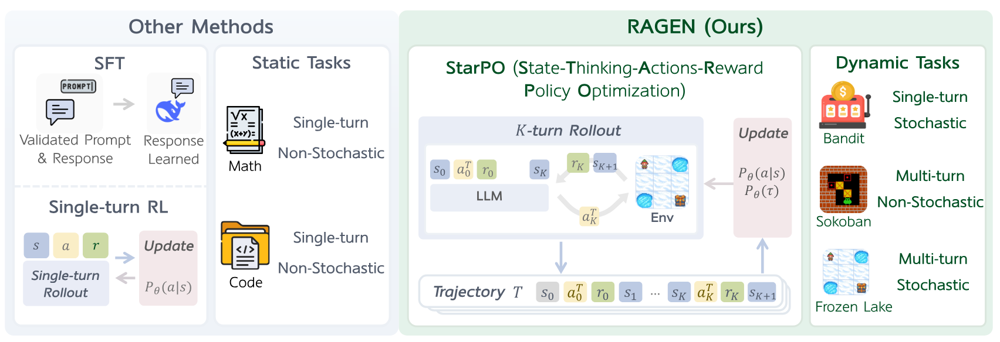

**图 1.** 以往方法关注数学或代码生成等非交互任务. **RAGEN** 在需要多轮随机交互的智能体任务上实现了 StarPO; 这是一套支持多轮 rollout、轨迹级奖励分配和策略更新的通用智能体 RL 框架.

<span id="section-1"></span>

## 1 引言

把大语言模型 (LLM) 训练成在交互环境中工作的自主智能体, 会遇到一些特有问题. 静态任务只需完成单轮数学解题 [Sha24d] 或代码生成 [Dee24b], 而智能体需要连续决策、跨轮保留记忆, 并适应环境的随机反馈. 规划助手、机器人和辅导智能体都依赖这类设置; 模型既要完成任务, 也要从经验中自我改进.

近期工作已经研究了如何用基于规则的奖励对 LLM 进行强化学习 (RL) [Dee25c, Ope24i, Pan25c, Zen25d, Fau24, Gao24f], 但如何训练能通过规则式 RL 自我演化、学会推理与适应的交互式**智能体**, 仍未得到充分研究. LLM 智能体的训练往往不稳定, 奖励信号复杂, 对环境变化的泛化能力也有限; 多轮交互叠加随机反馈时尤其如此. 一个尚未解决的问题是: *哪些设计因素能让自我演化的 LLM 智能体有效而稳定地学习*?

我们在通用 RL 框架 **StarPO** (**S**tate-**T**hinking-**A**ctions-**R**eward **P**olicy **O**ptimization) 下系统研究智能体学习, 以回答这个问题. StarPO 用统一视角描述**多轮、轨迹级智能体训练**, 并允许灵活控制推理、奖励分配和 prompt-rollout 结构. 在 StarPO 之上, 我们开发了模块化智能体训练与评估系统 **RAGEN**, 用来研究基于 RL 的 LLM 智能体训练. RAGEN 实现了包括 rollout 生成、奖励分配和轨迹优化在内的完整训练循环, 为系统分析多轮随机环境中的 LLM 智能体训练动态提供研究基础设施.

在网页浏览等现实任务上训练 LLM 智能体, 往往依赖预训练先验和大量针对任务的工程工作. 我们在四种复杂度不同的环境中评估 RAGEN: **Bandit** (单轮、随机)、**Sokoban** (多轮、确定性)、**Frozen Lake** (多轮、随机) 和 **WebShop** (多轮、开放域). 前三个符号环境**极简且完全可控**, WebShop 则加入了**现实世界理解与推理**. 借助这组环境, 我们可以分析智能体面对不同决策难题时的泛化能力.

基于这套设置, 我们从三个主要维度分析智能体学习, 得到以下结果, 它们揭示了稳定训练智能体 RL 时的主要困难和设计原则:

- **多轮 RL 中的梯度稳定性决定训练能否稳定.** 我们发现, **多轮 RL 训练**经常进入一种反复出现的不稳定模式 **Echo Trap**: 智能体过拟合局部受奖的推理模式, 随之出现奖励变异性坍塌、熵下降和梯度尖峰. 为缓解这种失效模式, 我们提出框架的稳定化变体 **StarPO-S**, 通过基于变异性的轨迹过滤、critic 基线和解耦裁剪提高学习的稳健性.
- **Rollout 的频率和多样性会改变自我演化.** 在基于 RL 的智能体训练中, LLM 自己生成的 rollout 轨迹是主要训练材料. 我们找出了稳定训练智能体 RL 所需的 rollout 因素: (1) rollout 应来自**多样的初始状态**, 且每个初始状态要有**多个响应**; (2) **每轮执行多个动作**, 在轮数上限固定时延长交互跨度; (3) 保持**较高的 rollout 频率**, 让在线反馈反映当前策略.
- **智能体推理的涌现需要细致的奖励信号.** 仅在动作格式中鼓励推理, 并不能保证模型真的推理. 即使 prompt 要求模型使用“**&lt;think&gt;**”token, 并通过 StarPO 做轨迹级优化, 只要推理没有带来明确的奖励优势, 模型仍常常退回直接选择动作. 我们认为, 这是因为 MDP 的动作空间较简单, 浅层策略已经够用. 如果奖励只反映任务是否成功, 模型还会生成**虚构推理**, 思路与环境状态并不一致. 长程智能体训练因此需要**细粒度、推理感知的奖励设计**.

<span id="figure-02"></span>

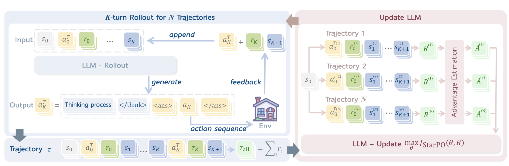

**图 2.** State-Thinking-Actions-Reward Policy Optimization (StarPO) 框架. LLM 为多轮环境交互生成由推理引导的动作, 累积轨迹级奖励, 再将归一化后的奖励用于更新 LLM 策略.

<span id="section-2"></span>

## 2 框架

<span id="section-2-1"></span>

### 2.1 用于智能体训练的 MDP 表述

以往面向语言模型的强化学习 (RL) 通常假设单轮设置, 目标是在从数据集 $\mathcal{D}$ 采样的 prompt-response 对 $(s,a)$ 上最大化期望奖励 $R(s,a)$:

<span id="equation-01"></span>

$$
J_{\mathrm{step}}(\theta)=\mathbb{E}_{s\sim\mathcal{D},a\sim\pi_{\theta}(\cdot|s)}[R(s,a)].
$$

LLM 智能体则必须在多轮展开、反馈带有随机性的交互环境中工作. 为描述这些动态, 我们把问题表述为马尔可夫决策过程 (MDP) $\mathcal{M}=\{S,A,P\}$, 其中 $S$ 表示状态 (如观测序列或交互历史), $A$ 表示动作 (通常是 token 序列), $P$ 表示转移动力学和奖励生成过程. 在每个时间步 $t$, 智能体策略 $\pi_{\theta}$ 根据当前状态 $s_{t}$ 和交互历史生成动作 $a_{t}$. 环境依据当前的转移动力学返回奖励 $r_{t}$ 和新状态 $s_{t+1}$:

$$
a_{t}\sim\pi_{\theta}(\cdot|s_{t},\tau_{<t}),\quad(r_{t},s_{t+1})\sim P(\cdot|s_{t},a_{t}),
$$

其中 $\tau_{<t}=\{s_{0},a_{0},r_{0},...,s_{t-1},a_{t-1},r_{t-1}\}$ 表示交互历史. 这个交互过程最多持续 $K$ 步, 得到完整轨迹 $\tau=\{s_{0},a_{0},r_{0},...,s_{K}\}$, 作为智能体的学习材料.

<span id="section-2-2"></span>

### 2.2 StarPO: 通过轨迹级优化强化推理

我们提出 **StarPO** (State-Thinking-Action-Reward Policy Optimization), 一套用于优化 LLM 智能体完整多轮交互轨迹的通用 RL 框架. 以往静态任务的方法会单独处理每个动作, StarPO 则把包括观测、推理轨迹、动作和反馈在内的**整条轨迹**视为统一的 rollout 与模型优化单元. 其目标是最大化期望轨迹奖励:

<span id="equation-02"></span>

$$
J_{\mathrm{StarPO}}(\theta)=\mathbb{E}_{\mathcal{M},\tau\sim\pi_{\theta}}\left[R(\tau)\right],
$$

其中 $\mathcal{M}$ 是 MDP, $\tau$ 是加入推理的完整交互序列, $R(\tau)$ 表示整条轨迹上的累积奖励. 策略概率 $\pi_{\theta}(\tau)$ 可分解为 token 级似然, 因而 StarPO 可以直接用于自回归 LLM. [图 2](#figure-02) 给出了完整的 StarPO 流程, 下文会逐项说明.

##### StarPO 与以往方法的轨迹级目标对比

**以往方法 (如 PPO [Sch17a]、GRPO [Sha24d]):**

$$
J_{\mathrm{step}}(\theta)=\mathbb{E}_{x\sim\mathcal{D},\,y\sim\pi_\theta(\cdot|x)}\left[R(x,y)\right]
\quad
\text{(给定输入 }x\text{, 优化单轮输出 }y)
$$

**StarPO (本文):**

$$
J_{\mathrm{StarPO}}(\theta)=\mathbb{E}_{\mathcal{M},\tau\sim\pi_\theta}\left[R(\tau)\right]
\quad
\text{(优化轨迹 }\tau=\{s_0,a_0,r_0\dots,s_K\}\text{ 上的总奖励)}
$$

<span id="section-2-2-2"></span>

#### 2.2.2 优化过程: 从推理-交互轨迹中学习

每次训练迭代中, 智能体从初始状态 $s_{0}$ 出发, 生成 $N$ 条轨迹. 在每个时间步 $t$, 智能体生成由推理引导的结构化输出:

<span id="equation-03"></span>

$$
a^T_{t}=\texttt{<think>}...\texttt{</think><answer>}\,a_{t}\,\texttt{</answer>},
$$

其中 $a^T_{t}$ 是包含中间推理的完整动作输出, $a_{t}$ 是一串可由环境执行的子动作. 环境随后返回下一状态 $s_{t+1}$ 和奖励 $r_{t}$. Rollout 阶段生成完整轨迹 $\tau=\{s_{0},a^T_{0},r_{0},s_{1},...,a^T_{K-1},r_{K-1},s_{K}\}$; 其中*每个组成部分要么由 LLM 生成, 要么由环境产生*, 并将接受联合优化.

StarPO 交替执行 rollout 与更新. 新 rollout 可以用 $\pi_{\theta}$ 在策略采样, 也可以从 $\pi_{\text{old}}$ 对应的 replay buffer 中采样. 每个训练循环包含 $P$ 个初始状态 $s_{0}$, 每个状态生成 $N$ 条轨迹, 再以 batch size $E$ 更新, 共执行 $L$ 个循环. 因此, 梯度更新总步数为 $S=\frac{L\cdot P\cdot N}{E}$. 其他训练机制见[第 3 节](#section-3).

<span id="section-2-2-3"></span>

#### 2.2.3 模块化优化策略

在统一的轨迹级抽象下, StarPO 支持多种策略优化算法. 对每条 rollout 轨迹 $\tau_{i}=\{\tau_{i,(1)},\ldots,\tau_{i,(|\tau_{i}|)}\}$, 其 token 总数为 $|\tau_{i}|$, 我们用以下优化策略实例化 StarPO, 执行 token 级更新:

- **PPO [Sch17a].** 我们采用 PPO 目标 (更多细节见[附录 A](#appendix-a)), 并训练 critic 来估计 token 级价值和优势 $A_{i,t}$:

<span id="equation-04"></span>

$$
J_{\mathrm{PPO}}(\theta)=\frac{1}{G}\sum_{i=1}^{G}\frac{1}{|\tau_i|}\sum_{t=1}^{|\tau_i|}
\min\left[
\frac{\pi_\theta(\tau_{i,(t)}|\tau_{i,<t})}{\pi_{\text{old}}(\tau_{i,(t)}|\tau_{i,<t})}\cdot A_{i,t},\,
\mathrm{clip}\left(\frac{\pi_\theta(\tau_{i,(t)}|\tau_{i,<t})}{\pi_{\text{old}}(\tau_{i,(t)}|\tau_{i,<t})},1-\varepsilon,1+\varepsilon\right)\cdot A_{i,t}
\right],
$$

其中 $G$ 是 batch 中的轨迹数, $\tau_{i,(t)}$ 表示轨迹 $\tau_i$ 的第 $t$ 个 token, $\tau_{i,<t}$ 是它的前缀.

- **GRPO [Sha24d].** 使用无 critic 的 GRPO 训练时, 我们为每条轨迹分配标量奖励 $R(\tau_i)$, 并在 $\tau_i$ 的所有 token 上分配归一化优势 $\hat{A}_{i,t}$:

<span id="equation-05"></span>

$$
\hat{A}_{i,t}=\frac{R(\tau_i)-\mathrm{mean}(\{R(\tau_1),\ldots,R(\tau_G)\})}{\mathrm{std}(\{R(\tau_1),\ldots,R(\tau_G)\})}.
$$

GRPO 目标变为:

<span id="equation-06"></span>

$$
J_{\mathrm{GRPO}}(\theta)=\frac{1}{G}\sum_{i=1}^{G}\frac{1}{|\tau_i|}\sum_{t=1}^{|\tau_i|}
\min\left[
\frac{\pi_\theta(\tau_{i,(t)}|\tau_{i,<t})}{\pi_{\text{old}}(\tau_{i,(t)}|\tau_{i,<t})}\cdot\hat{A}_{i,t},\,
\mathrm{clip}\left(\frac{\pi_\theta(\tau_{i,(t)}|\tau_{i,<t})}{\pi_{\text{old}}(\tau_{i,(t)}|\tau_{i,<t})},1-\varepsilon,1+\varepsilon\right)\cdot\hat{A}_{i,t}
\right].
$$

<span id="section-2-3"></span>

### 2.3 RAGEN 系统

为在实践中实现 StarPO, 我们构建了 **RAGEN**, 一套用于在受控环境中训练 LLM 智能体的完整系统. RAGEN 支持结构化 rollout、可定制的奖励函数, 也能接入多轮随机环境. 它既是 StarPO 的执行后端, 也是研究推理智能体训练稳定性、泛化和学习动态的平台. RAGEN 具有可扩展性: 新环境、奖励方案或 rollout 策略都可以方便地接入, 作为基于 RL 的智能体训练基础.

<span id="section-3"></span>

## 3 实验设置

<span id="section-3-1"></span>

### 3.1 环境与任务

我们在四种环境上评估 LLM 智能体, 覆盖符号式和现实决策: **Bandit** 测试智能体在噪声反馈下的风险敏感推理; **Sokoban** 要求不可逆的符号规划; **Frozen Lake** 把规划与概率转移结合起来; **WebShop** 则涉及自然语言落地和网页环境交互. 前三个符号环境刻意保持极简和完全可控, 便于清晰分析; WebShop 加入了现实任务结构和语言输入. 环境示意见附录 C.1.

<span id="section-3-2"></span>

### 3.2 训练设置

在主要实验中, 三个符号任务使用 Qwen-2.5 Instruct 0.5B 模型, 难度更高的 WebShop 使用其 3B 变体. 附录 [D](#appendix-d) 还报告了不同规模模型的表现. 模型在 H100 GPU 上用 StarPO 变体训练 100-200 次 rollout-update 迭代. 每个 batch 采样 $P{=}8$ 个 prompt, 每个 prompt 生成 $N{=}16$ 条 rollout, 最多 5 轮、10 个动作. 策略更新使用带 GAE ($\gamma{=}1.0,\lambda{=}1.0$) 的 GRPO 或 PPO、Adam 优化器、熵奖励 ($\beta{=}0.001$), 并设置 response-format penalty ($-0.1$). 细节见附录 C.2.

<span id="section-3-3"></span>

### 3.3 评估指标

每个环境使用 256 个固定 prompt 评估, temperature 为 $T{=}0.5$, episode 在 5 轮后截断. 指标包括: **(i)** 成功率 (任务完成情况), **(ii)** rollout 熵 (探索程度), **(iii)** 组内奖励变异性 (行为多样性), **(iv)** 响应长度 (推理详略程度), 以及 **(v)** 梯度范数 (训练稳定性). 所有指标都在验证实例上计算. 细节见附录 C.3.

<span id="section-4"></span>

## 4 实验结果与发现

<span id="section-4-1"></span>

### 4.1 多轮智能体 RL 训练带来新的不稳定模式

我们在各项智能体任务上评估基线 StarPO ([图 3](#figure-03)). Bandit 和 Sokoban 等符号环境起初有所提升, 最终却发生坍塌. 在这些环境中, PPO 比 GRPO 更稳定, 坍塌更晚、性能更高; 原因可能是 PPO 的 critic 能提供更平滑的奖励估计. 有意思的是, GRPO 在 Frozen Lake 上更稳定, 可能因为该任务难以估计状态价值, 反而会使 PPO 不稳定 (见附录 [I](#appendix-i)). 在 WebShop 上, 两种方法都能成功; 这可能来自较强的语言先验和较高的初始奖励, 因而不太需要 critic 来稳定训练.

<span id="figure-03"></span>

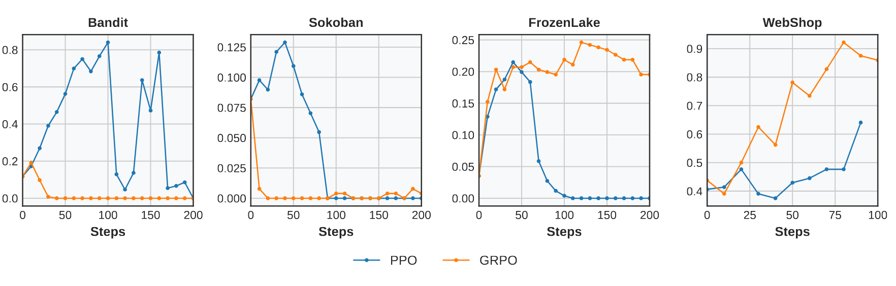

**图 3.** **StarPO 基线在各环境中的表现.** Bandit 和 Sokoban 等符号任务会发生坍塌, 现实环境 WebShop 则从较高水平起步并迅速改善. PPO 在 Bandit 和 Sokoban 中更强, 因为它能提供更稳定的 token 级奖励信号; GRPO 在 Frozen Lake 和 WebShop 中更强, 前者的随机性使状态价值难以估计, 后者的初始性能较强, 不太需要 critic 稳定梯度.

为理解坍塌的成因, 我们比较了训练早期和后期的轨迹. 在 Bandit 任务中, 早期轨迹对符号含义和期望奖励给出多样化推理, 后期响应则变得重复且确定. 这表明, **RL 训练可能过度放大了模型固有的推理捷径**, 一边强化局部受奖的模板, 一边压制探索. 我们把这种失效模式称为“**Echo Trap**”. 它与 [Shu24] 的发现相似: 模型用自己生成的轨迹训练时, 会反复复用记住的推理路径, 最终导致多样性坍塌和长期性能下降. 示例见附录 [F](#appendix-f).

为检测坍塌, 我们监控两个主要指标: (1) **平均奖励**, 其平台期或下降表明任务性能退化; (2) **梯度范数**, 其尖峰表明更新不稳定. 为捕捉早期迹象, 我们还跟踪 rollout 级信号: (1) **奖励标准差**, 反映策略仍在产生多样结果, 还是已经坍缩成重复行为; (2) **输出熵**, 反映模型预测有多确定.

<span id="figure-04"></span>

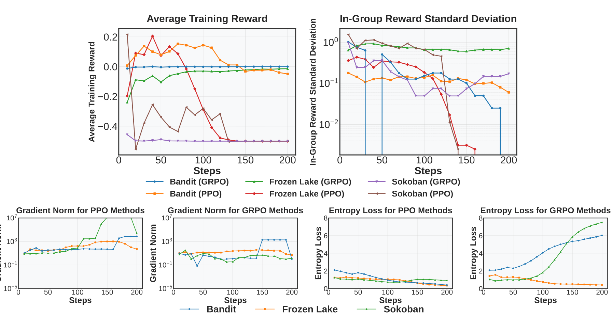

**图 4.** **多轮 RL 中的坍塌指标和早期预警信号.** 平均奖励和梯度范数 (左侧图) 直接反映坍塌, 平台与尖峰可确认性能及训练是否不稳定. 奖励标准差和熵 (右侧图) 往往在奖励下降前先变得不稳定, 可作为早期预警信号.

[图 4](#figure-04) 汇总了不同任务和优化方法中的动态. 根据结果, 我们对**多轮智能体 RL 中模型坍塌的形成方式**得到以下结论:

- **奖励标准差是收敛的早期指标.** 在 FrozenLake-PPO 中, std 在第 40 步骤降, 明显早于平均奖励在第 90 步、性能接近最优时发生的坍塌. 在 Bandit-PPO 中, std 在第 70 步左右触底, 早于奖励在第 120 步达到峰值. 在 Sokoban-PPO 中, std 和均值在第 10 步附近同时坍塌, 表明模型很早就已饱和.
- **梯度范数尖峰表示不可逆的坍塌.** 一旦出现梯度范数尖峰, 例如 Bandit 的第 170 步、Sokoban 的第 110 步和 FrozenLake 的第 90 步, 很小的参数更新也可能造成损失剧烈变化, 此后很难恢复.
- **有效学习期间, 熵应保持稳定的衰减趋势.** FrozenLake-GRPO 就表现出这一现象. 熵快速上升或无规律变化, 往往与推理行为坍塌相关, Bandit 和 Sokoban 上的 GRPO 便是如此.

这些模式说明, 多轮 RL 带来了单轮 RL 方法无法处理的特有问题. 因此, 我们提出稳定化变体 **StarPO-S**, 从采样质量、梯度稳定性和探索正则化入手, 避免过早坍塌.

<span id="section-4-2"></span>

### 4.2 StarPO-S: 通过实例过滤和梯度塑形稳定多轮 RL

针对多轮强化学习的不稳定性, 我们提出 StarPO 的稳定化变体 **StarPO-S**. 它加入三项改动, 用来提高训练的稳健性和效率. 奖励标准差下降往往先于坍塌出现, 由此带来一个问题: *是否应该在行为更不确定、奖励变异性更高的任务实例上加强训练*?

我们假设, 最有效的训练样本应当是智能体**对结果不确定**的样本, 排除过于简单或过于困难的任务实例. 这个想法来自主动学习 [Set09]: 不确定的样本最有信息量, 也最值得模型学习. 对给定的智能体任务实例 (MDP $\mathcal{M}=\{S,A,P\}$ 中的初始状态 $s_{0}$), 我们把策略 $\pi_{\theta}$ 的轨迹级结果不确定性 $U$ 定义为:

<span id="equation-07"></span>

$$
\mathrm{U}(\pi_{\theta},\mathcal{M},s_{0})=\mathrm{Std}_{\tau\sim\pi_{\theta}(\cdot|s_{0})}\left[R(\tau)\right].
$$

训练时, 我们根据重复 rollout 所得奖励的标准差对 prompt 排序, 每一步训练**只保留不确定性最高的前 $p$% prompt**. [图 5](#figure-05) 展示了 StarPO-S 下改变 $p$ 对 PPO 和 GRPO 的影响. 附录 [E](#appendix-e) 进一步验证了基于不确定性的过滤效果.

在 PPO 实验中 ([图 5](#figure-05) 左), 过滤低变异性 rollout 明显推迟了坍塌: 保留 75% 的 rollout, 可将 FrozenLake 的稳定期从 100 步延长到 140 步; 保留 50% 时则完全避免了坍塌. GRPO 因为没有 critic, 稳定性仍较差, 但也得到了一定改善. 过滤还提高了效率 ([图 5](#figure-05) 右). StarPO-S 默认采用 25%. 不过, 这个激进的取值未必适合所有场景. Sokoban 和 FrozenLake 很适合强过滤, 可能是因为它们的推理模式较为重复, 在预训练数据中也缺少代表; 相似轨迹占据 batch 时, 模型更容易坍塌. 附录 [D](#appendix-d) 还给出了更大模型 (72B) 以及 GPT-4o、Qwen-2.5-72B 等前沿模型的结果, 以便更好地理解本文模型的表现.

除基于不确定性的过滤外, 我们还采用 DAPO [Yu25g] 为单轮 RL 设计的两种梯度塑形技术: **移除 KL 项**和 **Clip-Higher** (非对称裁剪). 我们将它们扩展到多轮智能体设置并加以评估, 发现两种方法都能提高成功率、延长稳定训练阶段, 表明更灵活的梯度塑形有利于多轮 RL. 设计细节和性能消融见附录 [D](#appendix-d).

<span id="figure-05"></span>

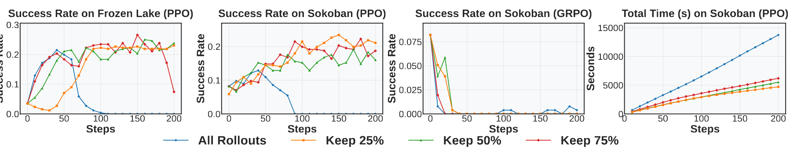

**图 5.** **基于不确定性的过滤对多轮 RL 稳定性的影响. 过滤低变异性轨迹可以降低坍塌风险、提高成功率. 对 PPO 变体而言, 过滤超过一半轨迹后, 坍塌基本得到缓解. 训练时间也随之缩短.**

**整体比较.** [图 6](#figure-06) 在三个任务上比较 StarPO-S 和原始 StarPO. StarPO-S 始终能推迟坍塌并提高最终任务性能. 我们认为, 收益来自选择性更强的训练数据 (通过不确定性过滤) 和更均衡的优化信号 (通过移除 KL 与解耦裁剪), 它们减少了推理模式的收窄. 附录 [D](#appendix-d) 还讨论了可能稳定训练、提高性能的其他变体, 如选择性 response mask 和双层广义优势估计 (GAE) [Wan25ak].

<span id="figure-06"></span>

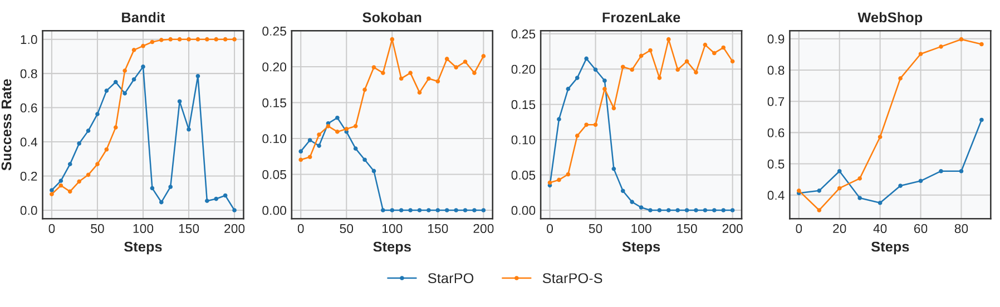

**图 6.** **StarPO-S 改善了各任务的稳定性和最终性能. 与原始 StarPO 相比, StarPO-S 缓解了四项任务中的坍塌, 并取得更高的成功率.**

<span id="section-4-3"></span>

### 4.3 为 RL 训练生成有用轨迹

RL 训练高度依赖轨迹质量. 我们在原始 Sokoban 上训练, 再在 SokobanNewVocab、LargeSokoban 和 FrozenLake Task 等任务上评估, 研究 rollout 的三个主要维度: *任务多样性*、*交互粒度*和 *rollout 频率*. 这些任务的细节见附录 [K](#appendix-k).

**提高任务多样性并比较响应, 可以改善泛化.** 任务多样性指每个 rollout-update 周期使用的不同 prompt 数量. Batch size 固定时, 它与每个 prompt 的响应数量相互制约. 在实验中 ([表 1](#table-01)), 我们改变两者的比例, 发现减少每个 prompt 的响应数 (如每个 prompt 生成 4 个响应) 可以提高任务多样性, 并持续改善泛化. 但每个 prompt 仍须包含多条 rollout, 让智能体能在相似条件下比较不同结果.

**增加动作预算有利于规划, 但过长的 rollout 会引入噪声.** [表 2](#table-02) 改变了每轮允许执行的动作数. 每轮最多执行 5 或 6 个动作时表现最好, 在 SokobanNewVocab 和 LargeSokoban 等复杂环境中尤其明显. 这个设置为规划留出了足够空间, 又避免了 rollout 过长造成的混乱. 将预算增至 7 个动作后, 性能反而下降, 可能是噪声转移和稀释的奖励反馈所致.

<span id="table-01"></span>

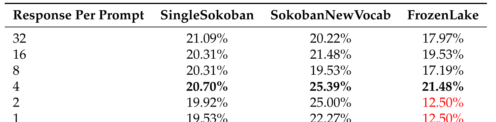

**表 1.** **任务多样性对泛化性能 (%) 的影响.** 使用多个响应时, 较高的多样性取得最佳表现 (每个 prompt 4 个响应).

<span id="table-02"></span>

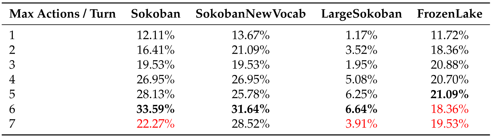

**表 2.** **不同每轮动作预算下各环境的性能 (%).** 每轮执行 5-6 个动作时表现最佳, 能很好地平衡有效的多步规划.

<span id="table-03"></span>

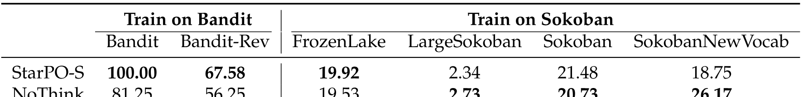

**表 3.** **StarPO-S 中有无推理时的泛化性能 (%).** 禁用推理会明显降低单轮 Bandit 任务的泛化, 但对多轮 Sokoban 任务的影响不一或很小.

**频繁更新 rollout, 可使优化目标与当前策略行为保持一致.** 为研究 rollout 新鲜度的影响, 我们采用 *Online-$k$* rollout 策略, 将同一组 rollout 连续复用于 $k$ 次策略更新. $k$ 越小, 收集 rollout 越频繁. *Online-1* 对应完全在线的设置, 每次更新迭代都会收集新 rollout. 如[图 7](#figure-07) 所示, 与延迟更新 (如 *Online-5* 或 *Online-10*) 相比, 使用较新 rollout (*Online-1*) 训练的智能体收敛更快, 在各任务上的泛化也更好. 这支持多轮 RL 的一个主要设计原则: 轨迹反映智能体最新行为时, 学习最有效. 频繁 rollout 能减少策略与数据之间的失配, 提高优化稳定性.

<span id="section-4-4"></span>

### 4.4 推理改善泛化, 但没有细粒度奖励时会在多轮设置中消退

我们考察符号推理如何影响智能体泛化. 推理能改善 Bandit 等单轮任务的表现, 却无法在 Sokoban 等复杂多轮环境中增长或保持. 下面逐步分析这些影响.

**推理轨迹改善单轮 Bandit 任务的泛化.** 我们在符号 Bandit 环境中设计了一项受控泛化测试. 在原始 `Bandit` 设置中, 模型用 `[Teacher, Engineer]` 这对 arm 训练, 再在 `[Librarian, Trader]` 上评估, 保留直观的风险-收益对应关系 (即 `Engineer` 和 `Trader` 都是高风险、高收益). `BanditRev` 则将这些关联反转, 为职业赋予反直觉的奖励分布, 使推理更困难.

如[表 3](#table-03) 所示, 用推理轨迹训练的模型在 `Bandit` 上泛化更好, 在反直觉的 `BanditRev` 中也一样, 表明推理监督帮助模型越过记忆, 内化符号线索. 尽管 `BanditRev` 更难, 带显式推理的模型仍持续优于不带推理的模型, 如[表 3](#table-03) 所示. 这说明, 即使语义与奖励错位, 推理轨迹也能帮助智能体内化符号-奖励关联, 泛化到表层记忆之外.

**在多轮任务中, 推理信号会随训练逐渐消退.** 与单轮设置不同, 我们发现推理在 Sokoban 和 FrozenLake 等多轮环境中收益有限. 即使输出格式明确包含 `<think>` 段, 将其删除 (no-think 变体) 后, 性能往往相当甚至更好. 为理解这种退化, 我们分析训练期间的平均响应长度 ([表 4](#table-04)、[图 14](#figure-14)), 发现推理轨迹会持续缩短, 表明模型在压制自己的思考过程. 而在语义错位、必须依靠推理的 `BanditRev` 任务中, 轨迹保持得更长; 上下文更难时, 推理也更容易维持.

我们推测, 推理坍塌可能来自**多轮任务中稀疏、延迟的奖励结构**; 这种结构常常无法区分连贯推理和试错带来的成功. 附录 [L](#appendix-l) 的示例支持这一点: 模型生成不连贯或虚构的推理, 仍能得到高奖励. 由此产生一个重要问题: *如果奖励本身不能反映推理质量, 怎样才能持续强化有用推理?* 一种可能的办法是用格式惩罚把动作正确性与推理质量解耦: 与 [Sha24d] 类似, 我们对缺少有效 `<think>`-`<answer>` 结构的输出施加小额惩罚, 鼓励结构化推理. 未来工作可以探索更细粒度的奖励设计, 例如奖励部分正确的结果, 从而在长程决策中可靠地强化推理.

<span id="table-04"></span>


**表 4.** **不同训练步骤下的推理长度 (`<think>` 块长度).** Token 长度通常随时间下降, `ReverseBandit` 等上下文更难的问题比原始版本需要更多推理.

<span id="figure-07"></span>

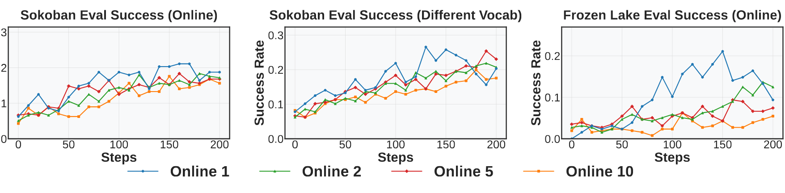

**图 7.** **不同 rollout 频率 (*Online-$k$*) 下的性能. 我们改变 rollout 复用因子 $k$, 每个 batch 复用于 $k$ 次策略更新. $k$ 较低 (如 *Online-1*) 表示 rollout 更频繁. 较新的数据与当前策略保持一致, 因而改善了收敛.**

<span id="section-5"></span>

## 5 相关工作

近期工作一方面用**强化学习 (RL)** 微调 LLM 的多步推理能力, 另一方面开发智能体框架来组织决策任务. 推理技术包括经典 PPO [Sch17a]、actor-critic 方法 [Haa18], 以及借助 meta token 的结构化 prompting [Goy24, Her24]. RLOO [Koo19]、GRPO [Dee25c] 和 DAPO [Yu25g] 等策略变体可能稳定训练并提高样本效率. STaR [Zel22b] 和基于 MCTS 的推理 [Hao23] 等平行工作则以很少的监督促进逐步推理.

**智能体方面.** 系统从早期的反应式规划 [Yao23b, Xu23b], 发展到模块化决策流水线 [Liu23q, Wu23c]、多智能体协作 [Li23t, Wan24y] 和具身交互 [Lin24g, Li25ad]. Sokoban [Jun01]、FrozenLake [Del21] 和 WebShop [Yao22c] 等 benchmark 为评估不同动态下的推理提供了受控测试环境. 本文在这些工作的基础上, 试图跨符号任务和语言任务, 把基于 RL 的推理与结构化智能体训练统一起来. 更多相关工作见附录 [B](#appendix-b).

<span id="section-6"></span>

## 6 结论与局限

我们提出 RAGEN, 一套在多轮随机环境中用强化学习训练语言智能体的通用系统. RAGEN 建立在 StarPO 框架上, 能进行推理引导的轨迹优化, 也揭示了智能体训练特有的新问题, 如梯度坍塌、rollout 漂移和推理退化. 通过大量实验, 我们找到了稳定训练的主要设计原则, 包括 rollout 过滤、梯度塑形和奖励感知的推理监督. 这些发现为构建更稳健、泛化更好的 LLM 智能体提供了基础. 我们的框架是一个可扩展的平台, 可用于研究符号推理、网页浏览等领域的自主语言智能体. 本文的局限包括: 任务规模相对较小, 没有采用 replay buffer 等成熟的 RL 实践, 也没有纳入多模态任务; 这些内容留待后续研究.

## 致谢

感谢 DeepSeek 团队提供 DeepSeek-R1 模型及早期概念启发. 感谢 veRL 团队提供基础设施支持, 也感谢 TinyZero 团队的发现为我们的初步探索提供参考. 感谢 Han Liu、Xinyu Xing、Monica Lam、Li Erran Li、John Schulman、Akari Asai、Eiso Kant、Lu Lu、Runxin Xu、Zhihan Liu、Huajian Xin、Zijun Liu、Weiyi Liu、Weimin Wu、Yibo Wen、Jiarui Liu、Lorenzo Xiao、Ishan Mukherjee、Anabella Isaro、Haosen Sun、How-Yeh Wan、Lester Xue、Matthew Khoriaty、Haoxiang Sun 和 Jiajun Liu 参与富有启发的讨论.

<span id="appendix-a"></span>

## 附录 A 强化学习背景

强化学习 (RL) 让基础模型通过交互和奖励信号学习. 一般的 RL 目标为:

<span id="equation-08"></span>

$$
J(\theta)=\mathbb{E}_{s\sim\mathcal{D},a\sim\pi_{\theta}(\cdot|s)}[R(s,a)],
$$

其中 $\pi_{\theta}$ 是策略, $s$ 是输入 prompt, $a$ 是响应, $R(s,a)$ 是评估响应质量的奖励函数.

常用 RL 方法会使用奖励建模和策略优化. Proximal Policy Optimization (PPO) [Sch17a] 通过概率比裁剪和优势估计稳定训练. 概率比定义为:

<span id="equation-09"></span>

$$
\rho_{t}(\theta)=\frac{\pi_{\theta}(a_{t}|s_{t})}{\pi_{\theta_{old}}(a_{t}|s_{t})}
$$

PPO 目标通过裁剪使用这个比值:

<span id="equation-10"></span>

$$
J_{\mathrm{PPO}}(\theta)=\mathbb{E}_{t}[\min(\rho_{i}A_{i},\hat{\rho_{i}}A_{i})-\beta D_{\mathrm{KL}}],
$$

其中概率比 $\rho_{i}=\frac{\pi_{\theta}(o_{i}|q)}{\pi_{\theta_{old}}(o_{i}|q)}$, 裁剪后的比值为 $\hat{\rho_{i}}=\mathrm{clip}(\rho_{i},1-\varepsilon,1+\varepsilon)$.

在优势估计方面, Generalized Advantage Estimation (GAE) [Sch15] 计算:

<span id="equation-11"></span>

$$
A_{t}^{\mathrm{GAE}(\gamma,\lambda)}=\sum_{l=0}^{\infty}(\gamma\lambda)^{l}\delta_{t+l}
$$

其中 $\delta_{t}=r_{t}+\gamma V(s_{t+1})-V(s_{t})$ 是 TD error, $(\gamma,\lambda)$ 控制 bias-variance 权衡.

近期, DeepSeek-R1-Zero [Dee24e] 通过 Group Relative Policy Optimization (GRPO) 实现了这一范式: 为每个 prompt 采样 $G$ 个输出 $\{o_{i}\}$ [由推理和动作组成], 并优化:

<span id="equation-12"></span>

$$
J_{\mathrm{GRPO}}(\theta)=\mathbb{E}_{q,\{o_{i}\}}[J_{\mathrm{group}}(\theta)],
$$

其中:

<span id="equation-13"></span>

$$
J_{\mathrm{group}}(\theta)=\frac{1}{G}\sum^{G}_{i=1}\min(\rho_{i}A_{i},\hat{\rho_{i}}A_{i})-\beta D_{\mathrm{KL}},
$$

GRPO 大体与公式 3 相似, 但其优势不依赖神经模型, 计算方式为:

<span id="equation-14"></span>

$$
A_{i}=\frac{r_{i}-\mathrm{mean}(\{r_{j}\})}{\mathrm{std}(\{r_{j}\})}.
$$

这种纯 RL 方法使用基于规则的奖励 $r_{i}$, 表现出了涌现的推理行为.

<span id="appendix-b"></span>

## 附录 B 扩展相关工作

**LLM 推理的强化学习.** 在 LLM 上应用强化学习 (RL) [Chr23, Ouy22b, Che21a, Hav24], 已明显改善其推理能力. 主要方法包括 Proximal Policy Optimization Algorithms (PPO) [Sch17a], 它通过裁剪策略更新, 在提升性能的同时保持训练稳定; Group Relative Policy Optimization (GRPO) [Dee25c], 用来增强系统化解题能力; SAC [Haa18] 和 ArCHer [Zho24i] 等 actor-critic 方法, 借助 critic 促进稳健探索与稳定训练; 以及用于结构化思考的 meta token [Goy24, Her24, Pfa24]. 其他重要进展包括 Process Reward Model (PRM) [Zha25av, Lig23a] 和基于 Monte Carlo Tree Search (MCTS) 的系统化解题方法 [Hao23]. 另一方面, 近期 LLM 推理研究尝试让模型生成中间 chain-of-thought rationale. STaR [Zel22b] 反复利用少量 rationale 示例和大量不带 rationale 的数据. SimpleRL-Zoo [Zen25e]、DAPO [Yu25g]、RLOO [Koo19]、Dr. GRPO [Liu25u] 和 Open Reasoner Zero [Hu25f] 等工作都表明, 采用解耦裁剪、无偏优化和简单奖励方案的极简、可复现 RL 技术, 可以明显提高 LLM 的推理性能.

**现有智能体框架.** 基于 LLM 的智能体架构从早期 reasoning-action 框架 [Yao23b, Shi23c, Xu23b, Lin24h], 逐步发展为结构化方法 [Liu24u, Liu23q, Hao23, Zen25c]. 多智能体系统 [Du23a, Li23t, Che23f, Wan24y] 面向交互更复杂的任务. OpenAI Gym [Bro16] 等通用平台以及 Sokoban [Jun01]、FrozenLake [Del21]、Webshop [Yao22c] 等专用环境, 为评估智能体提供了多样的测试条件. 通用系统 [She23c, Wu23c, Hao23a, Zhu23a, Xie23a] 已支持从网页导航和搜索 [Qi25a, Jin25b, Wei25g, Jin25f]、coding copilot [Jim24, Dee24b, Wan24z], 到 GUI [Qin25a, Yao22c]、游戏 [Hu25g] 和具身任务 [Lin24g, Xi24a, Li25ad, Fen25b] 的广泛应用. Generative Agents 和 AgentSims [Par23a, Lin23b] 推进了社交交互能力. 不过, 架构复杂度和自我纠正 [He25c] 仍是难题, 面对多样的多步推理任务时尤其如此 [Wan25al, Ngu24a, Son24b].

<span id="appendix-c"></span>

## 附录 C 详细实验设置

### C.1 环境与任务

<span id="figure-08"></span>

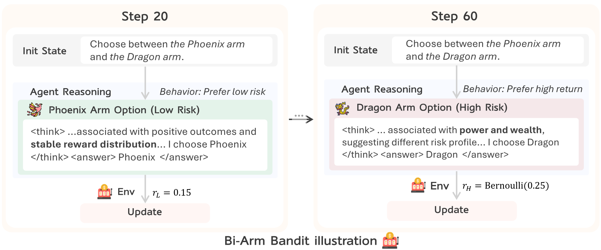

**图 8.** **双臂 Bandit 环境. 智能体在低风险 arm (Phoenix) 和高风险、高回报 arm (Dragon) 之间选择, 两者都与符号语义关联. 智能体在早期学会选择稳定奖励, 随后通过推理追求最大期望奖励, 转向策略性冒险.**

<span id="figure-09"></span>

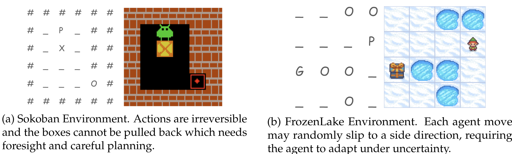

**图 9.** Sokoban 与 Frozen Lake 环境. 对每个环境, 左侧是智能体观察到的文本渲染, 右侧是可视化图示. (a) Sokoban 是确定性的多轮谜题, 智能体需要把箱子推到目标位置. (b) Frozen Lake 结合了多轮推理与随机性, 智能体需要抵达礼物位置才能成功.

我们构建了一个**包含四种多样环境的测试平台**, 从决策复杂度的主要维度评估 LLM 智能体. Bandit、Sokoban 和 Frozen Lake 是符号式、合成且完全可控的环境, 可以清晰分析从零开始的 RL 学习. 它们被刻意设计得很简单, 与现实世界先验脱钩; 即使 GPT-4o 等大模型未经训练也表现很差, 说明策略学习需要环境落地. 作为补充, WebShop 是一项现实的多轮任务, 涉及自然语言落地和半结构化界面中的网页导航. 这四种环境共同支持我们系统研究符号式和开放域设置下智能体 LLM 的推理、训练稳定性与泛化.

每种环境侧重一项不同能力: Bandit 测试不确定条件下的推理, Sokoban 强调不可逆的长程规划, Frozen Lake 包含随机转移, WebShop 要求语言理解和目标导向的交互.

**双臂 Bandit.** 我们设计这个环境, 用来评估智能体能否**形成风险敏感的假设, 并根据训练修正假设**. 每一步中, 智能体必须在两个具有符号语义的选项之间选择, 如“Dragon”和“Phoenix”; 每个选项都对应固定的奖励分布 ([图 8](#figure-08)). 低风险 arm 始终返回 $0.15$ 的奖励, 高风险 arm 则从 $\mathrm{Bernoulli}(0.25)$ 采样: 方差更高, 期望回报也更高.

虽然高风险 arm 的期望更好, 每次试验中却是低风险 arm 更常胜出. 这样的设计用于测试推理: 没有归纳偏置时, 模型可能因为低风险 arm 成功得更频繁而偏爱它; 推理智能体则必须学会把符号线索 (如“Dragon”) 与底层奖励统计关联起来, 抵抗误导性的短期信号, 并根据长期期望回报“论证”高风险选择. 我们还将符号标签反转, 测试智能体在相反奖励体系下的推理.

**Sokoban.** 我们用 Sokoban 谜题 ([图 9](#figure-09)) 研究多轮智能体交互. 智能体必须在有限步数内, 将网格中的箱子推到目标位置. Sokoban 与标准导航不同, 动作不可逆: 箱子只能推, 不能拉回, 所以智能体必须提前推理, 避免进入死路. 奖励信号鼓励效率和准确性: 每个到达目标的箱子奖励 $+1$, 离开目标的箱子奖励 $-1$, 完成任务奖励 $+10$, 每个动作奖励 $-0.1$.

**Frozen Lake.** 这个环境 ([图 9](#figure-09)) 将长程决策与随机转移结合起来. 智能体在有湿滑方格的网格中导航; 每个动作以 $1/3$ 的概率按预期执行, 以 $2/3$ 的概率向垂直方向偏移. 智能体应在不掉入洞中的情况下到达目标. 奖励稀疏: 成功试验获得 $+1$, 其余为 $0$.

**WebShop.** 为补充符号环境, 我们加入 WebShop [Yao22c]. 这是一项多轮网页购物任务, 用来测试智能体理解自然语言查询、导航半结构化界面和检索目标相关信息的能力. 智能体必须通过发出搜索查询、点击链接和阅读商品描述, 选择符合用户要求的商品; 它引入了纯符号设置中没有的现实语言落地和动作空间问题.

### C.2 训练与评估设置

实验使用 Qwen2.5-0.5B-Instruct [Yang24], 在 NVIDIA H100/A100 GPU 上借助 veRL 仓库 [+verl] 用 StarPO 变体训练, 最多执行 200 次 rollout-update 迭代. WebShop 的上下文很长, 训练耗时极大, 因而只训练 100 步. 每组环境的每次 rollout 包含 $K=16$ 条轨迹, prompt size 为 $P=8$, 每个 episode 最多交互 5 轮. 智能体每轮最多执行 5 个动作, 每个 episode 最多执行 10 个动作. Update batch size 为 $E=32$, 每个 GPU 的 mini-batch size 为 4. 策略优化使用 GAE, $(\gamma=1.0,\lambda=1.0)$; 优化器使用 Adam, $(\beta_{1},\beta_{2})=(0.9,0.999)$. 我们采用熵正则化 ($\beta=0.001$). 原始 StarPO 实验使用 0.001 的 KL 系数和 $\mathrm{k1}$ 估计 [+kl], 按照 [Yu25g] 在训练时不加入 KL loss term, 事后跟踪 KL. 如果智能体未能输出有效的结构化响应 (如缺少 `<think>` 或 `<answer>` 标签), 我们施加 $-0.1$ 的格式惩罚, 鼓励模型遵守响应约定. 为加快 rollout 生成, 我们禁用 `enforce_eager`, 并在 vLLM 的 prefill 和 sampling 之间保留 computation graph. 多 GPU 实验采用 Fully Sharded Data Parallel (FSDP) 训练策略. 分布式训练使用 Ray 作为 multiprocessing backend, attention 实现为 XFORMERS.

[+verl]: https://github.com/volcengine/verl

[+kl]: http://joschu.net/blog/kl-approx.html

评估时, 每个环境选取固定的 256 个输入 prompt, 以 temperature $T{=}0.5$ 解码并进行随机采样, 更好地反映智能体行为的稳健性. Episode 在 5 轮或总动作数达到 10 后截断.

### C.3 评估指标

为跟踪智能体的学习动态并检测训练不稳定, 我们在整个训练期间监控以下指标. 除成功率在固定验证集上评估外, 其余指标均在验证实例上计算.

- **平均成功率.** 衡量固定验证 prompt 集合上的任务完成准确率. 智能体解决任务时, 对应 episode 记为成功 (例如在 Bandit 中拉动高回报 arm, 在 Sokoban 中把所有箱子推到目标, 在 Frozen Lake 中到达终点, 或在 WebShop 中成功购买商品).
- **Rollout 熵.** 计算采样响应的平均 token 级熵, 反映探索程度和策略不确定性. 熵骤降可能表示策略过早收敛或坍塌.
- **组内奖励方差.** 衡量从同一 prompt 组采样的 rollout 奖励标准差. 较高的组内方差表示行为多样、仍有学习空间; 方差突然坍塌则表示奖励同质化和策略停滞.
- **总响应长度.** 每条 rollout 生成的平均 token 数, 用来衡量智能体的详略程度和推理深度. 长度波动可能表示规划风格或信心发生变化.
- **梯度范数.** 策略梯度向量的 $\ell_{2}$ 范数, 作为训练稳定性的代理指标. 尖峰往往与策略行为的相变或不稳定奖励信号相关.

这些指标从策略质量、更新动态和推理行为提供互补视角, 有助于诊断智能体训练何时以及为何成功或失败.

<span id="appendix-d"></span>

## 附录 D 更大模型与不同优化算法的结果

我们将全部评估扩展到 3B/7B/72B 模型, 并研究移除 KL、非对称裁剪等不同算法选择, 以及 Generalized Advantage Estimation (GAE) 和 response masking 等 turn-aware 优化技术的影响.

**扩展效应.** 我们把训练模型扩展到 3B/7B, 评估 RL 训练的扩展效应. 结果见[图 10](#figure-10). WebShop 的上下文极长, 7B 模型在 4xH100 上会出现 OOM Error, 因此 WebShop 任务只报告 3B 模型. 在 **Bandit** 和 **WebShop** 上, 大模型明显强于小模型. 但在 **Sokoban** 和 **FrozenLake** 上, 提升很小. 我们把这种差异归因于环境性质: Sokoban 和 FrozenLake 是符号化网格任务, 与预训练数据重合很少, 因而模型难以利用语言先验. Bandit 和 WebShop 则涉及自然语言交互; 即使没有显式的环境动力学, 预训练模型也能更有效地利用语言模式学习策略. [图 16](#figure-16)、[17](#figure-17)、[18](#figure-18)、[19](#figure-19) 的案例进一步验证了这一点: Bandit 和 WebShop 这类语义丰富的任务产生的推理模式明显更多样, 也能更充分地受益于模型规模.

<span id="figure-10"></span>

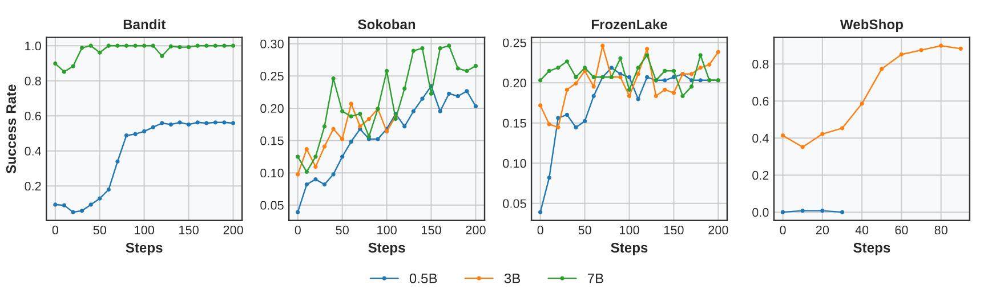

**图 10.** **不同环境中的扩展效应. 大模型在能利用语言先验的 Bandit 和 WebShop 上优于小模型, 但在 Sokoban 和 FrozenLake 等符号化网格环境中的收益有限.**

**前沿模型性能.** 为说明小模型的性能水平, 我们在 zero-shot 设置下, 用两个大型基础模型 **GPT-4o** 和 **Qwen2.5-72B-Instruct** 评估 `SimpleSokoban` 和 `FrozenLake`. 两个模型只得到任务说明和格式示例, 没有任何微调或 in-context trajectory rollout. 见[表 5](#table-05).

<span id="table-05"></span>

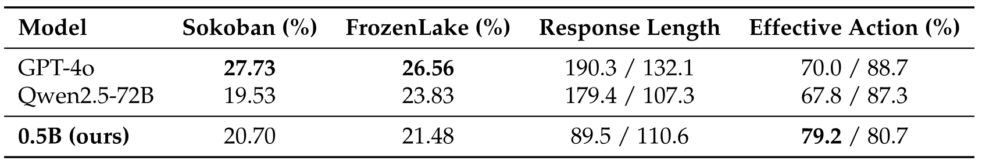

**表 5.** **Zero-shot 与训练后性能.** 0.5B 模型每个 prompt 只用 4 个响应训练, 表现已接近未经微调的大型基础模型. GPT-4o / Qwen 的响应长度和有效性按环境报告.

GPT-4o 和 Qwen2.5-72B 未经任务适配, 在 Sokoban 和 FrozenLake 上的成功率为 19-28%; 我们的 0.5B 模型从零开始训练后, 分别达到 **20.70%** 和 **21.48%**. 考虑到模型参数少了 **100$\times$ 以上**, 这个结果值得注意. 它表明, 即使资源受到严格限制, 仔细构造 rollout 并优化策略 (见[第 4.3 节](#section-4-3)), 也能达到大得多的模型的泛化能力.

**梯度塑形.** 我们评估了移除 KL 项和 Clip-Higher [Yu25g] 的效果. 只把它们从单轮静态任务扩展到智能体任务, 就能发挥作用:

- **移除 KL 项:** 从 PPO 目标中删除 KL divergence penalty, 梯度更新只依赖 policy loss 和 entropy bonus. 这会去掉策略必须贴近初始模型分布的约束, 鼓励模型探索.
- **Clip-Higher (非对称裁剪):** 解耦 PPO 的裁剪区间, 让上界 ($\varepsilon_{\mathrm{high}}=0.28$) 高于下界 ($\varepsilon_{\mathrm{low}}=0.2$). 模型因此能更积极地从高奖励 rollout 中学习, 提高训练效果.

如[图 11](#figure-11) 所示, 两种方法都会提高成功率并延长稳定训练阶段, 表明更灵活的梯度塑形有利于多轮 RL.

<span id="figure-11"></span>

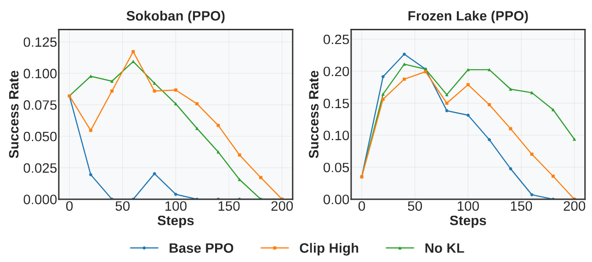

**图 11.** **移除 KL 和非对称裁剪对 PPO 稳定性的影响.** 两种设计都会提高峰值性能, 推迟多轮 RL 的坍塌.

**Response Masking 与双层 GAE.** 按照 [Wan25ak] 提出的 turn-aware 优化策略, 我们在 0.5B 模型上评估 response masking 和双层 GAE 的效果. 如[图 12](#figure-12) 所示, 两种技术都改善了多轮 RL 任务的性能, 表明 turn-aware RL 训练算法有望稳定并增强语言智能体训练.

<span id="figure-12"></span>

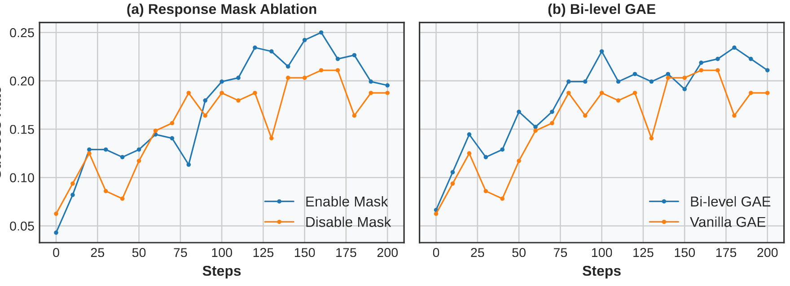

**图 12.** **Sokoban 任务上 turn-aware 优化策略的消融. Response masking 和双层 GAE 都能改善多轮 RL 性能.**

<span id="appendix-e"></span>

## 附录 E 基于不确定性的过滤何时有效?

我们假设, StarPO-S 的效果很大程度上取决于各环境中 rollout 奖励的方差. 如果任务过于简单或过于困难, 生成轨迹的组内方差往往很低, 表示模型对所有样本都过度自信, 或者表现普遍很差. 在这种情况下, 标准 StarPO 可能传播误导性的梯度, StarPO-S 则通过滤掉低置信度 rollout 改善训练. 相反, 开放程度更高或更多样的环境 (如 WebShop) 本身就有较高的 rollout 方差, StarPO-S 过滤的边际收益会随之降低.

<span id="figure-13"></span>

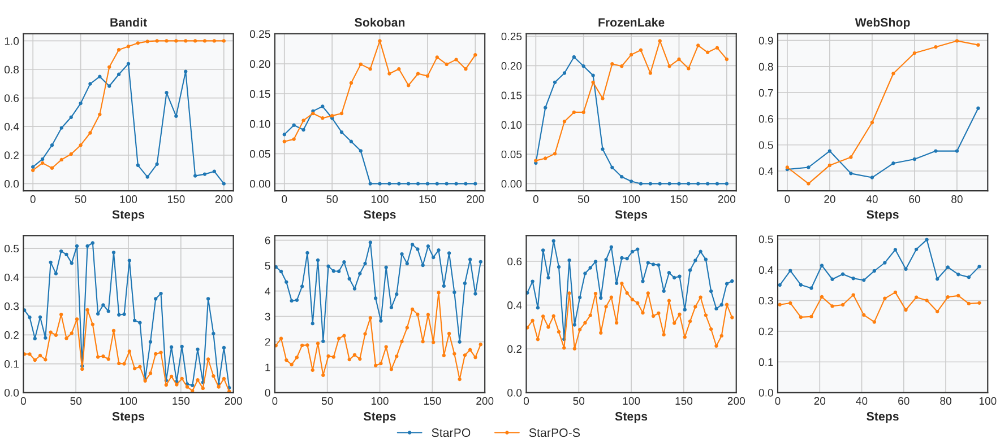

**图 13.** **成功率 (上) 与 rollout 方差 (下) 的比较. StarPO-S 基本可以改善 Sokoban 和 Frozen Lake 等包含极易或极难问题的环境的训练稳定性. 这些环境会产生 rollout Std 较小的实例, StarPO-S 可以轻易滤除它们, 使训练更稳定. 在 WebShop 等任务上, rollout Std 已经持续处于高位, StarPO 本身也能取得不错表现.**

[图 13](#figure-13) 支持这个想法. 上排给出 StarPO 和 StarPO-S 在四种环境中的成功率, 下排给出训练过程中 `in_group_std` 和 `chosen_in_group_std` 的变化. 在 Bandit、Sokoban 和 FrozenLake 中, StarPO-S 始终优于 StarPO, rollout 方差越低, 差距越大. WebShop 的方差较高且稳定, 说明生成响应更多样, StarPO-S 过滤的重要性较低, 因而性能差距也较小.

这些结果表明, 环境的 rollout 不确定性较低时, StarPO-S 收益最大; 这也提供了一个判断何时使用它的简单指标.

<span id="appendix-f"></span>

## 附录 F 案例研究: RL 中 Echo Trap 的出现

<span id="table-06"></span>

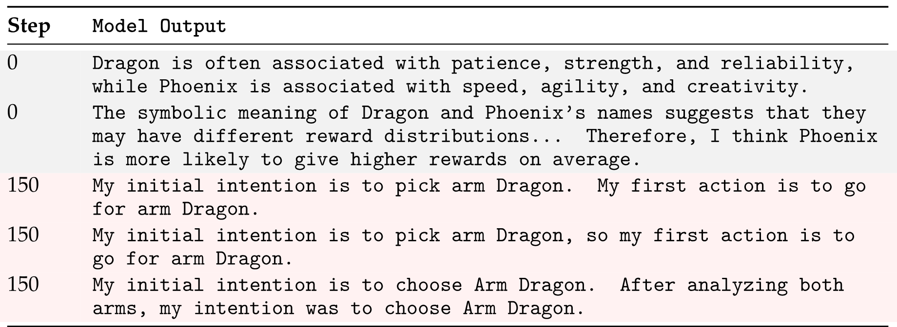

**表 6.** **Bandit 任务中的推理模式示例. 上半部分是训练前模型的多样化推理; 下半部分是 RL 训练后重复、坍塌的推理.**

<span id="figure-14"></span>


**图 14.** **不同任务中推理长度随训练迭代的变化. 我们跟踪 RL 训练期间推理段 (`<think>` 块) 的平均 token 数. 所有环境的推理长度都会随训练缩短, `BanditRev` 则保留较长的轨迹, 可能是更强的语义-奖励冲突要求模型进行更多权衡.**

我们给出能说明 RL 训练中 Echo Trap 的案例. 如[表 6](#table-06) 所示, 上半部分 (Step 0) 对 Dragon 和 Phoenix 提出不同假设, 下半部分 (Step 150) 则收敛到几乎相同的措辞, 只说“选择 Dragon”, 不再给出理由.

<span id="appendix-g"></span>

## 附录 G 智能体 RL 与监督微调的比较

除用 StarPO 进行 RL 训练外, 我们还采用 Supervised Fine-tuning (SFT) 作为另一种智能体训练方法, 并在 Sokoban 和 Frozen Lake 任务上评估. 我们使用 rank 64、alpha 32 的 LoRA, 作用于模型的所有线性层. SFT 的学习率为 1e-4, training batch size 为 128. 我们通过 breadth-first search (BFS) 生成 ground-truth trajectory data, 最大深度设为 100, 生成 1,000 个训练样本和 100 个测试样本. 对 SFT 而言, 我们把多轮交互组织成对话格式. 每一轮中, 模型必须从 ground-truth trajectory 生成下一个动作, 并把响应放在 `<answer> </answer>` 标签内, 保持格式一致.

我们比较 SFT 与稳定 RL 基线 StarPO-S 的性能. SFT 在 Sokoban 和 Frozen Lake 上分别达到 74.6% 和 23%, StarPO-S 则为 20.3% 和 21.8%. 结果表明, SFT 的性能优于 RL 方法. 我们由此认为, 基于规则的 RL 虽然适用于智能体任务, 但如果只依靠模型自我演化来达到人类水平, 仍需构建扩展性更好、效果更强的智能体 RL 算法.

<span id="appendix-h"></span>

## 附录 H 使用 Low-Rank Adaptation (LoRA) 进行高效训练

**动机.** 正文报告的是全参数微调结果, 但扩展到更大的模型或更长程的任务时, 这种设置在实践中可能成本过高. 因此, 我们基于 Low-Rank Adaptation [Hu21] 实现了 RAGEN 的参数高效变体 [+lora].

[+lora]: 我们将 rank 设为 $r{=}64$, $\alpha{=}64$, 并在 transformer block 的所有线性投影中注入 adapter. Actor 和 critic 的学习率都提高了 $10\times$.

**性能相当.** 虽然只更新一小部分模型参数, LoRA 在 SimpleSokoban 任务上仍达到与全模型微调相当的验证成功率, 在验证集上的成功率约为 $0.2\%$.

**资源节省.** 我们比较 LoRA 和全参数微调的硬件占用. 在 80 分钟训练期间测得:

- **GPU 内存.** LoRA 稳定在设备内存的 $\mathbf{\approx 23\%}$, 全参数更新为 $\mathbf{\approx 48\%}$, 峰值分配降低超过 50%.
- **GPU 利用率.** 平均 GPU 利用率从 $\sim\!34\%$ 降至 $\sim\!14\%$.
- **功耗.** 平均功耗从 $\sim\!22\%$ 降至 $\sim\!12\%$, 降幅约为 $45\%$.

**结论.** 参数高效微调为 RAGEN 提供了实践可行的替代方案: 策略质量相当, 内存、计算量和功耗则降低一半以上. 因此, 后续工作将 StarPO 扩展到更大的 backbone 或更长的上下文时, 可以默认采用 LoRA (或其他基于 adapter 的方法), 无需重新设计训练循环.

<span id="appendix-i"></span>

## 附录 I PPO 在 Frozen Lake 中的失效模式

在三个评估环境中, Frozen Lake 出现了一个值得注意的分歧: PPO 往往更早坍塌, 或者收敛不如 GRPO 稳定. 这与 PPO 通常表现更好的整体趋势相反, 因而需要进一步分析.

一种可能的解释来自环境的长程随机性. 在 Frozen Lake 中, 智能体动作总会产生高度不确定的转移; 中间状态看起来可能相似, 最终结果却完全不同. 这使价值估计变得困难. PPO 依赖学习得到的价值函数, critic 学习的不稳定可能放大优化噪声, 导致过早坍塌. GRPO 不依赖显式价值学习; 在这种设置下, 其奖励加权更新过程可能更能容忍不确定性, 因而在 Frozen Lake 上训练得相对稳定, 即使它在其他任务上的效果仍然较差. 总体而言, 随机性高的环境可能对基于价值的方法提出更大挑战, 无 critic 的方法可以在这类环境中作为实用基线.

<span id="appendix-j"></span>

## 附录 J Prompt 模板

### J.1 双臂 Bandit 环境 Prompt

双臂 Bandit 环境实现了经典强化学习问题, 智能体必须平衡探索和利用. Prompt 模板如下.

**模型模板**

```text
<|im_start|>[system]:
{prompt}
你是一名乐于助人的助手. 回答时始终把答案放在 <answer>...</answer> 中. 最大响应长度: 200 个词 (token).
<|im_end|>
<|im_start|>[user]:
{prompt}
你正在玩一局 bandit 游戏. 目标: 选择要拉动的 arm, 使总奖励最大.
游戏规则:
1. 有 2 个 arm, 名为 {name_a} 和 {name_b}
2. 每个 arm 都有自己的奖励分布, 并与其名称相关.
3. 分析每个 arm 名称的符号含义, 推测其奖励分布可能如何变化.
4. 根据名称的符号含义, 你认为哪个 arm 的平均奖励可能更高? 在 {name_a} 和 {name_b} 中选择, 输出格式为 <answer> {name_a} </answer> 或 <answer> {name_b} </answer>.
<|im_end|>
<|im_start|>assistant
<think>
```

### J.2 Sokoban 环境 Prompt

Sokoban 环境是一款经典解谜游戏, 智能体需要把箱子推到目标位置. 以下部分给出与语言模型交互所用的 prompt 结构.

**模型模板**

```text
<|im_start|>system
{prompt}
你是一名乐于助人的助手. 回答时始终先把思考放在 <think>...</think> 中, 再把答案放在 <answer>...</answer> 中. 最大响应长度: 200 个词 (token).
<|im_end|>
<|im_start|>user
{prompt}
你正在解决 Sokoban 谜题. 你是玩家, 需要把所有箱子推到目标上. 紧挨箱子时, 可以沿同一方向移动来推动它. 你不能把箱子推过墙壁, 也不能拉箱子. 答案应为一串动作, 如 <answer>Right || Right || Up</answer>
<|im_end|>
<|im_start|>assistant
<think>
```

环境使用基于网格的表示, 不同元素对应不同符号:

**网格表示**

```text
状态中各符号的含义为:
#: 墙壁, _: 空地, O: 目标, ✓: 位于目标上的箱子, X: 箱子, P: 玩家, S: 位于目标上的玩家
```

指令模板只包括可用动作和限制:

**指令模板**

```text
可用动作为:
Up, Down, Left, Right
你最多可以执行 10 个动作, 动作之间用分隔符 " || " 隔开
```

### J.3 FrozenLake 环境 Prompt

FrozenLake 环境实现了一项网格世界导航任务, 智能体需要穿过湿滑的冰面到达目标. 本节给出该环境的 prompt 结构.

**模型模板**

```text
<|im_start|>system
{prompt}
你是一名乐于助人的助手. 回答时始终先把思考放在 <think>...</think> 中, 再把答案放在 <answer>...</answer> 中. 最大响应长度: 200 个词 (token).
<|im_end|>
<|im_start|>user
{prompt}
你正在解决 FrozenLake 谜题. 避开洞, 到达目标. 由于冰面湿滑, 你可能向预期之外的方向移动. 答案格式示例: <think>为了避开洞并到达目标, 我应该先向左, 再向上.</think><answer>Left || Up</answer>
<|im_end|>
<|im_start|>assistant
<think>
```

环境使用基于网格的表示, 不同元素对应不同符号:

**网格表示**

```text
状态中各符号的含义为:
P: 玩家, _: 空地, O: 洞, G: 目标, X: 掉入洞中的玩家, ✓: 到达目标的玩家
```

指令模板只包括可用动作和限制:

**指令模板**

```text
可用动作为:
Left, Down, Right, Up
你最多可以执行 10 个动作, 动作之间用分隔符 " || " 隔开
```

<span id="figure-15"></span>

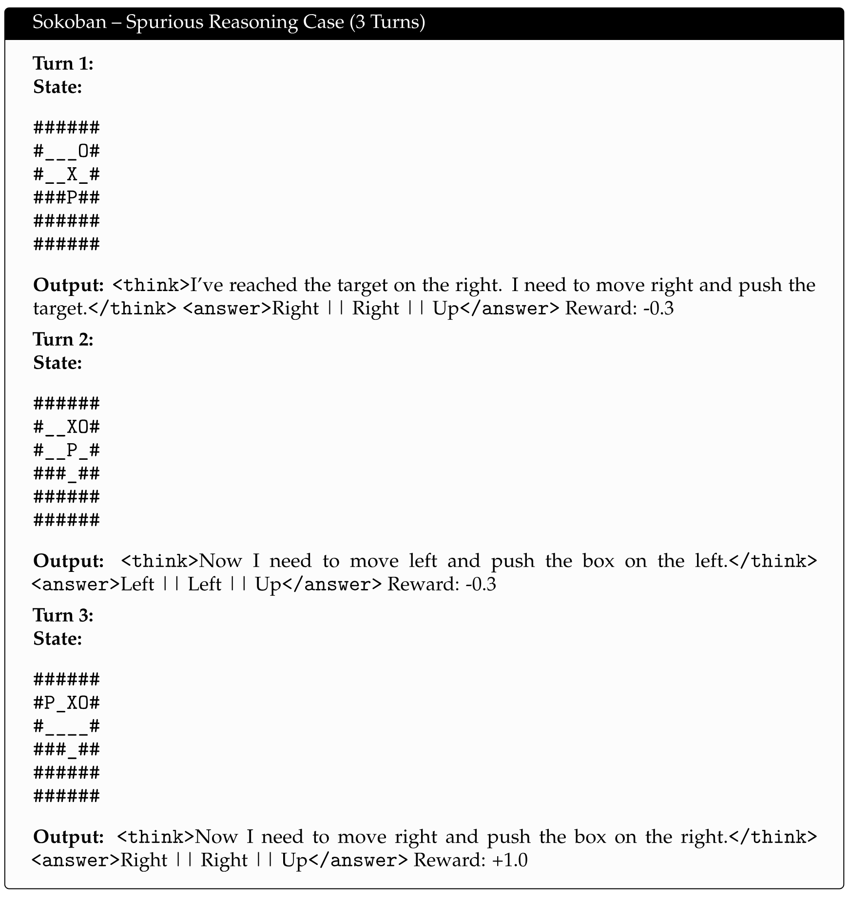

**图 15.** **一条含有虚假推理的 rollout.** 最终结果成功, 但各轮推理轨迹并不一致, 有时还存在事实错误. 这是一种常见的失效模式: 模型为最终奖励优化, 却绕过了连贯推理, 在 RL 训练中产生带噪声、可能误导模型的监督.

<span id="appendix-k"></span>

## 附录 K 泛化评估环境

为评估训练分布之外的泛化, 除三个训练环境外, 我们还从不同维度设计了两个新的测试环境:

- **SokobanDifferentGridVocab** 修改用于表示网格的视觉词汇. 它不使用标准符号 (#、_、O、X 等), 而把网格单元映射到 `W`、`G`、`C` 等新词汇. 这可以测试模型能否在保留底层空间语义的同时, 泛化到符号变化.
- **LargerSokoban** 将网格从 $6\times 6$ 扩大到 $8\times 8$, 箱子数从 1 增至 2, 带来更高的空间复杂度和更长程的规划要求. 这一设置用来评估在小型谜题上训练的策略能否扩展到更复杂的配置.

训练期间不会出现这些环境. 它们分别用于检验智能体在符号变化、规模扩展和环境变化下的泛化能力.

<span id="appendix-l"></span>

## 附录 L 案例研究: 错误推理产生的虚假奖励

评估 Sokoban 中的推理行为时, 我们发现模型即使给出有缺陷或误导性的推理轨迹, 偶尔也能获得非负甚至很高的奖励. [图 15](#figure-15) 展示了一条 3 轮 rollout: 模型成功把箱子推到目标上, 中间决策却对游戏动态作出了错误假设.

在第 1、2 轮中, 智能体提出看似合理、实际不连贯的计划, 如“推动目标”或“向左侧的箱子移动”; 这些计划要么多余, 要么方向错误. 即便如此, 最后的动作序列仍然到达了目标. 这类案例会增加奖励信号的噪声, 使 RL 训练更难区分真正有用的计划和碰巧有效的计划.

这说明多轮 RL 推理智能体面临一个主要问题: *只看结果的奖励可能无法充分惩罚糟糕的推理轨迹*, 在反馈稀疏或延迟的环境中尤其如此.

<span id="appendix-m"></span>

## 附录 M 扩展案例研究

为更好地理解推理质量如何随模型规模和环境变化, 我们给出了四类任务的代表性 rollout: Bandit ([图 16](#figure-16))、Sokoban ([图 17](#figure-17))、FrozenLake ([图 18](#figure-18)) 和 WebShop ([图 19](#figure-19)), 每类都包含 0.5B 与 7B 模型. 我们观察到, **大模型往往生成更长、更连贯的推理链, 在 Bandit 和 WebShop 等语义丰富的决策任务中尤其如此**. 但在 Sokoban 等网格环境和 FrozenLake 等随机环境中, **小模型和大模型都难以完成规划与对齐**, 常常退回脆弱的启发式方法或虚假关联. 这些案例与附录 [D](#appendix-d) 的实验一致: 不同于 Bandit 和 WebShop, Sokoban 与 Frozen Lake 并未从更大模型规模中得到明显性能提升. 它们说明推理质量如何与环境结构相互作用, 也反映出在随机或信息不足的设置中, 稳定奖励落地推理有多困难.

<span id="figure-16"></span>

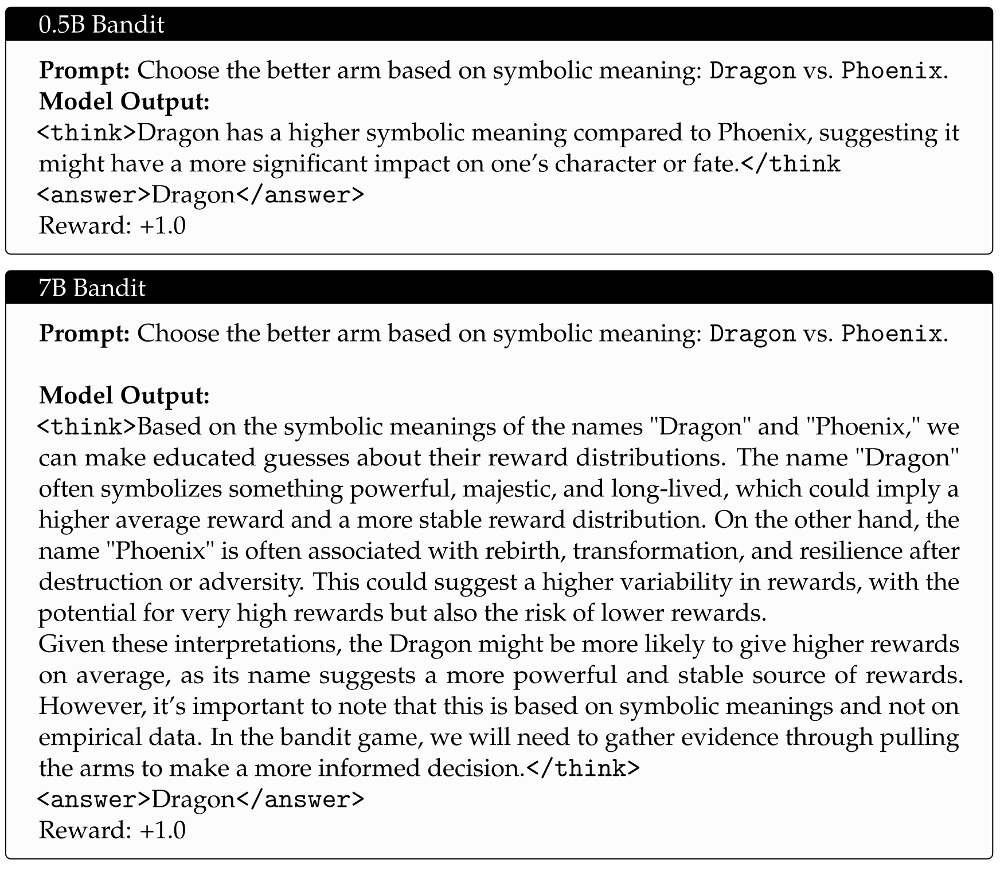

**图 16.** **不同模型规模在 Bandit 任务中基于推理选择 arm. 两种情况下, 模型都必须依据先验知识推断符号 arm (`Dragon` 与 `Phoenix`) 的奖励倾向. 0.5B 模型给出一段基于符号关联的简短理由. 7B 模型生成更细致的推理链, 比较稳定性和方差, 表现出更强的先验知识和解释能力. 两者最终都选择 `Dragon`, 但推理深度不同.**

<span id="figure-17"></span>

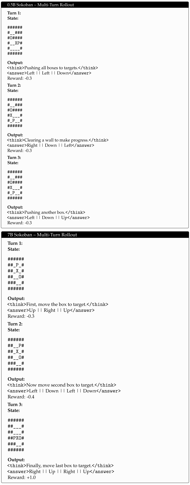

**图 17.** **不同模型规模的 Sokoban rollout. 0.5B 模型推理很少, 经常给出局部有效但并非最优的动作. 7B 模型各轮的规划和符号对齐更有结构, 但在长程设置中仍会出现低效和启发式动作.**

<span id="figure-18"></span>

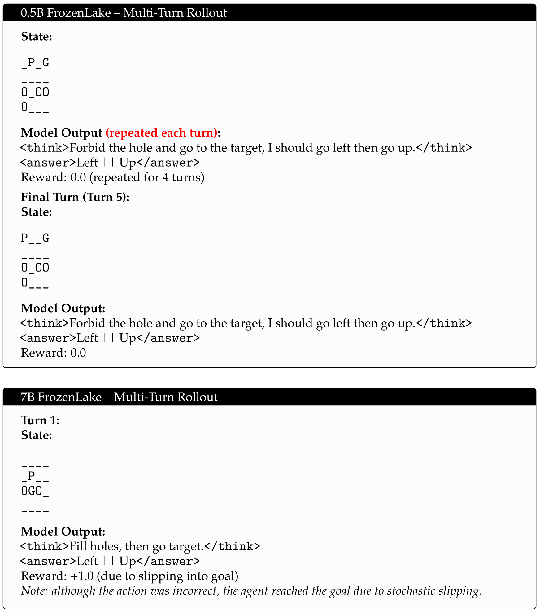

**图 18.** **不同模型规模的 FrozenLake rollout.** 0.5B 智能体无论结果如何都会重复固定计划, 表明适应或规划能力有限. 7B 智能体给出了次优命令, 却因随机转移得到高奖励; 这反映了此类环境中 credit assignment 的难度, 以及强化虚假模式的风险.

<span id="figure-19"></span>

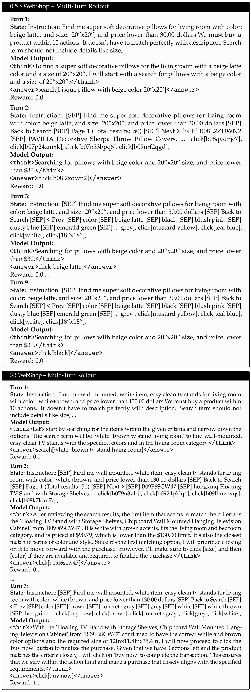

**图 19.** **WebShop rollout 说明模型规模如何影响长上下文决策.** 0.5B 智能体会困在循环中, 即使上下文信息丰富, 仍反复选择无关选项, 表明它难以维持长程记忆和目标跟踪. 3B 模型则成功执行了一条多步推理链: 缩小搜索查询、浏览商品选项、选择属性, 最后完成购买. 这说明模型规模对现实开放域环境中的组合规划很重要.
