> [Lingxiao Ma](https://xysmlx.github.io/) [+equal], [Zhiqiang Xie](https://zhiqiangxie.com/) [+equal], [Zhi Yang](https://yangzhihome.github.io/), [Jilong Xue](https://dblp.org/pid/06/10336.html), [Youshan Miao](https://youshan-miao.github.io/), [Wei Cui](https://www.microsoft.com/en-us/research/people/weicu/), [Wenxiang Hu](https://dblp.org/pid/141/4590.html), [Fan Yang](https://fanyangcs.github.io/), [Lintao Zhang](https://www.microsoft.com/en-us/research/video/lintao-zhang-showcases-tiger-bings-next-generation-index-serving-platform/) 和 [Lidong Zhou](https://www.microsoft.com/en-us/research/people/lidongz/). 发表于第 14 届 USENIX 操作系统设计与实现研讨会 (OSDI 20), 第 881-897 页, 2020 年 11 月 4-6 日. [会议页面](https://www.usenix.org/conference/osdi20/presentation/ma). <a href="/paper/rammer.pdf" target="_blank" rel="noopener noreferrer">原始 PDF</a>. 本阅读版保留论文的实质性正文, 图, 表和算法; 精确的印刷版式与参考文献以原始 PDF 为准.

[+equal]: 两位作者贡献相同.

## 摘要

要在硬件加速器上高效执行深度神经网络 (DNN) 计算并不容易. 现有 DNN 框架和编译器通常把数据流图 (DFG) 中的 DNN 算子视为不透明的库函数, 将它们逐个调度到加速器上执行. 它们还依赖另一层调度器来发掘算子内部的并行性, 而这一层通常由硬件实现. 这种双层方法会带来显著的调度开销, 也常常无法充分利用可用的硬件资源. 本文提出 RAMMER, 一种面向大规模并行加速器的 DNN 编译器设计, 用于优化 DNN 工作负载的执行. RAMMER 在编译时为 DNN 生成高效的静态时空调度, 以尽量减少调度开销. 它对算子间和算子内并行性进行整体协同调度, 从而最大化硬件利用率. 为此, RAMMER 为计算任务和硬件加速器提出了几种新颖, 硬件中立且简洁的抽象. 这些抽象向 RAMMER 开放了丰富得多的调度空间, RAMMER 再用若干启发式方法探索这个空间并找出高效的调度方案. 我们为 NVIDIA GPU, AMD GPU 和 Graphcore IPU 等多种硬件后端实现了 RAMMER. 实验表明, RAMMER 的性能显著超过 TensorFlow XLA 和 TVM 等先进编译器, 最高可达 20.1 倍. 与 NVIDIA 面向特定厂商优化的专有 DNN 推理库 TensorRT 相比, RAMMER 也能获得最高 3.1 倍的性能提升.

## 1 引言

深度神经网络 (DNN) 已广泛用于图像分类, 自然语言处理以及许多其他 AI 任务. 由于 DNN 十分重要, CPU, GPU, FPGA 和专用 DNN 加速器等多种计算设备都被用于执行 DNN 计算. 如何在这些设备上高效完成 DNN 计算, 是近年来备受关注的研究课题 [Che18d, Guo19, Hol19, Liu19, Zha18c]. 调度是影响 DNN 计算效率的关键因素之一, 即决定各部分计算在目标硬件上的执行顺序. 调度问题本身的重要性早已得到公认和充分研究 [Arp18, Leu04]. 不过, 专门讨论硬件设备上 DNN 计算调度的工作仍然很少.

深度神经网络的计算模式通常表示为数据流图 (DFG). 图中的每个节点对应一个算子, 也就是矩阵乘法等计算单元; 边则表示算子之间的依赖关系. 这种表示天然包含两个层次的并行性. 第一层是算子间并行性: DFG 中没有依赖关系的算子可以并行运行. 第二层是算子内并行性: 矩阵乘法等算子本身存在数据并行性, 因而可以利用 GPU 这类能够执行并行计算的硬件加速器.

为利用这两个层次的并行性, 当前实践采用双层调度方法. 算子间的 DFG 层调度器接收数据流图, 根据依赖关系发出已经就绪的算子. 算子内调度器则接收一个算子, 并将其映射到加速器中的并行执行单元. 这种分层设计从根本上影响了现有 DNN 工具集的系统架构. 例如, DFG 层调度器通常由 TensorFlow [Aba16] 或 ONNX Runtime [Onn18] 等深度学习框架实现. 算子层调度器则往往隐藏在 cuDNN [Cud23] 和 MKL-DNN [Mkl16] 等算子库背后, 有时还会像 GPU 那样直接在硬件中实现.

双层调度方法虽然已被现有框架和加速器广泛采用, 却有根本性的性能局限. 只有当发出算子的开销远小于算子的执行时间, 且算子内并行性足以占满加速器中的所有处理单元时, 这种方法才能取得良好效果. 遗憾的是, 实际情况往往并非如此. DNN 加速器的性能增速远快于 CPU, 因而发出算子的开销越来越突出. 对于批大小较小的 DNN 推理工作负载, 算子内并行性受到限制, 问题会更加严重. 此外, 双层调度忽略了上下两层之间微妙的相互作用: 为优化整体性能, 系统可以降低算子内并行度, 以提高算子间并行度 (见[第 2 节](#section-2)).

为缓解这些局限, 我们提出 RAMMER. 这是一个深度学习编译器, 从整体上管理 DNN 计算中可供调度的并行性. 它通过名为 rTask 的新抽象统一算子间与算子内调度. rTask 让调度器能够打破算子边界, 将计算细粒度地调度到设备上. 现有设计把调度拆成分别由软件和硬件管理的两部分, RAMMER 则完全由软件统一实现, 对底层硬件的依赖更少, 因而能适配多种 DNN 加速器. RAMMER 采用以下设计决策.

第一, 为了用软件编译器发掘算子内并行性, RAMMER 将 DNN 算子重新定义为 rTask 算子, 即 rOperator. 一个 rOperator 由多个相互独立且同构的 rTask 组成; 每个 rTask 都是最小可调度单元, 在加速器的一个执行单元上运行, 例如 GPU 的一个流多处理器 (SM). 这样, rTask 所携带的细粒度算子内信息便暴露给 RAMMER 调度器. RAMMER 把 DNN 视为由 rOperator 节点组成的数据流图, 因而仍能看到粗粒度的算子间 (DFG) 依赖关系.

遗憾的是, GPU 等现代加速器不提供算子内调度, 也就是 rTask 调度接口. 为解决这个问题, RAMMER 的第二项设计决策是把硬件加速器抽象成虚拟化并行设备 (vDevice), 其中包含多个虚拟化执行单元 (vEU). vDevice 允许多个 rTask 按所需顺序在指定 vEU 上运行, 即使这些 rTask 来自不同算子也可以. 此外, vEU 可以运行 barrier rTask, 等待一组指定的 rTask 完成, 从而确保来自相互依赖算子的 rTask 按正确顺序执行. vDevice 会把 vEU 映射到加速器中的某个物理执行单元, 实际完成 rTask 的计算.

最后, 细粒度调度可能带来很高的运行时开销, 甚至超过前面讨论的算子调度开销. 为解决这一问题, RAMMER 把调度决策从运行时移到编译时. 这样做源于一项观察: 大多数 DNN 的 DFG 在编译时已经可用, 算子通常也具有确定的性能特征, 因而可以通过编译时剖析获得运行时性能 [Siv19]. 这不仅避免了不必要的运行时开销, 还允许采用代价更高的调度策略, 共同充分发掘算子间与算子内并行性.

RAMMER 与现有 DNN 编译器中的优化兼容. RAMMER 可以从 TensorFlow 等其他框架导入数据流图. 这种 DFG 可以采用传统图优化器使用的技术进行优化, 如 [Aba16]. rOperator 也可以由现有 kernel 调优器优化 [Che18d]. 我们的经验表明, 在现有优化基础上, RAMMER 还能显著提升性能, 对 DNN 推理工作负载尤其如此.

RAMMER 与硬件无关. rTask, rOperator 和 vEU 等抽象适用于任何具有同构执行单元的大规模并行计算设备, 这几乎涵盖所有面向 DNN 工作负载提出的计算设备. 本文除了详细说明 RAMMER 在 NVIDIA GPU 上的实现外, 还会介绍将 RAMMER 重新定向到几种其他计算设备的经验.

我们用 52k 行 C++ 代码实现了 RAMMER, 并将代码开源 [+code]. 在 6 个 DNN 模型上的评估表明, RAMMER 在 NVIDIA 和 AMD GPU 上都显著超过 XLA 和 TVM 等先进编译器, 最高可加速 20.1 倍. 与 NVIDIA 面向厂商优化的 DNN 推理库 TensorRT [Ten17a] 相比, RAMMER 甚至也能取得最高 3.1 倍的性能提升.

[+code]: 代码见 <https://github.com/microsoft/nnfusion>.

我们在 RAMMER 上的实践强烈表明, 当前业界普遍采用的做法并不理想: 厂商以库的形式提供高度优化的 DNN 算子实现, 例如 cuDNN 和 MKL-DNN. 这种做法会让 DNN 工作负载付出可观的效率代价. 未来几年, 现代加速器会继续增加可用的硬件并行度, 新型 DNN 架构则会用更多小算子替代大算子来减少计算 [Xie16, Zop18], 届时情况还会进一步恶化. 我们建议厂商以其他形式提供优化实现, 例如本文提出的 rOperator 和 vEU 抽象, 从而支持能够充分利用硬件资源的整体优化.

## 2 动机

本节给出一些结果, 说明现有深度学习框架双层设计的局限. 不失一般性, 我们采用与[第 5 节](#section-5) 相同的设置, 在 NVIDIA GPU 上实验先进 DNN 框架 TensorFlow [Aba16].

**由硬件管理的算子内调度会造成较低的 GPU 利用率.** 双层设计把算子内调度交给 GPU 等加速器中的硬件调度器. [图 1](#figure-01) 表明, 这种方法可能让不同 DNN 模型的 GPU 利用率都很低. 批大小为 1 时, Seq2Seq 模型的 GPU 利用率最低只有 2%. 即便把批大小增至 16, 6 个模型的平均 GPU 利用率也只有 40% [+lstm-util]. 为提高调度效率, 现代 GPU 支持多流机制, 允许彼此独立的算子并发运行. 然而, 我们在[第 5 节](#section-5) 的测量表明, 多流往往会损害而不是改善整体性能.

[+lstm-util]: 批大小为 1 时, LSTM 的 GPU 利用率略高于批大小为 16 的情况. 这是因为 TensorFlow 针对不同批大小采用了不同的 GEMM kernel 实现.

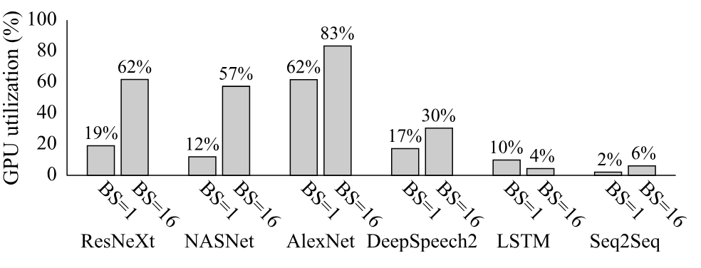

**图 1.** 不同 DNN 模型在不同批大小 (BS) 下的平均 GPU 利用率. 利用率只统计 kernel 执行, 不包含发出算子等其他阶段.

**较高的算子间调度开销.** 双层方法还会产生更高的算子间调度开销. 这里, 我们把 GPU 中未用于实际计算的时间视为算子间调度开销. 其中包括支持算子发出的各种操作, 如启动 kernel, 初始化上下文以及主机与 GPU 之间的通信等. [图 2](#figure-02) 每根柱上方的百分比表示 DNN 模型有多少时间没有用于实际 GPU 计算. 从图中可以清楚看出, 算子间调度开销相当可观. 批大小为 1 时, 6 个 DNN 模型的平均开销为 55%. 把批大小增至 16 后, 情况略有改善, 但开销仍不可忽略, 介于 16% 到 55% 之间. 包括 TensorFlow 编译器在内的现代 DNN 编译器采用了 kernel 融合技术 [Xla17, Che18d], 在条件允许时把多个 DNN 算子合并为一个. 然而, [第 5 节](#section-5) 的结果表明, 这种技术无法显著降低开销.

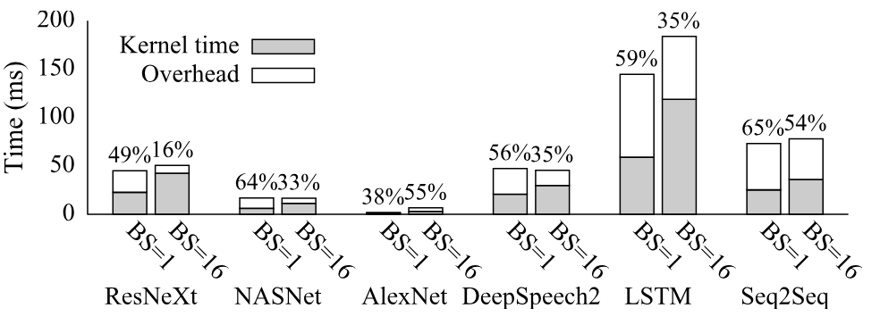

**图 2.** 不同 DNN 模型在不同批大小 (BS) 下的平均 kernel 时间和端到端执行时间.

**算子间与算子内调度的相互作用.** 把调度拆成两层, 会忽略算子间调度与算子内调度之间微妙的相互作用, 从而可能产生次优性能. 例如, [图 3a](#figure-03) 展示了两个独立算子在 GPU 上的调度. 为最大化算子 0 的性能, 系统可能选择并行度很高的最快实现. 于是, 算子 0 会贪心地占用加速器的所有并行执行单元 (EU), 在这个例子中也就是 GPU 的所有流多处理器, 即使每个 EU 都未必得到充分利用. 由于算子 0 占据了全部 EU, 算子 1 只能等待资源空闲. 更好的调度器可以降低算子 0 的并行度, 把算子 1 与算子 0 并排映射, 以提高算子间并行度, 如[图 3b](#figure-03) 所示. [第 3.3 节](#section-3-3) 和[第 5 节](#section-5) 将进一步讨论这一问题.

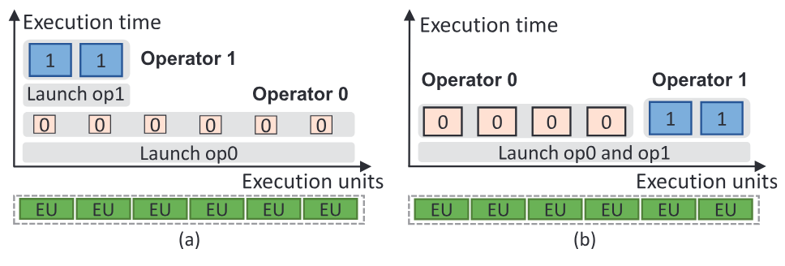

**图 3.** (a) 现有方法的低效调度; (b) 优化后的调度方案.

**机会.** 鉴于上述双层设计的根本局限, 最好统一管理算子间与算子内调度. 然而, 直接实现这一思路, 可能产生比本就可观的算子间调度开销还要高的开销. 所幸, 大多数 DNN 的 DFG 在编译时已经可用, 算子也常常具有确定的性能, 因而可以通过编译时剖析获得执行时间 [Siv19]. 例如, [图 4](#figure-04) 给出了 ResNeXt [Xie16] 模型所有算子的平均 GPU kernel 时间和方差. 所有算子的标准差按 kernel 运行时间加权后, 平均值只有 7%. 因此, 我们可以生成离线调度方案, 把调度从运行时移到编译时, 从而降低运行时开销.

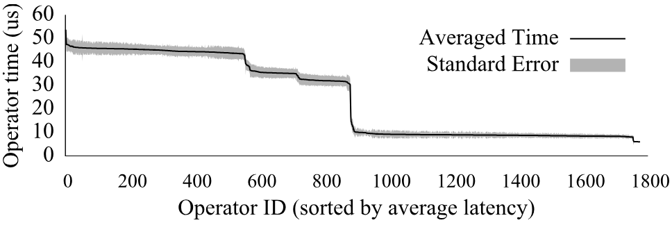

**图 4.** ResNeXt 模型中所有算子的 kernel 时间剖析结果. 每个数据点运行 1,000 次.

## 3 RAMMER 的设计

[第 2 节](#section-2) 的观察促使我们设计 RAMMER, 一个统一管理算子间与算子内调度的 DNN 编译器框架. [图 5](#figure-05) 展示了现有深度学习框架与 RAMMER 的主要差异. 第一, RAMMER 的输入是数据流图, 其中每个节点都是 rOperator, 而非传统算子. rOperator 会显式暴露 rTask, 即可以在加速器的并行执行单元上运行的细粒度计算单元. [第 3.1 节](#section-3-1) 将详述 rTask. 第二, RAMMER 不再把双层调度拆给软件和硬件, 而是引入 rTask 感知的 DFG 编译器, 在一处统一管理算子间与算子内调度. 该编译器会生成供运行时执行的静态执行方案. 把整个 DNN 计算装进一次加速器设备调用通常效率不高, 有时甚至不可行. 因而, 执行方案会被拆成多个 rProgram, 每个 rProgram 包含一部分要在硬件上执行的计算. RAMMER 不再一次向加速器发出一个算子, 而是一次发出一个 rProgram. [第 3.3 节](#section-3-3) 将介绍 rTask 感知 DFG 编译器的细节. 为执行该方案, RAMMER 把硬件加速器抽象为虚拟化并行设备 (vDevice), 其中包含多个虚拟化执行单元 (vEU). vDevice 在 rTask 层面提供调度与同步能力, 让 rProgram 可以在编译时映射到相应 vEU. 到运行时, vEU 和 vDevice 再映射到硬件. [第 3.2 节](#section-3-2) 将介绍虚拟化设备.

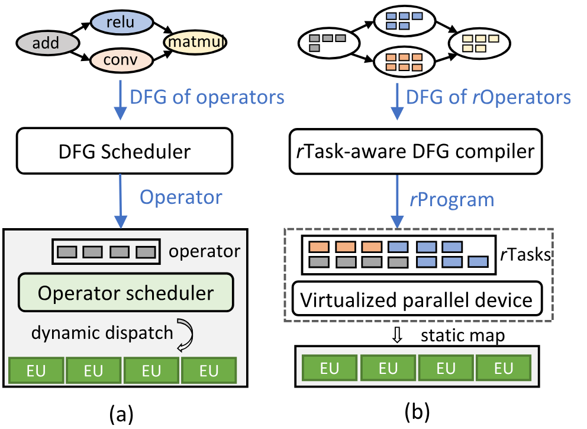

**图 5.** (a) 现有 DNN 框架和 (b) RAMMER 的 DNN 计算系统概览. RAMMER 的 DFG 中, 每个节点都是通过 rTask 显式暴露算子内并行性的 rOperator. RAMMER 不在运行时逐个调度 rOperator, 而是把 DFG 编译成由 rTask 组成的静态执行方案 rProgram, 再通过名为 vDevice 的软件设备抽象将其映射到硬件.

### 3.1 rOperator

rOperator 定义为一组相互独立且同构的 rTask, rTask 是 RAMMER task 的缩写. 每个 rTask 都是算子中的最小计算单元, 由加速器设备的一个处理单元执行. rTask 的概念天然契合 DNN 加速器的并行架构, 例如 GPU 的 SIMD 架构. 为最大化效率, 需要把这类加速器上的计算拆成多个并行且同构的任务. 每个并行任务都可以表示为一个 rTask, 因而算子内并行性不仅暴露给底层硬件, 也暴露给 RAMMER 编译器. rTask 在逻辑上等同于并行任务, 所以 RAMMER 依靠外部工具把 rOperator 划分成 rTask, 例如 TVM [Che18d]. 换言之, RAMMER 使用外部启发式方法决定合适的 rTask 粒度.

以矩阵乘法算子为例, 它可以划分为多个同构 rTask, 每个 rTask 计算输出矩阵的一个分块, 这里假设分块策略已经给定. 如果复杂的 DNN 算子很难拆成彼此独立的同构 rTask, 例如 SeparableConv2D [Sep00], 可以把它表示成多个相互依赖的 rOperator, 再将每个 rOperator 划分成 rTask.

rTask 由逻辑编号 `rtask_id` 索引. 一个 rOperator 中的 rTask 连续编号. 要执行某个 rTask, 并行执行单元可以调用 `compute_rtask()` 接口, 见[图 6](#figure-06) 第 3 行. 为生成 rProgram, RAMMER 需要知道算子中的 rTask 总数, 该数值可通过 `get_total_rtask_num()` 接口获得. 相比之下, 传统算子只有一个 `compute()` 接口, 见[图 6](#figure-06) 第 1 行. rOperator 的实现称为 rKernel, 它实现具体的 rTask 计算逻辑并确定 rTask 总数. 一个 rOperator 可以根据不同分块策略具有多个 rKernel 版本, 例如在资源效率和整体执行时间之间取舍.

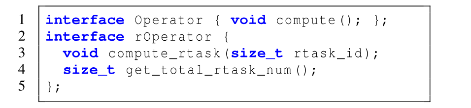

**图 6.** 传统算子与 rOperator 的执行接口. 详见[第 4 节](#section-4).

rOperator 抽象让 RAMMER 可以同时暴露算子间和算子内并行性, 从而打开一个整体优化 DNN 计算的新空间.

### 3.2 虚拟化并行设备

现代加速器不提供把 rTask 直接映射到指定执行单元的接口. 例如, GPU 一次只允许执行一个算子, 其形式为一个 kernel. 为解决这一问题, RAMMER 将硬件加速器抽象成由软件管理的虚拟设备, 即虚拟化并行设备 (vDevice). vDevice 进一步呈现多个并行虚拟执行单元 (vEU), 每个 vEU 都能独立执行 rTask.

借助 vDevice, RAMMER 把 rTask 感知 DFG 的计算组织为 vDevice 上的 rProgram. rProgram 表示为 rTask 的二维数组 `prog[vEU_id][order]`, 其中 `vEU_id` 表示 rTask 被分配到的 vEU, `order` 表示该 rTask 在这个 vEU 中的执行顺序. 例如, `prog[0][0]` 表示 vEU 0 上执行的第一个 rTask. 为确保方案中的依赖 rTask 正确执行, RAMMER 引入 barrier-rTask. barrier-rTask 接收一个 `<vEU_id, order>` 二元组列表, 并等待每个二元组所索引的 rTask 全部完成. 它提供了一种细粒度同步机制, 用于执行 rTask 调度方案.

执行 DNN 计算时, vDevice 需要在运行时映射到物理加速器. [第 4 节](#section-4) 将讨论 RAMMER 如何把 vDevice 映射到不同硬件加速器.

### 3.3 rTask 感知的 DFG 编译器

rTask 抽象以及 vDevice 暴露的细粒度 rTask 执行能力, 打开了庞大的优化空间. RAMMER 希望在这个空间中生成高质量调度, 并将其表示成一系列 rProgram. 为此, rTask 感知的 DFG 编译器把调度机制与调度策略分开. 在机制方面, 它提供两种能力: (1) 两个供策略生成执行方案的调度接口; (2) 一个按调度策略要求提供剖析信息的剖析器.

**调度接口.** RAMMER 的 rTask 感知 DFG 编译器引入 Append 和 Wait 两个调度接口. `Append(task_uid, vEU_id)` 把某个算子的一个 rTask 按顺序分配到指定 vEU. 这里, `task_uid` 是 rTask 的全局标识符, 本质上由算子 id 与算子内的 `rtask_id` 组合而成. 第二个 API `Wait(wtask_uid, list<task_uid>)` 让 `wtask_uid` 指定的 rTask 等待 `list<task_uid>` 中的 rTask. Wait 接口会在 `wtask_uid` 对应 rTask 之前隐式 Append 一个 barrier-rTask, 相关说明见[第 3.2 节](#section-3-2). 如果等待的是按顺序 Append 到同一 vEU 的多个连续 rTask $r_1, r_2, \ldots, r_n$, 作为一种优化, 等待列表只需包含最后一个, 即 $r_n$.

**编译时剖析.** RAMMER 剖析器提供三类信息: 1) 单个 rTask 在 vEU 上的执行时间; 2) rTask 的资源用量, 如使用的本地内存或寄存器; 3) rProgram 的整体执行时间. 调度策略可以借助这些剖析信息生成高效的调度方案.

**调度策略.** 算法 1 展示了如何使用上述调度接口与剖析器实现一种调度策略, 同时发掘算子间和算子内并行性. 该策略接收 rTask 感知的 DFG, 按波次调度算子 [Lav06]. 一个波次中的算子是对 DFG 执行广度优先搜索时的边缘节点. 如果剖析结果 `time()` 表明把某波次的算子纳入当前 rProgram 可以缩短总执行时间, 策略就会纳入这些算子; 否则, 策略会创建单独的 rProgram, 见第 2-10 行.

**算法 1: 波前调度策略**

- **数据:** $G$: rOperator 的 DFG, $D$: vDevice
- **结果:** `Plans`: rProgram
- **函数** `Schedule(G, D)`:
  - `P_curr = {}`
  - **对于** `W = Wavefront(G)`:
    - `P1 = ScheduleWave(W, P_curr, D)`
    - `P2 = ScheduleWave(W, {}, D)`
    - **如果** `time(P1) <= time(P_curr) + time(P2)`:
      - `P_curr = P1`
    - **否则**:
      - `Plans.push_back(P_curr)`
      - `P_curr = P2`
  - **返回** `Plans`
- **函数** `ScheduleWave(W, P, D)`:
  - `SelectRKernels(W, P)`
  - **对于** `op in W`:
    - **对于** `r in op.rTasks`:
      - `vEU = SelectvEU(op, P, D)`
      - `P.Wait(r, Predecessor(op).rTasks)`
      - `P.Append(r, vEU)`
  - **返回** `P`

首先, 我们假设每个 rOperator 都有一个或多个称为 rKernel 的实现. 每个 rKernel 都以一种方式将算子拆成 rTask, 在资源和运行时间之间作出不同取舍. 一个 rOperator 的各个 rKernel 中, 运行时间最短的是最快实现; 运行时间与 rTask 总数的乘积最小的是最高效实现.

对于每个波次, 策略使用 `SelectRKernels()` 选择算子实现, 见第 13 行, 并采用以下启发式方法. 如果波次中所有算子均采用最快实现时, 合并全部 rTask 仍无法占满加速器的所有并行执行单元, 策略就直接选择这些实现. 否则, 策略会找出最高效的 rKernel 并进行剖析. 如果剖析结果表明执行时间更短, 就选择这些 rKernel; 否则仍使用最快 rKernel. 这种启发式方法会一起评估一个波次中的 rOperator 及其 rTask, 而不是逐个评估, 因而考虑了算子间与算子内调度的相互作用. 选定 rKernel 后, 策略调用 `SelectvEU()` 决定把 rTask 调度到哪个 vEU, 见第 16 行. 给定当前 rProgram $P$, `SelectvEU()` 会根据 $P$ 中每个 rTask 的剖析执行时间, 选择最早能执行该 rTask 的 vEU. 最后, 策略调用 `Wait()` 确保源自 DFG 的 rTask 层依赖关系, 再调用 `Append()` 把 rTask 分配到选定 vEU, 见第 17-18 行. 算法 1 的策略说明了 RAMMER 如何分离调度机制与调度策略. 如[第 5 节](#section-5) 所示, 这个简单策略已经能够超过现有先进方案, 有时优势还很显著. 我们期待本文提出的调度机制支持未来研究更先进的调度策略, 进一步探索这一优化空间.

## 4 实现

RAMMER 的实现包含 52k 行 C++ 代码, 其中核心编译器与调度功能占 3k 行. RAMMER 的输入可以是 TensorFlow [Aba16] 冻结图, TorchScript [Dev18a] 或 ONNX [Onn18] 格式的 DNN 模型. RAMMER 首先把输入模型转换为 rOperator 的 DFG. 输入模型通常未经优化, 所以我们也像其他编译器一样实现了常量折叠, 公共子表达式消除和基于模式的 kernel 融合等常见图优化. 对于优化后 DFG 中的每个 rOperator, RAMMER 会从不同来源加载一个或多个 rKernel 实现, 例如自动 kernel 生成器 [Che18d], 手工调优的 kernel, 或从其他框架中的现有算子转换而来的实现. 随后, RAMMER 编译器把 DFG 划分为子图, 例如采用算法 1 的策略, 并将每个子图编译成 rProgram. 最后, 每个 rProgram 进一步生成为在加速器上运行的设备代码, 如 GPU kernel. [图 7](#figure-07) 总结了 RAMMER 的整体工作流.

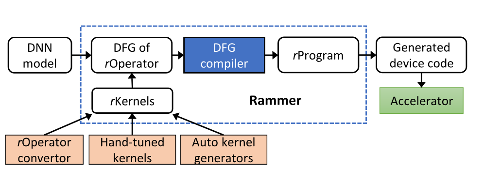

**图 7.** RAMMER 的整体工作流.

本节余下部分将介绍 RAMMER 在 CUDA GPU 上的实现细节. 我们重点讨论 NVIDIA GPU 与 CUDA 生态系统, 因为它们是应用最广泛的 DNN 加速器. 为说明 vDevice 抽象能让 RAMMER 编译器用统一接口支持不同加速器, 本节末尾还会简要介绍我们在 AMD GPU 和 Graphcore IPU 等其他 DNN 加速器上的实践.

### 4.1 NVIDIA CUDA GPU 上的 RAMMER

一块 NVIDIA GPU 通常包含数十到数百个流多处理器 (SM), 每个 SM 又包含数十个核心. SM 遵循单指令多线程 (SIMT) 模型执行计算. 本文假设读者熟悉 CUDA [Nvi00a] 的基本概念, 即 NVIDIA 为 GPU 编程引入的编程范式. 一个 CUDA 程序通常称为 CUDA kernel, 它把多个线程组织成 block. 每个线程 block 被分配到一个 SM 上运行, 具体调度由 GPU 硬件完成. RAMMER 很自然地把每个 vEU 映射到一个 SM, 并把 rTask 实现为线程 block.

#### 4.1.1 CUDA 中的 rOperator

[图 8](#figure-08) 展示了一个朴素的 CUDA rOperator 实现, 它将 $M \times K$ 矩阵 $A$ 与 $K \times N$ 矩阵 $B$ 相乘. 为简化起见, 假设 $M$ 和 $N$ 都能被 32 整除. 代码中每个 rTask 计算输出矩阵 $C$ 的一个 $32 \times 32$ 分块. [图 8](#figure-08) 第 1-10 行展示了一个 rTask 中一个线程的计算. 线程通过 RAMMER 分配的 `rtask_id` 标识该 rTask 要计算的分块, 见第 3-4 行; 再通过 CUDA 内置线程索引 `threadIdx` 标识该线程要计算的数据元素, 见第 5-6 行. 第 7-9 行计算这个元素. 第 13 行给出该 rOperator 暴露的接口, 由 vEU 的并行线程调用. 算子所需 rTask 总数取决于矩阵维度 $M$ 和 $N$, 可通过 `get_total_rtask_num` 接口获得, 见第 16 行. [图 8](#figure-08) 的代码与传统 CUDA 代码有一个关键区别: rTask 使用由 RAMMER 控制的逻辑索引 `rtask_id`, 而不是由 GPU 硬件调度器控制的内置线程 block 索引 `blockIdx`. 因此, RAMMER 可以用适当的 `rtask_id` 执行 `compute_rtask()`, 把 rTask 映射到指定 vEU. [图 8](#figure-08) 的代码仅用于说明. [第 5 节](#section-5) 的评估采用了更复杂的分块矩阵乘法 rOperator, 通过谨慎利用共享内存和寄存器等 GPU 内存层次进一步提升性能 [Lai13, Nat10].

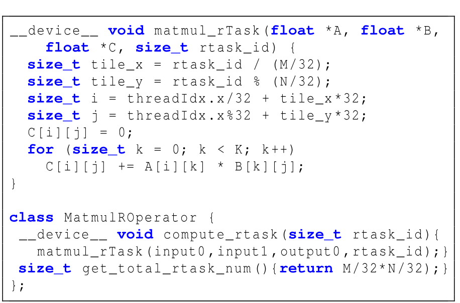

**图 8.** 采用 rOperator 抽象的朴素矩阵乘法 CUDA 实现.

#### 4.1.2 CUDA GPU 上的 vDevice 与 vEU

在 CUDA GPU 上, 算子内调度通常由 GPU 内置调度器管理. 为绕过内置调度器, RAMMER 使用持久线程 block (PTB) [Gup12] 在 vDevice 中实现 vEU. PTB 是包含一组持续运行线程的线程 block, RAMMER 可以把 PTB 固定到指定 SM. 给定一个 rProgram, PTB 中的每个线程, 也就是 vEU 中的线程, 会按 rProgram 指定的序列执行 `compute_rtask()`. 要在 PTB 中连续执行多个 rTask 的 `compute_rtask()`, CUDA 要求 `compute_rtask()` 及其调用的所有子函数都带有 `__device__` 函数限定符, 如[图 8](#figure-08) 第 1 行和第 13 行.

[图 9](#figure-09) 展示了具有两个 vEU 的 vDevice 的 CUDA 代码, 即包含两个 PTB 的 CUDA kernel 函数. 该 vDevice 执行一个 rProgram, 这个 rProgram 由包含 Matmul, Relu 和 Conv 三个 rOperator 的 DFG 编译而来. 按执行方案, vDevice 在 vEU 0 上执行 Matmul 算子的两个 rTask, 同时在 vEU 1 上并行运行 Relu 算子的四个 rTask. 随后, 两个 vEU 之间插入一个全局屏障, 各自运行一个 barrier-rTask: vEU 0 等待 vEU 1 上的第 4 个 rTask, vEU 1 则等待 vEU 0 上的第 2 个 rTask. 最后, vDevice 分别在两个 vEU 上执行 Conv 算子的两个 rTask. 在每个 vEU 上, RAMMER 都在一个代码分支中依次运行 rTask; 只有当前 vEU Id 与 rProgram 生成的 Id 相符时才会执行该分支.

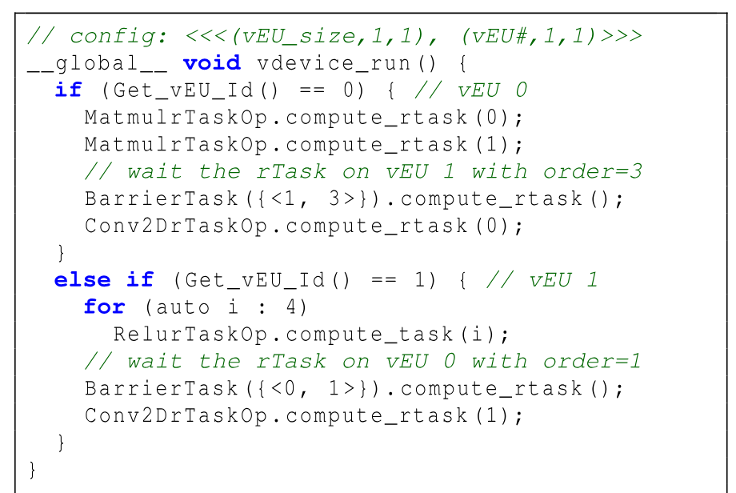

**图 9.** 具有两个 vEU 的 vDevice 的 CUDA 代码.

在一段较长的 DNN 计算开始前, RAMMER 通过 GPU 调度器 [Wu15] 把每个 vEU, 也就是 PTB, 分派到指定 SM. 为提高硬件利用率, 一个 SM 可以并发运行多个 vEU (PTB). CUDA 采用 SIMT 模型, 所有 vEU 都是同构的. 一个 SM 能支持多少 vEU, 取决于所有 vEU 中资源需求最高的 rTask, 也就是需要最多线程, 寄存器或共享内存等资源的 rTask. 实践中, 我们根据 CUDA 编译器 nvcc [Nvi00b] 给出的最大活动 PTB 数量, 设置每个 SM 上的 vEU 数量. 借助 vDevice 抽象, RAMMER 中的优化不再依赖具体硬件.

#### 4.1.3 在 CUDA vEU 上执行 rTask

**执行异构 rTask.** 在 CUDA kernel 中, 线程 block 的线程数在整个执行生命周期内固定不变. 因而, RAMMER 要求一个 vEU 上的所有 rTask 使用相同数量的持久线程运行. 实际上, 不同 rOperator 为平衡并行度和单线程资源用量, 可能会采用不同的线程数. 为解决这个问题, RAMMER 把 vEU 的线程数设为该 vEU 中所有 rTask 所用线程数的最大值. 如果某个 rTask 需要的线程较少, RAMMER 会在多余线程中插入提前退出逻辑, 跳过不必要且无效的执行. 然而, 提前退出可能导致死锁: 被提前退出逻辑跳过的线程可能无法抵达全局屏障, 使其永远无法返回. RAMMER 可以利用 CUDA cooperative group 原语 [Nvi00d] 避免这一问题, 显式控制同步涉及的线程范围.

**实现 barrier-rTask.** 为高效实现 barrier-rTask, RAMMER 引入一个 step 数组, 其中每个整数元素记录相应 vEU 已完成的 rTask 数量. rTask 完成时, 会用它的第一个线程把 step 数组中相应元素加 1. 当 barrier-rTask 等待 $N$ 个 vEU 上的一组 rTask 时, 它会用最前面的 $N$ 个线程轮询 step 数组中相应元素, 直到这些 step 值大于所等待 rTask 的顺序号. 随后, barrier-rTask 调用 `__syncthreads`, 确保该 vEU 中所有线程都已准备好运行下一个 rTask.

#### 4.1.4 转换旧有 CUDA 算子

DNN 已有许多算子以 CUDA kernel 代码提供. 为减少开发工作, RAMMER 引入源到源转换器, 把旧有 CUDA 算子转换为 rOperator. 转换器基于一项关键观察: 旧有 CUDA 算子为发掘算子内并行性, 同样实现为线程 block, 只是它们使用 `blockIdx`, 把算子内调度直接交给 CUDA GPU 硬件控制. rOperator 只需根据 `rtask_id` 计算所需的 `blockIdx`, 无须改动旧有 kernel 的计算逻辑.

转换的一项难点在于, 现有算子的线程 block 可能按一维, 二维或三维形状布局, vEU 中的线程却按一维形状布局. 因而, vEU 需要支持线程形状不同的 rTask. 例如, [图 10](#figure-10) 展示了一个 vEU 执行线程形状分别为 $[2 \times 2]$ 和 $[2 \times 3]$ 的两个 rTask. 我们让 vEU 固定采用一维持久线程形状, 再进行线程索引重映射, 根据 vEU 的一维 `threadIdx` 计算旧有 kernel 所需的 `threadIdx`. 如前所述, vEU 的线程数是其中所有 rTask 线程数的最大值, 所以这种重映射始终可行. 例如, [图 10](#figure-10) 将 vEU 配置为 $[1 \times 6]$ 个持久线程. 执行采用旧有 $[2 \times 2]$ 线程形状的 rTask 0 时, RAMMER 会把 $[2 \times 2]$ 形状重映射到 vEU 的 $[1 \times 6]$ 线程.

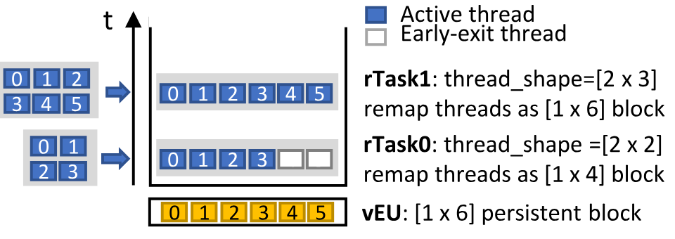

**图 10.** 在一个 vEU 上执行两个异构 rTask.

总的来说, 要把旧有 DNN 算子转换为 rOperator, 需要重映射线程与 block 索引, 实现提前退出逻辑, 并使用 CUDA cooperative group 原语在活动线程, 即未提前退出的线程上实现局部屏障. RAMMER 在旧有算子 kernel 代码的入口处插入一段由编译器生成的代码来完成这些修改. 修改后, RAMMER 可以保留旧有算子实现, 并将其复用为 rTask 算子. 我们在 RAMMER 中共转换并实现了 70 个 rOperator 的 150 个 rKernel.

### 4.2 其他加速器上的 RAMMER

RAMMER 的设计不限于 CUDA 和 NVIDIA GPU. rTask, rOperator 和 vEU 抽象适用于任何具有同构执行单元的大规模并行计算设备, 包括大多数用于 DNN 计算的设备. 本节讨论如何移植 RAMMER 以支持其他设备.

#### 4.2.1 AMD GPU 上的 RAMMER

AMD GPU 与 NVIDIA GPU 相似, 同样由许多称为计算单元 (CU) 的并行执行单元组成. AMD GPU 采用类似 CUDA 的 HIP 编程模型 [Amd00a]. AMD 提供 `hipify` 工具, 可以把 CUDA kernel 转换成 HIP kernel. `hipify` 可以帮助把大多数 CUDA rOperator 转换为 HIP 版本. 由于架构存在细微差异, 一些 CUDA kernel 配置并未针对 AMD GPU 优化, 如每个线程 block 的线程数和本地内存大小. 为获得更好性能, 我们为 AMD GPU 重新实现了 41 个 rKernel. `hipify` 也能把 vDevice 的 CUDA 实现, 即 PTB, 转换成 HIP 版本. 唯一的例外是 AMD GPU 不支持 cooperative group 原语. 为解决这个问题, 我们在 rOperator 中引入一个新 API, 给出 block 内同步次数 $S$, 也就是 `__syncthreads` 的调用次数. 对提前退出的线程, RAMMER 不让其立即退出, 而是插入代码调用 $S$ 次 `__syncthreads` 原语.

#### 4.2.2 Graphcore IPU 上的 RAMMER

Graphcore IPU (智能处理单元) [Gra20a] 是一种先进的 DNN 加速器, 架构与 GPU 很不相同. IPU 是采用批量同步并行 (BSP) 通信模型的大规模并行 MIMD 处理器. 每块 IPU 包含 1,216 个称为 tile 的并行处理单元; 一个 tile 由一个超线程计算核心和 256 KB 本地内存组成. IPU 上的 DNN 计算被显式编程为数据流图, 每个顶点实现在一个 tile 上执行的代码, 每条边则表示顶点之间的数据传输. IPU 编译器负责把每个顶点映射到一个 tile.

RAMMER 的 rTask 抽象也可以映射到 IPU 的 MIMD 模型: vEU 可以映射到 tile, 顶点则可以视为 rTask. 因而, IPU 上的 rOperator 可以实现为一组顶点. 更重要的是, IPU 编译器允许在编译时控制顶点到 tile 的映射, 提供了 vDevice 抽象所需的核心功能. 受硬件 BSP 模型限制, IPU 不提供细粒度同步机制. 因此, 我们用全局屏障实现 barrier-rTask, 这可能缩小 RAMMER 的调度空间. 即便有这一限制, RAMMER 仍能在同一计算步骤中调度不同算子的 rTask, 从而提高利用率. 为评估 RAMMER, 我们共实现了 15 个 rOperator 和 18 个 rKernel.

#### 4.2.3 x86 CPU 上的 RAMMER

我们还在多核 x86 CPU 上实现了 RAMMER. 不过, 在 x86 平台采用 RAMMER 抽象几乎没有性能收益. x86 核心的数值计算性能相对较低, 因而算子运行时间很长; 同时核心数量不多, 几乎任何 DNN 算子都能将它们占满. 此外, kernel 启动只相当于一次普通函数调用, 调度开销并不显著. 因此, 与传统双层调度方法相比, RAMMER 无法提供额外收益.

## 5 评估

本节将 RAMMER 与其他先进框架比较, 给出详细评估结果, 以说明 RAMMER 的有效性.

### 5.1 实验设置

**机器环境.** 我们在三台配备不同加速器的服务器上评估 RAMMER. CUDA GPU 实验使用 Azure NC24s_v3 虚拟机, 配有 Intel Xeon E5-2690v4 CPU 和 4 块 NVIDIA Tesla V100 (16GB) GPU, 运行 Ubuntu 16.04, CUDA 10.0 与 cuDNN 7.6.5. AMD ROCm GPU 实验使用一台配有 Intel Xeon E5-2640 v4 CPU 和 2 块 AMD Radeon Instinct MI50 (16GB) GPU 的服务器, 安装 Ubuntu 18.04 与 ROCm 3.1.1 [Amd00]. IPU 实验使用 Azure ND40s_v3 预览版虚拟机, 配有 Intel Xeon Platinum 8168 CPU 和 16 块 IPU, 使用 Poplar-sdk 1.0.

我们把 RAMMER 与其他 DNN 框架和编译器比较, 包括代表先进 DNN 框架的 TensorFlow v1.15.2, 代表先进 DNN 编译器的 TVM v0.7 [Che18d] 和 TensorFlow-XLA, 以及面向 NVIDIA GPU 的厂商专用推理库 TensorRT v7.0, 实验采用它的 TensorFlow 集成版本.

**基准与数据集.** 评估使用一组有代表性的 DNN 模型, 涵盖 CNN 与 RNN 等典型深度神经网络架构, 以及图像, NLP 和语音等不同应用领域. ResNeXt [Xie16] 是 ResNet [He16] 的改进版本; NASNet [Zop18] 是通过神经架构搜索得到的先进 CNN 模型; AlexNet [Kri12] 代表结构简单的经典 CNN 模型. LSTM-TC [Hoc97] 是用于文本分类的 RNN 模型; DeepSpeech2 [Amo16] 是有代表性的语音识别模型; Seq2Seq [Sut14] 则用于神经机器翻译. 这些基准的全部实现, 包括各模型使用的 rKernel, 均可在我们的 artifact evaluation 仓库中取得 [+artifact].

[+artifact]: Artifact 见 <https://github.com/microsoft/nnfusion/tree/osdi20_artifact/artifacts>.

评估主要关注模型推理. RAMMER 在原理上并不受模型训练限制, 只是支持训练需要我们开发更多算子. 我们在 CIFAR-10 [Kri00], ImageNet [Den09], LibriSpeech [Pan15] 和合成数据集上评估这些模型. [表 1](#table-01) 列出模型, 超参数及对应数据集. 所有实验中的性能数值均为 1,000 次运行的平均值; 各种情况下观测到的波动都很小.

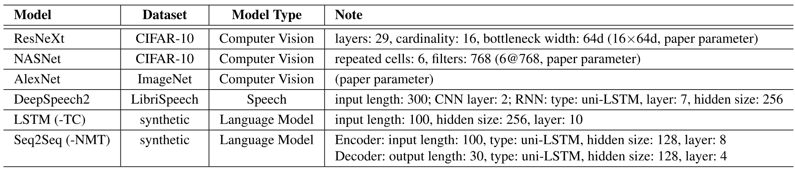

**表 1.** 深度学习模型与数据集.

### 5.2 CUDA GPU 上的评估

本节回答以下问题: 1) 与先进 DNN 框架或编译器相比, RAMMER 表现如何? 2) RAMMER 对 GPU 并行资源的利用程度如何? 3) RAMMER 能把运行时调度开销降低多少? 4) RAMMER 同时利用算子内与算子间并行性的调度能带来多少性能提升? 5) 细粒度同步对整体性能的改善有多大?

#### 5.2.1 端到端性能

我们首先把 RAMMER 与 TensorFlow (TF), TensorFlow-XLA (TF-XLA), TVM 和 TensorRT (TF-TRT) 比较, 说明 RAMMER 的端到端效率. 为展示 RAMMER 所引入抽象的收益, 我们创建了一个基线版本 RAMMERBASE, 它只实现与现有编译器相似的优化, 仍采用双层调度. 因此, RAMMERBASE 可以视为另一个与 RAMMER 使用相同代码库的普通 DNN 编译器. [图 11](#figure-11) 给出批大小为 1 时各基准的执行时间.

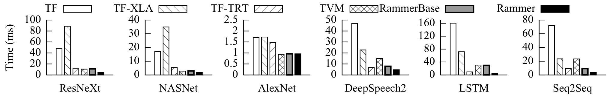

**图 11.** NVIDIA V100 GPU 上批大小为 1 时的端到端模型推理时间.

首先, RAMMER 的性能平均是 TF 的 14.29 倍, 在 LSTM-TC 模型上最高达到 33.94 倍. RAMMER 相对 TF 的性能提升, 主要来自 TF 在 DFG 层承受的沉重运行时调度开销. 当单个算子的执行时间较短时, 例如小批量推理, 这个问题尤其突出. 作为 DNN 编译器, TF-XLA 可以通过 DFG 层优化, 如算子融合, 以及算子层代码特化, 如生成定制 kernel, 来改善 TF 的性能. 但它仍无法完全避免调度开销, 与 RAMMER 相比平均慢 11.25 倍, 最高慢 20.12 倍. 我们还发现, 在 ResNeXt 和 NASNet 等 CNN 模型上, TF-XLA 的开销甚至高于 TF. TVM 是另一种先进 DNN 编译器, 它主要利用 kernel 调优技术为每个算子生成特化 kernel. 在评估中, TVM 调优 1,000 步, 为每个算子选择最快 kernel. 这种专门优化能让 TVM 的性能显著超过 TF 与 TF-XLA. 尽管如此, RAMMER 的平均性能仍是 TVM 的 3.48 倍, 最高可达 6.46 倍. TVM 可以通过调优让单个算子运行得更快, 却仍然缺乏像 RAMMER 一样利用细粒度并行性的能力. AlexNet 是一个例外, RAMMER 在它上面只能取得与 TVM 相当的性能. 主要原因是 AlexNet 属于较早的现代 DNN 模型, 架构简单且顺序执行, 算子数量较少但粒度较大, 因而容易优化. 最后, TensorRT 是一个专用 DNN 推理库, 其中包含 NVIDIA 提供的高度优化算子. 它的独立版本无法直接编译这些基准, 因此我们使用官方 TensorFlow 集成版本 TF-TRT 编译并运行模型. 不过, 对 DeepSpeech2, LSTM-TC 和 Seq2Seq-NMT 等 RNN 模型, TF-TRT 编译超过 50 小时后仍未产生结果. 因此, 我们用 TensorRT 原生 API 重新实现了这三个模型. 评估表明, RAMMER 在所有基准上都超过面向厂商优化的 TensorRT, 延迟平均降低 2.18 倍, 最高降低 3.09 倍. 与 RAMMERBASE 相比, RAMMER 还能把端到端性能平均提高 2.59 倍, 最高提高 6.29 倍.

**不同批大小下的性能.** 我们还评估了 RAMMER 在较大批大小下的性能. [图 12](#figure-12) 比较两个代表性 CNN 和 RNN 模型 ResNeXt 与 LSTM-TC 在批大小为 4 和 16 时的性能. 由于为 RAMMER 开发优化 rOperator kernel 的成本很高, 这项测试只包含两个基准. 我们必须寻找高效的开源算子 kernel 实现, 或者手工调优, 或者使用自动调优工具, 这些工作都很耗时. 如图所示, 较大的批大小会增加单个算子的执行时间, 因而能降低现有框架中的调度开销. 即便如此, 除批大小为 16 的 ResNeXt 上 TensorRT 更快外, RAMMER 仍超过所有系统. 在这个例子中, TensorRT 使用了一些源码未公开的算子, 我们的实现还无法达到相同性能. 事实上, 如何实现能匹配闭源 kernel 性能的算子, 是 RAMMER 面临的主要挑战之一. 与其他开源框架和编译器相比, RAMMER 优势明显. 例如, 批大小为 16 时, 在 ResNeXt 上 RAMMER 的性能是 TF 的 2.25 倍, TVM 的 1.25 倍. 在 LSTM-TC 上, RAMMER 相对 TF 与 TVM 的性能提升分别达到 20.08 倍和 9.0 倍.

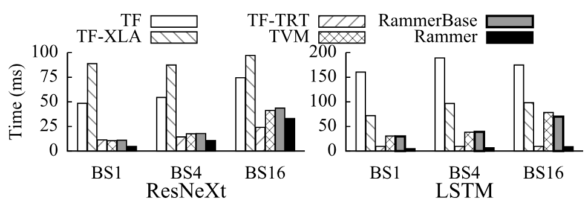

**图 12.** 不同批大小 (BS) 下的端到端模型推理时间.

**较大输入尺寸下的性能.** 默认设置中, ResNeXt 和 NASNet 使用 CIFAR-10 数据集中的 $32 \times 32$ 图像评估. 为展示 RAMMER 在较大图像上的性能, 我们还按照原论文 [Xie16, Zop18] 的模型超参数, 在 ImageNet 数据集上评估这两个模型. 具体来说, ImageNet 上的 ResNeXt 使用 101 层, 基数为 64, 瓶颈宽度为 4d; NASNet 的重复 cell 数为 4, filter 数为 1056. [图 13](#figure-13) 给出端到端模型推理时间. 结果表明, 增大输入尺寸对 RAMMER 的性能收益影响很小. 例如, 在 ImageNet 上, ResNeXt 中 RAMMER 的性能仍然是 TF 的 18.91 倍, TVM 的 4.96 倍, 甚至是 TF-TRT 的 2.06 倍. 对 NASNet, RAMMER 相对 TF, TVM 和 TF-TRT 的性能提升分别为 6.99 倍, 1.33 倍和 2.34 倍. 如此显著的提升主要是因为面向较大数据集的模型结构通常具有更多算子间并行性, RAMMER 可以更充分地利用. 例如, 数据集从 CIFAR-10 换成 ImageNet 后, ResNeXt 的基数从 16 增至 64.

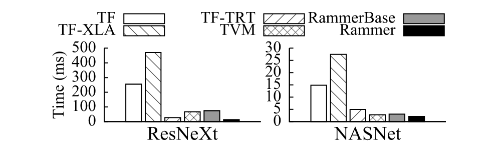

**图 13.** ImageNet 数据集上批大小为 1 时的端到端模型推理时间, 图像尺寸为 $224 \times 224$.

需要说明的是, 在上述评估中, RAMMERBASE 的性能已经能够达到甚至超过 TF-XLA 和 TVM 等编译器. 因此, 后续评估将 RAMMERBASE 作为先进编译器的基线, 将 TF-TRT 作为先进 DNN 推理库, 以衡量 RAMMER 的收益. RAMMERBASE 还能帮助排除不同实现给性能比较带来的影响.

#### 5.2.2 GPU 利用率

RAMMER 的调度允许不同算子的 rTask 并排执行, 从而提高 GPU 利用率. 我们把 RAMMER 与 TF, TF-TRT 和 RAMMERBASE 比较, 评估利用率提升. [图 14](#figure-14) 给出 6 个 DNN 模型在批大小为 1 时, 整段执行时间内的平均利用率. 平均 GPU 利用率只统计 kernel 执行, 不包含发出算子等其他阶段. 具体来说, 我们使用 NVIDIA 剖析器 nvprof [Nvi00c] 提供的 SM-efficiency 指标衡量利用率. 该指标计算至少有一个 warp 在多处理器上处于活动状态的时间占比. 与 TF 和 TF-TRT 相比, RAMMER 在不同模型上的平均 GPU 利用率分别提高 4.32 倍和 2.45 倍. 这既来自较低的运行时调度开销, 也来自 RAMMER 协同调度算子的能力. 与使用相同 kernel 集合且经过高度优化的 RAMMERBASE 比较可见, 单凭 RAMMER 的调度, 利用率平均就能提高 1.61 倍, 在 LSTM-TC 模型上最高提高 2.39 倍.

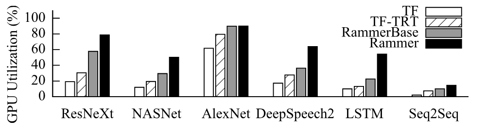

**图 14.** GPU 利用率比较.

如[第 2 节](#section-2) 所述, 现代 GPU 支持多流机制, 通过并发调度彼此独立的 kernel 提高利用率. 我们增加 TF 的 stream 数量, 评估多流效率. [图 15](#figure-15) 同时给出每个模型使用 1, 2 和 4 个 stream 时的端到端执行时间与 kernel 时间. 结果表明, 使用更多 stream 会损害端到端性能, 其他工作也观察到了这一现象 [Siv19]. 例如, 与单 stream 相比, 4 个 stream 会让端到端时间平均增加 2.72 倍. 此外, 启用多流后, 每个模型的 kernel 时间只略有下降, 说明大多数 kernel 仍然按顺序执行, 对 GPU 利用率几乎没有改善. 主要原因是多流会带来更高的算子调度开销, 如[图 15](#figure-15) 所示.

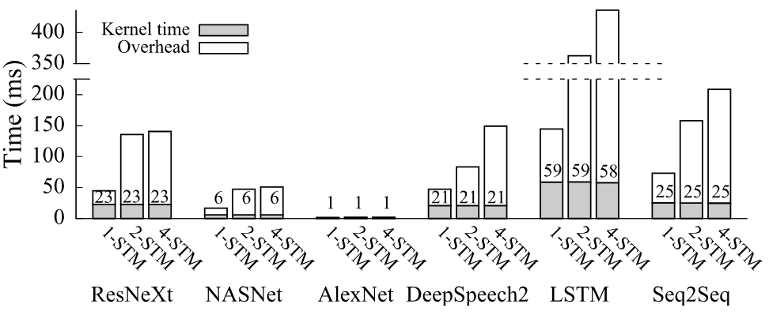

**图 15.** 不同 stream (STM) 数量下的 TF 性能. 柱顶数字表示 kernel 时间.

#### 5.2.3 调度开销

RAMMER 提出的技术可以有效降低调度开销. 为验证这一点, 我们将 RAMMER 与 TF, TF-TRT 和 RAMMERBASE 比较, 评估运行时调度开销. [图 16](#figure-16) 给出各模型的 kernel 总时间与调度开销, 即未用于实际计算的时间. 具体来说, 与 TF 相比, RAMMERBASE 可以把所有模型的平均调度时间从 32.29 毫秒降至 2.27 毫秒, 开销占比从 55.41% 降至 18.43%. 即使与 TF-TRT 相比, RAMMERBASE 也能把平均调度开销从 31.38% 降至 18.43%. RAMMERBASE 通过优化调度执行代码路径, 并利用算子融合减少 kernel 启动次数来实现这一点. 如此显著的降幅, 说明现有 DNN 框架中的算子调度开销确实很高. 与 RAMMERBASE 相比, RAMMER 又能把平均开销从 2.27 毫秒降至 0.37 毫秒, 降低 6.14 倍. 这主要得益于静态编译时算子调度: RAMMER 把算子打包进 rProgram, 让多个算子可以通过一次 GPU kernel 启动执行.

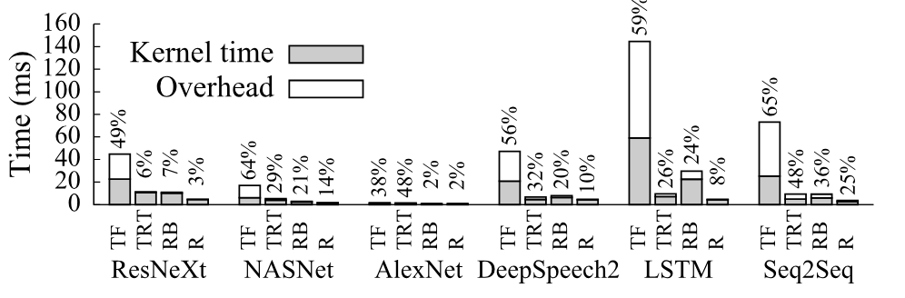

**图 16.** 不同模型上的 GPU 调度开销. 柱顶数字表示开销百分比. TF: TensorFlow; TRT: TF-TRT; RB: RAMMERBASE; R: RAMMER.

#### 5.2.4 算子内与算子间调度的相互作用

RAMMER 让调度策略能够优化算子内与算子间调度的相互作用, 而不只是让单个算子尽可能快. 如[第 3.3 节](#section-3-3) 所述, 这通过为每个 rOperator 选择适当的 rKernel 实现. 我们使用两组 kernel 评估这种调度的效果: 第一组只包含各算子的最快 kernel, 第二组由 RAMMER 的调度策略选择. [图 17](#figure-17) 给出 RAMMER 与 RAMMERBASE 使用这两组 kernel 时, 在代表性 CNN 模型 ResNeXt 和 RNN 模型 LSTM-TC 上的性能. 首先, 无论使用哪组 kernel, RAMMER 都能显著提升性能. 例如, 当 RAMMER 使用与 RAMMERBASE 相同的最快 kernel 时, 即比较 RAMMER-fast 与 RAMMERBASE-fast, 性能平均提高 2.89 倍. 如果一个 rOperator 有更多 rKernel 可选, RAMMER 能按策略选择 kernel, 即 RAMMER-select, 那么即使所选 kernel 单独运行时不是最快, 端到端性能仍能比 RAMMER-fast 平均再提高 1.44 倍, 最高提高 2.28 倍. 事实上, 若在 RAMMERBASE 中使用这些 kernel, 即 RAMMERBASE-select, 性能反而会平均下降 1.84 倍.

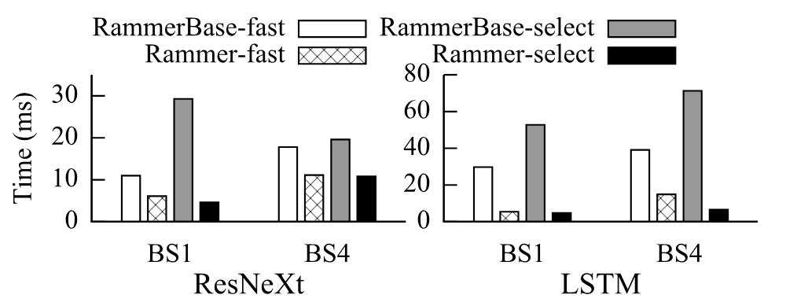

**图 17.** 不同 kernel 集合与批大小 (BS) 下的性能.

我们进一步分析了批大小为 4 的 LSTM-TC 模型所用 kernel. 以 Matmul 算子为例, 最快 kernel 使用 1,024 个 rTask, 最佳执行时间为 4.28 微秒; RAMMER 选中的 kernel 只有 16 个 rTask, 单独启动时执行时间较慢, 为 7.46 微秒. 但 RAMMER 仍选择后者, 用较慢的单个 kernel, 也就是降低算子内并行度, 换取更好的整体性能, 也就是提高算子间并行度. 这正是 RAMMER 整体调度能力带来的收益.

#### 5.2.5 细粒度同步

作为同步机制, barrier-rTask 为具有不规则结构的 DFG 提供了额外优化空间, 这类结构常见于神经架构搜索 (NAS) 生成的模型 [Zop18]. 为突出这项收益, 我们利用先进 NAS 基准 NASBench [Yin19b] 随机生成 5,000 个模块, 每个模块都是由最多 9 个算子和 7 条边组成的小型 DFG. 我们先比较 RAMMER 与 RAMMERBASE 在所有模块上的端到端性能. RAMMER 平均比 RAMMERBASE 快 1.28 倍, 最高快 3.40 倍. 测量还显示, 其中 28.3% 的模块具有明显的不规则结构, 例如算法 1 策略所划分的一个波次中包含异构算子. 对这些模块, 我们比较使用 barrier-rTask 与全局屏障时的端到端性能. 结果表明, barrier-rTask 可带来平均 1.11 倍, 最高 1.89 倍的额外加速. [图 18](#figure-18) 展示了其中一个模块, 图中还列出每个算子的执行时间与 rTask 数量. 对这样的 DFG, barrier-rTask 可以移除波次之间的全局屏障, 插入细粒度 rTask 级同步, 让不同波次的算子重叠执行, 例如波次 1 与波次 2 中的两个 STEM-Conv 算子.

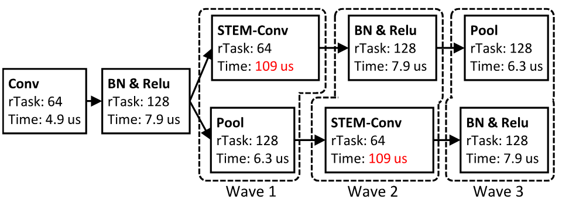

**图 18.** NASBench 生成的不规则 DFG.

### 5.3 其他加速器上的评估

#### 5.3.1 ROCm GPU 上的端到端性能

我们在 AMD ROCm GPU 上将 RAMMER 与 TF, TVM 和 RAMMERBASE 比较, 评估其效率. 实验不包含 TF-XLA, 因为我们无法在 AMD GPU 上成功启用它; 也不包含 TensorRT, 因为它是 NVIDIA 独占的专有软件. [图 19](#figure-19) 给出 6 个基准在批大小为 1 时的端到端性能. 与 TF 相比, RAMMER 的性能平均提高 13.95 倍, 在 LSTM-TC 上最高提高 41.14 倍. 与 TVM 相比, RAMMER 平均提高 5.36 倍, 最高提高 7.57 倍. 需要说明的是, 我们未能让 TVM 的自动调优功能在 ROCm GPU 上工作, 因而本实验中的 TVM 只使用默认 kernel. 与 RAMMERBASE 相比, RAMMER 的调度平均带来 2.19 倍, 最高 4.12 倍的加速. 图中的 RAMMERBASEK 与 RAMMERBASE 完全相同, 只是改用 RAMMER 的 kernel. RAMMER 并不总是为 rOperator 选择单独执行时最快的 kernel. 这种替换对多数模型性能影响很小, 但会让 ResNeXt 的性能下降 3.02 倍, 说明调度与 kernel 选择之间的相互作用十分重要.

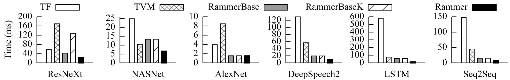

**图 19.** AMD MI50 GPU 上批大小为 1 时的端到端模型推理时间.

#### 5.3.2 Graphcore IPU 上的端到端性能

我们还在 Graphcore IPU 上对 RAMMER 进行了初步评估. 由于为其他模型实现高效 rOperator 需要投入较多工作, 本实验也只选择三个 RNN 基准. RAMMER 目前只支持单块 IPU, 多 IPU 支持留待未来完成. 受 IPU 可用内存限制, 每个 tile 只有 256 KB, 我们把三个 RNN 模型的层数设为 4, 让它们能够装入单块 IPU. [图 20](#figure-20) 给出这些模型在批大小为 1 时的 RAMMER 端到端性能. RAMMER 的初步实现在 RAMMERBASE 基础上最高提升 5.37 倍, 说明 RAMMER 的抽象适用于新的加速器架构, 并且确实有效.

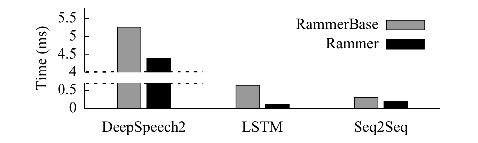

**图 20.** Graphcore IPU 上批大小为 1 时的端到端模型推理时间.

## 6 讨论

说明 RAMMER 的优势后, 本节讨论它的一些局限和未来工作.

**大批大小下的性能收益.** 当算子内并行性不足以占满硬件时, RAMMER 的收益更显著. 在线 DNN 推理通常采用较小的输入批大小, 正属于这种情况. 初步实验还表明, 某些使用较大批大小, 如 256, 的模型训练工作负载也有相同问题, LSTM-TC 就是一个例子. [图 21](#figure-21) 给出批大小为 256 时 LSTM-TC 的训练性能. RAMMER 对算子内与算子间并行性进行整体优化后, 性能达到基线实现 RAMMERBASE 的 2.28 倍, TF-XLA 的 2.36 倍. 对大批大小模型训练进行更细致的分析与进一步优化, 留作未来工作.

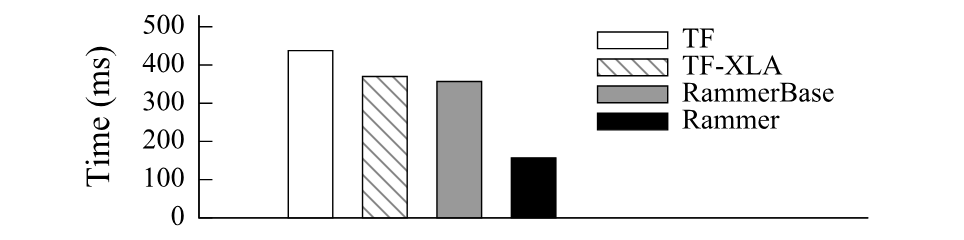

**图 21.** NVIDIA V100 GPU 上批大小为 256 时 LSTM-TC 的端到端模型训练时间. TVM 和 TF-TRT 不支持训练, 因而缺少相应数据.

**动态图.** RAMMER 目前只支持静态图. 对具有动态控制流的 DFG [Yu18c], RAMMER 可以把每个静态子图, 如条件分支或循环体, 分别编译成独立 rProgram. 具体实现留待未来完成.

**作业间调度.** RAMMER 专注于优化单个深度学习作业, 与作业间调度相互正交. 后者可以把多个模型成批调度, 或通过 vDevice 精确控制每个作业的硬件资源. 不过, 在同一加速器中协同调度不仅来自不同算子, 还来自不同作业的 rTask, 是一个值得探索的问题.

## 7 相关工作

根据双层表示, DNN 编译器优化大体可以分成两类. TensorFlow [Aba16], PyTorch [Pyt17], TVM [Che18d] 和 XLA [Xla17] 等许多 DNN 框架与编译器都使用算子融合等 DFG 层优化. TASO [Jia19b] 提出自动生成图替换来优化 DFG. 在算子层, 近期工作采用不同方法调优并生成高效的硬件专用算子代码, 如 AutoTVM [Che18a], Tensor Comprehensions [Vas18], FlexTensor [Zhe20a], Tiramisu [Bag19] 和 Halide [Rag13]. RAMMER 可以接收优化后的 DFG, 并用这些 kernel 生成器产生高效 rKernel, 因而与上述优化兼容.

DNN 推理及其优化最近受到广泛关注. DeepCPU [Zha18c], BatchMaker [Gao18], GRNN [Hol19] 和 NeoCPU [Liu19] 在 CPU 或 GPU 上针对特定 RNN 或 CNN 模型优化推理. Jain 等人 [Jai18a] 提出同时对多个推理作业进行时间与空间复用, 以提高 GPU 利用率. RAMMER 与这些工作有两点不同: 1) RAMMER 适用于通用 DNN 模型与加速器; 2) RAMMER 不只是进行编译器优化, 还为 DNN 计算提供新的抽象与更大的优化空间. Astra [Siv19] 利用 DNN 的可预测性在线优化 DNN 训练, RAMMER 则利用同一特性降低单个 rTask 的调度开销. 此外, 还有许多推理系统在保证查询延迟的前提下优化整体吞吐量, 如 Nexus [She19], PRETZEL [Lee18b], Clipper [Cra17] 和 TF-serving [Ols17]. RAMMER 专注于优化单个模型, 与这些工作相互正交.

GPU 社区还有一些工作提出在 GPU 内部使用软件调度器调度通用工作负载. 例如, Juggler [Bel18] 提出一个框架, 动态执行表示为任务 DAG 的作业. Wu 等人 [Wu15] 提出一种软件方法, 控制作业在 SM 上的局部性. RAMMER 则由 DNN 工作负载的特性出发, 提出 rTask 和 rOperator 这种新的计算表示, 并采用编译时调度, 从体系上避免运行时开销.

## 8 结论

现有深度学习框架采用双层调度设计, 在框架中管理算子间调度, 把算子内调度交给硬件加速器. 这种设计具有根本局限, 给 DNN 计算带来了不必要的开销. RAMMER 用整体编译器方案解决这一问题: (1) 提供 rTask 算子抽象, 暴露细粒度的算子内并行性; (2) 把现代加速器虚拟化为多个并行执行单元, 暴露硬件的细粒度调度能力; (3) 利用 DNN 计算的可预测性, 把运行时调度转化为在编译时生成 rTask 执行方案的问题. 评估表明, 相比原生深度学习框架, 编译框架, 以及 GPU 厂商专用推理引擎, RAMMER 都能取得显著提升. 因而, RAMMER 可以成为现有 DNN 编译器基础设施生态的一项新增强.

## 致谢

感谢匿名审稿人和 shepherd Jinyang Li 教授提出大量建议. 感谢 Microsoft Grand Central Resources 团队的 Jim Jernigan 和 Kendall Martin 提供 GPU 支持. Fan Yang 感谢已经离世的爱猫 Pearl 在本文写作期间始终陪伴左右. 本工作得到国家自然科学基金项目 61972004 的部分资助.
