> [Yutao Sun](https://dblp.org/pid/01/9758) [+equal], [Li Dong](https://dblp.org/pid/85/5090-4) [+equal], [Shaohan Huang](https://www.microsoft.com/en-us/research/people/shaohanh/), [Shuming Ma](https://dblp.org/pid/190/7739), [Yuqing Xia](https://dblp.org/pid/211/8365), [Jilong Xue](https://dblp.org/pid/06/10336), [Jianyong Wang](https://dblp.org/pid/24/2006), [Furu Wei](https://dblp.org/pid/72/5870) [+corresponding]. 首次提交至 arXiv: 2023 年 7 月 17 日; 当前版本: v4. [Retentive Network: A Successor to Transformer for Large Language Models](https://arxiv.org/abs/2307.08621). <a href="/paper/retentive-network.pdf" target="_blank" rel="noopener noreferrer">原始 PDF</a>. [DOI](https://doi.org/10.48550/arXiv.2307.08621). [TeX 源码](https://export.arxiv.org/e-print/2307.08621v4). 精确的印刷排版与参考文献以原始 PDF 为准.

[+equal]: 同等贡献.

[+corresponding]: 通讯作者.

## 摘要

本文提出 Retentive Network (RetNet), 作为大语言模型的基础架构, 同时实现并行训练、低成本推理与良好性能. 我们从理论上推导了循环与注意力之间的联系. 随后, 我们提出用于序列建模的 retention 机制, 它支持三种计算范式, 即并行、循环和分块循环. 具体而言, 并行表示支持并行训练. 循环表示能够以较低成本进行 $O(1)$ 推理, 在不牺牲性能的情况下改善解码吞吐量、延迟与 GPU 内存占用. 分块循环表示以线性复杂度实现高效的长序列建模, 其中各分块并行编码, 同时以循环方式汇总分块. 语言建模实验表明, RetNet 具有良好的扩展结果、并行训练能力、较低的部署成本与高效推理能力. 这些特性使 RetNet 成为大语言模型中 Transformer 的有力继任者. 代码将在 [https://aka.ms/retnet](https://aka.ms/retnet) 发布.

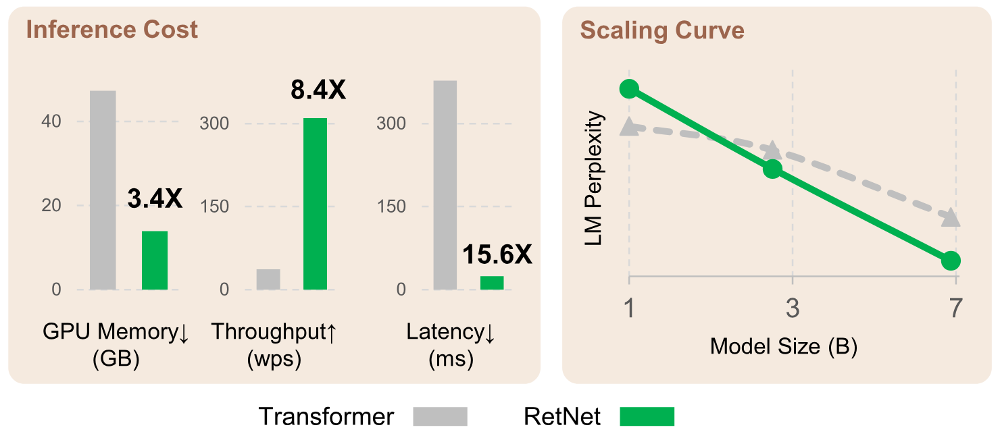

**图 1.** 与 Transformer 相比, Retentive network (RetNet) 实现了低成本推理 (即 GPU 内存、吞吐量和延迟)、并行训练与良好的扩展曲线. 推理成本结果采用 8k 输入长度. [图 6](#figure-06) 给出了不同序列长度下的更多结果.

> 发现可能之边界的唯一途径, 是越过它们, 进入不可能.
>
> —Arthur C. Clarke

## 1 引言

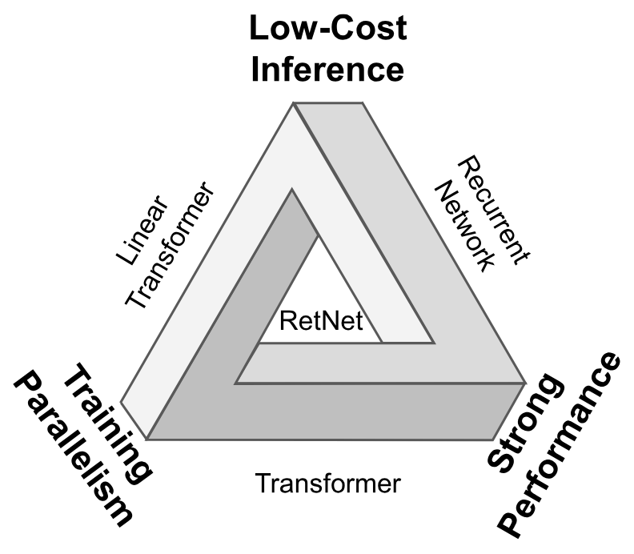

**图 2.** RetNet 让“不可能三角”成为可能, 同时实现并行训练、良好性能与低推理成本.

Transformer [Vas17] 已成为大语言模型 [Bro20] 的事实标准架构, 它最初是为解决循环模型 [Hoc97] 无法并行训练的问题而提出的. 然而, Transformer 的并行训练以低效推理为代价, 因为每一步具有 $O(N)$ 复杂度, 且需要受内存带宽限制的键值缓存 [Sha19], 因此不利于部署. 序列越长, GPU 内存用量和延迟越高, 推理速度也越低.

大量工作不断尝试开发下一代架构, 目标是在保留 Transformer 的并行训练能力与竞争力的同时, 实现高效的 $O(1)$ 推理. 同时满足这些目标很困难, 也就是 [图 2](#figure-02) 所示的“不可能三角”.

相关研究主要有三条路线. 第一, 线性化注意力 [Kat20] 使用核函数 $\phi(\bm{q})\cdot\phi(\bm{k})$ 近似标准注意力分数 $\exp(\bm{q}\cdot\bm{k})$, 从而将自回归推理改写为循环形式. 然而, 它的建模能力与性能不及 Transformer, 限制了这类方法的普及. 第二条路线重新采用循环模型来提高推理效率, 但牺牲了并行训练能力. 一种补救方法是使用逐元素算子 [Pen23b] 加速, 但会损害表示能力与性能. 第三条路线尝试用其他机制替代注意力, 例如 S4 [Gu22] 及其变体 [Dao22g, Pol23a]. 以往工作都未能突破不可能三角, 与 Transformer 相比也没有明确的优胜者.

本文提出 retentive network (RetNet), 同时实现低成本推理、高效长序列建模、可比于 Transformer 的性能与并行训练. 具体而言, 我们引入多尺度 retention 机制替代多头注意力, 它有三种计算范式, 即并行、循环和分块循环表示. 第一, 并行表示支持并行训练, 可以充分利用 GPU 设备. 第二, 循环表示在内存与计算方面实现高效的 $O(1)$ 推理. 部署成本与延迟可以大幅降低. 此外, 不再需要键值缓存技巧, 实现也大为简化. 第三, 分块循环表示可以高效处理长序列. 我们并行编码每个局部分块以提高计算速度, 同时循环编码全局分块以节省 GPU 内存.

我们进行了大量实验, 将 RetNet 与 Transformer 及其变体比较. 语言建模实验表明, RetNet 在扩展曲线和上下文学习方面始终具有竞争力. 此外, RetNet 的推理成本不随长度变化. 对于 7B 模型和 8k 序列长度, RetNet 的解码速度比带键值缓存的 Transformer 快 8.4$\times$, 内存用量减少 70%. 训练期间, 与标准 Transformer 相比, RetNet 还能节省 25-50% 的内存并加速 7$\times$, 相比高度优化的 FlashAttention [Dao22] 也具有优势. RetNet 的推理延迟对批大小不敏感, 因而可以实现很高的吞吐量. 这些特性使 RetNet 成为大语言模型中 Transformer 的有力继任者.

## 2 Retentive Network

Retentive network (RetNet) 由 $L$ 个相同的块堆叠而成, 采用与 Transformer [Vas17] 相似的布局 (即残差连接与 pre-LayerNorm). 每个 RetNet 块包含两个模块: 多尺度 retention (MSR) 模块和前馈网络 (FFN) 模块. 下文介绍 MSR 模块. 给定输入序列 $x=x_1\cdots x_{|x|}$, RetNet 以自回归方式编码该序列. 输入向量 $\{\bm{x}_i\}_{i=1}^{|x|}$ 首先被组成 $X^0=[\bm{x}_1,\cdots,\bm{x}_{|x|}]\in\mathbb{R}^{|x|\times d_{\mathrm{model}}}$, 其中 $d_{\mathrm{model}}$ 是隐藏维度. 随后计算上下文化向量表示 $X^l=\mathrm{RetNet}_l(X^{l-1}), l\in[1,L]$.

### 2.1 Retention

本节介绍同时具有循环和并行两种形式的 retention 机制. 因此, 模型可以并行训练, 并以循环方式执行推理.

给定输入 $X\in\mathbb{R}^{|x|\times d_{\mathrm{model}}}$, 我们将其投影到一维函数 $v(n)=X_n\cdot\bm{w}_V$. 考虑一个通过状态 $\bm{s}_n$ 将 $v(n)$ 映射为 $o(n)$ 的序列建模问题. 为简洁起见, 以 $v_n,o_n$ 表示 $v(n),o(n)$. 我们将该映射写成循环形式:

$$
\begin{aligned}
\bm{s}_n &= A\bm{s}_{n-1}+K_n^\top v_n, &A\in\mathbb{R}^{d\times d}, K_n\in\mathbb{R}^{1\times d} \\
o_n &= Q_n\bm{s}_n=\sum_{m=1}^n Q_nA^{n-m}K_m^\top v_m, &Q_n\in\mathbb{R}^{1\times d}
\end{aligned}
$$

其中, 我们将 $v_n$ 映射到状态向量 $\bm{s}_n$, 再执行线性变换, 以循环方式编码序列信息.

接着, 让投影 $Q_n,K_n$ 感知内容:

$$
Q=X W_Q,\quad K=X W_K
$$

其中, $W_Q,W_K\in\mathbb{R}^{d\times d}$ 是可学习矩阵.

我们将矩阵对角化为 $A=\Lambda(\gamma e^{i\theta})\Lambda^{-1}$, 其中 $\gamma,\theta\in\mathbb{R}^d$. 于是有 $A^{n-m}=\Lambda(\gamma e^{i\theta})^{n-m}\Lambda^{-1}$. 将 $\Lambda$ 吸收到 $W_Q$ 和 $W_K$ 中, 可把[式 (1)](#equation-01) 改写为:

$$
\begin{aligned}
o_n &= \sum_{m=1}^n Q_n(\gamma e^{i\theta})^{n-m}K_m^\top v_m \\
&=\sum_{m=1}^n(Q_n(\gamma e^{i\theta})^n)(K_m(\gamma e^{i\theta})^{-m})^\top v_m
\end{aligned}
$$

其中, $Q_n(\gamma e^{i\theta})^n,K_m(\gamma e^{i\theta})^{-m}$ 称为 xPos [Sun22], 即一种为 Transformer 提出的相对位置编码. 我们进一步把 $\gamma$ 简化为标量, [式 (3)](#equation-03) 变为:

$$
o_n=\sum_{m=1}^n\gamma^{n-m}(Q_n e^{i n\theta})(K_m e^{i m\theta})^\dagger v_m
$$

其中, $^\dagger$ 是共轭转置. 该形式在训练样本内部易于并行化.

概括而言, 我们从[式 (1)](#equation-01) 所示的循环建模出发, 推导出[式 (4)](#equation-04) 的并行形式. 将原映射 $v(n)\mapsto o(n)$ 视作向量后, 得到如下 retention 机制.

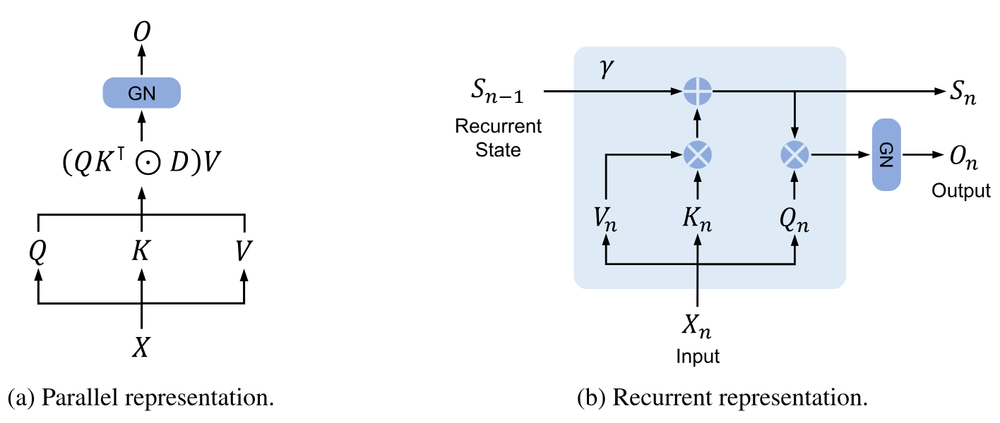

**图 3.** RetNet 的对偶形式. “GN”是 GroupNorm 的缩写.

**Retention 的并行表示.** 如[图 3a](#figure-03) 所示, retention 层定义为:

$$
\begin{aligned}
Q=(X W_Q)\odot\Theta,&\quad K=(X W_K)\odot\overline{\Theta},\quad V=X W_V \\
\Theta_n=e^{i n\theta},&\quad
D_{nm}=\begin{cases}
\gamma^{n-m}, & n\ge m \\
0, & n<m
\end{cases} \\
\mathrm{Retention}(X)&=(Q K^\top\odot D)V
\end{aligned}
$$

其中, $\overline{\Theta}$ 是 $\Theta$ 的复共轭, $D\in\mathbb{R}^{|x|\times|x|}$ 在一个矩阵中同时表示因果掩码和沿相对距离的指数衰减. 与自注意力类似, 并行表示使我们可以用 GPU 高效训练模型.

**Retention 的循环表示.** 如[图 3b](#figure-03) 所示, 所提出的机制也可以写成循环神经网络 (RNN), 适合用于推理. 对于第 $n$ 个时间步, 以循环方式得到输出:

$$
\begin{aligned}
S_n &= \gamma S_{n-1}+K_n^\top V_n \\
\mathrm{Retention}(X_n)&=Q_nS_n,\quad n=1,\cdots,|x|
\end{aligned}
$$

其中, $Q,K,V,\gamma$ 与[式 (5)](#equation-05) 相同.

**Retention 的分块循环表示.** 并行表示与循环表示的混合形式可以加速训练, 对长序列尤其如此. 我们将输入序列划分为若干分块. 每个分块内部按照并行表示 ([式 (5)](#equation-05)) 计算. 相比之下, 跨分块信息按照循环表示 ([式 (6)](#equation-06)) 传递. 具体而言, 令 $B$ 表示分块长度. 第 $i$ 个分块的 retention 输出计算如下:

$$
\begin{aligned}
Q_{[i]}=Q_{Bi:B(i+1)}&,\quad K_{[i]}=K_{Bi:B(i+1)},\quad V_{[i]}=V_{Bi:B(i+1)} \\
R_i&=K_{[i]}^\top(V_{[i]}\odot\zeta)+\gamma^B R_{i-1},\quad\zeta_{ij}=\gamma^{B-i-1} \\
\mathrm{Retention}(X_{[i]})&=\underbrace{(Q_{[i]} K_{[i]}^\top\odot D)V_{[i]}}_{\mathrm{Inner}{-}\mathrm{Chunk}}+\underbrace{(Q_{[i]}R_{i-1})\odot\xi}_{\mathrm{Cross}{-}\mathrm{Chunk}},\quad\xi_{ij}=\gamma^{i+1}
\end{aligned}
$$

其中, ${[i]}$ 表示第 $i$ 个分块, 即 $x_{[i]}=[x_{(i-1)B+1},\cdots,x_{iB}]$.

### 2.2 门控多尺度 Retention

每一层使用 $h=\frac{d_{\mathrm{model}}}{d}$ 个 retention 头, 其中 $d$ 是头维度. 各个头使用不同的参数矩阵 $W_Q,W_K,W_V\in\mathbb{R}^{d\times d}$. 此外, **m**ulti-**s**cale **r**etention (MSR) 为每个头分配不同的 $\gamma$. 为简化起见, 不同层使用相同且固定的 $\gamma$. 我们还加入 $\mathrm{swish}$ 门 [Hen16, Ram17], 以提高 retention 层的非线性. 形式化地说, 给定输入 $X$, 该层定义为:

$$
\begin{aligned}
\bm{\gamma}&=1-2^{-5-\mathrm{arange}(0,h)}\in\mathbb{R}^h \\
\mathrm{head}_i&=\mathrm{Retention}(X,\gamma_i) \\
Y&=\mathrm{GroupNorm}_h(\mathrm{Concat}(\mathrm{head}_1,\cdots,\mathrm{head}_h)) \\
\mathrm{MSR}(X)&=(\mathrm{swish}(X W_G)\odot Y)W_O
\end{aligned}
$$

其中, $W_G,W_O\in\mathbb{R}^{d_{\mathrm{model}}\times d_{\mathrm{model}}}$ 是可学习参数, $\mathrm{GroupNorm}$ [Wu18c] 按照 [Sho19] 提出的 SubLN 对每个头的输出进行归一化. 注意, 各头使用不同尺度的 $\gamma$, 因而具有不同的方差统计量. 所以我们分别归一化各头的输出.

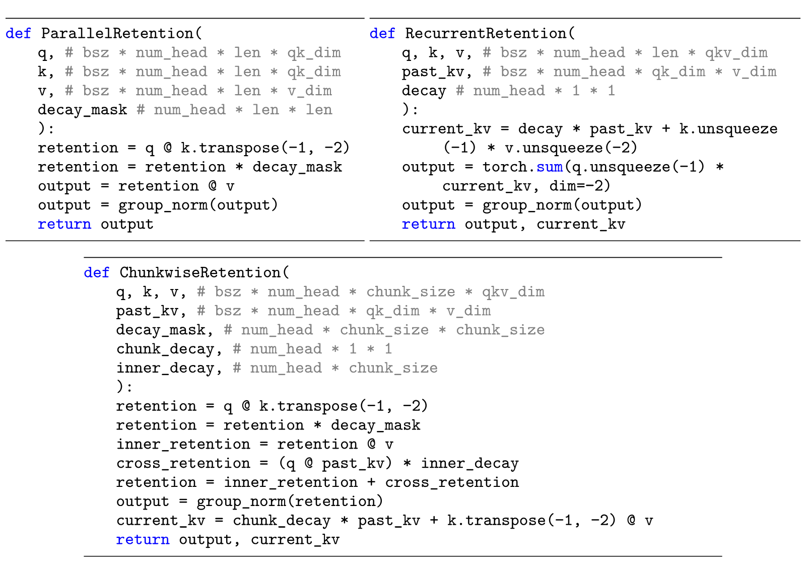

**图 4.** Retention 三种计算范式的伪代码.

[图 4](#figure-04) 汇总了 retention 的伪代码.

**Retention 分数归一化.** 我们利用 $\mathrm{GroupNorm}$ 的尺度不变性来提高 retention 层的数值精度. 具体而言, 在 $\mathrm{GroupNorm}$ 内乘以标量不会影响输出和反向梯度, 即 $\mathrm{GroupNorm}(\alpha*\mathrm{head}_i)=\mathrm{GroupNorm}(\mathrm{head}_i)$. 我们在[式 (5)](#equation-05) 中采用三种归一化因子. 第一, 将 $Q K^\top$ 归一化为 $\frac{Q K^\top}{\sqrt{d}}$. 第二, 用 $\tilde{D}_{nm}=\frac{D_{nm}}{\sqrt{\sum_{i=1}^nD_{ni}}}$ 代替 $D$. 第三, 令 $R$ 表示 retention 分数 $R=Q K^\top\odot D$, 将其归一化为 $\tilde{R}_{nm}=\frac{R_{nm}}{\max(|\sum_{i=1}^nR_{ni}|,1)}$. 此时 retention 输出为 $\mathrm{Retention}(X)=\tilde{R}V$. 由于尺度不变性, 这些技巧不会影响最终结果, 同时可以稳定前向传播与反向传播中的数值流.

### 2.3 Retentive Network 的整体架构

对于 $L$ 层 retentive network, 我们堆叠多尺度 retention (MSR) 与前馈网络 (FFN) 来构建模型. 形式化地说, 输入序列 $\{x_i\}_{i=1}^{|x|}$ 由词嵌入层转换为向量. 我们以打包后的嵌入 $X^0=[\bm{x}_1,\cdots,\bm{x}_{|x|}]\in\mathbb{R}^{|x|\times d_{\mathrm{model}}}$ 作为输入, 并计算模型输出 $X^L$:

$$
\begin{aligned}
Y^l&=\mathrm{MSR}(\mathrm{LN}(X^l))+X^l \\
X^{l+1}&=\mathrm{FFN}(\mathrm{LN}(Y^l))+Y^l
\end{aligned}
$$

其中, $\mathrm{LN}(\cdot)$ 是 LayerNorm [Ba16]. FFN 部分计算为 $\mathrm{FFN}(X)=\mathrm{gelu}(X W_1)W_2$, 其中 $W_1,W_2$ 是参数矩阵.

**训练.** 训练过程中使用并行表示 ([式 (5)](#equation-05)) 与分块循环表示 ([式 (7)](#equation-07)). 序列或分块内部的并行化可以高效利用 GPU 加速计算. 分块循环对长序列训练尤其有用, 无论 FLOPs 还是内存用量都很高效.

**推理.** 推理时采用循环表示 ([式 (6)](#equation-06)), 它很适合自回归解码. $O(1)$ 复杂度降低了内存用量与推理延迟, 同时得到等价结果.

### 2.4 与以往方法的联系和区别

[表 1](#table-01) 从多个角度比较了 RetNet 与以往方法. 比较结果与[图 2](#figure-02) 中的“不可能三角”相呼应. 此外, 由于采用分块循环表示, RetNet 在长序列上的内存复杂度为线性. 下面还分别汇总了与具体方法的比较.

**Transformer.** Retention 的并行表示与 Transformer [Vas17] 有相似思路. 最相关的 Transformer 变体是使用 xPos 作为位置编码的 Lex Transformer [Sun22]. 如[式 (3)](#equation-03) 所示, retention 的推导与 xPos 一致. 与注意力相比, retention 去除了 $\mathrm{softmax}$, 并支持循环形式, 可显著改善推理.

**S4.** 与[式 (2)](#equation-02) 不同, 如果 $Q_n$ 和 $K_n$ 不感知内容, 该形式可以退化为 S4 [Gu22], 其中 $O=(Q K^\top,Q A K^\top,\ldots,Q A^{|x|-1}K^\top)*V$.

**线性注意力.** 这类变体通常使用不同的核 $\frac{\phi(q_i)\phi(k_j)}{\sum_{n=1}^{|x|}\phi(q_i)\phi(k_n)}$ 代替 $\mathrm{softmax}$ 函数. 然而, 线性注意力难以有效编码位置信息, 模型性能较弱. 我们也不是以近似 $\mathrm{softmax}$ 为目标, 而是从头重新审视序列建模.

**AFT/RWKV.** Attention Free Transformer (AFT) 将点积注意力简化为逐元素运算, 并把 $\mathrm{softmax}$ 移到键向量上. RWKV 使用指数衰减替换 AFT 的位置嵌入, 并以循环方式完成训练和推理. 相比之下, retention 保留高维状态来编码序列信息, 因而具有更强的表达能力与更好的性能.

**xPos/RoPE.** 与为 Transformer 提出的相对位置编码方法相比, [式 (3)](#equation-03) 给出的形式与 xPos [Sun22] 和 RoPE [Su24] 相似.

**Sub-LayerNorm.** 如[式 (8)](#equation-08) 所示, retention 层使用 Sub-LayerNorm [Wan22l] 对输出进行归一化. 由于多尺度建模使各头具有不同的方差, 我们用 GroupNorm 替换了原始 LayerNorm.

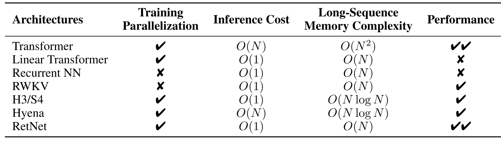

**表 1.** 从多个角度比较模型. RetNet 实现了并行训练、恒定推理成本、线性的长序列内存复杂度与良好性能.

## 3 实验

我们通过语言建模实验评估 RetNet. 我们在多种基准上评估所提出的架构, 即语言建模性能以及下游任务上的零样本/少样本学习. 对于训练和推理, 我们还比较了速度、内存用量与延迟.

### 3.1 设置

**参数分配.** 为公平比较, 我们重新分配了 MSR 和 FFN 中的参数. 为简洁起见, 这里以 $d$ 表示 $d_{\mathrm{model}}$. Transformer 的自注意力约有 $4d^2$ 个参数, 其中 $W_Q,W_K,W_V,W_O\in\mathbb{R}^{d\times d}$; FFN 约有 $8d^2$ 个参数, 中间维度为 $4d$. 相比之下, RetNet 的 retention 中有 $8d^2$ 个参数, 其中 $W_Q,W_K\in\mathbb{R}^{d\times d},W_G,W_V\in\mathbb{R}^{d\times2d},W_O\in\mathbb{R}^{2d\times d}$. 注意, $V$ 的头维度是 $Q,K$ 的两倍. 扩宽后的维度由 $W_O$ 投影回 $d$. 为使参数量与 Transformer 相同, RetNet 的 FFN 中间维度设为 $2d$. 同时, 实验中的头维度设为 $256$, 即查询和键为 $256$, 值为 $512$. 为公平比较, 不同模型规模使用相同的 $\bm{\gamma}$, 其中 $\bm{\gamma}=1-e^{\mathrm{linspace}(\log\frac{1}{32},\log\frac{1}{512},h)}\in\mathbb{R}^h$, 而不是[式 (8)](#equation-08) 中的默认值.

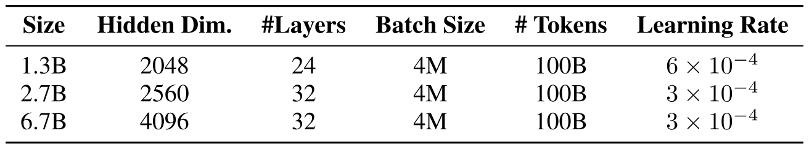

**表 2.** 语言建模实验中的模型规模与学习超参数.

**语言模型训练.** 如[表 2](#table-02) 所示, 我们从头训练了多种规模的语言模型 (即 1.3B、2.7B 和 6.7B). 训练语料是 The Pile [Gao20]、C4 [Dod21] 与 The Stack [Koc22] 的精选合集. 我们追加 `<bos>` 词元来表示序列起始 [+2]. 训练批大小为 4M 个词元, 最大长度为 2048. 模型使用 100B 个词元训练, 即 25k 步. 我们使用 AdamW [Los17] 优化器, $\beta_1=0.9,\beta_2=0.98$, 权重衰减设为 $0.05$. 预热步数为 375, 学习率采用线性衰减. 参数按照 DeepNet [Wan22c] 初始化, 以保证训练稳定性. 实现基于 TorchScale [Ma22]. 模型使用 512 块 AMD MI200 GPU 训练.

[+2]: 我们发现, 在序列开头追加 `<bos>` 词元有助于提高训练稳定性与性能.

### 3.2 与 Transformer 的比较

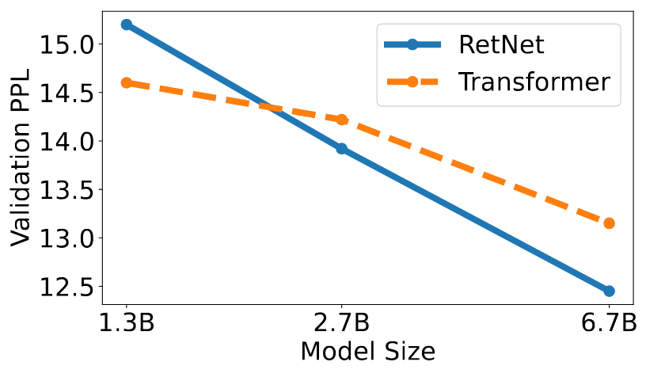

**图 5.** 困惑度随模型规模增大而下降. 我们在实验中观察到, 模型规模大于 2B 时, RetNet 往往优于 Transformer.

**语言建模.** 如[图 5](#figure-05) 所示, 我们报告了基于 Transformer 和 RetNet 的语言模型在验证集上的困惑度. 扩展曲线包含三种模型规模, 即 1.3B、2.7B 和 6.7B. RetNet 取得了与 Transformer 相当的结果. 更重要的是, 结果表明 RetNet 在规模扩展方面表现良好. 除性能外, RetNet 在我们的实验中训练也相当稳定. 实验结果表明, RetNet 是大语言模型中 Transformer 的有力竞争者. 经验结果显示, 模型规模大于 2B 时, RetNet 开始优于 Transformer. [第 6 节](#section-6) 还汇总了不同上下文长度下的语言建模结果.

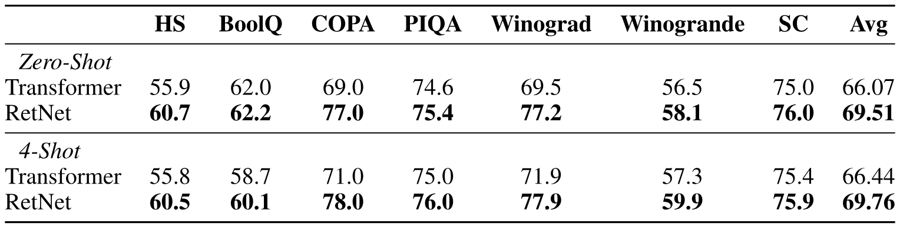

**表 3.** Transformer 与 RetNet 的零样本和少样本学习结果. 模型规模为 6.7B.

**下游任务上的零样本和少样本评估.** 我们还在多种下游任务上比较了这些语言模型. 我们使用 6.7B 模型评估零样本和 4-shot 学习. 如[表 3](#table-03) 所示, 数据集包括 HellaSwag (HS) [Zel19]、BoolQ [Cla19]、COPA [Wan19h]、PIQA [Bis20]、Winograd、Winogrande [Lev12] 与 StoryCloze (SC) [Mos17]. 准确率与[图 5](#figure-05) 所示的语言建模困惑度一致. 在零样本与上下文学习设置下, RetNet 的性能与 Transformer 相当.

### 3.3 训练成本

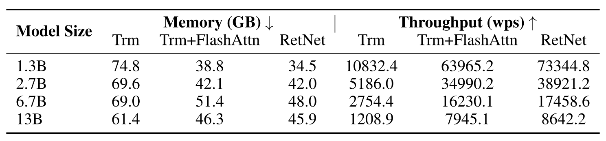

**表 4.** Transformer (Trm)、采用 FlashAttention 的 Transformer (Trm+FlashAttn) 与 RetNet 的训练成本. 我们报告内存用量与训练吞吐量 (每秒处理的词数; wps).

如[表 4](#table-04) 所示, 我们比较了 Transformer 与 RetNet 的训练速度和内存用量, 训练序列长度为 8192. 我们还与 FlashAttention [Dao22] 比较, 它通过重计算和算子融合来提高速度并减少 GPU 内存 IO. 相比之下, 我们使用原生 PyTorch 代码实现 RetNet, 将算子融合或类似 FlashAttention 的加速留给未来工作. 我们采用[式 (7)](#equation-07) 所述的分块循环 retention 表示. 分块大小设为 $512$. 由于 FlashAttention 针对 A100 做了高度优化, 我们使用 8 块 Nvidia A100-80GB GPU 评估结果. 6.7B 和 13B 模型启用张量并行.

实验结果表明, 训练期间 RetNet 比 Transformer 更节省内存, 吞吐量也更高. 即使与 FlashAttention 相比, RetNet 的速度和内存成本仍有竞争力. RetNet 不依赖特定算子, 因而也易于在其他平台上高效训练. 例如, 我们在 AMD MI200 集群上训练 RetNet 模型时取得了不错的吞吐量. 通过算子融合等先进实现, RetNet 还有进一步降低成本的潜力.

### 3.4 推理成本

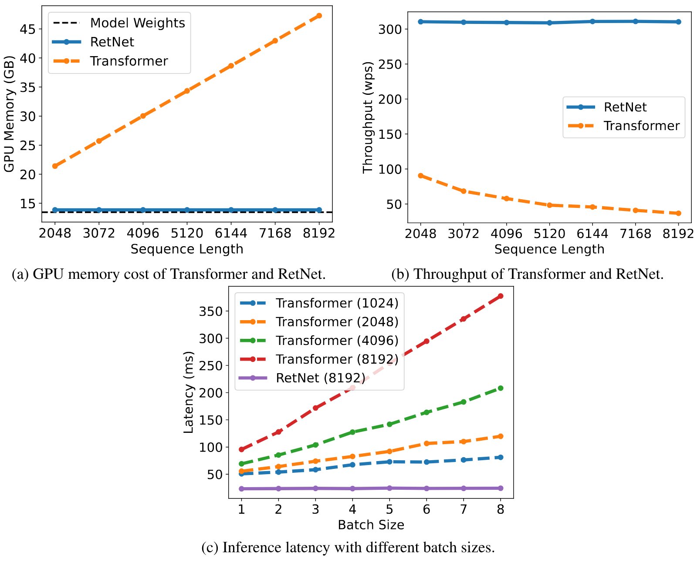

**图 6.** 6.7B 规模的 Transformer 与 RetNet 的推理成本. RetNet 在内存用量、吞吐量和延迟方面优于 Transformer.

如[图 6](#figure-06) 所示, 我们比较了 Transformer 与 RetNet 推理时的内存成本、吞吐量和延迟. Transformer 复用先前已解码词元的 KV 缓存. RetNet 使用[式 (6)](#equation-06) 所述的循环表示. 实验在 A100-80GB GPU 上评估 6.7B 模型. [图 6](#figure-06) 表明, RetNet 的推理成本优于 Transformer.

**内存.** 如[图 6a](#figure-06) 所示, Transformer 的内存成本因 KV 缓存而线性增长. 相比之下, 即使序列很长, RetNet 的内存用量仍保持不变, 因而承载 RetNet 所需的 GPU 内存少得多. RetNet 的额外内存用量几乎可以忽略 (约 3%), 模型权重占 97%.

**吞吐量.** 如[图 6b](#figure-06) 所示, Transformer 的吞吐量随解码长度增加而下降. 相比之下, RetNet 利用 retention 的循环表示, 解码吞吐量更高且不随长度变化.

**延迟.** 延迟是部署中的重要指标, 会明显影响用户体验. [图 6c](#figure-06) 给出了解码延迟. 实验结果表明, 批大小增大会提高 Transformer 的延迟. 此外, 输入越长, Transformer 的延迟增长越快. 为使延迟处于可接受范围, 必须限制批大小, 这会损害 Transformer 的总体推理吞吐量. 相比之下, RetNet 的解码延迟优于 Transformer, 且在不同批大小和输入长度下几乎不变.

### 3.5 与 Transformer 变体的比较

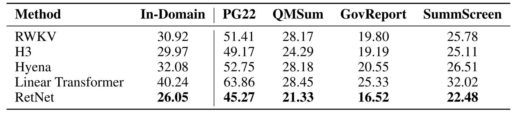

**表 5.** 语言建模的困惑度结果. RetNet 在域内评估集与多个域外语料库上均优于其他架构.

除 Transformer 外, 我们还比较了 RetNet 与多种高效 Transformer 变体, 包括 Linear Transformer [Kat20]、RWKV [Pen23b]、H3 [Dao22g] 和 Hyena [Pol23a]. 所有模型均有 200M 个参数、16 层, 隐藏维度为 1024. H3 的头维度设为 8. 对于 RWKV, 我们用 TimeMix 模块替换自注意力层, 同时保持 FFN 层与其他模型一致, 以便公平比较. 模型训练 10k 步, 批大小为 0.5M 个词元. 大多数超参数和训练语料与[第 3.1 节](#section-3-1) 相同.

[表 5](#table-05) 报告了域内验证集和其他域外语料库上的困惑度, 例如 Project Gutenberg 2019-2022 (PG22) [Sun22]、QMSum [Zho21b]、GovReport [Hua21] 与 SummScreen [Che21g, Sha22a]. 总体而言, RetNet 在不同数据集上都优于以往方法. RetNet 不但在域内语料库上取得更好的评估结果, 在多个域外数据集上也得到更低的困惑度. 除了显著降低成本的优势 ([第 3.3 节](#section-3-3)、[第 3.4 节](#section-3-4)), 良好的性能也使 RetNet 成为 Transformer 的有力继任者.

我们还讨论了这些方法的训练与推理效率. 令 $d$ 表示隐藏维度, $n$ 表示序列长度. 训练时, RWKV 的词元混合复杂度为 $O(dn)$, Hyena 通过快速傅里叶变换加速后的复杂度为 $O(dn\log n)$. 这两种方法使用逐元素算子降低训练 FLOPS, 代价是建模能力下降. 相比之下, retention 的分块循环表示复杂度为 $O(dn(b+h))$, 其中 $b$ 是分块大小, $h$ 是头维度, 通常设为 $b=512,h=256$. 对于较大的模型规模 (即更大的 $d$) 或较长序列, 额外的 $b+h$ 影响很小. 因此, RetNet 在不牺牲建模性能的情况下仍具有很高的训练效率. 推理时, 在这些高效架构中, Hyena 与 Transformer 一样每步复杂度为 $O(n)$, 其余架构均可执行 $O(1)$ 解码.

### 3.6 消融研究

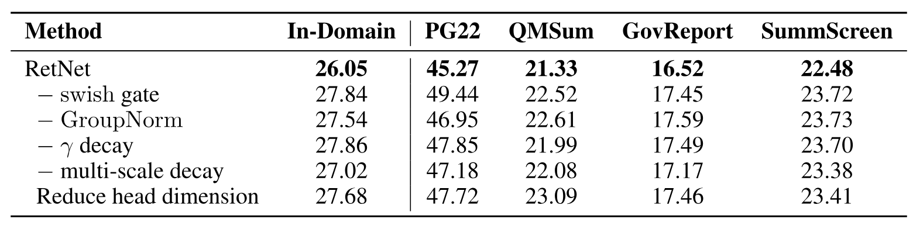

**表 6.** 域内和域外语料库上的消融结果.

我们对 RetNet 的多项设计选择进行了消融, 并在[表 6](#table-06) 中报告语言建模结果. 评估设置和指标与[第 3.5 节](#section-3-5) 相同.

**架构.** 我们对[式 (8)](#equation-08) 中的 $\mathrm{swish}$ 门和 $\mathrm{GroupNorm}$ 进行了消融. [表 6](#table-06) 表明, 这两个组件都能改善最终性能. 第一, 门控模块对于增强非线性与提高模型能力十分必要. 注意, 移除门后, 我们采用与 Transformer 相同的参数分配. 第二, retention 中的组归一化平衡了多头输出的方差, 改善训练稳定性与语言建模结果.

**多尺度衰减.** [式 (8)](#equation-08) 表明, 各 retention 头使用不同的 $\bm{\gamma}$ 作为衰减率. 在消融研究中, 我们考察了移除 $\gamma$ 衰减 (即“$-\ \gamma$ decay”) 和所有头使用相同衰减率 (即“$-$ multi-scale decay”) 两种情况. 具体而言, 移除 $\gamma$ 衰减等价于 $\gamma=1$. 第二种设置为所有头取 $\gamma=127/128$. [表 6](#table-06) 表明, 衰减机制与使用多个衰减率都能改善语言建模性能.

**头维度.** 从[式 (1)](#equation-01) 的循环视角看, 头维度代表隐藏状态的记忆容量. 在消融研究中, 我们把默认头维度从 $256$ 降到 $64$, 即查询和键为 $64$, 值为 $128$. 隐藏维度 $d_{\mathrm{model}}$ 保持不变, 因此头数增加. [表 6](#table-06) 中的实验结果表明, 较大的头维度性能更好.

## 4 结论

本文提出用于序列建模的 retentive network (RetNet), 它支持并行、循环和分块循环等多种表示. 与 Transformer 相比, RetNet 的推理效率 (内存、速度和延迟) 显著更高, 训练并行性良好, 性能也具有竞争力. 这些优势使 RetNet 成为大语言模型中 Transformer 的理想继任者, 尤其是 $O(1)$ 推理复杂度带来的部署收益. 未来, 我们希望继续扩大 RetNet 的模型规模 [Chi22a] 与训练步数. Retention 还可以通过压缩长期记忆, 与结构化提示 [Hao22a] 高效配合. 我们也将使用 RetNet 作为骨干架构, 训练多模态大语言模型 [Hao22, Hua23c, Pen23f]. 此外, 我们希望在手机等边缘设备上部署 RetNet 模型.

## 致谢

感谢 Jiayu Ding、Songlin Yang 以及 MSRA System Group 的同事所做的有益讨论.

## 5 超参数

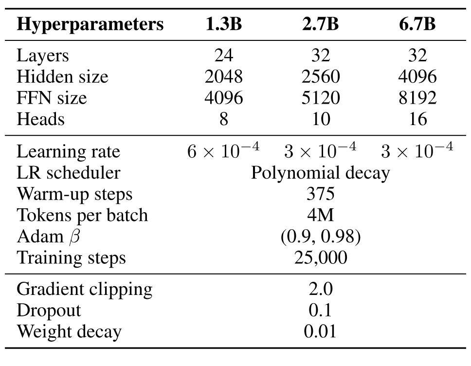

**表 7.** [第 3 节](#section-3) 中模型使用的超参数.

## 6 不同上下文长度的分组结果

如[表 8](#table-08) 所示, 我们报告了不同上下文长度下的语言建模结果. 为使数字可比, 我们使用 2048 个文本分块作为评估数据, 只计算最后 128 个词元的困惑度. 实验结果表明, RetNet 在不同上下文长度下均优于 Transformer. RetNet 还可以利用更长的上下文得到更好的结果.

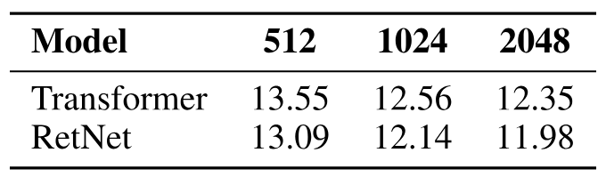

**表 8.** RetNet 与 Transformer 在不同上下文长度下的语言建模困惑度. 结果表明, RetNet 在不同序列长度下都具有一致优势.
