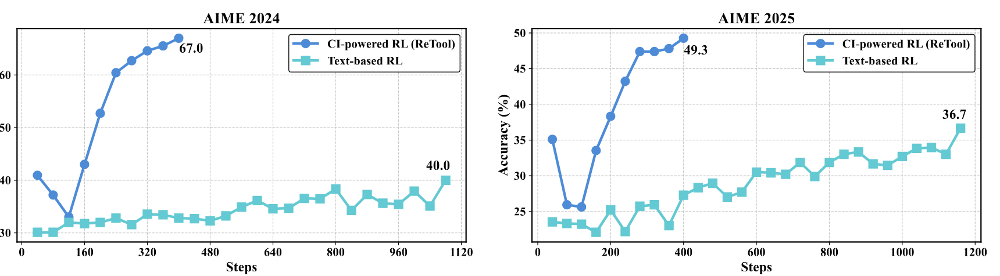
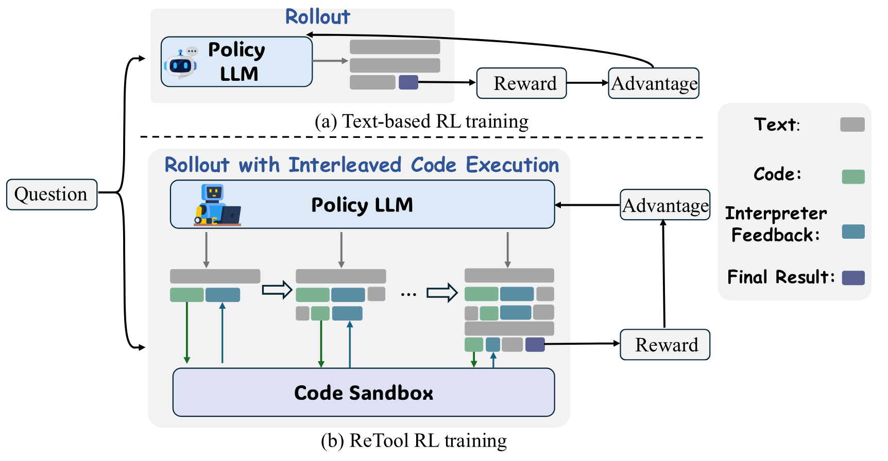
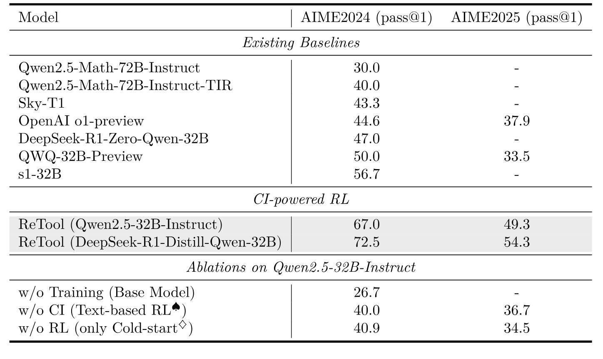
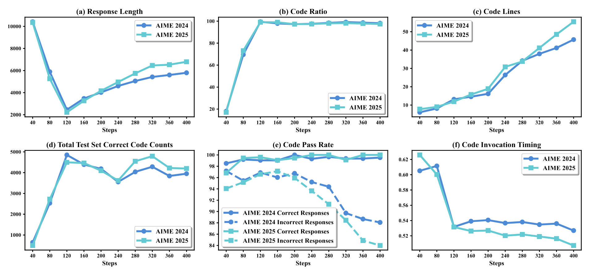
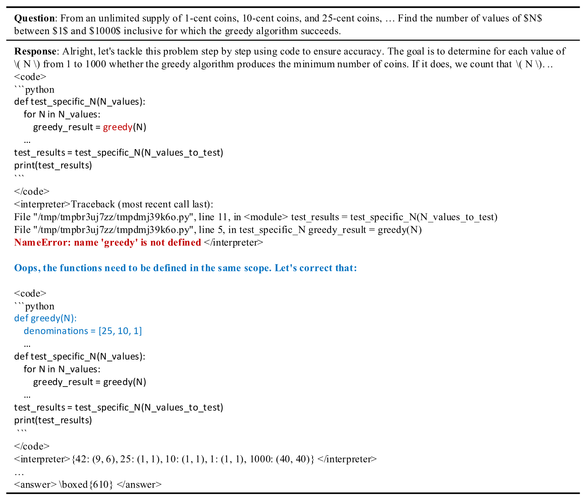
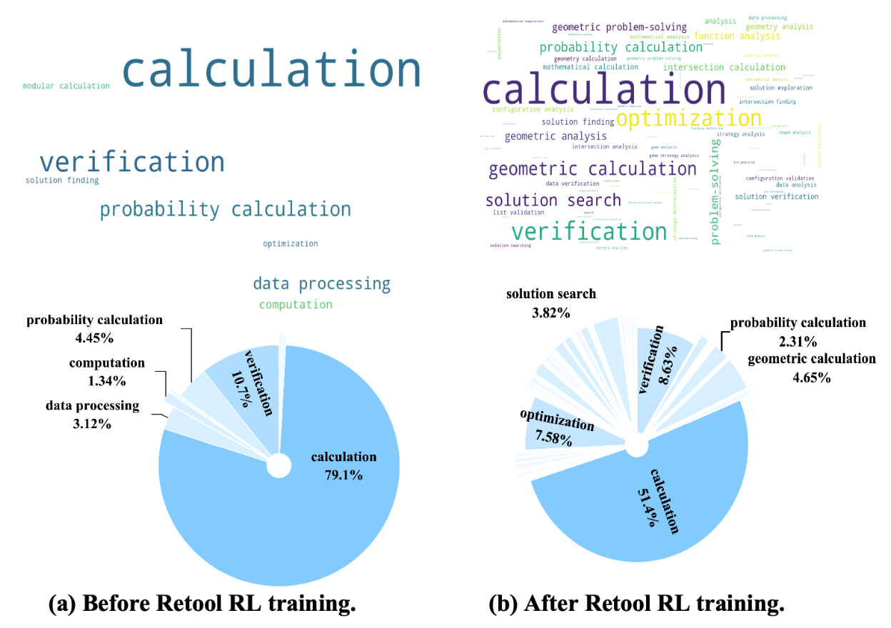
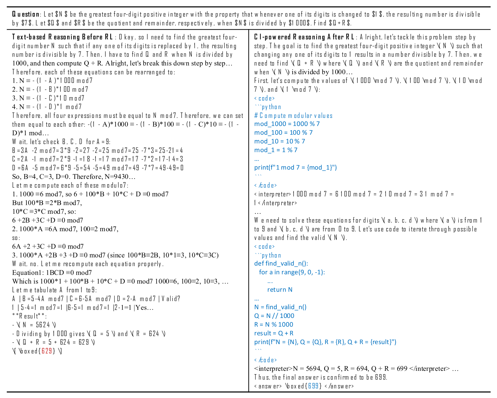
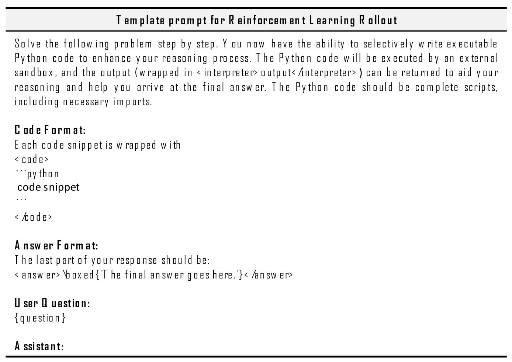
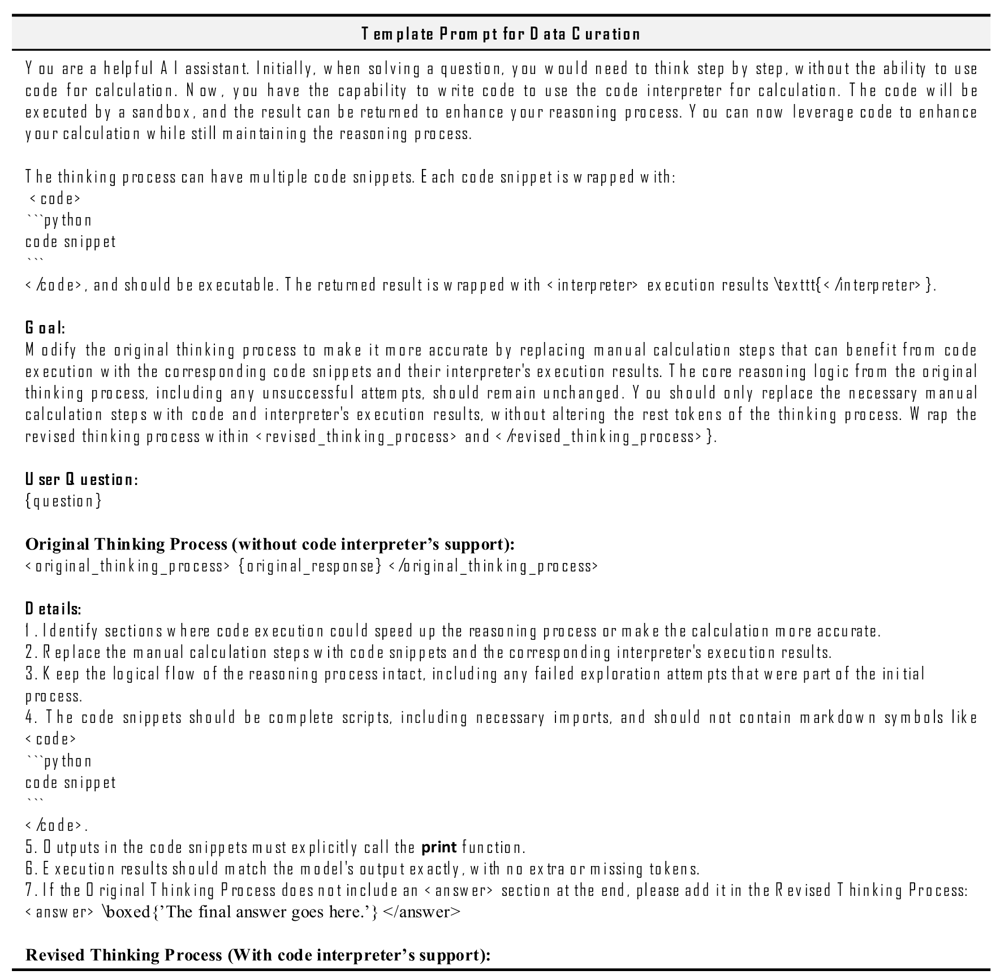

> [Jiazhan Feng](https://dblp.org/pid/242/9191.html), [Shijue Huang](https://dblp.org/pid/302/4692.html), [Xingwei Qu](https://dblp.org/pid/235/4056.html), [Ge Zhang](https://dblp.org/pid/70/6366-9.html), [Yujia Qin](https://dblp.org/pid/126/2333.html), [Baoquan Zhong](https://dblp.org/pid/248/7884.html), [Chengquan Jiang](https://dblp.org/pid/278/8241.html), [Jinxin Chi](https://dblp.org/pid/246/8003.html), [Wanjun Zhong](https://dblp.org/pid/227/2128.html). 2025 年 4 月 15 日首次提交至 arXiv, 当前版本为 v2. [ReTool: Reinforcement Learning for Strategic Tool Use in LLMs](https://arxiv.org/abs/2504.11536). [原始 PDF](/paper/retool.pdf). [项目主页](https://retool-rl.github.io/). [DOI](https://doi.org/10.48550/arXiv.2504.11536). [TeX 源码](https://export.arxiv.org/e-print/2504.11536v2). 精确的印刷版式与参考文献以原始 PDF 为准.

## 摘要

通过强化学习 (RL) 训练的推理模型 (如 DeepSeek R1) 擅长文本推理, 但面对几何推理、精确计算或复杂方程求解等需要结构化问题求解的场景时表现欠佳, 而代码解释器 (CI) 等计算工具在这些场景中有明显优势. 为弥合这一差距, 我们提出 **ReTool**, 以工具集成学习增强长程推理, 其关键特性有两项: (1) 在自然语言推理过程中动态交错执行实时代码; (2) 一种自动化 RL 范式, 支持策略在 rollout 时进行多轮实时代码执行, 并根据结果反馈让模型学会何时以及如何调用工具. ReTool 采用一套系统化训练框架, 首先生成合成冷启动数据, 为基础模型微调构造代码增强的长程推理轨迹. 随后的 RL 训练以任务结果为奖励, 反复改进模型的工具使用策略, 使其无需人工先验便能自主发现最优的工具调用模式. 在具有挑战性的数学奥林匹克竞赛基准 AIME 上, 实验显示 ReTool 更为出色: 我们的 32B 模型训练 400 步后达到 67% 准确率, 在训练效率和性能上都超过文本 RL 基线 (40% 准确率, 1080 步). 在扩展设置下, ReTool-32B 的准确率达到 72.5%, 比 OpenAI o1-preview 高 27.9%. 进一步分析发现了代码自我修正等涌现行为, 这标志着一个 “aha moment”, 模型在这一刻自主掌握了自适应工具使用. 这些结果说明, 结果驱动的工具集成有望推进复杂数学推理, 也为神经符号混合系统带来了新的认识.

**图 1.** ReTool 与基于 Qwen2.5-32B-Instruct 模型的文本 RL 基线在 AIME 2024 和 AIME 2025 上的得分.

## 1 引言

强化学习 (RL) 最近已成为增强大语言模型 (LLM) 推理能力的常用范式, 让模型可以探索并改进较长的思维链 (CoT) [Wei22a, Yao23a, Luo24a, Zha24v]. OpenAI o1 [Ope24h] 和 DeepSeek R1 [Dee25c] 等推理模型通过学习自我修正, 并进行更审慎、更具分析性的思考, 在纯文本推理任务中表现突出 [Ant25b, Qwq25, Tea25h]. 这些进展初步显露了元认知控制: 模型不只进行推理, 也会监控和修正自己的推理过程.

尽管取得了这些进展, 配备长文本推理过程的推理 LLM [Ouy22a] 在精确数值计算或符号操作任务中仍有明显局限, 例如几何推理、精确计算和复杂方程求解. 相比之下, 代码解释器 (CI) 等计算工具可以赋予模型远超纯文本推理的符号计算能力. 文本 CoT [Wei22a] 方法完全依赖内部语言模式, 而代码解释器提供了一个用于枚举、验证和精确计算的形式化可执行接口. 这既能精确验证中间步骤中的数值, 大幅减少文本推理中常见的歧义与累积误差 [Che22, Wan23i], 也让模型可以通过可编程探索扩大解空间.

近期研究尝试用提示和监督微调方法 [Che25y, Pan23] 让 LLM 具备工具使用能力. 但这些方法只能模仿经过专门筛选的数据分布, 往往无法泛化到未见模式, 也不能自适应地判断何时以及如何调用外部工具. 因此, 模型可能误用工具, 或退回到面对不同问题设置时并不稳健的脆弱启发式方法. RL 为克服这些局限提供了一种有原则的方案: 它使模型能够探索灵活的推理轨迹, 并在结果反馈的引导下学习工具使用策略. 这种范式会鼓励正确答案, 也让模型有机会发现更细致的行为模式, 例如如何通过自我修正从工具执行错误中恢复, 以及如何在长链推理过程中选择合适的时机执行工具.

在本研究中, 我们采用 RL 范式并提出 **ReTool**, 这是一个以**工具 (Tool)** 增强的**强化 (Reinforcement)** 学习框架, 专门用于引导 LLM 在推理时找到利用外部计算工具的最优策略. ReTool 包含两个关键组件: 首先, 我们设计了一条数据构建流水线, 筛选出高质量冷启动数据集, 明确演示何时以及如何调用代码解释器. 这让模型初步掌握工具使用和执行结果分析. 随后, 我们采用工具增强强化学习, 训练模型发现最优的工具操作推理策略, 并通过结果奖励调整自身行为, 从而超出单纯监督学习所能覆盖的范围. 在长链推理中, 策略模型会灵活写出代码块, 从沙箱式代码解释器实时取得执行结果, 用来辅助后续思考.

我们在具有挑战性的数学奥林匹克竞赛基准 AIME2024 和 AIME2025 上评测 ReTool. 基于 Qwen2.5-32B-Instruct [Yang24] 构建的模型仅用 400 个训练步骤就在 AIME2024 上达到 67.0% 准确率, 显著超过训练 1080 步、准确率为 40.0% 的文本 RL 基线. 这些大幅提升说明, 把工具使用显式建模为决策过程的一部分, 既能推进模型推理能力的上限, 也能提高训练效率. 在 DeepSeek-R1-Distill-Qwen-32B [Dee25c] 上训练时, 模型进一步改进, 超过了 QwQ-32B-Preview [Qwq25], s1-32B [Has25] 和 OpenAI o1-preview [Ope24] 等有竞争力的基线. 这说明 RL 训练过程促使模型形成了更高效的问题求解策略. 另外, 基于 Qwen2.5-32B-Instruct 的冷启动模型在 AIME2024 上达到 40.9% 准确率, 与使用相同骨干的文本 RL 基线 (40.0%) 相当, 并显著超过未经训练的 Qwen2.5-32B-Instruct (26.7%). 这些结果表明, 我们筛选的数据集有效捕捉了可执行推理轨迹中的工具使用模式, 而集成 CI 的训练对推理性能有正向作用.

我们还全面分析了 RL 训练中的 CI 认知行为, 得到几项主要发现. 我们的模型表现出更强的代码利用能力, 能够使用更准确、更复杂的代码片段; 它还学会了恰当地调用工具、自适应选择工具、有效组织工具调用, 并借助涌现出的代码自我修正能力反复改进推理.

**我们的主要贡献概括如下:**

1. 我们提出新型强化学习框架 **ReTool**, 将代码解释器执行集成到 LLM 的推理循环中. 为了让模型具备调用代码解释器所需的基础能力, 我们通过自行设计的流水线筛选出高质量冷启动数据集. 我们还设计了一套支持 rollout 期间交错执行代码的强化学习框架, 使模型能在沙箱代码解释器反馈的引导下, 通过工具增强交互反复探索、改进并优化推理策略.

2. 如[第 3.3 节](#section-3-3)所示, 我们进行了全面的实证和行为分析, 并观察到几项主要结果: (1) RL 训练后, 回答长度相比训练前缩短约 40%, 显示 CI 驱动推理可能提高推理 token 效率; (2) RL 训练期间, 代码比例、代码行数和正确代码数量均呈上升趋势, 代码调用时机也逐渐提前, 表明代码使用能力有所提高, 并形成了策略性工具使用; (3) 在 RL 阶段可以观察到代码自我修正和自适应工具选择等涌现行为, 由此产生了更高级的工具增强推理模式.

## 2 方法

本节介绍 ReTool, 一个为数学问题求解任务设计的 CI 驱动 RL 框架. 我们先概述 ReTool. 接着说明冷启动训练, 包括数据构建流水线和监督微调 ([第 2.2 节](#section-2-2)). 然后介绍由代码解释器沙箱增强的强化学习流水线, 以进一步培养策略性工具使用能力 ([第 2.3 节](#section-2-3)).

### 2.1 概述

我们的方法包含两个主要阶段: 先进行冷启动监督微调, 再使用交错代码执行 rollout 开展强化学习. 首先, 我们通过自行设计的流水线收集冷启动监督微调 (SFT) 数据, 为强化学习阶段提供稳健的初始化. 为增强模型利用工具的能力, 我们设计了一条专门使用工具的强化学习流水线, 提升模型在推理过程中恰当选择和使用工具的能力.

### 2.2 为工具集成推理打下基础的冷启动

我们设计了一条收集和筛选高质量数据的流水线. 具体来说, 首先从多种来源收集已有数学推理数据, 包括 Open-Thoughts [Ope25h] 等开源数据集. 随后, 我们结合人工专家筛选与 Deepseek-R1 [Dee25c] 评估, 通过双重验证方法过滤无效数据. 经过这些步骤, 我们得到高质量文本推理数据集, 记为 $\mathcal{D}_{\mathrm{init}}$.

在 $\mathcal{D}_{\mathrm{init}}$ 的基础上, 我们进一步自动构建代码集成推理数据. 首先使用结构化提示模板 (详见[图 8](#figure-08)) 完成转换, 把原始思考过程中适合用代码执行的手工计算步骤替换为相应的代码片段及解释器执行结果. 完成初次转换后, 我们采用两阶段验证协议. 第一阶段检查格式, 改善可读性并保证语法一致, 使后续强化学习阶段能够高效检测计算工具的调用触发点. 第二阶段验证答案, 删除最终输出与数学题正确解不一致的数据样本. 最终得到数据集 $\mathcal{D}_{\mathrm{CI}}$, 其中包含代码增强的长程推理轨迹.

ReTool 通过监督微调, 从上述数据集 $\mathcal{D}_{\mathrm{CI}}$ 中学习何时以及如何调用代码解释器, 从而增强模型恰当使用计算工具的能力.

**图 2.** 文本 RL 训练过程与 ReTool 的 RL 训练过程.

### 2.3 ReTool: 面向策略性工具使用的强化学习

#### 2.3.1 训练算法

我们基于 PPO 算法 [Sch17a] 训练 ReTool, 它使用以下目标更新策略:

$$
\begin{aligned}
\mathcal{J}_{\mathrm{PPO}}(\theta) = \mathbb{E}_{(q,a)\sim \mathcal{D},o_{\le t}\sim\pi_{\theta_{\mathrm{old}}}(\cdot\mid q)}
\Bigg[
\min \Bigg(&\frac{\pi_{\theta}(o_t\mid q,o_{<t};\mathrm{CI})}{\pi_{\theta_{\mathrm{old}}}(o_t\mid q,o_{<t};\mathrm{CI})} \hat{A}_t,\\
&\mathrm{clip} \Bigg( \frac{\pi_{\theta}(o_t\mid q,o_{<t};\mathrm{CI})}{\pi_{\theta_{\mathrm{old}}}(o_t\mid q,o_{<t};\mathrm{CI})}, 1 - \varepsilon, 1 + \varepsilon \Bigg) \hat{A}_t \Bigg) \Bigg],
\end{aligned}
$$

其中, $\pi_{\theta}$ 是策略模型, $\pi_{\theta_{\mathrm{old}}}$ 是参考模型, $\pi_{\theta}(o_t\mid q,o_{<t};\mathrm{CI})$ 表示交错包含代码执行及代码解释器反馈的 rollout.

我们修改 PPO, 使其更好地适应工具集成推理. 训练期间, 策略 LLM 与代码沙箱协作, 生成通过多轮实时代码执行来解决给定问题的 rollout. 我们实现了基于规则的结果奖励, 使模型可以自主探索并形成代码使用意识、代码选择、代码调用时机及其他多样化行为的策略.

**奖励设计** 为让模型学会何时以及如何调用工具, 我们使用基于规则的准确率奖励来优化模型. 准确率奖励用于评估回答是否正确. 我们要求模型以指定格式给出最终答案 (如放在 `\boxed{}` 内), 以便可靠地进行基于规则的验证. 奖励定义为:

$$
R(a, \hat{a}) =
\begin{cases}
1, & \texttt{is\_equivalent}(a, \hat{a}) \\
-1, & \mathrm{otherwise}
\end{cases}
$$

其中, $a$ 和 $\hat{a}$ 分别表示真实答案和预测答案. 我们简化奖励设计, 目的是减少奖励投机, 并且只依靠结果反馈、不考虑代码可执行性奖励来促进更多样的问题求解行为.

**交错执行代码的 Rollout** 为了在模型中整合推理和可执行代码, 我们提出一种 rollout 方法, 动态支持在自然语言推理过程中交错执行实时代码. 如[图 2b](#figure-02) 所示, 我们的 rollout 过程有别于通常只生成文本推理的传统方法 (见[图 2a](#figure-02)). 相比之下, 我们的 rollout 方法让策略 LLM 与外部代码沙箱协作, 从而生成由文本、代码片段和实时解释器反馈组成的混合内容. 具体来说, 我们使用提示模板 ([图 7](#figure-07)) 引导模型与代码沙箱交互, 以 `<code></code>` 标签明确标出生成代码的边界. Rollout 期间, 策略模型先生成文本推理 $t_1$, 当检测到代码终止触发符 (`</code>`) 时, 生成暂停, 已生成代码 $c_1$ 随即被解析并发送到代码沙箱环境执行. 执行完成后, 沙箱输出 $f_1$ (成功结果或错误消息) 被填入 `<interpreter></interpreter>` 标签并反馈给模型; 模型继续生成 rollout, 直至给出最终答案 $o$ 或生成新的代码片段, 最后形成混合推理轨迹 $[t_1 \oplus c_1 \oplus f_1 \oplus ... \oplus o]$.

值得注意的是, 我们的方法会把成功的代码执行结果和解释器错误消息都返回给模型. 这种动态反馈机制让模型能够反复探索、改进和优化自己的推理与工具使用策略.

#### 2.3.2 训练细节

**冷启动与 RL** 训练采用 VeRL 框架 [+1]. 我们以 PPO 作为 RL 方法. 模型在筛选后的冷启动数据上训练两个 epoch. 超参数方面, 我们使用 AdamW 优化器, 初始学习率为 1e-6. 期望最大序列长度设为 16384 token. 训练 mini-batch 大小设为 512, KL 系数设为 0.0. 主要骨干模型使用 Qwen2.5-32B-Instruct [Qwe25].

**解释器反馈掩码.** 我们在计算损失时掩去 `<interpreter></interpreter>` 中的反馈输出. 这种基于沙箱的输出掩码阻止外部 token 干扰损失计算, 保持训练稳定, 也避免模型自身生成的连贯推理序列受到破坏.

**KV-Cache 复用.** 为降低 rollout 期间的内存开销, 每次检测到代码终止触发符 (`</code>`) 时, 我们都会缓存代码执行前的全部 KV-cache, 随后只计算并附加解释器反馈 (`<interpreter></interpreter>`) 对应的 KV-cache. 这会大幅减少每次 rollout 所需的 KV-cache.

**沙箱构建.** 为加快 RL 训练, 我们设计了异步代码沙箱环境. 沙箱 pod 作为工作进程组成一个池, 各自根据当前容量拉取任务, 形成高效的负载均衡机制. 这种分布式异步方案让多个线程可以并行与环境交互, 从而加快 RL 训练; 它可以防止较慢线程形成瓶颈, 并保证资源得到充分利用, 使训练持续保持吞吐量.

[+1]: [https://github.com/volcengine/verl](https://github.com/volcengine/verl)

## 3 实验

本节评估 ReTool 的性能, 并全面分析模型输出行为.

### 3.1 评测设置

为保证评测稳定, 我们将 AIME2024 和 AIME2025 评测集分别重复 32 次, 报告总体平均准确率, 用它估计 pass@1. 评测时的推理超参数设为 temperature 1.0 和 top-p 0.7. 我们将 ReTool 与多种有竞争力的基线比较, 包括 Qwen2.5-Math-72B-Instruct [Yan24j]、Qwen2.5-Math-72B-Instruct-TIR [Yan24j]、Sky-T1 [Sky25]、DeepSeek-R1-Zero-Qwen-32B [Dee25c]、QwQ-32B-Preview [Qwq25]、s1-32B [Has25]、OpenAI o1-preview [Ope24]. 为验证 ReTool 的效果, 我们还与不使用工具的 RL 进行性能比较, 即文本 RL (Qwen2.5-32B-Instruct). 对于各基线的结果, 我们从相应文献来源复制 avg@k, 并将其作为 pass@1 报告.

**表 1.** 主要结果. $^\spadesuit$文本 RL 方法包含基于文本冷启动的 SFT 初始化, 以保证公平比较. $^\diamondsuit$冷启动模型的推理过程也使用代码解释器.

### 3.2 主要结果

如[表 1](#table-01) 所示, ReTool 让 LLM 可以在 RL 阶段灵活使用代码解释器, 带来显著的性能提升. 具体而言, ReTool (Qwen2.5-32B-Instruct) 仅训练 400 步便在 AIME2024 和 AIME2025 上分别达到 67.0% 和 49.3% 准确率. 文本 RL 基线 (Qwen2.5-32B-Instruct) 即便训练超过 1000 步, 在两个基准上也只达到 40.0% 和 36.7%, 因而明显落后. 这些结果说明, ReTool 采用的工具集成学习范式不仅增强了模型推理能力, 也提高了训练效率. 在 AIME2024 上, ReTool (Qwen2.5-32B-Instruct) 还比有竞争力的基线 s1-32B 高 10.3%. 类似地, 它在 AIME2025 上比 OpenAI o1-preview 高 11.4%. 换用更先进的骨干后, ReTool (DeepSeek-R1-Distill-Qwen-32B) 进一步提升性能, 在 AIME2024 和 AIME2025 上分别达到 72.5% 和 54.3%. 这些结果表明, RL 训练过程发现了更有效的问题求解策略.

另外, 基于 Qwen2.5-32B-Instruct 的冷启动模型在 AIME2024 上达到 40.9% 准确率, 与文本 RL 基线 (40.0%) 接近, 并大幅超过基础模型 (26.7%). 这些结果说明, 我们筛选的数据集有效捕捉了可执行推理轨迹中的工具使用模式, 而集成 CI 的训练对推理性能有正向作用.

### 3.3 认知分析

我们给出全面分析, 并总结探索中的几项主要发现: (1) RL 过程中代码解释器 (CI) 相关行为的变化; (2) 自我修正能力的涌现; (3) RL 前后代码用途的差异; (4) CI 驱动推理与文本推理的区别.

**图 3.** RL 训练期间 CI 相关行为的变化.

**CI 相关行为的变化.** 为深入了解 ReTool 的 RL 过程, 我们系统评测了 CI 相关指标. 具体而言, 我们分析每个 RL 训练检查点对应的模型在 AIME2024 和 AIME2025 数据集上的输出, 据此计算这些指标. 结果见[图 3](#figure-03), 分析如下:

- **回答长度** ([图 3a](#figure-03)): 我们计算了平均回答长度, 并观察到明显趋势: 生成回答的长度先快速下降, 随后较为缓慢地回升. 我们认为, 前期下降是因为复杂计算过程被更精简的代码替代, 后续上升则可能源于 RL 训练中出现了更多样、更复杂的代码行为. 值得注意的是, 最终平均回答长度仍比 RL 训练前短 40% (即从 10k 降至 6k). 这说明 CI 驱动推理以代码替代繁复计算过程, 可能提高推理 token 的利用效率.

- **代码比例** ([图 3b](#figure-03)): 我们还计算了包含代码的回答比例. 分析发现, RL 训练期间的平均代码比例总体呈上升趋势, 最终覆盖近 98% 的问题. 这表明, 模型使用代码的熟练程度在 RL 过程中逐步提高, 并促进了策略性工具使用能力的形成.

- **代码行数** ([图 3c](#figure-03)): 生成代码的行数在一定程度上反映其复杂度. 观察显示, 回答中的平均代码行数在整个训练过程中持续上升. RL 训练结束时, 最终平均代码行数接近训练前的五倍. 这一趋势说明, 模型在 RL 阶段学会了更复杂的代码策略.

- **测试集正确代码总数** ([图 3d](#figure-03)): RL 训练期间, 测试集上的正确代码总数总体上升, 从 1k 增至 5k. 这一提升表明模型利用代码工具的熟练程度有所增强.

- **代码通过率** ([图 3e](#figure-03)): 在 CI 驱动推理中, 模型可能先生成错误的中间代码, 再根据解释器反馈反复改进, 最终得到可执行代码, 因此我们报告错误回答中最后一段代码的平均通过率. 分析发现, 正确回答的代码通过率始终接近 100%, 而错误回答的代码通过率呈下降趋势. 这一模式说明, 代码能否执行会影响推理过程和最终结果.

- **代码调用时机** ([图 3f](#figure-03)): 我们还计算了代码调用时机, 即用代码起始位置除以回答总长度. 该指标反映代码在回答中的调用时机. 结果显示, 在 RL 训练过程中, 代码调用时机逐渐提前, 表明模型学会了判断工具使用时机.

**图 4.** 关于代码自我修正的 “aha moment” 案例.

**代码自我修正的 “Aha Moment”.** 有趣的是, 尽管训练数据中没有显式的代码自我修正样本, 我们的模型仍涌现出修正不可执行代码的能力. 如[图 4](#figure-04) 所示, 模型最初生成的代码因函数 “greedy()” 未定义而执行失败. 收到解释器反馈后, 模型识别出错误并作出反思: “**Oops, the functions need to be defined in the same scope. Let's correct that**.” 随后, 它生成了包含全部必要函数定义、可以执行的修订代码. 这一涌现行为表明, 强化学习可以培养元认知能力, 让模型反复改进所生成的代码, 从而处理更复杂的问题.

**图 5.** 代码用途分析.

**代码用途分析.** 我们还分析了 RL 训练前后代码用途的差异, 这些用途反映了代码类型. 我们使用 Doubao-1.5-pro [+2], 根据代码片段的上下文信息对其主要用途进行分类, 再统计出现超过一次的代码用途频率, 结果见[图 5](#figure-05). 词云表明, 计算和验证是 CI 驱动推理中最主要的代码用途. RL 训练后, 模型中的代码用途更加多样, 这体现出自适应工具选择的元认知发展, 也增强了 ReTool 对更广泛问题的泛化能力.

[+2]: [https://team.doubao.com/zh/special/doubao_1_5_pro](https://team.doubao.com/zh/special/doubao_1_5_pro)

**图 6.** CI 驱动推理与文本推理的案例对比.

**CI 驱动推理与文本推理.** 我们用一个案例说明强化学习 (RL) 训练后的 CI 驱动推理与 RL 训练前的传统文本推理有何区别, 如[图 6](#figure-06) 所示. 面对同一个问题, 文本推理依靠 “费力的” 纯文本计算过程, 容易出现数值错误, 经常得到错误的推断结果. 相比之下, CI 驱动推理用简洁代码替代这一复杂计算过程. 外部代码解释器既保证了计算准确性, 也让模型能把注意力更多地放在整体推理策略上.

## 4 背景与相关工作

### 4.1 LLM 推理

大语言模型 (LLM) 的近期进展 [Wei22a, Yao23a, Luo24a, Ope24h, Tea25h, Dee25c, Xai23, Ant25b, Tea23, Yang24] 表明, 思维链 (CoT) 提示正推动模型明显接近类似人类元认知的认知能力. CoT 提示最早由 [Wei22a] 提出, 它利用逐步的自然语言描述增强 LLM 的推理能力, 显著改善多种推理任务的性能. 在此基础上, 近期研究的重心已从训练时扩展转向测试时扩展 [Sne24], 即在推理期间投入更多计算资源, 使模型能够生成中间推理步骤. 逐步偏好优化 [Lai24]、蒙特卡洛树搜索 (MCTS) [Xie24] 和强化学习 [Luo24a] 等技术已被用于改善多步、长程数学推理. OpenAI-o1 [Ope24h] 和 DeepSeek-R1 [Dee25c] 等先进模型体现了 CoT 推理的效果. 作为 CoT 的补充, [Che22] 和 [Gao23] 提出的程序思维 (PoT) 推理引入 Python 解释器等外部计算工具, 以简化并验证复杂推理步骤, 从而提高准确率.

### 4.2 工具集成推理

工具集成推理最初用于把编程策略整合进来, 帮助 LLM 解决计算密集型数学问题 [Che22, Yue23, Jin25b, Son25a, Wan24aa]. 在此基础上, [Wan23i] 提出一种结合文本推理和代码执行的迭代方法, 让二者相互验证并提高推理准确率. 最近, [Che25y] 通过在自行筛选的代码集成 CoT 数据上进行监督微调, 把代码执行整合进推理过程. 但这种方法依赖特定的数据分布, 存在内在局限, 无法通过强化学习掌握自适应工具使用策略, 例如判断何时以及如何调用工具. 一项同期研究 [Li25o] 对 1.5B 和 7B 规模的 Qwen2.5-Math 模型 [Yan24j] 应用强化学习, 以学习工具使用策略, 但性能仍不理想. 我们进一步扩大这一研究方向的规模, 提出 ReTool, 用强化学习从策略层面判断何时以及如何调用代码解释器. 在 AIME2024 和 AIME2025 上, 我们的方法显著超过 Qwen-Math-72B-TIR [Yan24j] 和 o1-preview [Ope24]. 我们还全面分析了模型学到的工具使用行为, 并总结 ReTool 训练后模型在代码调用方面的几项认知模式发现.

## 5 结论

本文提出 ReTool, 一个新型强化学习框架, 让大语言模型通过有效使用代码解释器, 自行增强数学推理能力. 我们在 AIME2024 和 AIME2025 上开展了全面实验, 结果表明 ReTool 不仅比传统文本 RL 方法达到更高准确率, 收敛所需的训练步骤也明显更少. 通过细致的数据筛选和专门的工具使用流水线, ReTool 使模型能够形成精细的计算干预策略, 为更高效、更强大的 LLM 工具增强推理铺平道路.

## 致谢

感谢 Guang Shi、Mingxuan Wang、Renjie Zheng、Chen Dun 和 Yun Jiang 对本研究的支持.

## A 附录

**图 7.** ReTool rollout 的提示模板.

**图 8.** 数据筛选提示模板.
