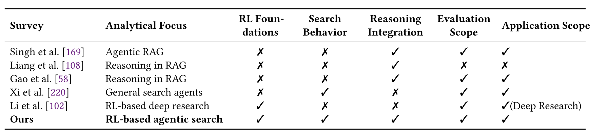
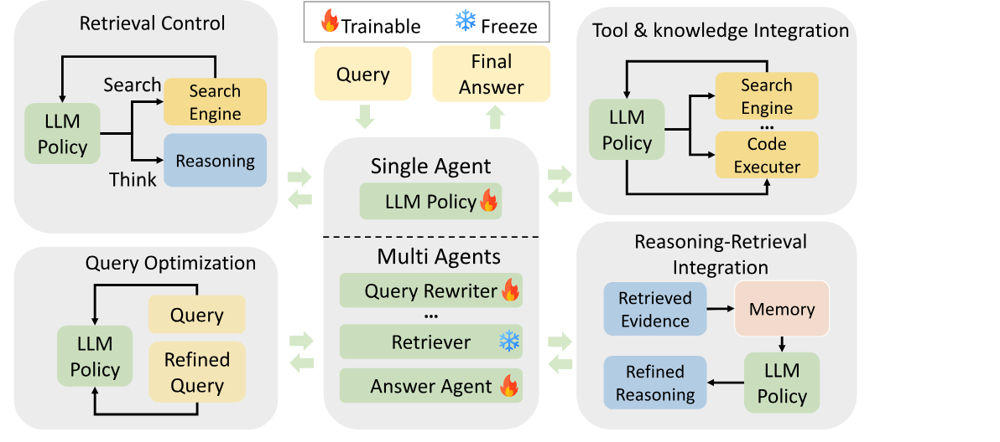
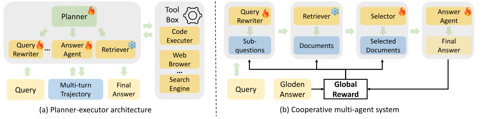
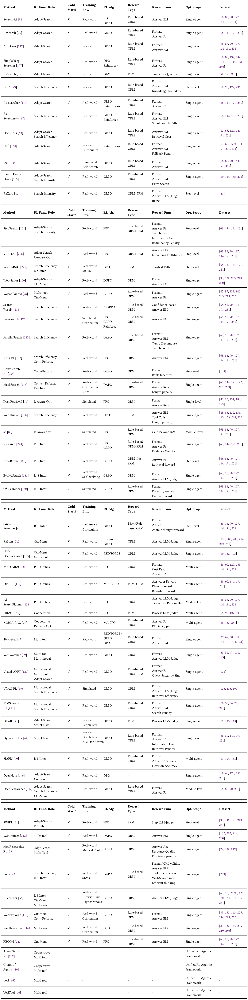

> [Minhua Lin](https://dblp.org/pid/274/1711), [Zongyu Wu](https://dblp.org/pid/322/4801-1), [Zhichao Xu](https://dblp.org/pid/146/0697-1), [Hui Liu](https://dblp.org/pid/93/4010-33), [Xianfeng Tang](https://dblp.org/pid/33/7694), [Qi He](https://dblp.org/pid/51/6972-2), [Charu C. Aggarwal](https://www.charuaggarwal.net/), [Hui Liu](https://dblp.org/pid/93/4010-31), [Xiang Zhang](https://dblp.org/pid/91/4353-1), 以及 [Suhang Wang](https://dblp.org/pid/136/9440). 2025 年 10 月 19 日首次提交至 arXiv; 当前版本为 v2. [A Comprehensive Survey on Reinforcement Learning-based Agentic Search: Foundations, Roles, Optimizations, Evaluations, and Applications](https://arxiv.org/abs/2510.16724). [原始 PDF](/paper/rl-based-agentic-search.pdf). [DOI](https://doi.org/10.48550/arXiv.2510.16724). [TeX 源码](https://export.arxiv.org/e-print/2510.16724v2). 精确的印刷版式与参考文献以原始 PDF 为准.

## 摘要

大语言模型 (LLM) 的出现通过开放式自然语言交互改变了信息获取与推理的方式. 然而, LLM 仍受限于静态知识, 容易产生事实幻觉, 也无法检索实时或特定领域的信息. 检索增强生成 (RAG) 通过让模型输出以外部证据为依据来缓解这些问题, 但传统 RAG 流水线通常只有单轮交互, 且依赖启发式方法, 无法自适应控制检索与推理. 近期的 *agentic search* 研究让 LLM 能够通过与搜索环境进行多步交互来规划, 检索和反思, 从而解决这些限制. 在这一范式下, 强化学习 (RL) 为自适应且能够自我改进的搜索行为提供了有力机制. 本综述首次全面梳理 *RL-based agentic search*, 并从三个互补维度组织这一新兴领域: (i) *RL 有何用途* (功能角色), (ii) *如何使用 RL* (优化策略), 以及 (iii) *RL 应用于何处* (优化范围). 我们总结了代表性方法, 评估规程与应用, 并讨论构建可靠且可扩展的 RL 驱动 agentic search 系统所面临的开放挑战与未来方向. 我们希望本综述能推动 RL 与 agentic search 结合方面的后续研究. 我们的资料库位于 [https://github.com/ventr1c/Awesome-RL-based-Agentic-Search-Papers](https://github.com/ventr1c/Awesome-RL-based-Agentic-Search-Papers).

## 1 引言

大语言模型 (LLM) [Ouy22a, Tou23a, Zha25ak] 在自然语言理解, 推理与生成方面展现出前所未有的能力, 从根本上改变了用户获取信息及与信息交互的方式. 尽管有这些优势, LLM 仍有若干局限: 它们受静态知识截止时间限制 [Che24r], 容易产生事实幻觉 [Sah24], 且无法访问实时或特定领域的信息. 为应对这些挑战, *检索增强生成 (RAG)* [Lew20, Gao24e] 范式已成为一种常用方案. RAG 将 LLM 的推理能力与经典信息检索 (IR) 技术的精确性结合起来, 包括 TF–IDF [Spa72, Aiz03], BM25 [Rob95, Rob09] 以及 PageRank [Bri98, Pag99, Bia05] 等链接分析模型. RAG 从外部知识库检索证据, 并让回答以这些上下文为条件, 使 LLM 能够生成更准确且有事实依据的输出, 在知识密集型任务中尤其如此 [Asa24, Bor22, Fan24c].

然而, 传统 RAG 系统 [Che17] 通常只有单轮交互且由启发式方法驱动: 检索一次, 生成一次, 无法根据中间反馈迭代细化查询或调整检索策略. 检索到的文档可能无关或含有噪声, 从而妨碍后续推理 [Jia23c, Cha25b, Jin25e, Jin25b]. 此外, LLM 往往难以充分利用检索到的证据, 限制了整条流水线的效果. 这些局限推动了更具 *agentic* 特征的搜索系统, 其中 LLM 充当自主决策者, 在多个步骤中动态规划, 检索, 推理和反思.

为此, 研究者提出了 *search agent*, 即能够与搜索环境进行多步交互的 LLM 系统 [Jia24c, Zhe25f]. 与传统 RAG 不同, search agent 可以反复发起并细化查询, 评估检索结果的质量, 动态调整策略以解决复杂的多跳任务. 从被动检索转向主动行动, 代表着信息搜寻范式的变化. 然而, 早期 search agent 往往严重依赖手工编写的提示 [Li25k] 或监督微调 [Qin23b, Asa24a], 因而难以自主发现最优策略.

近来, 强化学习 (RL) [Sut98] 已成为开发自适应自主 search agent 的一种很有潜力的范式 [Jin25b, Wan25ah]. 我们将 *RL-based agentic search* 定义为: 把 LLM 训练成与搜索环境交互的决策智能体, 让其接收外部反馈, 并反复改进策略以最大化奖励. 这一定义凸显了三个主要方面: (i) *自主性*, 即智能体自行决定搜索动作; (ii) *学习*, 即通过强化而非人工设计获得策略; (iii) *交互*, 即智能体与搜索环境开展多轮交流, 逐步改进推理与检索.

尽管该领域进展迅速, 人们对 RL-based agentic search 仍缺乏系统认识. 如[表 1](#table-01) 所示, 近期综述 [Xi25a, Li25q, Gao25e] 从不同视角考察了 agentic search. 但它们要么对 RL 关注较少 [Xi25a], 要么专注于 Deep Research [Li25q] 和 RAG [Gao25e] 等特定子领域. RL 在形成自适应自主搜索行为方面的作用仍未得到充分研究. 相比之下, 本文是首篇专门讨论 RL-based agentic search 的全面综述, 旨在从三个互补维度说明 RL 如何改善 agentic search: (i) *RL 有何用途*, 描述其在指导检索, 推理与决策方面的功能角色; (ii) *如何使用 RL*, 涵盖奖励设计, 策略学习和高级训练方法等优化策略; (iii) *RL 应用于何处*, 考察 RL 从智能体层面到步骤及模块层面的介入范围. 对每个维度, 我们都会回顾代表性方法并总结新近趋势. 本文的整体结构见[图 1](#figure-01).

本文的结构如下: [第 2 节](#section-2) 介绍 agentic search 与 RL 的基础知识. [第 3 节](#section-3) 至[第 5 节](#section-5) 从上述三个视角考察用于 agentic search 的 RL. [第 6 节](#section-6) 回顾评估指标与代表性应用, [第 7 节](#section-7) 以开放挑战和未来方向收尾.

**图 1.** RL-based Agentic Search 概览.

**表 1.** 代表性综述与本文的比较. ✓ 表示该主题是主要关注点; ✗ 表示涉及很少或完全未涉及. 先前综述关注的是非 RL 的 agentic RAG 或一般 search agent, 或者局限于构建 deep-research 系统的 RL 方法; 与之不同, 本文将 **RL 基础**与 **agentic search 行为**统一起来, 分析 RL 如何改善 agentic search, 如何优化 search agent, 以及如何有效评估此类系统.

## 2 背景与预备知识

### 2.1 作为智能体的大语言模型

LLM [Ouy22a, Tou23a, Yan25g, Wan25n, Lin25f, Zha24t] 在文本理解, 推理和生成方面展现出卓越能力, 从根本上改变了人类获取信息及与信息交互的方式. 它们的成功使各种知识资源都能采用自然语言界面. 然而, 这些模型仍受静态训练语料, 幻觉以及无法直接访问实时或特定领域知识等因素限制 [Ji23a]. 为了克服这些问题, 研究者越来越多地用外部信息源与决策能力来增强 LLM. 一个重要方向是 *检索增强生成 (RAG)* [Lew20, Gao24e, Liu25r], 其中 LLM 查询外部知识库, 使回答以检索到的证据为依据. 在这一范式之上, 近期研究 [Qin23b, Zhe25f] 进一步将 LLM 定位为 *agentic system*, 使其能够调用 *搜索引擎, 代码解释器, 知识库查询 API 和网页浏览器*等外部工具, 与动态环境交互并执行多步推理.

### 2.2 从传统 IR 到 Agentic Search

#### 2.2.1 传统 IR

经典信息检索 (IR) 的主要目标是返回与用户查询最匹配的文档排序列表, 它依靠 TF–IDF [Spa72] 和 BM25 [Rob95] 等统计模型, 以及 PageRank [Bri98, Pag99] 一类把纯文本之外的元数据纳入考虑的链接分析方法. 检索本身就是这一过程的终点, 结果仍需用户解释和整合. 此外, 传统 IR 方法虽然对许多任务有效, 但从根本上难以捕捉复杂的用户意图或执行多步推理 [Sha25c].

#### 2.2.2 RAG

检索增强生成 (RAG) [Lew20] 将检索整合进生成过程, 使 LLM 回答以检索到的文档为条件. 在其标准流水线中, 模型发出查询, 检索相关证据, 再根据该输入生成答案. 这种先检索后阅读的架构虽然让输出更有事实依据, 但仍有局限: RAG 通常只有单轮交互, 缺少自适应细化查询的机制, 且容易受到无关或含噪检索结果的影响 [Jia23c, Jin25e]. 迭代扩展 [Tri22a, Asa24a] 允许多轮检索, 但这些方法依然把 LLM 定位为基本被动的证据消费者, 而非主动的 search agent.

#### 2.2.3 Agentic Search

Agentic search 将 LLM 视为自主决策智能体, 因而超越了 RAG. 模型不再被动接受检索到的文档, 而是自行决定在*何时*, 到*何处*以及以*何种方式*进行搜索, 并把检索证据纳入持续的推理与行动之中. 这一范式通常以 *deep research agent* [Xu25f] 的形式实现, 它代表着一种转变: 检索不再是静态注入证据, 而是用于解决问题的动态工具. 形式上, deep research agent 是由 LLM 驱动的系统, 它整合动态推理, 自适应规划, 多轮数据检索, 工具使用与证据综合, 以支持复杂的信息研究任务.

### 2.3 强化学习基础

**图 2.** RL 组成部分概览

强化学习 (RL) 是机器学习中的一种基础范式, 研究智能体如何通过试错与环境交互, 从而最大化累积奖励 [Sut98]. 如[图 2](#figure-02) 所示, 智能体在每个时间步 $t$ 从环境观察状态 $s_{t}$, 根据策略 $\pi(a_{t}|s_{t})$ 选择动作 $a_{t}$, 随后在环境转移到新状态 $s_{t+1}$ 时收到奖励 $r_{t}$. 智能体不断更新策略 $\pi$, 以最大化一段时间内的累积奖励. 形式上, 此类优化问题被建模为马尔可夫决策过程 (MDP), 用元组 $(\mathcal{S},\mathcal{A},\mathcal{T},\mathcal{R})$ 表示, 其中 $\mathcal{S}$ 是可能状态的集合, $\mathcal{A}$ 是动作空间, $\mathcal{T}:\mathcal{S}\times\mathcal{A}\times\mathcal{S}\rightarrow[0,1]$ 表示状态转移概率函数, $\mathcal{R}:\mathcal{S}\times\mathcal{A}\times\mathcal{S}\rightarrow\mathbb{R}$ 定义奖励函数. 优化目标是学习策略 $\pi$, 使期望折扣累积奖励 $\sum_{k=0}^{\infty}\gamma^{k}r_{t+k+1}$ 最大化, 其中 $\gamma\in(0,1]$ 是折扣因子.

策略梯度方法 [Sch17a, Liu25u, Fen25b] 在 RL-based agentic search 中应用广泛, 因为它们能直接优化大型离散动作空间上的随机策略. 一般而言, 这些方法可分为: (i) *同策略优化*, 使用新采样的 rollout 更新策略 (例如 PPO [Sch17a] 和 GRPO [Sha24d]); (ii) *异策略或基于偏好的优化*, 利用离线轨迹或偏好数据, 无需在线采样 (例如 DPO [Raf23] 和 ReMix [Lia25g]).

#### 2.3.1 同策略优化

同策略算法使用当前策略与环境交互以收集 rollout, 估计优势, 再更新生成这些样本的同一策略. 这些算法能够在准确奖励信号下直接优化行为策略, 因此广泛用于大规模 LLM 与 agentic search 训练. 这一类算法可进一步分为两个子类:

- **基于评论器的算法.** 这些方法依赖显式的*价值函数*或*评论器*模型来估计每个状态或 token 的期望回报. 评论器提供 token 级反馈, 从而降低策略梯度的方差并稳定训练, 但也会增加计算成本与内存开销. PPO [Sch17a] 是这一范式中应用最广的例子.
- **无评论器算法.** 相比之下, 无评论器方法完全移除价值网络, 直接从相对奖励统计量估计优势. 这些算法不依赖学习到的价值预测, 而是为每个输入采样多个回答, 并在组内对奖励进行归一化以计算*基于组的优势*. 该策略在保持优化稳定的同时, 显著降低了训练复杂度与 GPU 内存消耗. 代表性例子包括 GRPO [Sha24d], Dr.GRPO [Liu25u], DAPO [Yu25g] 和 GiGPO [Fen25b].

**近端策略优化 (PPO)**. PPO [Sch17a] 是训练 RL 智能体时应用最广的方法之一. 它旨在最大化以下目标函数:

$$
\mathcal{J}_{\mathrm{PPO}}(\theta)=\mathbb{E}_{x\sim\mathcal{D},y\sim\pi_{\mathrm{old}}(\cdot|x)}\left[\min\left(\frac{\pi_{\theta}(y|x)}{\pi_{\mathrm{old}}(y|x)}A,\right.\right.\left.\left.\mathrm{clip}_{\epsilon}\left(\frac{\pi_{\theta}(y|x)}{\pi_{\mathrm{old}}(y|x)}\right)A\right)-\beta\mathbb{D}_{\mathrm{KL}}(\pi_{\theta}\mid\mid\pi_{\mathrm{ref}})\right],
$$

其中 $\pi_{\theta}$ 和 $\pi_{\mathrm{old}}$ 分别表示当前策略模型与先前策略模型. $\pi_{\mathrm{ref}}$ 是通过 KL 散度惩罚来正则化策略更新的参考模型, 该惩罚分别由 $\mathbb{D}_{\mathrm{KL}}$ 和 $\beta$ 度量及加权. $x$ 表示从分布 $D$ 中抽取的输入样本. $\mathrm{clip}_{\epsilon}$ 是超参数为 $\epsilon$ 的裁剪函数, 用于稳定训练. 优势估计 $A$ 使用广义优势估计 (GAE) [Sch15] 计算, 其依据是奖励 $r$ 与学习得到的价值函数 $V_{\psi}$.

**组相对策略优化 (GRPO)**. GRPO [Sha24d] 在 PPO 基础上移除了单独价值函数模型的需求, 后者往往会使内存用量翻倍. 它转而在同一输入的多组采样回答中估计相对优势, 从而提高训练效率. 具体而言, 对每个输入 $x\in D$, GRPO 从旧策略 $\pi_{\mathrm{old}}$ 采样一组输出 $\{y_{1},y_{2},\cdots,y_{G}\}$, 并通过最大化下式来优化新策略 $\pi_{\theta}$:

$$
\mathcal{J}_{\mathrm{GRPO}}(\theta)=\mathbb{E}_{x\sim\mathcal{D},\{y_{i}\}_{i=1}^{G}\sim\pi_{\mathrm{old}}(\cdot|x)}\frac{1}{G}\sum_{i=1}^{G}\left[\min\left(\frac{\pi_{\theta}(y|x)}{\pi_{\mathrm{old}}(y|x)}A_{i},\mathrm{clip}_{\epsilon}\left(\frac{\pi_{\theta}(y|x)}{\pi_{\mathrm{old}}(y|x)}\right)A_{i}\right)-\beta\mathbb{D}_{\mathrm{KL}}(\pi_{\theta}\mid\mid\pi_{\mathrm{ref}})\right],
$$

其中 $A_{i}$ 是使用每组内各输出所对应的奖励 $\{r_{1},r_{2},\ldots,r_{G}\}$ 计算的优势:

$$
A_{i}=\frac{r_{i}-\mathrm{mean}(\{r_{1},r_{2},\ldots,r_{G}\})}{\mathrm{std}(\{r_{1},r_{2},\ldots,r_{G}\})}.
$$

**解耦裁剪与动态采样策略优化 (DAPO)**. DAPO [Yu25g] 是一种用于训练长思维链 (CoT) 推理模型的新兴 RL 方法. 具体而言, DAPO 处理了 GRPO 的若干局限, 包括熵坍缩, 奖励噪声与训练不稳定. 它引入四项关键技术来提高长 CoT 场景中的 RL 性能: clip-higher, 动态采样, token 级策略梯度损失与超长奖励塑形. 形式上, DAPO 的目标函数旨在最大化下式:

$$
\begin{aligned}
\mathcal{J}_{\mathrm{DAPO}}(\theta)= & \mathbb{E}_{x\sim\mathcal{D},\{y_{i}\}_{i=1}^{G}\sim\pi_{\mathrm{old}}(\cdot|x)}\frac{1}{G}\sum_{i=1}^{G}\left[\min\left(\frac{\pi_{\theta}(y|x)}{\pi_{\mathrm{old}}(y|x)}A_{i},\mathrm{clip}\left(\frac{\pi_{\theta}(y|x)}{\pi_{\mathrm{old}}(y|x)},1-\epsilon_{\mathrm{low}},1+\epsilon_{\mathrm{high}}\right)A_{i}\right)\right] \\
& \mathrm{s.t.},~0<|\{y_{i}\mid\mathit{it\_equivalent}(x,y_{i})\}|<G,
\end{aligned}
$$

其中 $A_{i}$ 是[式 3](#equation-03) 定义的优势估计. $\epsilon_{\mathrm{high}}$ 通常大于 $\epsilon_{\mathrm{low}}$, 从而为增加低概率 token 提供更多灵活性; $\mathit{it\_equivalent}$ 是动态采样函数, 它进行过采样, 并过滤准确率等于 1 或 0 的 prompt. 注意, DAPO 排除了 KL 项, 因为在长 CoT 模型的训练过程中, 模型分布可能会与初始模型产生显著偏离.

#### 2.3.2 异策略优化

相比之下, 异策略与基于偏好的算法不需要从当前策略获得新的 rollout. 它们改为从先前收集的轨迹或显式偏好标注中学习, 大幅提高数据效率与稳定性. 这些方法尤其适用于大规模 LLM 对齐和 agentic search 场景, 因为在这些场景中收集在线反馈的成本很高或并不现实.

**直接偏好优化 (DPO)**. DPO [Raf23] 是一种让 LLM 与人类偏好对齐的代表性 *RL-free* 方法. 传统的基于人类反馈的强化学习 (RLHF) [Chr17, Sti20, Ouy22a, Zha25v] 会训练单独的奖励模型并执行迭代策略优化 (例如通过 PPO), DPO 与之不同, 它把对齐表示为直接的概率分类问题. 它直接从带偏好标签的回答对中学习, 绕过了显式奖励建模与 RL 循环. 形式上, 给定包含三元组 $(x,y_{w},y_{l})$ 的数据集 $\mathcal{D}$, 其中 $x$ 是 prompt, $y_{w}$ 与 $y_{l}$ 分别表示*偏好 (胜出)*回答和*非偏好 (落败)*回答, 假定这些偏好由底层潜在奖励函数 $r^{*}(y,x)$ 生成, 且 $r^{*}(y_{w},x)>r^{*}(y_{l},x)$. DPO 优化策略 $\pi_{\theta}$, 使 $y_{w}$ 相对于 $y_{l}$ 的似然较参考模型 $\pi_{\text{ref}}$ 有所增加, 如下所示:

$$
\mathcal{J}_{\mathrm{DPO}}(\theta)=\mathbb{E}_{(x,y_{w},y_{l})\sim\mathcal{D}}\left[\log{\sigma}\left(\beta\frac{\pi_{\theta}(y_{w}|x)}{\pi_{\mathrm{ref}}(y_{w}|x)}-\beta\frac{\pi_{\theta}(y_{l}|x)}{\pi_{\mathrm{ref}}(y_{l}|x)}\right)\right],
$$

其中 $\pi_{\mathrm{ref}}$ 是参考模型, $\beta$ 是控制该正则化强度的超参数. $\sigma$ 函数为 sigmoid, 有助于优化两个回答的相对概率. 借助这一目标, DPO 无需中间奖励模型, 便可直接优化策略以反映人类偏好.

**图 3.** RL-based agentic search 的示意框架. RL 在多个决策点介入, 包括控制何时检索 (检索控制), 如何表述查询 (查询优化), 如何将证据整合进推理 (推理–检索整合), 以及使用哪些工具或知识源 (工具与知识整合).

### 2.4 RL-based Agentic Search

在 agentic search 中, 检索与推理嵌入在*序列决策过程*中, 而非作为固定的一次性步骤执行. 智能体必须决定在*何时*搜索, *如何*表述或细化查询, 以及*如何*把检索到的证据纳入多步推理. [图 3](#figure-03) 勾勒了这条流水线, 并标出了 RL 可以介入的决策点: (i) **搜索控制** (是否/何时检索), (ii) **查询优化** (如何检索), 以及 (iii) **推理整合** (如何使用检索信息).

#### 2.4.1 与引入 RL 之前的 Agentic Search 比较

在把 RL 引入 agentic search 之前, 大多数系统依靠*结构化提示* [Zho24h, Xu24e, Wan23h, Lee24e, Che24s] 或*监督微调 (SFT)* [Sch23, Asa23, Aks23, Zha25ac] 来指导检索和推理行为.

**基于提示的方法.** 这些方法主要依赖人工设计的启发式规则与预先定义的推理工作流. 例如, PlanRAG [Lee24e] 和 MetaRAG [Zho24h] 采用迭代循环, 让智能体交替进行搜索, 生成答案和反思答案质量, 再决定是否继续搜索. 这一过程反复执行, 直到得到令人满意的回答. 与此类似, Knowledge-driven CoT [Wan23h] 遵循一条反思链, 鼓励模型重新评估中间推理, 并根据检索到的证据动态调整策略. 这些基于提示的系统虽有效, 却依赖固定的符号模板或手工编写的 prompt 结构, 无法适应未见过的任务分布或动态检索环境.

**基于 SFT 的方法.** 这些方法用包含搜索, 反思和生成动作的高质量轨迹数据集训练模型, 使模型把这些行为内化进参数. 例如, Toolformer [Sch23] 使用自动把 API 调用插入文本生成过程的自标注数据来微调 LM. 它学会决定何时以及如何使用计算器, Wikipedia 搜索引擎等外部工具, 无需额外人工监督便能提高事实性. 与此类似, SelfRAG [Asa23] 引入*自反思检索增强生成*, 通过监督使模型既生成普通 token, 也生成特殊的*反思 token* (例如 `<Retrieve>`, `<Relevant>`, `<Supported>`), 用于表示何时检索新证据, 以及每次生成得到检索段落支持的程度. 尽管有这些进展, 基于 SFT 的方法从根本上仍由模仿驱动. 它们可以捕捉上下文与动作之间的相关性, 却缺少进行长视野信用分配或结果驱动优化的机制.

**局限以及为何采用 RL.** 尽管取得了进展, 基于提示和基于 SFT 的智能体都有内在局限:

- *适应性差*: 其行为大多由预定义规则决定, 或从静态数据集中模仿而来. 面对未见过的任务或 API 行为时, 它们无法动态调整检索频率或重新表述查询.
- *监督瓶颈*: 高质量推理与搜索轨迹收集成本高, 且难以扩展至多个任务, 这会限制泛化, 也让模型难以在示范的基础上进一步提高.

RL 为克服这些问题提供了有原则的方法: 把智能体优化为与环境交互, 接收反馈并通过试错调整的策略 $\pi_{\theta}$. RL 不同于基于 SFT 的模仿, 它直接优化结合正确性, 成本与延迟的任务级奖励, 从而发现*自适应且高效*的检索策略. 这一范式让智能体能够考虑每次搜索决策的*长期后果*, 从静态模仿走向结果驱动的学习.

#### 2.4.2 形式化.

形式上, RL-based agentic search 可以建模为 MDP. 目标是训练策略 $\pi_{\theta}$, 使其在环境中采取一系列动作来最大化累积奖励. 主要组成部分为: (i) **智能体**: LLM 策略 $\pi_{\theta}$, 由 $\theta$ 参数化, 根据当前状态生成动作; (ii) **环境**: 智能体可与之交互的外部资源, 例如搜索引擎 API, 检索器, 知识图谱或工具接口; (iii) **状态 ($s_{t}$)**: 当前上下文, 包括原始查询, 中间推理轨迹, 检索证据与动作历史; (iv) **动作 ($a_{t}$)**: 离散决策, 例如发出查询, 重新表述现有查询, 选择文档, 调用工具 (例如搜索 API, 检索器), 或以最终答案结束; (v) **动作 ($a_{t}$)**: 离散决策, 例如发出查询, 重新表述现有查询, 选择文档, 调用工具 (例如搜索 API, 检索器), 或以最终答案结束; (vi) **奖励 ($r_{t}$)**: 标量反馈信号, 用于刻画任务成功 (例如答案正确性, 事实一致性), 过程质量 (例如查询效率, 推理连贯性) 或资源成本 (例如 API 调用, 延迟); (vii) **转移 ($\mathcal{T}$)**: 由环境 (例如搜索引擎返回文档) 和智能体内部更新共同引发的动态变化.

**表 2.** 从功能角色视角划分 RL-based search agent.

## 3 RL 有何用途: Agentic Search 中的功能角色

RL 在 agentic search 中承担的功能十分广泛, 远不止基本检索. 本节把这些角色归纳为五个主要维度, 以说明 RL 如何让智能体不仅能决定在*何时*搜索, 还能决定*如何*表述查询, *如何*把推理与证据交织起来, 以及*如何*协调多个智能体和工具. [表 2](#table-02) 总结了 RL 各种角色的代表性工作.

### 3.1 检索控制

RL 在 agentic search 中的一个核心角色, 是控制智能体*是否, 何时以及如何*检索外部信息. 这一视角并非固定的设计原则, 而是对近期 RL-based retrieval 系统 [Hua25e, Jin25b, Wu25q, Wan25ah] 所体现趋势的综合, 在这些系统中, 检索控制成为主要优化目标. 有效的检索控制十分重要, 因为过多或不必要的查询会增加成本和延迟, 检索不足则可能遗漏关键证据. RL 通过学习能对任务上下文和不确定性作出响应的自适应检索策略, 使智能体可以权衡二者. 此类方法处理三个主要方面: (i) *自适应搜索决策*, 即选择检索或依靠参数化知识; (ii) *搜索强度与持续性*, 即检索的频率和深度; (iii) *搜索效率*, 即在保持任务性能的同时尽量减少冗余, 成本与延迟.

#### 3.1.1 自适应搜索决策

RL 使智能体能够判断某个问题可否用内部参数化知识回答, 或者是否需要外部检索. Search-R1 [Jin25b], ReSearch [Che25i] 和 R1-Searcher [Son25a] 是较早的例子, 它们教 LLM 只在必要时调用搜索引擎. 具体而言, 如[表 3](#table-03) 所示, 这些方法鼓励 LLM 在内部知识不足以给出准确答案时调用搜索引擎以访问外部信息. 在这一思路上, DeepRAG [Gua25c] 将 RAG 表述为 MDP, 其中复杂查询被*迭代分解为原子子查询*, 每个子查询对应一项集中的信息需求. 在每个推理步骤中, 智能体在奖励引导下决定使用参数化知识回答子查询, 还是检索外部证据, 该奖励会联合优化答案正确性与检索成本.

#### 3.1.2 搜索强度

对于复杂或含义不明的查询, 一次检索可能并不足够. RL 已被用来优化搜索过程的深度与持续性. Pangu DeepDiver [Shi25d] 引入*搜索强度扩展*, 在检测到歧义时奖励智能体加强检索. ReZero [Dao25] 奖励搜索失败后的重试, 从而鼓励持续性与稳健性. StepSearch [Wan25ah] 引入基于信息增益和冗余惩罚的逐步奖励, 一步步指导检索.

#### 3.1.3 搜索效率.

效率既涉及检索的*成本* (例如 API 调用次数, 训练 rollout 数量), 也涉及完成搜索所需的*时间*. R1-Searcher++ [Son25b] 扩展 R1-Searcher, 引入通过不同回答间检索次数的方差来衡量检索节制程度的*组奖励*, 奖励用最少检索调用得到的正确答案, 同时惩罚冗余搜索. IKEA [Hua25e] 引入知识边界感知奖励, 除非外部检索确有必要, 否则更偏向内部推理. Search Wisely [Wu25q] 过滤可能产生较差结果的低置信度查询, 从而提高成本效率. StepSearch [Wan25ah] 使用逐步奖励惩罚冗余查询, 鼓励更简洁的检索策略. ZeroSearch [Sun25b] 在潜在空间中模拟检索, 无需依赖真实搜索引擎即可开展课程式训练, 从而降低 API 开销. 除减少检索调用外, ParallelSearch [Zha25af] 把复杂问题分解成并行子查询, 在保持覆盖范围的同时显著缩短回答时间; RAG-R1 [Tan25c] 同样鼓励多查询并行, 以提高推理效率. 此外, WebThinker [Li25l] 把效率的概念从搜索成本扩展到推理行为, 应用偏好优化使查询策略与正确性, 工具效率和思考简洁度等长视野推理目标对齐, 从而通过推理驱动的反馈而不只是检索准确率来改进检索决策.

### 3.2 查询优化

即便已经触发检索, 查询质量仍会显著影响结果. 表述不当的查询会得到无关或含噪结果. 因此, RL 被用于根据反馈改进查询生成, 超越静态启发式方法. 现有工作可分为: (i) *对话式重写*与 (ii) *检索器感知优化*.

#### 3.2.1 对话式重写

在交互环境中, 用户查询往往有歧义或依赖上下文, 因而直接检索并不可靠. RL 把重写表述为序列决策过程, 使智能体能够将这类输入改写成自足的查询. ConvSearch-R1 [Zhu25i] 使用基于检索的奖励来优化重写器策略: 重写后的查询把黄金段落排在越靠前的位置, 奖励就越高. 该重写器先在通过检索指导的自蒸馏所生成的数据上进行 SFT, 再使用*排名激励奖励塑形*函数通过 RL 进一步改进, 该函数鼓励提高黄金段落的排名, 同时缓解奖励稀疏问题. 这种两阶段设计使查询重写器与检索器偏好对齐, 提高多轮搜索的检索精度. MaskSearch [Wu25r] 加入*重写器智能体*来扩展这一范式, 以改进搜索查询并实现更全面的检索, 其输出还会用于 LLM 的 SFT 推理轨迹. RAG-R1 [Tan25c] 不优化单独的重写器策略, 而是鼓励 LLM 自身在一个 prompt 中生成多个并行查询, 以提高推理效率与检索多样性. 同样, ParallelSearch [Zha25af] 训练 LLM 在一次推理中把复杂或多跳问题分解为并行子查询. RL 微调期间, *分解奖励*鼓励有效拆分查询, *搜索次数奖励*则惩罚过多的搜索动作, 从而权衡重写粒度与检索效率.

#### 3.2.2 检索器感知优化

对话式重写着重解决用户侧的歧义, 检索器感知优化则以查询生成的系统侧为目标. 它训练智能体根据特定检索器的特征, 偏置和反馈信号调整查询. 其目标是弥合 LLM 生成的查询与检索器实际排序行为之间的语义差距, 从而在不同搜索基础设施上提高检索准确性与稳健性. DeepRetrieval [Jia25c] 是这一思路的典型例子, 它训练 LLM 生成与黑盒搜索引擎偏置相符的查询, 实际利用检索器的行为来最大化召回率. WebThinker [Li25l] 应用偏好优化, 使查询策略与正确性, 工具效率和思考简洁度等长视野推理目标对齐, 让智能体可以使用推理驱动的反馈而非仅靠检索准确率来改进搜索行为. ZeroSearch [Sun25b] 通过模拟检索环境进一步扩展了这一方法, 使智能体能够学习可跨不同检索器泛化的稳健查询行为, 同时避免真实 API 调用的成本与不稳定性. 类似地, s3 [Jia25d] 引入一个与 LLM 生成器解耦的轻量级 RL-based searcher 模块, 实现可扩展且与模型无关的查询优化. 这些方法共同体现出一项更广泛的目标: 设计能在异构搜索环境中保持有效的检索器感知查询策略.

### 3.3 推理–检索整合

除了决定在*何时*及*如何*有效搜索, 知识密集型任务通常还要求推理与检索紧密结合. 证据只有改善了推理才有价值, 推理也应指导下一步检索的内容. RL 优化 LLM 如何交替执行这些过程, 管理上下文并根据反馈改进推理.

#### 3.3.1 推理–搜索交替

RL 不只是在推理期间允许检索 [Jin25b, Che25i], 还会优化检索以提高推理质量. R-Search [Zha25at] 引入*证据奖励*, 鼓励生成能产生更多信息性证据的高质量查询. AutoRefine [Shi25e] 将标准的“搜索再思考”范式扩展为“在思考期间搜索并改进”, 奖励中间改进步骤, 从而加强忠实且有针对性的知识提取. EvolveSearch [Zha25au] 通过 SFT 与 RL 的迭代循环进一步加强推理–检索交互, 提高训练期间的数据效率, 使智能体逐步改进推理路径与检索策略. 相比之下, MaskSearch [Wu25r] 着重在 RL 优化*之前*增强模型的检索感知推理能力. 它引入*检索增强掩码预测 (RAMP) 预训练任务*, 教模型在 SFT 阶段利用外部搜索工具, 以检索到的知识填补掩码片段. 这一 RL 前目标建立了使推理与检索行为对齐的检索感知先验, 增强了模型在各种下游任务中的通用搜索能力.

#### 3.3.2 上下文与记忆管理

现有 agentic search 系统 [Zha25at, Jin25b, Wan25ah] 对单轮检索或步骤级推理等短视野任务行之有效, 但往往难以处理长视野或多会话环境, 在这些环境中, 智能体必须在有限的上下文窗口内管理较长的交互历史. 为在这类限制下高效运行, 智能体需要*主动管理记忆*, 随搜索进程展开决定保留, 总结或丢弃哪些信息. 近期研究 [Gao25d, Xu25g, Wu25l, Che25u, Li25h, Li25y] 应用 RL 优化这一过程, 把记忆控制表述为权衡*信息保真度*与*上下文效率*的序列决策问题. 具体而言, 目前出现了两种互补策略:

- **内部管理:** 智能体自身在 RL 指导下执行总结, 刷新或剪枝工作上下文等记忆操作. 例如, ReSum [Wu25l] 使用 RL 训练智能体生成过去推理与交互的简洁摘要, 在不超出 token 限制的情况下进行长上下文推理. SFR-DeepResearch [Ngu25a] 还引入显式记忆动作 (例如 `clean_memory`, `store_snippet`), 使用 RL 信号决定何时保留或丢弃过去的信息, 从而避免记忆溢出与冗余.
- **外部管理:** 其他框架使用辅助摘要模块压缩历史上下文, 再把它注回智能体的推理流. 在这类情况下, 系统使用 RL 或策略学习来决定何时以及如何调用这些摘要器. 例如, **WebSailor** [Li25h] 使用外部摘要器压缩多页面搜索的浏览轨迹; **ASearcher** [Gao25d] 动态总结多轮研究会话以保留主要发现; **RECON** [Xu25g] 把冻结的预训练摘要器整合进 RL-based search agent (例如 Search-R1); 该摘要器经过监督相关性预训练与多方面蒸馏, 使智能体能够依据简洁且符合事实的证据进行推理, 同时大幅缩短上下文并降低成本.

### 3.4 多智能体协作

高级 agentic search 系统 [Che25t, Wan25t] 不让单个 LLM 同时处理推理与检索, 而是把这一过程分解成多个专门模块, 例如查询重写 [Ma23], 文档选择 [Ke24] 与推理控制. 随后使用 RL 对齐不同智能体的目标, 确保何时重写, 保留哪些证据及如何安排检索步骤等局部决策, 能够促成全局连贯且高效的搜索. 现有方法大体可分为: (i) *规划器–执行器架构*与 (ii) *协作式多智能体系统*.

**图 4.** 用于多智能体协作的 RL 概览. (a) *规划器–执行器架构*: 中央规划器协调专门的执行器智能体, 进行任务分解和动态子任务分配. (b) *协作式多智能体系统*: 多个智能体通过通信, 协调与奖励共享来联合优化共同目标.

#### 3.4.1 规划器–执行器架构

一种代表性范式是*规划器–执行器架构*, 其中高层规划器编排负责不同检索或推理操作的专门执行器. 如[图 4](#figure-04)(a) 所示, 规划器充当元策略, 决定调用哪个执行器, 何时切换子任务, 以及如何分配搜索或计算预算, 从而在异构 RAG 模块间实现*自适应编排*.

**MAO-ARAG** [Che25t] 是这种设计的一个例子. 它将多智能体 RAG 建模为*多智能体半马尔可夫决策过程 (MSMDP)*, 其中规划器协调查询重写器, 文档选择器, 检索器和生成器等执行器. 具体而言, 规划器智能体从这些执行器中智能地选择并整合适当的智能体, 组成针对每个查询的合适工作流, 力求在保持合理成本的同时给出高质量答案. 在每一轮中, 规划器智能体使用 PPO 训练, 通过以下奖励进行优化:

$$
r_{t}=r_{\mathrm{F1}}-\alpha\cdot r_{\mathrm{CP}}-r_{\mathrm{FP}},
$$

其中 $r_{\mathrm{F1}}$ 是基于 F1 分数的结果奖励, $r_{\mathrm{CP}}$ 与 $r_{\mathrm{FP}}$ 分别为成本惩罚和格式惩罚. 这些奖励共同提高答案质量, 同时把成本控制在合理范围内.

OPERA [Liu25x] 将这一思路扩展至多跳检索与推理. 它采用由高层规划模块和低层执行智能体组成的分层 RL 框架. 三个角色专用智能体, 包括 *Plan*, *Analysis–Answer* 和 *Rewrite*, 通过 Multi-Agents Progressive GRPO (MAPGRPO) 优化, 这是一种基于 GRPO 的算法, 能提供细粒度且针对角色的信用分配. 每个智能体都使用专门的奖励信号训练: Plan Agent 负责分解有效性, Analysis–Answer Agent 负责推理与事实正确性, Rewrite Agent 负责检索相关性与格式. 这种分层优化实现了稳定收敛与可解释的推理轨迹, 使 OPERA 能够学习成本高效且可验证的检索–推理工作流.

#### 3.4.2 协作式多智能体系统

另一种工作流把 agentic search 建模为协作式多智能体博弈, 其中每个模块都被视为 RL 智能体, 其动作会影响检索结果, 并用共享的全局奖励使它们的行为朝更好性能对齐. 整体框架见[图 3](#figure-03)(b). 例如, SIRAG [Wan25t] 训练 Decision-Maker 决定何时检索, 训练 Knowledge-Selector 筛选应传递给下游的文档, 并通过 RL 奖励使二者的决策与高质量证据整合这一目标对齐. MMOA-RAG [Che25q] 将这一环境推广到更大的智能体池, 其中 RL 优化智能体如何分担查询重写, 证据选择与验证职责. 此外, AgentGym-RL [Xi25b] 和 Chain-of-Agents [Li25j] 等工作为训练多智能体系统提供了通用基础设施, agentic search 是其中的核心评估场景.

### 3.5 工具与知识整合

最后, agentic search 不再只依靠文本检索, 而是越来越需要与异构外部资源整合, 包括 API [Jia25a], 多模态工具 [Wan25ai, Gen25a] 与结构化知识库 [Cha25c, Hao25b], 以扩展智能体能够解决的任务范围, RL 是赋予智能体这种能力的一种自然方案. 这一类别的研究可分为两个方向: (i) *多工具与多模态推理*, 智能体学习在搜索引擎, 代码解释器和视觉模型等不同工具集之间协调; (ii) *结构化知识探索*, RL 训练智能体以目标为导向遍历知识图谱或表格等符号环境.

#### 3.5.1 多工具与多模态推理

许多任务需要的不只是文本检索, 还要求智能体结合计算, 网页搜索与多模态理解. RL 根据工具调用是否带来准确推理或任务完成提供反馈, 从而优化工具选择与调用顺序. Tool-Star [Don25e] 整合了包括搜索引擎和代码生成器在内的六种工具, 使用奖励正确中间输出的自评论 RL 配置. VerlTool [Jia25a] 以管理异构 API 和多模态 LLM (MLLM) 的统一 RL 框架推广了这一方法. 在多模态环境中, MMSearch-R1 [Wu25s], Visual-ARFT [Liu25z] 和 VRAG-RL [Wan25ai] 把 Search-R1 范式扩展到视觉问答, 奖励使检索文本与视觉证据对齐的策略. WebWatcher [Gen25a] 进一步使用 RL 训练智能体同时协调多种工具, 处理文本与视觉输入.

#### 3.5.2 结构化知识导航

在许多领域, 关键信息存储于知识图谱 (KG) 或数据库等结构化资源中 [Bol08, Zho17b, Lin24f, Lin25g]. 系统把遍历定义为序列决策过程来应用 RL: 每一步选择要沿哪个实体或关系继续, 奖励则反映正确性, 覆盖率或效率. 例如, GRAIL [Cha25c] 应用 RL 学习能高效到达正确答案的 KG 遍历策略. DynaSearcher [Hao25b] 以多奖励 RL 扩展了这一方法, 联合优化 KG 探索的准确性, 效率与平衡性.

## 4 如何使用 RL: 优化策略

本节考察 RL 如何应用于 agentic search 系统, 涵盖训练流水线, 算法设计与奖励机制. [表 7](#table-07) 总结了代表性工作及其相应的优化策略.

### 4.1 训练机制

训练机制定义了如何把 RL 整合进 agentic search, 包括初始化策略, 环境设计与优化工作流. 它决定智能体如何在基于交互的学习过程中获得, 改进并稳定其决策策略.

#### 4.1.1 标准 Agentic Search 流水线

典型的 agentic search RL 训练流水线以 Search-R1 [Jin25b] 为例, 由两个阶段构成: *冷启动*初始化与后续 RL 微调. 冷启动阶段确保符合接口要求 (例如 API 调用, 工具 schema), 并稳定早期 rollout. 在 RL 训练期间, 策略 LLM 接收复杂查询, 并在模拟或真实搜索环境中交错生成推理与工具使用动作. 整体训练流水线与 prompt 模板见[表 3](#table-03).

**表 3.** 标准 agentic search prompt 模板. 这里以 Search-R1 [Jin25b] 的 prompt 模板为例.

#### 4.1.2 冷启动

主流范式在 RL 优化之前通过监督微调 (SFT) 初始化智能体 [Li25h, Wu25d, Don25e, Son25b]. 这一阶段赋予模型基本任务能力, 并缓解长视野环境中稀疏奖励导致的早期不稳定. 例如, Webagent-R1 [Wei25f] 表明 SFT 为后续 RL 提供关键的网页交互知识, WebSailor [Li25h] 则发现 SFT 能加速收敛并稳定多步工具使用. EvolveSearch [Zha25au] 还引入了自我改进的 SFT–RL 循环, 由 RL 改进后的策略生成新示范, 用于迭代 SFT 再训练. 反过来, 一些工作 [Sun25b, Xi25b] 对 SFT 的必要性提出质疑. ZeroSearch [Sun25b] 用潜在空间检索模拟代替 SFT, 无需外部监督即可进行纯 RL 训练, AgentGym-RL [Xi25b] 则使用基于课程的视野扩展来稳定纯 RL 训练.

#### 4.1.3 基于模拟的训练

在真实搜索环境中训练 RL 智能体可能成本高得难以承受, 速度慢且不可复现. 模拟环境提供了一种可控, 快速且成本低的替代方案. 例如, ZeroSearch [Sun25b] 提出一种新颖的 RL 框架, 通过把 LLM 转化为检索模块来*模拟*搜索, 避免训练期间使用真实搜索引擎所产生的成本与噪声. 它采用逐渐降低模拟文档质量的课程, 迫使智能体变得更稳健. O2-Searcher [Mei25a] 也利用高效的本地模拟搜索环境进行训练, 关注开放域开放式问答场景. WebSailor-V2 [Li25y] 提出双环境 RL 框架, 使用高保真模拟器快速迭代算法, 再使用稳健且受控的真实环境稳定地训练最终策略. 这种混合方法同时处理可扩展性与真实性方面的挑战.

#### 4.1.4 RL 算法

大多数 RL-based search agent 使用策略梯度算法, 尤其是 PPO [Sch17a], GRPO [Sha24d] 和 Reinforce++ [Hu25d]. 近期变体针对搜索环境调整了这些方法: Search Wisely [Wu25q] 引入 $\beta$-GRPO 进行不确定性感知校准, StepSearch [Wan25ah] 实现与信息增益对齐的逐步 PPO, ReinforceRAG [Zen25c] 则为策略梯度加入检索感知基线, 以减轻稀疏奖励下的方差. RL-based search agent 所用 RL 算法的详细信息见[表 7](#table-07).

#### 4.1.5 课程学习与视野扩展

由于奖励稀疏且信用分配不稳定, 长视野搜索任务的 RL 训练仍然困难. 课程学习通过逐渐增加任务复杂度或交互长度来缓解这些问题. AgentGym-RL [Xi25b] 提出 *ScalingInter-RL*, 它逐步延长交互视野, 从短小集中的任务开始, 再逐渐扩展到多步推理, 以平衡探索与利用. ZeroSearch [Sun25b] 采用系统性增加检索噪声的课程, 迫使智能体形成更有韧性的策略. InfoSeek [Xia25d] 同样生成难度逐步提高的研究任务, 以促进结构化的能力增长. 这些策略共同提高收敛稳定性, 并支持能力持续扩展.

#### 4.1.6 迭代式与自演化框架

除静态课程外, 一些框架闭合了数据生成与策略学习之间的循环. EvolveSearch [Zha25au] 是这种方法的典型代表: 经过 RL 训练的模型生成质量更高的搜索轨迹, 再把这些轨迹蒸馏回 SFT 数据, 形成自我强化的改进循环. 这类迭代框架表明, RL 不只能充当训练目标, 还能充当数据生成器, 持续改进模型行为与监督质量.

**表 4.** RL-based agentic search 中代表性奖励函数的比较. $a_{\mathrm{pred}}$ 和 $a_{\text{gt}}$ 分别表示预测答案与真实答案. $r_{\text{ans}}$ 是答案级奖励; $\mathrm{RT}$ 是检索步骤数; $\mathrm{RT}_{\max}$ 是最大检索预算; $r_{\text{kb}+}$ 和 $r_{\text{kb}-}$ 分别表示最大知识边界奖励与较小惩罚. $\mathbb{I}(\cdot)$ 是指示函数, $\gamma$ 是折扣因子, $v(\cdot)$ 是 rollout 价值, $\alpha$ 是衰减系数. $r_{\text{sim}}(\cdot,\cdot)$ 是基于模型所生成搜索查询与真实查询之间语义相似度的奖励函数, 相似度使用 Sentence Transformer 计算.

### 4.2 奖励设计

奖励设计对 agentic search 的 RL 训练至关重要, 它决定强化哪些行为, 以及如何在复杂轨迹中分配信用. 现代 agentic search 采用*多方面, 多轮奖励机制*, 不仅优化最终结果的准确性与中间推理, 还会优化清晰度, 真实性, 简洁度, 效率以及降低幻觉倾向等不同目标. 这些复杂的奖励结构可沿两个互补维度分类: 时间范围 (结果级与过程级) 和目标多样性 (单目标与多方面优化). [表 4](#table-04) 总结了近期 RL-based agentic search 框架 [Jin25b, Che25i, Dao25, Shi25d, Shi25e, Zha25at, Zha25ae, Liu25z] 所采用的代表性奖励函数, 说明不同设计如何权衡最终答案准确性, 中间推理质量与资源高效的检索.

#### 4.2.1 结果级奖励

结果级奖励评估最终任务的完成情况, 但如今越来越多地把简单正确性以外的多个质量维度纳入考量. Search-R1 [Jin25b] 和 ReSearch [Che25i] 等早期方法依靠基本的精确匹配 (EM) 与格式奖励来衡量正确性与风格一致性. 后续的**多方面**扩展增强了这些指标: R-Search [Zha25at] 引入*跨模型证据效用*, 在奖励正确性的同时奖励证据质量与可解释性. IKEA [Hua25e] 设计*知识边界塑形*, 通过阻止冗余检索来同时优化准确性与效率. R1-Searcher++ [Son25b] 通过检索器调用方差衡量*组相对效率*, 在任务成功与资源节约之间取得平衡. O2-Searcher [Mei25a] 引入*多样性奖励*, 鼓励*查询多样性*, 以减轻预算约束下的重复问题.

#### 4.2.2 过程级奖励

结果信号对一般任务简单有效, 但在长视野多步搜索环境中, 它们往往过于稀疏, 无法指导学习 [Den25b]. 过程级奖励在整个推理–检索轨迹中提供密集的细粒度反馈, 以解决这一局限, 从而对忠实性 [Shi25e] 与效率 [Wan25ah] 等中间行为进行*多轮, 多方面*优化. ReasonRAG [Zha25ae] 引入*最短路径奖励估计* (SPRE), 通过模拟可能结果并惩罚不必要的长轨迹, 同时优化推理质量与简洁度. StepSearch [Wan25ah] 从包括信息增益与冗余惩罚在内的多个维度评估每个检索步骤的效用. AutoRefine [Shi25e] 通过迭代式步骤级奖励强化忠实且有针对性的知识提取. 除这些可验证的基于规则的奖励外, 一些工作 [Wan25t, Den25b] 还从 LLM 采样奖励, 以提供步骤级奖励来处理稀疏奖励与训练稳定性问题, 或实现忠实搜索 [Xu25h].

## 5 RL 应用于何处: 优化范围

RL 在 agentic search 中的应用, 可以按进行优化的*架构层级*分类. 这一视角说明 RL 是改进特定子技能, 优化单个智能体的策略, 还是编排多个智能体或系统级搜索基础设施中的行为. [表 5](#table-05) 总结了这三个范围层级的代表性工作.

**表 5.** 从优化范围视角划分 RL-based search agent.

### 5.1 智能体级 Scpoe

在智能体层面, RL 优化端到端搜索策略, 既可以用于单个自主 search agent, 也可以用于协同的多智能体搜索系统. 这一范围反映了 RL 如何塑造定义有效信息搜寻行为的核心搜索决策过程.

#### 5.1.1 单智能体优化

这是最常见的范式, 其中 RL 直接优化管理智能体整个搜索工作流的统一策略. 智能体学习何时检索, 如何表述查询, 如何解释证据以及何时结束搜索. Search-R1 [Jin25b] 是这一方法的代表, 它训练 LLM 在推理期间自主决定何时以及如何调用外部搜索引擎. R1-Searcher++ [Son25b] 在此基础上权衡内部知识使用与外部搜索依赖. WebSailor [Li25h] 和 WebDancer [Wu25d] 等基于网页的智能体展示了 RL 在复杂网页环境中训练稳健长视野搜索策略的潜力.

#### 5.1.2 多智能体协调

对于更复杂的搜索流水线, 不同智能体会专门负责查询重写, 文档选择和证据综合等搜索相关功能. RL 协调这些专门的 search agent, 以形成连贯的信息搜寻行为. SIRAG [Wan25t] 在共享奖励函数下联合训练控制搜索时机的 *Decision Maker* 与筛选检索文档的 *Knowledge Selector*. MAO-ARAG [Che25t] 使用 RL 编排多个搜索专家 (例如查询重写器, 文档选择器, 答案生成器), 以优化其协作搜索性能.

### 5.2 模块级与步骤级范围

这一范围着重优化更广泛 agentic search 工作流中的特定搜索组件或决策步骤. RL 不再端到端训练整个智能体策略, 而是改进局部行为, 因而适合改善搜索流水线的某些特定方面.

#### 5.2.1 模块级优化

RL 可以增强在冻结 LLM 旁运行的专门模块. 这种模块化方法隔离出搜索专用能力, 无需重新训练整个模型即可有针对性地改进. s3 [Jia25d] 是该策略的一个例子, 它训练轻量级 searcher 模块, 同时保持生成器冻结, 从而兼顾效率与模型无关的适应性. AI-SearchPlanner [Mei25b] 采用类似设计, 训练检索规划模块决定何时以及如何查询, 同时使用冻结的 QA 模型生成最终答案.

#### 5.2.2 步骤级优化

RL 还可以为查询生成, 文档选择或改进等单个搜索动作提供细粒度反馈. StepSearch [Wan25ah] 根据基于信息增益与冗余惩罚的逐步奖励, 鼓励简洁有效的搜索. AutoRefine [Shi25e] 强化迭代式“搜索并改进”行为, 鼓励智能体反复改善信息收集. Search Wisely [Wu25q] 应用 RL 控制检索置信度, 阻止浪费资源的低置信度搜索.

### 5.3 系统级范围

在系统层面, RL 编排综合性搜索基础设施与多智能体搜索生态系统. 这一范围不优化单个 search agent, 而是处理 RL 如何改进整个搜索系统的架构, 资源分配, 以及复杂信息搜寻平台上的搜索工作流管理.

#### 5.3.1 用于搜索的统一 RL-based 框架

近期有数项工作构建了用于开发, 训练与评估 RL-based search agent 的通用平台. AgentGym-RL [Xi25b] 提供模块化基准套件, 在多个信息环境中支持不同 RL 算法. RAG-Gym [Xio25a] 提供结构化环境, 用于优化检索增强智能体, 并系统比较奖励与策略设计. VerlTool [Jia25a] 把这一趋势扩展到工具增强系统, 提供统一 API 与环境, 用于训练在异构信息源与模态上运行的智能体.

## 6 评估与应用

评估 RL-based agentic search 系统需要从搜索效果, 推理质量, 效率与泛化能力等多个维度着手. 本节回顾目前构成 RL-based agentic search 评估与部署体系的数据集, 评估指标和应用领域.

**表 6.** RL-based agentic search 中常用数据集的分类.

### 6.1 数据集

RL-based agentic search 使用多种基准评估, 这些基准测试开放域, 网页与特定领域环境中的检索效果和推理能力. [表 6](#table-06) 总结了这些代表性数据集以及采用它们的相应研究. 下面给出详细信息.

#### 6.1.1 知识密集型问答基准

Agentic search 的一种主要评估环境是*知识密集型问答 (QA)*, 回答其中的问题需要检索模型参数化知识以外的外部证据. 这些基准联合评估智能体的两种能力: (i) 检索相关信息; (ii) 把证据综合成正确且可验证的答案. Natural Questions (NQ) [Kwi19a] 和 TriviaQA [Jos17] 是基础的单跳 QA 数据集, 广泛用于 Search-R1 [Jin25b] 和 R-Search [Zha25at] 等工作, 以测试智能体何时及如何调用检索. 对于多跳推理, ReSearch [Che25i] 和 AutoRefine [Shi25e] 使用 HotpotQA [Man18], 它要求在多条证据链上进行迭代检索与推理. FEVER [Tho18] 等事实核查任务进一步测试检索忠实性与证据验证. 例如, HARIS [Hu25e] 使用 FEVER, 通过 RL 信号训练智能体评估检索声明的可信度.

#### 6.1.2 基于网页的搜索基准

网页环境提供更真实且动态的评估环境. WebQA [Cha22b] 提供 WebThinker [Li25l] 所用的大规模网页问答任务. GAIA (General AI Assistant) 定义了需要推理与工具协调的多步交互式网页任务, 是 AgentGym-RL [Xi25b] 和 WebSailor-V2 [Li25y] 的主要基准. Mind2Web [Gou25] 及相关网页导航数据集, 评估 WebDancer [Wu25d] 等网页智能体处理多跳网页浏览与动作规划的能力.

#### 6.1.3 知识源

大多数开放域和基于网页的智能体使用大规模文本语料作为检索后端. 常见选择包括英文 Wikipedia dump [Wik25], 它广泛用于 NQ, TriviaQA 和 HotpotQA 等基准; Common Crawl [Com25] 和 KILT [Pet20] 等网页规模资源; 以及 PubMed [Nat25] 和 arXiv [Arx25] 等特定领域的知识库, 它们支持面向研究的智能体 [Zhe25f, Yu25i]. DeepResearcher [Zhe25f] 和 WebThinker [Li25l] 等系统还会用动态网页搜索 API 增强这些静态语料, 以访问最新或针对特定领域的信息.

#### 6.1.4 多模态搜索

近期 agentic search 研究 [Wu25s, Liu25z] 已从纯文本检索扩展到视觉与结构化模态, 推动了用于*多模态搜索*的新基准. 早期数据集, 例如 **InfoSeek** [Che23e] 和 **SlideVQA** [Tan23], 奠定了针对幻灯片与图示的视觉–语言问答, 沟通了感知与推理. 在此基础上, [Liu25z] 引入 *MAT-Search* 和 *MAT-Coding*, 用于在可验证奖励信号下评估 agentic retrieval 与工具使用能力. **MFC-Bench** [Wan24x] 使用涵盖篡改, 脱离上下文及真实性子任务的 $35k$ 个图像–文本样本对多模态事实核查进行基准测试, 为事实依据提供大规模测试平台. 同时, **MMLongBench-Doc** [Ma24c] 关注长上下文多模态文档理解, 涵盖 $135$ 份结合文本, 版式, 表格与图表的长文档. 这些基准共同推动 RL-based agentic search 朝统一, 以感知为依据的多模态检索与推理发展.

#### 6.1.5 对话式与多轮搜索

CoQA [Red19] 和 QuAC [Cho18] 对智能体在多轮交互中保持上下文的能力进行基准测试, ConvSearch-R1 [Zhu25i] 对此进行了探索. MSMarco [Baj16] 评估大规模段落检索与排序, 衡量智能体高效定位相关信息的能力, DeepRetrieval [Jia25c] 和 RAG-Gym [Xio25a] 使用了该数据集.

#### 6.1.6 特定领域的搜索任务

一些专门数据集 [Wel17, Cla18, Tal19, Hen20] 面向特定推理领域. 例如, SciQ [Wel17] 和 ARC [Cla18] 关注科学推理, 与 DeepResearcher [Zhe25f] 等智能体相关. CommonsenseQA [Tal19] 测试事实检索与常识推理的整合, IKEA [Hua25e] 使用了该数据集. MMLU [Hen20] 评估一般知识的广度, 是 Tool-Star [Don25e] 等工具增强系统的多领域基准.

### 6.2 指标

评估 RL-based agentic search 需要能捕捉多个性能维度的指标, 包括答案质量, 检索效果, 效率与过程级行为.

#### 6.2.1 答案质量

精确匹配 (EM) 和 F1 分数是最常用的两种指标, 能直接衡量任务成功程度, 在许多工作 [Jin25b, Dao25] 中用作主要评估指标. 为了对照参考回答评估生成的答案质量, ROUGE 与 BLEU 分数对照参考回答评估生成的答案质量. 对于答案可能正确但表述与黄金标准不同的情况, RAG-Gym [Xio25a] 使用 BERTScore [Zha19i].

#### 6.2.2 搜索效果

为衡量检索信息的质量, 数个传统信息检索指标仍然十分基础. 具体而言, *Precision*, *Recall* 和 *F1* 衡量检索信息的质量. 当系统需要为多个搜索结果排列优先级时, 平均倒数排名 (MRR) 与归一化折损累积增益 (NDCG) 评估排序质量. 例如, DeepRetrieval [Jia25c] 训练 LLM 生成查询, 以 Recall 和 NDCG 等检索指标衡量, 最大化黑盒搜索引擎的检索性能.

#### 6.2.3 搜索效率

其目标是从资源与延迟成本两个角度衡量 search agent 的效率. *搜索查询数* [Shi25d] 衡量智能体发出的查询数量, *API 调用成本* [Che25t] 则量化调用外部服务的开销. *回答时间*评估端到端延迟, 这对交互环境很重要. *搜索冗余度* [Son25b] 捕捉浪费资源的重复查询或语义相似查询.

#### 6.2.4 过程指标

除最终任务准确率外, 数项工作还评估中间行为. StepSearch [Wan25ah] 为每个检索步骤定义*信息增益*, 量化每个搜索动作的效用. SIRAG [Wan25t] 通过 LLM-as-Judge 衡量*查询质量分数*, 评估生成的查询能否得到相关证据. R-Search [Zha25at] 引入*证据利用率*, 衡量智能体在最终推理中利用检索信息的效果.

### 6.3 应用

RL-based agentic search 的进展带来了广泛的实际应用, 涵盖科学研究, 软件开发, 多模态推理和对话式 AI.

#### 6.3.1 Deep Research

科学与学术研究是 RL-based search agent 的一个主要应用领域. DeepResearcher [Zhe25f] 展示了如何通过跨学术数据库的 RL 优化搜索策略自动开展文献综述与假设生成. MedResearcher-R1 [Yu25i] 专攻医学研究, 使用 RL 遍历复杂的生物医学知识库并综合临床证据. WebResearcher [Qia25c] 以无界推理视野将研究能力扩展到一般网页调查. SFR-DeepResearch [Ngu25a] 关注研究任务的自主推理, Atom-Searcher [Den25b] 则通过细粒度原子思考奖励增强 deep research. WebThinker [Li25l] 是通过迭代式在线 DPO 获得不同领域综合研究能力的 deep research agent.

#### 6.3.2 多模态搜索

除纯文本搜索外, 近期还有数项工作 [Wu25s, Wan25ai] 探索结合文本与视觉信息的多模态 search agent. VRAG-RL [Wan25ai] 为视觉信息丰富的内容理解实现基于视觉感知的 RAG, 使用 RL 在文本与视觉内容之间迭代推理. Visual-ARFT [Liu25z] 展示了针对需要整合视觉与文本搜索的任务进行视觉 agentic reinforcement fine-tuning. WebWatcher [Gen25a] 在视觉–语言 deep research agent 方面取得新进展, 将网页搜索与视觉分析能力相结合. 这些应用在电商等领域尤其有价值, 因为产品搜索要求同时理解描述与图像; 它们对涉及视觉数据分析的科学研究也很有价值.

#### 6.3.3 代码智能体

除典型的搜索相关应用外, RL 驱动的 search agent 也正被整合进编程与软件开发工作流. Tool-Star [Don25e] 展示了包括代码执行与调试的多工具推理能力, 使用 RL 在搜索引擎, 代码解释器和其他开发工具之间进行协调. VerlTool [Jia25a] 为使用工具的 agentic RL 提供统一框架, 它除其他 API 外还明确支持代码解释器, 使智能体能够搜索代码方案, 执行代码并反复改进实现. 这些系统学习在搜索网页寻找编程方案与直接进行代码实验之间取得平衡, 同时优化信息收集与实现效率.

#### 6.3.4 AI 助手

对话式 AI 是 RL-based search agent 中日渐壮大的部署领域, 它远远超出朴素聊天机器人, 而更像能处理各种现实任务的个人助手. 例如, ConvSearch-R1 [Zhu25i] 专门处理对话式搜索场景, 使用 RL 增强查询重写, 并在多轮交互中保持上下文. Lucy [Dao25a] 借助机器生成的任务向量, 展示在移动设备边缘运行 agentic web search, 体现了资源受限环境中的实际部署. MAO-ARAG [Che25t] 通过多智能体编排提供自适应检索增强生成, 适合需要权衡回答质量与计算效率的智能助手应用. 这些系统使用 RL 学习理解用户意图, 搜索相关信息并给出符合上下文的回答, 同时保持对话流畅.

#### 6.3.5 特定领域应用

除上述一般应用外, RL-based search agent 也用于针对特定知识领域与用户需求的专门领域. 例如, HierSearch [Tan25d] 提出结合本地知识库与网页搜索的企业搜索框架, 处理公司信息管理需求. KunLunBaizeRAG [Li25ab] 关注特定领域 RAG 场景中大语言模型的推理性能优化. DynaSearcher [Hao25b] 展示动态知识图谱 (KG) 增强搜索以进行结构化信息检索, 对关系数据丰富的领域尤其有价值. GRAIL [Cha25c] 通过 RL 实现用于检索增强推理的交互式 KG 探索.

#### 6.3.6 要点

应用的多样性表明 RL-based agentic search 系统具有广泛的适用性与实用价值. 从代码开发 [Don25e] 到科学研究 [Zhe25f], 多模态理解 [Wu25s], 对话式 AI [Zhu25i] 和专门领域 [Tan25d], 这些系统解决了多个行业中的真实信息搜寻挑战. 这些应用的成功表明, 特定领域适配, 多模态能力与高效资源管理对实际部署很重要. 未来应用可能会增加不同模态与领域间的整合, RL 则使智能体能够根据任务要求与用户上下文动态调整搜索策略.

## 7 挑战与未来方向

尽管 RL-based agentic search 已取得显著进展, 未来仍有许多基础挑战与机会. 本节讨论将影响智能 search agent 演进的主要未来方向, 涵盖技术局限与实际部署方面的新要求.

**多模态 Agentic Search.** 现实世界的信息存在于文本, 图像, 视频, 音频和结构化数据等多种模态中. 当前 RL-based search agent 主要关注文本信息, 因而难以用于需要跨不同内容类型进行理解与推理的复杂多模态信息搜寻任务. 尽管初步工作 [Wu25s, Wan25ai, Gen25a] 已让搜索引擎能够帮助视觉–语言模型 [Bor24, Gao25f, Wu25t] 进行推理, 但仍有数个基础局限: (i) 如何在整合搜索的推理过程中确保文本描述与视觉内容一致; (ii) 如何确定哪种模态对多模态搜索任务的成功贡献最大; (iii) 如何设计同时捕捉相关性, 连贯性与跨模态对齐的奖励函数. 解决这些挑战, 是迈向稳健多模态 agentic search 的必要条件, 在这样的搜索中, 智能体可以自适应地选择和整合异构信息源, 并基于这些信息源进行推理, 以解决开放式现实查询.

**记忆增强与长视野搜索.** 现实世界的信息搜寻往往跨越多个会话, 智能体必须记住过去的查询, 检索证据或用户反馈. 当前 RL-based search agent [Jin25b, Zha25at] 通常在有限的上下文窗口内运行, 缺少用于长期信息保留与检索的复杂记忆机制. 一些初步工作 [Ngu25a, Wu25l] 虽然考虑了摘要与清理操作等简单记忆管理技术, 但面对需要长期交互与跨会话连续性的更复杂任务时仍然难以应对. 为推进长视野场景中的 agentic search, 未来研究应探索开发复杂的记忆架构, 使其能够随时间有选择地存储, 组织和检索搜索相关知识. 有潜力的方向包括: (i) *分层记忆系统*, 区分短期工作记忆, 跨会话情景记忆与长期语义知识; (ii) *选择性记忆*机制, 使用 RL 信号根据长期效用决定保留, 压缩或丢弃哪些检索信息; (iii) *时间推理整合*, 让智能体能够对信息衰减, 相关性变化与不断演变的用户意图建模;

**可信 Agentic Search.** 在开放环境中运行的 search agent 面临紧迫的安全, 伦理和可靠性挑战, 这些挑战会直接影响用户信任. 智能体可能遇到对抗性内容, 错误信息, 或试图操纵其行为以达到有害目的的恶意行为者. 现有研究已经发现搜索增强系统中存在严重漏洞. 例如, PoisonedRAG [Zou25a] 表明, 注入恶意知识可能误导 RAG, 使其产生错误或不安全的输出. Search Wisely [Wu25q] 虽然探索了不确定性感知搜索以减轻过度自信, 但 search agent 在对抗条件下的表现如何, 以及如何保证真实部署中的稳健性, 仍不明确. 此外, 这些智能体频繁接触敏感信息, 引发了隐私保护, 合乎伦理地使用信息及遵守数据治理法规等方面的担忧. 未来研究应探讨如何开发可靠, 保护隐私且符合伦理要求的 search agent. 有潜力的方向包括: (i) *对抗稳健的 RL 训练*, 让智能体接触受投毒或含噪的检索环境以学习有韧性的策略; (ii) *保护隐私的 agentic search*, 例如联邦或加密 search agent, 以保护敏感用户信息; (iv) *价值对齐的奖励设计*, 确保优化目标纳入公平性, 透明度与安全约束; (v) *审计与验证工具*, 使开发者和最终用户都能解释, 监测并评估智能体行为. 总之, 这些方法将推动 RL-based agentic search 走向既有效, 又能在实际应用中保持安全, 合乎伦理且值得信赖的系统.

**跨领域泛化.** 当前 RL-based search agent 往往针对特定领域或任务训练, 限制了其泛化能力. 实际部署需要智能体能够跨不同领域与上下文调整搜索策略. 为解决这一挑战并把 agentic search 扩展到更广泛的应用, 未来工作可以着重学习可用于不同上下文的通用搜索原则. 例如, 一种潜在方案是开发元学习方法来创建可迁移到不同信息空间的通用搜索策略, 或构建能够自动识别并适应特定领域搜索要求的智能体.

**人类–AI 协同搜索.** 传统 IR 系统以人类为主要最终用户而设计 [Mar06, Whi09]. 检索被整合进大规模 AI 系统, 改变了这一范式, LLM 的兴起尤其推动了这一变化. 检索不再只供人类使用, 而是越来越多地用于增强模型的推理与生成能力 [Xu25f]. 这一转变提出了一个基础问题: *人类与 AI 智能体将如何协同开展探索式搜索*. RL-based agentic search 系统为这一转变提供了自然基础. RL 通过交互与反馈, 使智能体能够学习与持续变化的用户意图及上下文线索对齐的自适应检索策略, 促进*人类–AI 协同搜索*, 智能体在其中充当副手, 帮助用户定位, 解释并综合信息. 未来研究可以探索: (i) *自适应交互建模*, RL 智能体学习用户偏好与搜索行为, 对策略及结果呈现进行个性化调整; (ii) *可解释的搜索推理*, 让智能体说明检索选择的理由并提高透明度; (iii) *协作式查询细化*, 通过自然语言交互迭代重写搜索目标.

## 8 结论

将 RL 整合进 agentic search, 标志着 LLM 与外部知识交互的方式发生根本变化. RL 与朴素 RAG 不同, 它使智能体能够动态决定在*何时*, 搜索*什么*以及*如何*搜索, 把搜索转化为自适应交互过程. 本综述首次系统梳理 RL-based agentic search, 综合了三个视角的研究: (i) *RL 有何用途*; (ii) *如何使用 RL*; (iii) *RL 应用于何处*. 我们还考察评估指标, 系统基准与代表性应用, 对照呈现当前进展. 展望未来, RL-based agentic search 有可能重新定义信息检索与推理. 我们希望本综述能为推动这一新兴领域的研究提供基础, 并启发面向实用, 稳健且智能的 agentic search 系统的新方向.

**表 7.** 从强化学习优化策略的视角概览 RL-based agentic search. ORM 与 PRM 分别表示*结果奖励模型*和*过程奖励模型*. “基于规则”表示奖励函数完全由预定义规则计算; 否则, 会有 LLM 参与充当奖励评判器.
