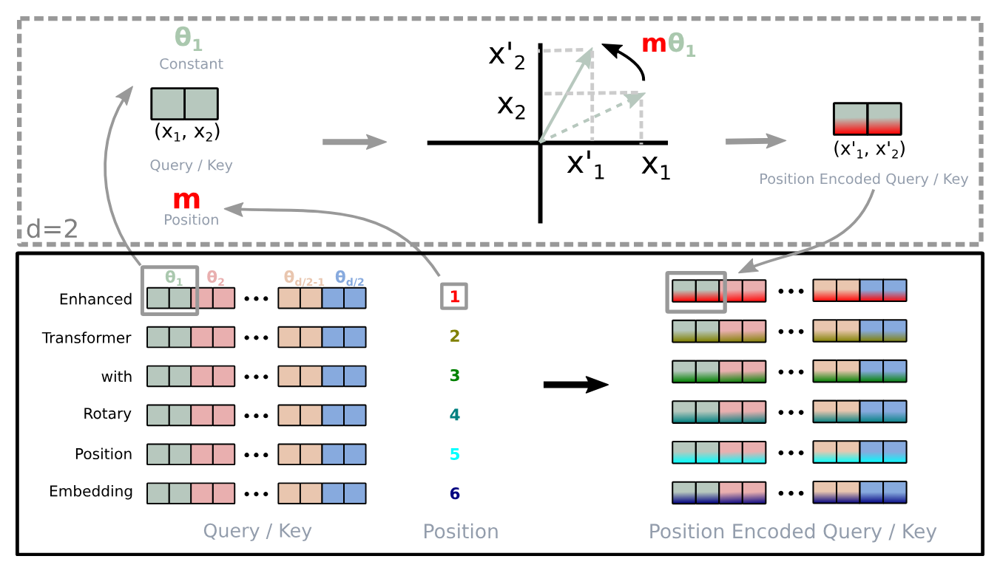
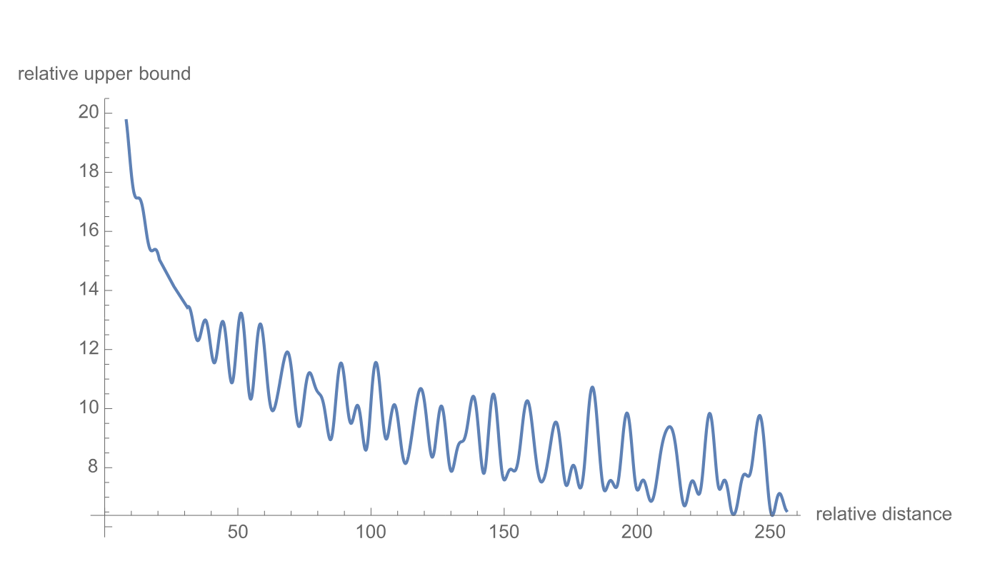
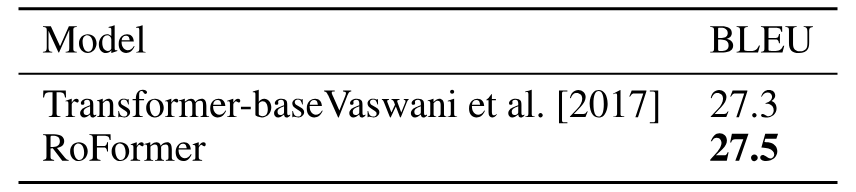
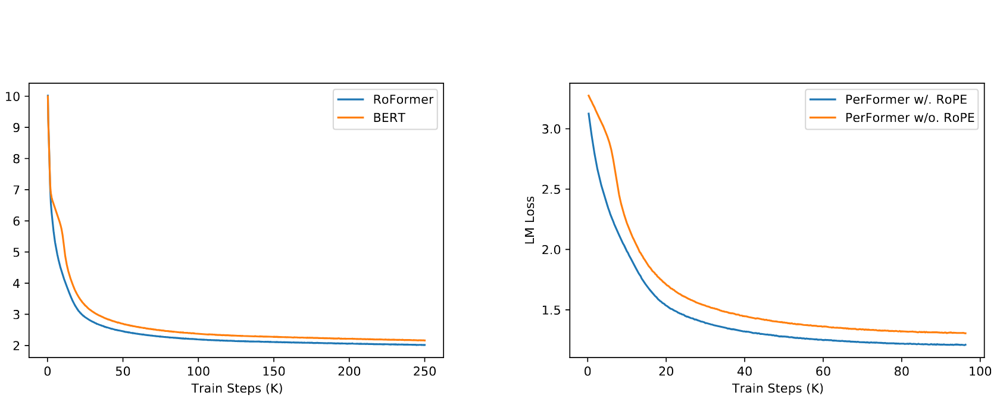
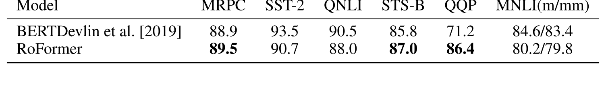
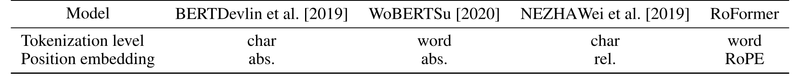
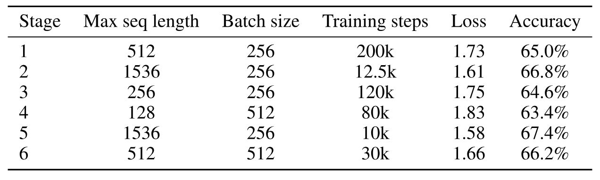
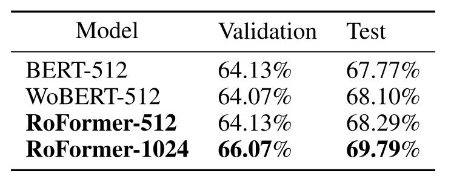

> [Jianlin Su](https://spaces.ac.cn/), [Yu Lu](https://dblp.org/pid/09/2321.html), [Shengfeng Pan](https://dblp.org/pid/249/7590.html), [Ahmed Murtadha](https://dblp.org/pid/208/0019.html), [Bo Wen](https://dblp.org/pid/00/2490.html) 和 [Yunfeng Liu](https://dblp.org/pid/56/5650.html). 论文于 2021 年 4 月 20 日首次提交至 arXiv; 当前版本为 v5. 发表于 *Neurocomputing* 第 568 卷 (2024), 文章编号 127063. [RoFormer: Enhanced Transformer with Rotary Position Embedding](https://arxiv.org/abs/2104.09864v5). [原论文 PDF](/paper/roformer.pdf). [DOI](https://doi.org/10.1016/j.neucom.2023.127063). [TeX 源码](https://export.arxiv.org/e-print/2104.09864v5). 精确的印刷版式和参考文献以原论文 PDF 为准.

## 摘要

近来, 位置编码在 Transformer 架构中展现出良好效果. 它为序列中不同位置元素之间的依赖建模提供了有价值的监督. 本文首先考察了多种将位置信息融入基于 Transformer 的语言模型学习过程的方法. 随后, 我们提出一种名为旋转位置嵌入 (Rotary Position Embedding, RoPE) 的新方法, 以有效利用位置信息. 具体而言, RoPE 用旋转矩阵编码绝对位置, 同时在自注意力公式中引入显式的相对位置依赖. 值得注意的是, RoPE 具有多项实用性质, 包括序列长度的灵活性、词元间依赖随相对距离增大而衰减, 以及为线性自注意力引入相对位置编码的能力. 最后, 我们在多个长文本分类基准数据集上评估了采用旋转位置嵌入增强的 Transformer, 即 RoFormer. 实验表明, 它始终优于其他备选方法. 此外, 我们还给出理论分析, 解释部分实验结果. RoFormer 已集成至 Huggingface: [https://huggingface.co/docs/transformers/model_doc/roformer](https://huggingface.co/docs/transformers/model_doc/roformer).

**关键词:** 预训练语言模型; 位置信息编码; 预训练; 自然语言处理.

## 1 引言

词语的先后顺序对自然语言理解十分重要. 基于循环神经网络 (RRNs) 的模型沿时间维度递归计算隐藏状态, 从而编码词元的顺序. 基于卷积神经网络 (CNNs) 的模型 [Geh17] 通常被认为与位置无关, 但近期工作 [Isl20] 表明, 常用的填充操作可以隐式学习位置信息. 近来, 建立在 Transformer [Vas17] 之上的预训练语言模型 (PLMs) 已在多项自然语言处理 (NLP) 任务中取得当前最佳性能, 例如上下文表示学习 [Dev19]、机器翻译 [Vas17] 和语言建模 [Rad19]. 与基于 RNN 和 CNN 的模型不同, PLM 利用自注意力机制从语义上捕获给定语料的上下文表示. 因此, 与 RNN 相比, PLM 显著提升了并行能力; 与 CNN 相比, 它也增强了对更长词元间关系的建模能力 [+1].

需要注意的是, 现有 PLM 的自注意力架构已被证明与位置无关 [Yun20]. 基于这一结论, 人们提出了多种在学习过程中编码位置信息的方法. 一类方法把由预定义函数生成的绝对位置编码 [Vas17] 加到上下文表示上, 另一类则使用可训练的绝对位置编码 [Geh17, Dev19, Lan20, Cla20, Rad19, Rad18]. 另一方面, 既有工作 [Par16, Sha18d, Hua18a, Dai19, Yan19, Raf20, Ke20, He20, Hua20a] 关注相对位置编码, 通常把相对位置信息编码进注意力机制. 除此之外, [Liu20] 从神经 ODE [Che18g] 的角度对位置编码的依赖关系建模, [Wan20f] 则在复数空间中建模位置信息. 尽管这些方法行之有效, 它们通常都把位置信息加到上下文表示上, 因而不适用于线性自注意力架构.

本文提出一种名为旋转位置嵌入 (Rotary Position Embedding, RoPE) 的新方法, 用于在 PLM 的学习过程中利用位置信息. 具体而言, RoPE 用旋转矩阵编码绝对位置, 同时在自注意力公式中引入显式的相对位置依赖. RoPE 凭借多项实用性质优于现有方法, 包括序列长度的灵活性、词元间依赖随相对距离增大而衰减, 以及为线性自注意力引入相对位置编码的能力. 在多个长文本分类基准数据集上的实验结果表明, 采用旋转位置嵌入增强的 Transformer, 即 RoFormer, 相比基线方法表现更好, 由此验证了 RoPE 的有效性.

概括而言, 本文有以下三项贡献:

- 我们考察了现有相对位置编码方法, 发现它们大多建立在把位置编码加到上下文表示后再进行分解这一思路上. 我们提出一种名为旋转位置嵌入 (Rotary Position Embedding, RoPE) 的新方法, 用于在 PLM 的学习过程中利用位置信息. 其核心思想是让上下文表示乘以具有清晰理论解释的旋转矩阵, 从而编码相对位置.
- 我们研究了 RoPE 的性质, 并表明它会随相对距离增大而衰减, 这正是自然语言编码所需要的. 我们认为, 以往基于相对位置编码的方法与线性自注意力并不兼容.
- 我们在多个长文本基准数据集上评估了 RoFormer. 实验表明, 它始终比其他备选方法表现更好. 部分预训练语言模型实验可在 GitHub 获取: [https://github.com/ZhuiyiTechnology/roformer](https://github.com/ZhuiyiTechnology/roformer).

本文其余部分安排如下. 我们在[第 2 节](#section-2)中形式化描述自注意力架构中的位置编码问题, 并回顾既有工作. 随后, 我们在[第 3 节](#section-3)中介绍旋转位置编码 (RoPE) 并研究其性质. [第 4 节](#section-4)报告实验. 最后, [第 5 节](#section-5)总结全文.

## 2 背景与相关工作

### 2.1 预备知识

设 $\mathbb{S}_{N}=\{w_{i}\}_{i=1}^{N}$ 是由 $N$ 个输入词元组成的序列, 其中 $w_{i}$ 为第 $i$ 个元素. $\mathbb{S}_{N}$ 对应的词嵌入记为 $\mathbb{E}_{N}=\{{\boldsymbol{x}}_{i}\}_{i=1}^{N}$, 其中 ${\boldsymbol{x}}_{i}\in\mathbb{R}^{d}$ 是不含位置信息的词元 $w_{i}$ 的 $d$ 维词嵌入向量. 自注意力先把位置信息融入词嵌入, 再将其变换为查询、键和值表示.

$$
\begin{aligned}
{\boldsymbol{q}}_{m} & =f_{q}({\boldsymbol{x}}_{m},m) \\
{\boldsymbol{k}}_{n} & =f_{k}({\boldsymbol{x}}_{n},n) \\
{\boldsymbol{v}}_{n} & =f_{v}({\boldsymbol{x}}_{n},n),
\end{aligned}
$$

其中, ${\boldsymbol{q}}_{m},{\boldsymbol{k}}_{n}$ 和 ${\boldsymbol{v}}_{n}$ 分别通过 $f_{q},f_{k}$ 和 $f_{v}$ 融入第 $m$ 与第 $n$ 个位置. 随后用查询和值计算注意力权重, 输出则是对值表示的加权求和.

$$
\begin{aligned}
a_{m,n} & =\frac{\exp(\frac{{\boldsymbol{q}}_{m}^\top{\boldsymbol{k}}_{n}}{\sqrt{d}})}{\sum_{j=1}^{N}\exp(\frac{{\boldsymbol{q}}_{m}^\top{\boldsymbol{k}}_{j}}{\sqrt{d}})} \\
\mathbf{o}_{m} & =\sum_{n=1}^{N}a_{m,n}{\boldsymbol{v}}_{n}
\end{aligned}
$$

现有的 Transformer 位置编码方法主要关注如何选择合适的函数来构成[公式 1](#equation-01).

### 2.2 绝对位置嵌入

[公式 1](#equation-01)的一种典型选择是

$$
f_{t:t\in\{q,k,v\}}({\boldsymbol{x}}_{i},i):={\boldsymbol{W}}_{t:t\in\{q,k,v\}}({\boldsymbol{x}}_{i}+{\boldsymbol{p}}_{i}),
$$

其中, ${\boldsymbol{p}}_{i}\in\mathbb{R}^{d}$ 是一个取决于词元 ${\boldsymbol{x}}_{i}$ 位置的 $d$ 维向量. 既有工作 [Dev19, Lan20, Cla20, Rad19, Rad18] 引入了一组可训练向量 ${\boldsymbol{p}}_{i}\in\{{\boldsymbol{p}}_{t}\}_{t=1}^{L}$, 其中 $L$ 为最大序列长度. [Vas17] 则提出用正弦函数生成 ${\boldsymbol{p}}_{i}$.

$$
\begin{cases}{\boldsymbol{p}}_{i,2t}&=\sin(k/10000^{2t/d})\\
{\boldsymbol{p}}_{i,2t+1}&=\cos(k/10000^{2t/d})\end{cases}
$$

其中, ${\boldsymbol{p}}_{i,2t}$ 是 $d$ 维向量 ${\boldsymbol{p}}_{i}$ 的第 $2t$ 个元素. 下一节将从正弦函数的角度说明, 我们提出的 RoPE 与这一直觉相关. 不过, RoPE 并不把位置直接加到上下文表示上, 而是通过乘以正弦函数来融入相对位置信息.

### 2.3 相对位置嵌入

[Sha18d] 对[公式 1](#equation-01)采用了如下不同设置:

$$
\begin{aligned}
f_{q}({\boldsymbol{x}}_{m}):={\boldsymbol{W}}_{q}{\boldsymbol{x}}_{m} \\
f_{k}({\boldsymbol{x}}_{n},n):={\boldsymbol{W}}_{k}({\boldsymbol{x}}_{n}+\tilde{{\boldsymbol{p}}}^{k}_{r}) \\
f_{v}({\boldsymbol{x}}_{n},n):={\boldsymbol{W}}_{v}({\boldsymbol{x}}_{n}+\tilde{{\boldsymbol{p}}}^{v}_{r})
\end{aligned}
$$

其中, $\tilde{{\boldsymbol{p}}}^{k}_{r},\tilde{{\boldsymbol{p}}}^{v}_{r}\in\mathbb{R}^{d}$ 是可训练的相对位置嵌入. 注意, $r=\mathrm{clip}(m-n,r_{\min},r_{\max})$ 表示位置 $m$ 与 $n$ 之间的相对距离. 他们对相对距离进行截断, 所依据的假设是: 超过一定距离后, 精确的相对位置信息不再有用. 在保持[公式 3](#equation-03)形式的情况下, [Dai19] 提出将[公式 2](#equation-02)中的 ${\boldsymbol{q}}_{m}^\top{\boldsymbol{k}}_{n}$ 分解为

$$
{\boldsymbol{q}}_{m}^\top{\boldsymbol{k}}_{n}={\boldsymbol{x}}_{m}^\top{\boldsymbol{W}}_{q}^\top{\boldsymbol{W}}_{k}{\boldsymbol{x}}_{n}+{\boldsymbol{x}}_{m}^\top{\boldsymbol{W}}_{q}^\top{\boldsymbol{W}}_{k}{\boldsymbol{p}}_{n}+{\boldsymbol{p}}_{m}^\top{\boldsymbol{W}}_{q}^\top{\boldsymbol{W}}_{k}{\boldsymbol{x}}_{n}+{\boldsymbol{p}}_{m}^\top{\boldsymbol{W}}_{q}^\top{\boldsymbol{W}}_{k}{\boldsymbol{p}}_{n},
$$

其核心思想是用经过正弦编码的相对位置向量 $\tilde{{\boldsymbol{p}}}_{m-n}$ 替换绝对位置嵌入 ${\boldsymbol{p}}_{n}$, 并用两个与查询位置无关的可训练向量 $\mathbf{u}$ 和 $\mathbf{v}$ 替换第三、第四项中的绝对位置 ${\boldsymbol{p}}_{m}$. 此外, 对基于内容的键向量 ${\boldsymbol{x}}_{n}$ 和基于位置的键向量 ${\boldsymbol{p}}_{n}$ 分别使用不同的 ${\boldsymbol{W}}_{k}$, 记作 ${\boldsymbol{W}}_{k}$ 和 $\widetilde{{\boldsymbol{W}}}_{k}$, 得到:

$$
{\boldsymbol{q}}_{m}^\top{\boldsymbol{k}}_{n}={\boldsymbol{x}}_{m}^\top{\boldsymbol{W}}_{q}^\top{\boldsymbol{W}}_{k}{\boldsymbol{x}}_{n}+{\boldsymbol{x}}_{m}^\top{\boldsymbol{W}}_{q}^\top\widetilde{{\boldsymbol{W}}}_{k}\tilde{{\boldsymbol{p}}}_{m-n}+\mathbf{u}^\top{\boldsymbol{W}}_{q}^\top{\boldsymbol{W}}_{k}{\boldsymbol{x}}_{n}+\mathbf{v}^\top{\boldsymbol{W}}_{q}^\top\widetilde{{\boldsymbol{W}}}_{k}\tilde{{\boldsymbol{p}}}_{m-n}
$$

值得注意的是, 通过令 $f_{v}({\boldsymbol{x}}_{j}):={\boldsymbol{W}}_{v}{\boldsymbol{x}}_{j}$, 值项中的位置信息被移除. 后续工作 [Raf20, He20, Ke20, Hua20a] 沿用这一设置, 只把相对位置信息编码进注意力权重. 不过, [Raf20] 将[公式 6](#equation-06)改写为:

$$
{\boldsymbol{q}}_{m}^\top{\boldsymbol{k}}_{n}={\boldsymbol{x}}_{m}^\top{\boldsymbol{W}}_{q}^\top{\boldsymbol{W}}_{k}{\boldsymbol{x}}_{n}+b_{i,j}
$$

其中, $b_{i,j}$ 是可训练偏置. [Ke20] 研究了[公式 6](#equation-06)中间两项, 发现绝对位置与词语之间几乎没有相关性. [Raf20] 提出用不同的投影矩阵对一对词语或位置建模.

$$
{\boldsymbol{q}}_{m}^\top{\boldsymbol{k}}_{n}={\boldsymbol{x}}_{m}^\top{\boldsymbol{W}}_{q}^\top{\boldsymbol{W}}_{k}{\boldsymbol{x}}_{n}+{\boldsymbol{p}}_{m}^\top\mathbf{U}_{q}^\top\mathbf{U}_{k}{\boldsymbol{p}}_{n}+b_{i,j}
$$

[He20] 认为, 只有使用[公式 6](#equation-06)中间两项, 才能完整建模两个词元的相对位置. 因此, 绝对位置嵌入 ${\boldsymbol{p}}_{m}$ 和 ${\boldsymbol{p}}_{n}$ 被直接替换为相对位置嵌入 $\tilde{{\boldsymbol{p}}}_{m-n}$:

$$
{\boldsymbol{q}}_{m}^\top{\boldsymbol{k}}_{n}={\boldsymbol{x}}_{m}^\top{\boldsymbol{W}}_{q}^\top{\boldsymbol{W}}_{k}{\boldsymbol{x}}_{n}+{\boldsymbol{x}}_{m}^\top{\boldsymbol{W}}_{q}^\top{\boldsymbol{W}}_{k}\tilde{{\boldsymbol{p}}}_{m-n}+\tilde{{\boldsymbol{p}}}_{m-n}^\top{\boldsymbol{W}}_{q}^\top{\boldsymbol{W}}_{k}{\boldsymbol{x}}_{n}
$$

对四种相对位置嵌入变体的比较 [Rad18] 表明, 与[公式 10](#equation-10)相似的变体比其余三种更高效. 总体而言, 这些方法都试图在[公式 2](#equation-02)的自注意力设置下, 根据对[公式 3](#equation-03)的分解来修改[公式 6](#equation-06), 这一思路最初由 [Vas17] 提出. 它们通常直接把位置信息加到上下文表示上. 与之不同, 我们的方法旨在给定若干约束后从[公式 1](#equation-01)推导相对位置编码. 接下来我们将说明, 通过旋转上下文表示来融入相对位置信息, 可使推导出的方法更具可解释性.

## 3 所提方法

本节讨论所提出的旋转位置嵌入 (RoPE). 我们首先在[第 3.1 节](#section-3-1)中表述相对位置编码问题, 随后在[第 3.2 节](#section-3-2)中推导 RoPE, 并在[第 3.3 节](#section-3-3)中研究其性质.

### 3.1 问题表述

基于 Transformer 的语言模型通常通过自注意力机制利用各词元的位置信息. 从[公式 2](#equation-02)可以看出, ${\boldsymbol{q}}_{m}^\top{\boldsymbol{k}}_{n}$ 通常负责在不同位置的词元之间传递知识. 为融入相对位置信息, 我们要求查询 ${\boldsymbol{q}}_{m}$ 与键 ${\boldsymbol{k}}_{n}$ 的内积可由函数 $g$ 表示, 且该函数只以词嵌入 ${\boldsymbol{x}}_{m}$、${\boldsymbol{x}}_{n}$ 及其相对位置 $m-n$ 为输入变量. 换言之, 我们希望内积只以相对形式编码位置信息:

$$
\langle f_{q}({\boldsymbol{x}}_{m},m),f_{k}({\boldsymbol{x}}_{n},n)\rangle=g({\boldsymbol{x}}_{m},{\boldsymbol{x}}_{n},m-n).
$$

最终目标是找到一种等价的编码机制, 求出满足上述关系的函数 $f_{q}({\boldsymbol{x}}_{m},m)$ 和 $f_{k}({\boldsymbol{x}}_{n},n)$.

### 3.2 旋转位置嵌入

#### 3.2.1 二维情形

我们从维度 $d=2$ 的简单情形开始. 在这一设置下, 利用向量在二维平面上的几何性质及其复数形式, 可以证明 (详见[第 3.4.1 节](#section-3-4-1)) 我们在[公式 11](#equation-11)中提出的问题有如下解:

$$
\begin{aligned}
f_{q}({\boldsymbol{x}}_{m},m) & =({\boldsymbol{W}}_{q}{\boldsymbol{x}}_{m})e^{i m\theta} \\
f_{k}({\boldsymbol{x}}_{n},n) & =({\boldsymbol{W}}_{k}{\boldsymbol{x}}_{n})e^{i n\theta} \\
g({\boldsymbol{x}}_{m},{\boldsymbol{x}}_{n},m-n) & =\operatorname{Re}[({\boldsymbol{W}}_{q}{\boldsymbol{x}}_{m})({\boldsymbol{W}}_{k}{\boldsymbol{x}}_{n})^{*}e^{i(m-n)\theta}]
\end{aligned}
$$

其中, $\operatorname{Re}[\cdot]$ 表示复数的实部, $({\boldsymbol{W}}_{k}{\boldsymbol{x}}_{n})^{*}$ 表示 $({\boldsymbol{W}}_{k}{\boldsymbol{x}}_{n})$ 的共轭复数. $\theta\in\mathbb{R}$ 是预先设定的非零常数. 我们还可把 $f_{\{q,k\}}$ 写成矩阵乘法形式:

$$
f_{\{q,k\}}({\boldsymbol{x}}_{m},m)=\left(\begin{array}{cc}\cos{m\theta}&-\sin{m\theta}\\
\sin{m\theta}&\cos{m\theta}\end{array}\right)\left(\begin{array}{cc}W^{(11)}_{\{q,k\}}&W^{(12)}_{\{q,k\}}\\
W^{(21)}_{\{q,k\}}&W^{(22)}_{\{q,k\}}\end{array}\right)\left(\begin{array}{cc}x^{(1)}_{m}\\
x^{(2)}_{m}\end{array}\right)
$$

其中, $(x^{(1)}_{m},x^{(2)}_{m})$ 是 ${\boldsymbol{x}}_{m}$ 在二维坐标中的表示. 类似地, $g$ 也可视为一个矩阵, 从而在二维情形下给出[第 3.1 节](#section-3-1)所述问题的解. 具体而言, 融入相对位置嵌入十分直接: 只需把仿射变换后的词嵌入向量旋转一个角度, 该角度是其位置索引的倍数, 这也解释了*旋转位置嵌入*背后的直觉.

#### 3.2.2 一般形式

为把二维结果推广到任意 ${\boldsymbol{x}}_{i}\in\mathbb{R}^{d}$ 且 $d$ 为偶数的情形, 我们把 $d$ 维空间划分为 $d/2$ 个子空间, 再利用内积的线性性质将它们组合起来, 于是 $f_{\{q,k\}}$ 变为:

$$
f_{\{q,k\}}({\boldsymbol{x}}_{m},m)={\boldsymbol{R}}^{d}_{\Theta,m}{\boldsymbol{W}}_{\{q,k\}}{\boldsymbol{x}}_{m}
$$

其中

$$
{\boldsymbol{R}}^{d}_{\Theta,m}=\begin{pmatrix}\cos{m\theta_{1}}&-\sin{m\theta_{1}}&0&0&\cdots&0&0\\
\sin{m\theta_{1}}&\cos{m\theta_{1}}&0&0&\cdots&0&0\\
0&0&\cos{m\theta_{2}}&-\sin{m\theta_{2}}&\cdots&0&0\\
0&0&\sin{m\theta_{2}}&\cos{m\theta_{2}}&\cdots&0&0\\
\vdots&\vdots&\vdots&\vdots&\ddots&\vdots&\vdots\\
0&0&0&0&\cdots&\cos{m\theta_{d/2}}&-\sin{m\theta_{d/2}}\\
0&0&0&0&\cdots&\sin{m\theta_{d/2}}&\cos{m\theta_{d/2}}\end{pmatrix}
$$

这是一个旋转矩阵, 预定义参数为 $\Theta=\{\theta_{i}=10000^{-2(i-1)/d},i\in[1,2,...,d/2]\}$. RoPE 的图示见[图 1](#figure-01). 将 RoPE 应用于[公式 2](#equation-02)中的自注意力, 得到:

$$
{\boldsymbol{q}}_{m}^\top{\boldsymbol{k}}_{n}=({\boldsymbol{R}}^{d}_{\Theta,m}{\boldsymbol{W}}_{q}{\boldsymbol{x}}_{m})^\top({\boldsymbol{R}}^{d}_{\Theta,n}{\boldsymbol{W}}_{k}{\boldsymbol{x}}_{n})={\boldsymbol{x}}^\top{\boldsymbol{W}}_{q}R^{d}_{\Theta,n-m}{\boldsymbol{W}}_{k}{\boldsymbol{x}}_{n}
$$

其中, ${\boldsymbol{R}}^{d}_{\Theta,n-m}=({\boldsymbol{R}}^{d}_{\Theta,m})^\top{\boldsymbol{R}}^{d}_{\Theta,n}$. 注意, ${\boldsymbol{R}}^{d}_{\Theta}$ 是正交矩阵, 可保证位置编码过程的稳定性. 此外, 由于 $R^{d}_{\Theta}$ 具有稀疏性, 直接按[公式 16](#equation-16)进行矩阵乘法在计算上并不高效; 我们将在理论解释中给出另一种实现.

不同于既有工作所采用的位置嵌入加法形式, 即[公式 3](#equation-03)、[4](#equation-04)、[5](#equation-05)、[6](#equation-06)、[7](#equation-07)、[8](#equation-08)、[9](#equation-09)和[10](#equation-10), 我们的方法采用乘法形式. 此外, RoPE 通过旋转矩阵乘积自然融入相对位置信息, 而不是在应用自注意力时修改加法位置编码展开式中的各项.

**图 1.** 旋转位置嵌入 (RoPE) 的实现.

### 3.3 RoPE 的性质

**长期衰减:** 按照 [Vas17] 的做法, 我们令 $\theta_{i}=10000^{-2i/d}$. 可以证明, 这一设置具有长期衰减性质 (详见[第 3.4.3 节](#section-3-4-3)), 即内积会随相对位置增大而衰减. 这一性质符合如下直觉: 相对距离较远的一对词元, 其联系应当更弱.

**RoPE 与线性注意力:** 自注意力可以改写为更一般的形式.

$$
\mathrm{Attention}(\mathbf{Q},\mathbf{K},\mathbf{V})_{m}=\frac{\sum_{n=1}^{N}\operatorname{sim}({\boldsymbol{q}}_{m},{\boldsymbol{k}}_{n}){\boldsymbol{v}}_{n}}{\sum_{n=1}^{N}\operatorname{sim}({\boldsymbol{q}}_{m},{\boldsymbol{k}}_{n})}.
$$

原始自注意力取 $\operatorname{sim}({\boldsymbol{q}}_{m},{\boldsymbol{k}}_{n})=\exp({\boldsymbol{q}}_{m}^\top{\boldsymbol{k}}_{n}/\sqrt{d})$. 注意, 原始自注意力需要对每一对词元计算查询与键的内积, 其复杂度为二次的 $O(N^{2})$. 按照 [Kat20] 的做法, 线性注意力将[公式 17](#equation-17)改写为

$$
\mathrm{Attention}({\boldsymbol{Q}},{\boldsymbol{K}},{\boldsymbol{V}})_{m}=\frac{\sum_{n=1}^{N}\phi({\boldsymbol{q}}_{m})^\top\varphi({\boldsymbol{k}}_{n}){\boldsymbol{v}}_{n}}{\sum_{n=1}^{N}\phi({\boldsymbol{q}}_{m})^\top\varphi({\boldsymbol{k}}_{n})},
$$

其中, $\phi(\cdot),\varphi(\cdot)$ 通常是非负函数. [Kat20] 提出 $\phi(x)=\varphi(x)=\operatorname{elu}(x)+1$, 并利用矩阵乘法的结合律, 先计算键与值的乘积. [She21] 在求内积之前, 用 softmax 函数分别归一化查询和键, 这等价于 $\phi({\boldsymbol{q}}_{i})=\mathrm{softmax}({\boldsymbol{q}}_{i})$ 和 $\phi({\boldsymbol{k}}_{j})=\exp({\boldsymbol{k}}_{j})$. 关于线性注意力的更多细节, 建议读者参阅原论文. 本节重点讨论如何把 RoPE 融入[公式 18](#equation-18). 由于 RoPE 通过旋转注入位置信息, 不会改变隐藏表示的范数, 因此可让旋转矩阵与非负函数的输出相乘, 从而把 RoPE 与线性注意力结合起来.

$$
\mathrm{Attention}(\mathbf{Q},\mathbf{K},\mathbf{V})_{m}=\frac{\sum_{n=1}^{N}\big({\boldsymbol{R}}^{d}_{\Theta,m}\phi({\boldsymbol{q}}_{m})\big)^\top\big({\boldsymbol{R}}^{d}_{\Theta,n}\varphi({\boldsymbol{k}}_{n})\big){\boldsymbol{v}}_{n}}{\sum_{n=1}^{N}\phi({\boldsymbol{q}}_{m})^\top\varphi({\boldsymbol{k}}_{n})}.
$$

值得注意的是, 我们保持分母不变, 以避免除以零的风险, 而分子中的求和可能包含负项. 尽管[公式 19](#equation-19)中每个值 ${\boldsymbol{v}}_{i}$ 的权重并未在严格的概率意义上归一化, 我们认为这一计算仍能刻画各个值的重要性.

### 3.4 理论解释

#### 3.4.1 二维情形下 RoPE 的推导

在 $d=2$ 的情形下, 考虑分别对应查询和键的两个词嵌入向量 ${\boldsymbol{x}}_{q}$、${\boldsymbol{x}}_{k}$, 它们的位置分别为 $m$ 和 $n$. 根据[公式 1](#equation-01), 经过位置编码后对应的向量为:

$$
\begin{aligned}
{\boldsymbol{q}}_{m} & =f_{q}({\boldsymbol{x}}_{q},m), \\
{\boldsymbol{k}}_{n} & =f_{k}({\boldsymbol{x}}_{k},n),
\end{aligned}
$$

其中, ${\boldsymbol{q}}_{m}$ 和 ${\boldsymbol{k}}_{n}$ 的下标表示所编码的位置信息. 假设存在函数 $g$, 用于定义 $f_{\{q,k\}}$ 所生成向量之间的内积:

$$
{\boldsymbol{q}}^\top_{m}{\boldsymbol{k}}_{n}=\langle f_{q}({\boldsymbol{x}}_{m},m),f_{k}({\boldsymbol{x}}_{n},n)\rangle=g({\boldsymbol{x}}_{m},{\boldsymbol{x}}_{n},n-m),
$$

我们还要求满足如下初始条件:

$$
\begin{aligned}
{\boldsymbol{q}} & =f_{q}({\boldsymbol{x}}_{q},0), \\
{\boldsymbol{k}} & =f_{k}({\boldsymbol{x}}_{k},0),
\end{aligned}
$$

它们可以理解为尚未编码位置信息的向量. 在这些设置下, 我们尝试求出 $f_{q}$ 和 $f_{k}$ 的解. 首先, 利用向量在二维空间中的几何意义及其复数对应形式, 将[公式 20](#equation-20)和[21](#equation-21)中的函数分解为:

$$
\begin{aligned}
f_{q}({\boldsymbol{x}}_{q},m) & =R_{q}({\boldsymbol{x}}_{q},m)e^{i\Theta_{q}({\boldsymbol{x}}_{q},m)}, \\
f_{k}({\boldsymbol{x}}_{k},n) & =R_{k}({\boldsymbol{x}}_{k},n)e^{i\Theta_{k}({\boldsymbol{x}}_{k},n)}, \\
g({\boldsymbol{x}}_{q},{\boldsymbol{x}}_{k},n-m) & =R_{g}({\boldsymbol{x}}_{q},{\boldsymbol{x}}_{k},n-m)e^{i\Theta_{g}({\boldsymbol{x}}_{q},{\boldsymbol{x}}_{k},n-m)},
\end{aligned}
$$

其中, $R_{f}$、$R_{g}$ 和 $\Theta_{f}$、$\Theta_{g}$ 分别是 $f_{\{q,k\}}$ 与 $g$ 的径向分量和角向分量. 将它们代入[公式 21](#equation-21), 得到关系:

$$
\begin{aligned}
R_{q}({\boldsymbol{x}}_{q},m)R_{k}({\boldsymbol{x}}_{k},n) & =R_{g}({\boldsymbol{x}}_{q},{\boldsymbol{x}}_{k},n-m), \\
\Theta_{k}({\boldsymbol{x}}_{k},n)-\Theta_{q}({\boldsymbol{x}}_{q},m) & =\Theta_{g}({\boldsymbol{x}}_{q},{\boldsymbol{x}}_{k},n-m),
\end{aligned}
$$

相应的初始条件为:

$$
\begin{aligned}
{\boldsymbol{q}} & =\|{\boldsymbol{q}}\|e^{i\theta_{q}}=R_{q}({\boldsymbol{x}}_{q},0)e^{i\Theta_{q}({\boldsymbol{x}}_{q},0)}, \\
{\boldsymbol{k}} & =\|{\boldsymbol{k}}\|e^{i\theta_{k}}=R_{k}({\boldsymbol{x}}_{k},0)e^{i\Theta_{k}({\boldsymbol{x}}_{k},0)},
\end{aligned}
$$

其中, $\|{\boldsymbol{q}}\|$、$\|{\boldsymbol{k}}\|$ 和 $\theta_{q}$、$\theta_{k}$ 分别是 ${\boldsymbol{q}}$ 与 ${\boldsymbol{k}}$ 在二维平面上的径向分量和角向分量.

接下来, 在[公式 24](#equation-24)中令 $m=n$, 并考虑[公式 25](#equation-25)中的初始条件:

$$
\begin{aligned}
R_{q}({\boldsymbol{x}}_{q},m)R_{k}({\boldsymbol{x}}_{k},m) & =R_{g}({\boldsymbol{x}}_{q},{\boldsymbol{x}}_{k},0)=R_{q}({\boldsymbol{x}}_{q},0)R_{k}({\boldsymbol{x}}_{k},0)=\|{\boldsymbol{q}}\|\|{\boldsymbol{k}}\|, \\
\Theta_{k}({\boldsymbol{x}}_{k},m)-\Theta_{q}({\boldsymbol{x}}_{q},m) & =\Theta_{g}({\boldsymbol{x}}_{q},{\boldsymbol{x}}_{k},0)=\Theta_{k}({\boldsymbol{x}}_{k},0)-\Theta_{q}({\boldsymbol{x}}_{q},0)=\theta_{k}-\theta_{q}.
\end{aligned}
$$

一方面, 由[公式 26a](#equation-26)可直接构造 $R_{f}$ 的一个解:

$$
\begin{aligned}
R_{q}({\boldsymbol{x}}_{q},m) & =R_{q}({\boldsymbol{x}}_{q},0)=\|{\boldsymbol{q}}\| \\
R_{k}({\boldsymbol{x}}_{k},n) & =R_{k}({\boldsymbol{x}}_{k},0)=\|{\boldsymbol{k}}\| \\
R_{g}({\boldsymbol{x}}_{q},{\boldsymbol{x}}_{k},n-m) & =R_{g}({\boldsymbol{x}}_{q},{\boldsymbol{x}}_{k},0)=\|{\boldsymbol{q}}\|\|{\boldsymbol{k}}\|
\end{aligned}
$$

这说明径向函数 $R_{q}$、$R_{k}$ 和 $R_{g}$ 与位置信息无关. 另一方面, 从[公式 26b](#equation-26)可以看出, $\Theta_{q}({\boldsymbol{x}}_{q},m)-\theta_{q}=\Theta_{k}({\boldsymbol{x}}_{k},m)-\theta_{k}$ 表明角向函数不依赖查询和键, 因此令 $\Theta_{f}:=\Theta_{q}=\Theta_{k}$; 项 $\Theta_{f}({\boldsymbol{x}}_{\{q,k\}},m)-\theta_{\{q,k\}}$ 是位置 $m$ 的函数, 且与词嵌入 ${\boldsymbol{x}}_{\{q,k\}}$ 无关, 将其记为 $\phi(m)$, 得到:

$$
\Theta_{f}({\boldsymbol{x}}_{\{q,k\}},m)=\phi(m)+\theta_{\{q,k\}},
$$

进一步地, 将 $n=m+1$ 代入[公式 24](#equation-24), 并结合上式, 可得:

$$
\phi(m+1)-\phi(m)=\Theta_{g}({\boldsymbol{x}}_{q},{\boldsymbol{x}}_{k},1)+\theta_{q}-\theta_{k},
$$

由于右侧是与 $m$ 无关的常数, 对连续整数输入而言, $\phi(m)$ 构成等差数列:

$$
\phi(m)=m\theta+\gamma,
$$

其中, $\theta,\gamma\in\mathbb{R}$ 为常数, 且 $\theta$ 非零. 综合[公式 27](#equation-27)、[28](#equation-28)、[29](#equation-29)和[30](#equation-30)中的解:

$$
\begin{aligned}
f_{q}({\boldsymbol{x}}_{q},m) & =\|{\boldsymbol{q}}\|e^{i\theta_{q}+m\theta+\gamma}={\boldsymbol{q}}e^{i(m\theta+\gamma)}, \\
f_{k}({\boldsymbol{x}}_{k},n) & =\|{\boldsymbol{k}}\|e^{i\theta_{k}+n\theta+\gamma}={\boldsymbol{k}}e^{i(n\theta+\gamma)}.
\end{aligned}
$$

注意, 我们没有对[公式 22](#equation-22)中的 $f_{q}$ 和 $f_{k}$ 施加任何约束, 因此 $f_{q}({\boldsymbol{x}}_{m},0)$ 和 $f_{k}({\boldsymbol{x}}_{n},0)$ 可自由选择. 为使结果与[公式 3](#equation-03)可比, 定义:

$$
\begin{aligned}
{\boldsymbol{q}}=f_{q}({\boldsymbol{x}}_{m},0) & ={\boldsymbol{W}}_{q}{\boldsymbol{x}}_{n}, \\
{\boldsymbol{k}}=f_{k}({\boldsymbol{x}}_{n},0) & ={\boldsymbol{W}}_{k}{\boldsymbol{x}}_{n}.
\end{aligned}
$$

随后, 在[公式 31](#equation-31)的最终解中直接令 $\gamma=0$:

$$
\begin{aligned}
f_{q}({\boldsymbol{x}}_{m},m) & =({\boldsymbol{W}}_{q}{\boldsymbol{x}}_{m})e^{i m\theta}, \\
f_{k}({\boldsymbol{x}}_{n},n) & =({\boldsymbol{W}}_{k}{\boldsymbol{x}}_{n})e^{i n\theta}.
\end{aligned}
$$

#### 3.4.2 旋转矩阵乘法的高效计算实现

利用[公式 15](#equation-15)中 ${\boldsymbol{R}}^{d}_{\Theta,m}$ 的稀疏性, $R^{d}_{\Theta}$ 与 ${\boldsymbol{x}}\in\mathbb{R}^{d}$ 的乘法可以更高效地实现为:

$$
{\boldsymbol{R}}^{d}_{\Theta,m}{\boldsymbol{x}}=\begin{pmatrix}x_{1}\\
x_{2}\\
x_{3}\\
x_{4}\\
\vdots\\
x_{d-1}\\
x_{d}\end{pmatrix}\otimes\begin{pmatrix}\cos{m\theta_{1}}\\
\cos{m\theta_{1}}\\
\cos{m\theta_{2}}\\
\cos{m\theta_{2}}\\
\vdots\\
\cos{m\theta_{d/2}}\\
\cos{m\theta_{d/2}}\end{pmatrix}+\begin{pmatrix}-x_{2}\\
x_{1}\\
-x_{4}\\
x_{3}\\
\vdots\\
-x_{d}\\
x_{d-1}\end{pmatrix}\otimes\begin{pmatrix}\sin{m\theta_{1}}\\
\sin{m\theta_{1}}\\
\sin{m\theta_{2}}\\
\sin{m\theta_{2}}\\
\vdots\\
\sin{m\theta_{d/2}}\\
\sin{m\theta_{d/2}}\end{pmatrix}
$$

#### 3.4.3 RoPE 的长期衰减

可以把向量 ${\boldsymbol{q}}={\boldsymbol{W}}_{q}{\boldsymbol{x}}_{m}$ 和 ${\boldsymbol{k}}={\boldsymbol{W}}_{k}{\boldsymbol{x}}_{n}$ 的分量两两分组, 此时[公式 16](#equation-16)中的 RoPE 内积可写成复数乘法.

$$
({\boldsymbol{R}}^{d}_{\Theta,m}{\boldsymbol{W}}_{q}{\boldsymbol{x}}_{m})^\top({\boldsymbol{R}}^{d}_{\Theta,n}{\boldsymbol{W}}_{k}{\boldsymbol{x}}_{n})=\operatorname{Re}\bigg[\sum_{i=0}^{d/2-1}{\boldsymbol{q}}_{[2i:2i+1]}{\boldsymbol{k}}_{[2i:2i+1]}^{*}e^{i(m-n)\theta_{i}}\bigg]
$$

其中, ${\boldsymbol{q}}_{[2i:2i+1]}$ 表示 ${\boldsymbol{q}}$ 的第 $2i$ 至第 $(2i+1)$ 个分量. 记 $h_{i}={\boldsymbol{q}}_{[2i:2i+1]}{\boldsymbol{k}}_{[2i:2i+1]}^{*}$ 和 $S_{j}=\sum_{i=0}^{j-1}e^{i(m-n)\theta_{i}}$, 并令 $h_{d/2}=0$、$S_{0}=0$, 可用 Abel 变换将求和改写为

$$
\sum_{i=0}^{d/2-1}{\boldsymbol{q}}_{[2i:2i+1]}{\boldsymbol{k}}_{[2i:2i+1]}^{*}e^{i(m-n)\theta_{i}}=\sum_{i=0}^{d/2-1}h_{i}(S_{i+1}-S_{i})=-\sum_{i=0}^{d/2-1}S_{i+1}(h_{i+1}-h_{i}).
$$

因此,

$$
\begin{aligned}
\bigg|\sum_{i=0}^{d/2-1}{\boldsymbol{q}}_{[2i:2i+1]}{\boldsymbol{k}}_{[2i:2i+1]}^{*}e^{i(m-n)\theta_{i}}\bigg| & =\bigg|\sum_{i=0}^{d/2-1}S_{i+1}(h_{i+1}-h_{i})\bigg| \\
\leq\sum_{i=0}^{d/2-1}|S_{i+1}|\,|h_{i+1}-h_{i}| \\
\leq\big(\max_{i}|h_{i+1}-h_{i}|\big)\sum_{i=0}^{d/2-1}|S_{i+1}|
\end{aligned}
$$

注意, 令 $\theta_{i}=10000^{-2i/d}$ 后, $\frac{1}{d/2}\sum_{i=1}^{d/2}|S_{i}|$ 的值会随相对距离 $m-n$ 增大而衰减, 如[图 2](#figure-02) 所示.

**图 2.** RoPE 的长期衰减.

## 4 实验与评估

我们在多项 NLP 任务上评估所提出的 RoFormer. [第 4.1 节](#section-4-1)在机器翻译任务上验证所提方案的性能. 随后, [第 4.2 节](#section-4-2)在预训练阶段比较我们的 RoPE 实现与 BERT [Dev19]. 基于预训练模型, [第 4.3 节](#section-4-3)进一步在 GLUE 基准 [Wan18d] 的不同下游任务上进行评估. 此外, [第 4.4 节](#section-4-4)把所提出的 RoPE 与 PerFormer [Cho20a] 的线性注意力结合并开展实验. 最后, [第 4.5 节](#section-4-5)给出在中文数据上的补充测试. 所有实验均在两台各配有 4 块 V100 GPU 的云服务器上运行.

### 4.1 机器翻译

我们首先展示 RoFormer 在序列到序列语言翻译任务上的性能.

#### 4.1.1 实验设置

我们选用标准 WMT 2014 英德数据集 [Boj14], 其中约含 450 万个句对. 我们将其与基于 Transformer 的基线方法 [Vas17] 进行比较.

#### 4.1.2 实现细节

我们对基线模型 [Vas17] 的自注意力层做了若干修改, 使 RoPE 能够进入其学习过程. 我们复现英译德设置, 基于源语言与目标语言联合字节对编码 (BPE) [Sen15], 词表大小为 37k. 评估时, 通过平均最后 5 个检查点得到单一模型. 结果采用束宽为 4、长度惩罚为 0.6 的束搜索. 我们使用 fairseq 工具包 (MIT License) [Ott19a], 在 PyTorch 中实现实验. 模型使用 Adam 优化器, 其中 $\beta_{1}=0.9$、$\beta_{2}=0.98$; 学习率从 $1e-7$ 线性增至 $5e-4$, 随后按步数平方根的倒数成比例衰减. 同时采用 0.1 的标签平滑. 最终指标为测试集上的 BLEU [Pap02] 分数.

#### 4.1.3 结果

我们在相同设置下训练基线模型与 RoFormer, 并在[表 1](#table-01) 中报告结果. 可以看出, 与基线 Transformer 相比, 我们的模型取得了更高的 BLEU 分数.

**表 1.** 在 WMT 2014 英译德任务 [Boj14] 上, 所提出的 RoFormer 比基线方法 [Vas17] 取得了更高的 BLEU 分数.

### 4.2 预训练语言建模

第二项实验验证所提方法在学习上下文表示方面的性能. 为此, 我们在预训练阶段用 RoPE 替换 BERT 原有的正弦位置编码.

#### 4.2.1 实验设置

我们使用 Huggingface Datasets 库 (Apache License 2.0) 中的 BookCorpus [Zhu15] 和 Wikipedia Corpus [Wik21] 进行预训练. 语料进一步按 8:2 划分为训练集与验证集. 我们以训练过程中的掩码语言建模 (MLM) 损失值作为评估指标. 基线模型采用广为人知的 BERT [Dev19]. 注意, 实验中使用的是 bert-base-uncased.

#### 4.2.2 实现细节

对于 RoFormer, 我们用所提出的 RoPE 替换基线模型自注意力块中的正弦位置编码, 并按照[公式 16](#equation-16)实现自注意力. BERT 与 RoFormer 均训练 100k 步, 批大小为 64, 最大序列长度为 512. 优化器采用 AdamW [Los17], 学习率为 1e-5.

#### 4.2.3 结果

预训练期间的 MLM 损失见[图 3](#figure-03) 左图. 与原始 BERT 相比, RoFormer 收敛得更快.

**图 3.** 语言建模预训练中的 RoPE 评估. **左:** BERT 与 RoFormer 的训练损失. **右:** 使用和不使用 RoPE 时 PerFormer 的训练损失.

### 4.3 在 GLUE 任务上微调

与前述实验一致, 我们在多项 GLUE 任务上微调预训练 RoFormer 的权重, 以评估它在下游 NLP 任务上的泛化能力.

#### 4.3.1 实验设置

我们选取 GLUE 中的若干数据集, 即 MRPC [Dol05]、SST-2 [Soc13]、QNLI [Raj16]、STS-B [Aln17]、QQP [Che18h] 和 MNLI [Wil18]. MRPC 与 QQP 采用 F1 分数, STS-B 采用 Spearman 相关系数, 其余任务采用准确率作为评估指标.

#### 4.3.2 实现细节

我们使用 Huggingface Transformers 库 (Apache License 2.0) [Wol20], 在上述每项下游任务上微调 3 个 epoch, 最大序列长度为 512, 批大小为 32, 学习率取 {2,3,4,5}e-5. 按照 [Dev19] 的做法, 我们报告验证集上的最佳平均结果.

**表 2.** 通过下游 GLEU 任务微调比较 RoFormer 与 BERT.

#### 4.3.3 结果

微调任务的评估结果见[表 2](#table-02). 可以看出, RoFormer 在 6 个数据集中的 3 个上显著优于 BERT, 提升幅度可观.

### 4.4 结合 RoPE 的 Performer

Performer [Cho20a] 引入了另一种注意力机制, 即线性注意力, 旨在避免随输入序列长度增长的二次计算成本. 如[第 3.3 节](#section-3-3)所述, 所提出的 RoPE 可轻松用于 PerFormer 模型, 在保持自注意力复杂度线性增长的同时实现相对位置编码. 我们通过语言建模预训练任务展示其性能.

#### 4.4.1 实现细节

我们在 Enwik8 数据集 [Mah06] 上进行测试. 该数据集来自英语 Wikipedia, 除英语文本外还包含标记、特殊字符和其他语言的文本. 我们把 RoPE 融入一个基于字符的 12 层 PerFormer, 其维度为 768, 注意力头数为 12 [+2]. 为更清楚地展示 RoPE 的效果, 我们报告相同设置下使用和不使用 RoPE 时预训练过程的损失曲线, 设置包括学习率 1e-4、批大小 128、固定最大序列长度 1024 等.

#### 4.4.2 结果

如[图 3](#figure-03) 右图所示, 在相同训练步数下, 把 RoPE 加入 Performer 可带来更快的收敛和更低的损失. 除线性复杂度外, 这些改进也让 Performer 更具吸引力.

### 4.5 中文数据评估

除英语数据实验外, 我们还给出中文数据上的补充结果. 为验证 RoFormer 在长文本上的性能, 我们在长度超过 512 个字符的长文档上开展实验.

#### 4.5.1 实现

在这些实验中, 我们修改了 WoBERT [Su20], 用所提出的 RoPE 替换其绝对位置嵌入. 为与其他基于 Transformer 的中文预训练模型交叉比较, 即 BERT [Dev19]、WoBERT [Su20] 和 NEZHA [Wei19], 我们在[表 3](#table-03) 中列出它们的分词粒度和位置嵌入信息.

**表 3.** RoFormer 与其他中文预训练模型的交叉比较. 'abs' 和 'rel' 分别表示绝对位置嵌入与相对位置嵌入.

#### 4.5.2 预训练

我们使用约 34GB 的数据预训练 RoFormer, 数据收集自中文 Wikipedia、新闻和论坛. 预训练分多个阶段进行, 各阶段改变批大小和最大输入序列长度, 以使模型适应不同场景. 如[表 4](#table-04) 所示, RoFormer 的准确率随序列长度上限提高而上升, 这体现了 RoFormer 处理长文本的能力. 我们认为, 这得益于所提出 RoPE 出色的泛化能力.

**表 4.** RoFormer 在中文数据集上的预训练策略. 训练过程分为多个连续阶段. 每个阶段都使用特定的最大序列长度与批大小组合训练模型.

#### 4.5.3 下游任务与数据集

我们选用中国人工智能与法律挑战赛 2019 相似案例匹配数据集 (CAIL2019-SCM) [Xia19a], 展示 RoFormer 处理长文本, 即语义文本匹配的能力. CAIL2019-SCM 包含中国最高人民法院公布的 8964 个案例三元组. 输入三元组记为 (A, B, C), 分别是三个案例的事实描述. 任务是在预定义相似度度量下, 预测 (A, B) 是否比 (A, C) 更相近. 需要注意的是, 由于文档较长 (多数超过 512 个字符), 现有方法大多无法在 CAIL2019-SCM 数据集上取得显著表现. 我们按常用的 6:2:2 比例划分训练集、验证集和测试集.

#### 4.5.4 结果

我们把预训练 RoFormer 模型应用于不同输入长度的 CAIL2019-SCM. 如[表 5](#table-05) 所示, 该模型与使用相同预训练数据的预训练 BERT 和 WoBERT 模型进行比较. 当短文本截断长度为 512 时, RoFormer 的结果与 WoBERT 相当, 并略优于 BERT 实现. 但当最大输入文本长度增至 1024 时, RoFormer 比 WoBERT 绝对提升 1.5%.

**表 5.** CAIL2019-SCM 任务的实验结果. 第一列数字表示最大截断序列长度. 结果以准确率百分比表示.

#### 4.5.5 工作局限

尽管我们给出了理论依据和颇有希望的实验佐证, 但本方法仍受以下事实限制:

- 尽管我们在数学上把相对位置关系表示为二维子空间中的旋转, 但仍缺少充分解释, 说明它为何比采用其他位置编码策略的基线模型收敛得更快.
- 尽管我们已证明模型的词元间乘积具有良好的长期衰减性质, 见[第 3.3 节](#section-3-3), 这一点与现有位置编码机制相似; 然而模型在长文本上的表现优于同类模型, 对此我们尚未给出令人信服的解释.

所提出的 RoFormer 建立在基于 Transformer 的基础架构之上, 因而预训练需要硬件资源.

## 5 结论

本文提出一种新的位置嵌入方法, 在自注意力中引入显式的相对位置依赖, 以提升 Transformer 架构的性能. 理论分析表明, 相对位置可以通过自注意力中的向量乘积自然表示, 绝对位置信息则由旋转矩阵编码. 此外, 我们从数学上说明了所提方法应用于 Transformer 时所具有的有利性质. 最后, 英文与中文基准数据集上的实验表明, 本方法能促使预训练更快收敛. 实验结果还表明, 所提出的 RoFormer 在长文本任务上可以取得更好的性能.

[+1]: 堆叠多个 CNN 层同样可以捕获更长的词元间关系, 此处只考虑单层设置.

[+2]: 本实验采用了 [https://github.com/lucidrains/performer-pytorch](https://github.com/lucidrains/performer-pytorch) 中的代码 (MIT License).
