> [Bowen Jin](https://scholar.google.com/citations?user=dMwdOPkAAAAJ), [Hansi Zeng](https://scholar.google.com/citations?user=a7O1D6oAAAAJ), [Zhenrui Yue](https://scholar.google.com/citations?user=9Iy_KmsAAAAJ), [Jinsung Yoon](https://scholar.google.com/citations?user=kiFd6A8AAAAJ), [Sercan Ö. Arık](https://scholar.google.com/citations?user=-EZBCBAAAAAJ), [Dong Wang](https://scholar.google.com/citations?user=-NfMhb0AAAAJ), [Hamed Zamani](https://scholar.google.com/citations?user=d2uzDIAAAAAJ), 以及 [Jiawei Han](https://hanj.cs.illinois.edu/). 2025 年 3 月 12 日首次提交至 arXiv; 当前版本为 v5. 论文发表于 [COLM 2025](https://openreview.net/forum?id=Rwhi91ideu). [Search-R1: Training LLMs to Reason and Leverage Search Engines with Reinforcement Learning](https://arxiv.org/abs/2503.09516). [原始 PDF](/paper/search-r1.pdf). [DOI](https://doi.org/10.48550/arXiv.2503.09516). [TeX 源码](https://export.arxiv.org/e-print/2503.09516v5). 精确的印刷版式与参考文献以原始 PDF 为准.

## 摘要

高效获取外部知识与最新信息, 对大语言模型 (LLM) 的有效推理和文本生成十分重要. 在推理时通过提示让具备推理能力的先进 LLM 使用搜索引擎, 往往不是最优方案, 因为 LLM 可能并不完全具备以最优方式同搜索引擎交互的能力. 本文提出 Search-R1, 它扩展了用于推理的强化学习 (RL) 框架, 让 LLM 在结合实时检索的逐步推理过程中自主生成一次或多次搜索查询. Search-R1 通过多轮搜索交互优化 LLM 的推理轨迹, 使用检索 token 掩码来稳定 RL 训练, 并采用简单的结果奖励函数. 在 7 个问答数据集上的实验表明, 相比相同设置下的多种 RAG 基线, Search-R1 将 Qwen2.5-7B 和 Qwen2.5-3B 的性能分别提高了 24% 和 20%. 本文还提供了关于 RL 优化方法, LLM 选择以及检索增强推理中回答长度变化的实证分析. 代码与模型检查点见 [https://github.com/PeterGriffinJin/Search-R1](https://github.com/PeterGriffinJin/Search-R1).

## 1 引言

大语言模型 (LLM) 在自然语言理解与生成方面展现出很强的能力 [Hen20, Cla18]. 尽管取得了这些成果, LLM 在处理复杂推理任务 [Wei22a] 和从外部来源检索最新信息 [Jin25e] 时仍常遇到困难. 要解决这些局限, 既要整合先进的推理能力 [Hua22b], 也要让模型能够有效地同搜索引擎交互, 从而充分利用外部最新信息 [Sch23].

现有的 LLM 与搜索引擎整合方法通常分为两类: (1) 检索增强生成 (RAG) [Gao24e, Lew20]; (2) 将搜索引擎视为工具 [Yao23b, Sch23]. RAG 模型通常把 LLM 的输入当作查询来检索段落, 再将其放入 LLM 的上下文中用于生成 [Lew20]. 这样, LLM 在回答问题时便能利用外部知识. 现有研究 [Tri22a] 虽然通过提示让 LLM 进行多轮, 多查询检索, 但这种方法并非最优, 因为训练并没有针对如何有效同搜索引擎交互来优化 LLM. 另一种做法是通过提示或训练, 让 LLM 在推理过程中使用包括搜索引擎在内的工具 [Qu25, Tri22a]. 不过, 基于提示的方法往往难以泛化, 因为 LLM 预训练时可能没有遇到某些任务. 训练式方法适应性更强, 却依赖大规模高质量标注轨迹, 而且搜索操作本身不可微, 无法使用端到端的梯度下降进行优化, 因此也很难有效扩展 [Sch23, Asa24a].

强化学习 (RL) [Sut99, Kae96] 已成为增强 LLM 推理能力的一种有力范式 [Dee25c, Hou25a, Xie25c, Fau24]. OpenAI-o1 [Ope24h] 和 DeepSeek-R1 [Dee25c] 等模型使用了 RL 技术 (*例如* PPO [Sch17a] 和 GRPO [Sha24d]), 通过经验与反馈改善逻辑推断和问题求解能力. 即便只用结果奖励训练, 模型也能学会自我验证 [Wen22a] 和自我纠正 [Fau24] 等复杂推理能力. 然而, 将 RL 用于搜索与推理场景时仍有三个主要问题: (1) **RL 框架与稳定性** – 如何把搜索引擎有效整合进面向 LLM 的 RL 方法, 同时在加入检索上下文后保持优化稳定, 目前仍不明确. (2) **多轮交错推理与搜索** – 理想情况下, LLM 应能反复推理并调用搜索引擎, 再根据问题的复杂程度动态调整检索策略. (3) **奖励设计** – 搜索与推理任务的有效奖励函数仍难以设计, 因为简单的结果奖励能否引导 LLM 学会有意义且一致的搜索行为, 尚无定论.

为解决上述问题, 我们提出 Search-R1. 这是一个新的 RL 框架, 让 LLM 能将搜索引擎交互与自身推理交错进行. Search-R1 的主要创新如下: (1) 我们把搜索引擎建模为环境的一部分, 使采样轨迹能够交错包含 LLM token 生成与搜索引擎检索. Search-R1 兼容 PPO 和 GRPO 等多种 RL 算法, 并通过检索 token 掩码保证优化稳定. (2) Search-R1 支持多轮检索与推理, 当模型明确生成 `<search>` 和 `</search>` token 时调用搜索. 检索内容放在 `<information>` 和 `</information>` token 之间, LLM 推理步骤放在 `<think>` 和 `</think>` token 之间. 最终答案使用 `<answer>` 和 `</answer>` token 格式化, 从而实现结构化的迭代决策. (3) 我们采用直接的结果奖励函数, 避免过程奖励带来的复杂性. 结果表明, 这种极简奖励设计在搜索与推理场景中有效. 因此, Search-R1 可以视为 DeepSeek-R1 Zero [Dee25c] 的扩展: 后者主要关注参数化推理, 而 Search-R1 加入了搜索增强的 RL 训练, 以改善由检索驱动的决策.

我们的主要贡献可概括为:

- 本文分析了使用 RL 改善 LLM 基于搜索引擎结果进行推理时遇到的问题, 并给出实现方面的看法.
- 我们提出 Search-R1, 这是一个支持 LLM rollout 并可与搜索引擎直接联合优化的新 RL 框架. 它使用检索 token 掩码稳定 RL 训练, 通过多轮交错推理与搜索处理复杂任务, 并采用有效的结果奖励函数.
- 我们通过系统实验验证 Search-R1 的有效性. 在相同实验设置下 (*例如*相同的检索模型, 训练数据和预训练 LLM), 两个 LLM 相比 RAG 基线的平均相对性能分别**提高了 41% 和 20%**. 我们还分析了推理与搜索设置下的 RL, 包括 RL 方法选择, 不同 LLM 的选择以及回答长度.

## 2 相关工作

### 2.1 大语言模型与检索

LLM [Zha23d, Tea24a, Ope23] 虽然具备很强的推理 [Dee25c] 与编码 [Guo24c] 能力, 但往往缺少特定领域的知识 [Pen23d, Li23v], 也容易产生幻觉 [Zha23j]. 为缓解这些局限, 人们广泛接入搜索引擎 [Zha24u] 以提供外部信息. 搜索引擎与 LLM 的整合方式主要有两种: (1) 检索增强生成 (RAG) [Gao24e]; (2) 将搜索引擎视为工具 [Sch23]. RAG [Lew20, Yue24d, Xio25a] 通常采用一次检索后顺序生成的流水线: 搜索引擎根据输入查询取回相关信息, 再把这些信息与查询拼接起来送入 LLM. 但这种做法可能检索到无关信息 [Jin25e], 也可能无法提供足够有用的上下文 [Jia23c]. 另一种做法是把搜索当作工具, 通过提示或微调让 LLM 同搜索引擎交互. IRCoT [Tri22a] 与 ReAct [Yao23b] 用提示引导迭代推理和搜索引擎调用, Toolformer [Sch23] 则通过监督微调增强搜索能力. 不过, 这些方法依赖难以大规模获得的高质量标注轨迹. 近期研究 [Dee25c] 表明, RL 只用结果奖励便能让 LLM 发展出高级推理能力, 但它在搜索引擎调用场景中的潜力仍未得到充分研究.

### 2.2 大语言模型与强化学习

强化学习 (RL) [Kae96] 是一种学习范式. 智能体通过同环境交互并接收奖励反馈来学习顺序决策, 目标是最大化长期累积奖励 [Sut99]. [Ouy22a] 通过基于人类反馈的强化学习 (RLHF) [Kau23] 将 RL 引入 LLM 微调. 该方法先用人类偏好数据 [Lam24a] 训练奖励模型, 再由奖励模型指导策略 LLM 的 RL 微调, 通常使用近端策略优化 (PPO). 但 PPO 涉及多轮 LLM 优化, 实现较为困难. 为简化基于 RL 的微调, 人们提出了直接偏好优化 (DPO) [Raf23] 和 SimPO [Men24] 等直接优化方法. LeRet [Hsu24] 采用了类似思路, 训练 LLM 探索不同查询, 以提高信息检索的效果. 这些方法计算效率更高, 却有异策略问题 [Pan24d], 性能也不能稳定达到纯 RL 方法的水平. 其他方案包括 Group Relative Policy Optimization (GRPO) [Sha24d] 和 RLOO [Ahm24]: 前者通过组内得分估计基线, 不再需要评论器模型; 后者提供一种简化的 REINFORCE 风格 [Wil92] 优化框架. 尽管已有这些进展, RL 在 LLM 驱动的搜索引擎交互与推理中的应用仍基本没有得到探索.

## 3 Search-R1

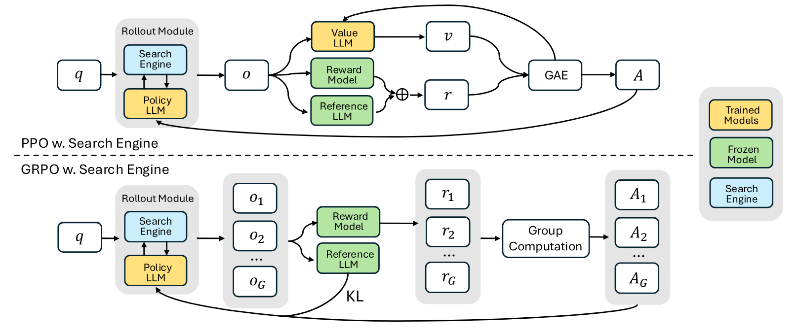

**图 1.** 使用搜索引擎进行 PPO 和 GRPO 训练的示意图 (Search-R1). 在 rollout 过程中, LLM 可以同搜索引擎进行多轮交互.

下文给出 Search-R1 训练方法的详细设计, 包括: (1) 扩展 RL 以使用搜索引擎; (2) 生成文本时交错进行多轮搜索引擎调用; (3) 训练模板; (4) 奖励模型设计.

### 3.1 使用搜索引擎的强化学习

我们将使用搜索引擎 $\mathcal{R}$ 的 RL 目标函数写为:

$$
\max_{\pi_\theta} \mathbb{E}_{x \sim \mathcal{D}, y \sim \pi_{\theta}(\cdot \mid x; \mathcal{R})}
\left[ r_{\phi}(x, y) \right]
- \beta \mathbb{D}_{\mathrm{KL}} \left[ \pi_{\theta}(y \mid x; \mathcal{R}) \,\|\|\, \pi_{\mathrm{ref}}(y \mid x; \mathcal{R}) \right],
$$

其中, $\pi_{\theta}$ 是策略 LLM, $\pi_{\mathrm{ref}}$ 是参考 LLM, $r_{\phi}$ 是奖励函数, $\mathbb{D}_{\mathrm{KL}}$ 是 KL 散度度量. $x$ 表示从数据集 $\mathcal{D}$ 抽取的输入样本, $y$ 表示与搜索引擎调用结果交错的生成输出; 它由参考策略 $\pi_{\mathrm{ref}}(y \mid x)$ 采样, 并从搜索引擎 $\mathcal{R}$ 检索得到. 以往的 RL 方法主要依赖策略 LLM $\pi_{\theta}(\cdot \mid x)$ 生成 rollout 序列 [Raf23, Ouy22a]. 与之不同, 我们的框架通过 $\pi_{\theta}(\cdot \mid x; \mathcal{R})$ 明确纳入检索与推理的交错过程. 它可以写作 $\pi_{\theta}(\cdot \mid x) \bigotimes \mathcal{R}$, 其中 $\bigotimes$ 表示检索与推理交错进行. 这样, 模型在需要检索外部信息的高强度推理任务中可以更有效地作出决策. Rollout 过程的示意图与[式 1](#equation-01) 的说明见[第 3.2 节](#section-3-2)和[附录 A](#appendix-a).

本方法基于两种成熟的策略梯度 RL 方法: 近端策略优化 (PPO) [Sch17a] 与 Group Relative Policy Optimization (GRPO) [Sha24d, Dee25c]. 我们利用两者各自的优点来优化检索增强推理.

**检索 token 的损失掩码.** PPO 与 GRPO 都会在整个 rollout 序列上计算 token 级损失. 在 Search-R1 中, rollout 序列既包含 LLM 生成的 token, 也包含外部段落中检索到的 token. 优化 LLM 生成的 token 可以增强模型同搜索引擎交互和进行推理的能力, 但对检索 token 使用同样的优化会带来非预期的学习动态. 为解决这个问题, 我们给检索 token 加上损失掩码, 使策略梯度目标只在 LLM 生成的 token 上计算, 将检索内容排除在优化过程之外. 这种做法在保留搜索增强生成灵活性的同时稳定了训练.

**使用搜索引擎的 PPO.** 近端策略优化 (PPO) [Sch17a] 是一种常用于 LLM 的 actor-critic RL 方法 [Ouy22a]. 对于涉及搜索引擎调用的推理场景, 它通过最大化以下目标来优化 LLM:

$$
\mathcal{J}_{\mathrm{PPO}}(\theta) = \mathbb{E}_{x \sim \mathcal{D}, y \sim \pi_{\mathrm{old}}( \cdot\mid x; \mathcal{R})}
\left[ \frac{1}{\sum_{t=1}^{|y|} I(y_t)} \sum_{t=1: I(y_t)=1}^{|y|}
\min \left( \frac{\pi_{\theta}(y_t \mid x, y_{<t}; \mathcal{R})}{\pi_{\mathrm{old}}(y_t \mid x, y_{<t}; \mathcal{R})} A_t,
\mathrm{clip} \left( \frac{\pi_{\theta}(y_t \mid x, y_{<t}; \mathcal{R})}{\pi_{\mathrm{old}}(y_t \mid x, y_{<t}; \mathcal{R})}, 1 - \epsilon, 1 + \epsilon \right) A_t
\right) \right],
$$

其中, $\pi_{\theta}$ 与 $\pi_{\mathrm{old}}$ 分别表示当前策略模型和先前策略模型. $I(y_t)$ 是 token 损失掩码操作: 如果 $y_t$ 是 LLM 生成的 token, 则 $I(y_t)=1$; 如果 $y_t$ 是检索 token, 则 $I(y_t)=0$. $\epsilon$ 是 PPO 为稳定训练而引入的裁剪超参数. 优势估计 $A_t$ 使用广义优势估计 (GAE) [Sch15] 计算, 依据是未来奖励 $\{ r_{\geq t} \}$ 和学习到的价值函数 $V_{\phi}$.

**使用搜索引擎的 GRPO.** 为了提高策略优化的稳定性并去掉额外的价值函数近似, [Sha24d] 提出了 Group Relative Policy Optimization (GRPO). GRPO 与 PPO 的不同之处在于, 它用多次采样输出的平均奖励作为基线, 不依赖学习到的价值函数. 具体而言, 对每个输入问题 $x$, GRPO 从参考策略 $\pi_{\mathrm{ref}}$ 采样一组回答 $\{ y_1, y_2, \dots, y_G \}$. 随后, 策略模型通过最大化以下目标函数进行优化:

$$
\begin{aligned}
\mathcal{J}_{\mathrm{GRPO}}(\theta) =\;&
\mathbb{E}_{x \sim \mathcal{D}, \{ y_i \}_{i=1}^{G} \sim \pi_{\mathrm{old}}( \cdot\mid x; \mathcal{R})}
\Bigg[
\frac{1}{G} \sum_{i=1}^{G} \frac{1}{\sum_{t=1}^{|y_i|} I(y_{i,t})} \sum_{t=1: I(y_{i,t})=1}^{|y_i|}
\min \Bigg(
\frac{\pi_{\theta}(y_{i,t} \mid x, y_{i,<t}; \mathcal{R})}{\pi_{\mathrm{old}}(y_{i,t} \mid x, y_{i,<t}; \mathcal{R})} \hat{A}_{i,t},\\[8pt]
&\hspace{80pt} \mathrm{clip} \Bigg( \frac{\pi_{\theta}(y_{i,t} \mid x, y_{i,<t}; \mathcal{R})}{\pi_{\mathrm{old}}(y_{i,t} \mid x, y_{i,<t}; \mathcal{R})}, 1 - \epsilon, 1 + \epsilon \Bigg) \hat{A}_{i,t}
\Bigg)
- \beta \mathbb{D}_{\mathrm{KL}} \left[ \pi_{\theta} \| \pi_{\mathrm{ref}} \right]
\Bigg],
\end{aligned}
$$

其中, $\epsilon$ 和 $\beta$ 是超参数, $\hat{A}_{i,t}$ 表示根据组内各输出相对奖励计算的优势. 这种做法不会给 $\hat{A}_{i,t}$ 的计算引入额外复杂度. GRPO 也不把 KL 散度作为奖励函数中的惩罚项, 而是直接把训练策略与参考策略间的 KL 散度加入损失函数, 从而完成正则化. 计算 KL 散度损失 $\mathbb{D}_{\mathrm{KL}}$ 时同样会应用检索 token 掩码.

### 3.2 生成时进行多轮搜索引擎调用

本节说明 LLM 回答生成的 rollout 过程. 该过程交错包含多轮搜索引擎调用, 可以写作 $y\sim \pi_{\theta}(\cdot \mid x; \mathcal{R}) = \pi_{\theta}(\cdot \mid x) \bigotimes \mathcal{R}$.

本方法采用迭代框架, LLM 在文本生成与外部搜索引擎查询之间交替进行. 具体而言, 系统指令要求 LLM 在需要外部检索时, 把搜索查询放在两个指定的搜索调用 token `<search>` 与 `</search>` 之间. 系统在生成序列中检测到这些 token 后, 会提取搜索查询, 查询搜索引擎并取回相关结果. 随后, 检索信息被放在特殊检索 token `<information>` 和 `</information>` 之间, 并追加到正在生成的 rollout 序列中, 作为下一次生成的额外上下文. 这一过程不断迭代, 直至满足以下条件之一: (1) 达到最大动作数; (2) 模型生成最终回答, 并将其放在指定的 `<answer>` 和 `</answer>` token 之间. 完整流程见算法 1.

**算法 1: 通过多轮搜索引擎调用进行 LLM 回答 rollout**

- **输入:** 输入查询 $x$, 策略模型 $\pi_{\theta}$, 搜索引擎 $\mathcal{R}$, 最大动作预算 $B$.
- **输出:** 最终回答 $y$.
- 初始化 rollout 序列 $y \gets \emptyset$.
- 初始化动作计数 $b \gets 0$.
- **当** $b < B$ **时**:
  - 初始化当前动作的 LLM rollout 序列 $y_b \gets \emptyset$.
  - **当** True **时**:
    - 生成回答 token $y_t \sim \pi_{\theta}(\cdot \mid x, y + y_b)$.
    - 将 $y_t$ 追加到 rollout 序列 $y_b \gets y_b + y_t$.
    - **如果** $y_t$ 属于 [`</search>`, `</answer>`, `<eos>`]:
      - 跳出循环.
  - $y \gets y + y_b$.
  - **如果**在 $y_b$ 中检测到 `<search>`:
    - 提取搜索查询 $q \gets \mathrm{Parse}(y_b, \texttt{<search>}, \texttt{</search>})$.
    - 检索搜索结果 $d = \mathcal{R}(q)$.
    - 将 $d$ 插入 rollout, 即 $y \gets y + \texttt{<information>}d\texttt{</information>}$.
  - **否则, 如果**在 $y_b$ 中检测到 `<answer>`:
    - **返回**最终生成回答 $y$.
  - **否则:**
    - 要求重新思考: $y \gets y +$ “My action is not correct. Let me rethink.”
  - 增加动作计数 $b \gets b + 1$.
- **返回**最终生成回答 $y$.

### 3.3 训练模板

为了训练 Search-R1, 我们先设计一个简单模板, 引导初始 LLM 遵循预先定义的指令. 如[表 1](#table-01) 所示, 该模板以迭代方式把模型输出分成三个部分: 先推理, 再调用搜索引擎, 最后给出回答. 我们有意把约束限定为这种结构格式, 不加入任何针对内容的偏置, 例如强制进行反思式推理和搜索引擎调用, 或指定某种问题求解方法. 这样可以直接观察模型在 RL 过程中的自然学习动态, 而不引入偏置.

**表 1.** Search-R1 的模板. 训练和推理时, `question` 会替换为具体问题.

### 3.4 奖励建模

奖励函数是主要训练信号, 用于指导 RL 的优化过程. 为训练 Search-R1, 我们采用一种基于规则的奖励系统, 其中只有**最终结果奖励**, 用来评估模型回答是否正确. 例如, 在事实推理任务中, 可以用精确字符串匹配等规则判据评估正确性:

$$
r_{\phi}(x, y) = \mathrm{EM}(a_{\mathrm{pred}}, a_{\mathrm{gold}}),
$$

其中, $a_{\mathrm{pred}}$ 是从回答 $y$ 中提取的最终答案, $a_{\mathrm{gold}}$ 是真实答案. 与 [Dee25c] 不同, 我们没有加入格式奖励, 因为训练后的模型已经表现出很强的结构遵循能力. 更复杂的格式奖励留待未来研究. 我们也遵循 [Dee25c], 不训练神经奖励模型. 作出这一选择的原因是, 大规模 RL 中的 LLM 对奖励的具体形式很敏感, 而重新训练这些模型还会增加计算成本与复杂度.

## 4 主要结果

### 4.1 数据集

我们在 7 个基准数据集上评估 Search-R1, 这些数据集分为: (1) **一般问答**: NQ [Kwi19a], TriviaQA [Jos17] 和 PopQA [Mal22]. (2) **多跳问答**: HotpotQA [Yan18a], 2WikiMultiHopQA [Ho20], Musique [Tri22] 和 Bamboogle [Lew23]. 这些数据集涵盖多种需要检索与推理的问题, 可以全面评估 Search-R1.

### 4.2 基线

为评估 Search-R1 的效果, 我们将其同以下基线比较: (1) **不使用检索的推理**: 直接推理和思维链 (CoT) 推理 [Wei22a]. (2) **使用检索的推理**: 检索增强生成 (RAG) [Lew20], IRCoT [Tri22a] 和 Search-o1 [Li25k]. (3) **基于微调的方法**: 监督微调 (SFT) [Chu22], 不使用搜索引擎的 RL 微调 (R1) [Dee25c], 以及使用搜索引擎的拒绝采样 [Ahn24]. 对于 R1, 我们使用 [Dee25c] 提出的 RL 方法和本文数据训练 LLM, 以保证比较公平. 其步骤只有推理与回答, 不使用搜索引擎. 对于拒绝采样, 我们让指令 LLM 针对同一数据集中的每个训练提示生成 5 个候选回答, 再选择能够得到正确最终答案的回答. 随后用这些轨迹构建新的训练集, 保留 Search-R1 提出的同一套多轮 LLM–搜索引擎交互 rollout 机制, 并用它微调 LLM.

这些基线涵盖多种检索增强和微调方法, 可用于全面评估 Search-R1 在零样本与学习式检索设置下的表现. 为公平比较不同方法, 我们使用相同的检索器, 相同数量的检索文档, 相同的知识语料库, 训练数据和预训练 LLM. 详细设置见[附录 B](#appendix-b).

### 4.3 实验设置

我们使用两类模型进行实验: Qwen-2.5-3B (Base/Instruct) 和 Qwen-2.5-7B (Base/Instruct) [Yang24]. 检索方面, 我们把 2018 年的 Wikipedia dump [Kar20] 作为知识源, 用 E5 [Wan22i] 作为检索器. 为保证比较公平, 我们遵循 [Lin23c], 把所有检索方法取回的段落数设为 3. 检索段落数量的实验见[附录 G](#appendix-g).

训练时, 我们合并 NQ 和 HotpotQA 的训练集, 为 Search-R1 与其他基于微调的基线构建统一数据集. 评估在 7 个数据集的测试集或验证集上进行, 同时考察域内与域外性能. 按照 [Yu24a], 评估指标采用精确匹配 (EM). 对推理式基线, 我们使用 instruct 模型, 因为 base 模型无法遵循指令. 对 RL 微调方法, 实验同时使用 base 和 instruct 模型. 更详细的实验设置见[附录 B](#appendix-b).

除非另有说明, 我们**默认使用 PPO 作为 RL 方法**. PPO 与 GRPO 的详细比较见[第 5.1 节](#section-5-1).

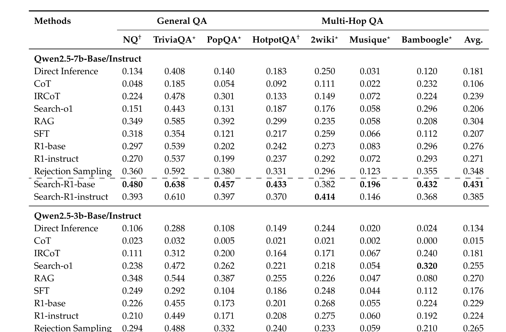

**表 2.** 主要结果. 最佳性能以粗体标出. $^\dagger/^\star$ 分别表示域内/域外数据集.

### 4.4 性能

Search-R1 与基线方法在 7 个数据集上的主要比较结果见[表 2](#table-02). 从结果可以得到以下结论: **(1) Search-R1 始终优于有竞争力的基线方法.** Qwen2.5-7B 与 Qwen2.5-3B 的平均相对性能分别提高了 24% 和 20%. 这种提升同时出现在分布内评估 (*即* NQ 和 HotpotQA) 与分布外评估 (*即* TriviaQA, PopQA, 2WikiMultiHopQA, Musique 和 Bamboogle) 中. **(2) Search-R1 优于不使用检索的 LLM 推理 RL 训练 (R1).** 这符合预期, 因为把搜索加入 LLM 推理后, 模型可以访问相关外部知识, 从而提高整体性能. **(3) Search-R1 对 base 模型和指令微调模型都有效.** 这表明, 基于结果奖励的 DeepSeek-R1-Zero 风格 RL [Dee25c] 可以成功用于结合搜索的推理, 不再局限于此前已经证明有效的纯推理场景. **(4) 较大的模型更善于学习如何搜索.** 同 3B 模型相比, Search-R1 在 7B 模型上取得了大得多的“性能差距” (*例如*相对次优模型 RAG 的差距).

## 5 分析

### 5.1 不同 RL 方法: PPO 与 GRPO

我们分别以 PPO 和 GRPO 作为基础 RL 方法, 在 Qwen2.5-3B/7B 模型上评估 Search-R1. 训练动态的比较见[图 2(a)](#figure-02), 评估结果见[表 3](#table-03). 由此可以得到: **(1) 在所有设置中, GRPO 都比 PPO 收敛得快.** 原因是 PPO 依赖评论器模型, 有效训练开始前需要若干预热步骤. **(2) PPO 的训练稳定性更高.** 如[图 2(a)](#figure-02) 所示, GRPO 训练许多步后发生奖励崩溃, PPO 则保持稳定. **(3) PPO 与 GRPO 的最终训练奖励相当.** 尽管收敛速度与稳定性不同, 两种方法的最终训练奖励和性能接近, 因而都可以用于优化 Search-R1. PPO 的训练稳定性更高, 在此设置下是更合适的选择. 更多结果见[附录 F](#appendix-f).

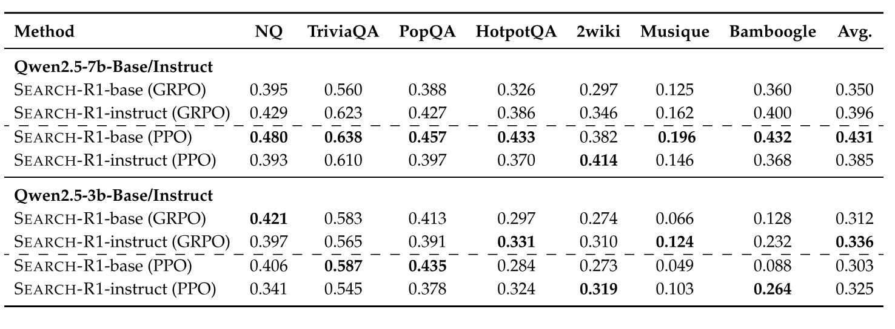

**表 3.** Search-R1 使用 PPO 和 GRPO 时在 7 个数据集上的性能结果.

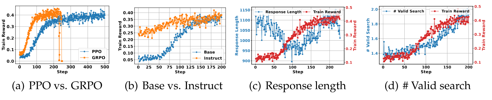

**图 2.** (a) PPO 与 GRPO: GRPO 通常收敛得更快, 但训练若干步后可能不稳定; PPO 的优化更稳定, 收敛速度则较慢. (b) Base 与 Instruct LLM 实验: 指令微调 LLM 收敛更快, 但两类模型的最终性能非常接近. (c) 回答长度实验: 回答长度在训练中呈现“下降-上升-稳定”的趋势, 同 LLM 的整体性能轨迹一致. (d) 有效搜索次数实验: 随着训练推进, LLM 学会发起更多搜索.

### 5.2 Base 与 Instruct LLM

我们分析了 Search-R1 在 base LLM 和指令微调 LLM 上的训练动态. 实验使用 Qwen2.5-3B 与 Qwen2.5-7B 两种模型. 如[图 2(b)](#figure-02) 所示, 指令微调模型收敛更快, 初始性能也高于 base 模型. 但训练结束后, 两类模型的最终训练奖励仍很接近. 这说明, 通用后训练虽然能加快模型在推理加搜索场景中的学习, RL 仍可以随时间弥合差距, 让 base 模型取得相近的结果. 更多结果见[附录 E](#appendix-e).

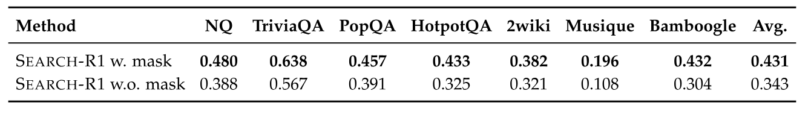

**表 4.** Search-R1 使用与不使用检索 token 损失掩码时的性能. 使用检索 token 损失掩码训练的 LLM 始终取得更好的性能. (LLM: Qwen2.5-7b-base; RL: PPO)

### 5.3 回答长度与有效搜索实验

我们在 Qwen2.5-7b-base 模型上运行 Search-R1 实验, 分析训练过程中回答长度和有效搜索引擎调用次数的变化. 回答长度结果见[图 2(c)](#figure-02), 其中有以下主要趋势: **(1) 早期阶段 (前 100 步)**: 回答长度急剧下降, 训练奖励略有上升. 在这一阶段, base 模型学会删除多余的填充词, 并开始适应任务要求. **(2) 后期阶段 (100 步之后)**: 回答长度和训练奖励均显著上升. 此时, LLM 学会频繁调用搜索引擎; 由于加入了检索段落, 回答也随之变长. 随着模型更有效地利用搜索结果, 训练奖励大幅提高. 有效搜索结果见[图 2(d)](#figure-02), 它表明随着训练进行, LLM 学会了更多次调用搜索引擎.

### 5.4 检索 token 损失掩码实验

我们在[第 3.1 节](#section-3-1)引入了检索 token 损失掩码, 以避免非预期的优化行为. 此处在 Qwen2.5-7b-base 模型上进行实验, 比较使用与不使用检索 token 损失掩码时的训练动态. 如[图 3](#figure-03) 所示, 使用检索 token 掩码后, LLM 的性能提升更大; 它减少了非预期的优化影响, 也让训练更加稳定. 性能比较见[表 4](#table-04), 结果表明, 使用检索 token 损失掩码训练的 Search-R1 始终优于不使用掩码的变体.

检索 token 损失掩码, base 与 instruct LLM, PPO 与 GRPO 的比较, Search-R1 训练中的检索段落数, Search-R1 (GRPO) 的组大小实验和案例分析等更多实验结果见[附录 D](#appendix-d), [附录 E](#appendix-e), [附录 G](#appendix-g), [附录 H](#appendix-h), [附录 I](#appendix-i)和[附录 J](#appendix-j).

## 6 结论

本文提出了 Search-R1, 这是一个让 LLM 能够交错进行自我推理与实时搜索引擎交互的新 RL 框架. 现有的类 RAG 方法依赖大量提示完成多轮检索, 工具使用方法则需要大规模监督训练数据; Search-R1 与之不同, 它通过 RL 优化 LLM rollout, 使模型可以自主生成查询并有策略地利用检索信息. 我们在 7 个数据集上进行了大量实验, 结果表明, Search-R1 显著增强了 LLM 处理需要实时外部知识的复杂推理任务的能力. 分析还给出了搜索增强推理中 RL 训练策略的重要观察. 未来工作可以扩展 Search-R1, 使其支持更广泛的搜索策略, 包括更复杂的奖励机制, 根据不确定性动态调整检索, 结合不同类型的工具, 以及整合搜索之外的多种信息源. 探索它在多模态推理任务中的适用性也很有前景.

## 致谢

本研究部分得到 Apple PhD Fellowship, 美国 DARPA INCAS 项目 (编号 HR0011-21-C0165) 和 BRIES 项目 (编号 HR0011-24-3-0325), 美国海军研究办公室合同 (编号 N000142412612), NSF 基金 (编号 IIS-19-56151 和 2402873), Molecule Maker Lab Institute 的支持. 后者是由 NSF Award No. 2019897 支持的 AI Research Institutes 项目. 本研究还部分得到由 NSF Award No. 2118329 支持的 Institute for Geospatial Understanding through an Integrative Discovery Environment (I-GUIDE), Cisco 和 Center for Intelligent Information Retrieval 的支持. 文中表达的观点, 发现, 结论或建议仅代表作者, 不一定反映资助方或美国政府明确或隐含的立场.

## A 使用搜索引擎的强化学习形式化

用于训练大语言模型 (LLM) 的经典强化学习 (RL) 框架可以写作 [Raf23, Ouy22a]:

$$
\max_{\pi_\theta} \mathbb{E}_{x \sim \mathcal{D}, y \sim \pi_{\theta}(\cdot \mid x)}
\left[ r_{\phi}(x, y) \right]
- \beta \mathbb{D}_{\mathrm{KL}} \left[ \pi_{\theta}(y \mid x) \,\|\|\, \pi_{\mathrm{ref}}(y \mid x) \right],
$$

其中, $x$ 表示从数据集 $\mathcal{D}$ 采样的提示, $y$ 是策略模型 $\pi_\theta$ 生成的回答, $\pi_{\mathrm{ref}}$ 表示充当正则化锚点的参考模型. 奖励函数 $r_{\phi}(x, y)$ 衡量生成回答的质量, KL 散度项则约束更新后的策略保持接近参考模型, 从而提高训练稳定性.

不过, 这种形式化假定整个输出序列 $y$ 仅由策略 LLM 生成. 在本文设置中, 模型行为同时包含内部推理与外部信息检索, 因而不满足这一假定. 为适应这种情况, 我们扩展 RL 目标, 加入外部搜索引擎 $\mathcal{R}$, 得到:

$$
\max_{\pi_\theta} \mathbb{E}_{x \sim \mathcal{D}, y \sim \pi_{\theta}(\cdot \mid x; \mathcal{R})}
\left[ r_{\phi}(x, y) \right]
- \beta \mathbb{D}_{\mathrm{KL}} \left[ \pi_{\theta}(y \mid x; \mathcal{R}) \,\|\|\, \pi_{\mathrm{ref}}(y \mid x; \mathcal{R}) \right],
$$

在修订后的目标中, 轨迹 $y \sim \pi_{\theta}(\cdot \mid x; \mathcal{R})$ 包含交错的推理步骤与检索内容, 体现 LLM 与搜索引擎间的多轮交互. KL 散度在同时以提示和检索增强上下文为条件的联合回答分布上计算, 保证即使存在外部信息, 学到的策略仍同参考模型保持一致.

## B 实验设置

### B.1 基线

近期有多项工作研究 RAG 流水线, 特别是在 Natural Questions (NQ) 和 HotpotQA 等基准上, 试图用更复杂的检索机制提高性能. 例如, Re2G [Gla22] 与 RetroLLM [Li24r] 提出了复杂的“检索-重排-生成”框架, 使用强检索器和复杂的重排策略来选择细粒度生成证据. 这些方法虽然结果出色, 却往往依赖特定任务的工程设计或重型流水线, 限制了泛化能力与可扩展性. 本文关注一种更轻量, 更通用的检索增强推理方法. 因此, 我们没有把这些方法作为直接基线, 不过它们仍是检索增强语言模型这一更广领域中值得研究的方向.

### B.2 实验设置

我们使用两类模型进行实验: Qwen-2.5-3B (Base/Instruct) 和 Qwen-2.5-7B (Base/Instruct) [Yang24]. 检索方面, 我们使用 2018 年 Wikipedia dump [Kar20] 作为知识源, 以 E5 [Wan22i] 作为检索器. 为保证比较公平, 我们遵循 [Lin23c], 把所有检索方法取回的段落数设为 3.

训练时, 我们合并 NQ 和 HotpotQA 的训练集, 为 Search-R1 与其他基于微调的基线构建统一数据集. 评估在 7 个数据集的测试集或验证集上进行, 同时考察域内与域外性能. 按照 [Yu24a], 评估指标采用精确匹配 (EM). 对推理式基线, 我们使用 instruct 模型, 因为 base 模型无法遵循指令. 对 RL 微调方法, 实验同时使用 base 和 instruct 模型. 更详细的实验设置见[附录 B](#appendix-b).

对于 Search-R1 的 PPO 变体, 策略 LLM 和价值 LLM 的学习率分别设为 1e-6 和 1e-5. 训练持续 500 步, 策略模型与价值模型的预热比例分别为 0.285 和 0.015. 我们使用广义优势估计 (GAE), 参数 $\lambda = 1$, $\gamma = 1$.

训练在单个节点的 8 张 H100 GPU 上进行. 总批大小为 512, mini-batch 大小为 256, micro-batch 大小为 64. 最大序列长度设为 4,096 个 token, 最大回答长度为 500, 检索内容的最大长度也为 500 个 token. 为优化 GPU 内存使用, 我们启用梯度检查点, 并使用带 CPU offloading 的 Fully Sharded Data Parallel (FSDP).

为高效生成 LLM rollout, 我们采用 vLLM [+1], tensor parallel 大小为 1, GPU 内存利用率为 0.6. Rollout 采样温度为 1.0, top-p 为 1.0. KL 散度正则化系数 $\beta$ 和裁剪比例 $\epsilon$ 分别设为 0.001 和 0.2.

GRPO 训练中, 策略 LLM 学习率设为 1e-6, 并按照 Verl 中的 GRPO 实现 [She24a] [+2], 为每个提示采样 5 个回答. 模型训练 500 步, 学习率预热比例为 0.285. 训练使用同一套 8×H100 环境, 批大小与序列长度配置同 PPO 完全相同.

我们也使用梯度检查点, FSDP offloading 和基于 vLLM 的 rollout, 超参数同上. Rollout 的温度与 top-p 均为 1.0, KL 散度系数 $\beta$ 和裁剪比例 $\epsilon$ 固定为 0.001 和 0.2.

两种方法都每 100 步保存一次模型检查点. 如果训练发散, 我们依据训练奖励曲线, 在最近一个稳定的检查点上评估; 否则使用最终检查点. 最大动作预算 $B$ 设为 4, 默认检索前 3 个段落.

结果奖励采用精确匹配 (EM) 计算. 除非另有说明, 我们**默认使用 PPO 作为 RL 算法**, 与 GRPO 的详细比较见[第 5.1 节](#section-5-1).

[+1]: [https://docs.vllm.ai/en/latest/](https://docs.vllm.ai/en/latest/)

[+2]: [https://github.com/volcengine/verl/blob/main/examples/grpo_trainer/run_deepseek7b_llm.sh](https://github.com/volcengine/verl/blob/main/examples/grpo_trainer/run_deepseek7b_llm.sh)

## C 14B LLM 上的主要结果

我们使用 Qwen2.5-14B 模型进行大量实验, 结果见[表 5](#table-05). Search-R1 在所有评估指标上始终优于基线方法. 我们还观察到, 随着模型尺寸增大, Search-R1 的性能稳定提升, 说明本方法能从 LLM 尺寸扩展中受益.

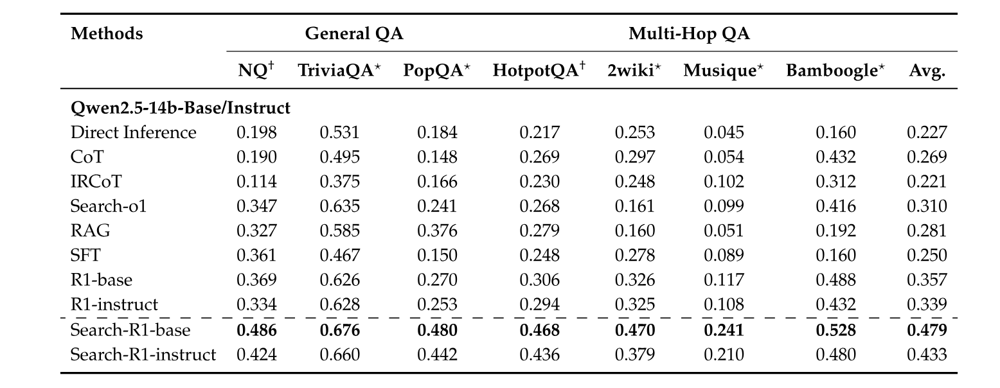

**表 5.** 主要结果. 最佳性能以粗体标出. $^\dagger/^\star$ 分别表示域内/域外数据集.

## D 检索 token 损失掩码实验

我们在[第 3.1 节](#section-3-1)引入了一种检索 token 损失掩码策略, 以减少训练中的异常优化行为. 为评估其影响, 我们在 Qwen2.5-3b/7b-base 模型上进行实验, 比较使用与不使用检索 token 损失掩码时的训练动态. 如[图 3](#figure-03) 所示, 加入掩码机制后, 优化过程更稳定, 模型性能也更高. [表 6](#table-06) 中的定量结果进一步表明, 对检索 token 使用损失掩码训练的 Search-R1 始终优于不使用掩码的变体.

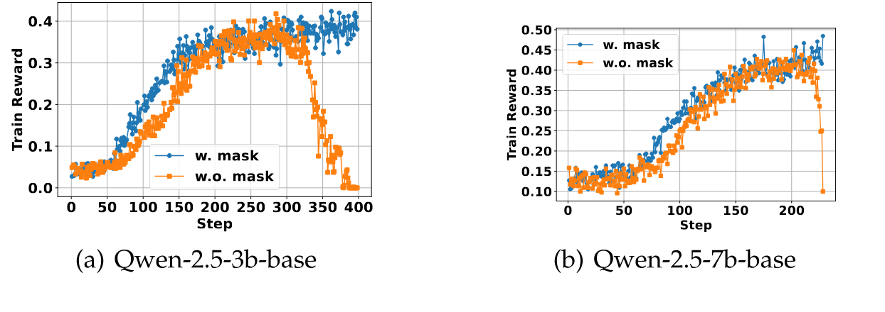

**图 3.** 检索 token 损失掩码实验.

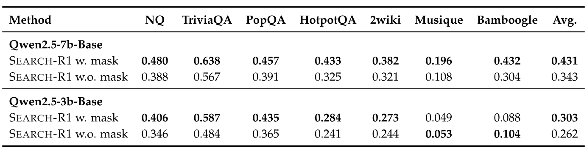

**表 6.** Search-R1 使用与不使用检索 token 损失掩码时的性能. 使用检索 token 损失掩码训练的 LLM 始终取得更好的性能. (RL: PPO)

## E Base 与 Instruct LLM

我们分析 Search-R1 在 base LLM 与指令微调 LLM 上的训练动态, 使用 Qwen2.5-3B 和 Qwen2.5-7B 两种模型尺寸. 如[图 4](#figure-04) 所示, 指令微调模型收敛更快, 初始性能也高于 base 模型. 尽管前期存在优势, 训练结束后两类模型的性能会收敛到接近的水平. 这些结果说明, 指令微调可以提高模型在推理加搜索任务中的前期学习效率, 而强化学习能够弥合性能差距, 最终让 base 模型达到相近的结果.

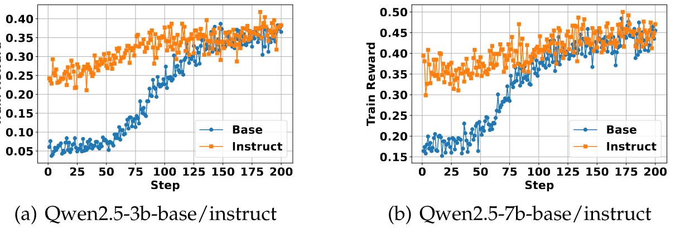

**图 4.** Search-R1 在 base 和 instruct LLM 上的实验. 指令模型收敛更快, 初始性能也更好. 但两类模型的最终性能非常接近.

## F Search-R1 中 PPO 与 GRPO 的比较

我们以 Qwen2.5-3B 和 Qwen2.5-7B 为底层模型, 分别在 PPO 与 GRPO 两种强化学习算法下评估 Search-R1. 训练动态见[图 5](#figure-05). 由此得到以下结论: **(1) 在所有设置下, GRPO 都比 PPO 收敛得快**, 原因是 PPO 依赖单独的价值函数 (评论器), 有效更新策略前需要先进行预热. **(2) PPO 的训练行为更稳定**, 如[图 5](#figure-05) 所示, GRPO 在训练步数较多时会发生奖励崩溃, PPO 则始终保持稳定. **(3) PPO 与 GRPO 的最终奖励性能相当**, 这说明尽管两者在收敛速度与稳定性上存在取舍, 都能有效优化 Search-R1.

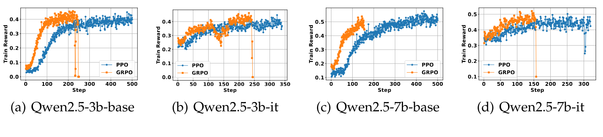

**图 5.** 以 PPO 和 GRPO 为基础 RL 方法时, Search-R1 在 4 种 LLM 上的训练动态. GRPO 通常收敛得更快, 但训练若干步后可能不稳定; PPO 的优化更稳定, 收敛速度则较慢. PPO 与 GRPO 的最终奖励性能相当.

## G Search-R1 训练中的检索段落数量实验

我们研究检索段落数 (top-k) 对 Search-R1 训练动态的影响. 主要实验按照 [Lin23c] 采用 top-k = 3, 这里增加 top-k 分别为 1, 3 和 5 的实验, 以便更好地理解其影响.

[图 6](#figure-06) 给出了这些设置下的训练奖励曲线. 三种配置的整体训练轨迹相近. 值得注意的是, top-k = 5 的初期收敛最快, 在前 200 步内达到最高训练奖励. 但随着训练继续, 奖励逐渐下降, 也变得更不稳定. 相比之下, top-k = 1 和 3 在整个训练过程中提升得更稳定, 其中 top-k = 3 在 500 步后取得最高奖励.

第 500 步的评估结果汇总于[表 7](#table-07), top-k = 3 的整体性能最好. 我们认为有两个原因: (1) top-k = 1 的检索召回率可能较低, 限制了相关上下文信息的供给; (2) top-k = 5 会纳入有噪声或无关的段落 [Jin25e], 因而精度更低. 这不只会降低推理性能, 还可能损害 RL 训练. 当模型发现额外上下文常常没有帮助或会造成误导时, 便不愿再利用检索内容.

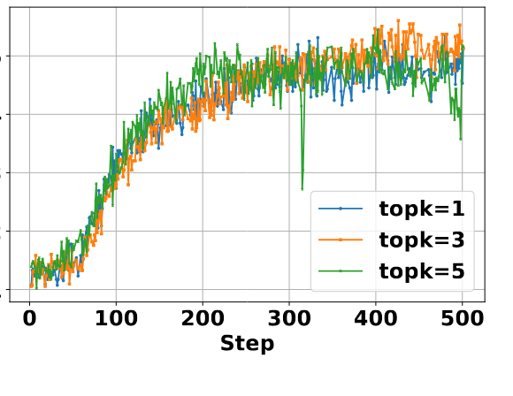

**图 6.** 不同检索段落数量下 Search-R1 的训练动态. (LLM: Qwen2.5-7b-base, RL: PPO)

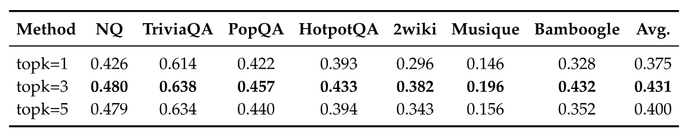

**表 7.** Search-R1 训练中的检索段落数量实验. (LLM: Qwen2.5-7b-base; RL: PPO)

## H Search-R1 (GRPO) 训练中的组大小实验

在主要实验中, 我们按照 [She24a] 的设置, 将 Search-R1 (GRPO) 的组大小设为 5. 为进一步研究组大小对训练动态的影响, 我们使用 1, 3 和 5 三种组大小进行消融实验. 特别地, 组大小为 1 时, GRPO 会退化为标准 REINFORCE 算法 [Wil92].

我们将 LLM 训练 500 步, 每 100 步保存一次模型检查点. 如果模型在训练中崩溃, 就使用最后一个有效检查点评估; 否则评估第 500 步的检查点.

不同组大小配置下的训练动态见[图 7](#figure-07). 较大的组通常收敛得更快, 但由于强化学习本身并不稳定, 崩溃风险也可能增加.

不同设置下的评估结果汇总于[表 8](#table-08). 较大的组可以加快收敛并取得更高的训练奖励, 较小的组 (*例如*大小为 1) 则使训练更加稳定, 泛化能力也更好. 它在未见任务上的性能更高, 体现了 GRPO 训练中学习速度与稳定性之间的取舍.

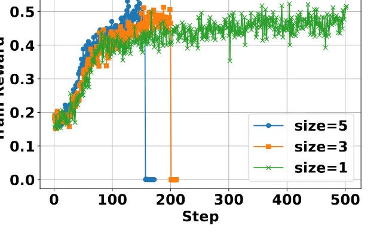

**图 7.** 不同组大小下 Search-R1 (GRPO) 的训练动态. (LLM: Qwen2.5-7b-base)

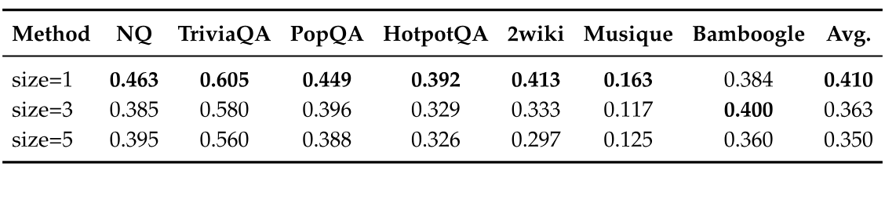

**表 8.** Search-R1 (GRPO) 在 7 个数据集上的组大小实验. (LLM: Qwen2.5-7b-base)

## I R1 与 Search-R1 的比较: 案例分析

**表 9.** R1 与 Search-R1 的案例分析.

为进一步理解 Search-R1, 我们在 Qwen2.5-7B-Base 上进行案例分析, 把它的行为同不使用搜索引擎的 RL [Dee25c] 比较. 结果见[表 9](#table-09), 可以得到以下主要观察:

**交错推理与检索有助于问题分析**: Search-R1 让 LLM 能结合多轮检索进行深入推理, 而不使用搜索的 RL 只能依赖模型的内部知识. 加入检索段落后, Search-R1 可以反复修正推理, 从而给出依据更充分, 更准确的回答.

**通过迭代检索进行自我验证**: 我们观察到, 第二轮检索后, LLM 已经收集到足够的信息来回答问题. 但 Search-R1 又进行了一次检索来验证结论, 进一步增强了模型对最终回答的确信. 这一现象同不使用检索的 LLM 推理 RL 中的发现一致 [Dee25c], 说明在搜索增强设置下, RL 也能促使模型进行由验证驱动的推理.

## J 更多 Search-R1 案例分析

为进一步了解训练后 LLM 的行为与能力, 我们对 Search-R1 进行了更多案例分析. 具体而言, 分析对象是以近端策略优化 (PPO) 作为底层强化学习算法, 从 Qwen2.5-7B-Base 微调得到的模型. 结果见以下各表.

**表 10.** Search-R1 案例 1 (成功): Search-R1 进行多步推理和搜索, 通过自我验证最终回答问题.

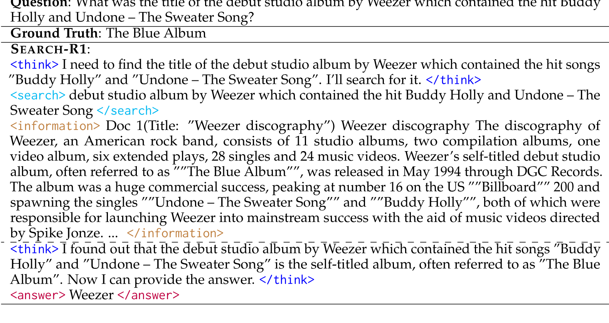

**表 11.** Search-R1 案例 2 (失败): Search-R1 有时无法分解复杂问题, 并会受到无关检索段落的误导.

**表 12.** Search-R1 案例 3 (成功): 如果一次搜索引擎调用就能找到相关信息, Search-R1 可以轻松回答问题.

**表 13.** Search-R1 案例 4 (成功): Search-R1 可以写出正确查询, 搜索先前搜索引擎调用没有提供的辅助信息.

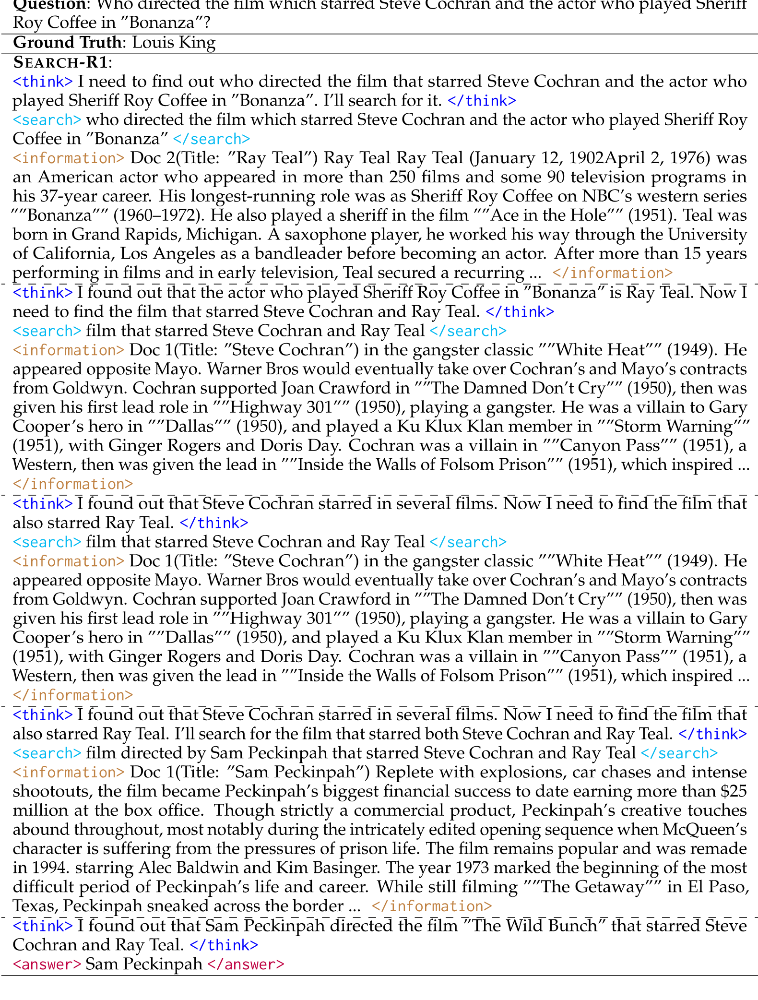

**表 14.** Search-R1 案例 5 (失败): 检索信息不足或带有误导性时, Search-R1 无法正确回答问题.

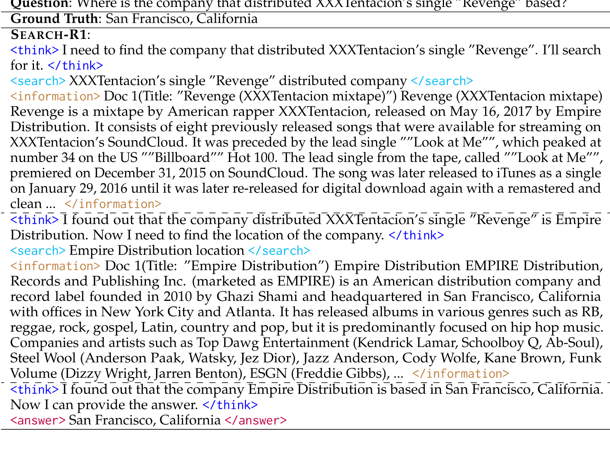

**表 15.** Search-R1 案例 6 (成功): 检索到充分而准确的上下文时, Search-R1 可以通过多跳推理轻松回答问题.

**表 16.** Search-R1 案例 7 (失败): Search-R1 起初没有写出分解复杂问题所需的正确查询. 模型在证据不足时回答了问题.

**表 17.** Search-R1 案例 8 (成功): Search-R1 可以编写查询, 搜索缺少的信息.

**表 18.** Search-R1 案例 9 (成功): LLM 写出的第一个查询意义不大. 不过, 模型随后开始逐步编写查询并解决问题.

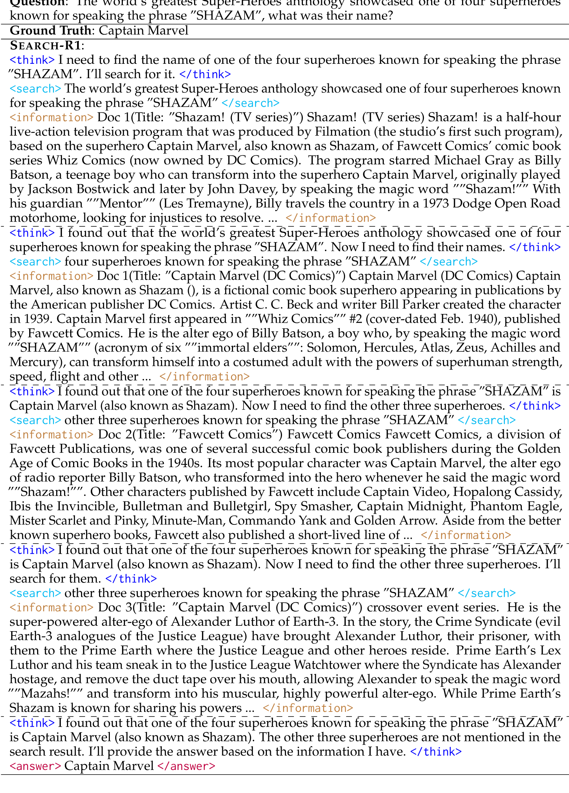

**表 19.** Search-R1 案例 10 (成功): 发现外部知识源不足以回答问题时, Search-R1 学会停止搜索.

**表 20.** Search-R1 案例 11 (失败): LLM 可能受到无关检索信息的误导, 给出错误回答.
