> [Guangxuan Xiao](https://guangxuanx.com/), [Ji Lin](https://www.linji.me/), [Mickael Seznec](https://dblp.org/pid/232/9601), [Hao Wu](https://developer.nvidia.com/blog/author/hao-wu/), [Julien Demouth](https://developer.nvidia.com/blog/author/jdemouth/), and [Song Han](https://songhan.mit.edu/). 首次提交至 arXiv: November 18, 2022; 当前版本为 v7. [SmoothQuant: Accurate and Efficient Post-Training Quantization for Large Language Models](https://arxiv.org/abs/2211.10438). [原始 PDF](/paper/smoothquant.pdf). [TeX 源码](https://export.arxiv.org/e-print/2211.10438). 精确的印刷版式和参考文献以原始 PDF 为准.

## 摘要

大型语言模型 (LLMs) 表现出色, 但对计算和内存的需求很高. 量化可以减少内存占用并加速推理. 然而, 现有方法无法同时保持精度和硬件效率. 我们提出了 SmoothQuant, 一种无需训练, 保留精度且通用的后训练量化 (PTQ) 解决方案, 以实现 LLM 的 8 位权重, 8 位激活 (W8A8) 量化. 基于权重容易量化而激活不易量化的事实, SmoothQuant 通过数学上等效的变换, 将激活的量化难度离线迁移到权重, 从而平滑激活异常值. SmoothQuant 使 LLM 中的所有矩阵乘法, 包括 OPT, BLOOM, GLM, MT-NLG 和 LLaMA 系列的权重和激活均可进行 INT8 量化. 我们展示了 LLM 的推理速度提升高达 1.56 倍, 以及内存减少 2 倍, 且精度损失可忽略. SmoothQuant 使 530B LLM 能够在单节点上服务. 我们的工作提供了一套现成的解决方案, 降低了硬件成本并实现了 LLM 的民主化.

机器学习, ICML

[https://github.com/mit-han-lab/smoothquant](https://github.com/mit-han-lab/smoothquant)

## 1 引言

大规模语言模型 (LLMs) 在各种任务上表现出卓越的性能 [Bro20, Zha22]. 然而, 由于其庞大的模型规模, 提供 LLM 服务在预算和能源上都消耗巨大. 例如, GPT-3 [Bro20] 模型包含 1750 亿个参数, 以 FP16 存储和运行至少需要 350GB 内存, 仅推理就需要 8$\times$ 块 48GB A6000 GPU 或 5$\times$ 块 80GB A100 GPU. 由于巨大的计算和通信开销, 推理延迟可能对实际应用来说也是不可接受的. *量化* 是降低 LLM 成本的一个有前景的方法 [Det22, Yao22]. 通过将 *权重和激活* 量化为低位整数, 我们可以减少 GPU 内存需求, 大小和带宽, 并加速计算密集型操作 (即线性层中的 GEMM, 注意力中的 BMM). 例如, 权重和激活的 INT8 量化可以将 GPU 内存使用量减半, 并且与 FP16 相比, 矩阵乘法的吞吐量几乎翻倍.

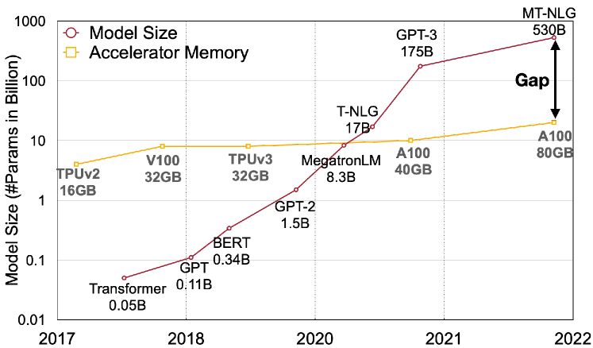

**图 1.** 大型语言模型的模型规模近年来发展速度超过了 GPU 内存增长的速度, 导致内存供需之间出现巨大差距. 量化和模型压缩技术可以帮助弥合这一差距.

然而, 与 CNN 模型或较小的 Transformer 模型如 BERT [Dev19a] 不同, 大型语言模型 (LLM) 的 *激活值* 很难进行量化. 当我们将 LLM 参数规模扩展到 67 亿以上时, 激活值中会出现系统性的大幅度异常 [Det22], 从而导致大的量化误差和精度下降. ZeroQuant [Yao22] 采用动态的每 token 激活量化和按组权重量化 (定义见 [图 3](#figure-03) 节 [2](#S2)). 它可以高效实现, 并且在 GPT-3-350M 和 GPT-J-6B 上提供良好的精度. 然而, 对于拥有 1750 亿参数的大型 OPT 模型, 它无法维持精度 (参见第 [5.2 节](#S5.SS2)). LLM. int8() [Det22] 通过进一步引入混合精度分解 (即将异常值保留在 FP16 中, 其他激活使用 INT8) 来解决精度问题. 然而, 在硬件加速器上高效实现这种分解是困难的. 因此, 为 LLM 推导出一种 *高效*, *硬件友好*, 最好是 *无需训练* 的量化方案, 使得所有计算密集操作都使用 INT8, 仍然是一个未解决的挑战.

我们提出了 SmoothQuant, 这是一种针对大语言模型 (LLMs) 的准确且高效的训练后量化 (PTQ) 解决方案. SmoothQuant 基于一个关键观察: 即使由于异常值的存在 [Det22], 激活比权重更难量化, 不同的 token 在其通道上表现出相似的变化.

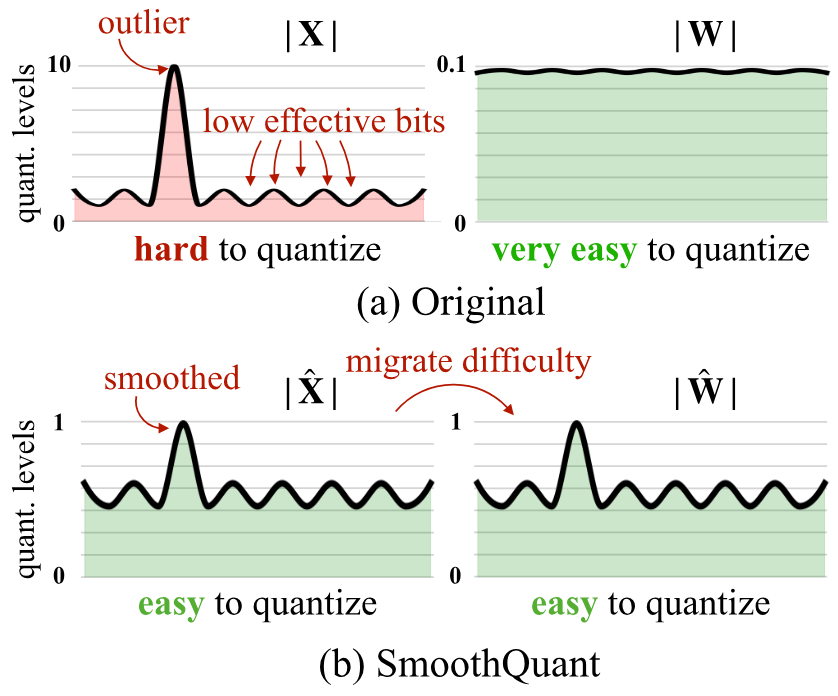

**图 2.** SmoothQuant 的直觉: 激活 $\mathbf{X}$ 难以量化, 因为异常值拉伸了量化范围, 使大多数值的有效比特很少. 我们在离线阶段将比例方差从激活迁移到权重 $\mathbf{W}$, 以降低激活的量化难度. 平滑后的激活 $\hat{\mathbf{X}}$ 和调整后的权重 $\hat{\mathbf{W}}$ 都易于量化.

基于这一观察, SmoothQuant 离线将量化难度从激活值迁移到权重上 ([图 2](#figure-02)). SmoothQuant 提出了一种数学上等价的按通道缩放变换, 显著平滑了各通道的幅值, 使模型更适合量化. 由于 SmoothQuant 与各种量化方案兼容, 我们为 SmoothQuant 实现了三种不同效率等级的量化设置 (见 [表 2](#table-02), O1-O3). 实验表明, SmoothQuant 在硬件上高效: 它可以保持 OPT-175B [Zha22], BLOOM-176B [Les23], GLM-130B [Zen22] 和 MT-NLG 530B [Smi22] 的性能, 在 PyTorch 上实现最高 1.51$\times$ 的加速和 1.96$\times$ 的内存节省. SmoothQuant 易于实现. 我们将 SmoothQuant 集成到最先进的 Transformer 服务框架 FasterTransformer 中, 与 FP16 相比, 实现了最高 1.56$\times$ 的加速, 并将内存使用减半. SmoothQuant 允许使用比 FP16 少一半数量的 GPU 来服务大型模型如 OPT-175B, 同时速度更快, 并且可以在一台 8-GPU 节点上服务 530B 模型. 我们的工作通过提供一站式解决方案来降低服务成本, 从而使 LLM 的使用更加普及. 我们希望 SmoothQuant 能在未来激发更多 LLM 的使用.

## 2 预备知识

量化将高精度数值映射到离散级别. 我们研究整数均匀量化 [Jac18] (具体为 INT8) 以获得更好的硬件支持和效率. 量化过程可以表示为:

$$
\bar{\mathbf{X}}^{\mathrm{INT8}}=\lceil\frac{\mathbf{X^{\mathrm{FP16}}}}{\Delta}\rfloor,\quad\Delta=\frac{\max(|\mathbf{X}|)}{2^{N-1}-1},\tag{1}
$$

其中 $\mathbf{X}$ 是浮点张量, $\bar{\mathbf{X}}$ 是量化后的对应张量, $\Delta$ 是量化步长, $\lceil\cdot\rfloor$ 是取整函数, $N$ 是比特数 (在我们的例子中为 8 位). 这里我们假设张量在 0 点是*对称*的以简化讨论; 对非对称情况 (例如 ReLU 后) 也可以通过添加零点 [Jac18] 类似地讨论.

这种量化器使用最大绝对值来计算 $\Delta$, 从而保留激活中的异常值, 而研究发现这些异常值对精度非常重要 [Det22]. 我们可以使用一些校准样本的激活来离线计算 $\Delta$, 这叫做静态量化. 我们也可以使用激活的运行时统计数据来获得 $\Delta$, 这叫做动态量化.

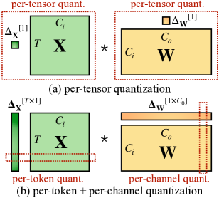

**图 3.** 每张量, 每 token 和每通道量化的定义. 每张量量化是实现上最有效的. 为了向量化量化以高效利用 INT8 GEMM 核, 我们只能使用外部维度的缩放因子 (即 token 维度 $T$ 和输出通道维度 $C_{o}$), 而不能使用内部维度 (即输入通道维度 $C_{i}$).

如 [图 3](#figure-03) 所示, 量化具有不同的粒度层次. 每张量量化为整个矩阵使用一个量化步长. 我们可以通过对每个令牌相关的激活使用不同的量化步长 (每令牌量化) 或对权重的每个输出通道使用不同的量化步长 (每通道量化) 来进一步启用更细粒度的量化. 每通道量化的粗粒度版本是对不同的通道组使用不同的量化步长, 称为分组量化 [She20c, Yao22].

对于 Transformers 中的线性层 [Vas17a] $\mathbf{Y}=\mathbf{X}\cdot\mathbf{W},\mathbf{Y}\in\mathbb{R}^{T\times C_{o}},\mathbf{X}\in\mathbb{R}^{T\times C_{i}},\mathbf{W}\in\mathbb{R}^{C_{i}\times C_{o}}$, 其中 $T$ 是令牌数, $C_{i}$ 是输入通道数, $C_{o}$ 是输出通道数 (见 [图 3](#figure-03), 为了简化省略批次维度), 通过将权重量化为 INT8, 我们可以将存储量相比 FP16 减少一半. 然而, 为了加快推理速度, 我们需要将权重和激活都量化为 INT8 (即 W8A8), 以利用整数核 (例如 INT8 GEMM), 这些在广泛的硬件上都受到支持 (例如 NVIDIA GPUs, Intel CPUs, Qualcomm DSPs 等).

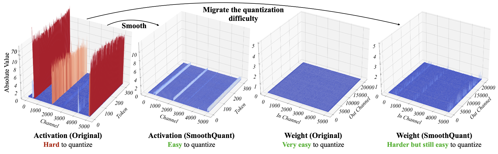

**图 4.** OPT-13B 中线性层输入激活和权重在 SmoothQuant 处理前后的幅值. 观察结果: (1) 在原始激活图中有少数通道的幅值非常大 (大于 70); (2) 某个激活通道的方差很小; (3) 原始权重分布平坦且均匀. SmoothQuant 将异常通道从激活迁移到权重中. 最终, 激活中的异常值被大幅平滑, 同时权重仍然保持相对平滑和平坦.

## 3 量化难点回顾

由于激活中的异常值, LLM 众所周知难以量化 [Det22, Wei22, Bon21a]. 我们首先回顾激活量化的困难, 并寻找异常值的模式. 我们可视化了具有较大量化误差的线性层的输入激活和权重, 如[图 4](#figure-04) (左) 所示. 我们可以找到几个促使我们方法形成的模式:

1\. 激活比权重更难量化. 权重分布相当均匀和平坦, 这容易量化. 先前的工作表明, 即使使用 INT8 甚至 INT4 对 LLM 的权重进行量化也不会降低准确性 [Det22, Yao22, Zen22], 这与我们的观察一致.

2\. 异常值使激活量化变得困难. 激活中的异常值的尺度比大多数激活值要大 $\sim 100\times$. 在逐张量量化的情况下 (方程 [1](#S2.E1) ), 大的异常值会主导最大幅度测量, 导致非异常通道的*有效量化位/级别*较低 ([图 2](#figure-02)): 假设通道 $i$ 的最大幅度为 $m_{i}$, 而整个矩阵的最大值为 $m$, 则通道 $i$ 的有效量化级别为 $2^{8}\cdot m_{i}/m$. 对于非异常通道, 有效量化级别会非常小 (2-3), 导致较大的量化误差.

3\. 异常值在固定通道中持续存在. 异常值出现在一小部分*通道*中. 如果某个通道有异常值, 它在所有 token 中都会持续出现 ([图 4](#figure-04), 红色). 对于给定 token, 不同通道之间的方差很大 (某些通道的激活值很大, 但大多数很小), 但同一通道在不同 token 中的幅度方差很小 (异常通道始终很大).

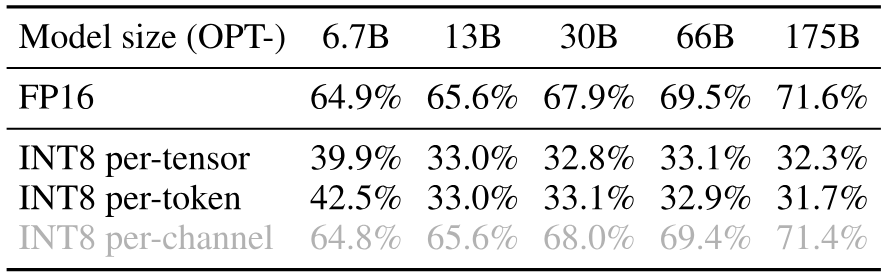

**表 1.** 在不同的激活量化方案中, 只有每通道量化 [Bon21a] 保留了准确性, 但它 *不* 与 INT8 GEMM 内核兼容 (灰色标记). 我们报告了在 WinoGrande, HellaSwag, PIQA 和 LAMBADA 上的平均准确性.

由于离群值的存在以及每个通道内部的方差较小, 如果我们能够对激活进行 *每通道* 量化 [Bon21a] (即对每个通道使用不同的量化步长), 量化误差将比 *每张量* 量化小得多, 而 *每标记* 量化帮助不大. 在 [表 1](#table-01) 中, 我们验证了模拟的每通道激活量化成功地将准确性与 FP16 基线接近, 这呼应了 [Bon21a] 的发现.

然而, 每通道激活量化与依赖高吞吐量执行一系列操作的硬件加速 GEMM 内核 (例如, Tensor Core MMAs) 不太匹配, 并且在该序列中不能容忍插入低吞吐量的指令 (例如, 转换或 CUDA Core FMAs). 在这些内核中, 缩放只能沿矩阵乘法的外层维度进行 (即激活的 token 维度 $T$, 权重的输出通道维度 $C_{o}$, 见 [图 3](#figure-03)), 可以在矩阵乘法完成后应用:

$$
\mathbf{Y}=\mathrm{diag}(\mathbf{\Delta}_{\mathbf{X}}^{\mathrm{FP16}})\cdot(\mathbf{\bar{X}}^{\mathrm{INT8}}\cdot\mathbf{\bar{W}}^{\mathrm{INT8}})\cdot\mathrm{diag}(\mathbf{\Delta}_{\mathbf{W}}^{\mathrm{FP16}})\tag{2}
$$

因此, 以往的工作在全连接层均使用每 token 激活量化 [Det22, Yao22], 尽管它们无法解决激活量化的难题 (仅比每张量略好).

## 4 SmoothQuant

我们提出, 不采用每通道激活量化 (不可行), 而是通过除以每通道平滑因子 $\mathbf{s}\in\mathbb{R}^{C_{i}}$ 来“平滑”输入激活. 为了保持线性层的数学等价性, 我们相应地按照相反方向缩放权重:

$$
\mathbf{Y}=(\mathbf{X}\mathrm{diag}(\mathbf{s})^{-1})\cdot(\mathrm{diag}(\mathbf{s})\mathbf{W})=\hat{\mathbf{X}}\hat{\mathbf{W}}\tag{3}
$$

考虑到输入 $\mathbf{X}$ 通常是由先前的线性操作生成的 (例如线性层, 层归一化等), 我们可以轻松地将平滑因子离线融合到先前层的参数中, 这不会因为额外的缩放而产生内核调用开销. 在其他一些情况下, 当输入来自残差相加时, 我们可以像 [Wei22] 那样在残差分支上添加额外的缩放.

#### 将量化难度从激活迁移到权重.

我们旨在为每个通道选择一个平滑因子 $\mathbf{s}$, 以便 $\hat{\mathbf{X}}=\mathbf{X}\mathrm{diag}(\mathbf{s})^{-1}$ 易于量化. 为了减少量化误差, 我们应当*增加所有通道的有效量化位数*. 当所有通道具有相同的最大幅值时, 总有效量化位数将达到最大. 因此, 一个直接的选择是 $\mathbf{s}_{j}=\max(|\mathbf{X}_{j}|),j=1,2,...,C_{i}$, 其中 $j$ 对应于 $j$- 第输入通道. 这个选择确保在除法后, 所有激活通道将具有相同的最大值, 从而易于量化. 请注意, 激活范围是动态的; 它会因不同的输入样本而变化. 在这里, 我们使用来自预训练数据集 [Jac18] 的校准样本来估计激活通道的尺度. 然而, 这个公式将*所有*量化难度推到权重上. 我们发现, 在这种情况下, 权重的量化误差会很大 (异常通道现在被移到了权重上), 导致精度大幅下降 (见 [图 10](#figure-10)). 另一方面, 我们也可以通过选择 $\mathbf{s}_{j}=1/\max(|\mathbf{W}_{j}|)$ 将所有量化难度从权重推到激活上. 类似地, 由于激活量化误差, 模型性能也不佳. 因此, 我们需要*在权重和激活之间拆分*量化难度, 使得两者都易于量化.

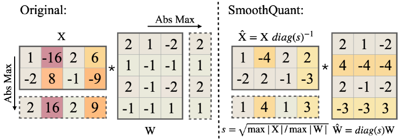

**图 5.** 当 $\alpha$ 为 $0.5$ 时, SmoothQuant 的主要思想. 平滑因子 $s$ 在校准样本上获得, 整个转换在离线完成. 运行时, 激活值是平滑的, 无需缩放.

我们在这里引入一个超参数, 迁移强度 $\alpha$, 用来控制我们希望将多少难度从激活迁移到权重, 使用以下方程:

$$
\mathbf{s}_{j}=\max(|\mathbf{X}_{j}|)^{\alpha}/\max(|\mathbf{W}_{j}|)^{1-\alpha}\tag{4}
$$

我们发现对于大多数模型, 例如所有 OPT [Zha22] 和 BLOOM [Les23] 模型, $\alpha=0.5$ 是一个平衡点, 可以均匀地分配量化难度, 特别是在我们对权重和激活使用相同量化器 (例如每张量, 静态量化) 时. 该公式确保对应通道的权重和激活具有相似的最大值, 从而共享相同的量化难度. [图 5](#figure-05) 展示了当我们采用 $\alpha=0.5$ 时的平滑转换. 对于一些激活异常值更显著的其他模型 (例如 GLM-130B [Zen22] 有 $\sim$ 30%的异常值, 这些对激活量化更困难), 我们可以选择更大的 $\alpha$ 将更多的量化难度迁移到权重 (如 0.75).

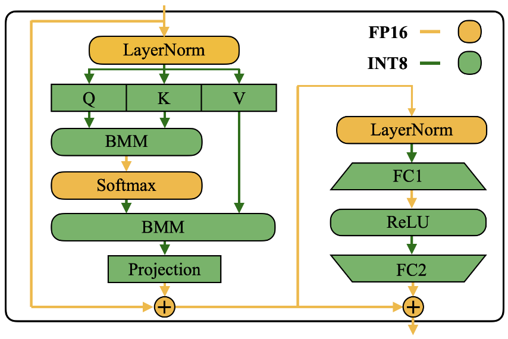

**图 6.** SmoothQuant 在 Transformer 块中的精度映射. 所有计算密集型操作如线性层和批量矩阵乘(BMM)使用 INT8 运算.

#### 将 SmoothQuant 应用于 Transformer 块.

线性层占据了 LLM 模型的大部分参数和计算量. 默认情况下, 我们对自注意力和前馈层的输入激活进行比例平滑, 并使用 W8A8 对所有线性层进行量化. 我们还对注意力计算中的 BMM 操作进行量化. 我们为 [图 6](#figure-06) 中的 Transformer 块设计了量化流程. 我们对像线性层和注意力层中的 BMM 这种计算量大的操作的输入和权重进行 INT8 量化, 同时保持轻量级元素级操作 (如 ReLU, Softmax 和 LayerNorm) 的激活为 FP16. 这种设计有助于我们在精度和推理效率之间取得平衡.

## 5 实验

### 5.1 设置

#### 基线.

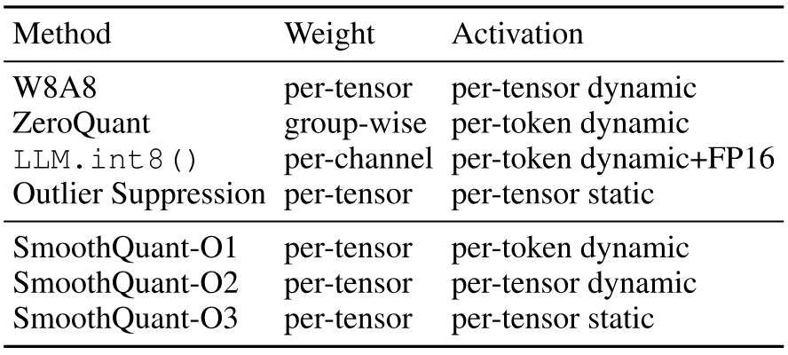

**表 2.** 基线和 SmoothQuant 的量化设置. 除非特别说明, 所有权重和激活均使用 INT8 表示. 对于 SmoothQuant, 效率从 O1 提升到 O3 (即延迟更低).

我们与 INT8 训练后量子化设置下的四个基线进行比较, 即未重新训练模型参数的 W8A8 量化, ZeroQuant [Yao22], LLM. int8 () [Det22] 和离群值抑制 [Wei22]. 由于 SmoothQuant 与量子化方案正交, 我们提供了从 O1 到 O3 的渐进高效量子化水平. 基线和 SmoothQuant 的详细量化方案见[表 2](#table-02) (#table-02).

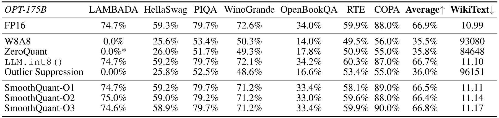

**表 3.** SmoothQuant 在 INT8 量化后仍能维持 OPT-175B 模型的准确性, 即使使用最激进且最高效的 O3 设置 ([表 2](#table-02)). 我们在 7 个零样本基准 (通过报告平均准确率) 和 1 个语言建模基准 (困惑度) 上进行了广泛的性能测试. *对于 ZeroQuant, 我们还尝试了将自注意的输入激活保持为 FP16, 其余部分量化为 INT8, 这是他们对 GPT-NeoX-20B 的解决方案. 但这并不能解决 OPT-175B 的准确性下降问题.

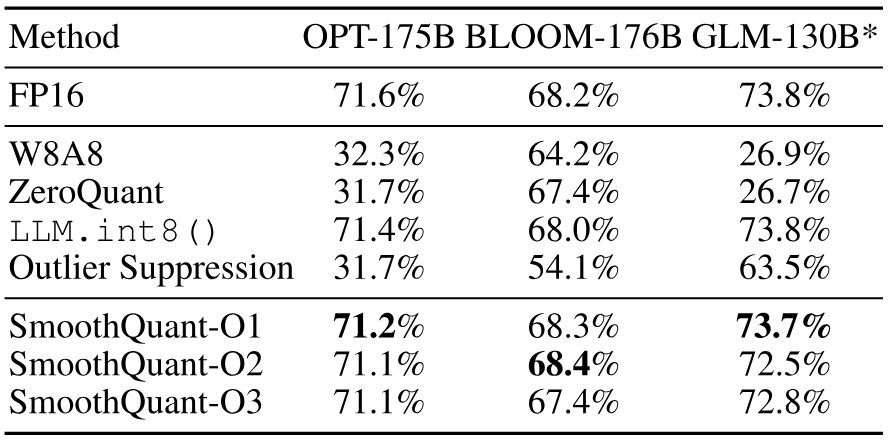

**表 4.** SmoothQuant 适用于不同的大型语言模型 (LLM). 我们可以将 3 个最大型, 公开可用的 LLM 模型量化为 INT8, 而不会降低准确率. 对于 OPT-175B 和 BLOOM-176B, 我们显示了 WinoGrande, HellaSwag, PIQA 和 LAMBADA 的平均准确率. 对于 GLM-130B, 我们显示了 LAMBADA, MMLU, MNLI 和 QNLI 的平均准确率. *由于数据集不同, 准确率不能按列进行比较.

#### 模型和数据集.

我们选择三大家族的 LLM 来评估 SmoothQuant: OPT [Zha22], BLOOM [Les23] 和 GLM-130B [Zen22]. 我们使用七个零样本评估任务: LAMBADA [Pap16], HellaSwag [Zel19b], PIQA [Bis20a], WinoGrande [Sak19], OpenBookQA [Mih18], RTE [Wan18d], COPA [Roe11], 以及一个语言建模数据集 WikiText [Mer16] 来评估 OPT 和 BLOOM 模型. 我们使用 MMLU [Hen20], MNLI [Wil18], QNLI [Wan18d] 和 LAMBADA 来评估 GLM-130B 模型, 因为上述一些基准在 GLM-130B 的训练集中出现过. 我们使用 lm-eval-harness [+1] 来评估 OPT 和 BLOOM 模型, 并使用 GLM-130B 的官方仓库 [+2] 进行其自身评估. 最后, 我们将方法扩展到 MT-NLG 530B [Smi22], 并首次实现了在单个节点上提供服务大于 500B 模型. 注意, 我们关注的是量化前后*相对*性能变化, 而非绝对值.

#### 激活平滑.

迁移强度 $\alpha=0.5$ 是所有 OPT 和 BLOOM 模型的通用最佳点, 而 GLM-130B 的 $\alpha=0.75$ 则更适合, 因为它的激活值更难量化 [Zen22]. 通过在 Pile [Gao20] 验证集的一个子集上进行快速网格搜索, 我们可以得到合适的 $\alpha$. 为了获得激活统计数据, 我们使用预训练数据集 Pile 中的 512 个随机句子 *一次* 校准平滑因子和静态量化步长, 并将相同的平滑和量化模型应用于所有下游任务. 通过这种方式, 我们可以对量化的 LLM 的通用性和零样本性能进行基准测试.

#### 实现.

我们使用两个后端实现 SmoothQuant: (1) PyTorch Huggingface [+3] 用于概念验证; (2) FasterTransformer [+4], 作为生产环境中高性能框架的示例. 在 PyTorch Huggingface 和 FasterTransformer 框架中, 我们使用 CUTLASS INT8 GEMM 内核实现了 INT8 线性模块和批量矩阵乘法 (BMM) 函数. 我们只需将原来的浮点 (FP16) 线性模块和 bmm 函数替换为我们的 INT8 内核, 即可得到 INT8 模型.

### 5.2 精确量化

#### OPT-175B 的结果.

SmoothQuant 可以处理非常大的 LLM 的量化, 这些模型的激活更难量化. 我们在 OPT-175B 上研究了量化. 如 [表 3](#table-03) 所示, SmoothQuant 可以在所有评估数据集上与所有量化方案匹配 FP16 精度. LLM. int8() 能够匹配浮点精度, 因为它们使用浮点值来表示异常值, 这会导致较大的延迟开销 ([表 10](#table-10)). W8A8, ZeroQuant 和 Outlier Suppression 基线产生几乎随机的结果, 这表明天真地量化 LLM 的激活会破坏其性能.

#### 不同 LLM 的结果.

SmoothQuant 可以应用于各种大型语言模型 (LLM) 设计. 在 [表 4](#table-04) 中, 我们展示了 SmoothQuant 可以对所有现有的超过 100B 参数的开源 LLM 进行量化. 与 OPT-175B 模型相比, BLOOM-176B 模型更容易量化: 没有任何基线方法会完全破坏模型; 即使是最简单的 W8A8 每张量动态量化也仅使精度下降 4%. SmoothQuant 的 O1 和 O2 级别成功地保持了浮点精度, 而 O3 级别 (每张量静态) 会让平均精度下降 0.8%, 我们将此归因于静态收集的统计数据与实际评估样本激活统计数据之间的差异. 相反, GLM-130B 模型更难量化 (这与 [Zen22] 的发现一致). 尽管如此, SmoothQuant-O1 可以匹配 FP16 精度, 而 SmoothQuant-O3 仅使精度下降 1%, 这显著优于基线方法. 需要注意的是, 在校准 GLM-130B 静态量化步长时, 我们按照 [Wei22] 剪裁了前 2% 的 token. 需要注意的是, 不同的模型/训练设计量化难度不同, 我们希望这能为未来的研究提供启发.

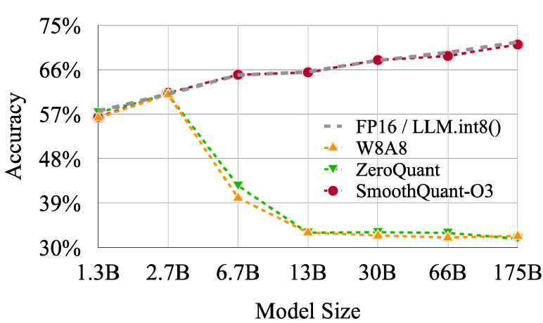

**图 7.** SmoothQuant-O3 (最高效的设置, 在 [表 2](#table-02) 中定义) 在量化为 INT8 时保持了不同规模 OPT 模型的精度. LLM. int8() 需要混合精度, 并且会导致速度下降.

#### 不同规模 LLM 的结果.

SmoothQuant 不仅适用于超过 100B 参数的非常大 LLM, 也适用于较小的 LLM. 在 [图 7](#figure-07) 中, 我们展示了 SmoothQuant 可以适用于所有规模的 OPT 模型, 在 INT8 量化下匹配 FP16 精度.

#### Instruction-Tuned LLM 结果

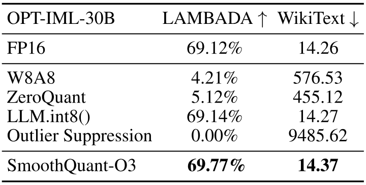

**表 5.** SmoothQuant 在 OPT-IML 模型上的性能.

如 [表 5](#table-05) 所示, SmoothQuant 同样适用于指令微调的 LLMs. 我们在 OPT-IML-30B 模型上使用 WikiText-2 和 LAMBADA 数据集测试了 SmoothQuant. 结果表明, SmoothQuant 能够在 W8A8 量化下成功保持模型精度, 而基线方法则无法做到. SmoothQuant 是一种通用方法, 旨在平衡 Transformer 模型的量化难度. 由于指令微调 LLMs 的架构与普通 LLMs 并无根本差异, 且其预训练过程非常相似, 因此 SmoothQuant 也适用于指令微调 LLMs.

#### LLaMA 模型结果

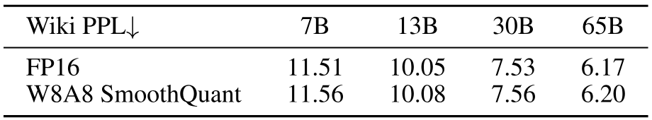

**表 6.** SmoothQuant 可以实现 LLaMA 模型的无损 W8A8 量化. 结果为 WikiText-2 数据集上的困惑度. 我们使用了每个 token 的激活量化, 并对 SmoothQuant 采用 =0.8.

LLaMA 模型是性能卓越的新型开放语言模型 [Tou23]. 通过初步实验, 我们发现与 OPT 和 BLOOM 等模型相比, LLaMA 模型通常具有较轻的激活异常值问题. 尽管如此, SmoothQuant 对 LLaMA 模型仍然非常有效. 我们在 [表 6](#table-06) 中提供了 LLaMA W8A8 量化的一些初步结果. SmoothQuant 可以实现 W8A8 量化, 同时性能下降可以忽略不计.

### 5.3 加速与内存节省

在本节中, 我们展示了将 SmoothQuant-O3 集成到 PyTorch 和 FasterTransformer 后的实际加速与内存节省情况.

#### 上下文阶段: PyTorch 实现.

我们测量了一次性生成一个批次的 4 个句子的所有隐藏状态的端到端延迟, 即上下文阶段的延迟. 我们记录了该过程中 (汇总的) 峰值 GPU 内存使用情况. 我们仅将 SmoothQuant 与 LLM. int8() 进行比较, 因为它是唯一可以在所有规模下保持 LLM 精度的现有量化方法. 由于 Huggingface 缺少对模型并行的支持, 我们仅在单 GPU 上测量了 PyTorch 实现的 SmoothQuant 性能, 因此我们选择了 OPT-6.7B, OPT-13B 和 OPT-30B 进行评估. 在 FasterTransformer 库中, SmoothQuant 可以与张量并行 [Sho19] 算法无缝协作, 因此我们在 OPT-13B, OPT-30B, OPT-66B 和 OPT-175B 上测试了 SmoothQuant 的单 GPU 和多 GPU 基准性能. 我们所有的实验均在 NVIDIA A100 80GB GPU 服务器上进行.

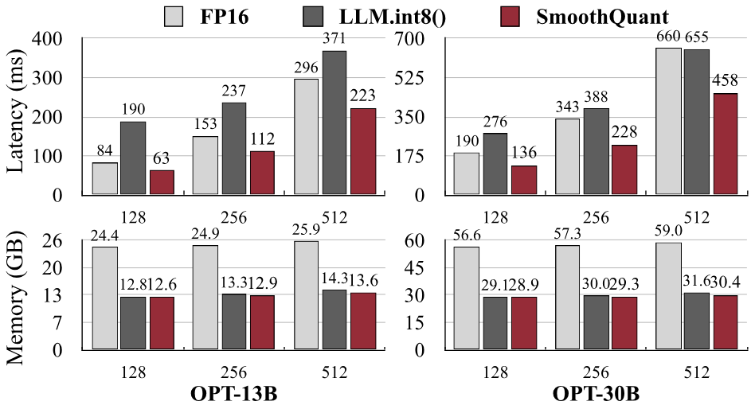

**图 8.** SmoothQuant-O3 的 PyTorch 实现对于单个 NVIDIA A100-80GB GPU 上的 OPT 模型可实现最多 1.51$\times$ 的加速和 1.96$\times$ 的内存节省, 而 LLM. int8() 在大多数情况下会减慢推理速度.

在[图 8](#figure-08) 中, 我们展示了基于 PyTorch 实现的推理延迟和峰值内存使用情况. SmoothQuant 始终比 FP16 基线更快, 当序列长度为 256 时, 在 OPT-30B 上获得了 1.51 倍的加速. 我们还看到一个趋势, 即模型越大, 加速效果越显著. 另一方面, LLM. int8() 几乎总是比 FP16 基线慢, 这是由于混合精度激活表示的巨大开销. 在内存方面, SmoothQuant 和 LLM. int8() 都几乎可以将 FP16 模型的内存使用减半, 而 SmoothQuant 节省的内存略多, 因为它使用的是全 INT8 的 GEMM.

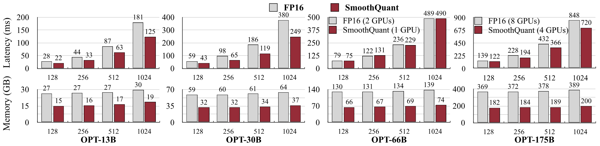

**图 9.** NVIDIA A100-80GB GPU 上 FasterTransformer 实现的推理延迟 (上) 和内存使用 (下). 对于较小的模型, 通过 SmoothQuant-O3 相比 FP16 延迟可以显著降低, 最高可达 1.56 倍. 对于较大的模型 (OPT-66B 和 175B), 我们可以在仅使用一半 GPU 数量的情况下实现相似甚至更快的推理. 与 FP16 相比, 内存占用几乎减半.

#### 上下文阶段: FasterTransformer 实现.

如[图 9](#figure-09) (上) 所示, 与 FasterTransformer 的 OPT FP16 实现相比, SmoothQuant-O3 在使用单个 GPU 时可以进一步将 OPT-13B 和 OPT-30B 的执行延迟减少最多 1.56$\times$. 这很具有挑战性, 因为 FasterTransformer 相比于 OPT-30B 的 PyTorch 实现已经快了 3$\times$ 以上. 对于必须分布在多个 GPU 上的更大模型, SmoothQuant 仅使用*一半*的 GPU 数量 (OPT-66B 使用 1 个 GPU 而不是 2 个, OPT-175B 使用 4 个 GPU 而不是 8 个) 就能实现相似甚至更好的延迟. 这可以大大降低 LLM 服务的成本. 正如[图 9](#figure-09) (下) 所示, 使用 SmoothQuant-O3 在 FasterTransformer 中的内存占用几乎减少了 2$\times$ 倍.

#### 解码阶段.

在 [表 7](#table-07) 中, 我们展示了 SmoothQuant 可以显著加速 LLM 的自回归解码阶段. 与 FP16 相比, SmoothQuant 持续减少每个 token 的解码延迟 (最高加速 1.42 倍). 另外, SmoothQuant 将 LLM 推理的内存占用减半, 使得以显著更低成本部署 LLM 成为可能.

**表 7.** SmoothQuant 在解码阶段的性能.

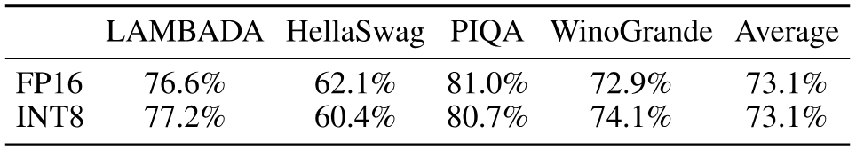

**表 8.** SmoothQuant 可以将 MT-NLG 530B 量化到 W8A8, 几乎没有精度损失.

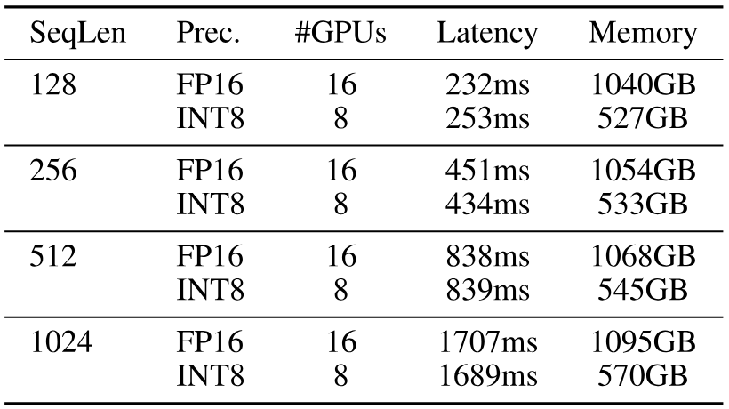

**表 9.** 在提供 MT-NLG 530B 服务时, SmoothQuant 可以在相似延迟下将内存减半, 并使用*一半*数量的 GPU, 从而允许在单节点内提供 530B 模型服务.

### 5.4 扩展: 单节点内的 530B 模型

我们可以将 SmoothQuant 进一步扩展到超过 500B 级别的模型, 实现对 MT-NLG 530B [Smi22] 的高效且准确的 W8A8 量化. 如 [表 8](#table-08) 和 [表 9](#table-09) 所示, SmoothQuant 可以在可忽略的精度损失下对 530B 模型进行 W8A8 量化. 减少后的模型大小允许我们在相似延迟下使用一半数量的 GPU (从 16 个降至 8 个) 来部署模型, 从而在单节点 (8$\times$A100 80GB GPU) 上服务 >500B 的模型.

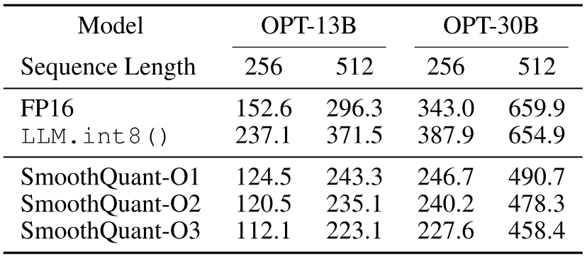

**表 10.** 不同量化方案的 GPU 延迟 (毫秒). 量化方案越粗 (从每 token 到每 tensor, 从动态到静态, 从 O1 到 O3, 如 [表 2](#table-02) 所定义), 延迟越低. SmoothQuant 在所有设置下相比 FP16 都实现了更低的延迟, 而 LLM. int8() 大多情况下更慢. 批量大小为 4.

### 5.5 消融研究

#### 量化方案

[表 10](#table-10) 显示了基于我们 PyTorch 实现的不同量化方案的推理延迟. 我们可以看到, 量化粒度越粗 (从 O1 到 O3), 延迟越低. 而静态量化与动态量化相比可以显著加速推理, 因为我们在运行时无需再计算量化步长. SmoothQuant 在所有设置下都比 FP16 基线更快, 而 LLM. int8() 通常更慢. 如果精度允许, 我们建议使用更粗的量化方案.

#### 迁移强度

我们需要找到合适的迁移强度 $\alpha$ (见公式 [4](#S4.E4)) 来平衡权重和激活的量化难度. 我们在 [图 10](#figure-10) 中消融了不同 $\alpha$ 在 OPT-175B 上使用 LAMBADA 的效果. 当 $\alpha$ 太小时 (<0.4), the activations are hard to quantize; when $\alpha$ is too large (>0.6), 权重将难以量化. 只有当我们选择 $\alpha$ 位于最佳区域 (0.4-0.6) 时, 才能对权重和激活都获得较小的量化误差, 并在量化后保持模型性能.

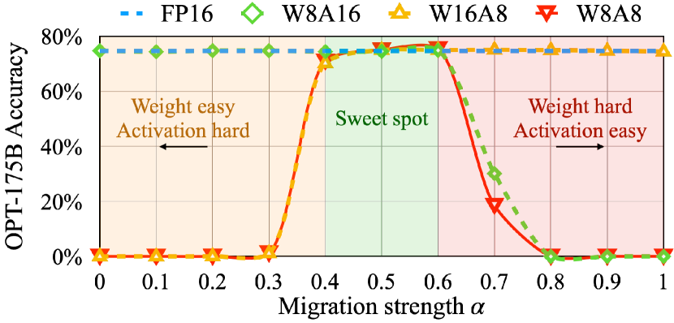

**图 10.** 合适的迁移强度 $\alpha$ (最佳点) 使激活和权重都易于量化. 如果 $\alpha$ 太大, 权重将难以量化; 如果太小, 激活将难以量化.

## 6 相关工作

#### 大型语言模型 (LLMs).

预训练语言模型通过*扩展规模*在各种基准测试中取得了显著的表现. GPT-3 [Bro77] 是第一个参数量超过 1000 亿的 LLM, 并取得了令人印象深刻的少样本/零样本学习结果. 后续的工作 [Rae21, Smi22, Du22, Cho22a] 继续推动规模化的前沿, 参数量突破了 5000 亿. 然而, 随着语言模型规模的增大, 为此类模型提供推理服务变得昂贵且具有挑战性. 在本工作中, 我们展示了所提出的方法能够对三种最大的公开可用 LLM 进行量化: OPT-175B [Zha22], BLOOM-176B [Les23] 和 GLM-130B [Zen22], 甚至 MT-NLG 530B [Smi22], 从而降低内存成本并加速推理.

#### 模型量化.

量化是一种有效的减小模型大小和加速推理的方法. 它已被证明对各种卷积神经网络 (CNN) [Han16, Jac18, Nag19, Wan19, Lin20b] 和 Transformer [She20c, Kim21, Liu21, Wan20b, Bon21a] 都有效. 权重均衡 [Nag19] 和通道分割 [Zha19b] 通过抑制权重中的异常值来减少量化误差. 然而, 这些技术无法解决激活异常值问题, 而激活异常值是 LLM [Det22] 量化的主要瓶颈.

#### LLM 的量化.

GPTQ [Fra22] 仅对权重进行量化, 而不对激活进行量化 (请参见附录 [A](#A1) 中的简短讨论). ZeroQuant [Yao22] 和 nuQmm [Par22] 对大型语言模型使用按 token 和按组的量化方案, 这需要定制的 CUDA 内核. 它们评估的最大模型分别为 20B 和 2.7B, 并且无法保持像 OPT-175B 这样的 LLM 的性能. LLM. int8() [Det22] 使用混合 INT8/FP16 分解来处理激活异常值. 然而, 这种实现会导致较大的延迟开销, 甚至可能比 FP16 推理更慢. Outlier Suppression [Wei22] 使用非缩放 LayerNorm 和按 token 剪切来处理激活异常值. 然而, 它仅在小型语言模型 (如 BERT [Dev19a] 和 BART [Lew19]) 上成功, 而无法保持 LLM 的准确性 ([表 4](#table-04)). 我们的算法在无需重新训练的情况下, 通过高效的按张量静态量化方案, 保持 LLM (最高 176B, 这是我们能找到的最大开源 LLM) 的性能, 从而使我们能够使用现成的 INT8 GEMM 实现高硬件效率.

## 7 结论

我们提出了 SmoothQuant, 这是一种准确且高效的训练后量化方法, 使得 LLMs (参数量高达 530B) 的权重和激活可以无损地量化为 8 位. SmoothQuant 能够对 LLMs 中所有 GEMMs 的权重和激活同时进行量化, 相比混合精度激活量化基线, 大幅降低了推理延迟和内存使用. 我们将 SmoothQuant 集成到 PyTorch 和 FasterTransformer 中, 实现了最高 1.56 倍的 $\times$ 推理加速, 同时将内存占用减半. SmoothQuant 通过提供一站式解决方案来降低服务成本, 从而使 LLMs 的应用更加普及.

## 致谢

我们感谢 MIT-IBM Watson AI Lab, MIT AI Hardware Program, 亚马逊和 MIT Science Hub, 英伟达学术合作奖, Qualcomm 创新奖学金, 微软图灵学术项目以及 NSF 对本研究的支持. 我们感谢 Haotian Tang, Aohan Zeng, Eric Lin 和 Jilei Hou 的有益讨论.

## 附录 A 权重仅量化讨论

在本工作中, 我们研究了 W8A8 量化, 以便能够利用 INT8 GEMM 内核来提高吞吐量并加速推理. 另一种研究方向是只对 LLMs 的权重进行量化 (例如 GPTQ [Fra22]). 它会在推理过程中将量化权重即时转换为 FP16 进行矩阵乘法操作, 由于减少了数据加载, 这种方法也可以加快速度, 特别是在批量大小为 1 的生成阶段.

我们主要将我们的方法与现有的权重- 激活量化 (即 W8A8) 方法进行比较, 比如 [Det22, Yao22, Wei22], 因为它们在相同的设置下. 在这里, 我们希望对 LLM 设置下的仅权重量化方法进行简短讨论:

1. 首先, 我们曾尝试将我们的方法与 GPTQ [Fra22] 进行比较, 但由于实现方式不同而发现困难. GPTQ 的低位内核 [+5] 仅支持批量大小为 1 的生成阶段 (即一次处理单个 token), 并且无法支持上下文阶段 (广泛用于不同下游任务和聊天机器人) 或基于批次的设置. 另外, 其低位内核优化仅针对 OPT-175B 模型 (如 README 中所述). 同时, 我们的工作使用 FasterTransformer 来服务大型模型, 如果直接比较, 可能会带来不公平的优势.
2. GPTQ 在处理少量输入 token (其实验中为 1 个 token) 时可能表现更好, 因为该过程高度受内存限制. 相比之下, SmoothQuant 在批量设置或上下文阶段 (即处理的 token 数量较多时) 可能表现更好. 然而, 一些研究表明, 在生产环境中, 我们可以通过先进的批处理 [Yu22b] 在相似延迟下将 GPT 模型的服务吞吐量提高 37$\times$. 我们相信, 在生产环境中, 批处理将成为未来的标准, 而 SmoothQuant 将带来进一步改进, 即使在生成阶段也是如此.
3. 像聊天机器人这样的应用需要处理较长的上下文长度, 并可能在批处理设置下运行. 由于这两个因素, KV 缓存的内存大小不再可以忽略 (如 [Pop22a] 所示, 给定批量大小为 512 和上下文长度为 2048 时, KV 缓存总计 3TB, 比模型权重大 3$\times$ 倍). 在这种情况下, 激活量的量化也可以帮助减少存储 KV 缓存的内存开销.
4. 最后, 我们认为这两种设置在某种程度上是正交的. 我们相信可以整合 GPTQ 的方法以实现更好的权重量化, 并有可能实现 W4A4 量化, 这将带来更好的硬件效率 (NVIDIA Hopper GPU 架构支持 INT4 指令). 我们将把这一探索留给未来的工作.

[+1]: **[https://github.com/EleutherAI/lm-evaluation-harness](https://github.com/EleutherAI/lm-evaluation-harness)

[+2]: ††[https://github.com/THUDM/GLM-130B](https://github.com/THUDM/GLM-130B)

[+3]: ‡‡[https://github.com/huggingface/transformers](https://github.com/huggingface/transformers)

[+4]: §§[https://github.com/NVIDIA/FasterTransformer](https://github.com/NVIDIA/FasterTransformer)

[+5]: ¶¶[https://github.com/IST-DASLab/gptq](https://github.com/IST-DASLab/gptq)
