> [Pratyush Patel](https://dblp.org/pid/201/1831.html) [+1], [Esha Choukse](https://www.microsoft.com/en-us/research/people/eschouks/), [Chaojie Zhang](https://www.microsoft.com/en-us/research/people/chaojiezhang/), [Aashaka Shah](https://aashaka.github.io/), [Íñigo Goiri](https://www.microsoft.com/en-us/research/people/inigog/), [Saeed Maleki](http://polaris.cs.uiuc.edu/~maleki1/), [Ricardo Bianchini](https://www.microsoft.com/en-us/research/people/ricardob/). 2023 年 11 月 30 日首次提交至 arXiv; 当前版本为 v2, 修订于 2024 年 5 月 20 日. 发表于 ISCA 2024, 页码 118-132. [Splitwise: Efficient Generative LLM Inference Using Phase Splitting](https://arxiv.org/abs/2311.18677v2). [原始 PDF](/paper/splitwise.pdf). [DOI](https://doi.org/10.1109/ISCA59077.2024.00019). [TeX 源码](https://export.arxiv.org/e-print/2311.18677v2). 精确的印刷版式和参考文献以原始 PDF 为准.

## 摘要

生成式大语言模型 (LLM) 应用正在快速增长, 促使业界大规模部署昂贵且耗电的 GPU. 我们对 LLM 推理的特征分析表明, 每个推理请求都会经历两个阶段: 计算密集的提示计算阶段和内存密集的 token 生成阶段; 两者在延迟、吞吐量、内存和功耗方面各有特点. 即使采用最先进的批处理和调度技术, token 生成阶段仍未充分利用计算资源. 与提示计算不同, token 生成不需要最新 GPU 的计算能力, 可以用更低的功耗和成本运行.

基于这些发现, 我们提出 Splitwise, 一种把 LLM 推理请求的两个阶段拆分到不同机器上的模型部署和调度技术. Splitwise 可以针对各阶段独立管理资源, 并为每个阶段采用更合适的硬件. 系统利用当今 GPU 集群中的高速背板互连和经过优化的网络库, 在机器之间高效传输请求状态. 借助 Splitwise, 我们设计了针对吞吐量、成本和功耗优化的同构与异构 LLM 推理集群. 与现有设计相比, Splitwise 集群能以低 20% 的成本取得最高 $1.4\times$ 的吞吐量. 或者, 在相同功耗和成本预算下, 它们能提供 $2.35\times$ 的吞吐量.

## 1 引言

生成式大语言模型 (LLM) 近年来的进展显著提高了回答质量和准确性 [Ope23f, Sch23b]. 这些趋势推动 LLM 在各个领域得到广泛采用 [Goo24, Mic24]. 现代 LLM 大多基于 Transformer 架构 [Wol19, Vas17d], 并呈现相似的特征 [Pat24c]. Transformer 模型的规模持续增长: 早期 BERT 模型 [Dev19b] 有 3.4 亿个参数, GPT-3 [Oth20] 达到惊人的 1750 亿个参数, 而据传 GPT-4 的参数更多.

LLM 通常运行在昂贵且耗电的 GPU 上 [Nvi23f]. LLM 突然开始大规模部署, 导致全球 GPU 容量紧缺 [Nvi23d]. 大量应用采用 LLM, 使 LLM 推理的计算需求远高于训练. 训练 LLM 需要昂贵的专用超级计算机 [Ope22b, Lee22], 因而必须执行大量推理才能摊销高昂的训练成本. 尽管 LLM 推理作业比训练小几个数量级, 所需计算仍使其成本不菲.

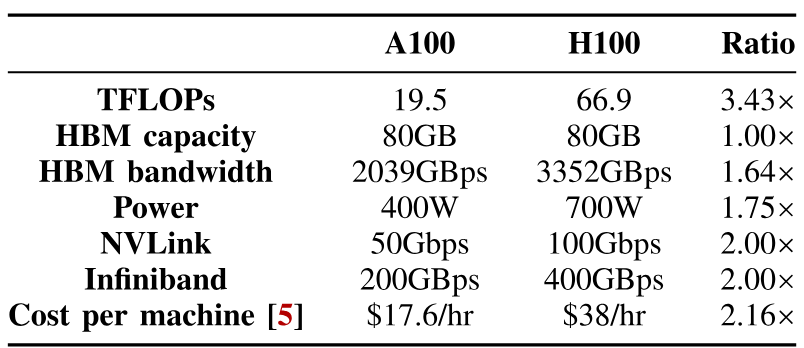

**表 1.** NVIDIA A100 与 H100 的规格对比.

单个请求的生成式 LLM 推理由模型的多次前向传播组成, 因为输出 token 是逐个生成的. 这天然形成了两个计算特征相反的阶段. 第一个是*提示计算阶段*: 所有输入提示 token 在模型的一次前向传播中并行计算, 以生成第一个输出 token. 这一阶段往往是计算密集型的, 需要当今最新 GPU 提供的高 FLOPs (每秒浮点运算次数). 第二个是*token 生成阶段*: 后续输出 token 根据上一个 token 的前向传播结果以及序列中之前 token 的全部缓存上下文依次生成. 即使采用最先进的批处理技术, 由于缺乏计算并行性, 这一阶段仍更受内存带宽和容量限制. 把两个阶段放在同一台机器上运行时, 提示阶段和 token 阶段的任意混批往往造成不稳定的端到端延迟. 这些问题迫使服务过量配置昂贵的 GPU, 才能满足交互式应用严格的推理服务级别目标 (SLO). 与此同时, 云服务提供商 (CSP) 为满足 GPU 需求不得不建设大量新数据中心, 并且正面临功耗墙 [Pow23].

业界不断推出计算能力更强的新 GPU, 每一代都比上一代更耗电、更昂贵. 但如[表 1](#table-01) 所示, 这些 GPU 的高带宽内存 (HBM) 容量和带宽最近并未以同样速度增长. 最新的 NVIDIA H100 GPU 相比上一代 A100, 计算能力为 $3.43\times$, 功耗为 $1.75\times$. 但其内存带宽只增长到 $1.6\times$, 内存容量没有增加.

**我们的工作.** 鉴于提示计算阶段和 token 生成阶段的特性不同, 我们提出把一个推理请求拆开, 在不同机器上运行两个阶段. 这样可以分别管理各阶段的硬件资源, 提高 GPU 利用率和系统整体效率, 也能为每个阶段采用不同且更合适的硬件. 要实现这种部署, 必须以低延迟把提示计算得到的缓存上下文从提示处理机器传到 token 生成机器. 我们在当今数据中心已有的后端 InfiniBand 互连上优化了这类传输, 从而在用户感受不到性能损失的情况下提高效率.

借助 Splitwise, 我们使用 LLM 推理请求的生产轨迹 [Azu24], 设计针对成本、吞吐量和功耗优化的集群. 由于不同代 GPU 的内存与计算能力增长速度逐渐分化, 我们还针对不同推理阶段评估了不同 GPU 和功耗上限. 用户由此可以获得更好的单位成本性能 (Perf/&#36;), CSP 则能获得更好的单位功耗性能 (Perf/W). 用户也可以选用更容易获得的旧款 GPU.

我们的结果表明, 基于 Splitwise 的 LLM 推理集群能以低 20% 的成本取得比现有集群高 $1.4\times$ 的吞吐量. 或者, 它们能在相同成本和功耗预算下提供 $2.35\times$ 的吞吐量.

**总结.** 本文作出以下贡献:

1.  使用生产轨迹, 在 NVIDIA A100 和 H100 GPU 上全面分析 LLM 推理中提示阶段与 token 生成阶段的执行和利用模式差异.

2.  提出 Splitwise, 通过把提示计算阶段和 token 生成阶段拆分到不同机器上, 优化现有硬件的利用率.

3.  探索使用 Splitwise 部署同构和异构集群的设计空间, 以优化总成本、请求吞吐量和配置功耗.

4.  使用生产轨迹评估基于 Splitwise 设计的系统.

## 2 背景

### 2.1 大语言模型

现代 LLM 基于 Transformer. Transformer 模型分别使用注意力 [Vas17d] 和多层感知机层来理解输入并生成输出. 基于 Transformer 的 LLM 包括仅编码器 [Dev19b, Liu19a]、仅解码器 [Rad19b, Les23, Sch23b] 和编码器-解码器 [Sch23a] 模型. 本文关注的生成式 LLM 通常是仅解码器模型或编码器-解码器模型.

### 2.2 生成式 LLM 的推理阶段

[图 1](#figure-01) 给出了生成式 LLM 推理的一个示例. 收到提示查询后, 系统在一次迭代内并行计算所有输入 token, 生成第一个 token. 我们把它称为提示处理阶段. 提示计算期间, 注意力层产生的上下文会保存在键值 (KV) 缓存中, 因为后续所有 token 生成迭代都需要这些上下文. 第一个 token 生成后, 后续 token 的模型前向传播只以上一个生成的 token 和 KV 缓存作为输入. 因此, 与计算繁重的提示阶段相比, 后续 token 生成更依赖内存带宽和容量.

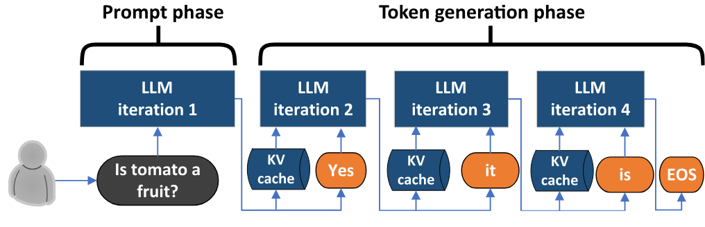

**图 1.** LLM 推理示例.

### 2.3 LLM 的性能指标

先前工作为 LLM 推理提出了三个主要指标: 端到端 (E2E) 延迟、首 token 时间 (TTFT) 和吞吐量. 我们增加了另一个延迟指标, 即 token 间时间 (TBT), 用于跟踪 token 依次生成时的在线流式吞吐量. [表 2](#table-02) 总结了本文考虑的主要性能指标.

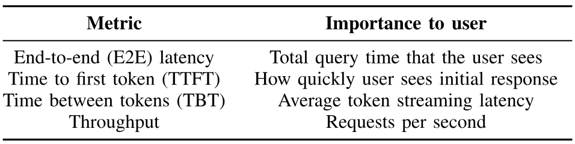

**表 2.** LLM 的性能指标.

生成式 LLM 可用于多种任务, 各类任务的 SLO 不同. 对批处理任务 (例如摘要) 而言, TTFT 或 TBT 延迟指标不如吞吐量重要. 对延迟敏感的任务 (例如对话 API) 则更看重 TTFT 和 TBT, 相应的 SLO 也更严格.

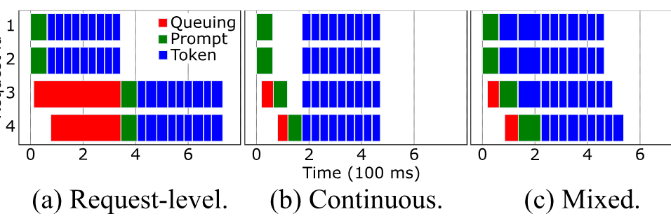

**图 2.** 批处理机制及其对提示阶段和 token 阶段延迟的影响.

### 2.4 请求批处理

推理请求可以组成批次, 以提高吞吐量. 多项先前工作研究了批处理 [Yu22a, Agr23]. [图 2](#figure-02) 展示了三种常见批处理机制下的推理时间线. 默认机制只在*请求级*组批 ([图 2a](#figure-02)). 此时, 已就绪的请求会组成批次, 但必须完成这些请求的全部前向传播后, 才会运行其他请求. 请求的 token 生成阶段可能很长, 因而中途到达的请求可能等待很久, 造成较高的 TTFT 和 E2E 延迟. 一种优化是*连续批处理* [Yu22a] ([图 2b](#figure-02)). 此时, 模型每次前向传播前都会作出调度决策. 但任一批次要么只包含处于提示阶段的请求, 要么只包含处于 token 阶段的请求. 提示阶段会影响 TTFT, 因而被视为更重要; 等待中的提示可以抢占 token 阶段. 这会缩短 TTFT, 却可能大幅拉高 TBT 尾延迟, 进而增大 E2E 延迟. 最后一种是*混合批处理* ([图 2c](#figure-02)) [Agr23]. 这种机制在每次前向传播时作出调度决策, 提示阶段和 token 阶段可以同时运行. 它能减轻对 TBT 的影响, 但无法完全消除, 因为与提示阶段一同调度的 token 阶段会运行得更久. 除非另有说明, 本文其余部分均采用混合批处理.

### 2.5 模型并行

模型并行可以把模型分到多个 GPU, 乃至多台机器上, 以提高效率和内存容量. LLM 推理通常采用流水线并行和张量并行. 流水线并行 (PP) 把模型各层分配给不同 GPU, 同一层中的所有算子和张量仍位于同一 GPU. 张量并行 (TP) 把张量拆分到多个 GPU, 同时在每个 GPU 上复制所有层. 流水线并行在参与计算的 GPU 之间所需通信较少, 张量并行则要求每一层都有高带宽通信. 一般而言, 对同一台机器内通过 NVLink [Nvi23e] 等高带宽互连连接的 GPU, 张量并行表现更好. 本文其余部分在 8 个 GPU 上采用张量并行, 以获得最佳延迟.

### 2.6 GPU 集群与互连

随着 LLM 用例近来增多, 多家云服务提供商扩展了基于 GPU 的产品, 形成大规模 GPU 集群部署 [Lee22, Azu22, Cor23]. 这些 AI 集群中的每台机器通常配有 8 个 NVIDIA 旗舰 GPU (A100 或 H100). 每个 GPU 都通过高带宽 Mellanox InfiniBand 互连 [Nvi23c, Mic23] 与集群内其他 GPU 相连, 组成高带宽数据平面网络. 目前云端提供的 InfiniBand 带宽在每对 GPU 25-50 GBps 之间 [Mic23, Hpc23].

## 3 特征分析

本节分析 LLM 推理的性能和资源利用特征, 并从中提炼指导 Splitwise 设计的主要结论.

**生产轨迹.** 我们使用 2023 年 11 月 11 日采集自两个 Azure LLM 推理服务的生产轨迹. 这些轨迹代表当今 LLM 推理中最常见的两类场景: *代码补全*和*对话*. 我们在 <https://github.com/Azure/AzurePublicDataset> 发布了部分轨迹 [Azu24]. 用于特征分析的轨迹时长为 20 分钟, 包含请求到达时间、输入大小 (提示 token 数) 和输出大小 (输出 token 数). 受客户隐私要求 (例如 GDPR) 限制, 我们无法查看提示内容. 因此, 我们根据生产轨迹确定输入和输出大小: 发送包含指定 token 数的输入提示, 并强制模型为每个请求生成相应数量的输出 token. 输入提示的文本不会影响我们测量的性能指标, 因为这些指标只取决于输入和输出大小. 在这项特征分析中, 为模拟具备安全保证的云服务, 我们不在请求之间复用 KV 缓存.

**模型.** [表 3](#table-03) 列出了我们评估的模型. BLOOM [Les23] 和 Llama2 [Sch23b] 都是最先进的开源 LLM, 也都是基于 Transformer 的仅解码器模型. 我们使用每种模型中参数最多的版本, 因为这些版本最能代表生产级准确性. 除非另有说明, 我们在一台配有 8 个 H100 [Nvi23f] GPU 的机器上, 使用 vLLM [Kwo23] 运行 BLOOM-176B 和 Llama-70B.

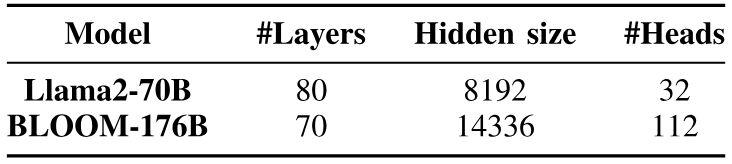

**表 3.** 评估的模型及其参数.

### 3.1 提示 token 与生成 token 的数量

为了更好地理解这些轨迹, 我们考察*提示输入*与*生成输出* token 数量的分布. [图 3a](#figure-03) 展示提示 token 数量的分布. 代码补全 LLM 推理服务通常在用户编写代码时生成补全内容, 因而其输入提示可能包含此前编写的大段代码. 所以, 该服务的提示大小中位数很大, 为 1500 个 token. 对话服务的输入提示 token 数量则分布更广, 因为它取决于用户. 这条轨迹的提示 token 数量中位数为 1020.

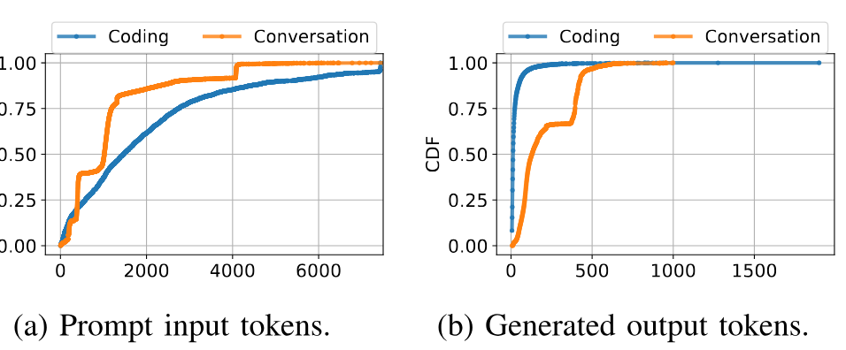

**图 3.** 提示 token 与生成 token 的分布.

[图 3b](#figure-03) 展示生成 token 数量的分布. 代码补全服务通常只在用户输入时生成程序中接下来的几个词, 因而输出 token 数量的中位数为 13. 对话服务的分布则近似双峰, 生成 token 数量的中位数为 129.

*结论 I:* 不同推理服务的提示和 token 分布可能差异很大.

### 3.2 批次利用率

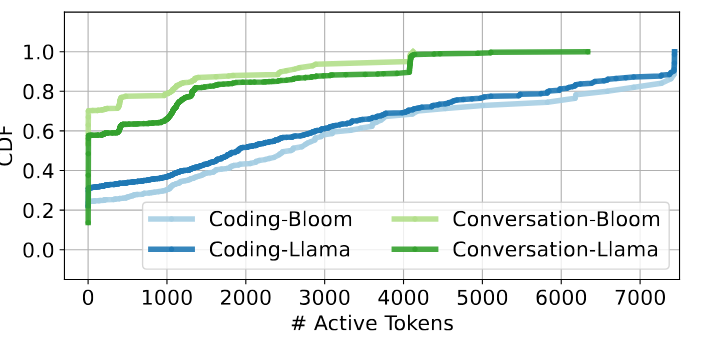

**图 4.** 以不同活跃 token 数组成批次时所用时间的累积分布.

为了解这些请求能在多大程度上组成批次, 我们测量机器以各种批次大小运行的频率. 我们采用[图 2](#figure-02) 所示的混合连续批处理. 为了能在一台机器内运行, 我们把代码补全和对话轨迹缩放到每秒 2 个请求.

[图 4](#figure-04) 展示机器以不同活跃 token 数组成批次运行时, 所用时间的分布. 如果一个包含 100 个 token 的提示正处于提示阶段, 我们把活跃 token 数计为 100. 但请求进入 token 阶段后, 活跃 token 数计为 1, 因为 token 是逐个生成的 (假设 beam search 大小为 1 [Kwo23]). 对话服务的大部分时间 (60-70%) 只运行 20 个或更少的 token. 代码补全服务输出 token 很少, 因而 token 阶段的批处理效果更差, 超过 20% 的时间只运行一个 token. 两种 LLM 呈现非常相似的趋势.

*结论 II:* 混合连续批处理的大部分时间里, 组成批次的活跃 token 很少.

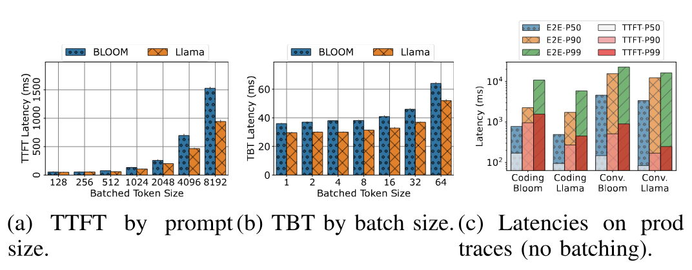

**图 5.** BLOOM-176B 和 Llama-70B 在 DGX-H100 上的 TTFT、TBT 与 E2E.

### 3.3 延迟

**TTFT.** [图 5a](#figure-05) 展示提示 token 数量对 TTFT 的影响. 大小范围根据代码补全和对话轨迹选取. 我们发现, 两种模型的 TTFT 都会随提示大小增加而近似线性增长. 原因是提示阶段 GPU 利用率高, 受计算能力限制.

**TBT.** [图 5b](#figure-05) 展示强制把不同请求的输出 token 组成批次对 TBT 的影响. 随批次大小增加, TBT 的变化很小. 批次大小为 64 时, TBT 只增加到 $2\times$.

**E2E.** [图 5c](#figure-05) 展示两种模型在不使用批处理时 E2E 延迟的不同百分位数. 请求输入和输出大小的差异清晰可见. 而且, E2E 时间大多花在 token 阶段. 即使代码补全轨迹的提示很大而生成 token 很少, 这一结论仍然成立. 实际上, 对 BLOOM-176B 而言, 包含 1500 个输入 token 的提示阶段与只生成 6 个输出 token 的 token 阶段耗时相同.

*结论 III:* 对大多数请求而言, E2E 时间主要花在 token 生成阶段.

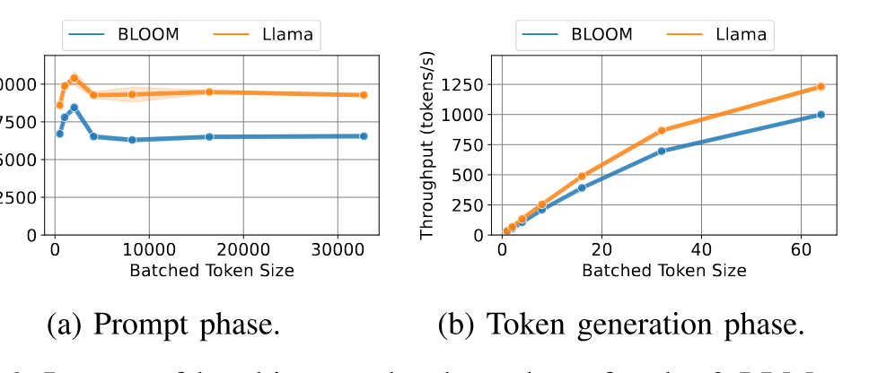

**图 6.** 批处理对两种 LLM 吞吐量的影响.

### 3.4 吞吐量

[图 6](#figure-06) 展示批处理对吞吐量 (以每秒 token 数衡量) 的影响. 对提示阶段, 吞吐量定义为每秒处理的提示输入 token 数. 提示 token 超过 2048 后吞吐量下降; 按轨迹中的提示大小中位数计算, 此时批次大小不到 2. 相比之下, [图 6b](#figure-06) 显示 token 阶段的吞吐量随批处理持续增长, 直到批次大小达到 64, 此时机器内存耗尽.

*结论 IV:* 应限制提示阶段的批次大小, 以保持良好性能. 相比之下, 对 token 生成阶段进行批处理能在没有负面影响的情况下取得高吞吐量.

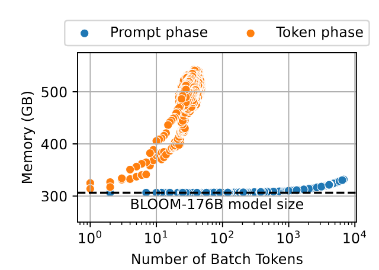

**图 7.** 提示/token 阶段采用批处理时所需的内存.

### 3.5 内存利用率

LLM 推理期间, GPU 内存用于存放模型权重、激活和 KV 缓存 ([第 2.2 节](#section-2-2)). 随着批次中的 token 数增加, KV 缓存所需的内存容量也会增加. [图 7](#figure-07) 展示批次 token 数增加时, 每个阶段的内存容量利用率. 在提示阶段, 输入提示 token 会生成 KV 缓存. 在输出 token 阶段, 正在处理的*每个*活跃生成 token 都会访问其到当前为止*整个上下文*的 KV 缓存.

*结论 V:* 提示阶段的批处理受计算能力限制, token 阶段则受内存容量限制.

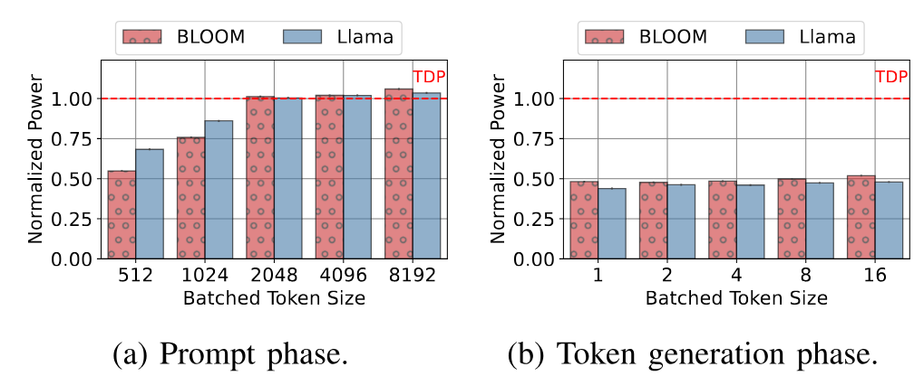

**图 8.** 随批次大小变化的最大功耗和平均功耗.

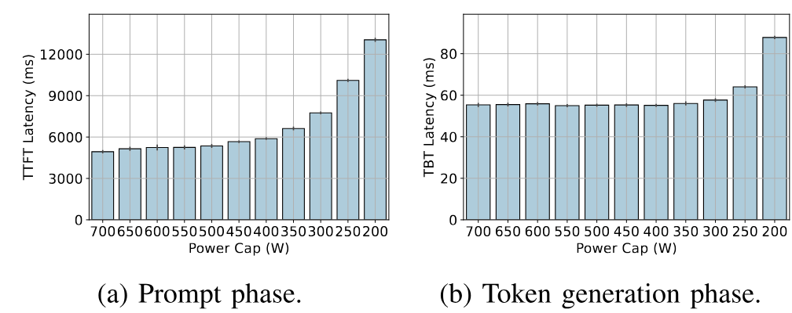

**图 9.** 在最大可用批次大小下, 功耗上限对提示阶段和 token 生成阶段延迟的影响.

### 3.6 功耗利用率

云服务提供商托管机器时需要考虑峰值功耗, 因为它直接影响数据中心成本 [Bar18]. 构建 GPU 集群时这一点尤其重要, 因为 GPU 的功耗远高于普通计算机器 [Pat24c, Pat23d]. [图 8](#figure-08) 展示运行提示阶段和 token 生成阶段时, 归一化到热设计功耗 (TDP) 的 GPU 功耗. 提示阶段为计算密集型, 所以其功耗随批次大小增加. token 阶段受内存限制, 增加待处理 token 数时, 功耗不会变化.

提供商可以限制机器功耗, 以降低峰值功耗. [图 9](#figure-09) 展示提高提示阶段和 token 阶段的功耗上限时, 对延迟的影响. 提示阶段对功耗上限非常敏感, 限制功耗会使延迟大幅增加. 相比之下, token 生成阶段即使把功耗上限降低 50% 以上 (即从 700 W 降至 350 W), 延迟也几乎不受影响.

*结论 VI:* 提示阶段能有效利用 GPU 的功耗预算, token 阶段则不能.

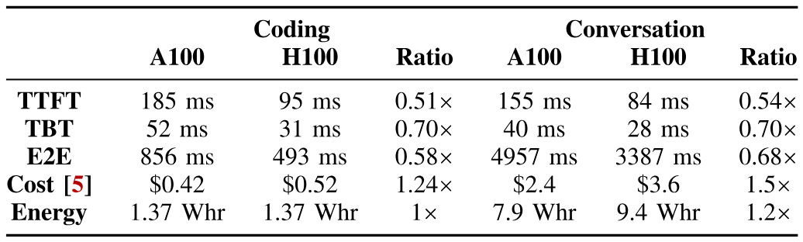

**表 4.** Llama-70B 不使用批处理时, A100 与 H100 上的 P50 请求指标.

### 3.7 GPU 硬件差异

鉴于提示阶段和 token 生成阶段特性不同, 我们测量在不同硬件上运行这两个阶段对性能的影响. [表 1](#table-01) 列出 DGX-A100 [Nvi23e] 和 DGX-H100 [Nvi23f] 的规格. 内存与计算能力的比值更有利于 A100. [表 4](#table-04) 给出我们的结果. 与提示阶段 (TTFT) 相比, token 生成阶段 (TBT) 受到的性能影响较小. 代码补全请求生成的 token 很少, 因而主要由提示阶段支配, 所以 A100 对代码补全 E2E 延迟的影响大于对话. A100 的总体推理成本和能耗也优于或等于 H100.

*结论 VII:* 在计算能力较弱的硬件上运行 token 生成, 可以提高 Perf/W 和 Perf/&#36; 效率.

## 4 Splitwise

根据特征分析所得结论, 我们提出 Splitwise, 把 LLM 推理的提示阶段和生成阶段拆分到不同机器上.

[图 10](#figure-10) 展示 Splitwise 的整体结构. 我们分别维护提示处理机器池和 token 处理机器池. 第三个机器池是混合池, 它会随工作负载的需要扩张或收缩. 所有机器都预先加载选定模型. 新推理请求到达时, 调度器为它分配一对机器 (即提示机器和 token 机器). 提示机器处理全部输入提示 token, 完成提示阶段并生成 KV 缓存和第一个 token. 它还会把 KV 缓存发送给 token 机器, 后者继续生成 token, 直到响应完成. token 机器采用连续批处理以最大化利用率. 混合池中的机器采用混合连续批处理.

请求率较低时, Splitwise 以降低延迟为目标; 请求率较高时, 则力求避免提示机器池与 token 机器池之间的碎片化降低性能或吞吐量.

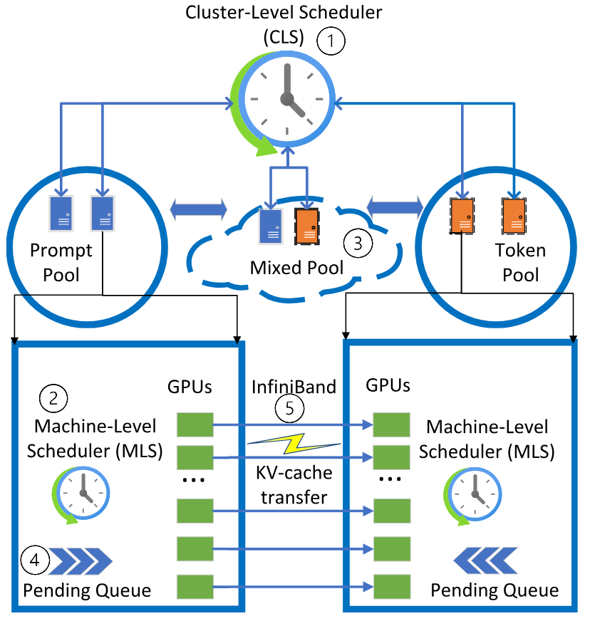

**图 10.** Splitwise 的整体系统图.

如[图 10](#figure-10) 所示, Splitwise 采用分层的两级调度. 集群级调度器 (CLS) ①负责管理机器池并路由传入的推理请求. 机器级调度器 (MLS) ②维护等待队列并管理每台机器上的请求批处理.

### 4.1 集群级调度

**机器池管理.** CLS 维护提示、token 和混合机器池③. Splitwise 首先根据预期请求负载和输入/输出 token 分布, 把机器分配到提示池或 token 池. 提示池或 token 池中的机器可以动态移入、移出混合池, 从而减少碎片化, 并在负载较高时满足 SLO. 混合池中的机器仍保留其提示机器或 token 机器身份; 等待队列中不再有相反类型的任务后, 便返回原机器池. 切换机器池不会产生可察觉的延迟. 如果负载分布与初始假设差异很大, Splitwise 会以较粗粒度*重新指定机器用途*, 在提示池与 token 池之间迁移机器. 这种操作并不频繁, 通常只在机器长时间停留于混合池时执行.

**请求路由.** CLS 使用 Join the Shortest Queue (JSQ) 调度 [Zhu00, Gup07], 为每个请求分配一台提示机器和一台 token 机器. 队列长度按等待中的 token 数定义. 每台机器会定期向 CLS 报告其内存容量或等待队列的变化, 而不是在每次迭代边界都报告. 调度请求时, 我们同时分配提示机器和 token 机器, 这样就能把 KV 缓存传输与提示计算重叠, 降低传输开销 ([第 4.3 节](#section-4-3)).

路由请求时, 如果等待队列超过某个阈值, CLS 会在混合池中寻找目标机器. 如果混合池也已满, 它会继续在相反的机器池中寻找 (例如找一台 token 机器来运行提示), 并把该机器移入混合池. 混合池中的机器与非 Splitwise 机器完全相同, 采用混合批处理. 混合请求的队列清空后, CLS 会把机器迁回原机器池. 例如, 队列过长时, 可以把一台提示机器移入混合池来运行 token; 机器完成 token 任务后, 再迁回提示池.

### 4.2 机器级调度

MLS 在每台机器上运行, 负责跟踪 GPU 内存利用率、维护等待队列④、决定每次迭代的批次, 并向 CLS 报告相关状态.

**提示机器.** MLS 直接使用先到先服务 (FCFS) 调度提示. [图 6a](#figure-06) 的结果显示, 提示 token 超过 2048 后吞吐量会下降. 因此, MLS 把多个提示组成的批次限制在总计 2048 个 token 以内. 该值可以配置, 并可针对不同模型或硬件调整.

**Token 机器.** MLS 使用 FCFS 调度 token, 并尽可能扩大批次. [图 6b](#figure-06) 显示, token 生成吞吐量会随批次大小持续增长, 直到机器内存耗尽. 因此, MLS 会跟踪内存, 在机器即将耗尽内存时开始让 token 排队.

**混合机器.** 为满足 TTFT SLO, MLS 必须优先运行提示, 立即调度等待队列中的所有新提示. 如果机器正在运行 token 阶段, 又没有额外容量运行提示阶段, MLS 会*抢占* token. 为避免 token 阶段因抢占而*饥饿*, 我们会随 token 等待时间增长而提高其优先级, 并限制每个请求可被抢占的次数.

### 4.3 KV 缓存传输

如[第 2 节](#section-2) 所述, KV 缓存在请求的提示阶段生成, 并在 token 生成阶段持续增长. 在 Splitwise 中, 必须把 KV 缓存从提示机器传到 token 机器⑤ (见[图 10](#figure-10)), 才能完成推理. 该传输延迟是 Splitwise 的主要开销. 本节讨论 KV 缓存传输的影响及其优化方法.

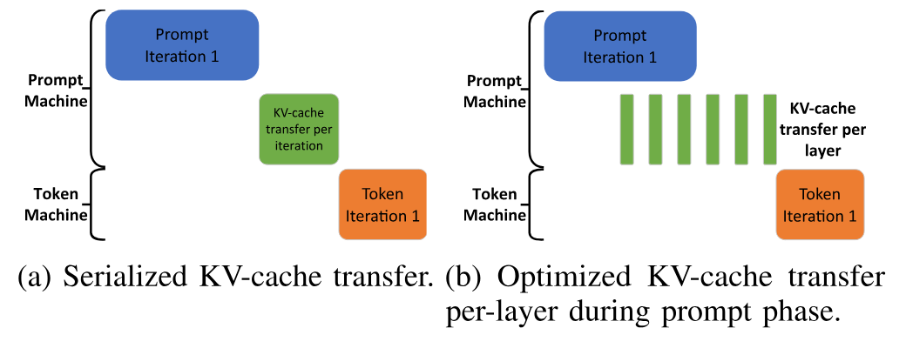

**图 11.** Splitwise 中的 KV 缓存传输优化.

[图 11a](#figure-11) 是单批请求采用朴素串行 KV 缓存传输时, 提示阶段、KV 缓存传输和 token 生成阶段的甘特图. KV 缓存传输要等提示阶段结束并生成第一个 token 后才开始. 而且, 传输必须完成, token 生成阶段才能生成下一个输出 token. 这会直接影响最大 TBT 和推理端到端延迟.

传输所需时间取决于 KV 缓存大小 (与提示 token 数量成正比) 以及提示机器与 token 机器间的互连带宽. 即使使用高速 InfiniBand 链路, 较大提示的传输开销也可能占 TBT 的很大一部分.

Splitwise 把 KV 缓存传输与提示阶段的计算重叠, 以优化传输. LLM 在提示机器上逐层计算时, 也会生成对应层的 KV 缓存. 每层结束时, 我们异步传输该层的 KV 缓存, 同时继续计算下一层. [图 11b](#figure-11) 展示这种可降低传输开销的异步传输. 逐层传输还支持其他优化, 例如让 token 机器更早开始 token 阶段, 也让提示机器更早释放 KV 缓存内存.

逐层 KV 缓存传输与下一层的提示计算并行, 因而需要逐层细粒度同步来保证正确性. 这可能造成性能干扰并增加 TTFT, 对较小提示尤其如此. 但小提示的 KV 缓存总量也较小, 无需逐层传输来隐藏延迟. 批次中的 token 数在计算开始时已经确定, 所以 Splitwise 会选择最合适的 KV 缓存传输方式: 小提示采用串行传输, 大提示采用逐层传输. [第 6.1 节](#section-6-1) 表明, 总体传输和干扰开销相对较小.

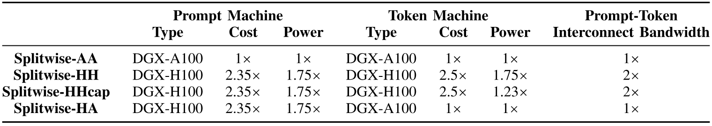

**表 5.** 评估的 Splitwise 设计, 均归一化到 DGX-A100.

### 4.4 使用 Splitwise 配置集群

我们利用 Splitwise 针对功耗、成本和吞吐量优化 LLM 推理集群部署.

**机器类型.** 我们提出四种主要的 Splitwise 系统变体: *Splitwise-AA*、*Splitwise-HH*、*Splitwise-HA* 和 *Splitwise-HHcap*. 名称的第一个字母表示提示机器类型, 第二个字母表示 token 机器类型. “A”表示 DGX-A100, “H”表示 DGX-H100, “Hcap”表示限制功耗的 DGX-H100. [表 5](#table-05) 汇总了所评估各系统的成本、功耗和硬件.

Splitwise-AA 的提示池和 token 池均使用 DGX-A100, Splitwise-HH 则均使用 DGX-H100. 这两种变体代表提供商常见的同构且可互换机器部署.

Splitwise-HA 的提示池使用 DGX-H100, token 池使用 DGX-A100. 我们根据[表 4](#table-04) 和结论 VII 选择这一配置 (即 A100 在 token 阶段可能有更好的成本和功耗效率).

Splitwise-HHcap 的提示池和 token 池均使用 DGX-H100. 但我们把 token 机器的功耗限制为额定功耗的 70%, 每个 GPU 的上限降低 50%. 这一设计基于[图 9](#figure-09) 和结论 VII (即功耗上限会影响提示阶段, token 阶段在每 GPU 功耗上限降低 50% 时性能不受影响).

**机器数量.** LLM 推理集群必须配置适当数量的提示机器和 token 机器. 我们的方法使用[第 5 节](#section-5) 详述的事件驱动集群模拟器搜索设计空间. 输入包括: (1) 目标集群设计 (例如 Splitwise-HA 或 Splitwise-HHcap), (2) 能估计不同输入、输出和批次大小下 TTFT 与 TBT 的 LLM 专用性能模型, (3) 根据服务目标提示和 token 大小分布得到的短轨迹 (例如[图 3](#figure-03)), (4) SLO (例如[表 6](#table-06)), (5) 约束 (例如吞吐量), 以及 (6) 优化目标 (例如成本最小化). 配置框架根据这些信息搜索所需的最优点. 例如, 以吞吐量为约束、以成本最小化为目标进行搜索, 可以得到各种设计下的等吞吐量成本优化集群.

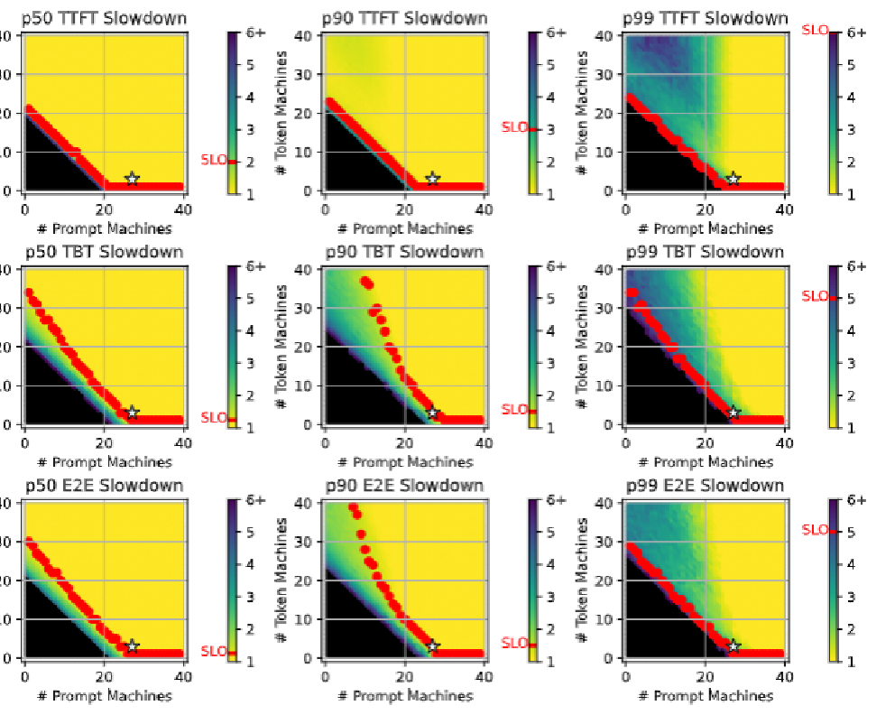

**图 12.** Splitwise-HH 集群的配置设计空间. 集群配置以峰值吞吐量 70 RPS 为目标. 成本最优的 Splitwise-HH 配置以 $\star$ 标出 (27 台提示机器和 3 台 token 机器).

**搜索空间.** [图 12](#figure-12) 展示代码补全工作负载下 (使用 2 分钟轨迹), Splitwise-HH 的提示机器数和 token 机器数构成的二维搜索空间. 模拟器输出 TTFT、TBT 和 E2E 延迟的各个百分位数. 随后, 我们选出同时满足各指标 SLO 的集群, 并优化目标函数. 例如, [图 12](#figure-12) 用 $\star$ 标出由 27 台提示机器和 3 台 token 机器组成的配置; 它能达到 70 RPS 且成本最低. 我们称之为*等吞吐量成本优化*配置.

**优化.** 我们使用三种优化目标: *吞吐量*、*成本*和*功耗*. 云服务提供商 (CSP) 和用户都重视吞吐量优化. CSP 与用户对成本优化的重视程度不同. 对 CSP 而言, 如果能降低集群的功耗和空间需求, 相同吞吐量下较高的成本也可能可以接受. 对最终用户而言, 相同吞吐量下更高的成本通常不可接受. 功耗优化对 CSP 很有吸引力, 因为它使同一数据中心能部署更多 GPU [Pat23c, Pat24c], 但用户可能并不那么重视. 本文只考虑配置功耗, 不考虑动态功耗利用率.

### 4.5 实际考虑

**对准确性的影响.** Splitwise 使用无损 KV 缓存传输, 且不引入任何随机化, 因而不会影响准确性. 它使用与单机推理相同的参数和状态执行推理.

**可扩展性.** LLM 请求比典型机器学习请求长得多 [Guj20, Gup20a], 所以在集群规模相近时, 调度开销更低. 但在大型集群中, CLS 可能成为扩展瓶颈. 先前工作中有关分区或复制调度的思路可以改善可扩展性 [Ous13, Bou14, Sch13a], 且与 Splitwise 正交.

**可靠性与容错.** 如果提示机器或 token 机器发生故障, Splitwise 会像当前 LLM 服务系统一样从头重启请求 [Kwo23, Hug21]. 另一种做法是把提示计算后生成的 KV 缓存存入内存数据库作为检查点. 恢复时, Splitwise 可用该缓存跳过提示重算, 直接从 token 阶段开始. token 阶段也可定期为 KV 缓存建立检查点. 安全高效的故障恢复设计不在本文范围内.

## 5 方法

### 5.1 实验设置

为了在真实硬件上评估方案, 我们在 vLLM [Kwo23] 上实现 Splitwise 的 KV 缓存传输机制. 实现已开源 [Add24]. 我们在 Microsoft Azure 上的两台 DGX-A100 和两台 DGX-H100 虚拟机 (VM) 中运行修改后的 vLLM, 规格见[表 1](#table-01). [第 3 节](#section-3) 的特征分析数据也由这些 VM 采集. 机器通过 InfiniBand 连接, DGX-H100 的带宽为前者的两倍 (即 400 Gbps).

原版 vLLM 只支持带 token 抢占的连续批处理, 可能造成很高的 TBT; 因此, 我们实现了前文[图 2c](#figure-02) 所述的最先进混合连续批处理 [Yu22a].

Splitwise 实现为机器分配提示角色或 token 角色. 提示机器生成第一个 token 时, 会使用[第 4.3 节](#section-4-3) 所述的方法把 KV 缓存传给 token 机器. 我们使用优化的 GPU 驱动通信库 MSCCL++ [Msc23] 实现朴素传输和逐层 KV 缓存传输.

在我们的实现中, 提示机器使用 MSCCL++ 的零拷贝单边 `put` 原语, 一旦 KV 缓存数据就绪便通过 InfiniBand 发送, 无需 token 机器发出任何接收指令. 向所有层发出 `put` 后, 提示机器会通知 token 机器等待的信号量. 借助信号量完成的同步使用与发送 KV 缓存数据相同的 InfiniBand 连接. 处理一批提示时, 每个请求会分配不同的信号量, 因为它们可能被路由到不同 token 机器. 我们在 vLLM 中逐块发送 KV 缓存. 为减少传输次数, 只要 KV 块使用相同信号量, 我们还会考虑它们在内存中的连续性.

### 5.2 模拟器设置

我们构建模拟器来探索集群设计, 并大规模评估 Splitwise. 模拟器代码已开源 [Spl24].

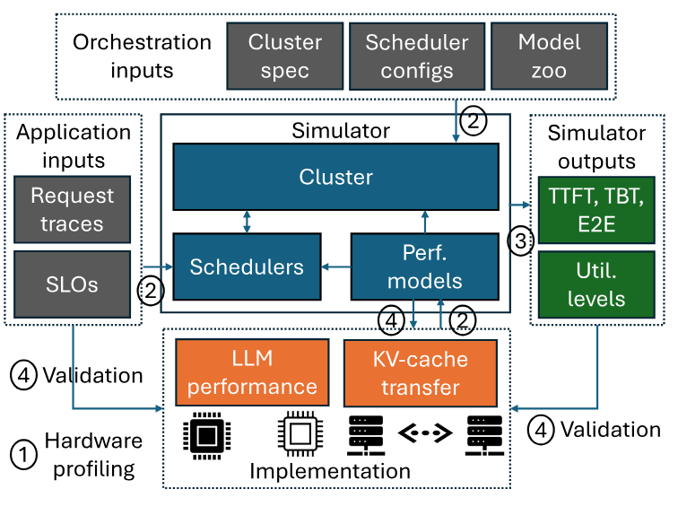

**图 13.** Splitwise 模拟器的设计概览.

[图 13](#figure-13) 展示模拟器的设计. 该模拟器由事件驱动, 忠实模拟 Splitwise 的机器池、调度器、机器级内存与队列以及 KV 缓存传输. 首先, 我们在目标硬件上以不同输入/输出大小分析 LLM 性能①. 然后根据特征分析结果建立性能模型. 模拟器以请求轨迹、SLO、性能模型以及集群和调度器配置为输入②. 在评估中, 我们使用[第 3 节](#section-3) 生产轨迹的提示和 token 大小分布. 我们调节泊松到达率来增减负载 (每秒请求数), 以确定集群规模. 模拟器输出每个请求达到的指标 (TTFT、TBT、E2E) 及机器利用率③. 我们以硬件实验交叉验证性能模型的准确性, 还使用超过 5 万次迭代的生产负载对模拟器进行端到端验证, 以确认其保真度④.

**性能模型.** 我们使用[第 3 节](#section-3) 中 A100 和 H100 机器在所需并行配置下, 针对不同批次大小、输入大小和输出大小得到的性能剖析结果, 建立分段线性性能模型. 验证结果表明该模型准确度很高: 在按 80:20 划分的训练集和测试集上评估时, 平均绝对百分比误差 (MAPE) 低于 3%.

**通信模型.** 在评估中, KV 缓存传输产生机器间通信, 张量并行则只产生机器内通信. 我们通过[第 6.1 节](#section-6-1) 中基于 InfiniBand 的 KV 缓存传输实现基准测试, 建模机器间通信开销.

**SLO.** 为确定一种集群设计可支持的最大吞吐量, 我们对 TTFT、TBT 和 E2E 延迟指标使用 P50、P90 和 P99 SLO. [表 6](#table-06) 以 DGX-A100 为基准给出 SLO 定义. 我们要求全部 9 个 SLO 均得到满足. TTFT SLO 略宽松, 因为 TTFT 对 E2E 延迟的影响小得多.

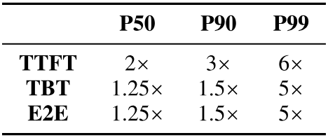

**表 6.** SLO 表示为相对请求在无争用 DGX-A100 上运行时的减速倍数.

**基线.** 我们把 Splitwise 各设计与 Baseline-A100 和 Baseline-H100 对比. 两种基线集群分别只由 DGX-A100 和 DGX-H100 组成. 二者都使用与 Splitwise 混合池机器相同的混合连续批处理 (见[第 4.1 节](#section-4-1)).

## 6 评估

### 6.1 实验结果

**KV 缓存传输延迟.** 我们首先测量提示大小增长时传输 KV 缓存的延迟. [图 14](#figure-14) 展示 A100 和 H100 配置采用[图 11](#figure-11) 所述朴素及优化传输设计时, 可见的传输延迟. 相比提示计算时间, 开销很小 ($<7\%$). 串行传输时间随提示大小线性增长, 因为 KV 缓存也随之增大. 优化的逐层传输则隐藏了大部分延迟. 这些传输在 A100 配置上的恒定非重叠时间约为 8 ms, 在 H100 上约为 5 ms. H100 配置的带宽是 A100 的两倍 (即 200 Gbps 对 400 Gbps), 因而 H100 上的传输大约快一倍.

如[第 4.3 节](#section-4-3) 所述, 对较小提示 (H100 上小于 512 个 token), Splitwise 采用串行 KV 缓存传输; 对较大提示则采用逐层传输.

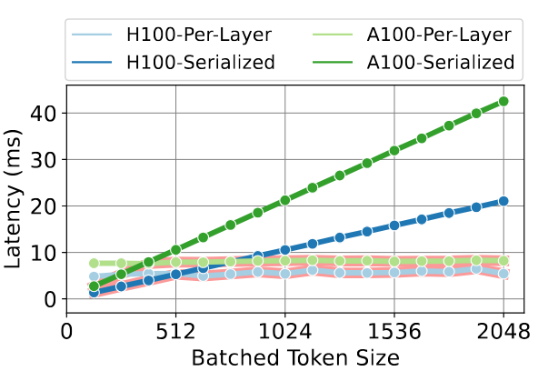

**图 14.** 提示大小增加时, A100 和 H100 上的 KV 缓存传输开销.

**端到端影响.** 接着, 我们在不使用批处理的双机 Splitwise 配置上运行代码补全轨迹, 并与不使用批处理的单机基线比较延迟指标. [图 15](#figure-15) 给出结果. 对较大提示, 串行传输 KV 缓存造成的延迟最高达到 E2E 的 3%. Splitwise 的开销则只有 E2E 的 0.8%. 在面向用户的推理中, KV 缓存传输开销唯一可见的影响是第二个 token 的延迟. Splitwise 使第二个 token 的延迟增加 16.5%, 而串行传输会增加 64%. 总体而言, 即使在面向用户的推理中, Splitwise 的传输影响也几乎不可察觉.

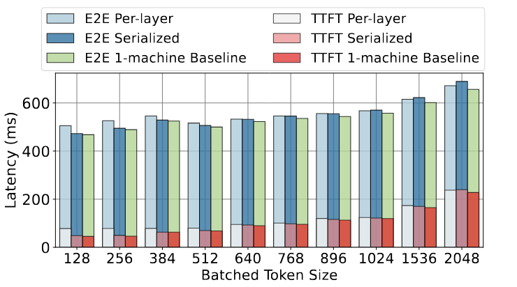

**图 15.** A100 和 H100 上, KV 缓存传输对代码补全轨迹 TTFT 与 E2E 延迟的开销.

### 6.2 等功耗吞吐量优化集群

**集群配置.** 我们使用[第 4.4 节](#section-4-4) 所述方法配置集群. 每种集群设计都以特定工作负载 (例如对话) 和峰值负载为目标, 并保持功耗相同 (即等功耗). 对基线, 目标峰值功耗取 40 台 DGX-H100 机器的功耗. 在同一功耗预算下, A100 基线可容纳 70 台 DGX-A100. 我们把这两种设计分别记为 40P/T 和 70P/T, 因为所有机器都使用混合批处理.

在代码补全轨迹下, Splitwise-AA 为提示池配置 55 台机器, 为 token 池配置 15 台, 记为 (55P, 15T). 与 Baseline-A100 一样, Splitwise-AA 的机器数也比 Baseline-H100 多 75%. [图 16](#figure-16) 图例给出代码补全和对话工作负载下的不同配置方案. 请求大小分布会反映在机器池的规模上. 例如, 对代码补全轨迹, Splitwise-HH 配置较多提示机器 (35P, 5T); 对对话轨迹则配置较多 token 机器 (25P, 15T).

**延迟与吞吐量.** [图 16](#figure-16) 详细展示相同功耗 (即等功耗) 下, 各种集群设计在不同输入负载时的全部延迟指标. 对代码补全轨迹 ([图 16a](#figure-16)), Splitwise-HH、Splitwise-HHcap 和 Splitwise-AA 都优于 Baseline-H100. 随负载增加, Baseline-H100 因较大提示参与混合批处理而出现高 TBT. Splitwise-AA 虽能支持更高吞吐量, TTFT 却一直高于大多数设计. Splitwise-HA 在高吞吐量下同时提供低 TTFT 和低 E2E, 明显弥合了这一差距. 负载较高时, Splitwise 的混合机器池可以利用全部硬件, 不受碎片化影响. Splitwise-HA 的 P50 TBT 图清楚显示这一优势: 超过 90 RPS 后, H100 机器会加入混合机器池, 帮助降低 TBT.

对对话轨迹 ([图 16b](#figure-16)), Splitwise-HHcap 在包括延迟在内的所有方面都明显更好. 这是因为对话轨迹的 token 生成阶段通常比代码补全轨迹长得多, 有利于 token 机器.

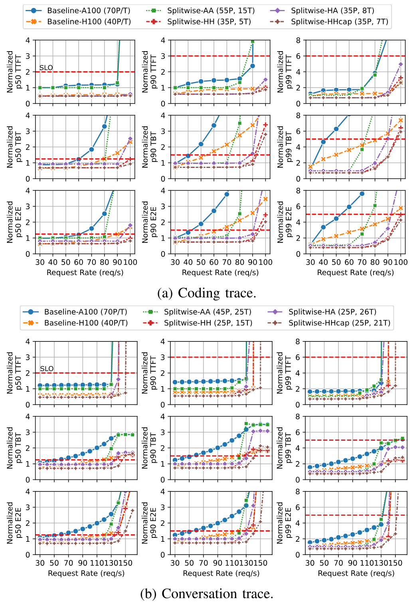

**图 16.** 等功耗吞吐量优化集群在不同输入负载下的延迟指标. 红色虚线表示 SLO.

**对批内 token 的影响.** [图 17](#figure-17) 展示等功耗吞吐量优化集群处理不同活跃 token 批次大小时, 所用时间的累积分布. 分布通过在低负载 (70 RPS) 和高负载 (130 RPS) 下运行对话轨迹采集.

低负载时, 全部 40 台 Baseline-H100 机器有 70% 的时间只运行 $\leq 15$ 个 token, 其余时间则运行含较大提示的混合批次, 影响 TBT 和 E2E. 35 台 Splitwise-HH 提示机器大多空闲, 活跃时运行的 token 批次大得多. 15 台 Splitwise-HH token 机器的组批效果也更好. 总体而言, 70 RPS 下 Splitwise 机器的批处理和延迟更好. 高负载时, 混合池利用率提高, 提示机器与 token 机器的批次大小开始趋于相似.

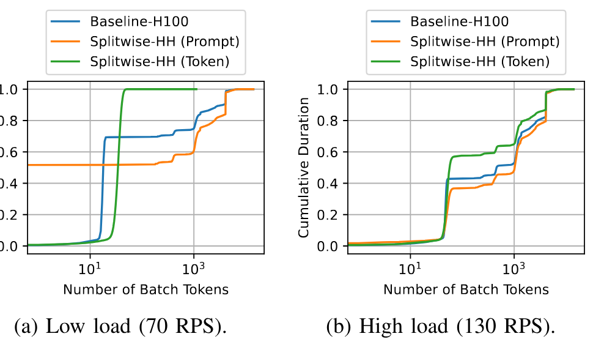

**图 17.** 等功耗吞吐量优化设计以不同 token 批次大小运行时, 所用时间的累积分布.

**汇总图.** [图 18a](#figure-18) 汇总对话轨迹下等功耗吞吐量优化设计的全部集群指标. 我们以 Baseline-A100 为基线. 与 Baseline-A100 相比, Splitwise-AA 在相同功耗和成本下提供 $2.15\times$ 的吞吐量. Splitwise-HA 在相同功耗下以低 10% 的成本提供 $1.18\times$ 的吞吐量.

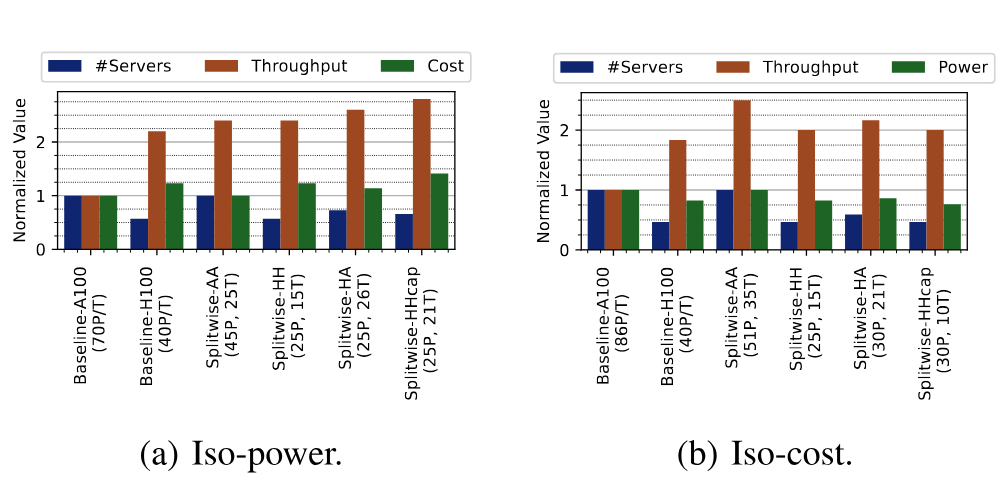

**图 18.** 吞吐量优化集群设计汇总.

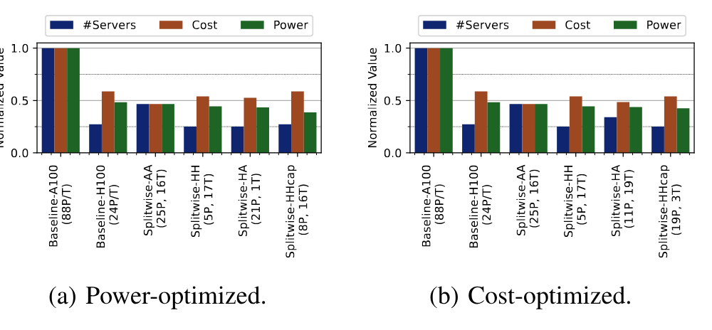

**图 19.** 等吞吐量集群设计汇总.

### 6.3 其他集群优化

我们已经详细介绍*等功耗吞吐量优化集群*. 对其余集群优化评估, 只讨论汇总图.

**等成本吞吐量优化.** [图 18b](#figure-18) 展示等成本集群的空间、吞吐量和功耗需求汇总. Splitwise-AA 在相同成本下提供最高吞吐量, 即比 Baseline-H100 高 $1.4\times$, 但功耗高 25%, 所需空间为 $2\times$. 对大多数不在意功耗和空间、而希望利用更容易获得的旧款 GPU 换取高 40% 吞吐量的客户而言, 这是一个值得考虑的运行点. CSP 的更优选择则不那么明确.

**等吞吐量功耗优化.** [图 19a](#figure-19) 展示以最低功耗取得相同吞吐量的集群设计. Splitwise-HHcap 能以相同成本和空间、低 25% 的功耗达到与 Baseline-H100 相同的吞吐量. 这对 CSP 明显有利.

**等吞吐量成本优化.** [图 19b](#figure-19) 展示等吞吐量设计的成本优化版本. [图 19a](#figure-19) 与[图 19b](#figure-19) 之间, 所有同构设计均未变化, 因为提示机器和 token 机器的成本与功耗相同. 但 Splitwise-HA 和 Splitwise-HHcap 在成本优化与功耗优化下得到的结果略有不同. [图 19b](#figure-19) 显示, 使用 Splitwise-AA 时, 客户能以低 25% 的成本达到与 Baseline-H100 相同的吞吐量.

### 6.4 工作负载变化的影响

此前, 我们在针对特定工作负载模式和模型优化的集群上测试了一条轨迹和一个模型. 为检验 Splitwise 的稳健性, 现在把对话轨迹放到为代码补全服务设计的集群上运行, 并把 Llama-70B 放到为 BLOOM-176B 设计的集群上运行. [图 20](#figure-20) 给出等功耗吞吐量优化集群的结果.

**改变工作负载轨迹.** 与[图 16b](#figure-16) 相比, [图 20a](#figure-20) 中的基线集群规模相近, 吞吐量和延迟均不受影响. 带混合池的 Splitwise-AA 和 Splitwise-HH 能良好适应新工作负载, 吞吐量和延迟也不受影响. Splitwise-HA 和 Splitwise-HHcap 的提示池与 token 池使用不同机器, 相比各自针对对话轨迹优化的集群设计, 吞吐量降低 7%. 所有 Splitwise 设计仍远优于任何基线设计.

**改变模型.** [图 20b](#figure-20) 显示, Llama-70B 的参数较少 ([表 3](#table-03)), 因而在相同集群设计中能支持远高于 BLOOM-176B 的吞吐量. 较高负载下, 所有 Splitwise 设计均优于两种基线. 即使负载增加, Splitwise-HH 和 Splitwise-HHcap 仍能取得最佳延迟.

**总结.** 这两个实验表明, Splitwise 能借助智能调度按工作负载需求调整, 并能稳健应对 LLM、请求负载和 token 分布的变化.

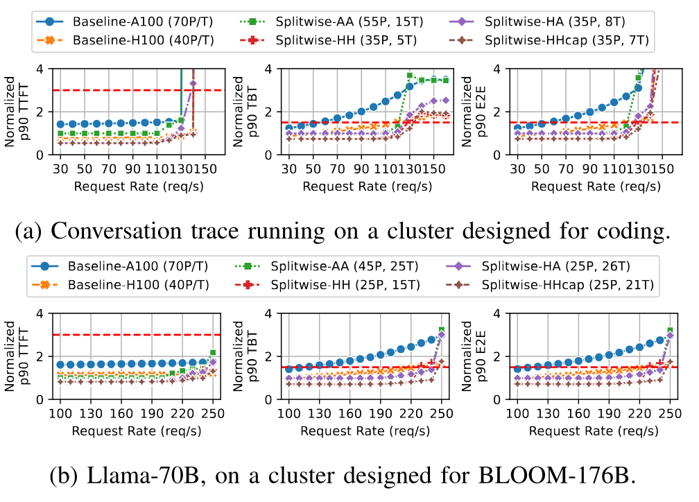

**图 20.** 在为另一种工作负载设计的集群上运行工作负载时的延迟影响. 红色虚线表示 SLO.

### 6.5 面向批处理作业的集群设计

即使以吞吐量为优化目标, 我们仍在严格延迟 SLO 下使用 Splitwise 设计各种集群. 批处理作业无需如此, 可以在高负载下运行以获得较高的 token 生成吞吐量. 对等功耗吞吐量优化集群施加高负载后, Baseline-A100 和 Splitwise-AA 的单位成本吞吐量最佳, 为 0.89 RPS/&#36;. 高负载下, Splitwise 会退化为机器数相同的基线, 因为所有机器都进入混合池并开始混合批处理. Splitwise-HH 和 Baseline-H100 也同样如此, 二者达到 0.75 RPS/&#36;.

## 7 讨论

**对新模型的扩展性.** 尽管模型规模从 20 亿参数 [Jav23, Zha22] 到 1760 亿参数 [Les23] 乃至更多 [Ope23f] 不等, 所有现代基于 Transformer 的生成式 LLM 都有不同的提示处理阶段和 token 生成阶段. Mixture-of-Experts (MoE) 等变体也有这两个阶段. Splitwise 只利用这两个阶段构建, 因此只要工作负载的自回归性质需要这两个阶段, 它就适用于当前和未来的所有 LLM. [第 6.4 节](#section-6-4) 已经表明, 为一种模型配置的 Splitwise 集群也能高效服务其他模型.

**替代计算硬件.** 本文使用 NVIDIA H100 和 A100 GPU, 因为它们目前常用于数据中心的 LLM 推理 [Nvi24f]. NVIDIA T4 等较小的数据中心 GPU 内存不足, 难以高效运行现代 LLM. 一般而言, 我们的方法适用于任何满足提示阶段和 token 阶段计算需求的硬件, 包括 CPU、FPGA 和 ASIC [Dom19]. 特征分析表明, 提示阶段需要高计算能力和高内存带宽, 对内存容量要求较低; token 阶段需要中等计算能力, 但要求较高的内存容量和带宽. 因此, AMD MI-250 [Amd23a] 等 GPU 和带 HBM 的 Intel Sapphire Rapids [Int22a] 等 CPU 可能适合作为 token 机器. 由于无法使用这类硬件和/或经过优化的 LLM 实现, 我们把这项评估留给未来工作.

**提示机器与 token 机器间的互连.** 本文假设所有设计的提示机器与 token 机器之间都使用 InfiniBand 连接 (涉及 A100 时带宽较低). 同构机器通常具备这种连接; 但尽管技术上可行, Splitwise-HA 中 H100 与 A100 之间的 InfiniBand 连接并不容易获得. 替代方案可以是通过 CPU 使用 InfiniBand 连接的 HPC 云 [Azu23], 或使用 RoCE 的以太网 [Mit18]. 我们优化的 KV 缓存传输降低了关键路径延迟, 所以带宽低 $10\times$ 的互连可能仍有收益. 还可以在通过网络传输 KV 缓存前将其压缩, 进一步降低带宽使用量 [Liu23t].

**异构提示/token 机器.** Splitwise 能稳健应对不同模型和输入轨迹, 但我们也认识到, 使用不同类型的 GPU 划分数据中心 (例如 Splitwise-HA) 可能给 CSP 带来额外挑战.

**多轮对话.** 当前的 LLM 对话 API 要求用户发送到当前为止的完整对话上下文 [Ope23f]. 未来, 服务可能有足够的 GPU 容量缓存上下文, 避免重复计算. 这会改变我们所分析的提示阶段内存利用模式. 系统还可能需要把 KV 缓存传回提示机器, 为下一轮对话请求做好准备.

## 8 相关工作

**异构调度和数据流系统.** 先前工作针对多种交互式服务研究了异构调度 [Zha19k, Pat23e, Rom21a]. 这些工作利用硬件异构性, 在成本、能耗和性能等目标之间取得平衡, 但会在同一台机器上运行整个工作负载. 异构多处理器 CPU 调度研究试图使工作负载异构性与硬件异构性匹配 [Haq15, Van12, Haq17, Kum03, Yan17b, Che09]. 这些工作使用性能剖析或在线监控, 根据请求长度或硬件性能计数器等指标识别工作负载阶段, 并把各阶段分配到合适的异构处理器上, 但没有考虑批处理的复杂性. 分布式数据流系统编排大规模计算图, 并力求提供通用可编程性 [Dea08, Isa07, Shv10, Zah12]. Splitwise 下的 LLM 推理可视为包含两个阶段的静态计算图, 因而可以用提供高效 GPU 抽象的分布式框架实现 [Mor18]. Splitwise 使用专门面向生成式 LLM 推理的两阶段设计, 并通过感知阶段的资源管理和高效批处理, 与这些工作形成区别.

**模型服务系统.** LLM 推理服务发展迅速, 最近有多项工作优化批处理 [Yu22a, Kwo23, Sto23d, Agr23, Ami22]、调度 [Kwo23, Pop22, She23b, Wu23a, Tur23, Hon23b] 和内存使用 [Dao22, Kwo23, Det22, Sto24]. 先前工作还提出用 CPU 和计算能力较弱的设备提供 LLM 服务 [Int23, Num23]. 这些方法在同一台机器上运行提示阶段和 token 阶段. 使用 Splitwise 拆分阶段后, 它们可以提高吞吐量并降低延迟.

视频和机器学习服务方面的先前工作侧重于在延迟约束下调度存在数据依赖的模型链 [Hu21b, Cra20, Rom21a, Kan19, Alb22]. 这类调度器依赖模型剖析来高效分配资源, 并跨机器管理请求. 推荐系统推理在模型内部和模型之间都存在计算/内存异构性. 先前工作利用这种异构性, 在 CPU 与加速器之间选择性调度请求 [Gup20a, Kwo19], 合置内存使用互补的模型 [Cho23b], 并在异构硬件资源上划分计算和内存 [Cen20, Jia21b]. Splitwise 同样利用 LLM 推理请求内部的异构性, 但 LLM 工作负载的特征和要求不同, 因而采用了不同优化.

## 9 结论

我们全面分析了 LLM 推理的提示计算阶段和 token 生成阶段, 找出二者在系统资源利用模式上的差异. 据此, 我们设计 Splitwise, 把两个阶段拆分到不同机器上, 以便针对各阶段管理资源. 借助 Splitwise, 我们探索了针对吞吐量、成本和功耗优化的集群设计, 并表明工作负载变化后这些设计仍有良好表现. 在性能 SLO 下, 与现有设计相比, Splitwise 集群能以相同成本和低 15% 的功耗取得 $1.76\times$ 的吞吐量, 或者在相同成本和功耗下取得 $2.35\times$ 的吞吐量.

## 致谢

感谢审稿人提出的宝贵意见. 感谢 Chetan Bansal、Srikant Bhardwaj、Suriya Kalivardhan、Ankur Mallick、Deepak Narayanan 和 Amar Phanishayee 参与富有启发的讨论. Pratyush Patel 的工作得到 NSF CNS-2104548 和 VMware 研究资助的部分支持.

## 10 Artifact 附录

### 摘要

我们开源了评估 Splitwise 所需的主要组件; 这些组件也可改用于评估未来的 LLM 推理服务系统. Artifact 包括:

- 来自 Microsoft Azure 两个 LLM 推理服务的生产轨迹.

- 在 vLLM [Kwo23] 中实现的 Splitwise KV 缓存传输机制原型.

- SplitwiseSim, 用于评估 LLM 推理集群模型服务的离散事件模拟器.

受硬件条件限制, 我们只测试了轨迹和 SplitwiseSim 的 Artifact 功能.

### 10.1 Artifact 检查清单 (元信息)

- **数据集:** 生产轨迹作为 Artifact 的一部分提供.

- **运行环境:** Linux / Ubuntu.

- **硬件:** vLLM 原型需要两台通过 GPU InfiniBand 连接的机器 (例如 NVIDIA DGX-A100、NVIDIA DGX-H100). SplitwiseSim 需要一台 x86-64 CPU 机器.

- **公开提供?:** 是.

- **代码许可证 (如公开提供)?:** MIT.

- **数据许可证 (如公开提供)?:** CC-BY.

- **已存档 (提供 DOI)?:** 10.5281/zenodo.11003049.

### 10.2 说明

**获取方式.** 完整 Artifact 在 Zenodo 上以归档形式提供: <https://doi.org/10.5281/zenodo.11003049>. 各组件也可分别在线获取:

- 生产轨迹可从 Azure Public Dataset GitHub 仓库下载 [Azu24].

- KV 缓存传输原型可从 vLLM GitHub 仓库下载, 当前以 pull request 形式提供 [Add24].

- SplitwiseSim 及相关实验和绘图脚本可从单独的 GitHub 仓库下载 [Spl24].

**硬件依赖.** KV 缓存传输原型需要两台通过 InfiniBand 连接的 GPU 机器, 例如 NVIDIA DGX-A100 或 NVIDIA DGX-H100. SplitwiseSim 需要标准 x86-64 CPU 机器; 可以用多台机器并行运行模拟.

**软件依赖.** KV 缓存传输原型基于 vLLM [Kwo23] 和 MSCCL++ [Msc23] 构建. SplitwiseSim 依赖少量公开 Python 软件包, 可通过随附的 `requirements.txt` 安装.

**数据集.** Microsoft Azure 的代码补全和对话轨迹作为 Artifact 发布内容的一部分在线提供 [Azu24].

### 10.3 安装和实验流程

安装和使用说明请参阅 Artifact 中的 README 文件.

### 10.4 方法

提交、审查和徽章授予方法:

- <https://www.acm.org/publications/policies/artifact-review-and-badging-current>

- <http://cTuning.org/ae/submission-20201122.html>

- <http://cTuning.org/ae/reviewing-20201122.html>

[+1]: 此项工作的一部分在 Microsoft 实习期间完成.
