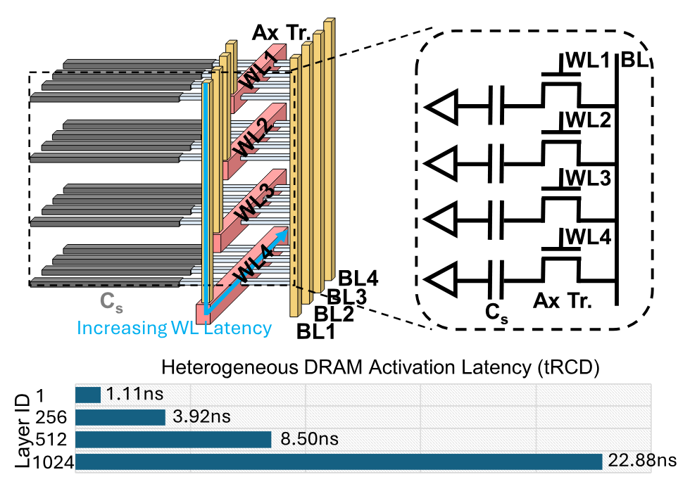

> [Yue Pan](https://dblp.org/pid/385/3702), [Zihan Xia](https://dblp.org/pid/244/0846) [+equal contribution], [Po-Kai Hsu](https://shimeng.ece.gatech.edu/people/), [Lanxiang Hu](https://snyhlx.github.io/), [Hyungyo Kim](https://cubic.engineering.columbia.edu/directory/hyungyo-kim), [Janak Sharda](https://grad.gatech.edu/events/phd-dissertation-defense-janak-sharda), [Minxuan Zhou](https://zhouminxuan.github.io/), [Nam Sung Kim](https://ece.illinois.edu/about/directory/faculty/nskim), [Shimeng Yu](https://ece.gatech.edu/directory/shimeng-yu), [Tajana Rosing](https://cseweb.ucsd.edu/~trosing/) 和 [Mingu Kang](https://jacobsschool.ucsd.edu/node/3664). 论文于 2025 年 10 月 6 日首次提交至 arXiv, 当前版本为 v1. [Stratum: System-Hardware Co-Design with Tiered Monolithic 3D-Stackable DRAM for Efficient MoE Serving](https://arxiv.org/abs/2510.05245). [原始论文 PDF](/paper/stratum.pdf). [DOI](https://doi.org/10.48550/arXiv.2510.05245). [MICRO '25 DOI](https://doi.org/10.1145/3725843.3756043). [TeX 源文件](https://export.arxiv.org/e-print/2510.05245v1). 精确的印刷版式和参考文献以原始 PDF 为准.

## 摘要

随着大语言模型 (LLM) 持续发展, 专家混合 (MoE) 架构已成为在众多任务上取得先进性能的主流方案. MoE 模型通过稀疏门控, 每个输入只激活少量专家子网络, 在保持数十亿参数容量的同时, 将推理成本控制在远小于同规模稠密模型的水平. 然而, MoE 层引入的海量数据也给硬件部署带来挑战. 为解决 MoE 模型服务中的这些问题, 我们提出 Stratum, 一种结合单片 3D 可堆叠 DRAM (Mono3D DRAM), 近存计算 (NMP) 和 GPU 加速的系统-硬件协同设计. 逻辑裸片与 Mono3D DRAM 裸片通过混合键合连接, Mono3D DRAM 堆栈与 GPU 则通过硅中介层互连. Mono3D DRAM 借助单片结构提供的高密度垂直互连间距, 内部带宽高于 HBM, 从而支持更高性能的近存计算. 针对 Mono3D DRAM 沿 $z$ 方向激进扩展带来的访问延迟差异, 我们构建内部内存层级, 并依据访问可能性在各层分配数据; 再结合基于主题的专家使用预测, 提高 NMP 吞吐量. 在多个基准上, Stratum 相比 GPU 基线最高可将解码吞吐量提升 $8.29\times$, 能效提升 $7.66\times$.

## 1 引言

基于 Transformer 的大语言模型 (LLM) 已成为众多应用的核心, 并在不同领域取得先进性能 [Vas17c, Dub24, Dos20, Zha22, Gro25a, Jia24a, Ope23b, Qwe25, Den20, Dee24a, Dee25c]. 为提升各种任务的效果, LLM 的规模不断突破极限, LLaMA 3.1 (405B) [Dub24], DeepSeek-V3 (671B) [Dee24a] 和 Kimi-K2 (1T) [Kim25e] 等模型持续推高参数规模和性能上限. 训练和部署这类大模型对基础设施提出了严峻要求, 尤其是内存容量和计算能力.

在降低推理成本的诸多方法中, 利用激活稀疏性可以直接减少计算和数据移动需求. 一种广泛采用的方法是专家混合 (MoE) 架构 [Dee24a, Ope23b, Olm24, Jia24a, Du21a, Dbr25, Gro25a, Fed22, Lla25]: 它以一组专家 MLP 替代传统的稠密多层感知器 (MLP) 模块, 并在推理时稀疏地选择专家, 如 [图 1](#figure-01) 所示. MoE 模型通过路由机制在每个 token 上只激活少量专家. 由于 MLP 占据模型总规模的主要部分, 这种选择性激活显著降低了训练和推理成本 [Sca24], 因此 MoE 已成为许多先进 LLM 的首选架构.

**图 1.** 稠密 Transformer LLM (左) 和专家混合 (MoE) LLM (右) 的架构.

尽管 MoE 模型降低了实际的内存访问和计算需求, 却没有解决模型总体规模的问题. 模型规模快速增长, 需要高带宽, 高密度的内存技术. 沿着这一方向, 采用裸片堆叠的高带宽内存 (HBM) 已成为 NVIDIA A100 和 H100 等高性能 GPU 的主流方案 [Nvi21, Nvi23b]: 它将 6 个 DRAM 裸片堆叠起来, 配备 1024-bit I/O 接口, 在单位面积上实现高密度, 并通过硅中介层向 GPU 计算裸片提供每堆栈最高 800 GB/s 的内存带宽. 虽然 HBM 相比传统 2D DRAM 提供了更高带宽, 但中介层可用带宽仍然不足, 导致 GPU 计算资源经常无法充分利用, 尤其是在 LLM 解码等受内存限制的操作中 [Att24]. 为缓解 HBM 与 GPU 之间的内存墙, 近期方法在 LLM 推理中采用近存处理 (NMP) [New20, Tra22, Har21, Att24, Dup24, Neu24a, Hig21]. 已有研究 [Neu24a, Att24, Tra22, Dup24] 将计算逻辑放在 HBM 基底裸片上, 利用 NMP 单元在解码阶段执行注意力计算. 然而, 基底裸片上的 NMP 仍受限于 TSV I/O 连接数量, 数据垂直穿越时带宽有限. 为缓解该限制, 已有工作将计算单元直接集成到内存裸片中, 以利用更高的内部内存带宽 [Har21, Tra22, Dri17, Att24, Hig21, Pri24], 这类方法通常称为存内处理 (PIM). 但 DRAM 裸片中的计算逻辑会带来昂贵的内存内部数据传输, 以及使用面向存储而非计算的 DRAM 工艺实现逻辑所产生的巨大性能, 面积和功耗 (PPA) 开销 [Dri17]. 此外, 在同一裸片上集成逻辑和内存还会引入额外的热和制造开销.

作为 HBM 的有力替代方案, 单片 3D 可堆叠 DRAM (本文简称 Mono3D DRAM) 近期成为推动 DRAM 在 10 纳米以下技术节点继续扩展的有前景方案. 它通过省去昂贵 TSV 和键合工艺的低成本制造流程改善垂直集成, 受到产业界和学术界的持续关注 [Ong23, A24, Sig25, Mon25]. 在同一晶圆上逐层制造额外 DRAM 层, 可以在不同比例增加每 bit 成本的情况下提升密度, 使 Mono3D DRAM 成为未来高容量内存系统的有吸引力候选方案. 与基于 HBM 的 NMP 相比, 基于 Mono3D DRAM 的 NMP 具有关键架构优势. Mono3D DRAM 在 DRAM 内部采用单片结构, 并通过 DRAM 与逻辑裸片之间的面对面混合键合, 利用整个芯片面积, 因而拥有显著更高的内部带宽. 相比之下, HBM 的 TSV 作为垂直互连, 需要占用逻辑基底裸片和 DRAM 裸片的一定面积; TSV 面积不能无限增加, 从而限制了 HBM 的内部带宽. 此外,1 $\mu m$ 的混合键合间距 [Che20a] 比 HBM 的垂直互连间距细约 $5\times$ [Exp24], 可提供更密集的内部连接. Mono3D DRAM 更高的内部带宽, 使逻辑裸片实现的 NMP 能力强于以往基于 HBM 内存裸片的 NMP 架构. 单片集成带来的更薄裸片和更好的垂直导热还改善了散热, 支持更高功率密度, 并为 NMP 提供更大的功率预算.

尽管 Mono3D DRAM 具有诸多潜力, 要充分发挥这些优势仍面临几个关键挑战. 近期研究已证明, 通过逐层制造可以集成数百个垂直堆叠层 [Sig25, Mon25]. 但如此激进的垂直扩展会使不同层的访问延迟产生显著差异; 若按最坏情况延迟设计, 将严重浪费内部带宽. 单片 3D 集成带来的高密度垂直互连也支持大规模数据的并发访问, 因此需要精心设计数据映射, 在利用本地 DRAM bank 带宽的同时减少跨 bank, 跨 channel 访问. 由于本地 DRAM 数据带宽极高, 若映射不当, 处理单元之间的片上通信开销可能与计算延迟相当. 因此, 平衡地重叠计算和通信是缩短总执行时间的关键.

针对大规模 MoE 模型的服务挑战, 我们提出融合 Mono3D DRAM, NMP 和 GPU 的 Stratum 系统. 本文的主要贡献如下:

- 首次提出利用单片 3D 可堆叠 DRAM 的 MoE 服务系统-硬件协同设计 Stratum. 该方案通过 3D 混合键合将高密度 Mono3D DRAM 裸片与高性能逻辑裸片异构集成, 再通过 2.5D 硅中介层将 Mono3D DRAM 堆栈接入 GPU, 为传统 GPU-HBM MoE 服务系统提供高吞吐, 低成本的替代方案.
- 在硬件层面, 引入利用 Mono3D DRAM 垂直扩展所造成层间访问延迟差异的内存内分层机制, 并提出面向混合键合 Mono3D DRAM 的 NMP 处理器, 为专家和注意力计算分别设计数据映射与通信优化.
- 在系统层面, 观察到专家的激活频率取决于用户请求主题且并不均匀. 由此将专家分为热, 冷两类, 分别放入 Mono3D DRAM 的快, 慢层; 主题感知服务系统使用轻量主题分类器预测主题, 并在满足服务级目标 (SLO) 的前提下按主题排队和调度请求.
- 跨器件, 电路, 算法和系统层面的评估表明, 在实际 MoE 服务场景中, Stratum 相比先进 GPU 基线最高可获得 $8.29\times$ 的解码吞吐量和 $7.66\times$ 的能效提升.

## 2 背景

### 2.1 单片 3D 可堆叠 DRAM

单片 3D DRAM 是延续 DRAM 缩放的有前景技术, 受到学术界和工业界的广泛关注 [Har21, Tra22, Dri17, Att24, Hig21]. 与传统 2D DRAM 相比, 它利用垂直扩展显著提高内存密度; 其基础包括纳米片场效应晶体管 (FET) 带来的更强栅极控制和堆叠沟道结构, 以及借鉴 3D NAND 闪存的逐层沉积, 高深宽比刻蚀超薄介电隔离层和高密度垂直集成工艺 [Ong23, Sig25, A24, Mon25].

Mono3D DRAM 采用单片 3D 可堆叠的水平 1T1C DRAM 单元, 通过字线 (WL) 阶梯和垂直连接的位线 (BL) 连接多个层的存储单元, 如 [图 2](#figure-02) 所示. HBM 由于 TSV 制造良率低以及堆叠裸片所需的复杂封装而成本高昂; Mono3D DRAM 则省去了 TSV, 并在同一晶圆上逐层构建 DRAM, 从而获得更好的扩展性和成本优势. 更薄的裸片和单片集成改善了垂直导热, 也带来散热收益.

除成本和散热优势外, Mono3D DRAM 还能为逻辑层提供更高的内存带宽. 它利用异构集成 [A24, Mon25], 通过 Cu-Cu 混合键合在存储单元和逻辑外围电路之间高速传输数据. [图 3](#figure-03) 在同一 2.5D 集成平台上比较了 Mono3D DRAM 和 HBM. HBM 受 TSV 限制, TSV 的间距约为 10 $\mu$m [Sma16], 带宽受限且面积开销大, 降低了内存密度; Mono3D DRAM 则利用间距仅 1 $\mu$m 的 Cu-Cu 混合键合 [Che20a], 并通过后端制程 (BEOL) 金属布线连接 DRAM 与逻辑基底裸片, 实现很高的内部带宽.

如 [图 3](#figure-03) 所示, 尽管内部带宽更高, Mono3D DRAM 仍因中介层 I/O 接口带宽有限而面临与 HBM 类似的外部带宽限制. 已有研究 [Fin17] 还指出, 将数据传输到外部处理器时, 需要经过逻辑基底裸片和中介层 I/O 接口, 能耗很高. 因此, 有必要在 Mono3D DRAM 旁的逻辑裸片上集成 NMP, 以利用内部带宽并提高能效.

尽管 Mono3D DRAM 具有很高的容量潜力, 其垂直扩展仍受层间访问延迟差异限制. 如 [图 2](#figure-02) 所示, 阶梯结构底部的 WL 由于布线线性延长而具有更大的寄生电容和电阻. 当 Mono3D DRAM 扩展到数百层时, 这种延迟不平衡会变得显著. 与其围绕最坏情况延迟设计, 不如利用这种延迟异质性提升系统性能; 这促成了后文 [第 3 节](#section-3) 详述的"内存内分层"架构. Mono3D DRAM 的扩展趋势与 3D NAND 闪存一致, 因为二者采用相近工艺, 后者已扩展到 400 层以上 [A25]. 近期白皮书还表明, 扩展到 500 层甚至 1000 层是可行的 [New25, Sca24a]. 鉴于这些进展和垂直扩展趋势, 本文假设最多 1024 层 WL 堆叠, 以反映近期可实现的规模.

**图 2.** 垂直堆叠水平 1T1C DRAM 单元的单片 3D 可堆叠 DRAM. 位线采用垂直布线以避免感测裕量变化, 字线通过阶梯布线; 由于字线阶梯结构, 激活延迟随层数变化.

**图 3.** 带 xPU 裸片的 2.5D 集成平台上的 HBM 与 Mono3D DRAM. HBM 和 Mono3D DRAM 分别通过 TSV 和 Cu-Cu 混合键合连接到逻辑基底裸片.

### 2.2 专家混合大语言模型

LLM 缩放定律表明 [Kap20], 稠密 Transformer 模型越大, 准确率越高, 但训练和服务成本也随之上升. OLMoE [Olm24], Mixtral [Jia24a], Deepseek V3 [Dee24a], Time MoE [Tim24], DBRX [Dbr25], LLaMA-4 [Lla25] 和 Kimi-K2 [Kim25e] 等近期 MoE 模型只为每个 token 激活少量专家, 提供了有吸引力的替代方案. 这种稀疏激活提升了训练扩展性, 在不同比例增加预训练成本的情况下支持更大的参数量 [Sca24], 同时让推理成本接近更小的稠密模型 [Fed22]. 另一方面, MoE 需要路由机制: 门控网络使用学习到的路由参数, 根据 token 表示 (FFN 输入或中间激活) 计算专家分配分数, 从而决定稀疏的专家选择模式 [Fed22]. 随后每个 token 被发送到选中的专家独立处理; 若一个 token 使用多个专家, 则通常按照路由分数加权聚合它们的输出, 得到该层的最终输出 [Jia24a, Dee24a, Fed22].

MoE 中 MLP 模块的切换特性带来了独特的硬件部署难题. 首先, MoE 模型规模很大, 专家权重占据总规模的绝大部分, 例如 Mixtral 8x7B 中超过 95% 的参数属于专家权重 [Jia24a], 给 GPU 内存带来压力. 其次, 每个 token 的专家使用情况动态变化且事先未知, 将专家分布到不同计算单元时容易造成负载不均 [Dee24a]. 近期工作尝试提前预测专家使用情况以减少通信开销: ExpertFlow [Exp24a] 用轻量代理模型预测路由路径, MoE Infinity [Moe25] 通过跨层激活分析统计预测专家选择; 在 GPU 与近存计算混合系统中, Duplex [Dup24] 根据延迟模型和 batch size 动态将专家计算分派给 GPU 或 NMP 单元.

训练期间, MoE 通常加入专家负载不均损失, 避免某些专家几乎不被选择, 从而鼓励更均匀的专家利用率 [Fed22, Jia24a]. 但随着训练推进, 专家之间会自然形成领域专长 [Acc23, Chi19, Exp24b]. 专家数量增加并引入共享专家后, 这种专长更加明显: 共享专家聚合通用知识, 被路由的专家则具有更强的领域特异性 [Olm24, Dee24a, Dai24, Lla25]. 基于这一观察, 近期工作探索利用专家对特定领域的亲和性, 在纯 GPU 环境中加速推理 [Exp24b, Apt24, Moe25a].

**图 4.** LLaMA-4 Scout (16 个专家) 的专家命中率分析.

我们的分析显示, 专家使用情况与查询主题存在明显关系: 某个主题会显著更频繁地激活特定专家. 如 [图 4](#figure-04) 所示, 在 MMLU 子集的数学和逻辑主题中, LLaMA-4 Scout 的领域专家亲和度超过 90%. 在服务系统中, 我们先离线分析不同主题下的专家命中率 (即使用概率), 再在在线服务时由调度器中的轻量主题分类器为 batch 内所有查询分配主题标签. 系统据此将高频专家映射到更快的 Mono3D DRAM 层, 以优化访问延迟, 详见 [第 5 节](#section-5).

## 3 Stratum 概览

### 3.1 系统概览

**图 5.** Stratum 配置示例.

**图 6.** 基于 Stratum 的服务系统.

**图 7.** Stratum NMP 架构. (a) 芯片级处理器概览; (b) channel 级处理单元 (PU) 的微架构; (c) bank 级处理元件 (PE) 的微架构.

Stratum 处理系统由一个 xPU 裸片和数量可配置的单片 3D 可堆叠 DRAM 芯片组成, 芯片通过硅中介层连接并具备近存计算能力. 我们展示了三种面向不同模型规模的配置 ([图 5](#figure-05)).*Stratum-L* 使用 NVIDIA H100 计算裸片作为 xPU, 并通过中介层互连 6 颗 Mono3D DRAM 芯片;*Stratum-S* 使用 NVIDIA RTX A6000 裸片和一颗提供 32GB 内存的 Mono3D DRAM 芯片;*Stratum-XL* 由两个 *Stratum-L* 模块组成, 为更大模型提供总计 384GB 内存. 这些配置覆盖不同的计算和内存需求, 还可通过 NVLink 等跨芯片互连扩展 [The22].

每颗 Mono3D DRAM 芯片上方是内存裸片, 下方是逻辑裸片, 二者通过 Cu-Cu 混合键合互连, 以提供高内部带宽. 为利用 Mono3D DRAM 垂直层之间的访问延迟差异, 我们在内存裸片内部引入内存分层; 底部逻辑裸片实现强大的近存处理器 (NMP), 无需总是把数据取回主机处理器即可支持 LLM 推理, 详见 [第 3.2 节](#section-3-2).

[图 6](#figure-06) 描述了基于 Stratum 的服务流程. 真实服务中, 用户提交的查询主题各不相同; 用户发送推理请求后, 主机处理器用轻量主题分类器确定查询主题, 并将带主题标签的请求放入服务队列. 调度器定期对队列中的请求分组, 再发送给 Stratum 处理系统. 为改善体验, 关键服务级目标 (SLO) 是首 token 时间 (TTFT), 保证请求不会等待过久才开始处理. 在 SLO 允许时, 调度器优先把相同主题的请求组成 batch, 以发挥专家放置的优势. 内存映射器查阅预先分析的专家使用表, 构建 batch 的聚合专家命中预测, 并生成专家到 Mono3D DRAM 层的目标映射. 每当主题标签变化时, 在新 batch 开始前执行专家交换以满足目标布局. 根据各阶段的算术强度, 计算映射器将预填充阶段分配给 xPU, 将解码阶段分配给 Stratum NMP, 策略与 [Att24] 类似. 轻量主题分类同样由主机处理器执行.

### 3.2 Stratum 近存处理

[图 7](#figure-07) 展示了 Stratum NMP 架构. 它在芯片, channel 和 bank 等多个内存层级组织处理组件, 以利用 3D 集成的优势; 目标是加速 MoE 模型中最主要的注意力和专家计算瓶颈.

[图 7](#figure-07)(a) 展示了逻辑裸片处理器与 Mono3D DRAM 裸片的集成. 逻辑裸片包含多个处理单元 (PU), 每个 PU 连接一个专用 Mono3D DRAM channel. PU 通过双向环形片上网络互连, 以优化 LLM 工作负载中的 reduce-scatter, all-gather 等数据通信模式. 环网只在 NMP 模式下使用; 普通内存操作时逻辑裸片 NMP 保持关闭, 尽量不干扰传统访问. 在 NMP 模式下, xPU 通过标准 DRAM 接口将输入 (如 query, 隐藏 token 向量) 流式写入 Mono3D DRAM bank 的预留行; 计算完成后, xPU 访问专用地址空间取回结果.

每个 PU 尽量处理分配给对应 DRAM channel 的数据, 避免跨 channel 访问; 考虑到 Mono3D DRAM 与逻辑裸片之间存在大量垂直布线, 这一点尤为重要. [图 7](#figure-07)(b) 给出了 PU 微架构, 包括近 bank PE 集群, 共享内存, 特殊函数引擎, 环形路由器和归约器. PE 集群包含多个同时针对 GeMM 和 GeMV 优化的 PE; channel 内归约器用并行归约树按需聚合多个 PE 的部分和 (psum). 环形路由器包含本地交换机, 可高效路由 PU 间通信, 并包含聚合器进行原位归约; 输入数据流无需经过共享内存即可在路由器中累加, 结果可以保存在本地 PU 或转发给邻居 PU. 特殊函数引擎执行注意力中的 `Softmax` 以及专家层的 `SiLU`, `GeLU` 等激活函数, 内部有向量寄存器文件, 标量寄存器文件和多个算术单元. 该引擎以单指令多数据 (SIMD) 方式工作, 将复杂函数拆成简单原语, 并在向量, 标量寄存器文件中读写操作数和中间结果, 以提高数据复用.

如 [图 7](#figure-07)(c) 所示, 在 bank 层面, 每个 PE 执行 GeMM 和 GeMV. bank 级 PE 将张量核心与矩阵寄存器文件, psum 内存和简单本地内存控制器集成. 内存控制器直接连接对应 DRAM bank, 通过可编程分层表将行地址动态转换为内存层标识, 从而调节 DRAM 延迟控制参数 (`tRCD`). 行交换缓冲区暂存行数据, 使数据可在层之间移动而无需显式从外部取数. 张量核心包含 $n$ 个并行 $k$-tap 点积引擎和 $n$ 个本地累加器; 双缓冲 psum 内存同时支持中间结果累加和输出传输. 处理结果可交给特殊函数引擎执行逐元素计算, 也可返回 channel 级共享内存供后续计算.

Stratum 针对混合键合 Mono3D DRAM 集成进行优化, 与以 HBM 为中心的 NMP 方案 AttAcc [Att24], Neupims [Neu24a] 和 Duplex [Dup24] 不同. 片上环网支持 all-gather, reduce-scatter 等 MoE 推理通信模式, 去除了 Duplex [Dup24] 使用的集中式全局缓冲区和 crossbar, 因而更易扩展, 物理设计更简单. Duplex [Dup24] 和 AttAcc [Att24] 依赖专用 `Softmax` 单元, 而我们的 SIMD 引擎用程序指令执行通用非线性算子. 处理器完全实现于逻辑裸片, 并通过混合键合连接 Mono3D DRAM 裸片, 避免 AttAcc [Att24] 和 Neupims [Neu24a] 中的 DRAM 制造工艺约束及 TSV 带宽限制. 在电路层面, Stratum 引入分层表和行交换缓冲区等 Mono3D DRAM 专用原语, 以利用分层内存延迟并加速 MoE 服务中的专家迁移.

## 4 Stratum 算子映射与执行

### 4.1 专家处理

MoE 层的执行流程包含三个阶段: token 路由, 专家计算和结果聚合. 如 [图 8](#figure-08)(a) 所示, batch 中的 token 根据 xPU 计算的路由决策被发送到不同专家. 路由步骤通常只是轻量线性层 (例如输入维度 4096, 输出维度 8), 计算成本很低; 之后仅执行被激活的专家, 即至少分配到一个 token 的专家. 最后, 将所有专家的输出加权求和, 得到最终输出 token. 专家计算和结果聚合均由 Stratum NMP 处理器执行.

**图 8.** (a) MoE token 到专家的映射示例; (b) 假设有 4 个 PU 时, 含 $M$ 个路由 token 的专家计算阶段及矩阵分块; (c) Stratum 中 MoE 层的分步执行流程.

如 [图 8](#figure-08)(b) 所示, MoE 模型中单个专家的计算通常由三个级联 GeMM 操作组成 [Jia24a, Lla25]. 令 $M$ 为当前 batch 路由到一个专家的 token 数,$K$ 为隐藏维度,$N$ 为中间维度. 首先, 将大小为 $M\times K$ 的输入隐藏矩阵 $\mathbf{X_{1}}$ 与两个大小为 $K\times N$ 的权重矩阵相乘, 得到大小均为 $M\times N$ 的中间矩阵 $\mathbf{Z_{1}}$ 和 $\mathbf{Z_{2}}$. 对 $\mathbf{Z_{1}}$ 逐元素施加非线性激活, 再与 $\mathbf{Z_{2}}$ 做 Hadamard 积得到 $\mathbf{X_{2}}$. 最后, 将 $\mathbf{X_{2}}$ 与大小为 $N\times K$ 的向下投影权重矩阵相乘, 产生大小为 $M\times K$ 的输出 $\mathbf{Z_{3}}$.

**分块策略.** 实际上, 不同专家可能接收不同数量的 token; 而且专家可能映射到 Mono3D DRAM 层级中的不同层, 访问延迟也各不相同, 进一步加剧负载不均. 因此, 把多个专家分散到不同 PU 可能导致严重失衡. 我们将多个被选专家按序执行, 一次处理一个专家; 所有 PU 使用张量并行协同处理当前专家. 三个 GeMM 中涉及的每个矩阵都被分成 tile, 并分配给 PU 并行执行. [图 8](#figure-08)(b) 展示了 Stratum 的矩阵分块方案, 为简化起见只画出 4 个 PU. 沿不同维度分块需要在输入复制, 权重复制和部分和聚合之间权衡. 为避免复制占据主要内存的专家权重, 我们不沿 $M$ 维度切分; GeMM1 和 GeMM2 的权重矩阵沿竖直方向切分, GeMM3 则沿水平方向切分. 这样无需在向上投影和向下投影阶段之间通信, 但要先将输入矩阵复制到多个 PU, 再从多个 PU 收集输出的部分结果. 由于所有激活专家的输入都来自 batch 中的 token 集合, 复制成本可以被充分摊销; 同时, 多 PU 收集和归约可与下一个专家的处理并行, 从而隐藏延迟.

**执行阶段.** [图 8](#figure-08)(c) 展示了 MoE 层的分步执行流程. xPU 先将 batch 输入 token, 对应专家 ID 和缩放权重发送到 Mono3D DRAM, 并切换到 NMP 模式 (步骤 1). 由于采用上述矩阵分块策略, 每个 Mono3D DRAM channel 都必须接收完整的输入 token 矩阵. 随后, Stratum NMP 处理器依次执行激活专家 (步骤 2–7): 步骤 2 和 3 中, 所有 PE 的张量核心执行两个向上投影 GeMM, 计算中间结果; 步骤 4 和 5 由特殊函数引擎执行激活函数和 Hadamard 积. 矩阵切分策略使每个 PU 无需与其他 PU 通信即可获得第三个 GeMM 所需的输入切片. 步骤 6 执行第三个 GeMM, 随后通过 reduce-scatter 在 PU 间累加最终输出. 对其余激活专家重复步骤 2–7. 步骤 9 中, 特殊函数引擎对专家输出加权求和, 得到最终输出 token 并写回指定 DRAM 地址. 最后在步骤 10, Mono3D DRAM 退出 NMP 模式, xPU 访问指定地址空间取回计算结果.

**图 9.** 专家处理的优化时序图.

**执行优化.** [图 9](#figure-09) 给出了旨在最大化计算和通信资源利用率的优化流水线. 首先, 将输入 token 矩阵切成多个切片, 分别发送到不同 Mono3D DRAM channel, 以降低 xPU 到 DRAM 的传输准备延迟; 随后借助高速逻辑裸片环网执行 all-gather, 为所有 PU 重建完整输入矩阵. 其次, GeMM2 与激活函数计算不存在数据依赖, 因此可以重叠执行, 提高流水线利用率. 第三, 将 GeMM3 的 reduce-scatter 通信与下一个专家的 GeMM1 并行, 使通信延迟隐藏在计算之后. 最后, 某个专家输出一旦就绪, 特殊函数引擎立即执行加权求和, 减少空闲周期并提高总吞吐量.

由于共享内存带宽很高, 单个 PU 内 PE 之间的通信开销可以忽略. 因此, PU 内矩阵分块主要着眼于最大化张量核心映射利用率. 具体而言, 我们切分权重矩阵较长的维度, 并将得到的子 tile 分配给各个 PE 并行处理. 因此, 向上投影权重切片 ${\mathbf{W}}_{1,2}[i]$ 通常沿水平方向切分, 而向下投影权重切片 ${\mathbf{W}}_{3}[i]$ 则沿竖直方向分配到各 PE, 以优化计算效率.

### 4.2 注意力处理

大语言模型 (LLM) 的生成任务常受限于键值 (KV) 缓存的数据访问. Stratum 利用 Mono3D DRAM 与基底裸片 NMP 逻辑之间的高带宽来缓解这一问题; 但要充分利用带宽, 必须及时处理从 DRAM 各层垂直取出的数据, 否则逻辑裸片内部的计算或通信瓶颈会造成带宽闲置.

**图 10.** 注意力层执行. (a) 将多个 head (例如 8 个) 分配到 PU 组 (例如 4 组); PU 组内部: (b) 注意力算子映射; (c) 多个 head (例如 2 个) 并发处理.

由于不同注意力 head 之间不存在数据依赖, Stratum 利用 head 级并行高效执行注意力操作. [图 10](#figure-10)(a) 展示了注意力 head 任务在逻辑裸片上的分配方式. 一组请求中的多个注意力 head 可以分配到不同 Mono3D DRAM 芯片上. 分配的 head 数量会随网络模型而变化, 例如 MoE 模型中常见的分组查询注意力 [Lla25, Jia24a], 以及服务延迟要求下的请求并发度. 为支持多样的 head 级并行, 逻辑裸片上的 PU 可以灵活划分为大小不同的多个 PU 组, 但每组内的 PU 必须是片上环网拓扑中相邻连接的 PU, 如 [图 10](#figure-10)(a) 所示, 箭头连接的 PU 表示环网上的节点. 这种布局还可通过高速双向链路实现高效的组内通信. 我们为每组至少分配两个 head, 使不同计算阶段能够交错执行, 从而提高吞吐量和硬件利用率; 例如, 一个 head 执行线性操作时, 另一个 head 可以执行 `Softmax`.

[图 10](#figure-10)(b) 展示了单个 head 的 key 和 value 矩阵如何在 PU 组内的各个 PU 之间分块. 通常, 序列长度维度 (例如 512–32k 个 token) 远大于注意力 head 维度 (例如 64–128), 因此我们沿序列长度维度进行分块. 然而,`Softmax` 操作本身需要所有 token 的全局信息, 即用于归一化的全局最大值 (即 $\mathrm{row}_{\max}(\mathrm{Scores})$) 和指数和 (即 $\sum\exp(\mathrm{Scores}-\mathrm{row}_{\max}(\mathrm{Scores}))$) [A20]. 每个 PU 都可以使用专用特殊函数引擎独立计算局部最大值和局部和, 只需在 PU 之间交换标量即可得到全局值. 为平衡解码阶段各 PU 的负载, 新生成的 key-value 对以 round-robin 方式分布到 PU 组内的不同 PU.

[图 10](#figure-10)(c) 展示了 PU 组内多个注意力 head 的优化执行流程. 首先, xPU 将计算得到的 key-value 对写入对应的 DRAM channel. 查询 (可能是分组查询矩阵) 被切分为多个 slice, 分别分配到 PU 组内不同的 DRAM channel. 随后, 组内所有 PU 通过子环 all-gather 操作获得完整查询矩阵, 过程类似 MoE 层. 当多个 head 分配到同一 PU 组时, 可以将 `Softmax` 操作与 $\mathrm{query}\times\mathrm{key}$ 和 $\mathrm{attn.}\times\mathrm{value}$ 算子交错执行, 以缩短总延迟. 如 [图 10](#figure-10) 所示,`Softmax` 算子分为 3 个步骤, 期间进行两轮 PU 间通信. 最后, 第一个 head 的 reduce-scatter 延迟可以隐藏在第二个 head 的 $\mathrm{attn.}\times\mathrm{value}$ 操作中.

总之, Stratum 通过优化数据放置, 算子映射和调度, 充分利用混合键合带来的垂直带宽. 系统在专家计算中跨所有 PU 使用张量并行, 在注意力计算中使用分组 PU 的 head 并行. 两种策略都通过混合键合 I/O 将大多数内存访问导向本地 Mono3D DRAM bank. 其余 PU 间通信 (如 all-gather, reduce-scatter 和标量交换) 由片上环网高效支持. 此外, 调度器将矩阵操作 (如 GeMM 和 GeMV) 与特殊函数计算 (如 `SiLU` 和 `Softmax`) 重叠执行, 协调片上通信和计算以提升整体并行度.

### 4.3 物理约束下的设计

Mono3D DRAM 与逻辑裸片处理器通过混合键合集成时, 必须同时满足热约束和面积约束. 在 NMP 模式下, 系统可能受热分析确定的峰值功率预算 $P_{\mathrm{peak}}$ 限制 (见 [第 6.2.2 节](#section-6-2-2)), 功率约束如下:

$$
\begin{aligned}
P_{\mathrm{dram}} + P_{\mathrm{compute}} + P_{\mathrm{misc}} &\leq P_{\mathrm{peak}},\\
P_{\mathrm{dram}} &= \mathrm{BW}_{\mathrm{fast\_tier}} \cdot E_b,\\
P_{\mathrm{compute}} &= N_{mac} \cdot f_{\mathrm{logic}} \cdot E_{\mathrm{mac}}.
\end{aligned}
$$

其中,$\mathrm{BW}_{\mathrm{fast\_tier}}$ 是 Mono3D DRAM 最快层的峰值带宽,$E_{b}$ 是数据通过混合键合从 DRAM 层传输到逻辑裸片时的单位比特能耗,$N_{mac}$ 是张量核心中乘加 (MAC) 单元的总数,$f_{\mathrm{logic}}$ 是逻辑裸片工作频率,$E_{\mathrm{mac}}$ 是每次 MAC 操作的能耗. 杂项功率 $P_{\mathrm{misc}}$ 包括逻辑裸片 SRAM, 寄存器文件, 路由器, 特殊函数引擎, PU 内归约器和本地内存控制器, 其数值随算子类型和数据流变化.

基于混合键合的数据 I/O 不占用逻辑裸片的有源面积, 但 DRAM 和逻辑裸片仍需要 TSV 供电 [Exp24]. 因此必须满足以下面积约束:

$$
A_{\mathrm{PD}}+N_{mac}\cdot A_{\mathrm{mac}}+A_{\mathrm{PHY}}+A_{\mathrm{peri}}+A_{\mathrm{misc}}\leq\alpha A_{\mathrm{chip}},
$$

其中,$A_{\mathrm{PD}}$ 是供电 TSV 的总面积,$A_{\mathrm{mac}}$ 是以 $f_{\mathrm{logic}}$ 工作的单个 MAC 单元面积,$A_{\mathrm{PHY}}$ 是 xPU-DRAM 接口物理通信层面积,$A_{\mathrm{peri}}$ 是逻辑裸片上 Mono3D DRAM 低电压外围电路 (如 D/Q 缓冲区, 电平转换器等) 的面积,$A_{\mathrm{misc}}$ 汇总与 $P_{\mathrm{misc}}$ 中类似的其他逻辑面积,$\alpha$ 是目标利用率. 若面积为 $A_{\mathrm{TSV}}$ 的单个 TSV 可提供 $I_{\mathrm{TSV}}$ 电流, 则 TSV 总面积为:

$$
\begin{aligned}
A_{\mathrm{PD}} &= \left(\frac{P_{\mathrm{dram\_c}}}{V_{\mathrm{dram\_c}}} + \frac{P_{\mathrm{dram\_p}}}{V_{\mathrm{dram\_p}}} + \frac{P_{\mathrm{compute}} + P_{\mathrm{misc}}}{V_{\mathrm{logic}}}\right) \frac{A_{\mathrm{TSV}}}{I_{\mathrm{TSV}}},\\
P_{\mathrm{dram\_c}} + P_{\mathrm{dram\_p}} &= P_{\mathrm{dram}}.
\end{aligned}
$$

其中,$V_{\mathrm{dram\_c}}$,$V_{\mathrm{dram\_p}}$ 和 $V_{\mathrm{logic}}$ 分别表示 Mono3D DRAM 核心, 高电压外围电路和低电压逻辑裸片的供电电压. 公式 ([1](#equation-01)),([2](#equation-02)) 和 ([3](#equation-03)) 将用于指导逻辑裸片处理器的配置设计 (见 [第 6.2.3 节](#section-6-2-3)).

## 5 Stratum 算法-系统协同优化

### 5.1 专家使用预测

如 [第 2.2 节](#section-2-2) 所述, 预训练 MoE 模型在推理时常表现出领域专家特化 [Exp24b], 如 [图 4](#figure-04) 所示. MoE 推理的主要挑战之一是处理所有专家的庞大总参数量, 而这种特化为高效推理和服务提供了机会. 当专家特化与查询主题对应时, 就可以优化 MoE 专家的放置. 对于给定主题, 使用概率 (命中率) 较高的专家可以映射到更快的 Mono3D DRAM 层, 降低从 DRAM 向逻辑基底裸片传输数据的延迟.

要实现 MoE 专家映射, Stratum 的关键组件是为输入查询打标签的主题分类器. 它使调度器能够估计每个查询的主题分布; 结合按主题统计的专家使用表 (如 [图 6](#figure-06) 所示), 调度器把专家权重矩阵分配到合适的专家层. 我们的在线服务实现使用基于 DistillBERT 的 [Ber19, San19] 分类器, 含 6700 万参数, 支持 6 个主题. 为应对标准 NLP 数据集与真实服务查询多样提示风格之间的分布偏移, 我们采用基于 GPT-4o 重写的数据合成流水线扩充训练数据. 由于模型紧凑, 在每秒少于 4 个查询的中等请求率下, 主题分类器每个解码步骤带来的延迟开销低于 2%; 在真实服务数据集 (Chatbot Arena 对话 [Chi24]) 上,6 主题模型的分类准确率分别达到 85.0% 和 81.0%. 数据增强, 训练和评估的更多细节见 [第 6.3.1 节](#section-6-3-1).

### 5.2 数据放置策略

**图 11.** 带分层内存的 Mono3D DRAM-NMP 系统中的专家放置优化示例.

**算法 1. 专家权重放置.**

- **输入:** 层数 $L$; 每层专家数 $K$; 激活专家数 $k$; 使用频率 $F = \{f_p^l\}$; 专家大小 $S_E$ (字节); DRAM bank 数 $N_{\mathrm{bank}}$; 行缓冲区大小 $S_{\mathrm{rb}}$ (字节); 为 NMP 数据预留的行 $\Phi$.
- **输出:** 每个专家对应的 DRAM 行地址区间 $[a_p^l, b_p^l]$.
- $\Delta \leftarrow \lceil S_E / (N_{\mathrm{bank}} S_{\mathrm{rb}}) \rceil$ (一个专家占用的行数).
- $\tau \leftarrow kL$ (快层专家阈值).
- **按降序排序** $F$, 得到 $\langle f_{p_1}^{l_1}, \ldots, f_{p_{KL}}^{l_{KL}} \rangle$.
- **对于** $i \leftarrow 1$ 到 $KL$:
  - **如果** $i \leq \tau$:
    - $a_{p_i}^{l_i} \leftarrow (i - 1)\Delta$.
  - **否则:**
    - $a_{p_i}^{l_i} \leftarrow \Phi - (KL - i + 1)\Delta$.
  - $b_{p_i}^{l_i} \leftarrow a_{p_i}^{l_i} + \Delta - 1$.
- **返回:** $\{[a_p^l, b_p^l] \mid p \in [1,K], l \in [1,L]\}$.

Stratum 将 MoE 模型中的数据分为四类: 热专家权重, 冷专家权重, KV 缓存和非 NMP 数据. 热专家包括共享专家以及对给定主题具有高路由命中概率的其他专家. 非 NMP 数据主要是位置嵌入参数, 层归一化的平移和缩放参数等杂项参数, 通常由外部处理器而非 NMP 用于计算. 利用不同内存层的异构访问延迟, 可以优化数据放置策略, 提高服务性能.

如 [图 11](#figure-11) 所示, Stratum 将由 xPU 处理的非 NMP 数据放到最慢的内存层, 因为访问它需要穿过中介层瓶颈, 其速度比最慢层的内部 DRAM 带宽低一个数量级, 从而可以把更快的内存层专门留给 NMP 工作负载. Stratum 根据主题请求的离线分析将专家分为热, 冷两类, 分别放入更快和更慢的内存层, 使热专家受益于 Mono3D DRAM 快层的低延迟访问. 专家权重放置过程见算法 1. 每个专家权重先切成 shard, 再依据张量并行策略分布到 Mono3D DRAM bank (见 [第 4.1 节](#section-4-1)). 算法 1 得到的物理行地址到逻辑内存层的映射相当于量化过程, 可通过分层表配置 (见 [第 3.2 节](#section-3-2)). 评估中采用均匀映射, 让每个内存层拥有相同数量的行 (见 [第 6.2.1 节](#section-6-2-1)). KV 缓存容量随请求生成动态变化, 因此存放在中速内存中. 一个主题 (如主题 A) 处理完成后, Stratum 调度器切换到新主题 (如主题 B), 并根据新主题的专家激活频率启动专家交换. 为避免昂贵的主机处理器传输, 交换通过近存操作执行 (见 [第 3.2 节](#section-3-2)): 本地内存控制器先将两条 DRAM 行暂存到专用行交换缓冲区 (见 [图 7](#figure-07)(c)), 再写回新的行地址.

## 6 评估

### 6.1 实验设置

#### 6.1.1 单片 3D 可堆叠 DRAM 配置

**图 12.** Mono3D DRAM bank 配置. 性能由 NeuroSim [Neu24b] 和 Coventor 工艺模拟器 [Cov24] 模拟得到.

对于 Mono3D DRAM, 我们采用 3D 可堆叠水平 1T1C 的垂直位线连接, 设计规模为 1024 层, 并按 [图 12](#figure-12) 定义 bank 结构: 1024 条 BL 与 1024 条 WL 构成一个 MAT, 1024 个 MAT 构成一个 bank. 为展示异构集成的影响, [图 13](#figure-13) 给出了所提出 Mono3D DRAM bank 的 3D 视图. 高电压电路使用成熟的阵列下 CMOS (CUA) 工艺实现于内存阵列下方, 低电压电路则在先进 CMOS 裸片上制造, 再通过 Cu-Cu 键合焊盘与内存层混合键合. 本文在 CUA 工艺采用 32 nm 节点, 在键合 CMOS 层采用 7 nm 节点. bank 级结果使用 Coventor 工艺模型 [Cov24] 提取 3D DRAM 阵列 RC 参数, 再与 NeuroSim [Neu24b] 提取的外围电路结果以及 DDR5 标准时序 [Ddr20] 合并, 如 [图 12](#figure-12) 所示. Mono3D DRAM 的 1T1C 模型由 Coventor SEMulator3D 工艺模拟器 [Cov24] 基于 [Ong23] 的 3D DRAM 结构规格建立. 详细参数列于 [表 1](#table-01). 整体 Mono3D DRAM 的内存密度为 2.156 Gb/mm2, 是最新 32 Gb DDR5 裸片 (0.417 Gb/mm2 [A24a]) 的 $5.2\times$; 根据内存层不同, 内部带宽为 19.01–30.34 TB/s.

**图 13.** 采用异构集成, 混合键合和阵列下 CMOS (CUA) 的 Mono3D DRAM 阵列.

**表 1.** 单片 3D 可堆叠 DRAM 参数

#### 6.1.2 逻辑裸片处理器建模

Stratum 逻辑裸片处理器的组件使用 SystemVerilog 实现, 并使用 Cadence Genus [Gen24] 和 7nm 预测工艺设计套件 ASAP7 [Asa16] 综合. 硬件采用 LLM 推理服务常用的 IEEE754 FP-16 算术格式 [Iee19]. 逻辑裸片上的本地 psum 内存和共享内存使用 FinCACTI [Fin14] 建模的 SRAM 实现, 并用公开 SRAM 规格校准 [Coo24, A17]. Stratum NMP 处理器组件的面积来自综合报告; 能耗通过综合后网表仿真确定, 网表包含由随机激励输入得到的开关活动标注. 执行周期, 片上通信周期及相关能耗指标由内部模拟器得到. 模拟器输入张量尺寸, 参数层分配 (如专家参数或 KV 缓存), 注意力 head 映射, 路由专家 ID 以及各组件的延迟和能耗参数, 输出总执行时间和组件级详细能耗分解.

#### 6.1.3 系统建模

**表 2.** 评估工作负载设置

我们使用 [表 2](#table-02) 所列的模型 (MoE 和普通 LLM) 与系统配置进行评估. 每个 GPU 基线和 Stratum 配置都支持最大测试上下文长度, 且不降低性能. GPU 基线使用 vLLM 0.8.1 [Kwo23a] 的基准吞吐模式, 在不同 Stratum 配置下采用 NVIDIA RTX A6000 或 H100 SXM5 HBM3 GPU; GPU 能耗由 NVIDIA-SMI 工具得到.

系统级模拟器包含请求生成器, SLO 感知调度器, 内存和计算映射器, 并按照 [图 6](#figure-06) 与 Stratum NMP 模拟器连接. 请求生成器将特定主题的输入查询建模为以给定速率到达的泊松过程. 调度器考虑服务 SLO, 动态将输入查询组成 batch 送入 Stratum 处理器推理, 并优先调度相同主题的查询以最大化热专家命中. 利用专家使用表的先验知识, 内存映射器聚合 batch 中的主题, 计算使热专家命中最大化的 Mono3D DRAM 专家放置 (如算法 1 所示). 每次调度之间执行内存重配置以迁移专家; 模拟服务过程中累加 xPU 和 NMP 消耗的能量与延迟.

### 6.2 硬件评估

#### 6.2.1 3D DRAM 分层

**图 14.** 不同 WL 层的 Mono3D DRAM 延迟. 插图展示阶梯结构扩展到更多 WL 层时, 随 WL RC 延迟增加而变化的访问延迟.

如 [图 14](#figure-14) 所示, Mono3D DRAM 访问不同 WL 层时, 延迟几乎随延长的 WL 阶梯结构线性增长. 随着 WL 层数增加, 阶梯区域对应的 WL 寄生参数也增加, 导致更长的 RC 延迟. 最底层 WL 的关键路径延迟较长, 而最顶层 WL 的访问延迟较短, 可用于系统级优化. 本文为 Mono3D DRAM 引入内存分层, 将不同层划分为 8 个时序层 (见 [图 14](#figure-14)); 最快层的访问速度是最慢层的 $1.6\times$.

#### 6.2.2 功率和面积预算

**功率.** 垂直集成的内存裸片和逻辑裸片需要精确的热建模, 以确定逻辑裸片的功率预算. 我们使用 3D IC HotSpot 模拟器 [Tem03, Hot03] 进行热仿真, 并考虑采用蒸汽腔散热器的高端液冷方案. 散热器参数为: 对流热容 75 J/K, 对流热阻 0.01 W/K, 厚度 1 mm. 材料属性包括 5000 J/(m$\cdot$K) 的热导率和 $10^{6}$ J/(m${}^{3}\cdot$K) 的比热容. 热导率取自蒸汽腔热建模的既有研究 [Per22a, Hea25a]. 此外, 相变材料等先进冷却液可将对流热阻显著降低至约 $\mathrm{0.01\,W/K}$ [A22, Liq24]. 我们还推导了对流热容, 散热器厚度和蒸汽比热参数, 并明确考虑传统散热器与蒸汽腔散热器之间的差异. 已有研究表明, 先进的 3D IC 冷却方法能够有效管理最高 $\mathrm{200\,W/cm^{2}}$ 的功率密度 [The10]. 假设 Mono3D DRAM 内部带宽 30.34 TB/s 得到充分利用, 每个 Mono3D DRAM 裸片约消耗 104 W. 根据内存和数据的安全温度 [Pow21], 我们将逻辑裸片的功率上限设为每芯片约 45 W.

**面积.** Mono3D DRAM 兼容 HBM3 使用的 xPU-DRAM 中介层接口 [A22a], 因此需要 HBM3 PHY 模块. 对于 16 个物理 channel, 每个支持 64-bit 数据 I/O 和 6.4 Gbps 速率的配置, PHY 模块面积开销为 23.94 mm2 [A24b, Sca17]. 逻辑裸片还包含 DQ 缓冲区, 电平转换器和地址解码器等低电压 Mono3D DRAM 外围电路, 占用 14.80 mm2. Mono3D DRAM 和逻辑裸片的供电需要从中介层穿过逻辑裸片的 TSV; 每个面积 25 $\mu$m2 的 TSV 最多可提供 36mA [Exp24]. 为支持 Mono3D DRAM 104W, 逻辑处理器 45W 的峰值功率, 在 2:1 冗余方案下 TSV 的面积开销为 0.21 mm2. 逻辑裸片与面积 121 mm2 的 Mono3D DRAM 裸片匹配 (即 HBM3 基底裸片尺寸 [A22a]), 因此逻辑裸片处理器可用面积预算为 82 mm2.

#### 6.2.3 逻辑裸片处理器

**表 3.** Stratum 逻辑裸片处理器规格

**图 15.** (a) 逻辑裸片处理器面积分解; (b) 峰值性能下 Mono3D DRAM-逻辑裸片的功率分解.

[表 3](#table-03) 汇总了 Stratum 逻辑裸片处理器在 PE, PU 和芯片层级的规格. 我们使用 [公式 1](#equation-01), 并采用模拟得到的每个 MAC 操作能耗 $E_{\mathrm{mac}}=0.604$ pJ, 计算 MAC 单元的最大数量. 处理器以 1 GHz 运行 64k 个 MAC 单元, 峰值性能达到 128 TFLOPS. PE 张量核心采用 $16 \times 16$ 阵列, 为不同 GeMM 尺寸提供均衡的矩阵 tile 大小, 以优化利用率. 此外, 可编程分层表存储 Mono3D DRAM 最后一层的行地址以及每个层级的 tRCD; 输入行地址与存储的 8 个地址比较, 以加速 tRCD 查找. 通信和计算优化使片上环网在系统级仿真中只需每条链路 128 GB/s 带宽即可保持性能不下降. [图 15](#figure-15) 展示了 Stratum NMP 堆栈的面积和功率分解. 活动逻辑总面积为 76.63 mm2, 处于 121 mm2 的面积预算内, 利用率为 63%. 面积主要由 PE 占用, 而 PE 也主导 PU 层级的面积. 分层表仅带来极小开销, 每个 PE 内占 PE 面积的 0.1%. 当同时访问最快 Mono3D DRAM 层并充分利用张量核心时, Stratum NMP 堆栈峰值功率为 144.53 W. 逻辑裸片总功率为 42.67 W, 包括计算, 片上通信和逻辑裸片内存访问, 低于 45 W 功率预算.

### 6.3 系统评估

#### 6.3.1 算法评估

**图 16.** 系统解码吞吐量和能效的评估与比较.

**模型.** 我们的模型基于含 6700 万参数的 DistilBERT [San19], 用于多主题文本分类, 支持最长 1024 token 的序列. 模型结构紧凑, 含 6 个 Transformer 层,12 个注意力 head, 隐藏维度为 3072.

**数据.** 模型训练使用覆盖 6 个主题的定制数据混合: 法律主题使用 Pile of Law 的 2% 子集 [Pil22]; 人文主题使用 atlas converse 和 INCLUDE 的三份划分之一 [Atl23, Rom24]; 计算机科学主题使用 Programming books 的 5% 子集 [Pro25]; 科学主题使用 SciQ 和 ARC-easy [Cro17, Cla18]; 数学主题使用 GSM8K 和 MATH [Cob21, Hen21]; 逻辑主题使用 Atlas reasoning [Atl25]. 上述 6 主题配置共约 7000 万 token.

**训练与评估.** 为应对从标准 NLP 数据集到多样真实提示词的分布偏移, 我们使用基于 GPT-4o 的数据合成流程. 我们从 Chatbot Arena 数据集 [Chi24] 中采样 500 条提示词以体现自然的用户风格, 再使用固定系统提示词调用 GPT-4o, 将 50% 的训练数据改写为问答格式. 我们混合改写数据和原始数据, 在单张 A100 GPU 上训练主题分类器, 每次训练 3 个 epoch, 耗时 3 小时. 评估时, 我们使用 MMLU 测试集 [Li23e], 以及从 Chatbot Arena 对话数据集 [Chi24] 中人工整理的, 覆盖 6 个主题的 180 条样本子集. 训练得到的分类器在 MMLU 和 Chatbot Arena 测试集上的准确率分别为 94.5% 和 85.0%, 接近 OpenAI O3-mini-high 的 96.2% 和 91.1%. 在普通笔记本 CPU 上使用 ONNX Runtime 推理时, 模型额外开销低于 10 ms. 我们使用 OpenAI-O3 LLM-as-a-judge 对 LMArena [Chi24] 中 33,000 条真实查询进行分类, 结果表明 6 个粗粒度主题覆盖了 93% 的查询, 验证了 TopicBERT 分类体系的稳健性和通用性.

#### 6.3.2 系统性能

当输入和输出长度相同时, [图 16](#figure-16) 展示了服务请求时的归一化解码吞吐量和能效. 对于 Mono3D DRAM 设计, 我们评估 *no-tiering* 和 *tiering* 两种方案. 在 *no-tiering* 设计中, Mono3D DRAM 被视为单一层级, 因此逻辑裸片只能按照内存裸片的最差访问延迟运行. 在 *tiering* 设计中, Mono3D DRAM 被划分为 8 个层级, 并利用分层带来的细粒度内存延迟和数据映射优化. Stratum *tiering* 在所有测试中都稳定超过 GPU 基线; 对 OLMoE, Mixtral, Qwen2.5 和 Llama-4, 解码吞吐量平均提升 $8.29\times$, $5.39\times$, $6.13\times$ 和 $4.48\times$. 具体而言, 随着解码长度增加, 受限于内存带宽的传统 GPU 解码越来越受内存限制, 这是因为注意力机制具有二次复杂度, 也解释了 Stratum 与 GPU 基线之间不断扩大的差距. 即使考虑最差访问延迟, *no-tiering* 的 Stratum 也因内部带宽高于 HBM 而超过 GPU. 内部内存分层 ([第 3.2 节](#section-3-2)) 和面向 MoE 的数据映射优化 ([第 5.2 节](#section-5-2)), 分别让 4 个模型相对于 *no-tiering* 的解码吞吐量平均提升 $1.45\times$, $1.39\times$, $1.32\times$ 和 $1.34\times$. 在能效方面, 由于内存访问成本更低, Stratum 在相同解码任务上对 OLMoE, Mixtral, Qwen2.5 和 Llama-4 的能效最高分别提升 $7.66\times$, $2.74\times$, $3.51\times$ 和 $4.87\times$. 我们还从先前工作 Duplex [Dup24] 中提取数据, 并进行保守缩放以与 Stratum 比较. 对于上述四个模型, Stratum 相比 Duplex 的吞吐量最高分别提升 $2.9\times$, $2.5\times$, $3.0\times$ 和 $2.2\times$, 能效最高分别提升 $2.7\times$, $1.9\times$, $2.9\times$ 和 $2.1\times$.

#### 6.3.3 专家放置优化

**有效性.** 为研究分层 Mono3D DRAM 中专家放置的有效性, 我们在 Stratum-L 上扫描 Mixtral $8 \times 7$B 的热专家命中率, 如 [图 17](#figure-17) 所示. 热专家命中率定义为 token 级别聚合热专家访问次数与专家总访问次数之比. 在不同解码长度下, 准确预测热专家使用情况, 相比均匀分布的专家使用 (等价于朴素管理的分层内存), 可带来 $1.32\times$ 到 $1.51\times$ 的吞吐量提升. 解码长度较短时收益更明显, 因为 MLP 对解码延迟的影响更大. 使用主题预测模型服务 Mixtral, OLMoE 和 Llama-4 时, 聚合热专家命中率分别达到 31.6%,48.5% 和 68.9%.

**图 17.** 热专家命中率对 Stratum-L 上 (a) MLP (MoE 层) 延迟和 (b) 系统总体吞吐量的影响.

**表 4.** Mono3D DRAM 各层之间的专家交换开销

**开销.** 调度器可能在 batch 之间触发专家交换 ([第 3.1 节](#section-3-1)). 为评估最坏情况, 我们考虑: 1) 序列较短, ${L_{\mathrm{in}}}={L_{\mathrm{out}}}=256$ 且 batch size 为 1; 2) 连续 batch 被分配到不同主题. [表 4](#table-04) 报告了专家交换的时间和能耗开销, 在所有基准上都远低于 1%. 这一成本很小有两个原因: 专家交换发生在同一个 bank 内, 避免了跨 bank 移动; NMP 逻辑包含专用行交换缓冲区, 可以在 Mono3D DRAM 层的高内部带宽下完成交换, 无需穿过 DRAM–xPU 接口.

#### 6.3.4 随 batch size 的性能扩展

**图 18.** 在 Stratum-XL 上使用 Llama-4-Scout 评估的 (a) batch size 和 (b) Mono3D DRAM 层数对系统级指标的影响.

[图 18](#figure-18)(a) 使用大规模 Llama-4-Scout [Lla25] 基准评估 Stratum 在不同查询 batch size 下的性能扩展. batch size 的选择确保完整模型能够装入 Stratum 的 Mono3D DRAM 或 GPU 基线的 HBM. 在所有设置下, Stratum 都稳定超过 GPU 基线, 提升幅度为 4.7–$9.8\times$. 不过, 随着 batch 增大, 相对性能优势会减小, 尤其是在较短序列 (例如 1024 token) 下. 这是因为 GPU 裸片具有更高的计算与带宽比, 且 MoE 层在总运行时间中的占比增加.

#### 6.3.5 随 Mono3D DRAM 层数的性能扩展

[图 18](#figure-18)(b) 报告了不同 Mono3D DRAM 层数配置下 Stratum 的性能扩展. 所有变体具有相同的 DRAM 容量并使用相同的 NMP 逻辑裸片处理器; 为保证公平且考虑成本, 我们将吞吐量按各 Mono3D DRAM 的裸片面积归一化. 平均而言,1024 层设计的单位面积吞吐量分别是 256 层和 64 层 Mono3D DRAM 的 $1.21\times$ 和 $2.96\times$, 体现了采用超过 1k 层 Mono3D DRAM 的成本效率优势.

#### 6.3.6 更少 Mono3D DRAM 层数下的分层机制

所提出的分层机制利用单片 3D DRAM 垂直堆叠造成的字线延迟差异. Mono3D DRAM 采用与 3D NAND Flash 类似的制造工艺, 而后者的层数已经超过 400 层 [A25]. 因此, 我们在保持 NMP 逻辑设计不变的情况下, 将原始 1024 层 mat 划分为两个水平连接的 512 层片段, 构成 512 层配置. 器件级仿真显示, 最快层与最慢层之间的访问延迟相差 $1.3\times$. 在序列长度 ${L_{\mathrm{in}}}={L_{\mathrm{out}}}=1024$ 时, 系统级评估显示, 在 LLama-4-Scout [Lla25], Mixtral $8 \times 7$B [Jia24a] 和 OLMoE-1B-7B [Olm24] 基准上, 采用面向主题的分层放置后, 整体性能 (包括 MoE 和注意力层) 分别提升 17.7%,18.3% 和 18.3%. 这些结果验证了所提出分层策略在多种 Mono3D DRAM 层数下的有效性.

## 7 相关工作

**单片 3D 可堆叠 DRAM.** 单片 3D 可堆叠 DRAM 通过在同一晶圆上逐层制造多个 DRAM 层, 成为 HBM 的一种有前景替代方案. HBM 依赖 TSV 和成本高昂的裸片堆叠, 而 Mono3D DRAM 采用细间距混合键合, 提供更高的内部带宽和集成密度 [Ong23, A23, A22b, A23a, Sig25, Mon25]. 代表性的 Mono3D DRAM 技术包括水平 1T1C [Ong23, A23], 该技术重新定向并堆叠 1T1C DRAM 单元; 以及栅控晶闸管 [A22b, A23a], 该技术利用雪崩机制. 近期工作进一步表明, Mono3D DRAM 约 1$\mu$m 的键合间距 [Che20a] 可实现最高 $5\times$ 于 HBM 的垂直互连密度 [Exp24].

**Transformer 的存内和近存加速.** 存内处理和近存处理 (PIM/PNM) 虽然早已是研究方向, MAT [Mat21a] 首次将 PIM 应用于 Transformer 模型, 针对单个编码器块设计了节省内存的流水式子序列流程. TransPIM [Tra22] 在此基础上采用混合 PIM-PNM 架构执行完整模型. Neupims [Neu24a] 和 AttAcc [Att24] 面向仅解码器 Transformer 模型, 在 xPU-PNM 混合处理系统中将解码阶段的注意力层卸载到 PNM. Duplex [Dup24] 进一步支持 MoE, GQA 和连续 batch, 并动态划分计算任务. 然而, 这些设计都依赖 2D DRAM 或裸片堆叠 HBM, 应用于 Mono3D DRAM 系统时效果会受到限制.

## 8 结论

我们提出 Stratum, 一种面向高效 MoE 服务的系统–硬件协同设计. 该系统首次利用 3D 混合键合将高密度 Mono3D DRAM 裸片与逻辑集成, 并通过 2.5D 硅中介层进一步连接 GPU. 该架构为传统 GPU–HBM 系统提供了一种兼顾成本和吞吐量的替代方案. 在硬件层面, Stratum 引入内存分层, 利用 Mono3D DRAM 的垂直访问延迟差异, 并设计针对专家和注意力执行优化的近存处理器 (NMP). 在系统层面, 我们利用依赖主题的专家激活模式, 在不同内存层之间分类和映射专家, 并设计由轻量分类器引导的主题感知调度器, 以满足服务级目标. 覆盖器件, 电路, 算法和系统层面的跨层评估表明, 相比 GPU 基线, Stratum 的解码吞吐量最高提升 $8.29\times$, 能耗最高降低 $7.66\times$.

致谢. 本文部分工作得到 PRISM 和 CoCoSys 的支持; 二者是 JUMP 2.0 中心, 由 DARPA 资助的 SRC 项目. 本文还得到美国国家科学基金会 (NSF) 资助, 项目编号为 2112665, 2112167, 2003279, 2120019 和 2211386.

[+equal contribution]: Yue Pan 和 Zihan Xia 贡献相同.
