> [Hanchen Ye](https://hanchenye.com/) [+internship] 和 [Deming Chen](https://dchen.ece.illinois.edu/). 论文于 2025 年 9 月 17 日首次提交至 arXiv, 当前版本为 v2. 发表于[第 58 届 IEEE/ACM 微体系结构国际研讨会 (MICRO '25)](https://doi.org/10.1145/3725843.3762817), 会议于 2025 年 10 月 18-22 日在韩国首尔举行. [StreamTensor: Make Tensors Stream in Dataflow Accelerators for LLMs](https://arxiv.org/abs/2509.13694v2). <a href="/paper/streamtensor.pdf" target="_blank" rel="noopener noreferrer">原始 PDF</a>. [DOI](https://doi.org/10.1145/3725843.3762817). [TeX 源码](https://arxiv.org/src/2509.13694v2). 精确的印刷版式与参考文献以原始 PDF 为准.

[+internship]: *本工作在 Inspirit IoT, Inc. 实习期间完成.*

## 摘要

在数据流架构上高效执行深度学习工作负载, 对突破内存瓶颈并充分发挥性能十分重要. 虽然在计算内核之间流式传输中间结果能显著提高效率, 现有方法仍难以处理内核间关联, 外部内存访问管理和缓冲区优化. 本文提出 StreamTensor, 一个自动构建并优化流式数据流加速器的编译器框架. StreamTensor 引入了一套新的迭代张量类型系统, 用于显式编码流布局, 从而支持内核融合, 缓冲区分配和内存优化. StreamTensor 系统地探索张量分块, 内核融合和资源分配这 3 个层次化设计空间, 在计算强度, 内存效率和数据流式传输之间取得平衡, 以实现最高性能. 在 FPGA 上对大语言模型 (LLM) 的评估表明, 与当前最先进的 FPGA LLM 加速器和 GPU 相比, StreamTensor 的延迟最多分别降低至 0.76 倍和 0.64 倍; 与 GPU 相比, 能效最高达到 1.99 倍, 表明它有望用于可扩展的数据流深度学习加速.

<span id="section-1"></span>

## 1 引言

<span id="section-1-1"></span>

### 1.1 数据流架构

作为 NVIDIA H100 [Nvi23b] 和 Google TPUv4 [Jou23a] 等 Von Neumann 式架构的替代方案, 数据流架构正越来越多地用于并研究如何突破大语言模型 (LLM) 等新兴 AI 应用中的内存墙. 由于 LLM 具有自回归特性, 解码阶段高度受内存限制, 因而需要内存效率更高的架构. AMD Versal [Gai19], Sambanova SN40L [Pra24] 和 IBM AIU [Bur22] 是采用可重构数据流架构的商用 AI 加速器; 许多研究 [Pra17, Now17, Che24u] 也已表明数据流架构在延迟和能效方面具有优势.

[图 1](#figure-01) 展示了数据流加速器的典型计算模式. 如[图 1(b)](#figure-01) 所示, 数据流加速器包含以下片上组件:

1. **内核**: 使用并行处理器 (例如脉动阵列) 计算一个算子或粗粒度*任务* (例如矩阵乘法), 并提供输入和输出流接口.
2. **令牌**: 内核之间通信的原子元素.
3. **先进先出队列 (FIFO)**: 保存累积的流令牌, 以平衡生产者与消费者不同的令牌速率, 并避免死锁或不必要的内核停顿.
4. **流布局转换器**: 通过局部乒乓缓冲区即时转换流布局, 以适配生产者和消费者内核不同的计算模式.
5. **直接内存访问 (DMA)**: 与外部内存通信, 并在内存映射接口与流接口之间相互转换.

<span id="figure-01"></span>

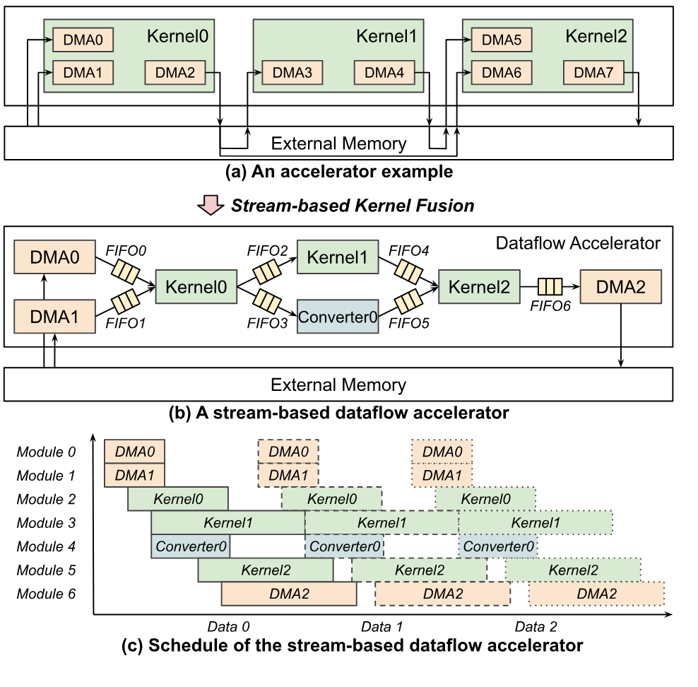

**图 1.** 数据流加速器的计算模式.

内核可以通过动态调度 [Jos18] 使用*数据流*电路来设计, 也可以采用不同的*数据流*策略 (例如输入驻留), 以高效复用片上数据 [Che17a]. 尽管术语相同, 这些*数据流*概念与本文讨论的数据流架构和加速器在概念上彼此正交.

数据流架构的核心思路是通过片上 FIFO 在内核之间流式传输中间结果, 而不是频繁访问外部内存. 例如, 在[图 1(b)](#figure-01) 中, *Kernel0* 产生的中间结果直接流向 *Kernel1* 和 *Converter0*, 不必像[图 1(a)](#figure-01) 那样经过外部内存. 按照 [Pra24] 提出的惯例, 我们将启用数据流内核之间的流式传输称为*基于流的内核融合*. 而且, 如[图 1(c)](#figure-01) 所示, 数据流加速器的调度允许 *Kernel1* 和 *Converter0* 在 *Kernel0* 完成之前开始执行. 这种重叠执行能显著提高总体吞吐量并降低延迟.

<span id="figure-02"></span>

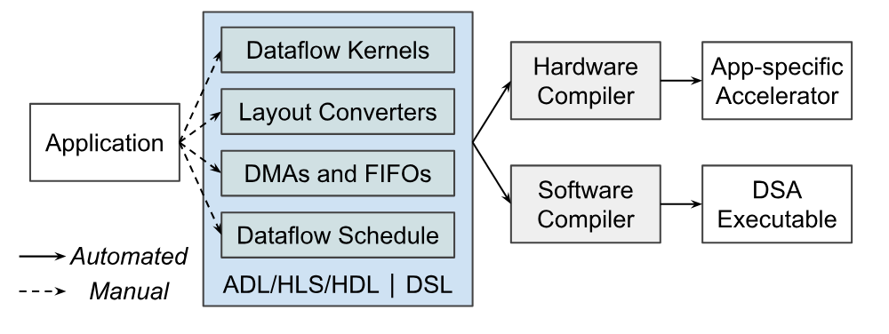

**图 2.** 当前的数据流加速器设计范式.

<span id="section-1-2"></span>

### 1.2 数据流加速器编程

[图 2](#figure-02) 展示了当前的数据流加速器编程范式. 数据流加速器通常分为专用加速器和领域专用加速器 (DSA) 两类, 下面分别讨论.

<span id="section-1-2-1"></span>

#### 1.2.1 专用加速器

在这一类别中, 数据流组件和调度专门针对单一应用设计. 因此, *编程*通常是指架构和微架构的*设计*或*生成*. 传统上, 这项工作使用硬件描述语言 (HDL), 高级综合 (HLS) 和 Chisel [Bac12] 等元 HDL 完成 [Che05, Zha18a, Chi18a, Sar23]. 近来出现的加速器设计语言 (ADL) 旨在提高生产效率 [Che24v, Dur20, Tho20], 它们引入类型系统和原语来描述计算, 内存布局及数据流调度. 如[图 2](#figure-02) 所示, 现有方案需要人工将应用转换为数据流调度和组件, 再将其交给 HLS, 元 HDL 转译器或供应商 EDA 工具来生成硬件. 虽然 ADL 和 HLS 框架包含设计空间探索 (DSE) [Koe16, Koe18, Ben19a, Ye22, Ago22, Zha24z], 但这些工作主要关注单个内核的优化.

<span id="section-1-2-2"></span>

#### 1.2.2 数据流 DSA

DSA 旨在高效完成某一类应用或特定领域中的计算, 并非通用处理器. DSA 往往采用类似粗粒度可重构架构 (CGRA) 的架构 [Gai19, Pra24, Pra17, Now17], 其中的片上资源可重新配置, 用于实现不同的数据流设计. 现代 DSA 使用 C/C++ 原语 [Gai19, Zhu23c, Zhu24e] 或领域专用语言 (DSL) 编程, 例如 Spatial [Koe18], Halide [Rag13] 和 TVM [Che18f], 以生成针对特定领域优化的代码. 如[图 2](#figure-02) 所示, 开发者必须用这些 DSL 或 API 手动将应用转换为逻辑组件. 随后, 软件编译器将这些组件映射到物理资源, 并生成最终的二进制文件供片上执行. 这些 DSL 往往具备数据流内核的自动调优能力, 但主要优化单个内核, 而非整个数据流应用, 因此仍有大量性能收益尚未实现.

<span id="section-1-3"></span>

### 1.3 局限

<span id="section-1-3-1"></span>

#### 1.3.1 局限 1: 内核间关联

先前研究 [Ye22, Ye24c] 表明, 内核间关联会影响加速器性能. 由于内核以流水线方式执行, 必须平衡各内核的延迟才能获得最佳吞吐量. 而且, 通过缓冲区连接的内核需要采用一致的并行化策略, 以免低效使用内存. 但先前工作只考虑了支持内存映射访问的乒乓缓冲区. FIFO 的限制更严格, 因为数据必须按顺序推入和拉取. 这给每个内核带来以下挑战:

1. *分块*: 选择能够进行流式传输, 尽量减少局部缓冲并保持内存效率的块大小.
2. *置换*: 对循环重新排序, 以减少数据流式传输时的内存使用量.
3. *向量化*: 选择循环展开策略, 以平衡延迟并提高流式传输效率.

这些决策在不同内核之间相互依赖, 因而难以通过解析模型或人工设计进行全局优化.

<span id="section-1-3-2"></span>

#### 1.3.2 局限 2: 外部内存访问

大多数现有编译器 [Ye22, Ago22, Ye24c, Zha22e, Zha24z, Bas25] 都假设所有数据能放入片上内存, 这对大型应用并不现实. 涉及片外内存时, 每个 DMA 都必须处理以下问题:

1. 如何让内存访问与内核执行重叠?
2. 哪种数据布局最适合流式传输模式?
3. 如何打包或向量化数据, 以最大限度利用带宽?

这些问题需要并不简单的模式分析, 人工处理也容易出错. DMA 设计还与内核分块和调度紧密耦合, 进一步增加了复杂度.

<span id="section-1-3-3"></span>

#### 1.3.3 局限 3: 基于流的内核融合

基于流的内核融合旨在让所有中间结果都在片上流式传输, 只让输入和输出使用外部内存. 但生产者和消费者内核的计算模式不同, 流布局往往不兼容. 因此需要:

1. 检查内核之间的布局兼容性.
2. 生成最小的即时流布局转换器.
3. 确保转换器能放入可用的片上内存.

这些步骤涉及复杂的模式分析, 还需要从全局审视系统, 因此人工解决并不现实.

<span id="section-1-3-4"></span>

#### 1.3.4 局限 4: FIFO 大小设定

如[图 1](#figure-01) 所示, 如果 *Kernel1* 比 *Converter0* 慢, FIFO 可能发生上溢或下溢, 引发连锁停顿并最终造成死锁. 虽然已有动态调度方案 [Jos21], 粗粒度加速器仍依赖人工设定大小 [Che24v, Che24u], 无法扩展到大量 FIFO. 近期的一种自动化方法 [Hon24c] 通过仿真确定 FIFO 大小, 但耗时很长, 可扩展性也不足.

<span id="figure-03"></span>

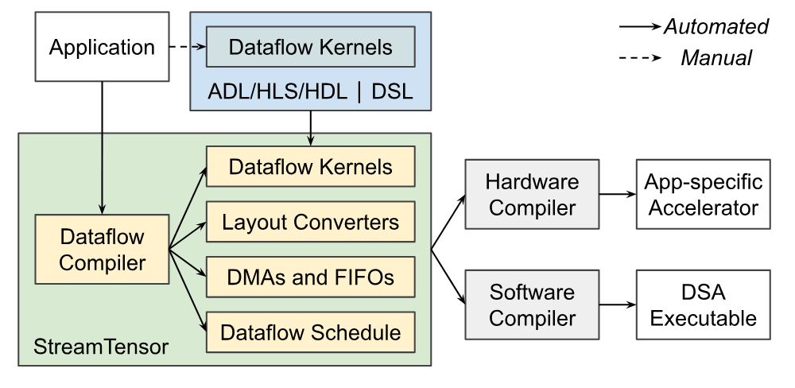

**图 3.** 本文提出的数据流加速器设计范式.

<span id="section-1-4"></span>

### 1.4 本文方案

由于[第 1.3 节](#section-1-3) 所述的局限, [图 2](#figure-02) 中的现有范式难以扩展到大型数据流加速器. 因此, 我们提出转向[图 3](#figure-03) 所示的设计范式. 我们并不主张完全自动化, 因为 ADL, HLS, HDL 或 DSL 对设计局部缓冲区和向量化等单个数据流内核仍不可或缺. 但在单个内核设计或生成后, 我们认为编译器应自动生成数据流调度, 将内核组装成应用级数据流加速器, 并用算法解决[第 1.3 节](#section-1-3) 指出的局限. 这类似于 GPU 软件生态: CUDA 和 Triton [Til19b] 等 DSL 用于设计或自动调优单个 GPU 内核, 内核的组装和调度则由编译器自动完成, 从而形成既高效又可扩展的编程范式.

基于这一思路, 我们提出 *StreamTensor*, 这是一个可在数据流架构中自动进行张量流式传输的编译器. 本文说明如何系统且分层地处理各项局限. StreamTensor 是这方面的早期工作, 它为每项挑战提出算法方案, 并通过大型基准测试验证这些方案的有效性. 这些方案未必最优, 但它们清楚地给出了定义明确的优化子问题, 也提供了跨设计空间协同优化的机会. 总体而言, 本文有以下贡献:

1. 我们提出 StreamTensor, 这是首个从 PyTorch 到设备的数据流编译器, 能够自动生成基于流的数据流加速器及其对应的运行时系统.
2. 我们首次提出一种系统编码流信息的迭代张量 (`itensor`) 类型. 该类型系统是实现基于流的内核融合和生成数据流组件的基础, 能提高数据流加速器设计的可扩展性和生产效率.
3. 我们提出张量分块空间, 内核融合空间和资源分配空间这 3 个设计空间, 以算法化, 层次化的方式覆盖数据流架构中繁复的设计空间. 我们还为每个设计空间提出一种探索算法, 用于降低资源使用量并改善延迟和吞吐量.
4. 我们提出基于分段函数的令牌行为模型, 将数据流加速器的 FIFO 大小设定问题转化为调度问题. 我们进一步提出一种线性规划 (LP) 算法来求解该问题, 在避免死锁的同时降低资源使用量.
5. 我们在 FPGA 平台上使用 LLM 评估 StreamTensor, 观察到相较当前最先进的 FPGA LLM 加速器和 GPU, 延迟最多分别降低至 0.76 倍和 0.64 倍; 相较 GPU, 能效最高达到 1.99 倍.

<span id="figure-04"></span>

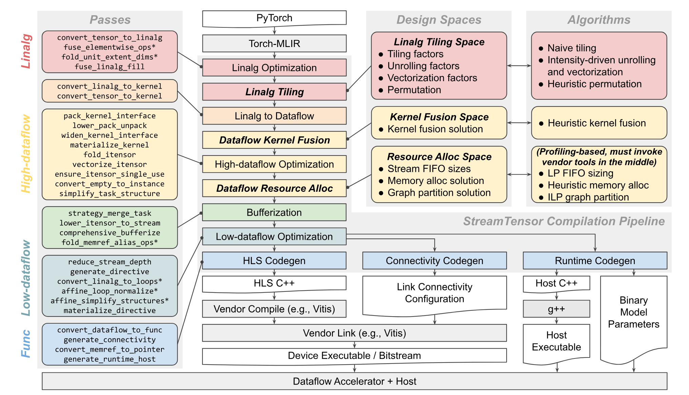

**图 4.** 本文提出的 StreamTensor 框架.

<span id="section-2"></span>

## 2 StreamTensor 框架

StreamTensor 是一个编译框架, 用于将 PyTorch 模型转换为经过优化的数据流实现. 它构建在 MLIR [Lat21a] 编译框架之上. StreamTensor 的整体架构如[图 4](#figure-04) 所示. 编译过程从 Torch-MLIR [Tor21] 提供的 PyTorch 模型开始, 并经过若干阶段. 首先, 使用 MLIR 内置的线性代数 (Linalg) 操作, 将张量操作转换为结构化中间表示 (IR). 随后, MLIR 的 Linalg pass 会对该 IR 进行优化, 例如融合逐元素操作. 接着, StreamTensor 应用设计空间探索 (DSE) 算法确定最优分块策略, 并根据计算模式考虑块大小, 展开因子和置换等因素. 随后, Linalg IR 被转换为数据流 IR, 其中计算被组织为层次化任务. DMA, 流布局转换器和 FIFO 等所有数据流组件都在这一阶段生成. 这里还会进行几项重要优化, 例如通过基于流的内核融合减少外部内存访问, 并通过 FIFO 大小设定平衡生产者和消费者的执行. 在最后几个阶段, StreamTensor 生成硬件专用代码和主机运行时. StreamTensor 负责内存分配, 流连接和指令具体化, 从而使 HLS 等供应商编译器能够生成目标数据流架构. 同时, 它生成主机运行时代码, 负责管理主机 CPU 与数据流加速器之间的数据传输, 内核执行和同步.

<span id="figure-05"></span>


**图 5.** 迭代张量 (`itensor`) 类型系统.

<span id="section-3"></span>

## 3 中间表示

<span id="section-3-1"></span>

### 3.1 类型系统

StreamTensor 引入了一套类型系统, 用于高效验证和优化 IR. 通过 StreamTensor 专用的类型与操作验证器, 该类型系统有助于确保应用任意变换 pass 后 IR 仍然有效.

<span id="section-3-1-1"></span>

#### 3.1.1 动机

传统上, `tensor` 类型会编码数据类型和一组表示形状的整数 [Che18f, Rag13, Lat21a, Hag23a]. 张量可以按内存映射方式访问, 例如可根据偏移量和形状提取或插入切片. 但数据流内核通过 FIFO 通信, FIFO 要求严格的访问顺序, 采用的是流式访问模式而非内存映射访问模式. 因此, 传统张量类型可能无法保证数据流通信的正确性. 即使生产者和消费者使用相同的张量类型, 流访问顺序仍可能存在歧义, 从而引发非预期行为. 例如, Graphene [Hag23a] 的张量类型只编码内存映射布局. 因此, 如果生产者按行优先顺序生成流, 而消费者预期列优先顺序, 即使两者处理相同的张量类型, 也会错误解释数据并造成逻辑损坏. 所以, 现有方案虽然足以支持分块等 Linalg 层优化, 但用它们生成数据流组件和应用数据流优化容易出错, 也难以扩展.

<span id="table-01"></span>


**表 1.** 迭代张量 (`itensor`) 操作.

<span id="section-3-1-2"></span>

#### 3.1.2 迭代张量类型

为解决这个问题, 我们提出新的 `itensor` 类型, 它显式编码流布局信息, 从而使基于类型的验证和优化既可行又高效. [图 5](#figure-05) 展示了由同一个 `tensor<8x8xf32>` 类型的 `tensor` 转换得到的 3 个 `itensor` 示例. 要将张量转换为 `itensor`, 首先要将它划分成相同的张量切片或向量. 例如, 在[图 5(b)](#figure-05) 中, 张量被划分成 8 个形状为 `4x2` 的张量切片. 随后, 在一个定义好的迭代空间 (通常是嵌套循环) 内迭代访问这些切片. 迭代空间由 2 个列表定义: 迭代次数和步长. 在[图 5(b)](#figure-05) 中, 迭代空间为 `[4,2]*[2,4]`, 产生的迭代索引为 `[0,0]`, `[0,4]`, `[2,0]`, `[2,4]` 等. 从迭代空间到数据空间的映射由仿射映射指定, 例如[图 5(b)](#figure-05) 中的 `(d0,d1)->(d1,d0)`, 它会转置迭代索引. 因此, 数据访问索引变为 `[0,0]`, `[4,0]`, `[0,2]`, `[4,2]` 等, 对应[图 5(b)](#figure-05) 所示的转置. 在 `itensor` 中, 张量切片可以被多次访问, 其模式会显式编码在迭代映射中. 例如, 在[图 5(c)](#figure-05) 中, 迭代空间是 `[4,2,2]*[2,1,4]`, 迭代映射是 `(d0,d1,d2)->(d2,d0)`, 其中维度 `d1` 不对应任何数据维度. 当 `d1` 从 0 迭代到 1 时, 所有较低位的维度 (例如 `d2`) 都会重新迭代. 因此, 对应的数据维度 (例如行维度) 也会被再次访问, 对形状为 `4x2` 的张量切片产生 `[0,0]`, `[4,0]`, `[0,0]`, `[4,0]`, `[0,2]` 等索引. 通过在 `itensor` 类型中编码元素形状, 迭代空间和迭代映射, 可以唯一确定数据流内核的流模式. 当生产者和消费者的 `itensor` 类型匹配时, 可以在两者之间安全建立流式通信 ([图 5](#figure-05) 中的 *Case1*). 否则, 必须在两者之间插入流布局转换器 ([图 5](#figure-05) 中的 *Case2*), 并且可以根据 `itensor` 类型解析推断布局转换所需的最小乒乓缓冲区大小. 布局转换器的生成细节将在[第 5.2.1 节](#section-5-2-1) 讨论. 现有的张量类型系统缺少流信息, 不足以支持基于流的内核融合, 因而限制了它在基于流的数据流优化中的用途.

<span id="section-3-1-3"></span>

#### 3.1.3 流类型

在传统张量编译器中, 高层张量 IR 必须*缓冲区化*为低层内存或缓冲区 IR, 才能进行低层优化和代码生成. 沿用这一惯例, 我们提出 `stream` 类型, 它在缓冲区化过程中由 `itensor` 类型降级而来. 与不可变的 `itensor` 对象不同, `stream` 对象表示硬件 FIFO, 并支持通过流读取和流写入等操作进行修改. `stream` 类型只编码数据类型和 FIFO 深度, 流布局信息则在缓冲区化过程中移除. 因此, 数据流组件的生成和优化必须在 `itensor` 层 IR 上完成. 缓冲区化之后, `stream` IR 专用于更低层的硬件或运行时优化和代码生成.

<span id="table-02"></span>


**表 2.** 流 (`stream`) 和缓冲区操作.

<span id="table-03"></span>

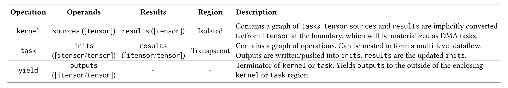

**表 3.** 结构操作.

<span id="section-3-2"></span>

### 3.2 操作

基于[第 3.1 节](#section-3-1) 的类型系统, StreamTensor 引入 `itensor` 和 `stream` 操作来表示不同的数据流行为. 此外还引入了结构操作来表示数据流加速器的多层层次结构, `itensor` 层和 `stream` 层 IR 共用这些操作.

<span id="section-3-2-1"></span>

#### 3.2.1 迭代张量操作

[表 1](#table-01) 列出了 `itensor` 层的全部操作. 总体而言, 这些操作的含义不言自明; 这里重点说明语义不太直观的几项. 从概念上看, `itensor_write` 相当于向 FIFO 写入或推送一个元素. 它是一项携带目标的操作, 其目标是通过 `dest` 操作数传递的 `itensor`. 例如, 迭代写入[图 5(b)](#figure-05) 中的 `itensor` (称为 `itensor(b)`) 可以表示为:

```text
%empty = itensor_empty() : itensor(b)
%res0 = scf.for 0 to 8 step 2 iter_args={%arg0 = %empty} {
  %res1 = scf.for 0 to 8 step 4 iter_args={%arg1 = %arg0} {
    %value = ... : tensor<4x2xf32> // %value is defined
    %output = itensor_write %value into %arg1 : ...
    scf.yield %output : itensor(b)
  } : itensor(b)
  scf.yield %res1 : itensor(b)
} : itensor(b)
```

这里, `scf` 是 MLIR 内置的结构化控制流方言, 包括 `for` 循环. `scf.for` 也携带目标, 其中 `%empty` 作为参数传入, 再通过 `itensor_write` 迭代推送. 最后, `%res0` 作为最终结果返回. 相比之下, `itensor_read` 表示从 FIFO 拉取一个元素. 例如, 读取 `itensor(b)` 可以表示为:

```text
%source = ... : itensor(b) // %source is defined
scf.for 0 to 8 step 2 {
  scf.for 0 to 8 step 4 {
    %empty = tensor.empty() : tensor<4x2xf32>
    %value = itensor_read %source init %empty : ...
    ... = ... %value ... // %value is used
  }
}
```

`itensor_converter` 包含一个局部乒乓缓冲区, 用于即时转换流布局. 例如, 在[图 5](#figure-05) 的 *Case1* 中, 源和目标使用相同的 `itensor` 类型, 可以通过 FIFO 连接. 在 *Case2* 中, 两者类型不同, 因此必须插入转换器. 要适配这些流布局, 至少需要一个 `8x2` 乒乓缓冲区. 当源向 ping 缓冲区写入时, 目标会读取 pong 缓冲区 2 次, 随后两者交换.

<span id="section-3-2-2"></span>

#### 3.2.2 流操作

[表 2](#table-02) 列出了 `stream` 层的操作. 这些操作大多不言自明; 这里重点说明它们与 `itensor` 操作的主要区别. 如[第 3.1.3 节](#section-3-1-3) 所述, `stream` 对象可变, 不再使用携带目标的语义. FIFO 的推入和拉取可以写成:

```text
%stream = stream() : stream<f32, depth: 32>
scf.for 0 to 8 step 2 {
  scf.for 0 to 8 step 4 {
    %value = ... : f32 // %value is defined
    stream_write %value into %stream : ...
  }
}
scf.for 0 to 8 step 2 {
  scf.for 0 to 8 step 4 {
    %value = stream_read %stream : ...
    ... = ... %value ... // %value is used
  }
}
```

与 `itensor` 携带目标的风格不同, 整个过程中使用的是同一个 `%stream`, 不会创建新的副本. `stream` IR 更适合代码生成, 但会增加定义-使用分析的难度. 因此, 高层数据流优化更适合使用 `itensor`. `stream` 操作由 `itensor` 操作降级而来, 而后者受 `itensor` 类型系统的严格验证, 所以 `stream` 操作的正确性在构造时便有保证.

<span id="figure-06"></span>

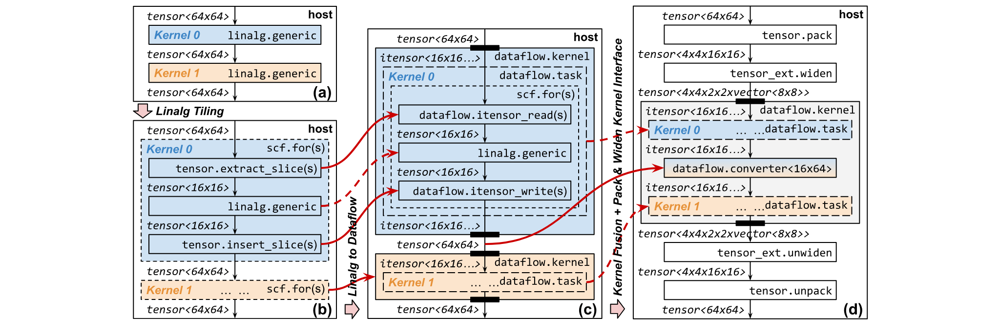

**图 6.** Linalg 分块, Linalg 到数据流的转换和数据流内核融合. 实线箭头表示左侧操作被转换为右侧操作, 虚线箭头表示操作保持不变.

<span id="section-3-2-3"></span>

#### 3.2.3 结构操作

`itensor` 和 `stream` 操作用于建模行为, 结构操作则用于建模层次结构. [表 3](#table-03) 列出了 StreamTensor 的所有结构操作. `kernel` 操作表示数据流内核 (如[图 1](#figure-01) 所示), 其中包含由 `task` 操作组成的图. 它以 `tensor` 作为输入和输出, 并在边界处将其转换为 `itensor` 或从 `itensor` 转换回来. 这些隐式转换相当于 DMA. `kernel` 内部使用片上流式传输, `kernel` 之间则使用外部内存. 例如:

```text
%source = ... : tensor<8x8xf32> // %source is defined
%result = kernel(
  %arg : itensor<b> = %source : tensor<8x8xf32>
) {
  ... = ... %arg ... // %arg is used
  %output = ... : itensor<c> // %output is defined
  yield %output : itensor<c>
} : tensor<8x8xf32>
```

通过在内核边界进行转换, 我们在内核融合期间不必显式处理 DMA, 从而提高变换效率和可分析性. 相比之下, `task` 操作是透明的, 不会在其边界转换类型. 它表示内核中的一项数据流任务, 并且可以嵌套以支持层次化数据流设计. 在 `itensor` 层, `task` 携带目标, 输出通过 `inits` 写入目标, 这能提高定义-使用分析的效率. 例如:

```text
%empty = ... : itensor(b)
%result = task @example inits={%arg = %empty} {
  %value = ... : tensor<4x2xf32> // %value is defined
  %output = itensor_write %value into %arg : ...
  yield %output : itensor(b)
} : itensor(b)
```

经过降级和缓冲区化后, 同一段代码变为:

```text
%stream = stream() : stream<f32, depth: 32>
task @example {
  %value = ... : f32 // %value is defined
  stream_write %value into %stream : ...
}
```

可以看出, `task` 同时组合了 `itensor` 和 `stream` 操作, 因而成为跨两种 IR 的统一结构抽象, 两种 IR 分别服务于不同层次的数据流优化. 最后, 所有数据流 `task` 都会降级为 MLIR 内置的 `call` 和 `func` 操作, 用于生成代码.

<span id="section-4"></span>

## 4 编译流水线

在类型系统和操作的基础上, 我们引入了一条编译流水线, 将 Linalg IR 编译为硬件实现及相应的运行时. 所有编译 pass 如[图 4](#figure-04) 所示. 本节重点介绍 Linalg 到数据流的转换, 数据流内核融合及数据流优化, 这些内容是该编译器独有的, 对理解它也十分必要.

<span id="section-4-1"></span>

### 4.1 Linalg 到数据流

[图 6(a)-(c)](#figure-06) 展示了 Linalg 到数据流的转换过程. 首先, 将原始 Linalg 操作 ([图 6(a)](#figure-06)) 分块为[图 6(b)](#figure-06) 所示的形式, 其中 `scf.for` 表示用于分块的循环嵌套. 在每次迭代中, `extract_slice` 会提取输入张量块, 并将其送入分块后的 Linalg 操作. 操作产生输出块后, `insert_slice` 会将它们插回完整张量. 随后, 每个分块循环嵌套都会原地转换为 `kernel` 操作, 如[图 6(c)](#figure-06) 所示. 输入和输出 `tensor` 会在 `kernel` 边界转换为 `itensor` 或从 `itensor` 转换回来. `itensor` 类型根据以下内容推断:

1. 嵌套的 `scf.for` 循环: 迭代次数和步长定义 `itensor` 的迭代空间.
2. `extract_slice` 和 `insert_slice` 操作的偏移量与大小: 偏移量定义迭代映射, 大小定义元素形状. 例如, 偏移量 `[%iv2, %iv0]` 会产生迭代映射 `(d0,d1,d2)->(d2,d0)`.

转换后, `extract_slice` 和 `insert_slice` 操作会分别替换为 `itensor_read` 和 `itensor_write` 操作. 生成的 `scf.for` 循环嵌套被封装在 `task` 中, 形成单层数据流结构: 一个包含数据流任务的数据流内核. 将 Linalg 语义转换为数据流后, 后续便可以进行面向数据流的变换和优化.

<span id="section-4-2"></span>

### 4.2 数据流内核融合

所有分块后的 Linalg 操作转换为数据流内核后, 这些内核最初都通过传统 `tensor` 通信, 而这些张量最终存储在外部内存中. 为减少这种通信开销, StreamTensor 会应用基于流的内核融合. [图 6(c)-(d)](#figure-06) 展示了这一过程. 要融合 *Kernel0* 和 *Kernel1*, 首先比较 *Kernel0* 的输出 `itensor` 类型与 *Kernel1* 的输入 `itensor` 类型. 如[第 3.1.2 节](#section-3-1-2) 所述, 如果类型匹配, 就可以直接融合内核. 如果不匹配, 则插入[图 6(d)](#figure-06) 所示的流布局转换器. 融合后的内核包含 2 个 `task` 和 1 个 `converter`, 它们都通过 `itensor` 通信, 随后这些 `itensor` 会降级为片上流 FIFO. `itensor` 类型系统使任意数据流内核都能*在设计上*实现融合, 代价是转换器可能占用片上内存. [第 5.2 节](#section-5-2) 将讨论如何在内存约束下探索内核融合空间.

融合后, StreamTensor 会应用其他优化 pass, 提高外部内存访问的效率. 具体而言, 在 `kernel` 前后插入 `tensor` 的 `pack` 和 `unpack` 操作, 在默认内存布局与分块内存布局之间进行转换, 以支持突发内存访问. 例如, 对 `64x64` 张量使用 `[16,16]` 的块大小时, 打包后张量的形状为 `4x4x16x16`. 为最大限度利用外部内存带宽, StreamTensor 会用向量拓宽张量. 例如, 在使用 512-bit DDR 或 HBM 及 `uint8` 元素时, 将 64 个元素组成 `vector<64>` 即可充分利用带宽. 在[图 6](#figure-06) 中, 打包后的张量被拓宽为 `4x4x2x2xvector<8x8>` 形状. 需要注意, `pack` 和 `widen` 操作最终会降级为主机 CPU 上的运行时操作, 用于为加速器准备数据, 这会产生一定的延迟和内存开销. 但对静态张量 (例如预训练参数), `pack` 和 `widen` 可以直接融合进张量, 因而不会产生任何运行时开销. 对动态张量 (例如激活), 通过有效探索 Linalg 分块空间, 可以将 `pack` 和 `widen` 操作与前一层相应的 `unpack` 和 `unwiden` 操作折叠. 因此, `pack` 和 `widen` 操作只用于模型的输入和输出, 在运行时产生的内存及延迟开销可以忽略不计.

<span id="figure-07"></span>


**图 7.** 具体化转换器和 DMA, 折叠 `itensor` 并向量化 `itensor`. 实线箭头表示左侧操作被转换为右侧操作, 虚线箭头表示操作保持不变.

<span id="section-4-3"></span>

### 4.3 数据流优化

<span id="section-4-3-1"></span>

#### 4.3.1 具体化

[图 7(a) 和 (b)](#figure-07) 展示了转换器与 DMA 的*具体化*过程. 具体化是指将高层数据流组件转换为低层实现, 后者通常是包含 `tensor` 和 `itensor` 操作的 `scf.for` 循环嵌套. 最初, 转换器由 `itensor_converter` 表示, DMA 则通过 `kernel` 边界处从 `tensor` 到 `itensor` 或反向的转换隐式处理. 这种抽象有利于内核融合和转换器优化. 例如, 一个生产者的多个消费者可能会产生冗余转换器, 这些转换器可以通过 MLIR 的公共子表达式消除 (CSE) 移除, 而在具体化后这项工作会更困难. 相比之下, 具体化之后, 所有数据流组件都表示为嵌套 `task`, 后续的数据流优化更高效, 也更容易实施. 对转换器而言, 如[图 7(a)](#figure-07) 所示, *Converter0* 包含 2 个 `scf.for` 循环嵌套, 两者通过一个 `16x64` 乒乓缓冲区连接. 这 2 个循环嵌套由一个*共享的*父级 `scf.for` 循环封装, 用于遍历原始的完整 `64x64` 张量. 因此, `16x64` 乒乓缓冲区会复用 4 次, 有效地将片上内存资源使用量降至四分之一. [第 5.2 节](#section-5-2) 将讨论如何根据 `itensor` 类型推断乒乓缓冲区形状和共享循环.

对 DMA 而言, 如[图 7(a)](#figure-07) 所示, 从 `tensor<4x4x2x2xvector<8x8>>` 到 `itensor<16x16...>` 的输入类型转换表示一个 DMA, 它将: 1) 从外部内存加载 `4x4x2x2` 份 `vector<8x8>` 数据; 2) 将这些数据存入 `16x16` 乒乓缓冲区, 以隐藏外部内存访问延迟; 3) 按 `itensor` 类型编码的布局将数据推入 FIFO. 从[图 7(b)](#figure-07) 可以看到, 系统会自动生成 *DMA0*, 用 `scf.for` 循环嵌套实现这 3 种行为. 需要注意, 基于 `itensor` 的类型系统编码了所有转换器和 DMA 信息. 传统张量类型不具备这项能力, 因而限制了它在生成数据流组件时的用途.

<span id="section-4-3-2"></span>

#### 4.3.2 迭代张量折叠

[图 7(b)-(c)](#figure-07) 展示了 `itensor` 折叠. 假设 *DMA0* 中有一个 `itensor_write`, *Kernel0* 中有一个 `itensor_read`, 两者通过 FIFO 连接. 它们表示通过流式传输连接的 2 个独立局部缓冲区. 通过折叠, 可以消除 FIFO 并合并这 2 个缓冲区. 这种优化既能减少片上内存使用量, 也能增加内核之间的执行重叠, 从而改善总体延迟. 如[图 7(c)](#figure-07) 所示, 获取的块会直接传给 *Kernel0* 中的 `linalg.generic` 操作, 消除冗余的缓冲和通信. `itensor` 折叠要求生产者与消费者的内存访问模式完全匹配. 这一限制比基于流的内核融合更严格, 后者可以应用于任意数据流内核之间. 因此, 我们将 `itensor` 折叠作为对已融合内核的额外优化.

<span id="section-4-3-3"></span>

#### 4.3.3 迭代张量向量化

由于数据流内核往往并行运行, 必须将数据流 FIFO 向量化, 以提供足够的带宽. [图 7(c)-(d)](#figure-07) 展示了将 `itensor` 向量化为 `vector<2x4>` 的过程. 在 *DMA0+Kernel0* 一侧, `itensor_write` 变为一个循环, 先执行 `transfer_read` (从缓冲区读取), 再执行 `itensor_write` (写入 FIFO). 在 *Converter0* 一侧, 读取操作采用类似的变换. 这个过程让 FIFO 带宽与数据流内核的并行度保持一致.

<span id="section-5"></span>

## 5 设计空间

要生成可实现且经过优化的加速器, 必须正确配置编译 pass 的参数. 如[图 4](#figure-04) 所示, 我们将总体设计空间划分为 3 个子空间: Linalg 分块空间, 内核融合空间和资源分配空间.

<span id="section-5-1"></span>

### 5.1 Linalg 分块空间

Linalg 分块空间决定各数据流内核的分块因子, 展开因子, 置换策略及输入和输出向量化. 在 StreamTensor 中, 该空间表示为 Linalg 操作图, 每个节点都标注了循环迭代次数, 步长和循环类型 (归约或并行) 等属性. 探索结果也会写回该图, 用于配置变换 pass.

在分块方面, 系统向用户开放超参数 `default_tile_size`, 并将其应用于所有内核的所有维度. 在循环展开方面, 我们开发了一种感知强度的算法, 它通过最大堆迭代选择延迟最长的内核并增大其展开因子, 直到达到用户定义的超参数 `overall_unroll_size`. 这种方法会平衡内核延迟, 以提高吞吐量. 确定展开大小后, 系统通过分析循环迭代空间和张量形状来推断向量化因子. 置换由一种启发式方法处理, 该方法将归约循环外移, 同时让并行循环保持在最内层, 从而降低流水线循环的启动间隔 (II). 在 StreamTensor 中, Linalg 分块空间的超参数由黑盒优化器 Optuna [Aki19] 根据数据流内核融合结果的反馈自动探索.

<span id="section-5-2"></span>

### 5.2 内核融合空间

如[第 4.2 节](#section-4-2) 所述, 内核融合支持内核之间的流式传输. 如果生产者和消费者的 `itensor` 类型不同, 就必须插入转换器. Linalg 分块空间的探索会确定所有数据布局和形状, 从而固定所有数据流内核接口处的 `itensor` 类型. 因此, 融合任意一对内核产生的内存开销也会随之确定. 由于片上内存有限, 通常无法融合所有内核. 为在遵守内存资源约束的同时有效选择要融合的内核对, 我们提出 2 种算法: [算法 1](#algorithm-01) 推断流布局转换器所需的最小乒乓缓冲区形状; [算法 2](#algorithm-02) 在片上内存约束下确定全局融合方案.

<span id="algorithm-01"></span>

**算法 1: 流布局转换器生成的伪代码.**

- **输入:** $\mathit{src}$, 源 `itensor` 类型; $\mathit{res}$, 结果 `itensor` 类型.
- **输出:** $\mathit{bufShape}$, 乒乓缓冲区的形状; $\mathit{beforeLoop}$, 插入乒乓缓冲区处的循环索引.
- 令 $\mathit{bufShape}\gets []$, $\mathit{beforeLoop}\gets 0$.
- 令 $\mathit{sharedLoops}\gets []$, 表示 $\mathit{src}$ 与 $\mathit{res}$ 共享的循环索引.
- **对于** $\mathit{dim}\gets 0$ **至** $\mathit{src}.\mathrm{rank}()-1$:
  - **如果** $\mathit{src}.\mathrm{elementSize}(\mathit{dim})\neq\mathit{res}.\mathrm{elementSize}(\mathit{dim})$: **跳出**.
  - 令 $\mathit{srcExpr}\gets\mathit{src}.\mathit{iterMap}[\mathit{dim}]$.
  - 令 $\mathit{resExpr}\gets\mathit{res}.\mathit{iterMap}[\mathit{dim}]$.
  - **如果** 2 个 $\mathrm{Expr}$ 都是位置相同的维度:
    - 令 $\mathit{bufShape}.\mathrm{append}(\mathit{src}.\mathrm{elementSize}(\mathit{dim}))$.
    - 令 $\mathit{sharedLoops}.\mathrm{append}(\mathit{srcExpr}.\mathit{pos})$.
    - 令 $\mathit{beforeLoop}\gets\mathit{beforeLoop}+1$.
  - **否则:** **跳出**.
- **当** 存在 $\mathit{loop}\in\mathit{sharedLoops}$ 且 $\mathit{loop}\geq\mathit{beforeLoop}$ **时**:
  - 令 $\mathit{bufShape}.\mathrm{pop}()$, $\mathit{loop}\gets\mathit{sharedLoops}.\mathrm{pop}()$.
  - **如果** $\mathit{loop}\neq -1$: 令 $\mathit{beforeLoop}\gets\mathit{beforeLoop}-1$.
- 令 $\mathit{bufShape}.\mathrm{append}(\mathit{src}.\mathit{shape}[\mathit{bufShape}.\mathrm{size}():])$.
- **返回:** $\{\mathit{bufShape},\mathit{beforeLoop}\}$.

<span id="section-5-2-1"></span>

#### 5.2.1 流布局转换器生成

[算法 1](#algorithm-01) 会在每个数据维度上比较源 `itensor` 与目标 `itensor` (第 3-16 行). 只有满足以下条件时, 才能沿某个数据维度缩减乒乓缓冲区的大小: 1) 两者的元素大小相等 (第 4-5 行); 2) 两者对应的迭代维度相等, 即指向同一层循环嵌套 (第 8-16 行). 例如, 在[图 5](#figure-05) 中, `itensor(b)` 和 `itensor(c)` 的第 2 个数据维度都对应迭代维度 `d0`, 因而可以缩减这一维度; 只需缓冲一列张量块. 在具体化过程中, 系统会生成共享循环, 以便沿该缩减维度复用缓冲区. 相反, 两者的第 1 个数据维度分别对应迭代维度 `d1` 和 `d2`, 因此无法缩减. 所以必须缓冲所有行的张量块. 因此, 如[图 5](#figure-05) 所示, 布局转换器需要 2 个张量块 (采用乒乓缓冲后为 4 个张量块).

识别出可缩减的数据维度和相应共享循环后, 算法会过滤掉父循环不可共享的维度和循环, 以确保缓冲区可实现 (第 17-19 行). 例如, 如果循环 `{0,1,2,4}` 可以共享, 而循环 3 不可共享, 则必须排除循环 4. 最后, 算法返回缓冲区形状和共享循环. 这一过程的最坏情况是没有任何维度可以缩减, 因而必须将全部数据保存在片上才能进行融合. 这可能产生大量内存开销.

<span id="algorithm-02"></span>

**算法 2: 内核融合探索的伪代码.**

- **输入:** $G$, 内核融合设计空间; $C_{\max}$, 最大融合代价.
- **输出:** $F$, 要融合的节点集合; $C$, 融合节点的代价.
- 令 $F\gets[\emptyset]$, $C\gets[0]$, $M\gets\{\}$, 即从节点到融合索引的映射.
- **对于** $n$ **属于** $\mathrm{topo\_sort}(G)$:
  - 令 $\mathit{cand}\gets\{\}$, 它是从融合候选索引到代价的映射.
  - **对于** $p$ **属于** $G.\mathrm{predecessors}(n)$:
    - 令 $\mathit{cost}\gets\mathrm{compute\_memory\_cost}(G.\mathit{edges}[p,n,0])$.
    - 令 $\mathit{cand}[M[p]]\gets\mathit{cand}.\mathrm{get}(M[p],0)+\mathit{cost}$.
  - 令 $\mathit{f\_idx}\gets\mathrm{len}(F)$, $\mathit{f\_cost}\gets 0$.
  - **如果** $\mathrm{len}(\mathit{cand})>0$:
    - 令 $\mathit{f\_idx}\gets\max(\mathit{cand}.\mathrm{keys}())$, $\mathit{f\_cost}\gets\mathit{cand}[\mathit{f\_idx}]$.
  - **如果** $\mathit{f\_idx}=\mathrm{len}(F)$ **或** $\mathit{f\_cost}+C[\mathit{f\_idx}]>C_{\max}$:
    - 令 $F.\mathrm{append}(\{n\})$, $C.\mathrm{append}(0)$, $M[n]\gets\mathrm{len}(F)-1$.
  - **否则:**
    - 令 $F[\mathit{f\_idx}].\mathrm{add}(n)$, $C[\mathit{f\_idx}]\gets C[\mathit{f\_idx}]+\mathit{f\_cost}$.
    - 令 $M[n]\gets\mathit{f\_idx}$.
  - 令 $G.\mathit{nodes}[n][\texttt{"fusion\_index"}]\gets M[n]$.
- **返回:** $F,C$.

<span id="figure-08"></span>

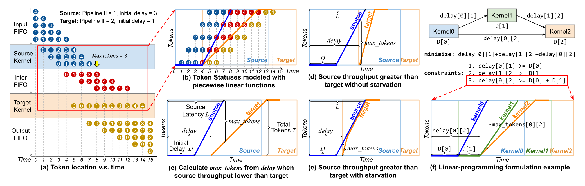

**图 8.** 使用分段线性函数进行令牌行为建模, 以及基于线性规划的 FIFO 大小设定公式.

<span id="section-5-2-2"></span>

#### 5.2.2 内核融合探索

[算法 2](#algorithm-02) 的输入 $C_{\max}$ (*最大融合代价*) 表示单个融合内核最多可使用的片上内存. 对 FPGA 而言, 该值通常设为片上内存的总大小. 因此, 内核融合过程也可以看作图划分问题. 融合后, 每个生成的融合内核会占用一块 FPGA. 如果计算图包含多个这样的内核, 可以让它们在多块 FPGA 上运行, 在单块 FPGA 上顺序运行, 或采用混合方式. 作为编译器, StreamTensor 支持所有这些方式. 但将 $M$ 个内核映射到 $N$ 块 FPGA 并管理 FPGA 间通信不在本文范围内. [算法 2](#algorithm-02) 按拓扑顺序遍历所有 `kernel` (第 3 行). 对每个内核, 它首先从前驱节点中收集融合候选并计算融合代价 (第 4-11 行). 如果不超过资源限制 (第 15-20 行), 就将该内核与最近的有效候选融合 (第 13-14 行). 融合结果会写回图中 (第 22 行), 用于配置[第 4.2 节](#section-4-2) 讨论的优化. 除非单个内核使用的资源超过单块 FPGA 的容量, 否则数据流内核融合始终存在可行解. 出现这种情况时, 结果会反馈到分块空间做进一步调整, 例如减小分块因子和/或展开因子.

<span id="section-5-3"></span>

### 5.3 资源分配空间

在 FPGA 等硬件上, 片上内存和计算资源有限, 有效的资源分配会显著影响布线拥塞和时钟频率. 在这个空间中, 我们需要解决:

1. **FIFO 大小设定**: 确定 FIFO 深度, 以避免死锁并增加执行重叠. 本节将详细介绍这一问题.
2. **图划分**: 在多裸片硬件上, 需要将 `task` 分配给各裸片. 这一分配问题使用整数线性规划 (ILP) 建模并求解. 在我们的 ILP 模型中, 一个二进制列表表示每个 `task` 的分配结果. 约束确保该列表中只能有一个元素为 "1", 该元素的位置表示分配到的裸片. ILP 的目标是同时尽量减少裸片间通信以及各裸片之间的资源不平衡. 类似的公式已有研究 [Guo21b, Du23b], 因此这里省略更多细节.
3. **内存分配**: 按照大小优先级, 将各缓冲区放入 FPGA 上的 LUTRAM, BRAM 或 URAM. 该算法较为直接, 因此这里省略更多细节.

<span id="section-5-3-1"></span>

#### 5.3.1 令牌行为模型

为解决[第 1.3 节](#section-1-3) 讨论的 FIFO 大小设定问题, 我们首先提出一种基于分段线性函数的令牌生产与消费模型. [图 8(a)](#figure-08) 展示了通过 *InterFIFO* 融合的 *Source* 和 *Target* 内核之间的令牌通信. 流水线 II 是连续 2 个输出令牌之间的周期数, 初始延迟则是产生第 1 个输出令牌所需的周期数. 令牌定义为内核之间通信的原子数据元素. 在 *time0*, 5 个输入令牌全都位于 *InputFIFO* 中, 令牌从 *time1* 开始流入 *Source*. 在 *time5*, *Source* 将 *token1* 推入 *InterFIFO*, 同时 *Target* 消费 *token0*, 此时 *InterFIFO* 中剩余 1 个令牌. 在 *time6*, *Target* 无法消费 *token1*, 因为它需要 2 个周期处理 *token0*. 同时, *token2* 被推入 *InterFIFO*, 使其中的令牌数增至 2. 在 *time8*, *Source* 完成令牌处理, 此时 *InterFIFO* 中的令牌数达到最大容量 3. 随后, *Target* 继续消费和处理剩余令牌, 直到 *time15* 时所有令牌都处理完毕.

为了用可分析的函数建模这些复杂行为, 我们将[图 8(a)](#figure-08) 中的令牌状态重新整理成[图 8(b)](#figure-08), 使同一令牌的状态对齐在同一行. 可以看到, *Source* (蓝色) 与 *InterFIFO* (红色) 区域之间的边界可以用分段线性函数 (蓝色曲线) 完整建模. 该函数表示 *Source* *产生*的令牌数. 同理, 可以用橙色曲线建模 *Target* *消费*的令牌数. 2 条曲线之差表示 *InterFIFO* 中的令牌数. 这些曲线可以用内核的延迟, 初始延迟和流水线 II 表示. 在流程中间, StreamTensor 会自动调用 HLS 等供应商工具, 对各内核的这些指标进行性能分析. 这些指标取决于供应商平台的架构, 工艺节点和映射策略, 因此必须通过这种性能分析过程获得. 由于资源分配是最后一个设计空间, 后续 StreamTensor 流程不会再改变内核设计. 只要供应商工具采用确定性调度算法, 最终加速器的指标就会与此前分析得到的指标一致. 这种一致性保证了我们算法的有效性.

<span id="section-5-3-2"></span>

#### 5.3.2 最大令牌数计算

如[图 8(c)](#figure-08) 所示, 我们定义 $L$ 为 *Source* 执行的总延迟; $D$ 为从 *Source* 开始执行到产生第 1 个输出令牌的初始延迟; $\mathit{delay}$ 为从 *Source* 开始执行到 *Target* 开始执行的时间. 显然, $\mathit{delay}$ 始终大于或等于 $D$, 因为 *Target* 无法在 *Source* 产生第 1 个令牌前开始执行. 我们定义 $T$ 为加速器单次执行时从 *Source* 传给 *Target* 的确切令牌数. $T$ 是一个静态值, 可以在 StreamTensor 中根据张量形状解析推断. [第 5.3.5 节](#section-5-3-5) 将说明如何处理动态张量形状. 当 $T$ 为静态值时, 可以根据 $\mathit{delay}$ 解析计算 *InterFIFO* 中的最大令牌数 $\mathit{max\_tokens}$:

<span id="equation-01"></span>

$$
\mathit{max\_tokens}=\min\left(T,~T-\left\lfloor\frac{L-\mathit{delay}}{\mathrm{II}_{\mathrm{Target}}}\right\rfloor\right)
$$

流水线 $\mathrm{II}$ 决定曲线的斜率, 即内核吞吐量. [图 8(c)](#figure-08) 展示了 *Source* 吞吐量大于 *Target* 的情况. 相反, 当 *Source* 的吞吐量较低时, 数据不足可能会限制 *Target* 的吞吐量. [图 8(d)](#figure-08) 表明, 当 $\mathit{delay}$ 足够大时, *Target* 不受影响; [图 8(e)](#figure-08) 则表明 *Target* 最终会因数据不足而停顿, 其吞吐量会与 *Source* 的吞吐量持平. 在这 2 种情况下, 都可以根据 $\mathit{delay}$ 计算 $\mathit{max\_tokens}$:

<span id="equation-02"></span>

$$
\mathit{max\_tokens}=\min\left(T,~\left\lceil\frac{\mathit{delay}-D}{\mathrm{II}_{\mathrm{Source}}}\right\rceil\right)
$$

[式 1](#equation-01) 和[式 2](#equation-02) 都表明 $\mathit{max\_tokens}$ 与 $\mathit{delay}$ 正相关. 如[图 8(c)-(e)](#figure-08) 所示, 将 *InterFIFO* 深度设为 $\mathit{max\_tokens}$ 可防止 *Target* 对 *Source* 施加反压. 这使任意一对 *Source* 和 *Target* 在加速器的多次执行中保持稳定的周期性行为. 避免反压造成的停顿后, $\mathit{max\_tokens}$ 与 $\mathit{delay}$ 之间的解析关系也得以保持.

<span id="section-5-3-3"></span>

#### 5.3.3 均衡

[第 5.3.2 节](#section-5-3-2) 所述的方法称为*常规*均衡策略, 它假设内核始终以原始吞吐量产生令牌. 但数据流加速器的吞吐量最终由其中最慢的内核决定. 基于这一点, 我们提出*保守*均衡策略, 它会*缩放*所有内核的流水线 II, 使其吞吐量与最慢的内核一致. 这样得到的 *max_tokens* 小于或等于*常规*策略的结果, 因为任意一对 *Source* 与 *Target* 曲线之间的间距会缩至最小. 其缺点是更快的内核会因反压而频繁停顿, 可能增加延迟. 因此, *常规*策略和*保守*策略体现了面积与性能之间的取舍, 其中*保守*策略以增加总体延迟为代价, 将 FIFO 缓冲区大小降至最低. *保守*策略与*常规*策略的主要区别在于最初如何缩放各自的 II. 由于这种缩放保持了内核曲线的分段线性性质, 2 种策略根据 $\mathit{delay}$ 计算 $\mathit{max\_tokens}$ 的公式完全相同.

<span id="section-5-3-4"></span>

#### 5.3.4 基于 LP 的 FIFO 大小设定

通过引入令牌行为模型, 我们将 FIFO 大小设定问题转化为确定内核之间 $\mathit{delay}$ 值的问题. [图 8(f)](#figure-08) 展示了一个数据流图示例. *Kernel0* 有 2 个输出; *Kernel1* 依赖 *Kernel0*; *Kernel2* 有 2 个操作数, 必须等待 *Kernel0* 和 *Kernel1* 的第 1 个令牌. 由于 *Kernel1* 会在 `D[0]+D[1]` 后产生第 1 个令牌, `delay[0][2]` 必须大于或等于该值. 它们之间的关系如[图 8(f)](#figure-08) 所示, 其中绿色曲线表示 *Kernel1*. 随后, 可以使用 `delay[0][2]` 计算 *Kernel0* 与 *Kernel2* 之间 FIFO 的最大令牌数 `max_token[0][2]`. 如果 FIFO 大小小于该最大值, *Kernel0* 会因反压而停顿, 从而损害总体性能. 该停顿可能传播到 *Kernel1* 和 *Kernel2*, 使反压无法解除并可能造成死锁. 将 FIFO 大小设为 `max_token[0][2]` 足以防止反压并避免死锁; 要防止非预期的内核停顿造成性能下降, 这一大小也必不可少. 我们提出一种 LP 公式, 用于求出最优的 $\mathit{delay}$ 值. 给定 $G=(V,E)$, 其中 $V$ 是内核集合, $E$ 是内核之间的边集合, LP 的目标与约束如下:

<span id="equation-03"></span>

<span id="equation-04"></span>

$$
\begin{aligned}
\mathrm{minimize} & \sum_{e_{i,j}\in E}\mathit{delay}(i,j) \\
\forall u,v\in V,\forall \mathit{path}\in P_{u,v}, & \sum_{e_{i,j}\in \mathit{path}}\mathit{delay}(i,j)\geq \mathrm{threshold}(u,v)
\end{aligned}
$$

$e_{i,j}\in E$ 涵盖图中的所有边; $\mathit{path}\in P_{u,v}$ 涵盖连接任意一对名为 `u` 和 `v` 的内核的所有完整路径; $e_{i,j}\in \mathit{path}$ 涵盖连接这 2 个内核的一条 $\mathit{path}$ 上的所有边. 我们最小化所有边上 `delay` 的总和, 由于 $\mathit{max\_tokens}$ 与 $\mathit{delay}$ 正相关, 该总和可作为优化 FIFO 大小的代理目标. $\mathrm{threshold}(u,v)$ 是连接 2 个内核 `u` 和 `v` 的所有路径中累积 $D$ 的最大值:

<span id="equation-05"></span>

$$
\mathrm{threshold}(u,v)=\max_{\mathit{path}\in P_{u,v}}\sum_{e_{i,j}\in \mathit{path}}D(i)
$$

上述示例的 LP 公式如[图 8(f)](#figure-08) 所示. 需要注意, 在这个示例中, 从 *Kernel0* 分出的 2 条路径作为 2 个不同的输入操作数重新汇入 *Kernel2*, 而非合并成单个输入. [第 5.3.5 节](#section-5-3-5) 将讨论如何处理路径合并等动态行为. LP 问题不需要资源约束, 原因有 2 点: 第一, 如[第 5.2 节](#section-5-2) 所述, 数据流内核融合通过限制融合代价, 保证所有融合内核都能放入可用的片上资源; 第二, 与数据流内核和转换器相比, 流 FIFO 的内存使用量可以忽略不计. 因此, LP 问题可以在多项式时间内求出最优解. 需要特别说明的是, 我们无需强制供应商工具实现这些 $\mathit{delay}$. 相反, 数据流内核之间的 FIFO 依赖会自动满足这些 $\mathit{delay}$. 在上述示例中, *Kernel2* 会自动等待 *Kernel1*, 因为它依赖 *Kernel1* 的输出令牌.

<span id="table-04"></span>

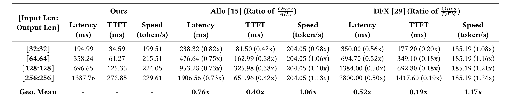

**表 4.** 在 GPT-2 模型上与先前工作的比较. *TTFT* 衡量首个令牌的生成时间, 单位为 ms, 越低越好. *Speed* 衡量解码速度, 单位为 token/s, 越高越好. 先前工作的所有结果均直接取自其论文.

<span id="table-05"></span>

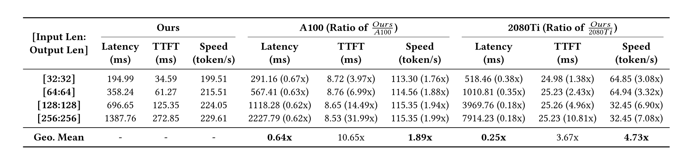

**表 5.** 在 GPT-2 模型上与 NVIDIA GPU 的比较. *TTFT* 衡量首个令牌的生成时间, 单位为 ms, 越低越好. *Speed* 衡量解码速度, 单位为 token/s, 越高越好.

<span id="section-5-3-5"></span>

#### 5.3.5 动态行为

StreamTensor 使用不同的方法管理数据流加速器中的动态行为:

1. **控制流**: StreamTensor 使用 Torch-MLIR [Tor21] 作为前端. Torch-MLIR 会尽量根据输入推断静态张量形状, 从而消除与静态张量形状相关的 `if` 并展开 `for`. 如果控制流依赖运行时值, 相应子图会回退到主机上的朴素 PyTorch 执行 [Ans24a].
2. **路径合并**: 这种情况通常在存在控制流时出现, 尤其是重复使用某个数据流内核, 且其输入来自不同源时. Torch-MLIR 通过消除控制流解决相应的路径合并问题.
3. **动态张量形状**: 输入令牌和 KV 缓存等动态形状张量需要形状提示, 用于定义各维度可能达到的最大大小 (例如最大序列长度). 这些提示决定任意 2 个数据流内核之间可处理的令牌总数 $T$. StreamTensor 根据这些最大的 $T$ 值, 使用[第 5.3 节](#section-5-3) 讨论的方法推断 $\mathit{max\_tokens}$.
4. **FIFO 停顿**: StreamTensor 不会为数据流加速器生成静态调度. 所有数据流内核会通过 FIFO 互连自动遵循其依赖关系. 因此, 外部内存流量等运行时事件造成的非预期 FIFO 停顿无需专门处理. 导致停顿的事件消除后, 数据流加速器会从停顿点自然恢复运行.

<span id="section-6"></span>

## 6 实验

为了评估 StreamTensor 生成的数据流加速器的性能, 我们使用 Vitis 2024.1, 在 AMD U55C FPGA 上部署多个 LLM. 如[图 4](#figure-04) 所示, StreamTensor 生成 HLS C++ 代码, 再由 Vitis 将其编译为比特流, 用于对 FPGA 进行编程. [表 6](#table-06) 展示了本节所评估平台的实验设置. 本文报告的所有 StreamTensor 实验结果均通过*板上测量*获得. 为适配 Torch-MLIR 前端的要求, 所有在 StreamTensor 上评估的 LLM 模型都由 Huggingface 模型修改而来.

<span id="table-06"></span>

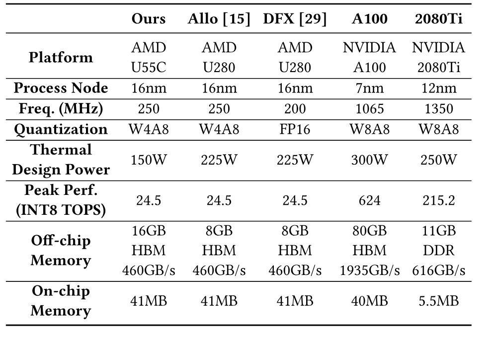

**表 6.** 被评估平台的实验设置.

<span id="figure-09"></span>

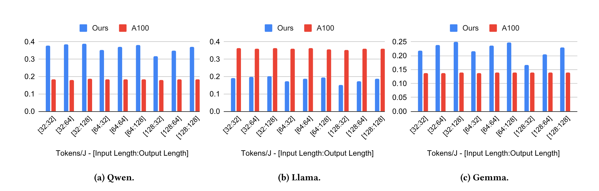

**图 9.** 在新兴 LLM 上与 NVIDIA GPU 的能效 (tokens/J) 比较.

<span id="figure-10"></span>

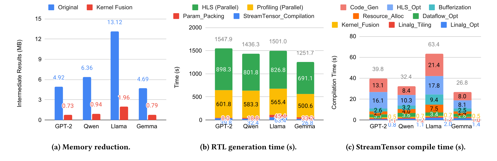

**图 10.** 在 GPT-2 模型和新兴 LLM 上的消融研究.

<span id="section-6-1"></span>

### 6.1 GPT-2

以往大多数 FPGA 研究 [Che24v, Che24u, Hon22] 都使用 GPT-2 [Rad19] 评估其框架. [表 4](#table-04) 比较了不同输入和输出序列长度配置下的 StreamTensor 与先前工作. 对 GPT-2, 我们通过插入布局转换器和流 FIFO, 成功将整个 Transformer 块融合到单块 FPGA 上, 确保所有中间结果都在片上通信. 随后, 使用不同的权重参数多次触发这一单 FPGA 加速器, 依次执行所有 Transformer 块. 与 Allo [Che24v, Che24u] 相比, StreamTensor 的总延迟和 TTFT 分别缩短至 0.76 倍和 0.40 倍. 与 DFX [Hon22] 相比, StreamTensor 的改善更大, 例如 TTFT 缩短至 0.19 倍. 这些收益来自 StreamTensor 自动进行的数据流架构探索. 相比之下, Allo 和 DFX 都需要人工设计所有数据流内核与组件. 例如, 所有布局转换器, DMA 和 FIFO 都要手动编写和配置, 这一过程容易出错, 也可能导致次优的设计选择. 需要注意, Allo 和 DFX 报告的 LLM 只有 GPT-2, 原因是它们在其他新兴 LLM 上的灵活性和生产效率有限. 如[表 4](#table-04) 所示, TTFT 大致随输入长度线性增长, 表明该设计具有可扩展性. 我们还在[表 5](#table-05) 中将 StreamTensor 与 NVIDIA GPU 比较, 相较 A100 和 2080Ti, StreamTensor 的总延迟分别缩短至 0.64 倍和 0.25 倍. 可以看到, 由于计算资源充足, GPU 的 TTFT 指标远优于 StreamTensor. 但 LLM 推理的解码阶段高度受内存限制, StreamTensor 生成的数据流加速器减少了外部内存访问, 因而可以超过 GPU, 获得更高的解码速度和更低的总体延迟.

<span id="table-07"></span>

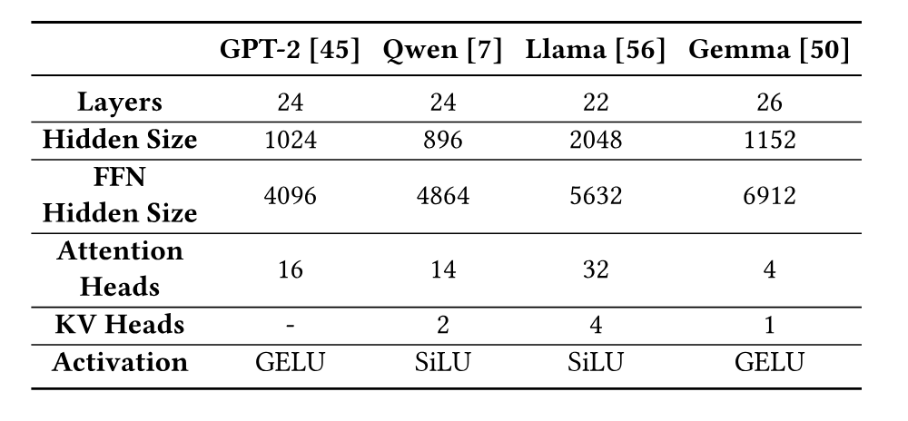

**表 7.** LLM 配置, 收集自相应的 Huggingface 模型卡 [Gpt19, Qwe24a, Lla24a, Gem25b].

<span id="section-6-2"></span>

### 6.2 新兴 LLM

为评估 StreamTensor 的灵活性, 我们在 Qwen [Bai23b], Llama [Tou23] 和 Gemma [Gem24b] 等多个新兴 LLM 上进行测试. 模型配置如[表 7](#table-07) 所示. 对这 3 个模型, 我们同样成功将整个 Transformer 块融合到单块 FPGA 上, 并采用与 GPT-2 相同的方式执行. 从[图 9](#figure-09) 可以看到, 由于 FPGA 功耗较低, StreamTensor 在 Qwen 和 Gemma 模型上的能效分别达到 A100 的 1.99 倍和 1.59 倍. [图 10(a)](#figure-10) 表明, Llama 模型产生的中间结果比其他模型更多. 因此, StreamTensor 会采用更保守的数据流 FIFO 大小设定策略, 继而减少数据流内核之间的执行重叠, 导致其性能低于 Qwen 和 Gemma.

<span id="section-6-2-1"></span>

#### 6.2.1 片上内存缩减研究

[图 10(a)](#figure-10) 展示了所有受评估 LLM 在内核融合前后的片上内存使用量. 该研究关注单个 LLM 层中的*中间结果*. 模型参数过大, 无法放入片上内存, 因此未纳入该研究. 内核融合将内存使用量降至原始设计的 14.8%-16.8%. 如果不进行融合, 中间缓冲区会过大, LLM 因而无法完全以数据流方式部署.

<span id="section-6-2-2"></span>

#### 6.2.2 编译时间研究

[图 10(b)](#figure-10) 展示了从 PyTorch 生成 RTL 的执行时间明细. HLS 过程 (从 C++ 生成 RTL) 占用了总时间的大部分. 下游工具的性能分析也占很大一部分, 因为资源分配决策依赖准确的分析结果. 相比之下, StreamTensor 编译和参数打包只占总时间的一小部分. 如[第 4.2 节](#section-4-2) 所述, StreamTensor 会自动打包并拓宽接口, 以提高外部内存效率. 因此, 必须相应地打包模型参数, 以匹配所需的内存布局. 打包后会生成二进制文件, 并在运行时加载. 在[图 10(c)](#figure-10) 中, 我们进一步按照[图 4](#figure-04) 所示的各阶段细分 StreamTensor 的编译时间. 在我们的实验中, 总编译时间为 26.8s-63.4s. 高层阶段 (从 Linalg 优化到资源分配) 相对较快. 相比之下, 低层阶段 (缓冲区化, HLS 优化和代码生成) 需要更多时间. 这验证了高层 `itensor` 优化的效率.

<span id="section-7"></span>

## 7 相关工作

早期研究 [Lee87, Bil96, Bha01, Thi02, Neu04] 奠定了基于流的数据流建模与编译基础. 后续研究 [Gov02, Ven06, Naj13] 探索了数据流网络中的缓冲区最小化和松弛匹配问题. [Con14a, Che16i] 研究了顺序程序的死锁分析和缓冲区大小设定. 需要注意, 这些论文关注稳态场景 (即[第 5.3.3 节](#section-5-3-3) 中的*保守*均衡策略), 忽略了面积与性能之间的取舍. [Guo21b, Du23b] 改善了 FPGA 流式应用的布局规划和时钟频率. [Jos21, Xu24g] 处理了动态调度数据流电路 [Jos18] 中的缓冲区插入与放置问题.

编译器对将应用映射到 DSA 和 FPGA 等空间架构十分重要. SARA [Zha21h] 为 Plasticine [Pra17] 等大型 DSA 提供了一套编译器栈, 它转换带有嵌套控制流的命令式 DSL, 并实现资源虚拟化和内存一致性管理. Revet [Ruc23] 的编译器使用流式张量操作, 将其支持数据依赖控制流的 "dataflow threads" 抽象映射到向量化 DSA [Ruc21]. DSAGEN [Wen20a] 等工作直接从数据流图描述综合出可编程空间加速器. 基于约束的调度技术 [Now13] 往往使用 ILP, 在空间平台上实现最优或接近最优的指令调度. 更高层的编程抽象同样不可缺少, 例如 Sigma [Zha23n] 将爱因斯坦求和编译到数据流硬件. 面向 FPGA 的 Stream-HLS [Bas25] 能从 C/C++ 或 PyTorch 自动生成经过优化的 HLS 数据流架构. 这些不同的编译器和框架实现了多项重要优化的自动化. 但它们往往只能进行部分设计空间探索, 也缺少系统化的类型系统来支持灵活的基于流的内核融合及其他优化. 这里以 Stream-HLS [Bas25] 为例, 分析它与 StreamTensor 的区别:

- 由于缺少系统化的类型系统, Stream-HLS 无法为外部内存自动生成 DMA, 限制了它在实际应用中的实用性和可扩展性.
- Stream-HLS 忽略了 FIFO 大小设定问题, 而该问题对避免数据流加速器死锁并将其扩展到实际应用必不可少.
- Stream-HLS 要求满足 2 个条件才能启用数据流内核之间的流式传输: 1) 对共享缓冲区的写入次数与读取次数必须相等; 2) 生产者的写入顺序必须与消费者的读取顺序匹配. 这 2 个条件往往都难以满足, 但只要有任意一个未满足, Stream-HLS 就无法执行内核融合. 相比之下, StreamTensor 通过基于 `itensor` 的类型系统解决这 2 个条件, 让任意数据流内核都能在设计上实现融合.
- 由于上述原因, Stream-HLS 不支持 StreamTensor 所具备的内核融合空间探索, 因而限制了它在大型工作负载中的应用, 因为这类负载若不进行内核融合就无法全部部署到片上. 例如, Stream-HLS 只分别报告多头注意力层和前馈层的性能, 而不是整个 Transformer 块的性能.

<span id="section-8"></span>

## 8 结论与未来工作

本文介绍 StreamTensor, 这是一个自动生成并优化基于流的数据流加速器的编译器框架. StreamTensor 的主要贡献包括一套构成整个框架基础的 `itensor` 类型系统, 一条从 PyTorch 到设备的编译流水线, 以及一组用于探索主要架构参数的设计空间. StreamTensor 处理了现有框架中的常见局限, 从而有效提高数据流加速器的效率. 随着对高效 AI 的需求不断增长, StreamTensor 为可扩展, 可拓展的数据流编译后续研究提供了基础.

展望后续工作, StreamTensor 的模块化设计和 `itensor` 类型系统为扩展其对不同数据流架构及专用内核语言的兼容性提供了可行方向. 通过重新定位低层编译和代码生成阶段, StreamTensor 可以适配 AMD Versal [Gai19], Sambanova RDU [Pra24] 和 Groq LPU [Abt22] 等可编程架构. 这一过程会将 StreamTensor IR 中的数据流内核, FIFO 和布局转换器映射为平台专用组件, 例如 AMD Versal 中的 AI 引擎和路由网络. 同样, StreamTensor 可以与 Allo [Che24v] 等内核语言集成, 使开发者能够将人工优化的内核作为黑盒组件纳入其中. 在这 2 种场景中, `itensor` 系统都是重要的抽象层, 使 StreamTensor 能够在对接目标专用后端和黑盒组件的同时, 执行内核融合和数据流组件生成等高层数据流优化. 这有望利用不同硬件平台和编程语言各自的优势, 扩大 StreamTensor 的适用范围.

## 致谢

感谢所有匿名审稿人, 特别是我们的匿名 shepherd 提出的宝贵反馈与建议. 感谢 Vikram Adve, Jian Huang 和 Stephen Neuendorffer 对本工作的深入反馈. 感谢 Kaiwen Cao 在 Inspirit IoT, Inc. 实习期间收集 FPGA 实验结果. 感谢 Jinghua Wang 收集 GPU 实验结果. 感谢 AMD 向 Inspirit IoT, Inc. 提供本研究使用的 FPGA 板卡.
