> [William Fedus](https://acsweb.ucsd.edu/~wfedus/) [+equal-contribution], [Barret Zoph](https://barretzoph.github.io/) [+equal-contribution], 以及 [Noam Shazeer](https://www.noamshazeer.com/). 论文于 2021 年 1 月 11 日首次提交至 arXiv, 当前版本为 v3. 2022 年 4 月发表于 *Journal of Machine Learning Research*, 第 23 卷, 论文 120, 第 1-40 页. [Switch Transformers: Scaling to Trillion Parameter Models with Simple and Efficient Sparsity](https://arxiv.org/abs/2101.03961). <a href="/paper/switch-transformers.pdf" target="_blank" rel="noopener noreferrer">原始 PDF</a>. [JMLR 版本](https://www.jmlr.org/papers/v23/21-0998.html). [TeX 源文件](https://export.arxiv.org/e-print/2101.03961). 精确的印刷版式与参考文献以原始 PDF 为准.

## 摘要

在深度学习中, 模型通常对所有输入复用同一组参数. 混合专家 (MoE) 模型打破了这种方式, 转而为每个输入样本选择*不同的*参数. 由此得到的模型以稀疏方式激活, 参数量大得惊人, 计算成本却保持不变. 然而, 尽管 MoE 已取得多项显著成果, 其复杂性, 通信成本和训练不稳定性仍阻碍了广泛采用. 我们引入 Switch Transformer 来解决这些问题. 我们简化 MoE 路由算法, 设计出直观且更好的模型, 降低通信与计算成本. 我们提出的训练技术缓解了不稳定性, 并首次表明大型稀疏模型可以用较低精度 (bfloat16) 格式训练. 我们基于 T5-Base 和 T5-Large [Raf19] 设计模型, 在相同计算资源下将预训练速度最高提升 7 倍. 这些改进也延伸到多语言场景, 在全部 101 种语言上均优于 mT5-Base 版本. 最后, 我们在 "Colossal Clean Crawled Corpus" 上预训练参数量最高达一万亿的模型, 推进了当前语言模型的规模, 并相较 T5-XXL 模型实现 4 倍加速. [+jax-code] [+tensorflow-code]

**关键词:** 混合专家, 自然语言处理, 稀疏性, 大规模机器学习, 分布式计算

## 1 引言

大规模训练已经成为构建灵活而强大的神经语言模型的一条有效路径 [Rad18, Kap20, Bro20]. 简单架构在充足的计算预算, 数据集规模和参数量支持下, 能够超越更复杂的算法 [Sut19]. [Rad18, Raf19, Bro20] 采用的方法是扩大稠密激活 Transformer [Vas17] 的模型规模. 这种方法虽有效, 计算开销也极其庞大 [Str19]. 受模型规模成功经验的启发, 同时为了提高计算效率, 我们转而提出一种*稀疏激活*的专家模型: Switch Transformer. 在我们的模型中, 稀疏性来自为每个输入样本仅激活神经网络权重的一个*子集*.

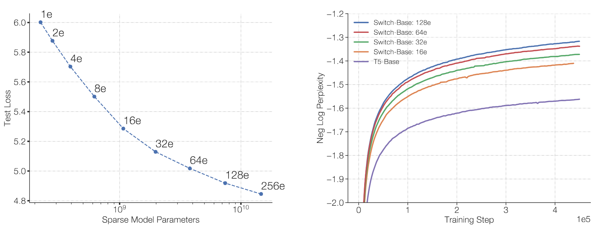

**图 1.** Switch Transformer 的扩展性与样本效率. 左图: 稀疏程度逐渐提高 (专家更多) 的 Switch Transformer 的扩展特性. 右图: 在相同计算预算下, 比较 Switch Transformer 与 T5 [Raf19] 模型的负对数困惑度.

稀疏训练是一个活跃的研究与工程领域 [Gra17, Gal20], 但时至今日, 机器学习库和硬件加速器仍主要面向稠密矩阵乘法. 为得到高效的稀疏算法, 我们从混合专家 (MoE) 范式 [Jac91, Jor94, Sha17] 出发, 对其加以简化, 从而提升训练稳定性并获得计算收益. MoE 模型已在机器翻译中取得显著成果 [Sha17, Sha18a, Lep20], 但复杂性, 通信成本和训练不稳定性阻碍了它的广泛采用.

我们解决这些问题, 随后超越翻译任务, 发现这类算法对自然语言任务具有广泛价值. 我们在多种自然语言任务上测得更好的扩展性, 涵盖 NLP 的三种训练范式: 预训练, 微调和多任务训练. 尽管本文侧重规模, 我们还表明 Switch Transformer 架构不只适用于超级计算机, 即使只有少量计算核心也能带来收益. 此外, 我们可以把大型稀疏模型蒸馏 [Hin15a] 为小型稠密版本, 同时保留稀疏模型质量增益的 30%. 我们的贡献如下:

- Switch Transformer 架构, 它简化并改进了混合专家模型.
- 扩展特性以及与充分调优的 T5 模型 [Raf19] 之间的基准比较: 在每个 token 使用相同 FLOPS 的情况下, 我们测得超过 7 倍的预训练加速. 我们进一步表明, 即使计算资源有限, 仅使用两个专家, 这些改进仍然成立.
- 将稀疏预训练模型和专门微调模型成功蒸馏为小型稠密模型. 我们将模型规模最多缩小 99%, 同时保留大型稀疏教师模型质量增益的 30%.
- 改进的预训练与微调技术: **(1)** 选择性精度训练, 使模型能够用较低的 bfloat16 精度训练; **(2)** 一种支持扩展到更多专家的初始化方案; **(3)** 增强的专家正则化, 用于改善稀疏模型的微调与多任务训练.
- 衡量多语言数据上的预训练收益: 我们发现全部 101 种语言均有提升, 且 91% 的语言相较 mT5 基线 [Xue20] 获得 4 倍以上的加速.
- 通过高效结合数据并行, 模型并行与专家并行, 构建参数量最高达一万亿的模型, 从而扩大了神经语言模型的规模. 这些模型将充分调优的 T5-XXL 基线的预训练速度提升了 4 倍.

## 2 Switch Transformer

Switch Transformer 的指导性设计原则是以简单且计算高效的方式, 最大化 Transformer 模型 [Vas17] 的参数量. [Kap20] 详尽研究了规模带来的收益, 揭示出模型规模, 数据集规模与计算预算的幂律扩展关系. 重要的是, 该工作主张在相对少量的数据上训练大型模型, 认为这是计算意义上的最优方法.

遵循这些结果, 我们研究第四个维度: 在保持每个样本的浮点运算次数 (FLOPs) 不变时增加*参数量*. 我们的假设是, 参数量独立于执行的总计算量, 是另一个重要的扩展维度. 为此, 我们设计了一个稀疏激活模型, 能够高效利用为稠密矩阵乘法设计的 GPU 和 TPU 等硬件. 本文侧重 TPU 架构, 但这类模型也可以在 GPU 集群上以类似方式训练. 在我们的分布式训练配置中, 稀疏激活层会把*互不相同*的权重分布在不同设备上. 因此, 模型权重随设备数量增加, 同时每台设备上的内存占用和计算量仍保持在可控范围内.

**图 2.** Switch Transformer 编码器块示意图. 我们用稀疏 Switch FFN 层 (浅蓝色) 替换 Transformer 中的稠密前馈网络 (FFN) 层. 该层独立处理序列中的各个 token. 图中展示两个 token ($x_{1}=\text{"More"}$ 和下方的 $x_{2}=\text{"Parameters"}$) 如何在四个 FFN 专家之间路由 (实线), 路由器会独立路由每个 token. Switch FFN 层返回所选 FFN 的输出乘以路由器门值后的结果 (虚线).

### 2.1 简化稀疏路由

**混合专家路由.** [Sha17] 提出了一种用于自然语言的混合专家 (MoE) 层, 它接收 token 表示 $x$ 作为输入, 然后从 $N$ 个专家组成的集合 $\{E_{i}(x)\}_{i=1}^{N}$ 中选出最佳的 top-$k$ 个专家, 并把该表示路由给它们. 路由器变量 $W_{r}$ 生成 logits $h(x)=W_{r}\cdot x$, 再通过该层所有 $N$ 个可用专家上的 softmax 分布进行归一化. 专家 $i$ 的门值为:

$$
p_{i}(x)=\frac{e^{h(x)_{i}}}{\sum_{j}^{N}e^{h(x)_{j}}}.
$$

选取 top-$k$ 个门值来路由 token $x$. 若 $\mathcal{T}$ 是所选 top-$k$ 索引的集合, 则该层的输出是每个专家对 token 的计算结果按门值作线性加权组合:

$$
y=\sum_{i\in\mathcal{T}}p_{i}(x)E_{i}(x).
$$

**Switch 路由: 重新思考混合专家.** [Sha17] 推测, 为了让路由函数获得非平凡梯度, 必须把 token 路由给 $k>1$ 个专家. 作者的直觉是, 如果不能比较至少两个专家, 模型便无法学会路由. [Ram18] 进一步研究了 top-$k$ 决策, 发现对于含有多个路由层的模型, 较低层中较大的 $k$ 值十分重要. 与这些观点相反, 我们采用一种简化策略, 仅路由给*一个*专家. 我们表明, 这种简化保留了模型质量, 减少了路由计算, 且表现更好. 下文将这种 $k=1$ 路由策略称为 Switch 层. 注意, 对 MoE 路由和 Switch 路由而言, [公式 2](#equation-02) 中的门值 $p_{i}(x)$ 都使路由器保持可微.

Switch 层有三项收益: **(1)** 每个 token 仅路由给一个专家, 因此路由器计算量减少. **(2)** 每个专家的批大小 (专家容量) 至少可以减半, 因为每个 token 只会路由给一个专家. [+expert-capacity] **(3)** 路由实现得到简化, 通信成本也随之降低. [图 3](#figure-03) 展示了采用不同专家容量因子时的路由示例.

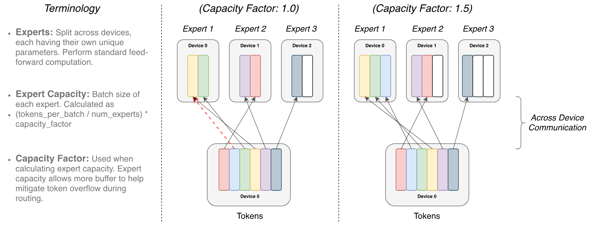

**图 3.** Token 路由动态示意图. 每个专家处理一个固定批大小的 token, 该大小由*容量因子*调节. 每个 token 被路由给具有最高路由器概率的专家, 但每个专家的批大小固定为 (total_tokens / num_experts) $\times$ capacity_factor. 如果 token 分派不均, 某些专家将溢出 (以红色虚线表示), 导致这些 token 不会由这一层处理. 较大的容量因子可以缓解溢出问题, 但也会增加计算和通信成本 (以填充的白色/空白位置表示).

### 2.2 高效稀疏路由

我们使用 Mesh-Tensorflow (MTF) [Sha18a]. 这是一个与 Tensorflow [Aba16] 具有相似语义和 API 的库, 便于构建高效的分布式数据并行与模型并行架构. 它把物理核心集合抽象为处理器的逻辑网格. 随后便可按命名维度对张量与计算进行分片, 方便沿不同维度划分模型. 我们在设计模型时以需要静态声明尺寸的 TPU 为目标. 下文介绍 Switch Transformer 的分布式实现.

**分布式 Switch 实现.** 我们的所有张量形状都在编译时静态确定, 但由于训练与推理期间的路由决策, 计算过程是*动态的*. 因此, 一项重要的技术考量是如何设置*专家容量*. 专家容量, 即每个专家所计算的 token 数量, 由批次中的 token 数量除以专家数量, 再乘以*容量因子*得到:

$$
\mathrm{expert\ capacity}=\biggr(\frac{\mathrm{tokens\ per\ batch}}{\mathrm{number\ of\ experts}}\biggr)\times\mathrm{capacity\ factor}.
$$

容量因子大于 1.0 时会提供额外缓冲, 用于应对 token 未能在专家间完全均衡分配的情况. 如果路由给某个专家的 token 过多 (下文称为被丢弃的 token), 模型会跳过计算, 通过残差连接将 token 表示直接传给下一层. 不过, 提高专家容量并非没有代价, 过高的值会浪费计算和内存. [图 3](#figure-03) 说明了这种权衡. 实验中我们发现, 保持较低的 token 丢弃率对稀疏专家模型的扩展很重要. 在所有实验中, 我们没有发现 token 丢弃数量与专家数量存在依赖关系 (通常 $<1\%$). 使用系数足够高的辅助负载均衡损失 (下一节) 可以保证良好的负载均衡. [表 1](#table-01) 研究了这些设计决策对模型质量和速度的影响.

**可微的负载均衡损失.** 为鼓励专家间的负载均衡, 我们加入一个辅助损失 [Sha17, Sha18a, Lep20]. 与 [Sha18a, Lep20] 一样, Switch Transformer 简化了 [Sha17] 中原有的设计, 后者分别使用负载均衡损失和重要性加权损失. 训练期间, 每个 Switch 层的这一辅助损失都会加到模型总损失中. 给定由 $i=1$ 到 $N$ 编号的 $N$ 个专家, 以及包含 $T$ 个 token 的批次 $\mathcal{B}$, 辅助损失计算为向量 $f$ 与 $P$ 的缩放点积:

$$
\mathrm{loss}=\alpha\cdot N\cdot\sum_{i=1}^{N}f_{i}\cdot P_{i}
$$

其中, $f_{i}$ 是分派给专家 $i$ 的 token 比例:

$$
f_{i}=\frac{1}{T}\sum_{x\in\mathcal{B}}\mathbb{1}\{\operatorname*{argmax}\>p(x)=i\}
$$

$P_{i}$ 是分配给专家 $i$ 的路由器概率比例: [+router-probability]

$$
P_{i}=\frac{1}{T}\sum_{x\in\mathcal{B}}p_{i}(x).
$$

由于我们希望批次中的 token 均匀路由到 $N$ 个专家, 两个向量中的值都应为 $1/N$. [公式 4](#equation-04) 的辅助损失在均匀分布下取得最小值, 因而会鼓励均匀路由. 由于 $P$ 向量可微而 $f$ 向量不可微, 该目标函数仍可求导. 最终损失乘以专家数量 $N$, 使专家数量变化时损失保持不变, 因为在均匀路由下 $\sum_{i=1}^{N}(f_{i}\cdot P_{i})=\sum_{i=1}^{N}(\frac{1}{N}\cdot\frac{1}{N})=\frac{1}{N}$. 最后, 超参数 $\alpha$ 是这些辅助损失的乘法系数. 本文始终使用 $\alpha=10^{-2}$, 该值足以保证负载均衡, 又不会压倒主要的交叉熵目标. 我们以 10 的幂次扫描了从 $10^{-1}$ 到 $10^{-5}$ 的 $\alpha$ 超参数范围, 发现 $10^{-2}$ 能迅速平衡负载, 同时不会干扰训练损失.

### 2.3 组合所有设计: Switch Transformer

我们对 Switch Transformer 的首次测试从 "Colossal Clean Crawled Corpus" (C4) 上的预训练开始, 该语料库由 [Raf19] 提出. 预训练目标采用掩码语言建模任务 [Tay53, Fed18, Dev18], 训练模型预测缺失的 token. 在我们的预训练设置中, 按照 [Raf19] 所确定的最优方式, 我们丢弃 15% 的 token, 随后用一个哨兵 token 替换被掩码的序列. 为比较各模型, 我们记录负对数困惑度. [+4] 本文所有表格中, $\uparrow$ 表示该指标的值越高越好, $\downarrow$ 则相反. [表 9](#table-09) 比较了本文研究的所有模型.

**表 1.** Switch 与 MoE 基准比较. 正面对比 Switch Transformer 相较 MoE Transformer 和 T5 稠密基线在每步及单位时间上的收益. 我们以负对数困惑度衡量质量, 并记录达到任意选定的质量阈值 Neg. Log Perp.=-1.50 所需的时间. 所有 MoE 与 Switch Transformer 模型均使用 128 个专家, 每隔一个前馈层设置一个专家层. 对 Switch-Base+, 我们把模型隐藏维度从 768 增至 896, 注意力头数从 14 增至 16, 以扩大模型直至其速度与 MoE 模型一致. 所有模型使用相同计算量 (32 个核心), 并在相同硬件 (TPUv3) 上训练. 还要注意, 我们的所有模型都需要预训练超过 100k 步才能达到 -1.50 的阈值. ${\dagger}$ 在模型训练的 100k 步内, T5-Base 未达到这一负对数困惑度.

Switch Transformer 与 MoE Transformer 的正面对比如 [表 1](#table-01) 所示. 我们的 Switch Transformer 模型与 "T5-Base" [Raf19] 采用相同 FLOP 配置 (即每个 token 应用相同计算量). 使用 top-2 路由的 MoE Transformer 会让两个专家分别对每个 token 应用独立的 FFN, 因而 FLOPS 更高. 所有模型都在相同硬件上训练相同步数. 注意, 在上述实验设置中, MoE 模型的容量因子从 2.0 降至 1.25 后速度反而下降 (840 降至 790), 这出乎预期. [+5]

我们从 [表 1](#table-01) 中归纳出三项主要发现: **(1)** 从速度-质量关系看, Switch Transformer 优于经过精细调优的稠密模型和 MoE Transformer. 在固定计算量与墙上时钟时间下, Switch Transformer 得到最佳结果. **(2)** Switch Transformer 的计算占用小于 MoE 对应模型. 若扩大其规模, 使训练速度与 MoE Transformer 一致, 它按每步衡量也会优于所有 MoE 与稠密模型. **(3)** Switch Transformer 在较低容量因子 (1.0, 1.25) 下表现更好. 较小的专家容量对应大型模型场景: 此时模型内存极为紧张, 应尽可能减小容量因子.

### 2.4 改进的训练与微调技术

与普通 Transformer 相比, 稀疏专家模型可能带来训练困难. 各层的硬切换 (路由) 决策可能造成不稳定. 此外, bfloat16 [Wan19i] 等低精度格式会加剧路由器 softmax 计算中的问题. 本节介绍这些训练困难, 以及我们为实现稳定, 可扩展训练而采用的方法.

**大型稀疏模型的选择性精度.** 模型不稳定性妨碍使用高效的 bfloat16 精度训练, 因此 [Lep20] 始终以 float32 精度训练其 MoE Transformer. 不过, 我们表明, 只在模型的局部区域*选择性转换*为 float32 精度, 即可在不承担 float32 张量高昂通信成本的情况下实现稳定训练. 这种技术符合现代混合精度训练策略, 即模型的某些部分和梯度更新采用更高精度 [Mic17a]. [表 2](#table-02) 表明, 我们的方法在获得 float32 训练稳定性的同时, 速度几乎与 bfloat16 训练相同.

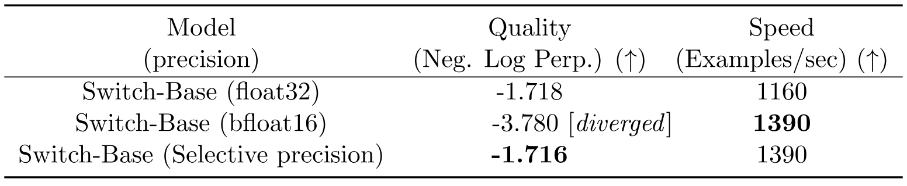

**表 2.** 选择性精度. 我们把局部路由操作转换为 float32, 同时在其他位置保留 bfloat16 精度, 从而在稳定模型的同时取得几乎与 (不稳定的) bfloat16 精度训练相同的速度. 我们在训练早期的固定步数后衡量一个 32 专家模型的质量及其速度表现. 对 float32 的 Switch-Base 和采用选择性精度的 Switch-Base, 我们观察到相似的学习动态.

为此, 我们把路由器输入转换为 float32 精度. 路由器函数以 token 为输入, 生成用于选择与重组专家计算结果的分派张量和组合张量 (详见附录中的代码块 [图 15](#figure-15)). 重要的是, float32 精度仅用于路由器函数*内部*, 即设备本地的计算. 由于函数末尾会把得到的分派张量和组合张量重新转换为 bfloat16 精度, 无须通过 all-to-all 通信操作广播昂贵的 float32 张量, 同时仍可受益于 float32 更高的稳定性.

**采用更小的参数初始化以提高稳定性.** 恰当的初始化对深度学习的成功训练至关重要, 我们尤其观察到 Switch Transformer 符合这一点. 我们从均值 $\mu=0$, 标准差 $\sigma=\sqrt{s/n}$ 的截断正态分布中抽取元素来初始化权重矩阵, 其中 $s$ 是尺度超参数, $n$ 是权重张量中的输入单元数量 (例如 fan-in). [+6]

作为不稳定性的另一项补救措施, 我们建议把 Transformer 默认初始化尺度 $s=1.0$ 缩小 10 倍. 在我们的实验中, 这既能提高质量, 也能降低训练失稳的可能性. [表 3](#table-03) 衡量了训练早期模型质量的提升和方差的下降.

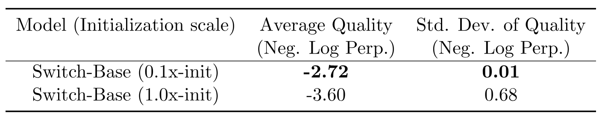

**表 3.** 缩小初始化尺度可提高稳定性. 缩小初始化尺度会改善 Switch Transformer 的模型质量和训练稳定性. 此处记录一个 32 专家模型在 3.5k 步后模型质量的均值与标准差 (每项使用 3 个随机种子), 质量以负对数困惑度衡量.

我们发现, 以 Neg. Log Perp. 衡量的平均模型质量大幅提升, 不同运行间的方差也显著下降. 此外, 同一套初始化方案对跨越多个数量级的模型普遍有效. 从只有 2.23 亿参数的基线, 到超过一万亿参数的庞大模型, 我们都采用同一方法实现稳定训练.

**大型稀疏模型的正则化.** 本文考虑 NLP 中常见的方法: 先在大型语料库上预训练, 再对摘要或问答等较小的下游任务进行微调. 这会自然带来过拟合问题, 因为许多微调任务只有很少的样本. 微调标准 Transformer 时, [Raf19] 在每一层使用 dropout [Sri14] 防止过拟合. Switch Transformer 的参数量显著多于 FLOP 匹配的稠密基线, 这可能导致它在这些较小的下游任务上过拟合得更严重.

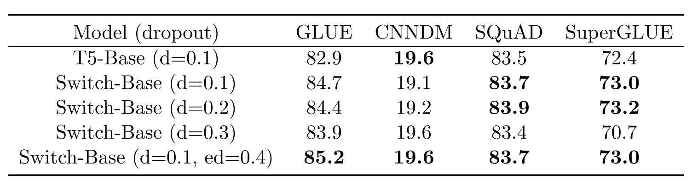

**表 4.** 微调正则化结果. 对已在 C4 数据集的 34B token 上预训练的 Switch Transformer 模型进行微调时, 扫描不同 dropout 率 (数值越高越好). 我们观察到, 在所有非专家层使用较低的标准 dropout 率, 并在专家前馈层使用高得多的 dropout 率, 表现最佳.

因此, 我们提出一种在微调期间缓解该问题的简单方法: 增大专家内部的 dropout, 我们称之为*专家 dropout*. 微调期间, 我们只在每个专家层的中间前馈计算处显著提高 dropout 率. [表 4](#table-04) 给出了专家 dropout 方案的结果. 我们观察到, 简单地提高所有层的 dropout 会导致性能下降. 然而, 在非专家层设置较小的 dropout 率 (0.1), 在专家层设置大得多的 dropout 率 (0.4), 可以提升四个较小下游任务上的性能.

## 3 扩展特性

我们研究 Switch Transformer 架构在预训练期间的*扩展特性*. 按照 [Kap20], 我们考虑模型既不受计算预算瓶颈限制, 也不受数据量瓶颈限制的场景. 为避免数据瓶颈, 我们使用包含超过 180B 目标 token 的大型 C4 语料库 [Raf19], 并持续训练直至观察到收益递减.

专家数量是扩展模型最高效的维度. 增加专家数量时, 计算成本大致保持不变, 因为无论可选专家有多少, 模型对每个 token 都只选择一个专家. 不过, 路由器必须计算覆盖更多专家的概率分布, 这项轻量计算的成本为 $O(d_{\mathrm{model}}\times\mathrm{num\ experts})$, 其中 $d_{\mathrm{model}}$ 是层间传递的 token 的嵌入维度. 本节在固定计算预算下, 分别按步数和时间研究扩展特性.

### 3.1 按步数衡量的扩展结果

[图 4](#figure-04) 表明, 在所有模型训练固定步数时, 随专家数量增加会持续获得扩展收益. 我们观察到一个清晰趋势: 保持每个 token 的 FLOPS 不变时, 参数 (专家) 越多, 训练越快. 左图展示了在每个 token 的 FLOPS 固定时, 稀疏模型参数量与测试损失之间一致的扩展特性. 这揭示出沿稀疏模型参数这一额外维度扩展的优势. 右图衡量一个稠密模型变体和四个 FLOP 匹配的稀疏变体的样本效率. 我们发现, 增加专家数量会提高模型的样本效率. Switch-Base 64 专家模型在 60k 步时达到 T5-Base 模型在 450k 步时的相同性能, 按步数计算加速了 7.5 倍. 此外, 与 [Kap20] 的发现一致, 我们发现更大的模型也更具*样本效率*, 即在观察到的 token 数量固定时学习得更快.

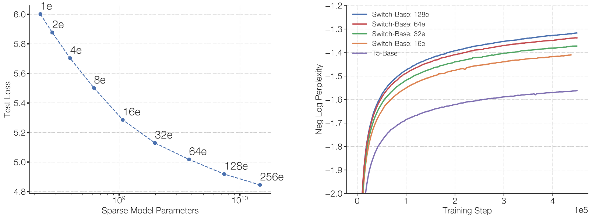

**图 4.** Switch Transformer 的扩展特性. 左图: 通过增加专家数量来增加参数时, 我们以困惑度衡量质量提升. 左上角的点对应参数量为 223M 的 T5-Base 模型. 从左上向右下移动, 专家数量从 2, 4, 8 开始逐次翻倍, 直至右下角具有 256 个专家和 14.7B 参数的模型. 尽管所有模型使用相同计算预算, 增加专家数量仍带来持续提升. 右图: 扫描专家数量时每步的负对数困惑度. 紫线表示稠密基线, 可以看到 Switch-Base 模型的样本效率有所提高.

### 3.2 按时间衡量的扩展结果

[图 4](#figure-04) 表明, 按步数衡量时, 随着专家数量增加, 性能持续改善. 虽然我们的模型与基线每个 token 所用的 FLOPS 大致相同, Switch Transformer 还会产生设备间的额外通信成本和路由机制的额外计算. 因此, 按步数观察到的样本效率提升不一定会转化为按墙上时钟时间衡量的模型质量改善. 这引出了一个问题:

*在训练时长和计算预算固定时, 应该训练稠密模型还是稀疏模型?*

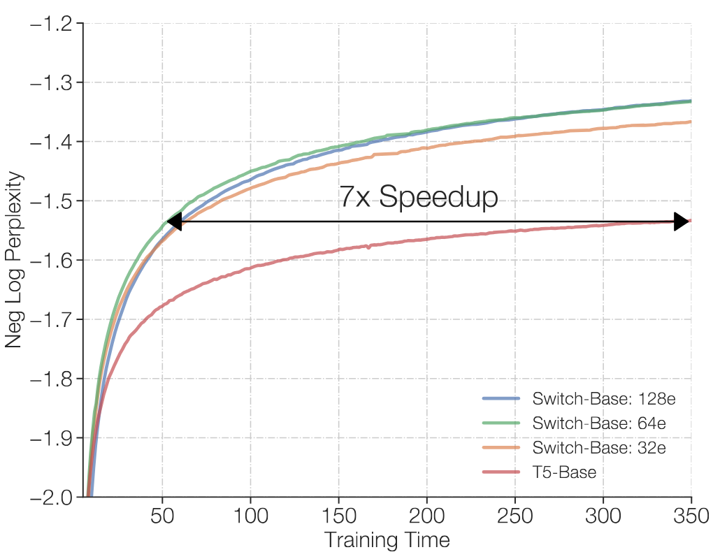

**图 5.** Switch Transformer 的速度优势. 所有模型均在 32 个 TPUv3 核心上训练, 每个样本使用相同 FLOPs. 在固定计算量和训练时间下, Switch Transformer 显著优于稠密 Transformer 基线. 我们的 Switch-Base 64 专家模型只用 T5-Base *七分之一*的时间便达到相同质量, 此后还能继续改善.

[图 5](#figure-05) 和 [图 6](#figure-06) 回答了这个问题. [图 5](#figure-05) 衡量预训练模型质量随时间的变化. 在固定训练时长与计算预算下, Switch Transformer 带来显著加速. 在这一设置中, Switch-Base 64 专家模型达到与 T5-Base 相近的困惑度时, 训练时间只有后者的*七分之一*.

### 3.3 与更大的稠密模型比较扩展性

上述分析表明, 计算量匹配的稠密模型会被相应的 Switch 模型超越. [图 6](#figure-06) 考虑另一种情形: 如果我们把资源分配给更大的稠密模型会怎样? 我们现在这样做, 将 Switch-Base 与下一个强基线 *T5-Large* 比较. 尽管 T5-Large 对每个 token 使用的 FLOPs 多 3.5 倍, Switch-Base 的样本效率仍然更高, 并实现 2.5 倍加速. 此外, 只需设计一个新的, 更大的稀疏版本 Switch-Large, 还可获得更多收益, 它在 FLOP 上与 T5-Large 匹配. 我们构建了该模型, 并在下一节展示其更好的扩展与微调结果.

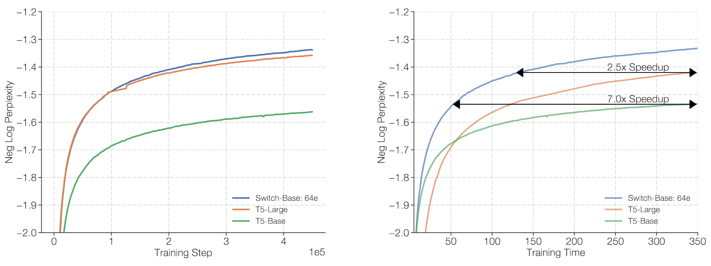

**图 6.** 通过 Switch 层或标准稠密模型扩展方式来扩大 Transformer 模型. 左图: Switch-Base 的样本效率高于 T5-Base 和 T5-Large 变体, 后者每个 token 使用的 FLOPS 多 3.5 倍. 右图: 与前文一样, 按墙上时钟时间衡量, Switch-Base 仍然更快, 相较 T5-Large 实现 2.5 倍加速.

## 4 下游结果

[第 3 节](#section-3) 展示了预训练期间更好的扩展特性, 现在我们验证这些收益能否转化为下游任务上更强的语言学习能力. 首先, 我们在一组多样的 NLP 任务上进行微调. 随后, 我们把稀疏模型蒸馏为小型且易于部署的稠密基线, 以将其内存占用降低 90% 以上. 最后, 我们在多任务, 多语言场景中衡量改进, 由此结束本节. 结果表明, Switch Transformer 是强大的多任务学习器, 在全部 101 种语言上都优于多语言 T5-base 模型.

### 4.1 微调

**用于微调的基线与 Switch 模型.** 我们的基线是经过充分调优, 参数量为 223M 的 T5-Base 模型和参数量为 739M 的 T5-Large 模型 [Raf19]. 对两个版本, 我们都设计了 FLOP 匹配但参数量大得多的 Switch Transformer, 具体见 [表 9](#table-09). [+7] 我们的基线与 [Raf19] 略有不同, 因为我们在改进的 C4 语料库上预训练, 该语料库移除了样本内部的文本重复, 从而提高预训练任务的有效性 [Lee21]. 在我们的方案中, 每批使用 $2^{20}$ (1,048,576) 个 token 预训练 550k 步, 总计 576B 个 token. 随后, 我们在一组多样的任务上微调, 除 Switch 层使用 0.4 的 dropout 率外, 其他各层均使用 0.1 (见 [表 4](#table-04)). 微调使用批大小 1M, 训练 16k 步. 对每项任务, 我们每 200 步评估一次模型质量, 并报告在验证集上计算得到的峰值性能.

**微调任务与数据集.** 我们选择的任务会检验问答, 摘要和世界知识等语言能力. 语言基准 GLUE [Wan18d] 和 SuperGLUE [Wan19h] 被视为复合混合任务, 其中所有任务按各自包含的 token 数量成比例混合. 这些基准包含需要情感分析 (SST-2), 词义消歧 (WIC), 句子相似度 (MRPC, STS-B, QQP), 自然语言推断 (MNLI, QNLI, RTE, CB), 问答 (MultiRC, RECORD, BoolQ), 共指消解 (WNLI, WSC), 句子补全 (COPA) 和句子可接受性判断 (CoLA) 的任务. CNNDM [Her15] 和 BBC XSum [Nar18] 数据集用于衡量文章摘要能力. 我们使用 SQuAD 数据集 [Raj16] 和 ARC Reasoning Challenge [Cla18] 检验问答能力. 与 [Rob20] 一样, 我们还通过在三个闭卷问答数据集上微调来评估模型知识: Natural Questions [Kwi19], Web Questions [Ber13] 和 Trivia QA [Jos17]. 闭卷指在没有额外参考资料或上下文材料的情况下提出问题. 为评估模型的常识推理能力, 我们在 Winogrande Schema Challenge [Sak19] 上进行测试. 最后, 我们在 Adversarial NLI Benchmark [Nie19] 上测试模型的自然语言推断能力.

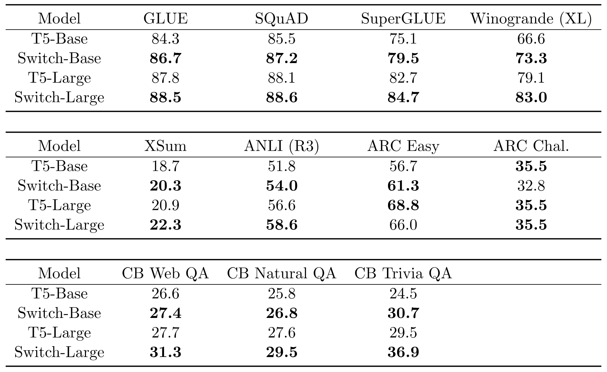

**表 5.** 微调结果. T5 基线与 Switch 模型在一组多样自然语言测试上的微调结果 (验证集, 数值越高越好). 我们将 FLOP 匹配的 Switch 模型与 T5-Base 和 T5-Large 基线进行比较. 在所考虑的大多数任务上, Switch 变体均有显著提升. 两种模型规模均有收益, 推理密集型与知识密集型语言任务也都获得改进.

**微调指标.** 本文始终采用以下评估指标: 对 GLUE 和 SuperGLUE, 我们报告所有子任务的平均分. CNNDM 和 XSum 均使用 Rouge-2 指标. 对 SQuAD 和闭卷任务 (Web Questions, Natural Questions 和 Trivia Questions), 我们报告与目标完全匹配的答案比例 (该指标的更多细节及缺陷见 [Rob20]). 最后, 对 ARC Easy, ARC Challenge, ANLI 和 Winogrande, 我们报告生成回答的准确率.

**微调结果.** 我们在多项自然语言任务上观察到显著的下游改进. SuperGLUE 上的提升尤为明显, FLOP 匹配的 Switch 变体分别比 T5-Base 和 T5-Large 基线高出 4.4 和 2 个百分点, 同时在 Winogrande, 闭卷 Trivia QA 和 XSum 上也有大幅提升. [+8] 在微调研究中, 只有 AI2 Reasoning Challenge (ARC) 数据集没有观察到收益: T5-Base 在 challenge 数据集上优于 Switch-Base, T5-Large 在 easy 数据集上优于 Switch-Large. 整体而言, 我们在推理密集型与知识密集型任务上都观察到显著改进. 这验证了我们的架构不仅能够良好地预训练, 还可以通过微调把质量提升转化到下游任务上.

### 4.2 蒸馏

部署具有数十亿乃至数万亿参数的庞大神经网络并不方便. 为缓解这一问题, 我们研究把大型稀疏模型蒸馏 [Hin15a] 为小型稠密模型. 未来还可以进一步研究把大型模型蒸馏为较小的*稀疏*模型.

**蒸馏技术.** [表 6](#table-06) 研究了多种蒸馏技术. 这些技术以 [San19] 为基础, 该工作研究了 BERT 模型的蒸馏方法. 我们发现, 用非专家权重初始化稠密模型会带来小幅提升. 这是可行的, 因为所有模型在 FLOP 上匹配, 非专家层具有相同维度. Transformer 中的专家层通常只在每一个或每隔一个 FFN 层加入, 因而许多权重都可以用训练后的参数初始化. 此外, 我们观察到, 将教师概率和真实标签分别以 0.25 和 0.75 的比例混合可改善蒸馏效果. 结合两项技术后, 仅用约 $1/20^{th}$ 的参数便能保留大型稀疏模型约 30% 的质量增益. 质量增益是指 Switch-Base (教师) 与 T5-Base (学生) 质量差异的百分比. 因此, 100% 的质量增益意味着学生模型达到了教师模型的性能.

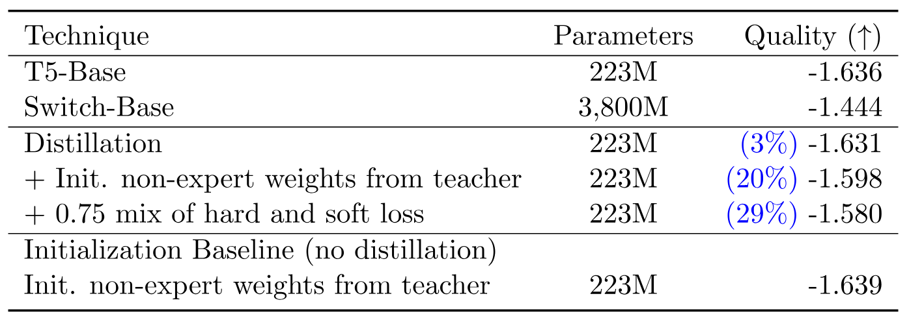

**表 6.** 用于语言建模的 Switch Transformer 蒸馏. 用 Switch-Base 的非专家权重初始化 T5-Base, 并使用教师标签与真实标签混合得到的损失, 可获得最佳性能. 我们可以把参数量大 100 倍的大型稀疏模型的性能提升蒸馏回小型稠密模型, 保留其中 30%. 作为最后一项基线, 我们发现用专家权重初始化 T5-Base, 但不经蒸馏而正常训练, 并不会带来改进.

**可达到的压缩率.** 我们使用 [表 6](#table-06) 所述的最佳蒸馏技术, 将多种稀疏模型蒸馏为稠密模型. 我们对专家数量逐渐增加的各个 Switch-Base 版本进行蒸馏, 对应参数量从 1.1B 到 14.7B 不等. 通过蒸馏, 我们可以在压缩 82% 的同时保留 1.1B 参数模型 37% 的质量增益. 在压缩率达到 99% 的极端情况下, 仍能保留教师模型质量提升的 28%.

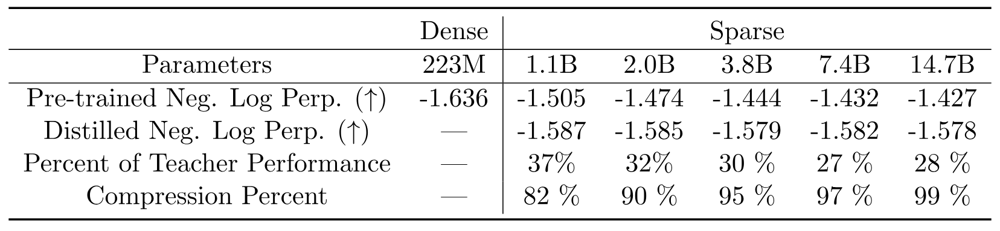

**表 7.** 蒸馏压缩率. 我们衡量把大型稀疏模型蒸馏为稠密基线时的质量. 基线 T5-Base 的 Neg. Log Perp. 为 -1.636. 随后, 我们在右侧各列中把越来越大的稀疏模型蒸馏进同一架构. 结合权重初始化以及硬损失和软损失的混合, 我们可以把稀疏教师模型缩小 95% 以上, 同时保留 30% 的质量增益. 不过, 对质量显著更好, 规模更大的预训练教师模型, 我们预计需要更大的学生模型才能达到这些压缩率.

**蒸馏微调后的模型.** 本节最后研究把微调后的稀疏模型蒸馏为稠密模型. [表 8](#table-08) 展示了把一个已在 SuperGLUE 任务上微调的 7.4B 参数 Switch-Base 模型蒸馏为 223M 参数 T5-Base 的结果. 与预训练结果类似, 我们发现, 蒸馏为 FLOP 匹配的稠密变体时, 可以保留稀疏模型 30% 的增益. 一条本文未作考虑的潜在研究方向是考察微调任务具体使用了哪些专家, 再提取这些专家以取得更好的模型压缩效果.

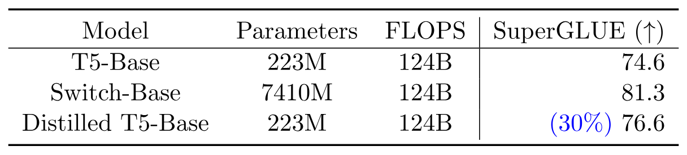

**表 8.** 蒸馏微调后的 SuperGLUE 模型. 我们把一个在 SuperGLUE 任务上微调的 Switch-Base 模型蒸馏为 T5-Base 模型. 我们观察到, 在较小的数据集上, 大型稀疏模型可以成为有效的蒸馏教师. 我们发现, 模型压缩 97% 后, 再次保留了教师模型 30% 的性能.

### 4.3 多语言学习

在最后一组下游实验中, 我们衡量在 101 种不同语言的混合数据上预训练时, 模型质量与速度之间的权衡. 我们以近期的 mT5 [Xue20] 工作为基础进行构建与基准比较, mT5 是 T5 的多语言扩展. 我们在 mT5 提出的 Common Crawl 多语言变体 (mC4) 上预训练, 它涵盖 101 种语言, 但由于部分语言存在文字变体, 混合数据包含 107 个任务.

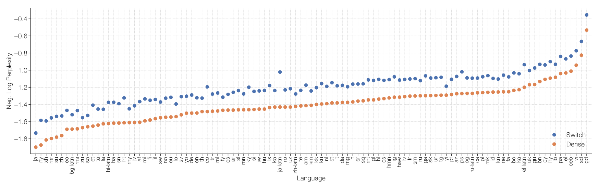

**图 7.** 在 101 种语言上进行多语言预训练. 在 101 种语言上进行多任务训练时, Switch T5 Base 模型相较稠密基线的改进. 我们观察到 Switch Transformer 在多任务训练设置中表现很好, 在全部 101 种语言上均有提升.

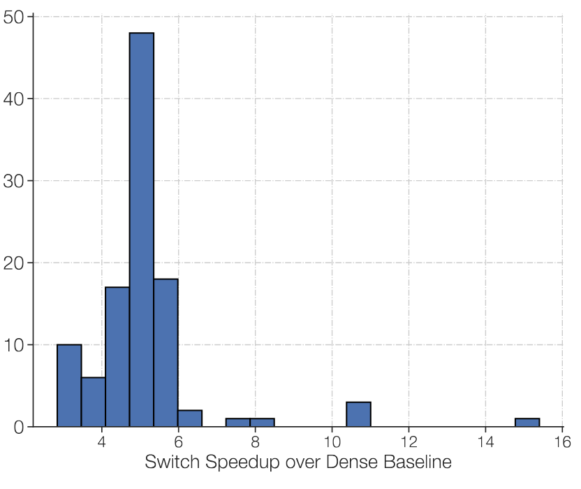

**图 8.** 在 101 种语言上进行多语言预训练. 对每种语言, 我们用直方图表示 Switch Transformer 相较 FLOP 匹配的 T5 稠密基线达到相同质量时的步数加速比. 在全部 101 种语言上, 相较 mT5-Base 的平均步数加速比为 5 倍; 91% 的语言在达到 mT5-Base 最终困惑度时获得 4 倍或更高的加速.

[图 7](#figure-07) 绘制了 FLOP 匹配的 Switch 模型 mSwitch-Base 相较 T5 base 变体 mT5-Base 在所有语言上的负对数困惑度质量提升. 两个版本都预训练 1M 步后, 我们发现在所考虑的*全部* 101 种语言上, Switch Transformer 的最终负对数困惑度都高于基线. [图 8](#figure-08) 换用另一种视角, 以直方图表示 Switch Transformer 相较 mT5-Base 在每步上的*加速*. [+9] 我们发现, 相较 mT5-Base 的平均加速为 5 倍, 91% 的语言至少实现 4 倍加速. 这表明 Switch Transformer 是有效的多任务, 多语言学习器.

## 5 以数据并行, 模型并行与专家并行设计模型

任意增加专家数量会遇到收益递减 ([图 4](#figure-04)). 本节介绍*互补的*扩展策略. 扩展 Transformer 的常见方法是同时增大 $d_{\mathrm{model}}$ 或 $d_{\mathrm{ff}}$ 等维度. 这会同时增加参数量和执行的计算量, 最终受限于每个加速器的内存. 模型大小超过加速器内存后, 可以采用单程序多数据 (SPMD) 模型并行. 本节研究数据并行, 模型并行与专家并行相结合时的权衡.

**回顾前馈网络 (FFN) 层.** 我们以 FFN 层为例, 简要回顾数据并行, 模型并行与专家并行在 Mesh TensorFlow [Sha18a] 中的工作方式. 假设批次中有 $B$ 个 token, 每个 token 的维度为 $d_{\mathrm{model}}$. FFN 的输入 ($x$) 和输出 ($y$) 大小均为 [$B$, $d_{\mathrm{model}}$], 中间表示 ($h$) 的大小为 [$B$, $d_{\mathrm{ff}}$], 其中 $d_{\mathrm{ff}}$ 通常比 $d_{\mathrm{model}}$ 大数倍. 在 FFN 中, 中间表示为 $h=xW_{\mathrm{in}}$, 该层的输出则为 $y=\mathrm{ReLU}(h)W_{\mathrm{out}}$. 因此, $W_{\mathrm{in}}$ 和 $W_{\mathrm{out}}$ 分别独立应用于每个 token, 其大小分别为 [$d_{\mathrm{model}}$, $d_{\mathrm{ff}}$] 和 [$d_{\mathrm{ff}}$, $d_{\mathrm{model}}$].

我们介绍划分的两个方面: *权重*和*数据批次*如何分配到各个核心, 如 [图 9](#figure-09) 所示. 我们用 $N$ 表示所有可用核心, Mesh Tensorflow 可将它们重新映射为处理器的逻辑多维网格. 此处我们创建一个二维逻辑网格, 一个维度表示数据并行分片数 ($n$), 另一个表示模型并行分片数 ($m$). 核心总数必须等于数据并行与模型并行的分片数乘积, 即 $N=n\times m$. 为把该层分配到各个核心, 包含一批 $B$ 个 token 的张量会沿 $n$ 个数据并行核心分片, 因而每个核心包含 $B/n$ 个 token. 维度为 $d_{\mathrm{ff}}$ 的张量和变量随后会沿 $m$ 个模型并行核心分片. 对含有专家层的变体, 我们考虑 $E$ 个专家, 每个专家最多可处理 $C$ 个 token.

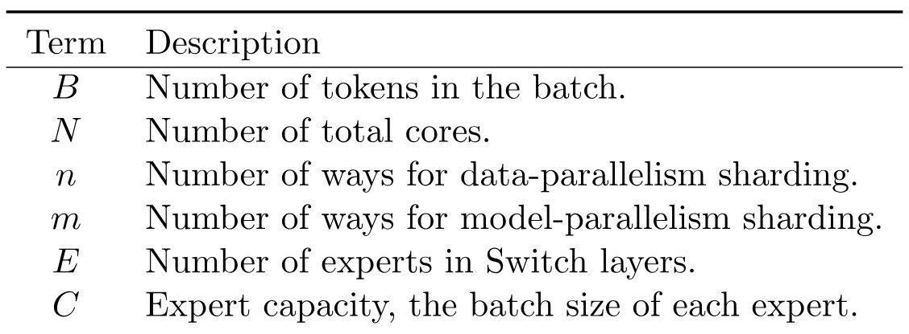

**图 9.** 数据与权重划分策略. 每个 $4 \times 4$ 虚线网格表示 16 个核心, 阴影方块表示该核心上保存的数据 (模型权重或 token 批次). 我们展示每种策略如何划分模型权重和数据张量. **第一行:** *模型权重*在核心间的划分方式. 此行中不同大小的形状表示前馈网络 (FFN) 层中更大的权重矩阵 (例如更大的 $d_{\mathrm{ff}}$). 阴影方块的每种颜色标识一个独特的权重矩阵. 每个核心的参数量固定, 但更大的权重矩阵会对每个 token 执行更多计算. **第二行:** *数据批次*在核心间的划分方式. 每个核心保存相同数量的 token, 因而所有策略下的内存用量都固定. 不同划分策略允许各核心保存相同或不同的 token, 这由不同颜色表示.

### 5.1 数据并行

训练数据并行模型时, 这是分布式训练的标准方式, 所有核心都会分配给数据并行维度, 即 $n=N,m=1$. 其优点是, 在整个前向传播和反向传播结束并需要跨所有核心聚合梯度之前, 都不需要通信. 这对应 [图 9](#figure-09) 最左侧的一列.

### 5.2 模型并行

现在考虑所有核心都只分配给模型并行维度的场景, 即 $n=1,m=N$. 此时所有核心都必须保存完整的 $B$ 个 token, 每个核心则包含一份独特的权重切片. 每次前向传播和反向传播都会产生通信成本. 每个核心发送一个大小为 [$B$, $d_{\mathrm{model}}$] 的张量, 以计算第二次矩阵乘法 $\mathrm{ReLU}(h)W_{\mathrm{out}}$, 因为 $d_{\mathrm{ff}}$ 维度已经划分, 必须对其求和. 一般来说, 每当跨核心划分的维度需要求和时, 前向传播和反向传播都会加入一次 all-reduce 操作. 这与纯数据并行形成对比, 后者只在整个前向传播和反向传播结束时执行一次 all-reduce.

### 5.3 模型并行与数据并行

大规模模型通常混合使用模型并行与数据并行, 最大的 T5 模型 [Raf19, Xue20] 和 GPT-3 [Bro20] 都采用了这种方式. 核心总数为 $N=n\times m$ 时, 每个核心将负责 $B/n$ 个 token, 以及权重和中间激活中 $d_{\mathrm{ff}}/m$ 的部分. 在前向传播和反向传播中, 每个核心通过 all-reduce 操作通信一个大小为 $[B/n,d_{\mathrm{model}}]$ 的张量.

### 5.4 专家并行与数据并行

下面介绍专家并行与数据并行的划分策略. Switch Transformer 会把所有核心分配给数据划分维度 $n$, 该维度也对应模型中的专家数量. 对每个核心上的各个 token, 路由器会在本地计算专家分配. 输出是一个大小为 [$n$, $B/n$, $E$, $C$] 的二值矩阵, 沿第一维划分并决定专家分配. 随后, 通过将该二值矩阵与大小为 [$n$, $B/n$, $d_{\mathrm{model}}$] 的输入张量进行矩阵乘法来完成 gather 操作.

$$
\mathrm{einsum}([n,B/n,d_{\mathrm{model}}],[n,B/n,E,C],\mathrm{dimension}=[B/n])
$$

由此得到形状为 [$n$, $E$, $C$, $d_{\mathrm{model}}$] 的最终张量, 它沿第一维分片. 由于每个核心都有自己的专家, 我们执行大小为 [$E$, $C$, $d_{\mathrm{model}}$] 的 all-to-all 通信, 现在改为对 $E$ 维而非 $n$ 维进行分片. 前向传播还会产生大小为 $E\times C\times d_{\mathrm{model}}$ 的 bfloat16 张量通信成本, 以类似方式接收来自位于不同核心上的各个专家的 token. 专家划分代码的详细分析见附录 [第 15 节](#section-15).

### 5.5 专家并行, 模型并行与数据并行

设计最佳模型时, 我们力求平衡每个 token 的 FLOPS 与参数量. 扩大专家数量时, 参数量会增加, 但每个 token 的 FLOPs 不变. 要增加 FLOPs, 还必须增大 $d_{\mathrm{ff}}$ 维度 (这也会增加参数, 但速率较慢). 这带来一项权衡: 随着 $d_{\mathrm{ff}}$ 增大, 每个核心的内存会耗尽, 随之必须增大 $m$. 但核心总数 $N$ 固定, 且 $N=n\times m$, 因此必须减小 $n$, 从而迫使我们使用更小的批大小 (以保持每个核心上的 token 数量不变).

同时使用模型并行和专家并行时, 除模型并行内部的 all-reduce 通信外, 还会产生把 token 路由到正确专家所需的 all-to-all 通信成本. 三种方法结合后, 平衡 FLOPS, 通信成本与每个核心的内存变得十分复杂, 最佳映射需要通过实验确定. 专家数量如何影响下游性能的进一步分析见 [第 5.6 节](#section-5-6).

### 5.6 迈向万亿参数模型

结合专家并行, 模型并行与数据并行, 我们设计了两个大型 Switch Transformer 模型, 参数量分别为 3950 亿和 1.6 万亿. 我们研究了这些模型作为语言模型的上游预训练表现, 以及下游微调表现. [表 9](#table-09) 列出了两个模型的参数量, 每个序列的 FLOPs 和超参数. 表中包括 Transformer 的标准超参数, 如 $d_{\mathrm{model}}$, $d_{\mathrm{ff}}$, $d_{\mathrm{kv}}$, 注意力头数与层数, 还包括较少见的 $\mathrm{FFN}_{\mathrm{GEGLU}}$. 后者表示 FFN 层的一种变体, 其中扩展矩阵被两组以非线性方式组合的权重取代 [Sha20].

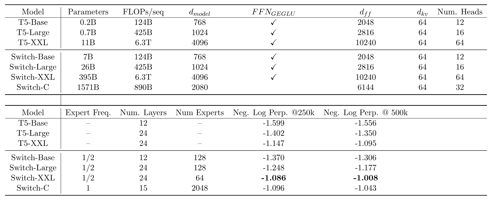

**表 9.** Switch 模型设计与预训练性能. 我们将 T5 模型的超参数和预训练性能与 Switch Transformer 变体比较. 最后两列分别记录在 C4 数据集上训练 250k 和 500k 步后的预训练模型质量. 我们观察到, 在计算预算相同的情况下, Switch-C Transformer 变体达到固定困惑度的速度比 T5-XXL 快 4 倍, 且差距会随训练推进而扩大.

Switch-C 模型只采用前文 [第 5.4 节](#section-5-4) 所述的专家并行, 不使用模型并行. 因此, 控制宽度, 深度, 注意力头数等属性的超参数都远小于 T5-XXL 模型. 相比之下, Switch-XXL 与 T5-XXL 模型在 FLOP 上匹配, 因而可以使用更大的超参数维度, 代价则是模型并行带来的额外通信成本 (详见 [第 5.5 节](#section-5-5)).

**与 T5-XXL 比较样本效率.** [表 9](#table-09) 最后两列分别记录了模型在 C4 语料库上训练 250k 和 500k 步后的负对数困惑度. 训练 250k 步后, 两个 Switch Transformer 变体的负对数困惑度均比 T5-XXL 版本高出 0.061 以上. [+10] 为说明 0.061 差距的意义, T5-XXL 模型必须*额外*训练 250k 步才能提高 0.052. 随着训练继续, 差距进一步扩大; 到 500k 步时, Switch-XXL 模型已领先 T5-XXL 0.087.

**训练不稳定性.** 不过, 正如引言所述, 大型稀疏模型可能不稳定, 随规模增加, 我们遇到了一些零星问题. 我们发现, 参数量更大的 Switch-C 模型具有 1.6T 参数和 2048 个专家, 完全没有出现训练不稳定. 反而是每个序列 FLOPs 大约高 10 倍的 Switch XXL 版本有时不稳定. 因此, 尽管它是我们按步数衡量时表现更好的模型, 我们并未像 T5 [Raf19] 的最终报告结果那样完整预训练 1M 步.

**推理任务上的微调性能.** 为初步评估模型质量, 我们使用一个在 503B 个 token 上完成部分预训练的 Switch-XXL 模型, 其训练文本约为 T5-XXL 模型的一半. 从这一检查点出发, 为提高效率, 我们采用多任务训练, 即共同学习所有任务, 而非逐项微调. 我们发现, SQuAD 验证集准确率提高到 89.7, 当前最优水平为 91.3. 接着, SuperGLUE 的平均测试得分为 87.5, T5 版本得分 89.3, 当前最优水平为 90.0 [Wan19h]. 在 ANLI [Nie19] 上, Switch XXL 超越此前最优水平, 准确率达到 65.7, 而此前最佳结果为 49.4 [Yan20d]. 我们注意到, 虽然 Switch-XXL 在上游预训练任务上取得了当前最优的 Neg. Log Perp., 但这种收益尚未完全转化为当前最优的下游性能. 附录 [第 14 节](#section-14) 对该问题作了进一步研究.

**知识任务上的微调性能.** 最后, 我们还对模型知识进行早期考察, 使用三个闭卷知识任务: Natural Questions, WebQuestions 和 TriviaQA, 且未使用 Salient Span Masking [Guu20] 进行额外预训练. 在三种情况下, 我们均观察到模型优于此前最先进的 T5-XXL 模型 (不使用 SSM). Natural Questions 的精确匹配分数从此前最佳的 32.8 提高到 34.4, Web Questions 从 37.2 提高到 41.0, TriviaQA 从 42.9 提高到 47.5.

总而言之, 尽管训练数据不到其他模型的一半, 我们已经取得相当的, 有时达到当前最优水平的模型质量. 目前, 相较推理任务, Switch Transformer 更能把上游的显著收益转化到知识任务上 (见附录 [第 14 节](#section-14)). 如何从大型专家模型中获得更强的微调性能仍是活跃的研究问题, 预训练困惑度则表明未来应当还能继续改进.

## 6 相关工作

神经网络规模的重要性已得到广泛认可, 研究者提出了多种方法. 近期工作通过模型并行 (例如在多个核心间拆分权重和张量) 把模型扩展到数十亿参数 [Sha18a, Raj19, Raf19, Bro20, Sho19]. 另一种方案是 [Har18, Hua19] 提出的流水线模型并行, 它把不同层拆分到不同设备上, 并将微批次以*流水线*方式送入各层. 最后, Product Key 网络 [Lam19] 根据进入某层的 token 表示查找可学习嵌入, 从而扩大神经网络容量.

本文研究一类执行*条件*计算的方法中的一个特定模型, 这类方法会根据输入动态作出计算决策. [Cho14] 提出根据模型隐藏状态中的特定位模式自适应选择权重. [Eig13] 构建了带有稠密矩阵乘法和 $\mathrm{ReLU}$ 激活的堆叠专家层, 并在加入抖动的 MNIST 和单调语音上取得了有前景的结果. 在计算机视觉中, [Pui20] 在上游预训练期间根据语义类别手动路由 token, 随后根据下游任务选择相关专家.

混合专家 (MoE) 在现代深度学习架构中的有效性由 [Sha17] 证明. 该工作在 LSTM [Hoc97] 层之间堆叠 MoE 层, 并把 token 分别路由到不同的专家组合. 由此在语言建模和机器翻译基准上取得了当前最优结果. Mesh Tensorflow 库 [Sha18a] 随后把 MoE 层重新引入 Transformer 架构, 以它取代 FFN 层, 但没有提供相应的 NLP 结果. 最近, 受益于机器学习基础设施的进步, 扩展 XLA 编译器的 GShard [Lep20] 使用 MoE Transformer 大幅改善了跨 100 种语言的机器翻译. 最后, [Fan21c] 选择一种不同的确定性 MoE 策略, 把模型参数拆分为互不重叠的语言组.

沿 Transformer *注意力模式*中的序列长度维度 ($L$) 引入稀疏性, 已成为一种成功的技术, 能够把注意力复杂度从 $O(L^{2})$ 降低 [Chi19, Cor19, Suk19, Kit20, Zah20, Bel20a]. 这使模型能够学习比以往更长的序列. 此版本的 Switch Transformer 没有采用注意力稀疏性, 但这些技术可以互补. 未来可以将它们结合, 或许能够改善需要长上下文的任务学习.

## 7 讨论

我们提出并讨论一些有关 Switch Transformer 和一般稀疏专家模型的问题, 此处稀疏性指权重, 而非注意力模式.

**Switch Transformer 不正是凭借庞大的参数量才表现更好吗?** 是的, 这正是设计目标! 参数量独立于所用 FLOPs 总量, 是扩展神经语言模型的一个有效维度. 大量研究已充分表明, 大型模型表现更好 [Kap20]. 但在这里, 我们的模型使用相同计算资源, 样本效率却更高, 速度也更快.

**我没有超级计算机, 这种方法对我还有用吗?** 尽管本文侧重超大型模型, 我们也发现仅有两个专家的模型便能提高性能, 且可轻松满足常见 GPU 或 TPU 的内存限制 (详见附录 [第 13 节](#section-13)). 因此, 我们认为这些技术在小规模场景中同样有用.

**在速度-准确率的帕累托曲线上, 稀疏模型是否优于稠密模型?** 是的. 在多种不同的模型规模下, 稀疏模型按步数和墙上时钟时间衡量都优于稠密模型. 对照实验表明, 在计算量和时间固定时, 稀疏模型优于稠密模型.

**我无法部署万亿参数模型, 能否把这些模型缩小?** 我们无法完整保留模型质量, 但通过把稀疏模型蒸馏为稠密模型, 可以取得 10 到 100 倍的压缩率, 同时保留专家模型约 30% 的质量增益.

**为什么要使用 Switch Transformer, 而不是模型并行的稠密模型?** 按时间衡量, Switch Transformer 可以比参数分片的稠密模型高效得多 ([图 6](#figure-06)). 此外, 这一选择并非*互斥*: 我们可以且确实会在 Switch Transformer 中采用模型并行, 以增加每个 token 的 FLOPs, 但也会承担传统模型并行带来的减速.

**为什么稀疏模型尚未广泛使用?** 扩展稠密模型取得的巨大成功抑制了尝试稀疏模型的动力 (如 [Hoo20] 所论证, 这种成功部分源于稠密模型与深度学习硬件的协同适应). 此外, 稀疏模型一直面临多项问题, 包括 (1) 模型复杂性, (2) 训练困难和 (3) 通信成本. Switch Transformer 在缓解这些问题上取得了进展.

## 8 未来工作

本文提出了简化的架构和改进的训练流程, 并研究稀疏模型如何扩展. 不过, 仍有许多开放的未来方向, 下面作简要介绍:

1. 一项重大挑战是进一步提高最大型模型的训练稳定性. 我们的稳定性技术对 Switch-Base, Switch-Large 和 Switch-C 模型有效 (未观察到不稳定), 但对 Switch-XXL 仍不充分. 我们已初步尝试稳定这些模型, 包括使用正则化器提高稳定性和采用调整后的梯度裁剪形式. 我们认为这些方法可能普遍适用于大型模型, 但问题仍未解决.
2. 总体而言, 我们发现预训练质量提高会带来更好的下游结果 (附录 [第 14 节](#section-14)), 不过有时也会遇到显著的异常. 例如, 尽管在 C4 数据集建模中得到相近的困惑度, 参数量为 1.6T 的 Switch-C 在 SQuAD 上的精确匹配分数只有 87.7, 低于较小的 Switch-XXL 模型的 89.6. 一个显著差异是, 尽管 Switch-XXL 的独立参数少约 4 倍 (395B 对 1.6T), 但它对每个 token 使用的 FLOPS 是 Switch-C 的约 10 倍. 这说明微调质量, *每个 token 的 FLOPS*和*参数量*之间存在尚未充分理解的依赖关系.
3. 全面研究扩展关系, 为融合数据并行, 模型并行与专家并行的架构设计提供指导. 理想情况下, 给定硬件配置的规格 (计算, 内存, 通信), 应能更快地设计出最优模型. 反过来, 这也可能有助于设计未来的硬件.
4. 本文工作属于自适应计算算法家族. 我们始终使用相同的同质专家, 但未来的设计可在更灵活基础设施的支持下采用*异质*专家. 这样便能更灵活地适应输入, 在需要更多计算时将输入路由到更大的专家, 例如用于更困难的样本.
5. 研究 Transformer 的 FFN 层之外的专家层. 我们发现初步证据表明, 这也能改善模型质量. 附录 [第 10 节](#section-10) 报告了把专家加入 Self-Attention 层后的质量提升, 其中我们的专家层会替换生成 Q, K, V 的权重矩阵. 不过, 由于 bfloat16 格式下存在训练不稳定性, 我们将其留作未来工作.
6. 在新模态和不同模态中考察 Switch Transformer. 目前我们只考虑了语言, 但我们认为模型稀疏性也能在新模态及多模态网络中带来类似优势.

这份清单还可以轻易扩展, 但我们希望它能让读者大致了解我们正在思考的挑战, 以及我们认为有前景的未来方向.

## 9 结论

Switch Transformer 是可扩展且有效的自然语言学习器. 我们简化混合专家模型, 得到一种易于理解, 训练稳定且样本效率远高于同等规模稠密模型的架构. 我们发现, 这些模型在多种自然语言任务和不同训练范式上均表现出色, 包括预训练, 微调与多任务训练. 这些进展使训练参数量从数千亿到一万亿的模型成为可能, 且它们相较稠密 T5 基线取得了显著加速. 我们希望本文能够推动稀疏模型成为一种有效架构, 并鼓励研究者与实践者在自然语言任务乃至更广泛的任务中考虑这些灵活的模型.

## 致谢

作者感谢 Margaret Li, 她数月来持续提供有关算法改进的关键见解与实证研究建议. 感谢 Hugo Larochelle 的睿智指导和对稿件的澄清性意见, 感谢 Irwan Bello 的详细意见与细致修订, 感谢 Colin Raffel 和 Adam Roberts 对神经语言模型与 T5 代码库的及时建议, 感谢 Yoshua Bengio 对自适应计算研究的指导与鼓励, 感谢 Jascha Sohl-dickstein 提出稳定新型大规模模型的有趣新方向并参与论文修订, 也感谢 Google Brain 团队围绕本文展开的有益讨论. 感谢 Blake Hechtman, 他在分析并改善模型训练性能方面提供了宝贵帮助.

## 10 用于注意力的 Switch

[Sha18a, Lep20] 通过在 Transformer 的稠密前馈网络 (FFN) 计算中加入 MoE 层, 设计了 MoE Transformer [Sha17]. 类似地, 本文也替换了 Transformer 中的 FFN 层, 但这里简要探索另一种设计. 我们把 Switch 层加入 Transformer 的 *Self-Attention* 层. 为此, 我们用 Switch 层替换生成 query, key 和 value 的可训练权重矩阵, 如 [图 10](#figure-10) 所示.

**图 10.** 注意力中的 Switch 层. 图中展示如何把 Switch 层并入 Self-Attention Transformer 块. 对每个 token (此处展示两个 token, $x_{1}=\text{"More"}$ 和 $x_{2}=\text{"Parameters"}$), 一组权重生成 query, 另一组独立权重生成共享的 key 和 value. 我们既尝试让每个专家执行线性操作, 也尝试使用本文其他部分采用的 FFN. 虽然这种方法改善了质量, 但使用低精度数值格式时更不稳定, 因而留作未来工作.

[表 10](#table-10) 记录了多个变体在固定步数后的质量及训练时间. 尽管观察到改进, 我们也发现使用 bfloat16 精度时这些层更加不稳定, 因而没有将其纳入最终变体. 不过, 当这些层能够稳定训练时, 我们认为初步的积极结果显示出一条有前景的未来方向.

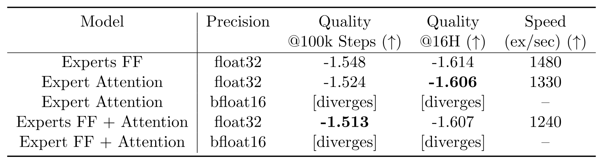

**表 10.** Switch 注意力层结果. 所有模型都有 32 个专家, 每批使用 524k 个 token 训练. Experts FF 表示由专家替换 Transformer 中的 FFN, 这是本文始终采用的标准设置. Experts FF + Attention 表示同时使用专家替换 FFN 和 Self-Attention 层. 以 bfloat16 精度训练时, 带有专家注意力的模型会发散.

## 11 以 No-Token-Left-Behind 防止丢弃 token

由于 TPU 加速器的软件限制, 张量形状必须静态确定. 因此, 每个专家处理 token 表示的容量是有限且固定的. 然而, 这给模型带来一个问题: 模型在运行时动态路由 token, 可能导致专家间分配不均. 如果发送给某个专家的 token 少于专家容量, 只需填充计算即可. 这虽然无法高效利用硬件, 但在数学上仍然正确. 然而, 当发送给某个专家的 token 数量大于其容量 (专家溢出) 时, 就需要一套处理方案. [Lep20] 调整了一个混合专家模型, 通过残差连接把表示直接传给下一层而不作处理, 以应对专家溢出; 我们也沿用了这种方式.

我们推测, 不对 token 应用任何计算可能非常浪费, 尤其是某个专家发生溢出时, 必然意味着另一专家还有剩余容量. 基于这一直觉, 我们提出 *No-Token-Left-Behind*, 迭代地重新路由起初被送往溢出专家的所有 token. [图 11](#figure-11) 以图示说明该方法, 它几乎可以保证训练和推理期间不会丢弃任何 token. 我们曾假设这能改善性能并进一步稳定训练, 但没有发现实证收益. 我们推测, 网络一旦学会了不同 token 与专家间的关联, 改变这种关联 (例如把 token 发送给概率第二高的专家) 便可能降低性能.

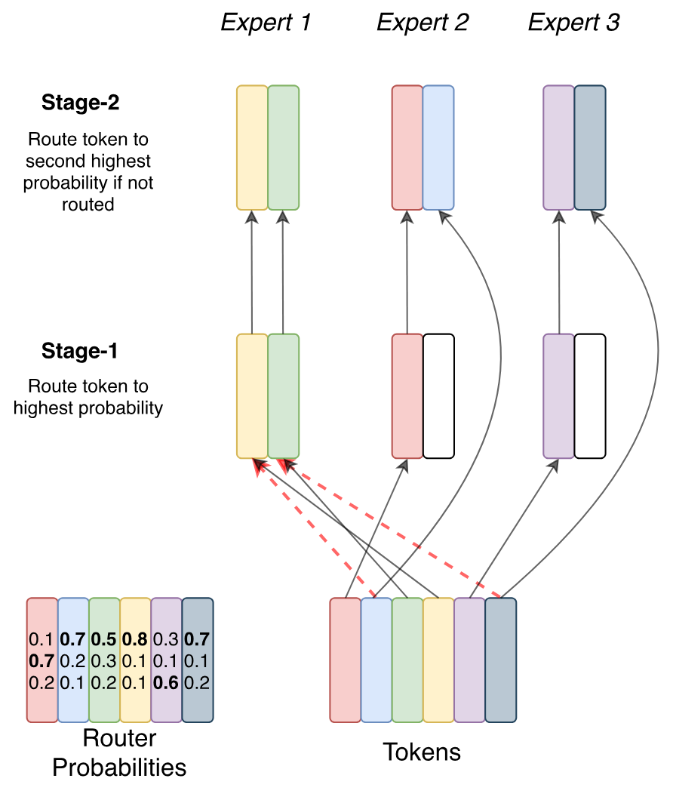

**图 11.** *No-Token-Left-Behind 路由*示意图. 阶段 1 等同于 Switch 路由, token 会被送往路由器给出最高概率的专家. 阶段 2 会检查所有溢出的 token, 并将其路由给对应概率第二高的专家. 如果 token 的第二选择专家包含过多 token, 它们仍可能溢出, 但这种方法能让大多数 token 得到路由. 该过程可以迭代, 从而保证实际上几乎没有 token 被丢弃.

## 12 鼓励跨专家探索

在每个专家层, 路由器都会决定把 token 发送给哪个专家. 这是根据 token 表示信息, 在可用专家之间作出的离散决策. 路由器根据输入 token 表示确定最佳专家, 但不会收到反事实信息, 因而无从得知选择另一专家时会有多好. 与强化学习类似, 这里会出现经典的探索-利用困境 [Sut18]. [Ros17] 也注意到这些问题并采用了不同的处理方法, 在多任务学习中取得了成功. 这一特定设置最接近情境赌博机 [Rob52]. 始终确定性地选择排名最高的专家是一种纯利用策略, 我们则考虑平衡探索, 以寻找更好的专家分配.

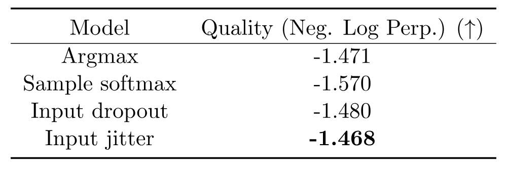

**表 11.** 路由器探索策略. 采用不同随机策略选择专家时, Switch Transformer 的质量, 以负对数困惑度衡量 (越低越好). 不同变体在速度性能上没有实质差异.

为引入探索, 我们考虑多种方法: 1) 确定性选择或 argmax; 2) 从 softmax 分布中采样; 3) 对输入表示应用 input dropout; 4) 对输入表示加入乘性抖动噪声. [表 11](#table-11) 报告了这些方法对模型质量的影响. 本文始终使用输入抖动来注入噪声, 因为实证结果表明它的表现最佳.

## 13 较低计算资源下的 Switch Transformer

Switch Transformer 不仅适用于拥有数千核心和数万亿参数的场景, 在小规模下同样是一种有效架构. 我们此前的许多实验采用 10B 以上参数的模型规模, 但 [图 12](#figure-12) 表明, 只用 2 个专家就能相较 FLOP 匹配的对应模型取得可观收益. 即使无法随时使用超级计算机, 以 2, 4 或 8 个专家训练 Switch Transformer (通常建议每个核心一个专家), 也能相较 T5 稠密基线取得稳定改进.

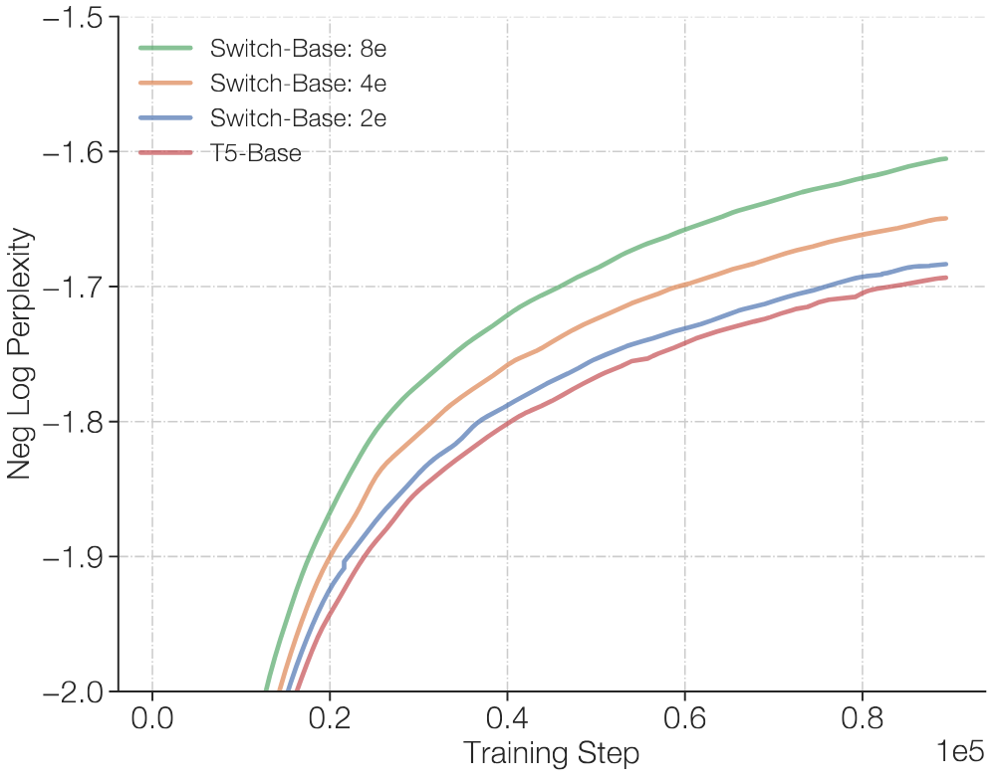

**图 12.** 采用少量专家的 Switch Transformer. 即使专家很少, Switch Transformer 仍然优于基线. 此处展示极小规模下的扩展特性, 使用 2, 4 和 8 个专家均能优于 T5-Base 模型.

## 14 上游模型性能与下游模型性能的关系

模型在预训练目标上的质量不一定能转化为下游任务结果. [图 13](#figure-13) 展示了稠密模型和 Switch 模型在 C4 预训练任务上的上游模型质量, 与两个下游任务指标之间的相关性: SuperGLUE 平均性能和 TriviaQA 得分. 我们选择这两项任务, 因为前者检验模型的推理能力, 后者检验事实知识.

**图 13.** 上游预训练质量与下游模型质量. 我们把上游性能分别与 SuperGLUE 和 TriviaQA (记录不使用 SSM 时的 SOTA) 上的下游质量进行关联, 两者分别是推理密集型和知识密集型基准 (验证集). 我们发现, 与基线一样, Switch 模型会随上游预训练任务上的改善而扩展. 对 SuperGLUE, 负对数困惑度与 SuperGLUE 平均分之间大致呈线性关系. 不过, 在困惑度固定时, 稠密模型往往表现更好, 大规模场景尤其如此. 相反, 在知识密集型任务 TriviaQA 上, Switch Transformer 可能遵循一种更优的扩展关系: 给定相同上游困惑度, 它优于稠密对应模型. 还需进一步统计才能确认这些观察结果, 但收集这些数据成本高昂, 因而留作未来工作.

我们发现二者始终存在相关性, 表明对基线模型和 Switch 模型而言, 更好的预训练都会带来更好的下游结果. 此外, 当上游困惑度固定时, 在中小型模型规模下, Switch 模型与稠密模型表现相近. 不过, 在最大型模型场景 (T5-11B/T5-XXL) 中, 正如 [第 5.6 节](#section-5-6) 所述, 最大的 Switch 模型并不总能把上游困惑度良好地转化为 SuperGLUE 任务上的下游微调表现. 要充分发挥稀疏模型的潜力, 这一问题值得进一步调查研究. 专家模型的微调动态十分复杂, 依赖于正则化, 负载均衡和微调超参数.

## 15 Switch Transformer 伪代码

Switch Transformer 在 Mesh Tensorflow [Sha18a] 中的伪代码. 以下代码未使用模型并行 (详见 [第 5.4 节](#section-5-4)).

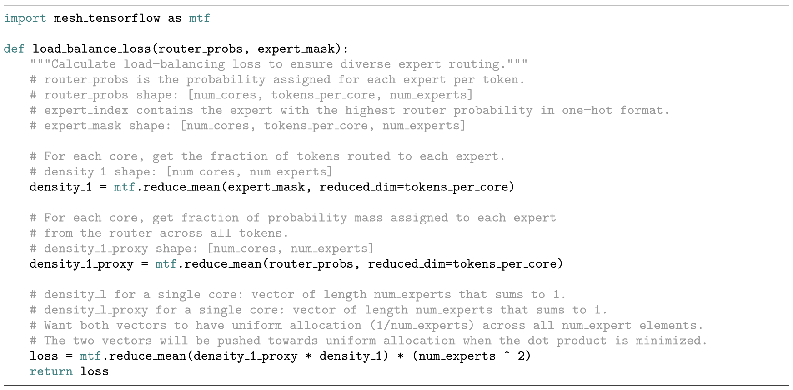

**图 14.** Switch Transformer 在 Mesh Tensorflow 中的负载均衡损失伪代码.

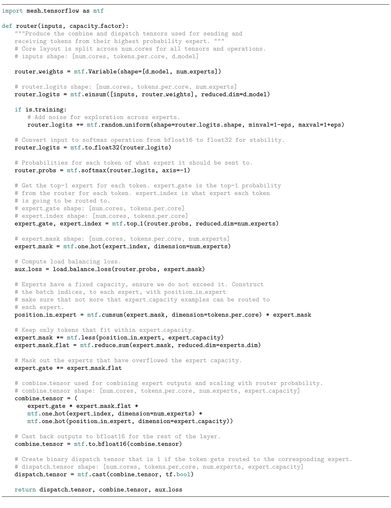

**图 15.** Switch Transformer 在 Mesh Tensorflow 中的路由器伪代码.

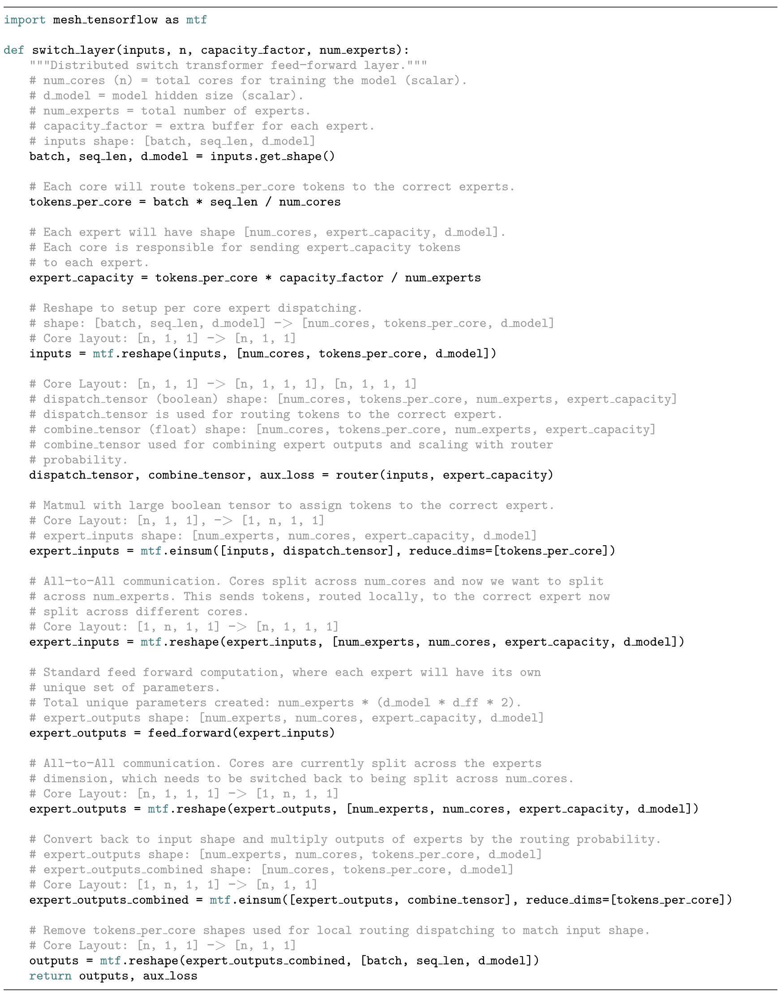

**图 16.** Switch Transformer 层在 Mesh Tensorflow 中的伪代码.

[+equal-contribution]: 贡献相同.

[+jax-code]: Switch Transformer 的 JAX 代码和所有模型检查点可从 [https://github.com/google-research/t5x](https://github.com/google-research/t5x) 获取.

[+tensorflow-code]: Switch Transformer 的 Tensorflow 代码可从 [https://github.com/tensorflow/mesh/blob/master/mesh_tensorflow/transformer/moe.py](https://github.com/tensorflow/mesh/blob/master/mesh_tensorflow/transformer/moe.py) 获取.

[+router-probability]: 一个可能令人困惑之处: $p_{i}(x)$ 是把 token $x$ 路由给专家 $i$ 的概率. $P_{i}$ 是批次 $\mathcal{B}$ 中*所有 token*分配给专家 $i$ 的概率比例.

[+expert-capacity]: 技术说明见 [第 2.2 节](#section-2-2).

[+4]: 该指标采用以 $e$ 为底的对数, 因而单位是 nat.

[+5]: 注意, 速度测量同时取决于算法与实现细节. Switch Transformer 减少了相较 MoE 所需的计算 (算法), 但最终的速度差异还受底层优化影响 (实现).

[+6]: 与均值相差超过两个标准差的值会重新采样.

[+7]: FLOPS 按 [Kap20] 的方式针对前向传播计算.

[+8]: 为公平比较, T5 和 Switch 模型均在修订后的 C4 数据集上预训练, 每批使用 $2^{20}$ 个 token, 共训练 550k 步.

[+9]: 按步数计算的加速比等于基线达到该质量所需的步数, 除以我们的模型达到相同质量所需的步数.

[+10]: 这里报告的质量差异是一个下界, 实际差异可能更大. T5-XXL 在更简单的 C4 数据集上预训练, 其中样本内包含重复片段, 因而容易直接复制.
