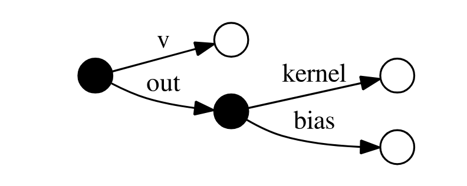
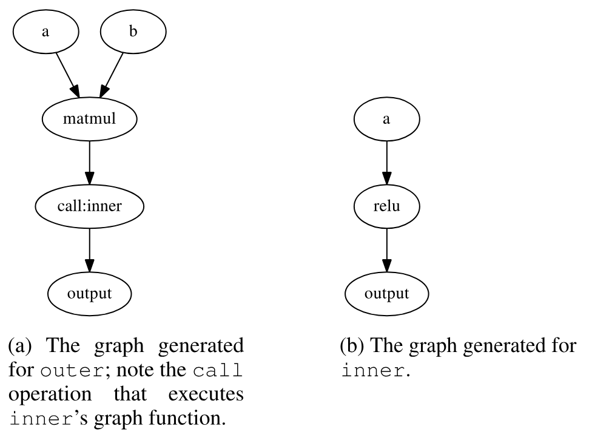
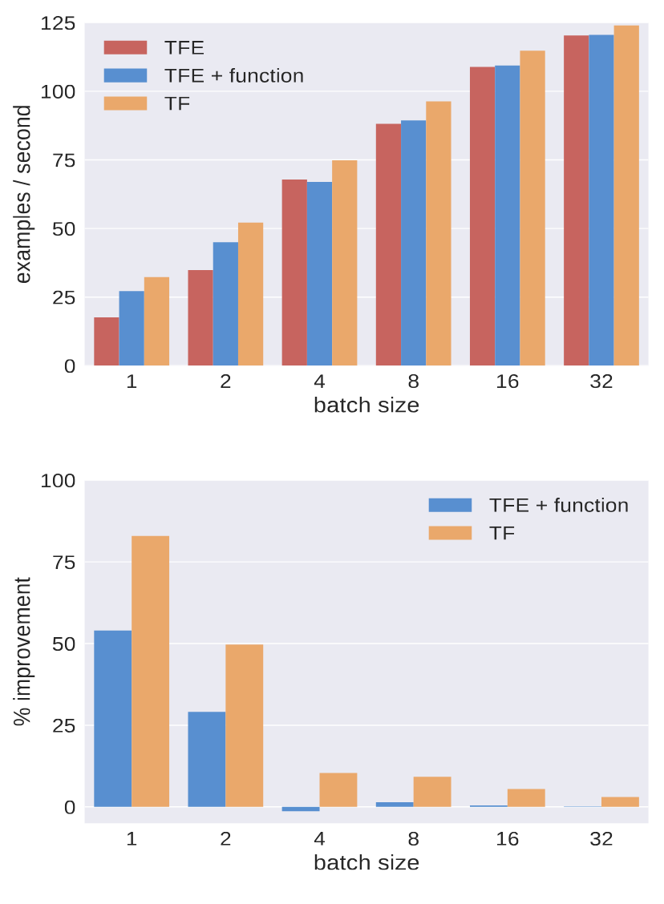
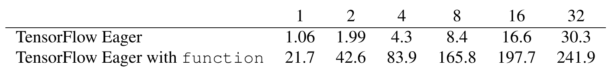
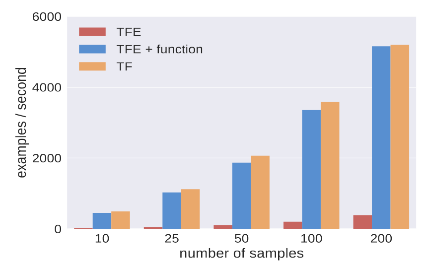

> [Akshay Agrawal](https://akshayagrawal.com/), [Akshay Naresh Modi](https://dblp.org/pid/204/3430.html), [Alexandre Passos](https://dblp.org/pid/47/10827.html), [Allen Lavoie](https://dblp.org/pid/56/8397.html), [Ashish Agarwal](https://dblp.org/pid/98/5397.html), [Asim Shankar](https://dblp.org/pid/89/1264.html), [Igor Ganichev](https://dblp.org/pid/49/7542.html), [Josh Levenberg](https://dblp.org/pid/177/9198.html), [Mingsheng Hong](https://dblp.org/pid/h/MingshengHong.html), [Rajat Monga](https://dblp.org/pid/99/10669.html), [Shanqing Cai](https://dblp.org/pid/140/2681.html). 作者按字母顺序排列. Google Brain, 美国加利福尼亚州山景城. 通信作者为 [Akshay Agrawal](mailto:akshayka@cs.stanford.edu) 和 [Alexandre Passos](mailto:apassos@google.com). 关键词: 机器学习, 命令式, 多阶段编程, 数据流. 首次提交至 arXiv: 2019 年 2 月 27 日; 当前版本为 v1. 发表于 2019 年在美国加利福尼亚州帕洛阿尔托举行的第 2 届 SysML Conference 会议录. [TensorFlow Eager: A Multi-Stage, Python-Embedded DSL for Machine Learning](https://arxiv.org/abs/1903.01855). <a href="/paper/tensorflow-eager.pdf" target="_blank" rel="noopener noreferrer">原始 PDF</a>. [TeX 源码](https://export.arxiv.org/e-print/1903.01855). 精确的印刷版式和参考文献以原始 PDF 为准.

## 摘要

TensorFlow Eager 是一种多阶段, 嵌入 Python 的领域特定语言, 面向硬件加速的机器学习, 既适用于交互式研究, 也适用于生产环境. TensorFlow Eager 扩展了 TensorFlow; TensorFlow 要求用户将计算表示为数据流图, 这样可以进行编译器优化并简化部署, 却不利于快速原型设计和运行时动态性. TensorFlow Eager 消除了这些易用性成本, 同时保留了图带来的好处: 它为 TensorFlow 提供一个立即执行操作的命令式前端, 以及一个 JIT 跟踪器, 用于把由 TensorFlow 操作组成的 Python 函数转换成可执行的数据流图. 因此, TensorFlow Eager 提供了一种多阶段编程模型, 让用户可以在同一个软件包中轻松地在命令式执行与阶段化执行之间切换.

<span id="section-1"></span>

## 1 引言

许多当代机器学习库都有相似的结构: 它们提供一组原语操作, 以及对这些操作的组合自动求导的函数 (例如, 参见 [Ber10, Tok15, Mac15, Che15b, Aba16, Pas17, Glu17, Neu17, Inn18, Fro18]). 事实上, 与其说这些软件包是库, 不如说它们更像领域特定语言 (DSL) [Inn18a]. 使用自动微分软件编写的模型通常也被称为*可微程序*.

可微编程 DSL 通常嵌入在宿主语言中 (关于嵌入式 DSL 的资料, 参见 [Hud96]), 按照编程语言中的含义, 它们大致可以分为*命令式*和*声明式*两类. 使用命令式可微编程 DSL, 与使用 Python 之类的命令式编程语言类似: 原语操作的构造与执行不可分割, 每个操作都会返回具体的数值数据. 命令式 DSL 提供了自然的编程范式, 但如果嵌入 Python 这样的解释型语言中——Chainer [Tok15] 和 PyTorch [Pas17] 等常用 DSL 都是如此——其性能会受限于解释器, 而且模型难以序列化. 为了解决这些问题, 声明式 DSL 将模型定义与模型执行分开. 这些“define-before-run”库要求用户把模型阶段化为数据流图, 以便进行编译器优化和利用并行性, 同时简化部署, 分布式执行和代码生成 (例如, 参见 [Ber10, Aba16]). 然而, 声明式 DSL 不允许用户任意使用宿主语言结构, 因此学习曲线陡峭, 也不适合表达结构依赖数据的模型.

理想的 DSL 应当兼具命令式执行的灵活性, 易用性和声明式编程的诸多优势, 同时不承担二者的代价. 基于这一动机, 我们提出 TensorFlow Eager: 一种嵌入 Python 的可微编程 DSL, 让开发者可以在同一个软件包中切换命令式计算与阶段化计算. TensorFlow Eager 提供一种*多阶段编程*模型, 用户可以快速制作程序原型, 再选择性地将需要加速或序列化的部分阶段化. 它以 TensorFlow 的可选扩展形式实现, 在程序启动时调用一个 TensorFlow 库函数即可启用.

为了让机器学习从业者和研究者一开始就能顺利使用, TensorFlow Eager 默认采用命令式执行. 为了利用数据流图的优势, TensorFlow Eager 提供了一个 Python 装饰器: 它在图构建上下文中跟踪相应的 Python 函数, 将原语操作阶段化, 构造具有命名输入和输出的数据流图, 并返回一个可执行的*图函数*. 调用图函数在语法上等同于调用生成该图函数的 Python 函数, 但图函数的执行会绕过 Python: 它们由 C++ 数据流运行时执行, 或者经编译后为 CPU, GPU 和 ASIC 生成优化代码. 图函数与命令式代码共享词法环境, 因而可以方便地从命令式代码调用图函数, 创建闭包捕获命令式代码所构造数据的图函数, 以及通过解除阶段化注解在图函数中嵌入命令式代码.

本文有两项贡献:

- 我们的实现很简洁. TensorFlow Eager 可以看作 TensorFlow 的多阶段前端. 命令式和阶段化的 TensorFlow Eager 代码共享同一组原语操作, 内核和用户可见 API. 这种共享不仅使实现易于维护, 也让我们能够向用户提供一套不受执行模式影响, 连贯一致的 API, 并让用户使用围绕 TensorFlow 建成的丰富工具生态.
- 在可微编程社区中, 我们并非最早认识到衔接命令式编程与声明式编程价值的人, 但我们较早在多阶段编程的语境下介绍了这一研究方向. 这种语境化梳理厘清了相关讨论, 并连接了原本彼此分离的两个社区, 因而构成了本文的一项贡献.

本文其余部分安排如下: [第 2 节](#section-2) 综述相关工作; [第 3 节](#section-3) 给出我们的设计原则, 这些原则优先考虑易用性和研究者的工作效率; [第 4 节](#section-4) 介绍我们的多阶段编程模型, 详细讨论自动微分, 状态, 硬件加速, 分布式执行, 阶段化和解除阶段化; [第 5 节](#section-5) 讨论具体实现; [第 6 节](#section-6) 定量评估 TensorFlow Eager 在机器学习模型上的性能, 结果表明, 命令式 TensorFlow Eager 在单块 GPU 上训练 ResNet-50 的速度可以与 TensorFlow 一样快, 阶段化 TensorFlow Eager 在 TPU 上训练 ResNet-50 的速度远快于命令式 TensorFlow Eager, 而且只需极少的代码改动, 阶段化就能显著加速包含小型操作的模型.

<span id="section-2"></span>

## 2 相关工作

在 TensorFlow Eager 中, 用户必须手动阶段化计算, 这可能需要重构代码 (参见[第 4.1 节](#section-4-1)). 理想的可微编程框架应当无需程序员干预, 自动完成计算的阶段化. 一种实现方式是把框架嵌入编译型过程式语言, 再以编译器重写实现图提取和自动微分; DLVM, Swift for TensorFlow 和 Zygote 等系统正是这样做的 [Wei17, Lat18, Inn19]. Python 的灵活性使嵌入其中的 DSL 很难采用这种方法. AutoGraph [Mol19] 等项目确实会操作 Python 抽象语法树, 把命令式代码重写为构造数据流图的代码, 但这类技术不在本文范围内.

要获得高性能, 另一种方法是不把计算阶段化为图, 而是实现融合内核. 例如, NVIDIA 为常见的循环神经网络操作提供了融合的 CuDNN 内核, 其速度远高于非融合实现 [Che14]. 这种方法虽有用, 却难以扩展, 因为它需要程序员大量介入.

TensorFlow Eager 并不是第一个提供多阶段编程模型的 Python 库. JAX [Fro18] 是一种跟踪式 JIT 编译器, 通过 XLA [Xla17] 为异构设备生成代码, 它提供了相似的编程范式; MXNet 和 Gluon 也允许用户在命令式计算与阶段化计算之间切换, 但其抽象层级高于本文的方法 [Che15b, Glu17]; PyTorch 也在实现与我们类似的阶段化跟踪器 [Pyt18]. 在可微编程之外, Terra 是一种嵌入 Lua 并支持代码生成的 DSL, 介绍它的论文对多阶段编程作了比本文更正式, 更完整的论述 [Dev13]; 再如, OptiML 是一种嵌入 Scala 的机器学习 DSL, 支持阶段化和代码生成, 但不支持自动微分 [Suj11]. DSL 之外还有多个为 Python 提供即时 (JIT) 编译的项目, Numba [Lam15] 和 PyPy [Bol09] 就是其中两个例子.

多阶段编程是编程语言领域研究已久的主题; [Tah04] 是一份很好的参考资料, 我们还从 Scala 的轻量级模块化阶段化 [Rom10] 这一现代设计中汲取了灵感. 多阶段编程与编译器中的阶段化变换和编程语言中的部分求值有关, [Jor86] 和 [Jon93] 分别是这两个主题的经典参考文献.

<span id="section-3"></span>

## 3 设计原则

我们的设计力求达到两个目标: TensorFlow Eager 应当让 Python 程序员一看就懂——例如, 用户在 IPython 笔记本中探索 API 和制作模型原型时应当感到熟悉——同时还应提供一条平滑的路径, 用于大规模测试想法以及将模型部署到异构设备上进行推理. 下面三个原则中, 前两个服务于第一个目标, 第三个服务于第二个目标.

**优先采用命令式执行.** Python 是命令式语言, 因此 TensorFlow Eager 默认以命令式方式运行; 阶段化执行需要显式启用, 而且往往没有必要 (详见[第 4.1 节](#section-4-1)和[第 6 节](#section-6)).

**无缝嵌入 Python.** 编写 TensorFlow 代码是一种元编程活动, 而命令式执行让程序员可以充分利用宿主语言: 他们编写符合 Python 习惯的代码, 使用原生控制流 (例如 Python `if` 语句和 `while` 循环), 递归, 任意数据结构, 甚至 `pdb` 断点等熟悉的语言结构. 我们通过跟踪实现自动微分 ([第 4.2 节](#section-4-2)), 因此程序员可以对所有这些结构求导. 与宿主语言集成并不只是语法糖, 它能大幅简化分段循环神经网络和递归神经网络等数据依赖模型的实现 [Kon15, Soc11].

**将命令式代码阶段化为数据流图.** 为了利用数据流图的优势, TensorFlow Eager 提供了一种机制, 用于跟踪 Python 函数并将其中的操作阶段化为图函数. [第 4.1 节](#section-4-1) 详述阶段化工作流, [第 4.6 节](#section-4-6) 介绍其机制. TensorFlow 图还有一套自己的设计原则, 详见 [Aba16].

<span id="section-4"></span>

## 4 执行模型

本节介绍 TensorFlow Eager 执行模型的支柱. [第 4.1 节](#section-4-1) 介绍命令式执行和阶段化执行, 并给出混合二者的工作流; [第 4.2 节](#section-4-2) 介绍我们基于跟踪的自动微分实现; [第 4.3 节](#section-4-3) 说明如何表示可变状态以及如何支持序列化; [第 4.4 节](#section-4-4) 详述 TensorFlow Eager 如何支持跨异构设备执行; [第 4.5 节](#section-4-5) 介绍分布式执行机制; [第 4.6 节](#section-4-6) 详细讨论跟踪式 JIT; [第 4.7 节](#section-4-7) 讨论解除阶段化计算的机制.

下文使用这些术语: *张量*是有类型的多维数组, *操作*是一个可能带状态的原语函数, 它以张量为输入并产生张量输出, *内核*是操作针对某种设备的具体实现, *模型*则是原语操作的组合.

<span id="section-4-1"></span>

### 4.1 多阶段编程

TensorFlow Eager 提供两种执行操作的方式: 以命令式方式执行, 或作为静态数据流图的一部分执行. 两种执行模型可以使用同一组操作和内核, 但分派内核的方式不同.

**命令式执行.** 默认情况下, TensorFlow Eager 会立即执行操作——`tf.matmul` 等库函数构造操作后, 马上执行相应内核. 在这种模式下, TensorFlow Eager 类似于一个支持硬件加速数值计算和机器学习的 NumPy 风格库. 对张量调用 `.numpy()` 会取回一个存放张量数据的 NumPy 数组, 张量也可以传给 matplotlib 等要求 NumPy 数组的外部库 (关于 NumPy 的资料, 参见 [Oli15]). 例如:

```python
import tensorflow as tf
tf.enable_eager_execution()

def select(vector):
  A = tf.constant([[1.0, 0.0]])
  return tf.matmul(A, vector)

x = tf.constant([[2.0], [-2.0]])
print(select(x))
```

会输出:

```text
tf.Tensor(
[[ 2.]], shape=(1, 1), dtype=float32).
```

**阶段化执行.** 命令式执行简化了原型开发, 但频繁进出 Python 解释器的开销会限制性能; 在执行前将计算表示成数据流图, 不仅可以消除这一瓶颈, 还可以支持操作间并行以及常量折叠, 缓冲区复用等优化. 因此, TensorFlow Eager 提供了把计算*阶段化*为数据流图的机制. 具体来说, 我们提供一个名为 `function` 的装饰器, 它跟踪 Python 函数的执行, 将所有 TensorFlow 操作以及在操作间流动的张量记录到数据流图中. `function` 可以看作一种显式启用的 JIT 编译器: 它在运行时进行直接的绑定时间分析, 为 Python 函数生成优化的多态函数, 并创建由数据流图支持的具体函数. 这种编译器类比并不完全准确, 因为 `function` 生成的跟踪只记录 TensorFlow 操作, 不记录任意 Python 代码, 但它仍然提供了一种近似的理解方式. 这种跟踪机制有一项优势: 底层数据流图格式无需支持被跟踪 Python 代码中的全部动态性; 只要跟踪中的操作集合不依赖 Python 状态, 我们就能生成正确的跟踪.

调用 `function` 返回的可调用对象时, 执行的是数据流图, 而非对应的 Python 函数. 事实上, 图函数本身由一个操作执行, 该操作以张量为输入, 以函数名为属性; 系统会自动为用户构造并执行这些操作. 例如, 如果上一段定义的 `select` 函数由 `@function` 装饰, 那么 `select(x)` 会执行一个操作, 再由该操作执行相应的图函数. 数据流图运行时用 C++ 编写, 会自动在设备间划分子图, 并在可能时并行执行操作. 对运行时感兴趣的读者可以参阅 [Aba16].

`function` 装饰器支持通过 XLA [Xla17] 生成代码. TensorFlow Eager 依靠 XLA 在张量处理单元 (TPU) [Sat17] 上执行代码 (参见[第 4.4 节](#section-4-4)). 除了性能和硬件加速之外, 数据流图还能简化分布式执行 ([第 4.5 节](#section-4-5)) 和部署. [第 4.6 节](#section-4-6) 将进一步介绍 `function` 的机制.

**多阶段工作流.** 对许多用户而言, 命令式执行的性能已经足够. 训练 ResNet-50 [He16] 这样内核开销较高的模型时, 纯命令式 TensorFlow Eager 的性能可以达到图执行的水平 (参见[第 6 节](#section-6)). 如果命令式性能不能令人满意, 我们建议采用下面这个参照 [Tah04] 设计的多阶段工作流.

1. *实现.* 开发, 调试并测试一个单阶段命令式程序.
2. *分析.* 使用用户熟悉的任意性能分析工具找出性能关键的操作块, 并将这些块表达为便于阶段化的 Python 函数或可调用对象.
3. *阶段化.* 使用 `@function` 装饰上一步找出的函数.

对于分析这一步, 最重要的是记住: `function` *不是*任意 Python 代码的编译器. 它是一个 JIT 跟踪器, 在图构建上下文中执行 Python 函数, 并且只记录操作和张量. 在图构建上下文中, 操作返回的是待计算值的符号表示, 而不是具体值; 非 TensorFlow 的 Python 代码则照常执行. 适合阶段化的 Python 函数, 是那些在图构建上下文中调用时会生成一张图, 并由该图完整表示目标计算的函数. 这意味着, 如果 Python 函数执行了非 TensorFlow 代码, 那么执行该 Python 函数与执行跟踪得到的数据流图可能存在语义差异. 例如, 下面这个 Python 函数:

```python
def add_noise():
  eye = tf.eye(5)
  randn = np.random.randn(5, 5)
  return eye + randn
```

每次调用都会返回不同的输出, 但 `function(add_noise)` 生成的数据流图每次调用都会返回相同的值, 因为 NumPy 生成的某一个随机偏移量会作为常量插入图中. 如果以*操作*表示状态 (例如, 把 `np.random.randn` 调用换成 `tf.random_normal`), 那么在这种跟踪模型下仍可保持原有语义. 由此可见, 如果 Python 函数 `f` 存在 Python 副作用 (例如每次调用都会递增一个全局 Python 计数器), 那么多次执行该函数, 不一定在语义上等同于反复执行 `function(f)` 返回的可调用对象. Python 函数还必须经得起多次执行, 因为 `function` 返回的可调用对象可能会多次跟踪对应的 Python 函数 (参见[第 4.6 节](#section-4-6)中有关多态性的讨论).

`function` 通过跟踪而不是源代码分析生成图, 因此会把 Python `for` 和 `while` 循环完全展开, 这可能产生很大的图. 如果造成问题, 程序员可能需要将循环替换成等价的 TensorFlow 控制流结构. 同理, 跟踪时实际经过的 `if` 分支会固化到生成的图中. 依赖张量值的条件判断需要用 `tf.cond` 编写, 依赖张量值的 `while` 循环需要改写成 `tf.while_loop`. 如果 Python 函数以复杂方式依赖张量值 (例如数据结构依赖张量值), 那么正确地阶段化它可能困难到不切实际. 这时, 用户可能需要把函数重构为便于阶段化和不便阶段化的辅助函数 ([第 4.7 节](#section-4-7)关于解除阶段化计算的讨论还给出了其他选项).

阶段化以命令式执行 (因而包括交互性) 和 Python 集成 (因而包括运行时动态性) 为代价换取性能. 何时可以接受这种取舍, 以及何时谨慎使用阶段化注解, 由程序员决定. AutoGraph 等工具可以操作抽象语法树, 将 Python 控制流重写为数据流控制流, 从而减小这种取舍 [Mol19].

<span id="section-4-2"></span>

### 4.2 自动微分

我们实现了基于跟踪的反向模式自动微分的一种变体 [Bay18], 并作了少量改动, 以更好地支持部分阶段化的计算. 我们的实现与 Chainer [Tok15], Autograd [Mac15] 和 PyTorch [Pas17] 的实现相似, 但我们的 API 能够更细粒度地控制跟踪哪些计算.

梯度 API 中用户可见的主要概念是*磁带*. 如果磁带*监视*一个值, 以该值为输入的操作就会被记录. 对于磁带有效期间计算得到的任意标量, 都可以求出它相对于任意被监视值的导数. 磁带是可组合的数据结构: 多个磁带可以同时处于有效状态, 让一个磁带在另一个磁带计算梯度时进行记录, 就可以计算高阶梯度. [清单 1](#listing-01) 展示了如何嵌套磁带以计算二阶导数.

<span id="listing-01"></span>

```python
x = tf.constant(3.0)
with tf.GradientTape() as t1:
  with tf.GradientTape() as t2:
    t1.watch(x)
    t2.watch(x)
    y = x * x
  dy_dx = t2.gradient(y, x)  # 6.0
d2y_dx2 = t1.gradient(dy_dx, x)  # 2.0
```

**清单 1.** 可以嵌套磁带来计算高阶导数.

直接公开磁带, 而不是只提供类似 Autograd 的高层梯度函数, 让用户可以控制自动微分跟踪计算的哪些部分, 有助于限制跟踪过程产生的运行时开销.

磁带与负责阶段化代码的逻辑紧密集成. 当一个磁带既处于有效状态, 又在监视图函数的某个输入时, 第一次调用该图函数会构建函数的“前向”版本, 除了命名输出之外, 它还会返回反向步骤所需的所有中间值. 因此, 对某个函数进行阶段化或解除阶段化, 不会显著改变反向传播所需的计算量或内存量, 性能也就更容易预测. 这还保证, 如果计算的前向传播已阶段化, 相应的反向传播也会阶段化.

梯度计算本身也表示为一个执行原语操作的函数, 因此既可以对它进行阶段化, 也可以不这样做.

<span id="section-4-3"></span>

### 4.3 状态

与 TensorFlow 一样, TensorFlow Eager 在*变量*中保存程序状态: 从恢复操作向变量赋值以恢复变量值, 并定期将变量值发送给保存操作以写入磁盘. 变量很适合用来实现模型, 因为访问变量值时, 所有处于有效状态的磁带都会自动监视该变量, 如[清单 2](#listing-02) 所示.

<span id="listing-02"></span>

```python
x = tf.Variable(3.0)
with tf.GradientTape() as t1:
  with tf.GradientTape() as t2:
    y = x * x
  dy_dx = t2.gradient(y, x)  # 6.0
d2y_dx2 = t1.gradient(dy_dx, x)  # 2.0
```

**清单 2.** 梯度磁带会自动监视变量; 请与[清单 1](#listing-01)中的代码比较.

在 TensorFlow Eager 中, 变量对应 Python 对象. 每个变量对象都有自己独有的存储空间, Python 删除对象时, 这块空间也会被删除. 即使在跟踪的计算中也是如此, 此时阶段化的*读取*, *写入*, *保存*和*恢复*操作可能会与变量交互. 阶段化计算通过唯一标识符引用变量; 如果所引用的 Python 变量对象不存在, 这些标识符也无法再使用. 这种对应关系确保 TensorFlow Eager 的状态符合程序员的预期: 状态像其他 Python 状态一样存储, 并可通过 Python 标识符访问.

从纯阶段化计算转向在 Python 对象中保存状态时, 一项挑战是在同一程序的不同执行之间匹配状态. TensorFlow 为程序中的每个变量使用唯一名称, 这依赖用户以一致的顺序创建变量. 例如, 创建同一个模型的两份副本时, 恢复第二个模型需要特殊处理. TensorFlow Eager 使用基于图的匹配系统: 系统在序列化程序状态的同时, 也序列化一张对象间带命名边的有向图. 恢复时, 贪心匹配确定序列化的 Python 状态与待恢复对象之间的对应关系. 这种匹配是局部的, 只依赖正在保存和恢复的对象, 不依赖程序的其他部分. [清单 3](#listing-03)和[图 1](#figure-01) 给出了一个简短示例.

<span id="listing-03"></span>

```python
class Net(tf.keras.Model):
  def __init__(self):
    super(Net, self).__init__()
    self.v = tf.Variable(1.)
    self.out = tf.layers.Dense(1)

  def call(self, x):
    return self.out(
      tf.nn.softplus(x * self.v))
```

**清单 3.** 构建模型的代码隐式构造了一张具有命名有向边 (来自属性名) 的图, 用于状态匹配.

<span id="figure-01"></span>



**图 1.** [清单 3](#listing-03) 对应的依赖图可视化, 填充节点是中间节点, 未填充节点包含状态.

变量是最常见的状态类型, 但其他状态同样限定在 Python 对象内, 并作为具有命名边的有向图的一部分进行匹配. 例如, 输入数据迭代器在数据集中的位置可以序列化, 可变哈希表也可以序列化; 在跟踪代码之外, 甚至 NumPy 数组等各种 Python 状态也可以使用基于图的状态匹配.

与 TensorFlow 一样, 阶段化允许将程序序列化, 以便在没有 Python 解释器的情况下使用. 典型的开发工作流是: 编写和调整 TensorFlow Eager 程序时使用基于图的状态匹配, 然后将一段跟踪序列化, 交由使用 TensorFlow C++ API 的生产环境执行.

<span id="section-4-4"></span>

### 4.4 设备

TensorFlow Eager 可以方便地使用 CPU, GPU 和 TPU 等多种设备. 程序启动时, 运行时检测机器可用的设备, 并允许在这些设备上执行操作和存储数据. 命令式计算和阶段化计算使用同一个底层 `Device` 抽象, 因此都能在设备上执行操作和存储数据. 系统还公开了用户可见的 API 入口 `list_devices`, 用于列出运行时已知的所有设备.

用户看到的所有张量都是存储在特定设备上的数据句柄. 运行时还知道如何在不同类型的设备之间复制数据, 并通过张量实例上的 API 入口公开这一功能.

<span id="listing-04"></span>

```python
a = tf.constant(1.0)  # stored on CPU
b = a.gpu()  # stored on GPU
```

**清单 4.** 在 CPU 与 GPU 之间复制张量.

执行操作时, 运行时要求指定一个设备来运行该操作. TensorFlow Eager 公开了上下文管理器 `device`, 让用户控制操作在哪个设备上执行. 用户并非必须使用这个 API, 因为运行时可以根据内核的可用情况选择设备. 如果一个操作的输入位于不同于执行设备的设备上, 运行时会透明地将输入复制到正确的设备. 因此, 用户不必显式地在不同设备之间复制张量.

<span id="listing-05"></span>

```python
# stored on CPU
a = tf.constant(1.0)
b = tf.constant(2.0)

with tf.device("/gpu:0"):
  c = tf.add(a, b)

assert c.numpy() == 3.0
```

**清单 5.** 使用位于 CPU 上的输入执行 GPU 操作.

图函数通过原语操作执行, 因此也可以使用 `device` 上下文管理器在不同设备上运行图函数. 如果图函数内的操作被显式放置在另一个设备上, 这些放置会覆盖外层设备上下文.

图函数可以作为加速器的编译单元; 我们利用这一点在 TPU 上高效执行代码. 当阶段化计算被放置到 TPU 上时, TensorFlow Eager 会自动调用 XLA 编译该图, 生成兼容 TPU 的可执行文件. TensorFlow Eager 的确允许在 TPU 上以命令式方式执行代码, 但为 TPU 编译操作并分派生成代码的开销很大. 将这部分开销分摊到较大的图函数上后, 就会变得可以忽略 (定量示例见[第 6 节](#section-6)). 这种编程模型与 JAX [Fro18] 相似, 后者提供一个 Python 装饰器, 通过跟踪和 XLA 对函数进行 JIT 编译. 最后, 通过 XLA 编译阶段化计算还提供了更多优化机会, 包括布局优化, 面向并发的指令调度和操作融合. 张量重物化等技术可以让阶段化模型装入 TPU 内存, 即使逐操作执行时无法做到这一点.

<span id="section-4-5"></span>

### 4.5 分布式执行

当前系统支持一种分布式执行方式: 单个中央服务器运行主程序 (通常是 Python 程序), 若干工作服务器在远程主机上运行. 每个工作服务器把本地可用设备 (例如 CPU, GPU 或 TPU) 加入主程序可用的设备池. 随后, 主程序可以通过工作服务器在远程设备上执行单个操作或整个图函数.

远程设备由应用层名称标识. 名称包含作业名, 作业内的任务, 以及该任务可用的具体设备. 例如, `/job:training/task:2/device:GPU:0`. 当服务器作为集群的一部分启动时, 它会获得一份映射, 将应用层名称映射到由 DNS 名称或 IP 地址标识的具体服务器实例.

要在远程设备上运行操作, 用户使用与本地设备相同的语法 (参见[第 4.4 节](#section-4-4)), 只是用远程设备名替换本地设备名. 在远程设备上运行操作所得的张量会留在远程设备上. 用户随后可以继续对这些张量执行操作, 或把它们复制到中央服务器 (例如, 在 `if` 语句中使用张量值).

某些运行在远程设备上的计算可以直接相互通信并同步. 在这种情况下, 开发者需要并发启动这些计算, 例如使用 Python 线程.

<span id="section-4-6"></span>

### 4.6 阶段化计算

TensorFlow Eager 支持的这种阶段化与轻量级模块化阶段化 [Rom10] 类似, 后者又是部分求值的一种形式 [Jon93]. 如[第 4.1 节](#section-4-1)所述, 我们公开了用户可见的 API 入口 `function`. 它接收 Python 函数并返回一个对象; 调用该对象时, 它会执行一张数据流图, 这张图是在图构建上下文中运行用户提供的 Python 函数而得到的. 本节详细讨论 `function` 的实现.

**多态性.** 所有 Python 函数的输入都是多态的. 相比之下, 图函数*不是*多态的: 它们的输入数量固定, 而且有静态类型. 我们实现了一个类似 JAX [Fro18] 所述机制的跟踪缓存, 以弥合 Python 函数与图函数之间的语义差距. 对象 `F = function(f)` 维护一个缓存, 将推断出的输入签名映射到具体的图函数. 具体来说, 每次调用 `F` 时, 系统都会处理输入并推断其签名: 张量表示为抽象类型 (数值类型与形状的元组), 非张量值则按对象标识编码. 这个输入签名再加上少量有关外围程序状态的元数据 (例如所请求的设备), 便构成图函数缓存的键. 缓存未命中会触发使用给定输入跟踪 `f`, 缓存命中则复用先前创建的图函数. 从这个意义上说, `function` 提供了特设多态 [Str00], 也就是函数重载.

针对输入类型特化函数不仅是保证正确性的必要条件, 也让我们能够生成优化的图——这种优化很成熟, 而且正是部分求值的主要动机之一 [Jon93, Tah04, Rom10].

与 JAX 一样, `function` 会针对非张量参数的运行时值进行特化, 让这些值成为计算参数 (`function` 自动特化, JAX 则要求手动完成这一过程). 例如, Python 函数常带有布尔参数 `is_training`, 用于决定是否应用 dropout. 我们实现的绑定时间分析会确保图函数针对该布尔参数的值进行特化 (示例见[清单 6](#listing-06)).

<span id="listing-06"></span>

```python
@tf.contrib.eager.function
def lossy_matmul(W, x, training=True):
  outputs = tf.matmul(W, x)
  if training:
    outputs = tf.nn.dropout(outputs, 0.2)
  return outputs

W = tf.random_normal((3, 5))
x = tf.random_normal((5, 1))
# Executes a graph with dropout.
lossy_outputs = lossy_matmul(W, x,
  training=True)
# Executes a graph without dropout.
exact_outputs = lossy_matmul(W, x,
  training=False)
```

**清单 6.** 这段代码会透明地生成两个图函数.

用户也可以指定输入签名以消除输入多态性. 在这种情况下, 我们保证只使用签名中指定的形状和数值类型信息, 只生成一个图函数. 这有助于序列化和错误检查, 也可用来创建能够处理任意批大小或序列长度的单个函数.

**词法闭包.** `function` 能够跟踪以词法方式闭包捕获张量或变量的 Python 函数——这些被闭包捕获的对象会被视为“捕获”输入, 在调用时无需程序员介入, 静默传给图函数. 变量按引用而非按值捕获, 因此图函数可以自由修改变量. [清单 7](#listing-07)给出了一个示例.

<span id="listing-07"></span>

```python
v = tf.Variable(0.0)

@tf.contrib.eager.function
def mutate():
  v.assign_add(1.0)
  return v.read_value()

mutate()
assert float(v.read_value()) == 1.0
v.assign_add(1.0)
assert float(v.read_value()) == 2.0
mutate()
assert float(v.read_value()) == 3.0
```

**清单 7.** `function` 会透明地捕获闭包中的张量和变量, 并将它们作为输入转发给 TensorFlow 函数.

**组合.** 图函数的执行实现为操作, 因此图函数可以自然组合: 一个函数的图可以包含执行另一个函数的函数调用操作. 例如, 考虑下面这段代码:

<span id="listing-08"></span>

```python
@tf.contrib.eager.function
def inner(a):
  return tf.nn.relu(a)

@tf.contrib.eager.function
def outer(a, b):
  return inner(tf.matmul(a, b))

outer(tf.eye(3), tf.diag([-1.0, 1.0, 2.0]))
```

**清单 8.** 图函数可以嵌套.

调用 `outer` 会生成两个图函数, 一个对应 `inner`, 另一个对应 `outer`, 后者包含对 `inner` 图函数的调用. [图 2](#figure-02) 展示了对应图的样子.

<span id="figure-02"></span>



**图 2.** `function` 可以组合; 上图是[清单 8](#listing-08)对应的图. (a) 为 `outer` 生成的图; 注意执行 `inner` 图函数的 `call` 操作. (b) 为 `inner` 生成的图.

**状态创建.** 构建机器学习模型时, Python 函数往往会在第一次调用时创建并初始化变量. 为了支持这种用法, `function` 对被装饰函数 `f` 提出了一些要求. TensorFlow 变量等状态只能在第一次调用 `f` 时创建; 如何做到这一点由 `f` 的具体实现决定. 如果第一次执行 `f` 时创建了变量, `function` 会再次跟踪 `f`, 记录此后要使用的行为. 第二次跟踪以及随后的任何跟踪都不得创建变量.

<span id="section-4-7"></span>

### 4.7 解除阶段化计算

**在图中嵌入命令式代码.** 如[第 4.1 节](#section-4-1)所述, 阶段化计算要求程序员把待阶段化代码重构为 Python 函数, 这些函数在跟踪时构造数据流图. 这个过程有时可能难到让人却步, 因为它可能要求用 TensorFlow 控制流替换复杂的 Python 控制流, 甚至要求实现自定义操作和相应的自定义 C++ 内核——事实上, 这一点正是我们构建 TensorFlow Eager 的动机之一.

具体来说, 假设我们希望阶段化一个 Python 函数, 而该函数除了调用一个依赖数据, 对张量执行若干操作的递归 Python 函数之外, 几乎完全便于阶段化. 此时有三种选择: 可以把函数重构成三个函数, 将递归调用之前和之后的代码阶段化, 递归调用则保持未阶段化; 如果重构过于繁重, 可以放弃阶段化这个函数; 也可以阶段化整个函数, 但用 `py_func` 包装递归调用. `py_func` 是一个把 Python 函数作为属性并以命令式方式执行它的操作, 即便在阶段化代码上下文中也是如此.

`py_func` 在梯度磁带下执行相应 Python 函数 (参见[第 4.2 节](#section-4-2)), 因此可以求导; 它还同时具有 CPU 和 GPU 内核. 在命令式模式下执行时, 用 `py_func` 包装 Python 函数基本没有效果. 但在阶段化计算, 即数据流图中, `py_func` 操作提供了一种在数据流图中嵌入命令式 Python 风格代码的方式. 等价地说, `py_func` 可以用来快速以 Python 而非 C++ 实现自定义操作.

`py_func` 的好处是更容易用 `@function` 装饰大型 Python 函数. 缺点包括潜在的性能损失, 因为 `py_func` 会将控制权交还给单线程 Python 解释器; 此外, 带有 `py_func` 的图通常不能序列化.

**跳出跟踪.** 我们提供 Python 上下文管理器 `tf.init_scope`, 它会暂停跟踪并跳入命令式上下文. 我们用这个作用域实现 `function` 的状态创建约定; 不过, 大多数用户不会用到它.

<span id="section-5"></span>

## 5 实现

我们已经实现了[第 4 节](#section-4)介绍的设计, 全部代码均已开源 [+1]. TensorFlow Eager 作为 TensorFlow 的扩展构建, 因而实现规模不大: 阶段化用约 2000 行 Python 实现, 自动微分分布在 900 行 Python 和 600 行 C 代码中, 命令式运行时——即负责构造和执行操作的代码——用约 4000 行 C++ 实现. TensorFlow Eager 还提供了公开运行时的轻量级 C API, 我们的一些同事正在自己的项目中直接使用这个 API.

[+1]: [TensorFlow 源码](https://github.com/tensorflow/tensorflow).

TensorFlow Eager 继承了 TensorFlow 实现的优点. 具体来说, TensorFlow Eager 支持跨平台, 可运行于 Linux, Mac OS X, Windows, Android 和 iOS 操作系统以及多种 x86, ARM 和 NVIDIA GPU 架构; 它使用数据流执行器执行阶段化计算, 该执行器可以并行运行一万多个子图, 还会在可能时跨多个 CPU 核或 GPU 流并行运行内核; 它提供用于训练模型的高层 Python API 和用于推理的 C++ API (参见 [Aba16] 的实现部分). TensorFlow Eager 还允许使用 TensorFlow 提供的 900 多个原语操作.

TensorFlow Eager 与 TensorFlow 的阶段化执行实现存在细微却重要的差别. 在 TensorFlow 中, 数据流图定义的是图作者可能感兴趣的全部计算的并集; 当程序员要求运行时取回图中某组张量的具体值时, 才会定义实际需要执行的计算. 因此, Python 中表达的内容与 TensorFlow 运行时执行的内容存在差异. 为了提供更符合 Python 习惯的编程模型, TensorFlow Eager 将每个阶段化计算表示为图函数, 即具有命名输入和输出的图, 它表示感兴趣的*确切*计算. 这种方法仍然允许图优化: 例如, 与函数输出不可达的无状态操作会像在 TensorFlow 中一样被剪除.

图函数在易用性之外也有好处. 图函数通过操作执行, 因此函数组合自然可得. 在单协调器分布式训练中, 单个子图由 $N$ 个工作节点执行, 图函数可以减轻协调器的内存压力: 协调器只需持有一个包含 $N$ 个函数调用操作的图函数 (而不是子图的 $N$ 份副本).

<span id="section-6"></span>

## 6 评估

TensorFlow Eager 大幅简化了快速原型设计. 这有时会以执行速度换取开发便利. 本节给出一些示例 [+2], 展示如何使用 `function` 恢复 TensorFlow 的速度.

[+2]: 这些示例模型及其他模型的代码可在 [TensorFlow 仓库](https://github.com/tensorflow/tensorflow/tree/master/tensorflow/contrib/eager/python/examples)中获得.

**实验设置.** 基准测试在 Docker 容器中运行, 所用机器配有 12 核 3.7GHz Intel(R) Xeon(R) W-2135 CPU, 64GB 内存和带 8GB 显存的 GTX 1080 GPU. TPU 基准测试在公开可用的 Cloud TPU 上运行. 每次基准运行包含 10 次迭代, 最终报告 3 次运行的平均值. 对阶段化计算, 构建和优化时间未计入结果, 因为这些是一次性成本, 通常会分摊到多次运行中.

**ResNet-50.** [图 3](#figure-03) 展示了 ResNet-50 模型的训练性能, 比较对象为 TensorFlow Eager, 使用 `function` 阶段化前向传播和梯度应用的 TensorFlow Eager, 以及 TensorFlow. 上图显示每秒处理的原始样本数, 下图显示 TensorFlow Eager 加 `function` 和 TensorFlow 相比 TensorFlow Eager 的提升. 批大小较小时, 阶段化计算可显著加速. 随着批大小增大, 这些加速会消失, 因为内核耗时与 Python 耗时之比增大. 此外, 训练 ResNet 无法从操作间并行中显著获益, 因此阶段化计算实际上与未阶段化计算一样是串行的. 其他规模足够大的模型应当也具有这些性能特征, 即命令式性能往往与阶段化性能相近. 生成这些基准的代码都依赖同一个 `Model` 类; 要改用 `function`, 只需装饰两个函数.

<span id="figure-03"></span>



**图 3.** 在 GPU 上训练 ResNet-50 时每秒处理的样本数 (上). 相比 TensorFlow Eager 的百分比提升 (下).

**TPU 上的 ResNet-50.** TensorFlow Eager 可以在 TPU 上运行单个操作. [表 1](#table-01) 展示了使用 TensorFlow Eager 和使用带 `function` 的 TensorFlow Eager 在 ImageNet [Den09] 上训练 ResNet-50 的性能. 逐操作训练模型很慢, 即使批大小为 32 也是如此; 阶段化可使每秒处理的样本数提高一个数量级.

<span id="table-01"></span>



**表 1.** 在 TPU 上训练 ResNet-50 时每秒处理的样本数.

一个重要的限制是, 这些基准没有以最佳方式使用硬件. 它们只是用来说明, 阶段化几乎不用改动代码就能让我们面向 TPU 等加速器. 因此, 我们没有同时给出 TensorFlow 基准.

**L2HMC.** [图 4](#figure-04) 展示了一种 L2HMC [Lev18] 实现的性能, 在 CPU 上使用合成数据比较 TensorFlow Eager, 带 `function` 的 TensorFlow Eager 和 TensorFlow. 该基准从二维分布中采样, 蛙跳积分器执行 10 步. 这个例子体现了可调试性与性能之间的取舍: 阶段化绕过 Python 开销, 并利用缓冲区复用等静态优化, 使每秒处理的样本数至少提高一个数量级. 这种取舍确实存在, 但在这里并不繁重——只装饰一个函数就能恢复 TensorFlow 的全部性能. 该基准会积极地阶段化计算, 基本上把整个更新作为图函数运行. 开发期间希望观察多少模型执行细节, 决定了是否可以少做一些阶段化.

**说明.** 选择这些例子, 是因为它们分别位于执行速度与开发速度这一取舍的两端. 我们预计大多数真实模型会落在二者之间, 并可以按需阶段化来恢复性能. TensorFlow Eager 仍在演进, 缩小命令式性能与阶段化性能之间的差距也是当前工作的一部分.

<span id="figure-04"></span>



**图 4.** 在 CPU 上训练 L2HMC 时每秒处理的样本数.

<span id="section-7"></span>

## 7 结论

本文介绍了 TensorFlow Eager, 它是 TensorFlow 的扩展, 将原先用于可微编程的声明式 DSL 变成了一种多阶段, 命令式优先的 DSL. TensorFlow Eager 默认采用命令式执行, 因此既适合初学者, 也适合研究者; 用户还可以将计算阶段化为图函数, 以命令式执行提供的交互性和 Python 集成换取静态图的好处, 包括性能和易于序列化.

Alphabet 内部已有数十人采用 TensorFlow Eager. 例如, 一些研究者用它实现动态语言模型和强化学习方法, 多场 TensorFlow Eager 内部研讨会也有许多人参加. 多个团队正在重构各自的机器学习框架, 将 TensorFlow Eager 作为默认使用方式 (包括概率机器学习和强化学习库), 至少有一个大型研究团队配备了专门支持 TensorFlow Eager 的工程师. 在外部, 一些大学课程已将 TensorFlow Eager 纳入教学内容; 在 2018 年 TensorFlow Developer Summit 上发放的一项调查中, 48% 的受访者同意这一说法: “TensorFlow Eager 对我而言是一种重要的迭代开发和调试工具.”

TensorFlow Eager 仍在演进. 它很适合研究和教学, 但我们仍在开发开箱即用的命令式分布式训练方案. 多阶段编程很强大——用 `function` 包装大型 Python 函数往往可以“正确工作”——但阶段化带有动态控制流的计算可能需要程序员作出不可忽略的干预. 我们希望通过 Autograph [Mol19] 减少这种阻力.

最后, TensorFlow Eager 也影响了 TensorFlow 本身的演进: 即将发布的 TensorFlow 2.0 使用了我们的实现, 提供与本文所述模型类似的命令式优先, 多阶段编程模型.

## 致谢

感谢 TensorFlow 团队的所有成员, 他们为本系统的设计和实现提供了反馈与帮助. Alex Wiltschko, Pierre Sermanet, Xin Pan, Yaroslav Bulatov, Manjunath Kudlur 和 Yuan Yu 在形成动机和早期制作 TF Eager 原型的过程中作出了重要贡献. Sergio Guadarrama, Daniel Abolafia, David Berthelot, Chen Li 和 Debidatta Dwibedi 等早期用户帮助我们确定了系统需求. 如果没有 DeepMind 的重要反馈, 尤其是 Aedan Pope 和 Tom Hennigan 的反馈, 系统的许多部分不会成为现在的样子. François Chollet 为 TF Eager 与 Keras 的集成提供了很大帮助.
