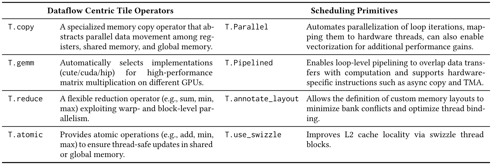
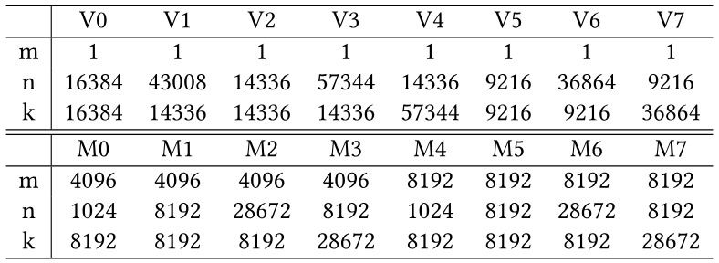
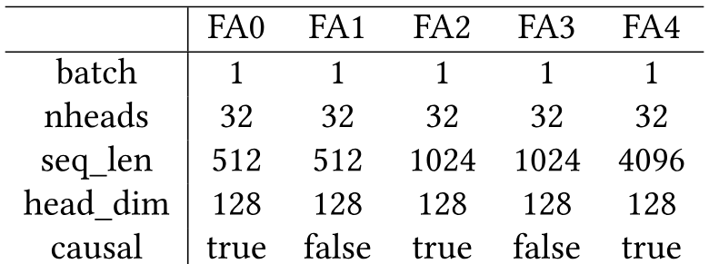
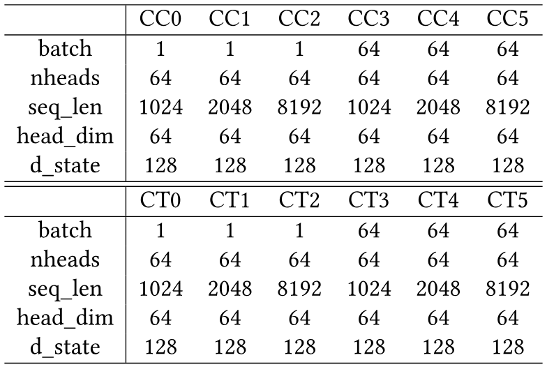

> [Lei Wang](https://x.com/Lei_Wang_1999) [+equal], [Yu Cheng](https://chengyupku.github.io/) [+equal], [Yining Shi](https://dblp.org/pid/161/3927-1.html) [+equal], [Zhengju Tang](https://dblp.org/pid/371/5817.html), [Zhiwen Mo](https://dblp.org/pid/99/3235.html), [Wenhao Xie](https://dblp.org/pid/219/9575.html), [Lingxiao Ma](https://xysmlx.github.io/), [Yuqing Xia](https://dblp.org/pid/211/8365.html), [Jilong Xue](https://dblp.org/pid/06/10336.html), [Fan Yang](https://fanyangcs.github.io/) 和 [Zhi Yang](https://yangzhihome.github.io/). 论文于 2025 年 4 月 24 日首次提交至 arXiv; 当前 arXiv 版本为 2025 年 4 月 27 日的 v2. 后续扩展版本以 [ICLR 2026 Oral](https://openreview.net/forum?id=Jb1WkNSfUB) 发表. [arXiv: TileLang: A Composable Tiled Programming Model for AI Systems](https://arxiv.org/abs/2504.17577). [原始 PDF](/paper/tilelang.pdf). [DOI](https://doi.org/10.48550/arXiv.2504.17577). [TeX 源文件](https://arxiv.org/src/2504.17577v2). 本阅读版保留了 arXiv v2 的实质性正文, 图, 表, 代码和附录; 精确的印刷布局和参考文献以原始 PDF 为准.

[+equal]: 同等贡献.

## 摘要

现代 AI 工作负载在训练和推理中都高度依赖优化过的计算内核. 这些 AI 内核遵循定义明确的数据流模式, 例如在 DRAM 与 SRAM 之间移动 tile, 并在这些 tile 上执行一系列计算. 然而, 尽管这些模式十分清晰, 编写高性能内核仍然很复杂. 要实现峰值性能, 必须进行细致且以硬件为中心的优化, 才能充分利用现代加速器. 虽然领域特定编译器试图减轻编写高性能内核的负担, 但它们经常面临易用性和表达能力方面的缺口.

在本文中, 我们提出 TileLang, 这是一种用于更高效地编写 AI Kernel 的通用 tiled 编程模型. **TileLang 将调度空间 (线程绑定, 布局, tensorize 和流水线) 与数据流解耦, 并将它们封装为一组可定制的注解和原语.** 这种方法使用户可以专注于内核的数据流本身, 同时将大多数其他优化留给编译器. 我们在常用设备上开展了全面实验; 在大量实验中, 评估结果表明 TileLang 可以在关键内核上达到最先进的性能, 证明其统一的 block-and-thread 范式和透明的调度能力同时具备现代 AI 系统开发所需的能力与灵活性.

## 1 引言

过去几年中, 对 AI 工作负载更高性能的追求 [Ope22, Goo24, Mic24, Yan23] 加速了专用内核 [Dao22, Nvi24a, Amd21, Res24] 的发展, 而这些内核同时驱动着训练和推理. 尤其是矩阵乘法, 它支撑着广泛的神经网络架构, 从简单的前馈层到大规模基于 Transformer 的模型. 为应对这些网络带来的巨大计算负担, FlashAttention [Sha24b] 等定制内核已经出现, 用于优化注意力机制, 减少内存开销并提高处理吞吐量. 然而, 要在不断演进的加速器硬件上实现高效率, 需要将硬件感知设计与复杂调优细致结合—这些挑战推动了人们对表达能力更强的领域特定编译器日益增长的兴趣.

深度学习内核通常表示为数据流模式, 其中包含在 DRAM 与 SRAM 之间移动 tile, 并在这些 tile 上执行一系列计算. 尽管这些模式看起来很清晰, 编写高性能内核仍然很有挑战性, 因为开发者必须手动处理若干关键优化:

- **线程绑定.** 绑定是指将 tile 操作和数据映射到适当线程的过程. 在 GPU 等现代加速器架构中, 这需要谨慎地将任务分配给线程块, warp 和单个线程, 以最大化并行度并最小化负载不均衡. 最优绑定策略可以改善数据局部性, 并减少线程同步与分歧相关的开销, 从而提高计算吞吐量.
- **内存布局.** 内存布局优化是指系统地组织物理内存中的数据, 以消除 bank conflict 并确保高效的访问模式. 正如近期工作 [Pho19, Hag23] 所展示的那样, 这一过程通常需要将自然的数据表示变换为与架构内存子系统对齐的 tiled 或 blocked 格式. 这种重组有助于实现合并访问和有效的缓存利用, 从而降低内存延迟并提高整体系统性能.
- **内在张量化.** 利用 intrinsic function 是指直接使用为性能优化的目标特定指令. 现代处理器和加速器提供专用操作—例如 Tensor Core [Nvi17] 和 Matrix Core [Amd20]—它们可以同时执行多个算术操作, 还提供 vector copy 和 asynchronous copy 等机制以更充分地利用带宽. 使用这些 intrinsic 指令需要精确管理数据类型, 内存对齐和控制流, 才能充分发挥硬件的计算能力, 从而在关键内核操作中获得显著加速.
- **流水线.** 流水线通过重叠数据移动和计算来缓解内存访问延迟. 通过并发调度数据传输和计算任务, 流水线可确保处理单元保持活跃, 并最大程度减少因内存延迟造成的空闲时间. 在先进的 Nvidia Hopper 架构中, Tensor Memory Accelerator (TMA) [Nvi23] 可以为 CUDA Core 和 Tensor Core 等不同计算单元启用异步过程, 从而促进这一过程并进一步提高并发性.

尽管近期面向 AI 工作负载的领域特定编译器 [Che18, Zhe20, Zhu22] 已经大幅简化了高性能内核的创建, 但即使数据流被显式暴露, 它们仍会将大多数底层优化与内核实现交织在一起. 例如, Triton [Til19] 提供直观的块级原语, 但将线程行为, 内存布局和地址空间注解隐藏在自动生成的策略之后. 这种抽象简化了编程, 却会妨碍希望榨取最高性能的资深开发者—例如在实现量化权重矩阵乘法时. 这类内核通常需要内联汇编来执行向量化数据类型转换 [Kim22], 还需要与硬件特定内存缓冲区仔细对齐的自定义数据布局 [Wan24e]. 虽然 Triton 提供了 `tl.dot` 等向量化操作, 但要将它们扩展到定制用例—例如通过 PTX 注册手工编写的高性能 tile 算子—仍然很繁琐. 此外, 尽管 Triton 暴露了易用的流水线旋钮 (`num_stage`), 它并不允许用户定义完全自定义的流水线. 因此, 领域专家在开发需要显式控制内存层次结构和其他细粒度优化的内核时会受到限制.

为解决这些限制, 我们提出 TileLang, 一种在保留 Triton 简洁性的同时提供更大灵活性的编程模型. TileLang 旨在让用户对调度空间进行细粒度控制, 以获得更高性能. 我们认为, 实现这一点的关键是将数据流与调度解耦: 用户只需使用可组合的 tile 算子定义数据流, 而编译器负责探索并应用调度策略. 当编译器的默认优化不足时, 用户可以在前端实施更精确的控制. 我们引入了一种可组合的 tiled 编程抽象, 其中 GEMM, COPY, ATOMIC 和 REDUCE 等核心计算模式使用 tile 算子表达. 这些算子独立于调度决策来定义内核的数据流. 与此同时, 系统提供一组调度原语和注解来捕获进一步的优化, 使用户可以选择依赖编译器生成的调度, 或手动微调内核中对性能至关重要的方面.

为了提高 TileLang 的易用性, 我们用 Python 实现了前端语言, 以较少的类型注解提供灵活的编程风格. 此外, 我们为 TileLang 引入了一个编译器, 它将用户定义的程序转换为高度优化的底层代码, 从而在现代硬件上高效执行. 该编译器会自动完成关键优化, 减少性能调优所需的人工工作. 总而言之, 我们的贡献如下:

1. **Tile 级编程语言.** 我们设计了一种 tile 级编程语言, 允许用户显式声明缓冲区在硬件内存层次结构中的位置. 通过利用 Layout Inference 机制, 系统在暴露线程级控制接口的同时, 抽象掉高效并行化缓冲区操作的复杂性, 使专家能够精确管理每个线程与缓冲区交互的方式.
2. **具备自动优化的编译器.** 我们为 TileLang 提供了配套编译器, 其中包含一系列自动编译 pass. 这些 pass 包含通过 Layout Inference 机制实现自动并行化, 面向内核库的动态参数简化, 自动流水线推导, 以及针对动态形状的循环尾部拆分优化等功能. 该编译器确保 TileLang 程序既高效又易于编写.
3. **最先进的性能.** 在现实 AI 内核上的实证评估表明, TileLang 在 NVIDIA 和 AMD GPU 上都能达到与专用供应商库以及 Triton 等其他基于 DSL 的方法相当, 有时甚至更高的性能.

在本文其余部分, 我们将介绍 TileLang 的设计与实现. 我们首先描述语言语法和底层编程模型. 随后详细说明 TileLang JIT 编译器架构, 包括硬件无关与硬件感知优化. 最后, 我们将 TileLang 与现有工作进行比较, 并总结我们的发现, 同时概述这一高性能 AI 内核开发统一方法的未来方向. 我们已将 TileLang 开源 [+source].

[+source]: <https://github.com/tile-ai/tilelang>

## 2 TileLang 示例

<span id="figure-01"></span>


**图 1.** TileLang 程序及其对应的降低后 ir 和生成的 cuda 代码示例. 为便于演示, 代码片段经过简化.

将调度与计算分离的现有机器学习编译器 (例如 TVM) 要求用户显式区分计算与调度. 此外, 用户必须手动注册新的张量指令并指定缓冲区布局, 才能获得最优性能. 然而, 编写和理解调度程序仍然很有挑战性. 虽然 Triton 等现代框架允许用户专注于 tile 级编程, 但其数据流表示往往不够清晰, 并且需要使用某些变通方法—例如带掩码的条件加载—或 Tensor Memory Accelerator (TMA) 等硬件特定功能. 虽然 ThunderKitten 等框架将程序抽象为 tile 粒度的加载, 计算, 存储和同步操作组合, 但其数据流仍不够透明, 限制了用户应用进一步优化的能力. 此外, 随着基于 Python 的深度学习框架 [Pyt17, Wol19] 广泛采用, 手动将模型翻译成 C++ 进行优化并不现实. 因此, 在设计 TileLang 时, 我们强调三个关键原则: (1) **Pythonic 设计**, 与 Python 生态系统无缝集成, 提供熟悉的编码体验并降低学习曲线; (2) **以数据流为中心**, 使用户能够主要关注数据流, 同时抽象掉底层调度复杂性. 它将线程绑定, 内存布局, 张量化和流水线等调度方面与数据流解耦, 并将其封装为一组可定制的注解和原语, 从而提高可编程性和可维护性; 以及 (3) **可组合性**, 确保内核, 原语和调度策略可以无缝组合以构建复杂设计.

下面, 我们在 TileLang 中实现一个通用矩阵乘法 (GEMM) 内核, 以说明其基本语法并展示它如何提高生产力. 如[图 1](#figure-01)(a) 所示, 该实现首先定义 GEMM 内核的输入和输出 (第 8 行), 并指定它们的形状和数据类型. 随后, 我们初始化内核上下文 (第 9-11 行), 它确定网格大小和线程总数; 接着是内核主体 (第 12-27 行), 其中包括片上内存分配和数据流管理. 由于 TileLang 是一种嵌入 Python 的编程语言, 它支持 Python 的所有命令式结构 (例如 `if-else`, `for` 和 `while`), 关键区别是用户必须为函数参数和变量声明提供显式类型注解. 之所以有这一要求, 是因为 Python 的动态类型可能并不天然适合设备代码生成 (例如 CUDA/HIP), 而静态数据类型对于确定精确的数据位宽至关重要. 在 TileLang 中, 类型注解显式定义元素类型和张量形状, 从而确保正确性并实现高效代码生成. 此外, TileLang 允许显式分配内存, 以便更好地控制数据放置和访问模式. 在给出的实现中, TileLang 使用 `T.alloc_shared` 将 $A$ 和 $B$ 的子矩阵存储在共享内存中, 而 `T.alloc_fragments` 用于在块级寄存器文件中分配累加器. 此外, 使用流水线执行 (`T.Pipelined`) 可以重叠内存传输与计算, 从而有效隐藏内存延迟并提高整体吞吐量. `T.gemm` 操作利用 NVIDIA CUTLASS 或手工编写的 HIP 代码高效执行 tile 级矩阵计算. 通过自动完成底层调度和同步, TileLang 使开发者可以专注于算法设计而非硬件特定优化, 从而在保持计算效率的同时提高生产力.

最后, 我们调用 `tilelang.compile` (第 31 行) 将 `tilelang` 程序降低为中间表示 (IR), 如[图 1](#figure-01)(b) 所示. 随后, 该 IR 被进一步编译为可执行文件, 生成最终的优化代码, 如[图 1](#figure-01)(c) 所示.

## 3 Tile Language

本节将介绍 tile-based 编程模型的基础, 解释 TileLang 如何系统而高效地管理 AI 内核开发, 并概述 TileLang 将数据流与其他调度空间分离的设计理念.

[图 2](#figure-02) 展示了 TileLang 的五阶段编译流水线. 首先, 开发者使用 TileLang 编写高级程序, 以描述计算逻辑和数据访问模式. 在 Parser 阶段, TileLang 程序被解析为 Python AST, 随后转换为 TileLang AST. 接下来, IR Builder 将 AST 转换为 TVM 中间表示 (IR), 使我们能够利用 TVM 的语法树和相关基础设施. 此后, Optimization 阶段执行一系列图优化和调度变换, 以提高执行效率. 最后, Codegen 阶段将优化后的 IR 转换为 LLVM IR, CUDA C/C++ 或 HIP C/C++ 等后端代码, 从而支持多种硬件平台.

<span id="figure-02"></span>


**图 2.** TileLang 编译流水线的各个阶段.

[表 1](#table-01) 展示了 TileLang 提供的数据流算子和调度原语中具有代表性的子集. Tile Language 采用以数据为中心的编程范式, 其中核心计算语义通过 `T.copy`, `T.gemm` 和 `T.reduce` 等 tile 级算子表达. 作为这些算子的补充, TileLang 暴露了一组调度原语, 使开发者可以微调并行性, 流水线和内存布局等对性能至关重要的方面. 我们将在后续各节中说明这两个组成部分的设计.

<span id="table-01"></span>



**表 1.** TileLang 支持的部分数据流算子和调度原语.

### 3.1 Tile-based 编程模型

[图 3](#figure-03) 给出了 TileLang 中简洁的矩阵乘法 (GEMM) 示例, 展示开发者如何使用 tile, 内存放置, 流水线和算子调用等高级结构, 对数据移动和计算进行细粒度控制. 特别是, 该代码片段的[图 3](#figure-03)(a) 展示了多级 tiling 如何利用不同的内存层次结构 (全局内存, 共享内存和寄存器) 来优化带宽利用率并降低延迟. 总体而言, [图 3](#figure-03) (b) 展示了 TileLang 类 Python 的语法如何让开发者在易用的编程模型中推理对性能至关重要的优化.

<span id="figure-03"></span>


**图 3.** 通过 TileLang 在 GPU 上使用多级 Tiling 优化 GEMM.

**Tile 声明.** 我们方法的核心是在编程模型中将 *tile* 作为一等对象. 一个 tile 表示具有形状的一部分数据, 可以由 warp, 线程块或等效的并行单元拥有和操作. 在 `Matmul` 示例中, `A` 和 `B` 缓冲区会在内核循环中以 tiled 分块读取 (由 `block_M`, `block_N`, `block_K` 决定). TileLang 使用 `T.Kernel` 定义执行上下文, 其中包括线程块索引 (`bx` 和 `by`) 以及线程数量. 这些上下文可以帮助我们计算每个线程块的索引, 并使 TileLang 更容易自动推断和优化内存访问与计算. 此外, 这些上下文允许用户手动控制线程块中每个独立线程的行为.

**显式硬件内存分配.** TileLang 的一个标志性特点是能够将这些 tile 缓冲区显式放置到硬件内存层次结构中. TileLang 并不将其留给编译器不透明的优化 pass, 而是暴露直接映射到物理内存空间或加速器特定结构的面向用户 intrinsic. 具体而言:

- **T.alloc_shared**: 在快速的片上存储空间中分配内存, 对应 NVIDIA GPU 上的共享内存. 共享内存非常适合在计算期间缓存中间数据, 因为它比全局内存快得多, 并允许同一线程块中的线程高效共享数据. 例如, 在矩阵乘法中, 可以将矩阵的 tile 加载到共享内存中, 从而减少全局内存带宽需求并提高性能.
- **T.alloc_fragment**: 在 fragment 内存中分配累加器, 对应 NVIDIA GPU 上的寄存器文件. 通过将输入和部分和保存在寄存器或硬件级缓存中, 可以进一步最小化延迟. 请注意, 在这个 tile 程序中, 每个 tile 分配与共享内存相同的局部缓冲区, 这看起来可能有违直觉, 因为共享内存通常更快但更充裕, 而寄存器文件则有限. 这是因为这里的分配是指整个线程块的寄存器文件. TileLang 在编译期间使用 Layout Inference Pass 推导 Layout 对象 `T.Fragment`, 它决定如何为每个线程分配相应的寄存器文件. 后续各节将详细讨论这一过程.

全局内存与硬件特定内存之间的数据传输可以使用 `T.copy` 管理. 此外, 可以使用 `T.clear` 或 `T.fill` 初始化硬件特定缓冲区. 对于数据赋值, 还可以使用 `T.Parallel` 并行执行操作, 如[图 8](#figure-08) 所示.

### 3.2 以数据流为中心的 Tile 算子

TileLang 抽象了一组 Tile Operator, 使开发者可以专注于数据流逻辑, 而无需管理每个 tile 操作的底层实现细节. [图 4](#figure-04) 展示了 Tile Operator 的接口以及若干代表性示例, 包括 `GEMM`, `Copy` 和 `Parallel`. 每个 Tile Operator 都必须实现两个关键接口: `Lower` 和 `InferLayout`. `Lower` 接口定义如何将高级 Tile Operator 降低为更低级的 IR, 例如线程绑定或向量化内存访问. 例如, `Copy` 可以降低为带有显式线程绑定和向量化加载/存储的循环. `InferLayout` 接口负责确定与 Tile Operator 关联的内存布局和循环布局. 这包括推断缓冲区布局 (例如 swizzled memory) 或循环级布局 (例如线程绑定). 例如, `T.gemm` 对共享内存输入应用 swizzled layout, 并使用矩阵特定布局写回 MMA fragment. 类似地, `T.Parallel` 中的并行循环结构可以用线程级绑定和向量化访问模式表示, 二者都通过 layout inference 推导. [第 4.1 节](#_4-1-内存布局组合)将更详细地讨论布局组合及其在降低过程中的作用.

<span id="figure-04"></span>


**图 4.** Tile-Operator 的接口和 TileOP 示例实例.

[表 1](#table-01) 列出了 TileLang 中用于简化 tile-based 编程常见操作的部分算子. 这些内置算子抽象了硬件内存访问和计算的底层细节, 使开发者可以从数据流视角专注于高级算法设计, 同时保持对性能关键方面的细粒度控制. 每个算子都被设计为与 tile 编程模型无缝集成, 从而确保数据在硬件内存层次结构中高效移动和计算. 下面, 我们描述若干关键算子及其在优化内存传输和算术计算方面的作用.

- **copy**: copy op 是带内存复制的 `T.Parallel` 语法糖, 它允许从寄存器的 fragment scope, 静态共享内存的 shared scope, 动态共享内存的 shared.dyn 以及全局内存的 global scope 复制数据, 也允许复制到这些 scope.
- **gemm**: 内置 `T.gemm` 算子是通用矩阵乘法的高度优化实现, 支持多种内存访问模式 (`ss`, `sr`, `rs`, `rr`), 其中 `r` 表示寄存器内存, `s` 表示共享内存. 该算子会根据内核配置自动选择最优实现. 对于 CUDA 后端, `T.gemm` 使用 Nvidia 的 CUTLASS 库高效利用 Tensor Core 或 CUDA Core; 对于 AMD GPU, 它同时使用 composable kernel 和手工编写的 HIP 代码进行性能优化. 用户还可以通过在 Python 中注册自定义原语来扩展 `T.gemm`, 使其灵活适应特定用例.
- **reduce**: `T.reduce` 算子提供灵活高效的规约机制, 用于跨维度聚合数据. 它支持 `sum`, `min`, `max` 和 `product` 等多种规约操作. 规约可以沿指定轴执行, 从而支持矩阵中按行或按列规约等操作. `T.reduce` 的实现会利用 warp 级和 block 级并行性, 在 CUDA 和 AMD 后端上获得最优性能. 用户也可以通过定义自己的规约内核来自定义规约操作.
- **atomic**: `T.atomic` 算子提供原子操作, 用于在并行上下文中安全更新共享内存或全局内存. `add`, `min` 和 `max` 等常见原子操作开箱即用. `T.atomic` 可确保并发更新期间的线程安全, 因而对于直方图更新, 使用共享内存的规约以及无同步计数器等操作至关重要. 它被设计为在 NVIDIA 和 AMD GPU 上利用原生硬件原子指令, 从而在保持并行执行正确性的同时实现高性能.

### 3.3 调度注解与原语

虽然数据流模式构成了计算组织的基础, 但现代高性能计算需要对执行模式进行更细粒度的控制. 为满足这一需求, TileLang 提供了一套全面的调度原语, 使开发者能够精确调节应用程序中对性能至关重要的方面, 如[表 1](#table-01) 所示:

- **Pipelined**: `T.Pipelined` 原语允许高效地流水线执行循环, 通过重叠计算和内存操作来提高性能. 在[图 3](#figure-03) 中, 遍历 `k` (规约维度) 的循环使用 `num_stages=3` 进行流水线化, 形成一个 3 级流水线. 该流水线允许数据传输, 计算和后续数据准备相互重叠, 从而有效减少内存瓶颈并提高计算吞吐量. 从 `T.Pipelined` 降低到 CUDA 源代码的详细流程设计将在[第 4.4 节](#_4-4-软件定义流水线)中讨论.
- **Parallel**: `T.Parallel` 原语通过将迭代映射到线程来自动并行化循环. 在[图 8](#figure-08) 中, 将数据复制到 `A_shared` 的操作使用 `T.Parallel(8, 32)` 在 `8` 和 `32` 两个维度上并行化. 它不仅通过利用硬件并行性提高性能, 还会自动将线程映射到迭代并支持向量化以进一步优化.
- **annotate_layout**: `T.annotate_layout` 原语允许你使用用户定义的内存布局, 为共享内存或全局内存指定内存布局优化. 默认情况下, TileLang 采用为 NVIDIA 和 AMD GPU 上最小化 bank conflict 而设计的优化内存布局.
- **use_swizzle**: `T.use_swizzle` 原语通过启用 swizzled 内存访问来改善 L2 缓存局部性. 从而改善光栅化的数据复用. 在并行线程块中处理 tiled 数据时, 该原语尤其有效.

## 4 调度设计与自动化

本节讨论 TileLang 中除 Dataflow 之外的四类调度空间及其自动化设计. 其中一些相对独立 (例如流水线和张量化), 另一些则耦合得更紧密, 例如 Thread Binding 和 Memory Layouts 设计. 在后续各节中, 我们将首先说明 Memory Layout Infrastructure 的设计, 然后介绍 Thread Binding. 随后, 我们将讨论 Tensorization 的自动化设计, 最后分享 Pipeline 的设计.

### 4.1 内存布局组合

在 TileLang 中, 我们支持通过 `A[i, k]` 等高级接口对多维数组进行索引. 这种高级索引最终会经过一系列软件和硬件抽象层, 转换为物理内存地址. 为了建模这一索引转换过程, 我们引入了关键抽象 **Layout**, 用于描述数据在内存中的组织和映射方式. 在物理地址层面, 布局可以表示为 $\sum_{i} y_i s_i$ 形式的线性化地址表达式, 其中 $y_i$ 表示第 $i$ 个维度上的索引, $s_i$ 是该维度对总体线性内存地址贡献的 stride. 给定布局 $L = s : d = (s_0, s_1, \ldots, s_{n-1}) : (d_0, d_1, \ldots, d_{n-1})$, TileLang 采用受 TVM [Che18] 启发的设计, 引入了建立在 *IterVar* 之上的可组合且可堆叠的布局函数抽象. 由于 *IterVar* 可以封装 stride 信息, 布局表达式可以简化为关于 IterVar 的代数形式. 因此, 布局函数可以正式表达为映射 $f : \mathbb{K}^n \to \mathbb{K}^m$, 其中 $f$ 编码从高级索引到内存地址的转换.

<span id="figure-05"></span>


**图 5.** Layout Function 的接口和示例实例.

[图 5](#figure-05)(a) 展示了 TileLang 中 `Layout` 的定义. 其核心组成部分包括可选择携带范围信息的 `iter_vars`, 以及一组根据这些迭代变量计算内存位置的 `forward_index` 表达式. 这些表达式共同定义一个代数函数 $f : \mathbb{K}^n \to \mathbb{K}^m$ . 如[图 5](#figure-05)(b) 所示, 这允许表达从 2D 到 1D 的布局变换. 给定缓冲区的形状后, `iter_vars` 被绑定到特定区域, 生成的表达式会传给 arithmetic analyzer, 以确定符号边界或常量边界. 这些边界用于推断变换后缓冲区的形状, 并相应调整缓冲区访问索引.

TileLang 还支持非双射布局变换. 例如, [图 5](#figure-05)(c) 展示了如何使用布局为缓冲区访问添加 padding. 这些布局变换可以组合, TileLang 还包括若干内置布局策略, 例如通常用于缓解 GPU 共享内存 bank conflict 的 layout swizzling.

此外, TileLang 引入了 **Layout** 抽象的扩展, 称为 **Fragment**. 与标准布局不同, Fragment Layout 总是产生 $f : \mathbb{K}^n \to \mathbb{K}^2$ 形式的输出, 其中两个输出维度分别表示线程在寄存器文件中的位置以及局部寄存器文件的索引. 例如, 在[图 3](#figure-03) 中, 内核在块级分配了寄存器文件 $C_{\mathrm{local}}$. 然而, 由于 GPU 寄存器文件必须在线程块内的线程之间划分, Fragment Layout 可以准确描述这种划分方案.

[图 6](#figure-06)(a) 展示了 Fragment Layout 的定义, TileLang 提供四种原语操作, 帮助用户扩展现有 Fragment Layout. [图 6](#figure-06)(b) 给出了使用这些原语的示例, 它从 `mma_ldmatrix` 指令中用于 `m16k16` 矩阵 fragment 的基础布局推导出完整的块级布局. 这里, `base_layout` 表示单个 warp 消费 `m16k16` 矩阵时的布局. 该布局通过 `repeat` 原语扩展为 `warp_layout`, 使单个 warp 可以消费 `m32k16` 矩阵. [图 6](#figure-06)(c) 可视化了这一变换. 随后, `warp_layout` 使用 `repeat_on_thread` 和 `replicate` 等原语进一步扩展为 `block_layout`, 表示四个 warp 共同消费 `m128k16` 矩阵.

<span id="figure-06"></span>


**图 6.** Fragment Layout 的接口和示例实例.

### 4.2 线程绑定

基于 Fragment Layout 抽象, 随之而来的一个关键挑战是如何在执行时将这些布局映射到线程. 这引出了 **Thread Binding** 问题, 它包括确定如何在单个线程之间分配块级寄存器文件, 以及如何推断适当的 fragment layout. 此外, 它还需要确定应如何正确并行化循环, 以匹配布局约束.

虽然[第 4.1 节](#_4-1-内存布局组合)引入了 Fragment Layout 以帮助简化这一过程, 但对于任意计算表达式, 确定所有缓冲区的合适 fragment layout 仍然很困难. 我们提出两个关键观察来指导这一过程. 第一, 由于多个 tile 算子往往共享相同的缓冲区, 它们各自的布局和线程绑定策略相互依赖. 第二, 不同算子对布局和线程绑定要求的严格程度不同. 例如, 在 GPU 上, GEMM 算子 (利用 Tensor Core) 对布局和线程绑定都有严格约束, 而逐元素算子通常允许更大的灵活性.

基于这些观察, 我们提出了一种基于 Layout 和 Fragment 对象的推断方案, 用于优化缓冲区布局和线程绑定. 为系统地管理缓冲区布局, 我们维护一个记录所有缓冲区布局信息的 LayoutMap. 我们为 tile 算子布局定义了分层优先级系统, 其中更高的优先级表示更严格的布局要求和更大的性能影响. TileLang 以自顶向下的方式处理布局推断, 按从最高到最低的优先级依次推断布局. 在每个优先级上, TileLang 会尝试推断所有尚未确定的缓冲区布局, 直到无法取得进一步进展, 然后再转到下一个较低优先级.

如[图 7](#figure-07) 所示, 考虑这样一种场景: 矩阵 C 表示 GEMM 操作的结果, 对应一个 Fragment 对象, 并且需要在 GEMM 计算后加上偏置 D. 由于 GEMM 在推断过程中具有最高优先级, 它的线程绑定配置已经预先确定, 而 D 的线程绑定策略仍有待确定. 输出矩阵 C 的维度为 4×4, 分布在 8 个线程上, 每个线程负责 2 个元素. 因此, 偏置缓冲区 D 的布局必须与这一配置对齐. 由于张量 C 的每一行由 2 个线程处理, 两个线程都需要访问 D 中相同的元素来执行加法操作. 因此, 必须复制 D, 以确保每个线程都能访问对应元素. 可以用相同方法推断 D 的布局.

<span id="figure-07"></span>


**图 7.** Fragment 的线程绑定推断示例.

[图 8](#figure-08) 展示了线程绑定推断过程的一个示例. 具体而言, [图 8](#figure-08)(a) 给出了复制数据的简单代码片段, 它描述了从全局内存向共享内存传输 subtile 的数据流. 适当的线程绑定和向量化访问可以充分利用 GPU 的并行性, 并利用高性能内存访问指令. 在[图 8](#figure-08)(b) 中, `T.copy` 操作被展开为多个循环轴. 应用 Layout Inference Pass 后, 如[图 8](#figure-08)(c) 所示, 程序会自动向量化和并行化. 最后, 在[图 8](#figure-08)(d) 所示的阶段应用 Layout Swizzling.

<span id="figure-08"></span>


**图 8.** 用于高效并行内存访问的多阶段自动线程绑定推断.

### 4.3 利用高性能硬件指令

现代硬件架构通常支持通过多条指令路径实现同一计算操作. 例如, 在 NVIDIA GPU 上, 8-bit 乘加操作可以通过多类指令实现. `IMAD` 指令执行标量融合乘加操作, 计算 $d = a \cdot b + c$, 其中所有操作数在内部都会提升为 32-bit 整数进行计算. `DP4A` 指令支持向量化点积操作, 计算 $d = \langle \mathbf{a}, \mathbf{b} \rangle + c = \sum_{i=0}^{3} a_i b_i + c$, 其中 $\mathbf{a}$ 和 $\mathbf{b}$ 是长度为 4 的 8-bit 整数向量, 偏置 $c$ 和输出 $d$ 均以 32-bit 整数精度表示. 对于吞吐量更高的矩阵计算, `MMA` 指令利用 Tensor Core 执行 $\mathbf{D} = \mathbf{A} \cdot \mathbf{B} + \mathbf{C}$, 其中 $\mathbf{A} \in \mathbb{R}^{16 \times 32}, \mathbf{B} \in \mathbb{R}^{32 \times 8}, \mathbf{C}, \mathbf{D} \in \mathbb{R}^{16 \times 8}$; 在这种情况下, $\mathbf{A}$ 和 $\mathbf{B}$ 是 8-bit 整数矩阵, 而 $\mathbf{C}$ 和累加结果 $\mathbf{D}$ 使用 32-bit 整数精度. 在 NVIDIA RTX 3090 GPU 上, 这些指令的吞吐量分别约为 17.8 TOPS, 71.2 TOPS 和 284 TOPS. 此外, `MMA` 指令在相同精度设置下支持多种形状.

在 TileLang 中, 如[图 9](#figure-09)(a) 和 (b) 所示, 有两种调用硬件张量指令的方法. 第一种方法 ([图 9](#figure-09)(a)) 使用 C++ 源代码注入, 其中 `dp4a` 等指令通过 C++ 模板手动封装, 并通过 `T.import_source` 和 `T.call_extern` 注入内核. 这样可以在利用熟悉的 C 风格语法时实现底层控制. 注入的函数在生成代码的开头定义, 并在内核中调用. 另一种方法如[图 9](#figure-09)(b) 所示, TileLang 提供内置 `T.ptx` 原语, 允许在内核中直接发出内联 PTX 指令 (例如 `mma.m16n8k32.row.col.s32.s8.s8.s32`). 这为利用专用指令提供了另一种底层机制, 尤其适合 warp 级操作.

<span id="figure-09"></span>


**图 9.** 在 `tilelang` 中使用高性能硬件指令的不同方法

然而, 根据输入形状和数据类型选择最合适的指令可能很有挑战性. 为简化这一过程, TileLang 还支持与 Tile Library 集成, 如[图 9](#figure-09)(c) 所示. Tile Library—例如 NVIDIA 的 `cute` 或 AMD 的 `composable kernel (ck)`—为 GEMM 等操作提供高级且标准化的 tile-based API (例如 `tl::gemm_ss`). 这些库抽象了硬件特定细节, 并允许底层实现为给定输入配置自动选择最高效的指令. 在 TileLang 中, 开发者可以使用 `T.call_extern` 以直接且一致的方式调用这些库.

总之, TileLang 提供两种互补的方法来利用高性能指令. 第一种利用 Tile Library, 它简化了集成并受益于供应商优化的性能. 然而, 高级抽象可能限制底层控制. 例如, `cute::gemm_ss` 接口对共享内存输入执行 GEMM 操作, 但从共享内存到寄存器的数据流由 `cute` 模板在内部管理. 这使得外部无法注解或覆盖内部布局, 因而降低了灵活性. 此外, 大量使用模板可能显著减慢编译速度. 使用 NVCC 12.8 trace 工具的分析表明, 对 `tilelang` 生成的 CUDA 代码而言, 模板展开约占编译时间的 90%.

<span id="figure-10"></span>


**图 10.** 在 `tilelang` 中使用 `DP4A` 和 `mma` 的不同方法

相比之下, TileLang 允许使用 `tilelang` 本身通过 `T.gemm` 直接实现指令. 这避免了布局注解限制并缩短编译时间. 但是, 它要求用户在 `tilelang` 中为每个目标硬件指令实现完整的指令集. 目前, TileLang 支持这两种方法, 并默认使用基于 Tile Library 的方法, 以便快速支持新的硬件指令.

### 4.4 软件定义流水线

TileLang 使用自动软件流水线推断机制分析计算块 (在本例中为 Copy 和 GEMM) 之间的依赖关系, 并生成结构化流水线调度, 在保持正确执行顺序的同时最大化并行性. 具体而言, 该机制将 Copy 任务与其他计算密集型操作交错, 以减少空闲时间; 在检测到异步处理机会时, 它会将这些任务自动映射到可用硬件资源上并发执行. 因此, TileLang 只需向用户暴露一个 `num_stages` 接口, 大幅简化这一过程. 然而, 如果需要, 我们也允许用户显式提供有关顺序和阶段的信息.

<span id="figure-11"></span>


**图 11.** TileLang 中的软件流水线调度. 该图展示了 TileLang 如何交错 Copy 与 GEMM.

对于 Ampere 架构, TileLang 支持使用 `cp.async` 的异步内存复制操作. `cp.async` 指令有助于在全局内存和共享内存之间快速移动数据, 使内存传输可以与计算重叠以提高性能. TileLang 通过分析循环结构并为符合条件的内存传输自动插入 `cp.async` 指令来整合这一能力. 此外, TileLang 确保正确使用 `cp.async.commit` 和 `cp.async.wait` 指令处理同步, 从而保证数据正确性. 这一优化尤其有效, 因为它缓解了寄存器文件的压力, 并使硬件带宽得到更高效的利用.

Hopper 架构引入了两个新特性. 第一, 引入了新的 TMA 单元, 作为负责全局内存与共享内存之间数据复制的专用硬件单元. 第二, PTX 指令集引入了新的 wgmma 指令, 它允许 warpgroup (由四个 warp 组成) 执行矩阵乘法 (MMA) 操作, 以提高 TensorCore 利用率. 此外, `wgmma.mma_async` 指令是异步的. 另外, Hopper 架构的内核优化通常采用 warp specialization, 将线程划分为 producer 和 consumer. producer 线程使用 TMA 移动数据, consumer 线程则负责计算.

在 TileLang 中, 我们会在降低过程中自动执行 warp specialization 优化. 具体而言, TileLang 分析所有语句的缓冲区使用情况并确定其角色 (producer 或 consumer). 基于这一分析, producer 和 consumer 会根据 threadIdx 被划分到不同的执行路径. 为确保计算正确性, TileLang 利用 Live Variable Analysis 确定适当的同步点, 并相应插入内存屏障 (mbarrier).

AMD CDNA 架构也提供异步复制指令和 DMA 支持, TileLang 通过 HIP 封装的 Copy 原语来利用这些功能. 具体而言, TileLang 使用 `s_waitcnt lgkmcnt` 和 `buffer_load_dword lds` 等指令高效管理内存传输. 这一集成使系统能够充分利用硬件重叠数据移动与计算的能力, 进一步提高流水线性能并减少空闲时间.

## 5 数值实验

本节通过一系列涵盖多种硬件平台和工作负载的全面数值实验, 评估 TileLang 的性能. 我们的目标是展示 TileLang 在优化构成现代机器学习工作负载骨干的关键算子内核方面的有效性, 通用性和可扩展性. 通过与最先进的解决方案进行基准比较, 我们旨在突出 TileLang 处理混合精度计算的多用性, 以及它在多种 GPU 架构上带来显著性能提升的能力.

### 5.1 实验设置

**硬件平台.** 我们在 NVIDIA 和 AMD GPU 上评估 TileLang, 因为它们是最广泛使用的加速器之一. 实验使用三款前沿 GPU: NVIDIA H100 (80 GB) [Nvi23], NVIDIA A100 (80 GB) [Nvi20] 和 AMD Instinct MI300X (192 GB) [Amd23]. 对于 NVIDIA H100, 我们使用 CUDA 12.4; 对于 MI300X, 我们使用 ROCm 6.1.0. 所有平台均运行 Ubuntu 20.04.

**算子工作负载.** 我们在一系列经常出现在大规模深度学习流水线中的算子工作负载上评估 TileLang. 在 NVIDIA H100 上, 我们重点关注 multi-head attention (MHA), linear attention 和 general matrix multiplication (GEMM). 对于 NVIDIA A100, 我们测量反量化 GEMM 内核的性能. 同时, 在 AMD Instinct MI300X 上, 我们对 GEMM 和 MHA 进行基准测试, 以覆盖跨不同 GPU 架构的代表性用例. 这些工作负载构成了许多当代神经网络模型 (包括大语言模型) 的基础构件.

**基线.** 为评估 TileLang 的性能, 我们将其与机器学习和 GPU 编程中广泛使用的若干最先进基线进行比较. 其中包括针对 multi-head attention 优化并使用 `tma` 和 `wgmma.mma_async` 等 CUDA 指令的 **FlashAttention-3**; 支持 Nvidia 和 AMD GPU, 但需要手动优化的开源高效 GPU 内核框架 **Triton**; NVIDIA 的高性能稠密线性代数库 **cuBLAS**; AMD 的 BLAS 库 **rocBLAS**; 包含 GEMM 和 FlashAttention-2 等手工优化但尚未完全优化内核的 **PyTorch**; 为支持 $W_{\mathrm{NF}4}A_{\mathrm{FP}16}$ 等格式而设计并提供高效内核的 **BitsandBytes**; 以及为 $W_{\mathrm{INT}4}A_{\mathrm{FP}16}$ 计算高度优化的内核 **Marlin**. 这一选择为 TileLang 在多种优化策略和硬件兼容性上提供了全面比较.

### 5.2 实验

**Flash Attention 性能.** 与 FlashAttention-3, Triton 和 PyTorch 相比, TileLang 分别实现 $1.36\times$, $1.41\times$ 和 $1.70\times$ 的加速. 由于 FlashAttention-3 是手工编写的方法, 它无法高效适应不同的工作负载大小. 特别是, 其固定 tile 大小会在较短序列长度下导致次优性能. 对于较长序列长度 (例如 8k), TileLang 的性能仍接近 FlashAttention-3. PyTorch 使用手工优化的 FlashAttention-2 内核, 因此性能低于 FlashAttention-3.

<span id="figure-12"></span>


**图 12.** Hopper 架构上的 FlashAttention, LinearAtten 性能.

与这些手工模板化实现相比, TileLang 可以自动利用 `cp.async.bulk` 和 `wgmma.mma_async` 等指令, 还会自动应用 warp specialization 等优化. 值得注意的是, 在 H100 GPU 上, TileLang 能够表达与 FlashAttention-3 所用方案同样复杂的流水线调度方案.

**Linear Attention 性能.** 在 Linear Attention 实验中, 我们使用 Mamba-2 的 chunk-scan 和 chunk-state 函数. 与 Triton 相比, TileLang 分别实现了平均 $1.77 \times$ 和 $2.10\times$ 的加速.

<span id="figure-13"></span>


**图 13.** Nvidia 与 AMD GPU 上的 GEMM 性能.


**图 14(a).** H100 上的 MLA 性能与代码行数.

<span id="figure-14"></span>


**图 14(b).** MI300X 上的 MLA 性能与代码行数.

**图 14.** H100 与 MI300X 上 MLA 性能和代码行数的比较.

**Multi-Head Latent Attention 性能.** [图 14](#figure-14) 展示了 H100 和 MI300X GPU 上 MLA 的性能以及相应内核实现的代码行数 (LOC). 在 H100 上, TileLang 相比 Torch 实现 $1075.9\times$ 的加速, 显著优于 Triton 和 FlashInfer, 并达到手工优化 FlashMLA 实现性能的 98%. 此外, TileLang 只需要大约 70 行 Python 代码, 与其他基线相比展现出显著更好的易用性. 在 MI300X 上, TileLang 相比 Torch 实现 $129.2\times$ 的加速, 并在性能和代码紧凑性方面均超过 Triton. 与手工编写的 AITER 库相比, TileLang 达到其 95% 的性能. 由于 AITER 的内核实现没有开源, 图中未包含其 LOC.

**Matmul 性能.** [图 13](#figure-13) 展示了 NVIDIA 和 AMD GPU 上 GEMM 工作负载的性能, 比较了 TileLang, Triton 和供应商优化库. 在 RTX 4090, A100, H100 和 MI300X 上, TileLang 相比供应商库分别实现 $1.10\times$, $0.97\times$, $1.00\times$ 和 $1.04\times$ 的加速. 与 Triton 相比, TileLang 在相同 GPU 上分别实现 $1.08\times$, $1.03\times$, $1.13\times$ 和 $1.25\times$ 的加速. 对于矩阵乘法, TileLang 使用简单语法即可达到供应商优化库的性能. 此外, 通过采用 Layout Swizzling, TileLang 确保在所有测试设备上无 bank conflict 地执行.

**反量化 Matmul 性能.**

<span id="figure-15"></span>


**图 15.** A100 GPU 上的反量化 Matmul 性能.

BitBLAS 是一个用于混合精度计算的高性能库, 具有面向张量数值类型和属性的先进自定义类型系统与调度. 它最初建立在 TensorIR 上, 我们已将其底层后端替换为 TileLang, 从而能够与其他混合精度加速库直接比较. 与 cuBLAS-$W_{\mathrm{FP}16}A_{\mathrm{FP}16}$ 相比, TileLang 最高实现 $7.65\times$ 的加速, 这一结果由 BitBLAS-TileLang-$W_{\mathrm{INT}2}A_{\mathrm{INT}8}$ 配置取得. 此外, 对于 $W_{\mathrm{INT}4}A_{\mathrm{FP}16}$ 格式, 我们的方法相比 Marlin 平均加速 $1.04\times$; 对于 $W_{\mathrm{NF}4}A_{\mathrm{FP}16}$ 格式, 相比 BitsandBytes 平均加速 $1.62\times$. 通过暴露线程级编程接口并允许控制数据布局和流水线配置, TileLang 为开发者提供了更细粒度的优化能力. 例如, 开发者可以利用基于 PTX 的快速数值精度转换指令, 并利用 Ladder 在 tile 内实现更平滑的内存访问. 这些优化很难在 Triton 中实现, 使 TileLang 能够独特地提供 Triton 难以实现的优越性能.

## 6 结论与讨论

为应对在现代硬件加速器上编写高性能内核的挑战, 本文引入了 TileLang, 一种类 Python 的领域特定语言 (DSL), 使用户能够以 tile 粒度进行编程. 与 Triton 不同, TileLang 允许用户在前端显式声明硬件内存层次结构不同层级的缓冲区, 并利用 Layout Inference 机制高效并行化缓冲区操作. 这意味着用户只需描述缓冲区的计算逻辑, 而无需关心并行化如何实现. 同时, TileLang 为专家提供了灵活性, 允许他们显式指定单个线程操作缓冲区时的确切行为. 这种方法在易用性和细粒度控制之间取得平衡, 同时提供灵活性和性能.

与 ThunderKittens [Res24] 相比, TileLang 允许开发者完全使用 Python 编程, 并默认抽象流水线等优化细节, 从而简化编程过程. 例如, 在 Flash Attention 实现中, TileLang 会在 Ampere GPU 上自动使用 async copy 移动数据, 并在 Hopper GPU 上将流水线降低为 TMA. 尽管如此, TileLang 仍允许用户在需要时于前端显式实现流水线. 此外, TileLang 为动态参数, 动态形状和其他高级功能提供强大支持, 使其特别适合编写内核库.

我们还想讨论未来扩展和增强 TileLang 的几个有前景的方向: 第一, 我们计划基于 TileLang 构建自举式 Tile Library, 消除内置算子当前对 CUTLASS 和手工封装 CUDA/HIP 代码的依赖. 第二, 我们计划通过引入 tile 级通信原语和调度策略, 扩展 TileLang 以支持一系列分布式场景. 这将允许用户针对特定的通信和计算资源配置实现高性能内核. 此外, 我们计划研究 TileLang 成本模型的设计. 由于 tile-based 编程范式显式暴露线程映射细节, 内存访问模式和计算行为都得到清晰定义, 这有助于分析硬件行为并开发更有效的成本模型. 最后, 我们打算探索动态形状调优的优化, 特别关注为维度动态变化的程序选择最合适的 tile 配置. TileLang 的设计显式暴露内存层次结构, 这还将有助于支持 CPU, NPU 等多种硬件平台的后端. 我们将探索一种通用设计方法来扩展多后端支持, 使 TileLang 能无缝适配多样的硬件架构.

我们的系统已开源, 以支持未来开发和社区贡献: <https://github.com/tile-ai/tilelang>.

## 附录 A 基准中的算子形状

<span id="table-02"></span>



**表 2.** 基准中的矩阵形状.

<span id="table-03"></span>



**表 3.** 基准中的 FlashAttention 形状.

<span id="table-04"></span>



**表 4.** 基准中的 Linear Attention 形状.

## 附录 B 内核实现

### B.1 矩阵乘法 (Matmul)

<span id="figure-16"></span>

```python
@tilelang.jit
def Matmul(A: T.Tensor, B: T.Tensor, C: T.Tensor):
  with T.Kernel(N // block_N, M // block_M,
    threads=threads) as (bx, by):
    A_shared = T.alloc_shared(block_M, block_K)
    B_shared = T.alloc_shared(block_K, block_N)
    C_local = T.alloc_fragment(block_M, block_N)

    T.clear(C_local)
    for k in T.Pipelined(K // block_K, num_stages=2):
      T.copy(A[by * block_M, k * block_K], A_shared)
      T.copy(B[k * block_K, bx * block_N], B_shared)
      T.gemm(A_shared, B_shared, C_local)

    T.copy(C_local, C[by * block_M, bx * block_N])
```

**图 16.** 矩阵乘法的内核实现.

### B.2 反量化矩阵乘法

<span id="figure-17"></span>

```python
@tilelang.jit
def matmul_fp16_fp4(
  A: T.Tensor(A_shape, in_dtype),
  B: T.Tensor(B_shape, storage_dtype),
  Ct: T.Tensor((N, M), out_dtype),
):
  with T.Kernel(T.ceildiv(N, block_N), T.ceildiv(M, block_M), threads=threads) as (bx, by):
    A_shared = T.alloc_shared(A_shared_shape, in_dtype)
    B_shared = T.alloc_shared(B_shared_shape, storage_dtype)
    B_local = T.alloc_fragment(B_shared_shape, storage_dtype)
    B_dequantize_local = T.alloc_fragment(B_dequantize_shared_shape, in_dtype)
    Ct_local = T.alloc_fragment((block_N, block_M), accum_dtype)

    T.clear(Ct_local)
    for k in T.Pipelined(
      T.ceildiv(K, block_K),
      num_stages=num_stages
    ):
      T.copy(A[by * block_M, k * block_K], A_shared)
      T.copy(B[bx * block_N, k * block_K // num_elems_per_byte], B_shared)
      T.copy(B_shared, B_local)
      for i, j in T.Parallel(block_N, block_K):
        B_dequantize_local[i, j] = _tir_packed_to_unsigned_convert("int", 8)(
          num_bits,
          B_local[i, j // 2],
          j % 2,
          dtype=in_dtype,
        )
      T.gemm(B_dequantize_local, A_shared, Ct_local, transpose_B=True)
    T.copy(Ct_local, Ct[bx * block_N, by * block_M])
```

**图 17.** 使用 TileLang 实现 Weight-Only Quantization ($W_{\mathrm{FP4\_E2M1}}A_{\mathrm{FP16}}$) Matmul, 通过简单形式展示对混合精度计算的支持.

### B.3 FlashMLA 实现

<span id="figure-18"></span>

```python
@tilelang.jit
def flash_attn(
  Q: T.Tensor([batch, heads, dim], dtype),
  Q_pe: T.Tensor([batch, heads, pe_dim], dtype),
  KV: T.Tensor([batch, seqlen_kv, kv_head_num, dim], dtype),
  K_pe: T.Tensor([batch, seqlen_kv, kv_head_num, pe_dim], dtype),
  Output: T.Tensor([batch, heads, dim], dtype),
):
  with T.Kernel(batch, heads // min(block_H, kv_group_num), threads=256) as (bx, by):
    Q_shared = T.alloc_shared([block_H, dim], dtype)
    S_shared = T.alloc_shared([block_H, block_N], dtype)
    Q_pe_shared = T.alloc_shared([block_H, pe_dim], dtype)
    KV_shared = T.alloc_shared([block_N, dim], dtype)
    K_pe_shared = T.alloc_shared([block_N, pe_dim], dtype)
    O_shared = T.alloc_shared([block_H, dim], dtype)
    acc_s = T.alloc_fragment([block_H, block_N], accum_dtype)
    acc_o = T.alloc_fragment([block_H, dim], accum_dtype)
    scores_max = T.alloc_fragment([block_H], accum_dtype)
    scores_max_prev = T.alloc_fragment([block_H], accum_dtype)
    scores_scale = T.alloc_fragment([block_H], accum_dtype)
    scores_sum = T.alloc_fragment([block_H], accum_dtype)
    logsum = T.alloc_fragment([block_H], accum_dtype)

    cur_kv_head = by // (kv_group_num // block_H)
    T.use_swizzle(10)

    T.copy(Q[bx, by * VALID_BLOCK_H:(by + 1) * VALID_BLOCK_H, :], Q_shared)
    T.copy(Q_pe[bx, by * VALID_BLOCK_H:(by + 1) * VALID_BLOCK_H, :], Q_pe_shared)
    T.fill(acc_o, 0)
    T.fill(logsum, 0)
    T.fill(scores_max, -T.infinity(accum_dtype))

    loop_range = T.ceildiv(seqlen_kv, block_N)
    for k in T.Pipelined(loop_range, num_stages=2):
      T.copy(KV[bx, k * block_N:(k + 1) * block_N, cur_kv_head, :], KV_shared)
      T.copy(K_pe[bx, k * block_N:(k + 1) * block_N, cur_kv_head, :], K_pe_shared)
      T.clear(acc_s)
      T.gemm(
        Q_shared, KV_shared, acc_s, transpose_B=True, policy=T.GemmWarpPolicy.FullCol)
      T.gemm(
        Q_pe_shared,
        K_pe_shared,
        acc_s,
        transpose_B=True,
        policy=T.GemmWarpPolicy.FullCol)
      T.copy(scores_max, scores_max_prev)
      T.fill(scores_max, -T.infinity(accum_dtype))
      T.reduce_max(acc_s, scores_max, dim=1, clear=False)
      for i in T.Parallel(block_H):
        scores_scale[i] = T.exp2(scores_max_prev[i] * scale - scores_max[i] * scale)
      for i, j in T.Parallel(block_H, block_N):
        acc_s[i, j] = T.exp2(acc_s[i, j] * scale - scores_max[i] * scale)
      T.reduce_sum(acc_s, scores_sum, dim=1)
      T.copy(acc_s, S_shared)
      for i in T.Parallel(block_H):
        logsum[i] = logsum[i] * scores_scale[i] + scores_sum[i]
      for i, j in T.Parallel(block_H, dim):
        acc_o[i, j] *= scores_scale[i]
      T.gemm(S_shared, KV_shared, acc_o, policy=T.GemmWarpPolicy.FullCol)
    for i, j in T.Parallel(block_H, dim):
      acc_o[i, j] /= logsum[i]
    T.copy(acc_o, O_shared)
    T.copy(O_shared, Output[bx, by * VALID_BLOCK_H:(by + 1) * VALID_BLOCK_H, :])
```

**图 18.** 使用 TileLang 实现 FlashMLA.
