> [Zhiwen Mo](https://hamerlate.github.io/), [Yu Cheng](https://chengyupku.github.io/), [Lei Wang](https://x.com/Lei_Wang_1999), [Zhengju Tang](https://dblp.org/pid/371/5817), [Lei Xu](https://orcid.org/0000-0002-6226-3063), [Guoyu Li](https://dblp.org/pid/61/8379), [Yuqi Dong](https://dblp.org/pid/294/5118), [Lingxiao Ma](https://xysmlx.github.io/), [Yuqing Xia](https://dblp.org/pid/211/8365), [Jilong Xue](https://dblp.org/pid/06/10336), [Fan Yang](https://fanyangcs.github.io/), [Luo Mai](https://luomai.github.io/), [Zhi Yang](https://yangzhihome.github.io/), [Wayne Luk](https://profiles.imperial.ac.uk/w.luk), and [Hongxiang Fan](https://os-hxfan.github.io/). 于 2026 年 7 月 24 日首次提交至 arXiv. 本阅读版转录并翻译自[arXiv 页面上的版本 1, *TileSight: A First-Principles Tile-Centric Analytical GPU Performance Model from Cores to Clusters*](https://arxiv.org/abs/2607.22432), 同时提供[原始 PDF](/paper/tilesight.pdf), [arXiv DOI](https://doi.org/10.48550/arXiv.2607.22432) 和 [TeX 源码](https://arxiv.org/src/2607.22432). 精确的印刷版式和参考文献以原始 PDF 为准.

## 摘要

近期的 GPU 编程框架, 如 Triton, TileLang 和 CUDA Tile, 已将 tile 作为一等语言原语, 使以 tile 为中心的编程成为编写高性能 GPU kernel 的主流方法. 然而, 面向 tile 程序的性能分析工具并未同步发展: 程序员仍然只能依赖粗粒度的 Roofline 界限, 不透明的基于机器学习的预测器, 或事后 profiler 来推断 kernel 的实际运行方式. 对于现代 AI 工作负载, 这一缺口日益突出, 因为 kernel 融合和分布式推理取决于 Tensor Core, CUDA core, cache 层次结构, 内存 pipeline 与 GPU 间网络之间的相互作用. 我们用 TileSight 弥合这一缺口. TileSight 是一种以 tile 为中心的性能建模工具, 它将 tile 从编程原语提升为分析原语. 在单个 GPU core 内, TileSight 对计算与内存 pipeline 的重叠建模. 在同一芯片的多个 core 之间, TileSight 对 cache 层次结构建模. 在多个 GPU 之间, 它对节点间通信建模. 这三层共享 tile 抽象: *1)* tile 内层把每个 tile 的工作表示为横跨网络, 内存与计算 pipeline 的资源向量; *2)* tile 间层调度存在依赖且有序的 tile action, 以揭示合法的重叠, 并通过 tile 复用距离推断多级 cache 命中率; *3)* 跨设备层把远程张量访问映射到 placement, 并通过 $\alpha$-$\beta$ 阶段代价对其路由. 在 A100, H200, B200 和 B6000 上评估时, TileSight 对实测单 GPU kernel 延迟的总体平均绝对百分比误差 (MAPE) 为 12.35%, 优于最先进的 baseline, 且在这四种架构之间具有更好的迁移能力. 在每种 GPU 上, 它预测的 L2 cache 命中率与实测值的差距都约为一个百分点. 扩展到 32 GPU 部署后, TileSight 在融合分布式 kernel 上达到 16.18% 的加权 MAPE (wMAPE), 在端到端 vLLM serving 上达到 13.52% wMAPE. 将 TileSight 用于优化循环时, 它在本文报告的案例研究中选择出的 tile 配置可与强大的厂商和专家 baseline 竞争. TileSight 将在论文发表时开源.

## 1 引言

大语言模型 (LLM) 的规模扩展不断把训练和 serving 系统推向硬件极限, 因而 kernel 效率成为决定延迟与成本的核心因素. 为获取这种性能, 开发者越来越多地把多个 LLM 操作融合成大型 tile 程序, 其瓶颈由 tiling, 内存移动, pipeline 重叠和 wavefront 调度共同决定. 因此, 我们需要准确而快速的白盒性能模型, 以揭示性能边界并指导优化.

为了便于优化 kernel, GPU 编程社区已经汇聚到以 tile 为中心的编程这一共同范式上: Triton [Til19] 开创了 tile 级 load, store 和 dot product, 并已成为 PyTorch 自定义 kernel 的事实标准. TileLang [Til25g] 进一步在 tile 层面将 dataflow 与调度解耦. NVIDIA 的 CUDA Tile [Nvi26] (CUDA 13.1, 2025) 被称为近 20 年来 CUDA 最重大的进步 [Fut26], 正式采用 tile 作为编程原语; CuteDSL [Nvi24] 则把 CUTLASS 的 tile 抽象公开为 Python 领域特定语言 (DSL). 因此, tile 已成为现代 GPU 编程中的核心抽象. 然而, **性能分析并未跟上这种以 tile 为中心的抽象**: Triton 依赖对数千种配置进行黑盒 autotuning [Til19], Roofline 模型 [Wil09] 无法区分 L2 cache miss 与 shared memory bank conflict, 而基于机器学习的预测器 [Lee25, Geo21] 需要针对每种架构训练且并不透明. Nsight Compute (NCU) 等 profiler 和基于 profiling 的工具 [Gua25, Hua25] 都是事后工具: 它们可能通过 instrumentation 和时钟变化扰动执行, 而其 counter 报告并不能解释究竟是哪个 tile, 复用模式或 pipeline 阶段造成了所观察到的瓶颈. [表 1](#table-01) 总结了这种抽象错位. 随着以 tile 为中心的编程日益普及, 迫切需要一种准确而高效的*以 tile 为中心的性能模型*, 在无需运行 kernel 的情况下预测 tile 配置变化如何影响性能.

考虑 tiled kernel 主循环*内部*发生的事情时, 这种模型的必要性更为突出. 即使对于 GEMM, 性能也取决于 software-pipeline 深度, 每个 streaming multiprocessor (SM) 的 resident tile 数量以及 load-compute 重叠, 而不只是 FLOP 和 byte 计数. 在融合 kernel 中, 问题更加尖锐: 如[图 1](#figure-01) 所示, H100 上的 FlashAttention-3 (FA-3) 涉及十余种不同操作, 包括 Tensor Core 上的两次 GEMM, CUDA core 上的 reduction 和 softmax, 以及 special function unit (SFU) 上的特殊函数, 它们之间存在细粒度数据依赖. 这些操作占用不同的硬件资源且可能重叠, 但重叠程度关键取决于其调度顺序和 pipeline 深度. 包括 Roofline, profiler 和 autotuner 在内的现有工具在很大程度上都看不到这种 tile 内调度结构. 此外, 这些复杂 kernel 正日益被用于*分布式*环境. 例如, tensor parallelism (TP), expert parallelism (EP) 和 sequence parallelism (SP) 会将工作负载划分到多个 GPU 上 [Sve25], 引入需要与计算重叠的 collective communication. 分布式 kernel 的性能取决于如何划分全局 tile grid, 使用何种通信原语, 以及计算与通信 pipeline 如何交错. 目前, 这些决策只能依靠直觉或昂贵的反复试验.

为应对这些挑战, 我们观察到 tile 为 GPU 系统的性能建模提供了*天然的一等抽象*. 这源于三个性质: **(1) 确定性**: 给定 tile 配置 (shape, pipeline 深度, 内存布局), 每个 tile 的资源使用完全确定, 因而可以进行分析建模而无需仿真. **(2) 可组合性**: tile 信息可以分层组合. 每个 tile 携带自身按 pipeline 划分的资源分解 (tile 内), tile 之间通过依赖, 并发 issue 和执行顺序关联 (tile 间), tile grid 则通过 placement 扩展到多个设备 (跨设备). 每一层都可独立建模后再组合. **(3) 可移植性**: tile 抽象适用于多种 GPU 架构 (本文涵盖 NVIDIA A100, H100, H200, B200, RTX PRO 6000 Blackwell (B6000) 和 AMD MI210), 因为所有现代 GPU 都通过相似的分层内存与计算结构执行 tile 形状的工作负载.

基于这些洞见, 我们提出 TileSight, 一个*统一的以 tile 为中心的分析执行引擎*. Roofline 模型把性能归因于单一瓶颈资源, 与之不同, TileSight 以分析方式模拟 tile execution plan 如何在硬件上展开, 捕获决定真实 kernel 性能的 prologue, steady-state overlap 和 epilogue 结构. 该仿真使用统一的 tile 抽象组合三个层级:

- **Tile 内**: 每个 tile 由操作, src/dst placement descriptor 和 footprint 表征, 三者共同生成每 tile 的*资源向量*, 把工作分解为网络, 内存和计算等可独立调度的硬件 pipeline 上的时间. 同一种 placement descriptor 统一了融合 (中间结果保存在 register 或 shared memory (SMEM) 中) 与跨设备移动.
- **Tile 间**: tile 通过 producer-consumer 依赖, 并发 issue 和执行顺序关联. 它们共同驱动对 tile-action 有向无环图 (DAG) 的拓扑顺序搜索, 选择融合 kernel body 内最佳的合法 pipeline 重叠; 同时, 采用带有 stochastic distance-based cache modeling (SDCM) 的多级 *tile 复用距离*分析, 从 grid traversal 中推导隐含的 cache 命中率.
- **跨设备**: 跨设备执行是同一 tile 内抽象的一种 placement 情形—只要 tile 的 source 或 destination 跨越设备, 它就会获得一个由底层远程张量访问的路由 $\alpha$-$\beta$ 代价计算出的 `Net` 项, 因而仍可应用同一个 envelope.

关键在于, 这三个层级以共享的核心抽象联合设计: `HardwareUsage` 表示按 pipeline 分解的时间, *tile action* 是可组合的调度单元, `TileGrid` 是工作负载 descriptor. 总而言之, 我们做出以下贡献:

1. **一个统一的以 tile 为中心的分析执行引擎**, 用于模拟 tile execution plan 如何在硬件 pipeline 上展开, 包括每 tile 的资源分解 (tile 内), 由依赖驱动的 DAG 排序与 tile 复用距离 cache 建模 (tile 间), 以及基于 placement 的跨设备 tile 访问, 全部置于具有共享抽象的同一框架内 (第 3 节).

2. **Tile-pipeline 重叠分析**, 将常规 software-pipelined 循环 (例如 GEMM 的 load-compute 重叠) 和复杂融合 kernel (例如 FlashAttention 和 multi-head latent attention (MLA) decode) 都建模为依赖约束 tile-action DAG 上重复的 tile pipeline. TileSight 结合 pipeline 深度, resident tile 交错和合法的 tile-action 顺序, 预测简单 Roofline 模型遗漏的 prologue, steady-state 和 epilogue 代价 (第 3.4 节).

3. **Tile 复用距离 cache 建模**, 使 cache 行为成为 tile execution plan 的自然结果, 而非独立的 trace-simulation 问题. TileSight 以与 GPU 调度相同的粒度推理复用, 从而在分析性能模型内部实现快速且对调度敏感的多级 cache 建模, 同时通过轻量级近似和采样技术保持准确性 (第 3.5 节).

4. **通过 tile placement 实现可组合的分布式扩展**, 其中跨设备执行是同一 tile 抽象的一种 placement 情形: 由 producer-consumer placement 推断远程张量访问并将其分解为有序的逻辑交换阶段, 其路由 $\alpha$-$\beta$ 代价填入每 tile 资源向量的网络项, 使跨设备移动可以通过同一 envelope 与本地计算组合 (第 3.6 节).

## 2 背景与动机

### 2.1 GPU 性能建模

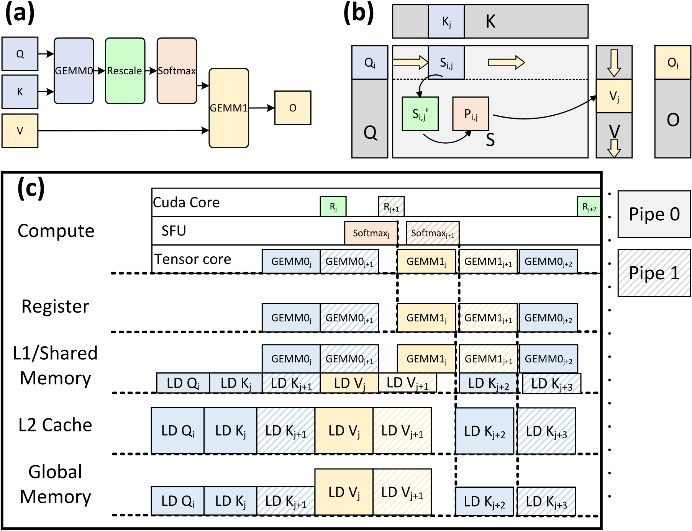

**图 1.** H100 上的 FlashAttention-3: (a) 横跨 Tensor Core, CUDA core 和 SFU 的 10 余种异构操作; (b) 它们的数据依赖 DAG; (c) 调度顺序如何决定计算-内存 pipeline 重叠.

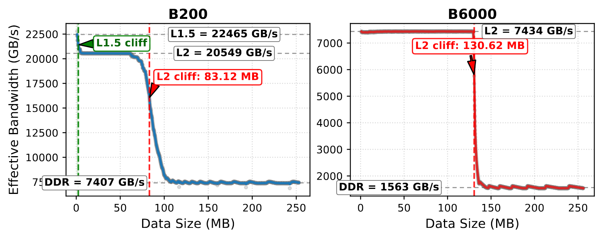

**图 2.** B200 和 B6000 上的 L2 带宽与工作集大小关系, 揭示了多级 cache 层次结构. B200 (双 die) 在约 ${\sim}22.5$ TB/s 处呈现 level-1.5 (L1.5)/LRC 层, 并在约 ${\sim}83$ MB 处呈现平缓的 L2 cliff; B6000 (单 die) 则在约 ${\sim}130$ MB 处出现陡峭 cliff. TileSight 使用这些 sweep 校准每种 GPU 的有效 cache 容量.

现有 GPU 性能工具可分为三类. **学习式和混合式预测器** [Lee25, Zha26p] 使用每种架构的 trace 拟合端到端运行时间或分析模型残差, 它们主张纯分析模型无法捕获现代 GPU 交互的复杂性; 但两者都需要重新训练, 且可解释性有限. **分析模型** [Wil09, Par19, Zhe23] 具有可移植性和可解释性, 但通常把 GPU 执行压缩为聚合的计算与带宽项. **Profiling 和仿真工具** [Gua25, Hua25, Agr24, Wan25s] 展示执行后的实测行为, 却无法在重新运行 kernel 之前预测 tile shape, pipeline 深度或 swizzle 变化将产生怎样的性能. 如第 1 节所述, 它们的共同局限是抽象错位: 这些工具没有以现代 GPU 程序所采用的 tile 粒度对性能建模. 特别是, 混合式预测器把这种复杂性委托给学习组件, 而 TileSight 表明, 以 tile 为中心的第一性原理仿真可以在保持完全白盒的同时捕获它.

### 2.2 以 Tile 为中心的程序所面临的建模缺口

缺失的抽象体现在三个层级. **Tile 内**: 每个 tile 使用横跨计算, 内存和网络的异构 pipeline, 因而单一瓶颈标量会遗漏决定重叠的 per-pipeline 结构 ([图 1](#figure-01)). **Tile 间**: tile 依赖决定融合 body 内合法的 action 顺序, tile 在 grid 上的执行顺序决定 cache 复用; 对现代 GPU 而言, 单一的平坦带宽数值并不充分 ([图 2](#figure-02)). **跨设备**: 被划分的 tile grid 通过通信 pipeline 交换数据, 这些通信必须与计算重叠, 而不是作为独立时间简单相加. [表 1](#table-01) 总结了现有工具如何遗漏其中一个或多个层级.

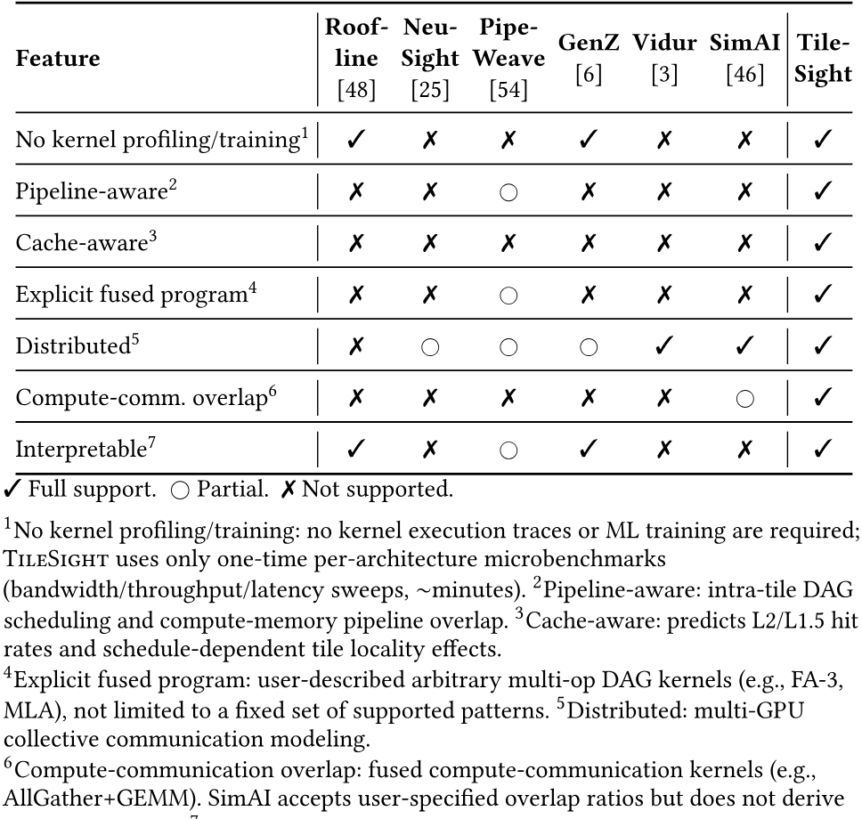

**表 1.** 与已有性能建模工具的比较. ✓ 完全支持. ○ 部分支持. ✗ 不支持. ¹无需 kernel profiling/training: 不需要 kernel 执行 trace 或 ML 训练; TileSight 仅使用每种架构一次性的 microbenchmark (带宽/吞吐量/延迟 sweep, 约数分钟). ²Pipeline-aware: tile 内 DAG 调度和计算-内存 pipeline 重叠. ³Cache-aware: 预测 L2/L1.5 命中率以及与调度有关的 tile locality 效应. ⁴显式融合程序: 由用户描述的任意多操作 DAG kernel (例如 FA-3, MLA), 不局限于一组固定的受支持模式. ⁵分布式: 多 GPU collective communication 建模. ⁶计算-通信重叠: 融合的计算-通信 kernel (例如 AllGather+GEMM). SimAI 接受用户指定的重叠比例, 但不会以分析方式推导它们. ⁷可解释: 支持瓶颈诊断的白盒模型.

## 3 分层 Tile-Pipeline 模型

TileSight 将 *tile* 视为一等建模单元, 并采用 prologue-steady-epilogue pipeline envelope, 在程序的每一层递归应用. Tile 携带 *tile 内*信息 (操作, src/dst placement, footprint, 以及它在每条可独立调度的硬件 pipeline 上占用的资源), 同时参与 *tile 间*关系 (producer-consumer 依赖, 并发 issue, 以及跨循环, tile grid 和 wave 的执行顺序). 因而 tiled 工作负载就是一个 *tile execution plan*: 一个由 tile 构成并以这两类信息注解的图. 分布式执行共享同一种基于 tile 的抽象: source 或 destination 跨越设备的 tile 只需在其资源向量中增加一个 `Net` 项, 同一个 envelope 仍然适用.

### 3.1 从工作负载到 Tile Execution Plan

TileSight 的输入是高层工作负载, 如 tiled GEMM, 融合 attention kernel, all-gather 后接 GEMM, 或跨 GPU 的 Mixture-of-Experts (MoE) routing; 工作负载确定张量及其 placement, 但不指定调度. TileSight 将其提升为 tile execution plan, 暴露性能建模所需的与调度相关的选择: tile shape, 循环与 reduction 顺序, block swizzle, software-pipeline 深度, 每个 SM 的 resident block 数量, 分布式划分和 collective 实现. Triton 和 TileLang 等以 tile 为中心的 DSL 直接公开大部分信息; 对手写 kernel, 则从 kernel 调度中手工提供相同字段.

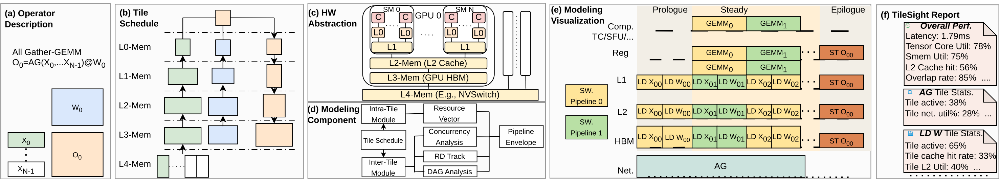

**图 3.** All-gather-GEMM (AG-GEMM) 上的 **TileSight 设计概览**. **(a)** 工作负载仅由算子和张量 placement 描述 ($X$ 在 $N$ 个 GPU 上按列分片). **(b)** TileSight 将其提升为 DAG 横跨内存层级 $L_0$-$L_4$ 的 tile 调度. **(c)** 单一硬件抽象把 register, SMEM, L2, HBM 和 GPU 间 fabric 表示为 5 级层次结构. **(d)** Tile 内资源向量与 tile 间 DAG/并发分析共同输入递归的 prologue-steady-epilogue envelope. **(e)** 引擎把 envelope 呈现为 timeline: software-pipelined load 与计算重叠, 而 AllGather 是在 `Net` lane 上*根据 placement 推断*的. **(f)** 包含延迟, 利用率, cache 命中率和重叠率的每 tile 性能报告.

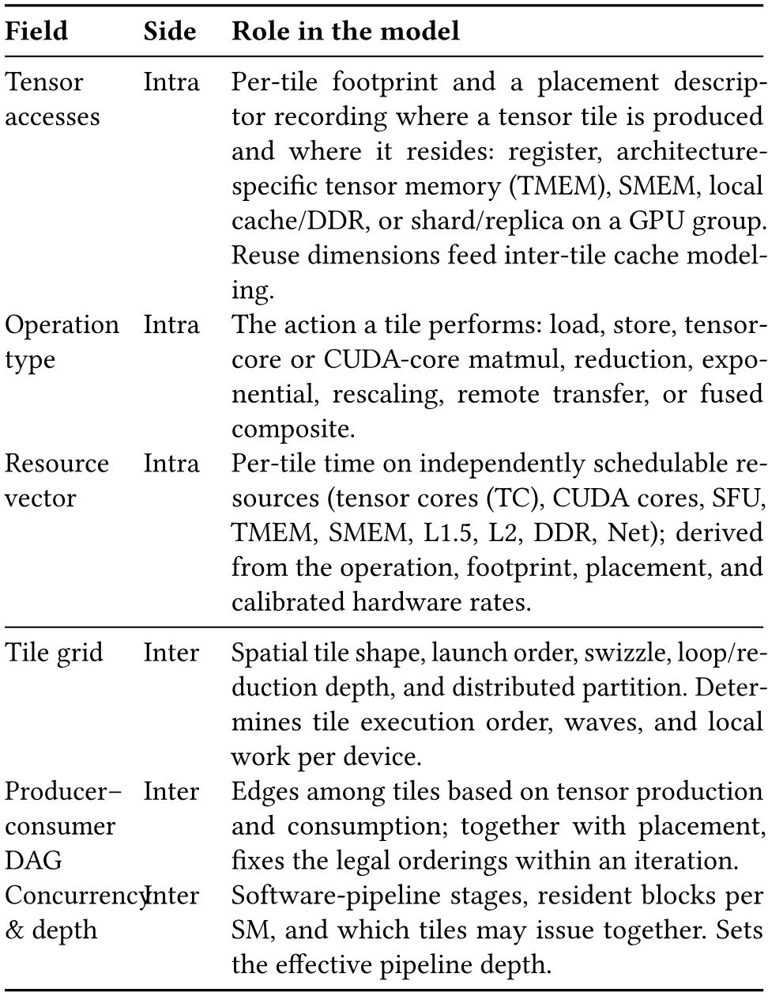

**表 2.** Tile execution plan 按字段描述的是孤立的单个 tile (tile 内) 还是 tile 之间的关系 (tile 间) 对字段分组.

该 plan 有意避开 thread 级细节. 它只保留 tile 程序员和分布式 runtime 实际会改变的选择, 而这些选择会改变哪些 tile 进入 pipeline, 它们占用何种资源, 以及它们如何彼此依赖或并发运行. Cache 流量, wave 效应, 通信阶段和 pipeline 重叠随后由此推导, 而不是单独附加.

### 3.2 Tile 内: Tile 及其资源向量

一个 tile 由其*操作* (load, store, tensor-core 或 CUDA-core matmul, reduction, exponential, rescaling, remote transfer 或 fused composite), *footprint* (每 tile byte 和 FLOP), 以及记录输入在何处产生和输出位于何处的 *src*/*dst placement descriptor* 表征—可以是 register, 架构特定 tensor memory (TMEM), shared-memory scratchpad, L1.5 或 L2 cache, 本地设备上的 DDR, 或 GPU group 上的 shard/replica. Placement 是让同一种 tile 内表示同时描述融合与跨设备移动的核心抽象: 把中间输出标记为 register, TMEM 或 SMEM scope 会移除 global-memory store (融合), 而把 load source 标记为 remote shard 会将 load 变成跨设备 transfer (分布式).

对于每个 tile, TileSight 将这些属性转换为可独立调度的硬件资源上的时间向量:

$$
\mathbf{u}(o)=
\langle t_{\mathrm{TC}}, t_{\mathrm{CUDA}}, t_{\mathrm{SFU}}, t_{\mathrm{TMEM}},
t_{\mathrm{SMEM}}, t_{\mathrm{L1.5}}, t_{\mathrm{L2}}, t_{\mathrm{DDR}}, t_{\mathrm{Net}}\rangle .
\tag{1}
$$

该向量根据 tile 的操作, footprint, src/dst placement 和通过一次性 microbenchmark 校准的速率计算. 纯 tensor-core matmul tile 只填充 TC 项; Blackwell attention tile 还会为 softmax 和 correction load/store 计入显式 TMEM 流量; 来自 DDR 的 load tile 填充 DDR 项 (若访问命中 cache, 也填充 L1.5/L2); remote-load tile 填充 Net 项. 该向量比 Roofline 标量更富表现力, 因为位于不同 pipeline 上的 tile 可以重叠, 而竞争同一 pipeline 的 tile 会串行化, 远程移动也能通过同一套机制与本地计算组合. $\mathbf{u}(o)$ 的两个项并非由孤立的 tile 固定: memory tile 的 L1.5/L2/DDR 划分取决于访问是否命中 cache, 由第 3.5 节的 tile 复用距离推导; remote tile 的 `Net` 项取决于底层通信阶段的路由代价, 由第 3.6 节推导. 算法 1 概述了所有组件如何接入主循环; 后续小节将详细说明每个部分.

**算法 1: 分层 Tile-Pipeline 评估.**

- **输入:** tile execution plan $P$, 硬件规格 $H$, 可选的分布式映射 $\Pi$.
- **输出:** 预测延迟 $T$ 与每资源利用率.
- $G \leftarrow P$ 中的 tile grid, launch order 和 swizzle.
- $A \leftarrow P$ 中的 tensor access, 复用维度和 placement descriptor.
- $D \leftarrow P$ 中的 tile-action DAG.
- $S \leftarrow P$ 中的 software-pipeline 参数.
- **如果** $\Pi$ 非空:
  - $G,A,D \leftarrow \mathrm{PartitionTilePlan}(G,A,D,\Pi)$; 单设备是仅本地的情形.
  - $\mathcal{O}_{\mathrm{net}} \leftarrow \mathrm{InferRemoteTensorAccesses}(G,A,D,\Pi)$.
  - $\mathcal{N} \leftarrow H$ 中的网络拓扑以及校准后的 $\alpha,\beta$ 参数.
  - **对于每个**远程张量访问序列 $c \in \mathcal{O}_{\mathrm{net}}$:
    - $\mathcal{K}_c \leftarrow \mathrm{DecomposeIntoStages}(c)$; 例如 ring step 或 tree level.
    - **对于每个**阶段 $k \in \mathcal{K}_c$:
      - $\mathcal{E}_k \leftarrow \mathrm{LogicalExchanges}(k)$; tuple $(\mathrm{src},\mathrm{dst},\mathrm{bytes})$.
      - $\mathcal{R}_k \leftarrow \mathrm{Route}(\mathcal{E}_k,\mathcal{N})$.
      - $T_k,U_k \leftarrow \mathrm{AlphaBetaStageTime}(\mathcal{R}_k,\mathcal{N})$.
    - 用 `Net` 上的 $\sum_k T_k$ 注解 $D$ 中相应的 transfer tile.
- $C \leftarrow \mathrm{CacheTraffic}(G,A,H)$.
- 用 $C$ 中的 L1.5/L2/DDR 项注解 $D$ 中的 memory tile.
- $p \leftarrow \mathrm{ResidentTilesPerSM}(P,H)$.
- $d \leftarrow S.\mathrm{stages}\times p-1$.
- $\mathcal{E}_{\mathrm{tile}} \leftarrow \mathrm{PipelineEnvelope}(D,d,H,\mathrm{active\ SMs})$.
- $T,U \leftarrow \mathrm{WaveAggregate}(G,\mathcal{E}_{\mathrm{tile}},H)$.
- **返回** $T,U$.

### 3.3 Tile 间: 依赖, 并发与顺序

Tile 通过三类 tile 间信息连接. *1)* *Producer-consumer 依赖*确定单次迭代内的合法顺序: 在 FlashAttention 中, $Q$/$K$ load 先于 gemm1 ($Q\!@\!K$), gemm1 先于 softmax, 而 softmax 先于 gemm2 ($P\!@\!V$). 它与 placement 和依赖共同决定哪些中间结果保留在 register/TMEM/SMEM 中, 哪些 spill 到 global memory. *2)* *并发 issue* 允许资源向量不发生争用的无依赖 tile 一起运行, 例如一边 load attention 的下一个 $K$-block, 一边计算当前 block, 或沿同一个 $K$ slice 同时 issue GEMM 的 A 和 B load. 同一组 tile 可以采用多种合法顺序, 在共享 pipeline 上产生不同的重叠. *3)* 跨循环迭代和 tile grid 的 *tile 执行顺序*决定哪些 load 能在 cache 中找到已驻留的数据: row-panel traversal 为相邻 $M$-row 保留 B-tile 复用, block swizzle 重新排列序列, persistent-block 调度则把 tile 固定在 SM 上. 这三部分正是 pipeline envelope 所需的输入.

### 3.4 Pipeline Envelope: Prologue-Steady-Epilogue

给定一组带资源向量和 tile 间关系的 tile, TileSight 将执行评估为 pipeline. 对于具有 $N$ 次逻辑迭代和有效深度 $d$ 的重复单元:

$$
T =
T_{\mathrm{pro}} +
\max(N-d,0)\,T_{\mathrm{steady}} +
T_{\mathrm{epi}},
\tag{2}
$$

其中 $T_{\mathrm{pro}}$ 是填充代价, $T_{\mathrm{steady}}$ 是每个重复单元的重叠代价, $T_{\mathrm{epi}}$ 是排空代价. 同一个 envelope 递归应用于 tile execution plan 的每一层: 外层 envelope (遍历 tile-block wave) 的 steady-state body 本身可以是 pipeline (遍历 $K$-loop), 后者的 steady body 又可以是遍历内部 action 序列的 pipeline. 有效深度将显式 software-pipeline stage 与 resident tile 交错结合起来:

$$
d = \mathrm{stages} \times \mathrm{resident\_tiles\_per\_SM} - 1 .
\tag{3}
$$

因此, 每个 SM 两个 block 的调度不是特殊情形: 它会加深 pipeline, 因为一个 SM 可以在一个 resident tile-block 等待内存时 issue 另一个的工作.

**Steady-state 重叠.** Tile 序列的 steady-state 代价取决于选择哪种合法顺序, 因为使用式 1 中同一硬件维度的 tile 会在该维度累积, 而独立维度可以重叠:

$$
T_{\mathrm{steady}}(\sigma)
=
\max_{r}
\sum_{o \in \sigma} u_r(o),
\tag{4}
$$

并受 DAG 中所有数据依赖 edge 约束. 选择的 steady state 是最佳合法顺序:

$$
T_{\mathrm{steady}} =
\min_{\sigma \in \mathrm{Topo}(D)} T_{\mathrm{steady}}(\sigma).
\tag{5}
$$

实践中的搜索规模很小, 因为真实融合 kernel DAG 受到很强约束. 对 MLA decode, 11 个 tile action 从 $11!$ 个无约束排列缩减为 132 个合法拓扑顺序. 该搜索并非 autotuning run: 它是对 tile plan 的分析调度步骤, 因而仍足够廉价, 可以在 cost model 内运行.

**边界代价.** Prologue 和 epilogue 使用相同的资源向量计算, 但重叠较少. 对 load-compute pipeline, prologue 主要由填充 pipeline 的 memory tile 构成, epilogue 则由剩余计算和最终 store 构成. 融合 tile body 会向一个或两个边界添加 reduction 或 normalization. 这种区分十分重要, 因为在循环次数很少或只 launch 少量 wave 时, 即便两种调度具有相同的 steady-state 瓶颈, 端到端时间也可能不同.

**Resident tile 与 wave.** Occupancy 改变的不仅是利用率, 还会改变重叠结构. 若一个 SM 上驻留 $p$ 个 tile-block, 模型把它们视为同一 tile pipeline 的交错实例; resident 数量受 shared memory, register, warp 限制以及架构特定的每 SM 最大 block 数约束. 同一种 wave decomposition 也处理 tail 效应: tail wave 可能只使用一部分 SM, 这些 active SM 会获得更大的共享 L2/DDR 带宽份额, 因而会使用其 active-SM 数量重新计算 envelope. 算法 2 展开了这一评估, 递归遍历 tile loop 结构并枚举符合依赖的顺序.

**算法 2: 递归 Pipeline-Envelope 评估.**

- **函数** $\mathrm{OverlapAnalysis}(P,H)$:
  - $p \gets \mathrm{ResidentTilesPerSM}(P,H)$.
  - $(n_{\mathrm{full}}, n_{\mathrm{tail}}) \gets \mathrm{WaveDecompose}(P.\mathrm{grid}, H.\mathrm{SMs}, p)$.
  - $(T^{\mathrm{full}}, U^{\mathrm{full}}) \gets \mathrm{AnalyzeLoop}(P.\mathrm{root}, p, H.\mathrm{SMs})$.
  - **如果** $n_{\mathrm{tail}} > 0$:
    - $(T^{\mathrm{tail}}, U^{\mathrm{tail}}) \gets \mathrm{AnalyzeLoop}(P.\mathrm{root}, p, n_{\mathrm{tail}})$.
  - **否则:**
    - $T^{\mathrm{tail}} \gets 0,\ U^{\mathrm{tail}} \gets \emptyset$.
  - **返回** $n_{\mathrm{full}}T^{\mathrm{full}} + T^{\mathrm{tail}},\ \mathrm{MergeMetrics}(U^{\mathrm{full}},U^{\mathrm{tail}})$.
- **函数** $\mathrm{AnalyzeLoop}(\mathrm{node}, \mathrm{stage}, \mathrm{active\_SMs})$:
  - $\mathrm{groups} \gets \mathrm{GetSubNodes}(\mathrm{node})$.
  - **如果** $\mathrm{node}$ 是 inner loop:
    - $s \gets \mathrm{GetPipelineStage}(\mathrm{node})$.
    - $d \gets s \times \mathrm{stage} - 1$; software stage $\times$ resident tile.
    - **返回** $\mathrm{ModelOverlap}(\mathrm{groups},d,\mathrm{active\_SMs})$.
  - $\mathrm{metrics} \gets [\,]$.
  - **对于每个** $g \in \mathrm{groups}$:
    - **如果** $g$ 是 loop:
      - $\mathrm{metrics.append}($ $\mathrm{AnalyzeLoop}(g,\mathrm{stage},\mathrm{active\_SMs}))$.
    - **否则:**
      - $\mathrm{metrics.append}($ $\mathrm{ModelOverlap}([g],\mathrm{stage}-1,\mathrm{active\_SMs}))$.
  - **返回** $\mathrm{MergeMetrics}(\mathrm{metrics})$.
- **函数** $\mathrm{ModelOverlap}(\mathrm{groups},d,\mathrm{active\_SMs})$:
  - $N \gets \mathrm{groups}$ 表示的重复迭代次数.
  - $\mathrm{best} \gets \infty$.
  - **对于每个** $\sigma \in \mathrm{Topo}(\mathrm{groups})$:
    - $\mathbf{u}_{\sigma} \gets$ 顺序 $\sigma$ 和 $\mathrm{active\_SMs}$ 下的资源向量累积.
    - $T_{\mathrm{pro}},T_{\mathrm{steady}},T_{\mathrm{epi}} \gets$ 根据 $\mathbf{u}_{\sigma}$ 得到的边界与 steady 代价.
    - $T \gets T_{\mathrm{pro}}+\max(N-d,0)T_{\mathrm{steady}}+T_{\mathrm{epi}}$.
    - **如果** $T < \mathrm{best}$: $\mathrm{best} \gets T$.
  - **返回** $\mathrm{best}$ 及相应利用率.

### 3.5 通过 Tile 复用距离计算 Cache 流量

对于 memory tile, L1.5/L2/DDR 的划分并不是 tile 自身的孤立属性: 同一个 load-tile 坐标可能命中 cache, 也可能落到 DDR, 这取决于 swizzle, wave occupancy, 以及哪些相邻 tile 共享张量数据. 在 GEMM 的 $M$ 轴 tile 之间保留 B-tile 复用可将 DDR 流量减少约 ${\sim}4\times$, 而在我们的动机示例中, block swizzling 将 L2 命中率从 35% 改变到 72%; 现代 GPU 还增加了中间 L1.5/LRC 层 (H200, B200), 因而单一的平坦带宽项并不充分. 复用距离分析已广泛用于 cache 建模 [Lam91], [Con98], [Nug14], [Ara19], [Ara20], [Niu12], 但传统形式作用于 cache-line trace, 粒度太低, 无法放入分析式调度搜索. TileSight 转而将复用距离提升到 tile execution plan: 把符号化 tile 顺序作为待分析序列, 把 tile 大小的张量 block 作为复用全集—据我们所知, 这是首个通过 tile 粒度复用距离抽象, 使对调度敏感的多级 cache 建模在分析式 GPU 性能模型中切实可行的方法.

#### 3.5.1 Tensor Access 与 Tile 复用距离

TileSight 为 tile grid 关联的每个张量引入一个 *tensor access*: 包含每 tile footprint, placement descriptor, 重复访问次数, 以及复用同一 data block 的 grid 维度. 复用维度 `reuse_dims` 使一条规则覆盖多种算子: 张量的复用 key 是 tile 坐标在非复用维度上的投影. 对 GEMM grid $(M_t,N_t)$, A tile 沿 $N_t$ 复用, B tile 沿 $M_t$ 复用. 对 MLA decode, key-value (KV)-cache tile 在同一 batch element 的 attention head 之间复用. 对 convolution, weight 和 activation 在 batch, output-channel 与 spatial axis 上具有不同的复用维度. 这样既避免了算子特定的 cache 公式, 又保留了决定复用的调度信息.

*Tile 复用距离* $D_T$ 是连续两次访问同一个 tensor block 之间所访问的不同 tile 大小 data block 的数量. 传统复用距离询问两次访问之间经过了多少 cache line 或 memory transaction, tile 复用距离则以 GPU kernel 调度所暴露的单元提出相同问题. 使用 8 KB tile 而非 128-byte cache line 建模, 可将跟踪的 entry 数量减少 $64\times$, 与以 tile 为中心的调度所暴露的粒度一致, 让 block swizzle 和 traversal order 直接呈现在 cache 模型中, 并避免 trace 级 cache 仿真.

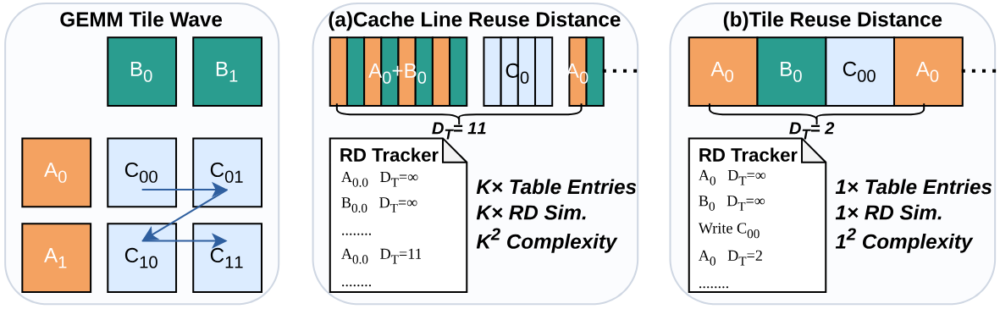

对于具有 `reuse_dims` 的张量, TileSight 根据 tile 的非复用坐标计算复用 key:

$$
\mathrm{key}(\mathbf{x}, R)=\mathrm{Linearize}\bigl(x_d\mid d\notin R\bigr),
\tag{6}
$$

其中 $\mathbf{x}$ 是 tile 坐标, $R$ 是复用维度集合. 对 GEMM 的 A 矩阵, $R=\{N_t\}$, 同一 M-row 中的所有 tile 共享同一个 A key. 对 B, 同一 N-column 中的所有 tile 共享同一个 B key. 具体的 tile 执行顺序, 包括 swizzle 和 row-panel traversal, 决定这些 key 出现的序列, 从而决定其复用距离.

#### 3.5.2 命中概率与快速评估

给定复用距离 $D_T$, associativity $A$, 以及以 tile 为单位的 cache 容量 $B_T$, stochastic distance cache model 会估计类似 least-recently-used (LRU) 的 cache 的命中概率. 精确 SDCM 命中概率可表示为二项式形式:

$$
P(h \mid D_T) =
\sum_{a=0}^{A-1}
\binom{D_T}{a}
\left(\frac{A}{B_T}\right)^a
\left(\frac{B_T-A}{B_T}\right)^{D_T-a},
\tag{7}
$$

其中 $A$ 是 cache associativity, $B_T$ 是以 tile 为单位的 cache 容量. 该二项式形式虽然准确, 但对大型 tile grid 中的每个 tensor key 计算会很昂贵.

因此, TileSight 采用 Gaussian 近似进行高效评估:

$$
P(h \mid D_T)_{\mathrm{approx}}
=
1 - Q\!\left(
\frac{|A-1-\mu|}{\sqrt{\sigma^2}}
\right),
\tag{8}
$$

其中

$$
\mu = D_T \cdot \frac{A}{B_T},
\qquad
\sigma^2 =
D_T \cdot \frac{A}{B_T}
\cdot
\left(1-\frac{A}{B_T}\right).
\tag{9}
$$

$Q(x)$ 表示标准正态分布的互补累积分布函数 (CDF). 为进一步降低开销, 我们对 CDF $\Phi(x)$ 使用 Zelen-Severo 近似 [Abr65]:

$$
\Phi(x)
\approx
1 -
\left(a_1t-a_2t^2+a_3t^3\right)
\frac{e^{-x^2/2}}{\sqrt{2\pi}},
\tag{10}
$$

其中 $t=(1+0.33267x)^{-1}$, $a_1,a_2,a_3$ 为常数.

**沿 reduction axis 采样.** Tile execution plan 暴露 reduction axis (例如 GEMM 中的 $K$ 轴). TileSight 以这一粒度采样复用事件, 而不是重放每个 inner-loop 访问 (对 $K{=}8192$, $\mathrm{tile}_K{=}32$ 的 GEMM, 检查次数减少 $256\times$, 而准确度损失可忽略). 结合 tile 级复用距离和 Gaussian 近似, 这使 cache 模型评估减少约五个数量级, 从而能够在分析循环内部进行 cache 建模, 而不必作为离线 trace 分析.

#### 3.5.3 两级级联, Swizzle 与 Wave

在具有中间 L1.5/LRC 层的 GPU 上, TileSight 以级联方式应用 SDCM—每个物理 SM group 内使用 L1.5, 全局使用 L2, DDR 承载剩余 miss 流量; 若无此设计, L1.5 命中概率为零, 模型退化为单次 L2 评估. Block swizzle, row-panel, Z-order 或 persistent-block 调度都只是输入复用距离仿真的具体 tile 坐标序列. 在一个 wave 内, TileSight 会针对硬件非确定性, 顺序 tensor load 和跨张量 cache aging 扰动 $D_T$; 所有因素都由 tile execution plan 与硬件分组推导, 不需要 kernel 特定的 profiling. Tail wave 使用部分 SM, 因而获得更大的共享带宽份额, 所以会为 tail 重新计算 envelope. 得到的 L1.5/L2/DDR byte 数填入式 1 的相应项, 因而 cache 行为会改变 pipeline envelope 本身, 而不只改变最终延迟.

### 3.6 跨设备 Tile

跨设备执行是同一 tile 内抽象的 placement 扩展: tile 的 source 或 destination 可以指向另一 GPU 上的 shard 或 replica, 其资源向量会增加一个非零 `Net` 项. Tensor, expert, sequence 或 data-parallel mapping 会同时划分 tile grid 及其 tensor tile, 产生覆盖 GPU group 的 placement descriptor. 划分后, 本地 tile wave 可能需要由另一设备产生的 tensor tile, replicated activation, 或必须在后续 tile 消费前 reduce 的 partial result. TileSight 将这些视为*远程张量访问*: 所需 collective 或 point-to-point transfer 直接从 producer-consumer placement 推断, 每一个都成为带有 source/destination device, byte volume 和 `Net` 资源使用的 tile.

**逻辑交换与拓扑.** 对每个推断出的远程张量访问, TileSight 将所需 tensor-tile 移动分解为有序阶段. 一个阶段由逻辑 source-destination exchange $(s,d,b)$ 表示, 其中 $s$ 是拥有或产生 tensor tile 的设备, $d$ 表示其 tile wave 消费该 tile 的设备, $b$ 表示从 tensor access 推导出的 tile 或 shard byte volume. Collective algorithm 只需给出不同的阶段分解: ring all-reduce 使用 reduce-scatter 和 all-gather step, tree algorithm 使用 reduction 和 broadcast level, irregular routing 仍为 point-to-point. 这种表示是 tile 级而非 packet 级. 它保留推理通信量所需的 tensor-placement 信息, 同时让硬件拓扑决定每次交换由哪些物理 network-on-chip (NoC) 或 interconnect link 承载.

**每阶段路由代价.** 对一个阶段中的 exchange 路由后, TileSight 使用 $\alpha$-$\beta$ 通信模型 [Tha05] 估计阶段时间, 该模型对应 hop latency 与 bottleneck-link serialization 的分解:

$$
T_k
=
\underbrace{
\max_{(s,d,b)\in\mathcal{E}_k}
\sum_{l\in\mathcal{P}_{sd}} \alpha_l
}_{\mathrm{routed\ hop\ latency}}
+
\underbrace{
\max_{l\in\mathcal{L}} \beta_l B_{l,k}
}_{\mathrm{bottleneck\ link\ serialization}},
\tag{11}
$$

其中 $\mathcal{E}_k$ 是阶段 $k$ 中的逻辑 exchange 集合, $\mathcal{P}_{sd}$ 是 $(s,d,b)$ 的物理 route, $B_{l,k}$ 是通过 link $l$ 路由的 byte 数, $\alpha_l,\beta_l$ 分别是 link $l$ 经校准的启动延迟和带宽倒数. 一个推断通信序列的代价是其阶段的有序总和 $T_c=\sum_{k\in\mathcal{K}_c}T_k$. 对 ring collective 等具有重复相同阶段的算法, TileSight 评估一个阶段并乘以阶段数. 结果进入式 1 的 `Net` 维度, 因而跨设备移动被表示为 tile 内资源需求, 并通过与其他部分相同的 steady-state 机制与本地计算重叠.

### 3.7 组合各部分

有了上述组件, 算法 1 的完整含义便清晰起来: cache 分析 (第 3.5 节) 根据 tile 间执行顺序填充 $\mathbf{u}(o)$ 的 L1.5/L2/DDR 项; 远程张量访问 (第 3.6 节) 根据路由 $\alpha$-$\beta$ 阶段代价填充 `Net` 项; envelope (第 3.4 节) 随后消费完整的资源向量和依赖/并发 edge (第 3.3 节), 并递归应用于 nested loop, wave 和 network stage. 这些都不是事后修正—每一部分要么填充, 要么消费在 envelope 中流动的同一个每 tile 资源向量.

### 3.8 可移植硬件抽象

TileSight 只需要影响 tile execution plan 及其 placement descriptor 的参数. 该抽象对应 tensor-placement 层次结构: 本地 placement 映射到 register/TMEM/SMEM/cache/DDR 资源, 远程 placement 映射到跨 GPU 和节点的已校准网络层次结构 ([表 3](#table-03)). 数值来自厂商规格, 以及用于实际带宽, 利用率上限和网络参数的轻量级 microbenchmark.

**表 3: 本文所评估 GPU 架构的硬件规格: 理论峰值 (spec) / microbenchmark 校准值 (meas.).**

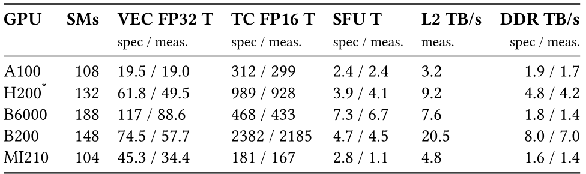

*注*: TileSight 的硬件抽象还包括 cache 层次结构, 架构特定的 TMEM 带宽, SMEM/occupancy 限制, 以及跨 GPU group 的网络层次结构. 为简洁起见, 此处未列出. \*H200 的最大时钟为 1980 MHz, 默认时钟为 1830 MHz.

TileSight 不对 warp 级 instruction issue, compiler register allocation, instruction 粒度的硬件调度或 packet 级网络效应建模. 相反, 它对 tile 级程序员和分布式 runtime 所控制且调度可见的效应建模: tile shape, tensor placement, 复用模式, swizzle 顺序, pipeline 深度, 每个 SM 的 resident block, 分布式划分, collective algorithm 和 topology-aware routing. 正因如此, 该模型既能跨 GPU 世代移植, 又足够快速, 可以用于 schedule search.

## 4 实现

TileSight 使用 Python 实现 (约 6K 行), 支持 NVIDIA 和 AMD GPU. 用户将 kernel 描述为基于 tile 的程序, 可以从 Triton 或 TileLang 代码提取, 也可以为非 DSL kernel 手工编写; TileSight 无需运行 kernel 即可生成完整性能分解.

**描述任意融合程序.** 为表示任意 kernel, TileSight 将每个 tile 内执行的操作描述为 tile-action DAG (第 3.1 节). 每个 tile action 都以 `HardwareUsage` 资源向量 (第 3.1 节) 和另外两个属性注解: (1) action 间的显式数据依赖; (2) *中间结果所在的 scratchpad memory level*: register file, shared memory, 或 Blackwell 上架构特定的 tensor memory (TMEM). Scratchpad 注解决定 action 间每次数据移动计入的带宽层级以及消耗的 on-chip 容量, 后者又会约束 occupancy. 数据依赖在 tile-action node 之间声明. TileSight 自动枚举所有符合这些依赖的合法拓扑顺序, 并选择最小化 tile 延迟的调度.

**Software pipeline 与 occupancy.** 对 pipelined kernel, 用户提供 pipeline 深度, 对应 Triton 中的 `num_stages` 或 TileLang 中的显式 stage 数. 给定 kernel 资源使用, 如每 tile shared memory 和 register 数量, TileSight 计算受资源约束的每 SM resident tile 数量最小值. 这决定有效 pipeline 深度和每 SM 带宽分配. TileSight 分别对 head wave 和 tail wave 建模: tail wave 的 active SM 较少, 因而每个 SM 获得更大的 L2 和 DDR 带宽份额, 这会反映在每 tile 延迟计算中.

**从单 GPU 到 cluster.** 在单 GPU 层面, 整个 tile grid 调度到一个设备上. 在节点层面, `DistributedTileMap` 将 grid 划分到多个 GPU, `NetworkHierarchy` 捕获包括 NVLink 或 PCIe 在内的节点内互连. TileSight 根据 message size 和 device count 选择 ring, recursive-doubling, Rabenseifner 等 collective algorithm. 对多节点 cluster, 相同的 `NetworkHierarchy` 扩展加入 InfiniBand 或 NVLink Bridge 等节点间 link. 用户可以通过提供任意 link 的每 hop 带宽和延迟指定自定义拓扑. 给定 `DistributedTileMap`, TileSight 从划分后的 tile grid 的 producer-consumer placement 推断所需远程张量访问, 将每个访问分解为 $(s,d,b)$ 逻辑 exchange 的有序阶段, 并在 `NetworkHierarchy` 上应用 $\alpha$-$\beta$ 阶段代价, 生成每 tile 的 `Net` 资源时间; 该时间与本地计算和内存一起流经同一个 pipeline envelope.

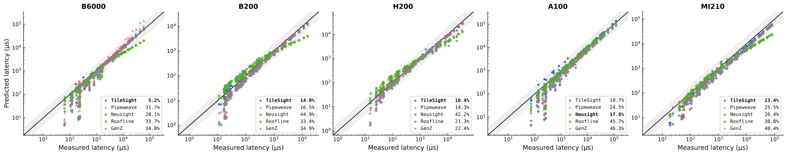

**表 4: H100 上 FlashAttention-3 建模与 NCU 的比较 (Qwen 配置: batch 1, 64 heads, head-dim 128). NCU 为 ground truth.**

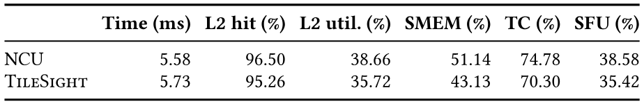

**组合与校准.** 建模链自底向上运行: cache 模型根据 tile 调度和复用距离计算 L1.5/L2/DDR 流量比例. 这些流量数据输入每 tile pipeline overlap 模型. Wave 模型将每 tile 结果聚合为每设备时间, 分布式模型则添加通信并计算重叠. Memory/TMEM 带宽, 每单元计算吞吐量和其他硬件参数通过小型 microbenchmark 对每种架构校准一次. 这包括[图 2](#figure-02) 所示的跨工作集大小带宽 sweep, 以及只需数秒的短矩阵乘 probe.

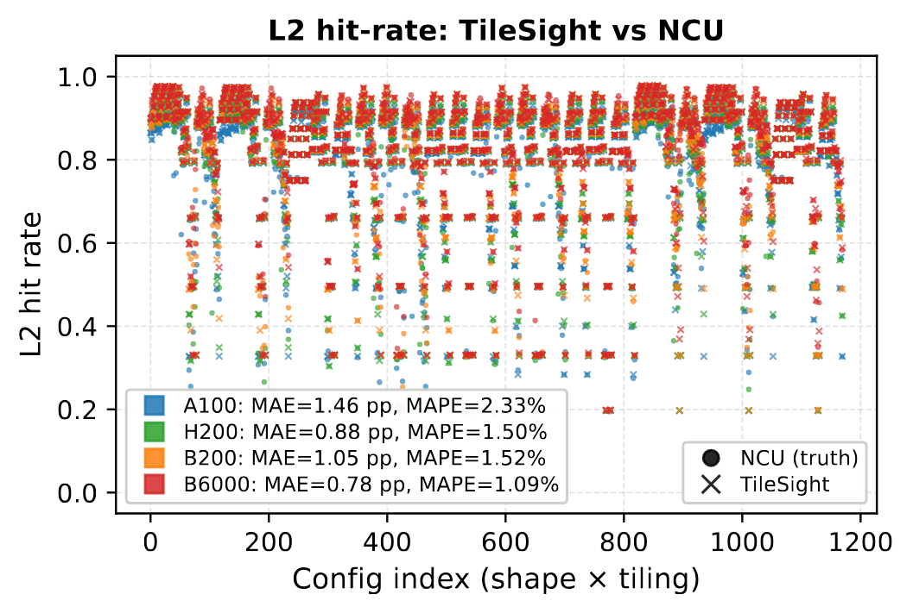

## 5 评估

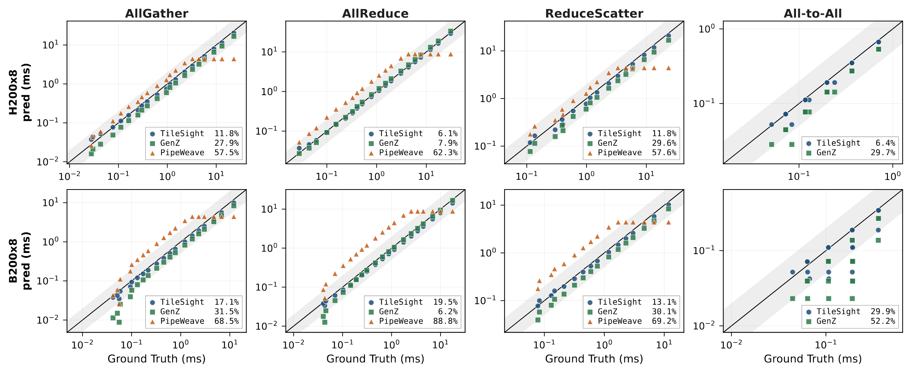

为了证明统一的 tile 级抽象可以在无需针对每个目标重新训练或 profiling 的情况下, 对单算子延迟, cache 行为, 分布式 kernel 和端到端 serving 建模, 我们从单 GPU kernel 到多 GPU LLM serving 评估 TileSight, 涵盖 A100, H200, B200, B6000, H200-NVL 和 B200 $\times 32$ 系统.

我们首先在第 5.1 节描述实验设置, 包括硬件和框架配置, 工作负载与 baseline. 随后在第 5.2 节使用单 GPU 算子验证核心 tile 级模型, 再在第 5.3 节深入分析 persistent kernel 的 L2 cache 预测. 第 5.4 和 5.5 节将评估扩展到分布式环境, 同时涵盖 collective/融合计算-通信 kernel 和端到端 vLLM serving. 最后, 第 5.6 节展示如何将 TileSight 用于性能诊断和由 cost model 引导的 schedule pruning.

### 5.1 实验设置

**硬件与框架.** 为确保广泛的硬件覆盖, 我们评估 A100 $\times 1$, H200-SXM $\times 8$, B200 $\times 8$, 通过 InfiniBand 连接的 B200 $\times 32$ cluster, B6000 $\times 2$ 和 H200-NVL $\times 8$ 系统, 涵盖 SXM, PCIe, NVLink4/5 和多节点环境. Hopper 和 Ampere 机器使用 CUDA 12.9, Blackwell 机器使用 CUDA 13.1. 我们还在 ROCm 6.2 上评估 AMD MI210 (CDNA2), 以覆盖不同厂商. GEMM 测量在 NVIDIA GPU 上使用 `cutlass_profiler`, 在 MI210 上使用 Composable Kernel (CK); 分布式 kernel 使用 Parallel Kittens [Sul25]; 端到端 serving 使用 vLLM 0.19.0.

**工作负载.** Kernel 级实验涵盖 BF16/FP16 GEMM, persistent-kernel cache sweep, collective 和融合计算-通信 kernel. 端到端 vLLM 实验包括 Qwen, Llama 和 DeepSeek 系列的 dense 与 MoE 模型, 范围从单 GPU serving 到最多 32 个 GPU 上的 tensor, expert 和 data-parallel serving. 我们总计评估 703 种 GEMM shape, 4,680 个用于 cache 建模的 persistent-kernel case, 以及 166 种 vLLM decode 配置.

**Baseline.** 对单算子预测, 我们与 Roofline [Wil09], NeuSight [Lee25][+1], PipeWeave [Zha26p] 和 GenZ [Bam24] 比较. NeuSight 使用来自六种 PipeWeave GPU (包括 A100) 的 BF16/FP16 GEMM 数据训练. PipeWeave 数据集覆盖 A100 和 Hopper-class 机器, 因而 PipeWeave 在这些架构上不是 zero-shot baseline. 对分布式 kernel 和端到端 serving, 我们与 PipeWeave 和 GenZ 比较. PipeWeave 的 collective 模型是每 GPU 的 random forest, 不提供可配置的 $\alpha$-$\beta$ 或拓扑参数; 在我们的目标中, A100 和 B6000 (RTX PRO 6000 Blackwell) 有原生 PipeWeave collective 数据集, 而 H200-NVL 和 B200 不受支持, 我们使用其 H800 数据集作为最接近的替代. 对端到端 serving, 我们向 PipeWeave 提供所需的厂商硬件规格.

[+1]: 原始 NeuSight 只在 FP32 GEMM 上训练; 为公平比较, 我们使用 PipeWeave 的 FP16 数据集重新训练它.

### 5.2 单算子预测准确度

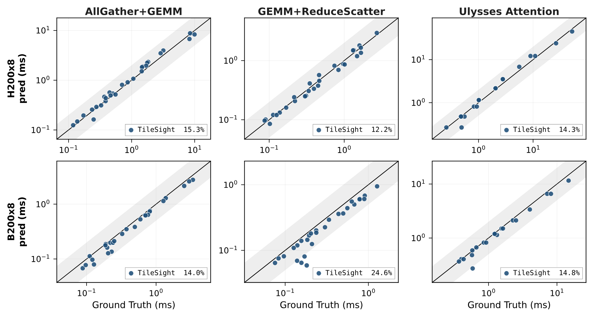

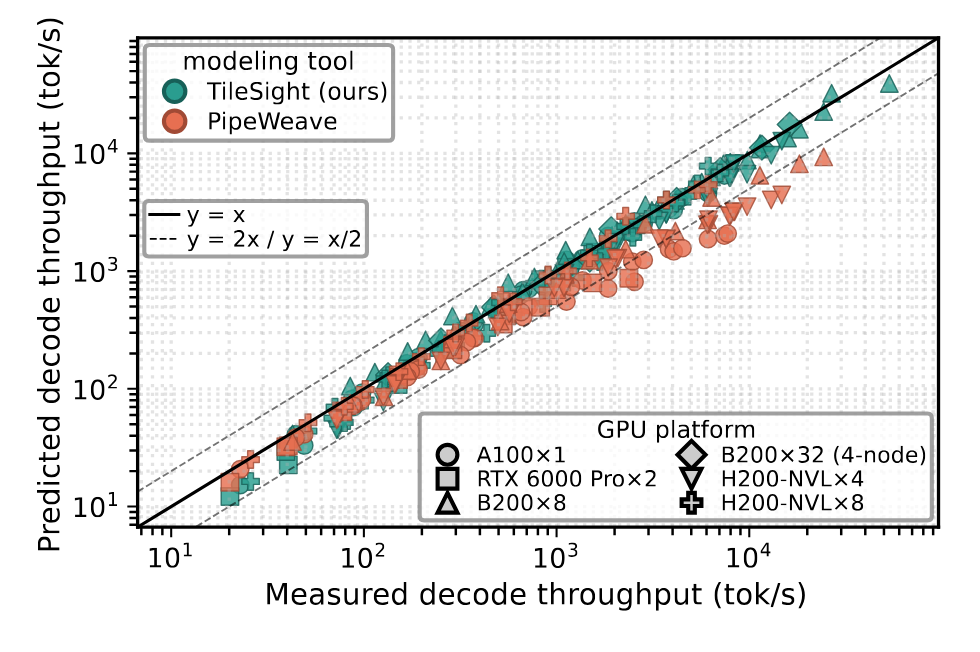

[图 5](#figure-05) 评估 A100, B200, B6000 和 H200 上 703 种 BF16/FP16 tensor-core GEMM shape, 以过滤 stream-K 和 single-instruction, multiple-thread (SIMT) fallback path 后的 `cutlass_profiler` 测量作为 ground truth. TileSight 达到 12.35% 的总体 MAPE, 而 PipeWeave 为 21.97%, 重新训练的 NeuSight 为 32.95%, Roofline 为 33.85%, GenZ 为 34.89%. TileSight 在较新的 B200, B6000 和 H200 目标上表现最佳. NeuSight 在 A100 上略微领先, 因为 A100 出现在其训练分布中; 但该优势不能迁移到较新的 GPU, 这说明了架构特定学习式预测器过拟合的风险. 在 MI210 上, 由于 CK 不像 `cutlass_profiler` 那样提供显式 rasterization (along-$M$/along-$N$) 或 swizzle 控制, TileSight 使用默认 cache 模式, 但仍以 23.4% MAPE 领先, 优于 PipeWeave (25.5%), NeuSight (26.4%), Roofline (38.8%) 和 GenZ (40.4%). 非 GEMM 融合算子将在下文的分布式与端到端工作负载中评估.

[表 4](#table-04) 将 TileSight 与融合 FA-3 kernel 上的 NCU 比较. 最终模型预测的延迟误差在 2.7% 以内, 并跟踪主要资源利用率组成, 为非 GEMM 融合执行上的 tile-pipeline 模型提供了简明 sanity check.

**表 5: TileSight 所诊断 kernel 的性能改进.**

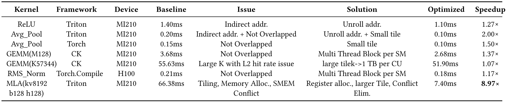

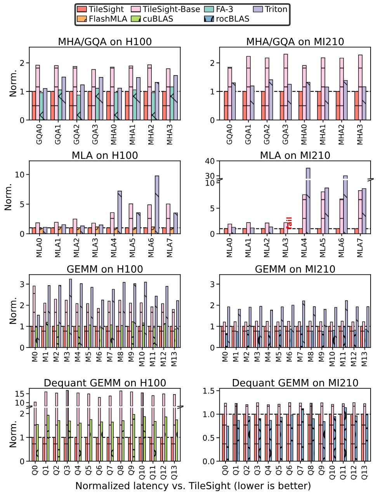

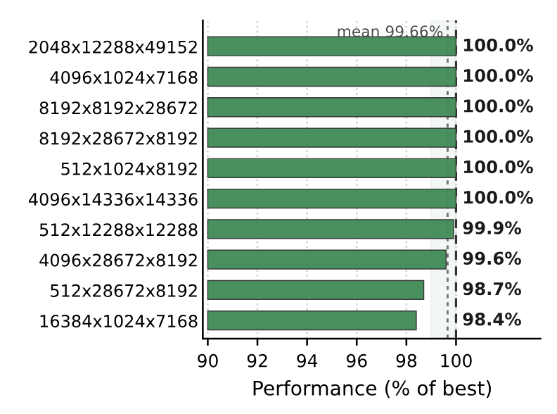

### 5.3 L2 Cache 预测准确度

[图 6](#figure-06) 在 4,680 个 GEMM persistent-kernel case 上, 将 tile 复用距离 cache 建模与 NCU 比较. 使用[图 2](#figure-02) 带宽 sweep 校准的有效 cache 容量后, 每个 GPU 上的平均 L2 命中率绝对误差都保持在约一个百分点: A100 为 1.46 pp, H200 为 0.88 pp, B200 为 1.05 pp, B6000 为 0.78 pp. 结果证明了 tile 复用距离 cache 建模的有效性.

**SM 间执行偏移的影响.** 复用距离模型假设 tile 以均匀速率推进, 但各 SM 会失去同步并同时处理不同的 $K$-slice, 使并发访问的 tile 分散到 L2 范围以外; 对 deep-$K$ GEMM, 这会使实测命中率低于 TileSight 的 lockstep 预测 (例如 H200 上 $M{=}N{=}8192$, $K{=}28672$ 的 GEMM: 预测 82%, 实测 43%). 这类配置很少, 因而聚合误差仍保持在约一个百分点, 但模型在该区域会系统性地偏乐观; 我们将在第 7 节再次讨论.

### 5.4 分布式验证

[图 7](#figure-07) 和[图 8](#figure-08) 在 H200 $\times 8$ 和 B200 $\times 8$ 上验证了 304 个分布式 case: 152 个纯 collective 和 152 个融合计算-通信 kernel. TileSight 提取逻辑 source-destination exchange, 在校准后的 NVLink 拓扑上路由, 并使用第 3.6 节的 $\alpha$-$\beta$ 模型评估每个阶段. 在纯 collective 上, TileSight 达到 12.22% wMAPE, 而 GenZ 为 20.82%, PipeWeave 在受支持的行上为 65.72%. PipeWeave 没有适用于这些 collective 且可原生配置的 H200/B200 backend, 只能回退到 H800 random-forest 模型, 因而无法反映我们机器中 NVLink4/5 的带宽差异. 对 B200 Ulysses Attention, 本地计算阶段使用与源码一致的 SM100 $128\!\times\!128$ FA4 tile pipeline, 包括 TMEM 流量, packed grid 和 sectioned LPT mapping, 并与四个 all-to-all 阶段组合. 在两个 baseline 都不支持的融合 kernel 上, TileSight 达到 14.83% wMAPE.

### 5.5 vLLM 端到端 Decode

[图 9](#figure-09) 和[图 10](#figure-10) 在 166 个健康配置上评估端到端 vLLM decode 吞吐量, 涵盖 dense, MoE, 单节点和多节点 serving. 所评估系统从 A100 $\times 1$ 和 B6000 $\times 2$ 到 B200 $\times 32$ 和 H200-NVL $\times 8$, 同时测试本地 tile 执行和路由后的分布式阶段. 总体上, TileSight 达到 13.52% wMAPE, 而带 B200 扩展的 PipeWeave 在 114/117 个 dense 配置上达到 31.84% wMAPE. PipeWeave 不支持 MoE. PipeWeave 对 A100 和 B6000 使用原生 collective 数据集, 对 H200-NVL 和 B200 则回退到 H800. 对 B200, 我们通过提供 B200 硬件规格扩展 PipeWeave, 同时使用其最接近的 H800 sample 进行 GEMM 配置查找, 并使用其 Hopper calculator. B200 扩展在 19/22 个 dense 配置上生成有效预测. 在剩余三个大 batch case 中, prefill RMSNorm sequence length 超出 PipeWeave 的 131K-token MLP 训练上限. 虽然 PipeWeave 使用 sigmoid 将其学习到的利用率因子限制在 $[0,1]$ 内, 但这些超出范围的输入会使其变为零, 引发除零并使其无法对这些 case 给出稳健的端到端预测. 这突显了基于 ML 的预测器外推到未见 case 时的稳健性局限. TileSight 的每机器 wMAPE 为 7.5-18.0%, 在 MoE 配置上为 10.35% wMAPE.

### 5.6 关键应用: 诊断与 Cost Model

由于具有可解释性, TileSight 可以用作白盒优化辅助. [图 11](#figure-11) 表明, TileSight 选择的 tile 配置在 H100 和 MI210 上的 attention, MLA, GEMM 和 dequantized matmul kernel 中可以追平或超过强大的厂商和专家 baseline. [图 12](#figure-12) 展示了同一模型作为 TileLang cost model 的结果: 保留预测排名前 5% 的调度可剪枝 95% 的候选, 同时平均达到穷举搜索最佳性能的 99.66%. 这对支持较弱的目标尤其有用: 学习式或厂商调优的 cost model 在这些目标上提供的指导较弱, 而分析模型仍能找出高质量调度候选.

诊断 case 可归入四种反复出现的瓶颈类型: 间接寻址, pipeline 重叠不足, L2 locality 较差, 以及架构特定的内存布局问题. 在每种情形下, TileSight 都会把瓶颈映射到具体的 tile 级变化, 如地址展开, tile-size 调整, 更高的 resident-block occupancy, 或 shared-memory/register-layout 修复. [表 5](#table-05) 总结了 TileSight 识别出间接寻址, pipeline stall 和 L2 locality 瓶颈的诊断 case, 由此获得 $1.07$-$8.97\times$ 改进.

## 6 相关工作

**以 Tile 为中心的编程框架.** Triton [Til19], TileLang [Til25g], TileLink [Zhe25t], CUTLASS/CUTE [Nvi24], CuteDSL [Nvi24], ThunderKittens [Ben25], FractalTensor [Liu24t] 和 NVIDIA CUDA Tile [Nvi26] 推动 GPU 编程转向以 tile 为中心的抽象. 但它们都没有附带以 tile 为中心的性能模型: Triton 依赖黑盒 autotuning, TileLang 依赖 heuristic, tritonBLAS [Swa25] 依赖 GEMM 特定的分析选择. TileSight 填补了这一空白, 为这些框架提供统一的以 tile 为中心的 cost model 和诊断 backend.

**性能建模与预测.** Roofline [Wil09] 及其变体 (例如 GenZ [Bam24], [Mor24], [Yua24t], [Pat25t], [Dav25]) 为 LLM 推理提供了有用的一阶界限, 但无法区分 FLOP/byte 计数相同而调度不同的 kernel, 也无法捕获不同 tile 顺序下的 L2 复用等调度相关效应. Karami 等人 [Kar25] 进一步指出, 非 GEMM 操作占推理延迟的比例可达 74%, 这挑战了以 GEMM 为中心的假设. Dataflow 探索框架 [Par19], [Gao19t], [Kwo20], [Zhe23], [Wu22], [Cai23] 为 spatial accelerator 的 loop nest 和数据复用建模, 但依赖简化的硬件假设, 限制了其对 GPU 的适用性. 混合式和基于 ML 的方法—PipeWeave [Zha26p], NeuSight [Lee25], CDMPP [Hu24t], TAO [Pan24], Omniwise [Wan25o], 以及其他方法 [Geo21], [Li23t]—通过学习模型预测运行时间 (端到端预测或作为分析估计之上的残差), 通常很准确, 但属于黑盒, 无法揭示 kernel 为何缓慢. TileSight 的不同之处在于它完全基于第一性原理且不含学习组件, 同时能够达到或超过这些预测器的准确度, 并提供对调度敏感的 tile 粒度诊断, 把性能分解为可操作的组成部分.

**GPU Profiling 与 Instrumentation.** 厂商 profiler (Nsight Compute [Nvi25n], OmniPerf [AMD25]) 报告指标, 但几乎不提供根因指导. KPerfIR [Gua25] 和 Neutrino [Hua25] 推进了基于 compiler 和 probe 的 GPU instrumentation, binary-level 工具 [She18], [Zho21a], [Zho21b], [Zen24] 则提供低层可见性. 它们全都是*事后*工具, 需要执行且无法预测未见配置. TileSight 在执行前预测性能, 并把瓶颈映射到 tile 级调度决策.

**分布式多 GPU 性能建模.** Vidur [Agr24], Lumos [Lia25], SimAI [Wan25s], TokenSim [Wu25t], Maya [Yar25] 和 Echo [Fen24] 使用基于 profiling 的 kernel estimator 仿真大规模分布式训练或推理, 而 DistServe [Zho24], CrossPipe [Che25t], Sailor [Str25], Metis [Um24] 和 RAPID-LLM [Kar25a] 使用各种通信与调度模型优化 parallel strategy. 它们都把单 GPU kernel 执行视为黑盒. TileSight 工作在互补的 kernel 内层面, 提供可插入这些分布式 simulator 的白盒 tile 级代价估计; 同时, 它自身的分布式扩展在统一 tile 抽象下将 tile 级预测与通信模型组合起来.

## 7 局限与未来工作

TileSight 面向运行时间由资源利用率主导的常规 tile 结构程序. 它不对 data-dependent control flow, 高度不规则的内存访问, instruction-level compiler 决策, 未公开的 warp/cooperative thread array (CTA) 调度或 closed-source runtime 行为建模. 该硬件抽象侧重吞吐量. Small-batch decode attention 等受延迟约束的 case, 以及 B200 SM-to-HBM affinity 等 multi-die 效应, 需要更细粒度的延迟和拓扑参数. TileSight 还假设 tile 在各 SM 上以均匀速率执行; 实际上 SM 会失去同步, 这使大 $K$ GEMM 的 L2 命中率预测略微偏乐观 (第 5.3 节). 最后, 尽管 TileSight 已在部分 GEMM 工作负载上作为 TileLang cost model 得到验证, 更广泛的 compiler 集成和非 GEMM schedule search 仍是未来工作.

## 8 结论

TileSight 表明, 已经成为 Triton, TileLang, CUDA Tile 和 CuteDSL 通用 GPU 编程单元的 tile, 同样可以统一性能推理. 通过在 tile 层面对资源使用, 依赖, cache 复用和跨设备 placement 建模, TileSight 无需针对每种架构训练或 profiling, 即可准确预测从单 kernel 到多节点 cluster 的性能. 更广泛的启示来自第一性原理: 从一组紧凑且有物理依据的机制出发, 让它们的组合解释复杂执行. 对常规 tile 结构工作负载, 这种方法能够产生可跨架构迁移的准确且可解释的预测.
