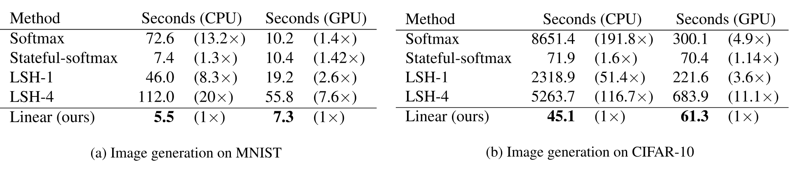

> [Angelos Katharopoulos](https://angeloskath.github.io/), [Apoorv Vyas](https://apoorv2904.github.io/), [Nikolaos Pappas](https://nik0spapp.github.io/), [François Fleuret](https://fleuret.org/francois/) [+affiliations]. 2020 年 6 月 29 日首次提交至 arXiv; 当前版本为 v3, 修订于 2020 年 8 月 31 日. 发表于 *Proceedings of the 37th International Conference on Machine Learning*, PMLR 119:5156-5165, 2020 年 7 月 13-18 日. [Transformers are RNNs: Fast Autoregressive Transformers with Linear Attention](https://arxiv.org/abs/2006.16236). <a href="/paper/transformers-are-rnns.pdf" target="_blank" rel="noopener noreferrer">原始 PDF</a>. [ICML 2020](https://proceedings.mlr.press/v119/katharopoulos20a.html). [DOI](https://doi.org/10.48550/arXiv.2006.16236). [TeX 源码](https://export.arxiv.org/e-print/2006.16236v3). 原始 PDF 是精确印刷排版与参考文献的权威依据.

## 摘要

Transformer 在多项任务中取得了出色的性能, 但由于其复杂度随输入长度呈二次增长, 面对很长的序列时速度慢得难以接受. 为解决这一限制, 我们将自注意力表示为核特征映射的线性点积, 并利用矩阵乘法的结合律将复杂度从 $\mathcal{O}\left(N^{2}\right)$ 降至 $\mathcal{O}\left(N\right)$, 其中 $N$ 是序列长度. 我们表明, 这一形式允许采用迭代实现, 能大幅加快自回归 Transformer, 同时揭示它与循环神经网络的关系. 我们的*线性 Transformer* 性能与普通 Transformer 相近, 在很长序列的自回归预测中最快可达后者的 4000 倍.

## 1 引言

Transformer 模型最初由 [Vas17] 在神经机器翻译 [Sut14, Bah14] 的背景下提出, 并已在处理自然语言 [Dev18], 音频 [Spe18] 和图像 [Par19b] 的多种任务中取得了令人瞩目的结果. 除了监督数据充足的任务外, Transformer 在使用自回归 [Rad18, Rad19] 或掩码语言建模目标 [Dev18, Yan20d, Son19, Liu19a] 进行预训练后, 也能有效地将知识迁移到监督有限或没有监督的任务上.

不过, 这些优势往往伴随着很高的计算和内存开销. 瓶颈主要来自自注意力的全局感受野: 它处理包含 $N$ 个输入的上下文时, 内存和时间复杂度均为二次的 $\mathcal{O}\left(N^{2}\right)$. 因此, Transformer 在实践中训练缓慢, 其上下文也*受到限制*. 这会破坏时间连贯性, 并妨碍模型捕捉长期依赖. [Dai19] 通过关注先前上下文的记忆解决了后一个问题, 但代价是计算效率下降.

近来, 研究者开始关注如何在不牺牲效率的情况下增加上下文长度. 为此, [Chi19] 引入了注意力矩阵的稀疏分解, 将自注意力复杂度降至 $\mathcal{O}\left(N\sqrt{N}\right)$. [Kit20] 又利用局部敏感哈希将复杂度进一步降至 $\mathcal{O}\left(N\log N\right)$. 这使模型能够扩展到长序列. 尽管上述模型可以在大规模序列上高效训练, 它们并不能加快自回归推理.

本文提出*线性 Transformer* 模型, 它大幅减少了内存占用, 并能随上下文长度线性扩展. 我们使用基于核的自注意力形式和矩阵乘法的结合律来计算自注意力权重, 从而做到这一点 ([第 3.2 节](#section-3-2)). 借助线性形式, 我们还以线性复杂度和常数内存表示了因果遮罩 ([第 3.3 节](#section-3-3)). 这揭示了 Transformer 与 RNN 之间的关系, 使自回归推理速度提升了数个数量级 ([第 3.4 节](#section-3-4)).

我们在图像生成和自动语音识别上的评估表明, *线性 Transformer* 可以达到 Transformer 的性能水平, 同时推理速度最快可提升三个数量级.

## 2 相关工作

本节概述与降低 Transformer 的巨大内存和计算需求最相关的工作. 我们还会讨论从理论上分析 Transformer 模型核心组件, 即自注意力的方法. 最后, 我们介绍另一类试图缓解注意力计算中 softmax 瓶颈的工作.

### 2.1 高效 Transformer

已有工作通过权重剪枝 [Mic19], 权重分解 [Lan20], 权重量化 [Zaf19] 或知识蒸馏来提高 Transformer 的内存效率. [Cla20] 提出了一种名为替换词元检测的新预训练目标, 它的样本效率更高, 并减少了总体计算量. [Lam19] 使用 product-key attention, 以几乎可以忽略的计算开销提高任意层的容量.

这些方法通过降低内存或计算需求来缩短训练或推理时间, 但从根本上说, 时间复杂度相对于序列长度仍然是二次的, 因而妨碍了模型扩展到长序列. 与之不同, 我们从理论 ([第 3.2 节](#section-3-2)) 和实验 ([第 4.1 节](#section-4-1)) 两方面表明, 我们的方法都能降低 Transformer 的内存与时间复杂度.

另一类研究旨在扩大 Transformer 中自注意力的"上下文". 上下文是指用于计算自注意力的最大序列片段. [Dai19] 提出了 Transformer-XL, 它在不破坏时间连贯性的前提下学习超出固定长度上下文的依赖, 在语言建模中达到当时最好的性能. 不过, 将先前的上下文保存在内存中会带来显著的额外计算开销. 相比之下, [Suk19] 为每个注意力头学习最优注意力跨度, 在控制内存占用和计算时间的同时显著延长了上下文. 注意, 这两种方法的渐近复杂度都与普通模型相同. 我们则改进了自注意力的渐近复杂度, 因而可以使用大得多的上下文.

与我们的模型更相关的是 [Chi19] 和 [Kit20] 的工作. 前者 [Chi19] 引入了注意力矩阵的稀疏分解, 在长序列生成建模中将总体复杂度从二次降至 $\mathcal{O}\left(N\sqrt{N}\right)$. 更近的 [Kit20] 提出了 Reformer. 该方法使用局部敏感哈希 (LSH) 减少点积次数, 将复杂度进一步降至 $\mathcal{O}\left(N\log{N}\right)$. 注意, 为了使用 LSH, Reformer 将注意力的键约束为与查询相同. 因此, 该方法不能用于键与查询必须不同的解码任务. 相比之下, *线性 Transformer* 不对查询和键施加约束, 并且相对于序列长度线性扩展. 它还可以将自回归任务的推理速度提高三个数量级, 同时取得相近的验证困惑度.

### 2.2 理解自注意力

从理论角度深入理解自注意力的工作还很少. [Tsa19] 提出了一种基于核的 Transformer 注意力形式, 它将注意力视为在输入上应用核平滑器, 而核分数是输入之间的相似度. 这一形式有助于理解注意力的各个组件, 也便于整合位置嵌入. 我们则使用核形式来加快自注意力的计算并降低其计算复杂度. 我们还观察到, 如果在查询和键上应用相似度分数为正的核, 线性注意力会正常收敛.

更近的 [Cor20] 从理论和实验两方面表明, 头数足够多的多头自注意力可以表示任意卷积层. 我们在此转而说明, 使用自回归目标训练的自注意力层可以视为循环神经网络, 并可利用这一观察显著缩短自回归 Transformer 模型的推理时间.

### 2.3 线性化 softmax

多年来, softmax 一直是训练类别数量庞大的分类模型时的瓶颈 [Goo01, Mor05, Mni09]. 近期工作 [Bla17, Raw19] 用特征映射的线性点积近似 softmax, 通过采样加快训练. 受这些工作启发, 我们将 Transformer 中的 softmax 注意力线性化. 与本工作同期, [She21] 探索了线性化注意力在图像目标检测任务中的应用. 相比之下, 我们不仅将注意力计算线性化, 还为推理和训练开发了一种复杂度为线性, 内存为常数的自回归 Transformer 模型. 此外, 我们表明, 从核的视角看, 每个 Transformer 都可以视为循环神经网络.

## 3 线性 Transformer

本节对我们提出的*线性 Transformer* 作形式化描述. 我们会说明, 将注意力从传统的 *softmax* 注意力改为基于特征映射的点积注意力, 可以改善时间和内存复杂度, 并得到一个能像循环神经网络一样在线性时间内生成序列的因果模型.

首先, 我们在 [第 3.1 节](#section-3-1) 介绍 [Vas17] 提出的 Transformer 架构的一种形式. 随后, 我们在 [第 3.2 节](#section-3-2) 和 [第 3.3 节](#section-3-3) 介绍所提出的*线性 Transformer*, 最后在 [第 3.4 节](#section-3-4) 将 Transformer 改写为循环神经网络.

### 3.1 Transformer

令 $x\in\mathbb{R}^{N\times F}$ 表示由 $N$ 个 $F$ 维特征向量组成的序列. Transformer 是函数 $T:\mathbb{R}^{N\times F}\to\mathbb{R}^{N\times F}$, 定义为 $L$ 个 Transformer 层 $T_{1}(\cdot),\dots,T_{L}(\cdot)$ 的复合, 如下所示,

$$
T_{l}(x)=f_{l}(A_{l}(x)+x).
$$

函数 $f_{l}(\cdot)$ 独立地变换每个特征, 通常由一个小型双层前馈网络实现. $A_{l}(\cdot)$ 是自注意力函数, 也是 Transformer 中唯一跨序列操作的部分.

自注意力函数 $A_{l}(\cdot)$ 在每个位置计算其他所有位置特征表示的加权平均, 权重与表示之间的相似度分数成正比. 形式上, 输入序列 $x$ 通过三个矩阵 $W_{Q}\in\mathbb{R}^{F\times D}$, $W_{K}\in\mathbb{R}^{F\times D}$ 和 $W_{V}\in\mathbb{R}^{F\times M}$ 投影为对应的表示 $Q$, $K$ 和 $V$. 所有位置的输出 $A_{l}(x)=V^{\prime}$ 按如下方式计算,

$$
\begin{aligned}
Q & =xW_{Q}, \\
K & =xW_{K}, \\
V & =xW_{V}, \\
A_{l}(x)=V^{\prime} & =\mathrm{softmax}\left(\frac{Q K^\top}{\sqrt{D}}\right)V.
\end{aligned}
$$

注意, 在上式中, softmax 函数逐行应用于 $Q K^\top$. 按照常用术语, $Q$, $K$ 和 $V$ 分别称为"查询", "键"和"值".

[公式 2](#equation-02) 实现了一种特定形式的自注意力, 称为 softmax 注意力, 其中相似度分数是查询与键的点积的指数. 若用下标 $i$ 取矩阵的第 $i$ 行并将其作为向量, 则可以把适用于任意相似度函数的广义注意力公式写成,

$$
V^{\prime}_{i}=\frac{\sum_{j=1}^{N}\mathrm{sim}\left(Q_{i},K_{j}\right)V_{j}}{\sum_{j=1}^{N}\mathrm{sim}\left(Q_{i},K_{j}\right)}.
$$

如果将相似度函数替换为 $\mathrm{sim}\left(q,k\right)=\exp\left(\frac{q^\top k}{\sqrt{D}}\right)$, [公式 3](#equation-03) 就与 [公式 2](#equation-02) 等价.

### 3.2 线性化注意力

[公式 2](#equation-02) 中的注意力定义是通用的, 可用于定义多项式注意力或 RBF 核注意力等其他多种注意力实现 [Tsa19]. 注意, 要使 [公式 3](#equation-03) 定义一个注意力函数, 我们只需对 $\mathrm{sim}\left(\cdot\right)$ 施加非负这一项约束. 所有核 $k(x,y):\mathbb{R}^{2\times F}\to\mathbb{R}_{+}$ 都满足这一条件.

给定一个具有特征表示 $\phi\left(x\right)$ 的此类核, 我们可以将 [公式 2](#equation-02) 改写为,

$$
V^{\prime}_{i}=\frac{\sum_{j=1}^{N}\phi\left(Q_{i}\right)^\top\phi\left(K_{j}\right)V_{j}}{\sum_{j=1}^{N}\phi\left(Q_{i}\right)^\top\phi\left(K_{j}\right)},
$$

再利用矩阵乘法的结合律, 进一步将其简化为

$$
V^{\prime}_{i}=\frac{\phi\left(Q_{i}\right)^\top\sum_{j=1}^{N}\phi\left(K_{j}\right)V_{j}^\top}{\phi\left(Q_{i}\right)^\top\sum_{j=1}^{N}\phi\left(K_{j}\right)}.
$$

如果把分子写成如下向量化形式, 上式会更容易理解,

$$
\left(\phi\left(Q\right)\phi\left(K\right)^\top\right)V=\phi\left(Q\right)\left(\phi\left(K\right)^\top V\right).
$$

注意, 特征映射 $\phi\left(\cdot\right)$ 逐行应用于矩阵 $Q$ 和 $K$.

从 [公式 2](#equation-02) 可以清楚看出, softmax 注意力的计算开销按 $\mathcal{O}\left(N^{2}\right)$ 增长, 其中 $N$ 表示序列长度. 内存需求同样如此, 因为要计算查询, 键和值的梯度, 必须存储完整的注意力矩阵. 相比之下, [公式 5](#equation-05) 给出的*线性 Transformer* 的时间和内存复杂度都是 $\mathcal{O}\left(N\right)$, 因为我们只需计算一次 $\sum_{j=1}^{N}\phi\left(K_{j}\right)V_{j}^\top$ 和 $\sum_{j=1}^{N}\phi\left(K_{j}\right)$, 随后可将它们用于每个查询.

#### 3.2.1 特征映射与计算开销

对于 softmax 注意力, 乘法和加法的总开销按 $\mathcal{O}\left(N^{2}\max\left(D,M\right)\right)$ 增长, 其中 $D$ 是查询和键的维数, $M$ 是值的维数. 对于线性注意力则不同, 我们首先计算维数为 $C$ 的特征映射. 随后, 计算新的值需要 $\mathcal{O}\left(N C M\right)$ 次加法和乘法.

上述分析没有考虑核函数和特征函数的选择. 注意, 与指数核对应的特征函数是无限维的, 因此无法对精确的 softmax 注意力进行线性化. 另一方面, 例如多项式核具有精确的有限维特征映射, 并且已有研究表明, 它的效果与指数核或 RBF 核同样好 [Tsa19]. 二次线性化多项式 Transformer 的计算开销为 $\mathcal{O}\left(N D^{2} M\right)$. 当 $N>D^{2}$ 时, 这一计算复杂度更有利. 注意, 这一条件在实践中成立, 因为我们希望能处理包含数万个元素的序列.

对于涉及较短序列的实验, 我们使用一种特征映射, 由它得到的正相似度函数定义如下,

$$
\phi\left(x\right)=\mathrm{elu}(x)+1,
$$

其中 $\mathrm{elu}(\cdot)$ 表示指数线性单元 [Cle16] 激活函数. 我们选择 $\mathrm{elu}(\cdot)$ 而不是 $\mathrm{relu}(\cdot)$, 以免在 $x$ 为负时将梯度设为 0. 这一特征映射得到的注意力函数需要 $\mathcal{O}\left(N D M\right)$ 次乘法和加法. 在实验部分, 我们会表明 [公式 7](#equation-07) 的特征映射可以达到完整 Transformer 的性能, 同时显著降低计算和内存需求.

### 3.3 因果遮罩

Transformer 架构可以通过遮罩注意力计算来高效训练自回归模型, 使第 $i$ 个位置受到位置 $j$ 影响的充要条件为 $j\leq i$, 即一个位置不能受到后续位置的影响. 形式上, 这种因果遮罩将 [公式 3](#equation-03) 改为,

$$
V^{\prime}_{i}=\frac{\sum_{j=1}^{i}\mathrm{sim}\left(Q_{i},K_{j}\right)V_{j}}{\sum_{j=1}^{i}\mathrm{sim}\left(Q_{i},K_{j}\right)}.
$$

沿用 [第 3.2 节](#section-3-2) 的思路, 我们按如下方式将带遮罩的注意力线性化,

$$
V^{\prime}_{i}=\frac{\phi\left(Q_{i}\right)^\top\sum_{j=1}^{i}\phi\left(K_{j}\right)V_{j}^\top}{\phi\left(Q_{i}\right)^\top\sum_{j=1}^{i}\phi\left(K_{j}\right)}.
$$

引入如下的 $S_{i}$ 和 $Z_{i}$,

$$
S_{i}=\sum_{j=1}^{i}\phi\left(K_{j}\right)V_{j}^\top,
$$

$$
Z_{i}=\sum_{j=1}^{i}\phi\left(K_{j}\right),
$$

我们可以将 [公式 9](#equation-09) 简化为

$$
V^{\prime}_{i}=\frac{\phi\left(Q_{i}\right)^\top S_{i}}{\phi\left(Q_{i}\right)^\top Z_{i}}.
$$

注意, $S_{i}$ 和 $Z_{i}$ 可以由 $S_{i-1}$ 和 $Z_{i-1}$ 在常数时间内算出, 因此带因果遮罩的线性 Transformer 的计算复杂度相对于序列长度是线性的.

#### 3.3.1 梯度计算

在任何深度学习框架中, 直接实现 [公式 12](#equation-12) 都需要存储所有中间值 $S_{i}$ 才能计算梯度. 这会使内存消耗增加 $\max\left(D,M\right)$ 倍, 因而妨碍因果线性注意力用于更长的序列或更深的模型. 为解决这个问题, 我们将 [公式 9](#equation-09) 分子的梯度推导为累积和. 这样便能用**线性时间**和**常数内存**计算因果线性注意力的前向与反向传播. 补充材料给出了详细推导.

给定分子 $\bar{V}_{i}$ 以及标量损失函数关于分子的梯度 $\nabla_{\bar{V}_{i}}\mathcal{L}$, 我们按如下方式推导 $\nabla_{\phi\left(Q_{i}\right)}\mathcal{L}$, $\nabla_{\phi\left(K_{i}\right)}\mathcal{L}$ 和 $\nabla_{V_{i}}\mathcal{L}$,

$$
\nabla_{\phi\left(Q_{i}\right)}\mathcal{L}=\nabla_{\bar{V}_{i}}\mathcal{L}\left(\sum_{j=1}^{i}\phi\left(K_{j}\right)V_{j}^\top\right)^\top,
$$

$$
\nabla_{\phi\left(K_{i}\right)}\mathcal{L}=\left(\sum_{j=i}^{N}\phi\left(Q_{j}\right)\left(\nabla_{\bar{V}_{j}}\mathcal{L}\right)^\top\right)V_{i},
$$

$$
\nabla_{V_{i}}\mathcal{L}=\left(\sum_{j=i}^{N}\phi\left(Q_{j}\right)\left(\nabla_{\bar{V}_{j}}\mathcal{L}\right)^\top\right)^\top\phi\left(K_{i}\right).
$$

[公式 9](#equation-09) 以及 [公式 13](#equation-13)-[15](#equation-15) 中的累积和项可在线性时间内计算, 相对于序列长度只需常数内存. 由此得到的算法计算复杂度为 $\mathcal{O}\left(N C M\right)$, 内存为 $\mathcal{O}\left(N\max\left(C,M\right)\right)$, 其中给定特征映射的维数为 $C$. [算法 1](#algorithm-01) 给出了分子前向与反向传播的伪代码实现.

#### 3.3.2 训练与推理

训练自回归 Transformer 模型时, 完整的真实序列是已知的. 因此, [公式 1](#equation-01) 中的 $f_{l}(\cdot)$ 和注意力计算都可以进行逐层并行. 由此, Transformer 的训练效率高于循环神经网络. 另一方面, 推理期间时间步 $i$ 的输出是时间步 $i+1$ 的输入. 这使自回归模型无法并行化. 此外, Transformer 在每个时间步的开销不是常数; 它会随当前序列长度的平方增长, 因为必须为此前的所有时间步计算注意力.

我们提出的*线性 Transformer* 模型*兼具两者的优势*. 训练时, 计算可以并行化, 并充分利用 GPU 或其他加速器. 推理时, 我们的模型每次预测所需的时间和内存是常数. 这意味着我们只需把 $\phi\left(K_{j}\right)V_{j}^\top$ 矩阵存作内部状态, 并像循环神经网络一样在每个时间步更新它. 由此得到的推理速度比其他 Transformer 模型**快数千倍**.

### 3.4 Transformer 即 RNN

文献通常认为 Transformer 模型与循环神经网络是两种根本不同的方法. 不过, 从 [第 3.3 节](#section-3-3) 的因果遮罩形式和上一节的讨论可以清楚看出, 任何带因果遮罩的 Transformer 层都可以写成这样一种模型: 它在得到输入后修改内部状态, 随后预测输出, 即循环神经网络 (RNN). 注意, 与 Universal Transformer [Deh18] 不同, 我们考虑的是相对于时间而非深度的循环.

下面的公式把 [公式 1](#equation-01) 中的 Transformer 层形式化为循环神经网络. 得到的 RNN 有两个隐藏状态, 即注意力记忆 $s$ 和归一化器记忆 $z$. 我们使用下标表示循环中的时间步.

$$
s_{0}=0,
$$

$$
z_{0}=0,
$$

$$
s_{i}=s_{i-1}+\phi\left(x_{i}W_{K}\right)\left(x_{i}W_{V}\right)^\top,
$$

$$
z_{i}=z_{i-1}+\phi\left(x_{i}W_{K}\right),
$$

$$
y_{i}=f_{l}\left(\frac{\phi\left(x_{i}W_{Q}\right)^\top s_{i}}{\phi\left(x_{i}W_{Q}\right)^\top z_{i}}+x_{i}\right).
$$

在上述公式中, $x_{i}$ 表示某个 Transformer 层的第 $i$ 个输入, $y_{i}$ 表示第 $i$ 个输出. 注意, 我们的形式不对特征函数施加任何约束, 可用于表示*任何 Transformer* 模型, 理论上甚至包括使用 softmax 注意力的模型. 这一形式是进一步理解 Transformer 与常用循环网络 [Hoc97] 之间的关系, 以及信息存储与检索过程的第一步.

## 4 实验

**算法 1: 带因果遮罩的线性 Transformer.**

- **函数** $\mathrm{forward}(\phi(Q),\phi(K),V)$:
  - 令 $V'\gets0$ 且 $S\gets0$.
  - **对于** $i=1,\dots,N$:
    - 令 $S\gets S+\phi(K_i)V_i^\top$ ([公式 10](#equation-10)).
    - 令 $\bar V_i\gets\phi(Q_i)S$.
  - **返回** $\bar V$.
- **函数** $\mathrm{backward}(\phi(Q),\phi(K),V,G)$:
  - $G$ 是损失关于 $\mathrm{forward}$ 输出的梯度.
  - 令 $S\gets0$ 且 $\nabla_{\phi(Q)}\mathcal L\gets0$.
  - **对于** $i=1,\dots,N$:
    - 令 $S\gets S+\phi(K_i)V_i^\top$.
    - 令 $\nabla_{\phi(Q_i)}\mathcal L\gets G_iS^\top$ ([公式 13](#equation-13)).
  - 令 $S\gets0$, $\nabla_{\phi(K)}\mathcal L\gets0$ 且 $\nabla_V\mathcal L\gets0$.
  - **对于** $i=N,\dots,1$:
    - 令 $S\gets S+\phi(Q_i)G_i^\top$.
    - 令 $\nabla_{V_i}\mathcal L\gets S^\top\phi(K_i)$ ([公式 15](#equation-15)).
    - 令 $\nabla_{\phi(K_i)}\mathcal L\gets S V_i$ ([公式 14](#equation-14)).
  - **返回** $\nabla_{\phi(Q)}\mathcal L$, $\nabla_{\phi(K)}\mathcal L$ 和 $\nabla_V\mathcal L$.

本节通过实验分析所提出的*线性 Transformer* 的性能. 首先, 我们在 [第 4.1 节](#section-4-1) 根据计算开销, 内存消耗和合成数据上的收敛情况评估线性化注意力. 为进一步说明*线性 Transformer* 的效果, 我们在两个实际应用上评估模型: [第 4.2 节](#section-4-2) 的图像生成和 [第 4.3 节](#section-4-3) 的自动语音识别. 结果表明, 我们的模型能达到与当时最好的 Transformer 架构相当的性能, 同时需要的 GPU 内存和计算量大幅减少.

在所有实验中, 我们都将模型与两个基线比较: 使用 softmax 注意力的完整 Transformer 和 Reformer [Kit20], 后者是当时最好的加速 Transformer 架构. 对于 Reformer, 我们使用已发布代码的 PyTorch 复现; 对于完整 Transformer, 则使用 PyTorch 的默认实现. 注意, 我们没有为 Reformer 使用可逆层, 但这不会影响结果, 因为我们只测量自注意力层的内存消耗. 在所有实验中, 我们用 **softmax** [Vas17] 表示标准 Transformer 架构, 用 **linear** 表示所提出的*线性 Transformer*, 用 **lsh-X** 表示 Reformer [Kit20], 其中 *X* 表示哈希轮数.

训练*线性 Transformer* 时, 我们使用 [公式 7](#equation-07) 的特征映射. 我们的 PyTorch [Pas19] 代码及文档和示例可在 [https://linear-transformers.com/](https://linear-transformers.com/) 找到. [公式 13](#equation-13)-[15](#equation-15) 的常数内存梯度计算由约 200 行 CUDA 代码实现.

.](./transformers-are-rnns/figure-01.png)

**图 1.** Reformer (lsh-X), softmax 注意力和线性注意力完成一次前向/反向传播所需计算资源的比较. 线性模型和 Reformer 随序列长度线性扩展, 而 softmax 的内存和时间都随序列长度的平方增长. 实验的完整细节见 [第 4.1 节](#section-4-1).

.](./transformers-are-rnns/figure-02.png)

**图 2.** *softmax*, *linear* 和 *reformer* 注意力在序列复制任务上的收敛比较. *linear* 稳定收敛, 最终达到与 softmax 相同的性能. 实验细节见 [第 4.1 节](#section-4-1).

### 4.1 合成任务

#### 4.1.1 收敛分析

为考察*线性 Transformer* 的收敛性质, 我们在一个带因果遮罩的人工复制任务上训练模型. 具体来说, Transformer 必须复制一系列符号, 与 [Kit20] 的序列复制任务类似. 我们使用最大长度为 128 的序列, 其中有 10 种不同符号, 并用专门的分隔符隔开. 对三种方法, 我们均训练一个含 4 层, 每层 8 个注意力头的 Transformer, 批大小为 64, 使用 RAdam 优化器 [Liu19d], 学习率为 $10^{-3}$, 在 3000 次更新后降至 $10^{-4}$. [图 2](#figure-02) 给出了损失相对于梯度步数的变化. 我们观察到, linear 平滑收敛, 并因没有哈希引入的噪声而达到比 lsh 更低的损失. 具体而言, 它达到了与 softmax 相同的损失.

#### 4.1.2 内存与计算需求

本小节比较各种 Transformer 的计算和内存需求. 我们为序列长度变化的合成输入计算注意力及其梯度, 其中 $N\in\{2^{9},2^{10},\dots,2^{16}\}$, 并测量每种 Transformer 变体的 GPU 内存分配峰值和所需时间. 批大小与序列长度成反比缩放, 并报告批中每个样本所需的时间和内存.

每种方法都评估到 GPU 内存可以容纳的最大序列长度. 这一基准测试使用配备 11GB 内存的 NVidia GTX 1080 Ti. 由此, softmax 可处理的最大序列长度为 4,096 个元素, lsh-4 和 lsh-8 则为 16,384. 不出所料, softmax 相对于序列长度呈二次扩展. 如 [图 1](#figure-01) 所示, 我们的方法在每种配置下都比基线更快且占用更少内存. 我们观察到 Reformer 和线性注意力都随序列长度线性扩展. 注意, 虽然 Reformer 的渐近复杂度为 $\mathcal{O}\left(N\log N\right)$, 但 $\log N$ 足够小, 不会影响计算时间.

### 4.2 图像生成

Transformer 在条件或无条件自回归生成任务上取得了很好的结果 [Rad19, Chi19], 但由于该任务天然是顺序执行的, 且内存随序列长度的平方增长, 从 Transformer 采样的速度很慢. 本节训练带因果遮罩的 Transformer 逐像素预测图像. 我们取得的每维比特数性能与 *softmax* 注意力相当, 同时生成图像的速度**超过其 1,000 倍**, 并且从第一个像素到最后一个像素, **每张图像所需的内存都是常数**. 关于训练过程, 生成图像质量和生成单张图像所需时间的比较, 请参阅补充材料. 此外, 除了 PyTorch 实现外, 我们还与一种更快的 softmax Transformer 比较, 它在推理时会缓存键和值.

#### 4.2.1 MNIST

.](./transformers-are-rnns/table-01.png)

**表 1.** MNIST 图像自回归生成的比较. 我们的线性 Transformer 达到了与完整 softmax 注意力几乎相同的 bits/dim, 但图像生成吞吐量高出 300 多倍. 实验的完整细节见 [第 4.2.1 节](#section-4-2-1).

首先, 我们在广泛使用的 MNIST 数据集 [Lec00] 上评估使用自回归 Transformer 生成图像的模型. 本实验的架构包含 8 个注意力层, 每层有 8 个注意力头. 嵌入大小设为 256, 即每个头 32 维. 前馈层维数是嵌入大小的 4 倍. 我们按照 [Sal17] 提出的方法, 用 10 个 logistic 分布的混合来建模输出. 我们使用 RAdam 优化器, 学习率为 $10^{-4}$, 所有模型均训练 250 个 epoch. 对 Reformer 基线, 我们使用 1 轮和 4 轮哈希. 此外, 按 [Kit20] 的建议, 我们使用 64 个桶和每块约 32 个元素的分块. 具体来说, 我们将长度为 783 的输入序列分为 27 块, 每块 29 个元素. 由于序列长度相对较短, 即仅有 784 个像素, 为排除不同批大小造成的差异, 所有方法均使用批大小 10.

[表 1](#table-01) 汇总了结果. 我们观察到, 线性 Transformer 的最终困惑度与 softmax Transformer 几乎相同, 同时生成图像的速度高出 300 多倍. 这得益于模型较低的内存需求, 它可以用一块 GPU 同时生成 10,000 张 MNIST 图像. 具体来说, 内存相对于序列长度是常数, 因为像素之间只需存储 [公式 18](#equation-18) 和 [19](#equation-19) 所述的 $s_{i}$ 与 $z_{i}$ 值. 另一方面, softmax 和 Reformer 所需的内存都会随序列长度增加.

我们的 MNIST 模型生成的图像补全结果和无条件样本见 [图 3](#figure-03). 我们观察到, 线性 Transformer 生成的样本十分逼真, 边界清晰且没有噪声. 在图像补全中, 我们还观察到 Transformer 学会了使用与原图相同的笔画风格和宽度, 有效地关注了相距很远的时间位置. 注意, 由于所有模型达到的困惑度大致相同, 我们没有观察到不同模型生成样本之间的定性差异.

#### 4.2.2 CIFAR-10

.](./transformers-are-rnns/table-02.png)

**表 2.** 我们在单块 GPU 上训练自回归 Transformer 1 周, 用于生成 CIFAR-10 图像. 线性 Transformer 完成的 epoch 数是 softmax 的 3 倍, 因而取得了更好的困惑度. 我们的模型生成图像的速度是基线的 $4{,}000\times$. 实验的完整细节见 [第 4.2.2 节](#section-4-2-2).

随着序列变长, 线性形式的优势会进一步扩大. 为说明这一点, 我们训练了 16 层的 Transformer 来生成 CIFAR-10 图像 [Kri09]. 每一层都采用与上一实验相同的配置. 对 Reformer, 我们仍使用 64 个桶以及 83 块, 每块 37 个元素的分块, 这按论文的建议约为 32. 由于序列长度约为上一实验的 4 倍, 完整 Transformer 在我们可用的最大 GPU, 即配备 24GB 内存的 NVidia P40 上也只能使用批大小 1. 线性 Transformer 和 Reformer 均使用批大小 4. 所有模型均训练 7 天. [表 2](#table-02) 报告了每维比特数和图像生成吞吐量. 注意, 虽然本实验的重点不是最终困惑度, 但可以清楚看出, 随着序列增长, 快速 Transformer 模型每 GPU 小时的效率越来越高, 分数也优于较慢的同类模型.

由于 Reformer 和 softmax 注意力生成单个像素所需的内存和时间都随像素数量呈二次增长, 线性 Transformer 的吞吐量提升更加明显. 具体而言, softmax Transformer **每生成一张图像**, **我们的方法就可以生成 4,460 张**. 模型生成的图像补全结果和无条件样本见 [图 4](#figure-04). 我们观察到, 模型生成的图像具有空间一致性, 也能可信地补全图像, 且不会明显妨碍对图像类别的识别. 例如在 [图 4(b)](#figure-04) 中, 所有图像都成功补全了狗的鼻子 (第一行) 或卡车的挡风玻璃 (最后一行).

.](./transformers-are-rnns/figure-03.png)

**图 3.** 我们的方法为 MNIST 生成的无条件样本和图像补全结果. (a) 是被遮挡的原图, (b) 是补全结果, (c) 是原图. 模型的 bits/dimension 与 softmax 相当, 但吞吐量高出 **300 多倍**, 每秒生成 **142 张图像**. 详情见 [第 4.2.1 节](#section-4-2-1).

.](./transformers-are-rnns/figure-04.png)

**图 4.** 我们的方法为 CIFAR-10 生成的无条件样本和图像补全结果. (a) 是被遮挡的原图, (b) 是补全结果, (c) 是原图. 随着序列增长, 线性 Transformer 比 softmax 注意力更高效. 模型的吞吐量高出 **4,000 多倍**, 每秒生成 **17.85 张图像**. 详情见 [第 4.2.2 节](#section-4-2-2).

### 4.3 自动语音识别

.](./transformers-are-rnns/table-03.png)

**表 3.** 在 WSJ 数据集上进行自动语音识别的性能比较. 结果以音素错误率 (PER) 和每个 epoch 的训练时间给出. 我们的模型性能优于 LSTM 和 Reformer, 训练与评估速度也更快. 实验细节见 [第 4.3 节](#section-4-3).

为了说明我们的方法也可用于非自回归任务, 我们使用连接时序分类 (CTC) 损失 [Gra06], 评估线性 Transformer 在端到端自动语音识别中的性能. 在这一设置中, 我们以非自回归方式为每个输入帧预测音素分布. 我们使用时长 80 小时的 WSJ 数据集 [Pau92], 特征为不含时间差分的 40 维梅尔尺度滤波器组. 数据集中的序列平均包含 800 帧, 最大序列长度为 2,400 帧. 对这项任务, 我们还与一个双向 LSTM [Hoc97] 比较, 它有 3 层, 隐藏大小为 320. 我们使用 Adam 优化器 [Kin15], 学习率为 $10^{-3}$, 并在验证误差停止下降时降低学习率. Transformer 模型使用 9 层, 每层 6 个头, 嵌入维数与图像实验相同. 优化器使用 RAdam, 初始学习率为 $10^{-4}$, 并在验证误差停止下降时除以 2.

所有模型均以音素错误率 (PER) 和每个 epoch 的训练时间进行评估. 如 [表 3](#table-03) 所示, 我们观察到 linear 在性能和速度上都大幅优于循环网络基线与 Reformer. 注意, 与所有基线相比, softmax Transformer 的音素错误率更低, 但速度明显较慢. 具体而言, *线性 Transformer* 每个 epoch 的速度快 $3\times$ 以上. 补充材料中给出了训练过程曲线.

## 5 结论

本文提出了*线性 Transformer*, 一种能显著降低原始 Transformer 内存和计算开销的模型. 具体来说, 利用矩阵乘法的结合律, 我们可以在线性随序列长度扩展的时间与内存内计算自注意力. 我们表明, 模型可以使用因果遮罩, 同时仍保持线性的渐近复杂度. 最后, 我们将 Transformer 模型表示为循环神经网络, 从而能在自回归任务上将推理速度提高数千倍.

这一性质为研究 RNN 与 Transformer 中的信息存储和检索开辟了许多方向. 另一个有待探索的研究方向与线性注意力的特征映射选择有关. 例如, 使用随机傅里叶特征近似 RBF 核, 可能使我们能够使用以 softmax 注意力预训练的模型.

## 致谢

Angelos Katharopoulos 获得瑞士国家科学基金会项目 FNS-30209 "ISUL" 和 FNS-30224 "CORTI" 的资助. Apoorv Vyas 获得瑞士国家科学基金会项目 FNS-30213 "SHISSM" 的资助. Nikolaos Pappas 获得瑞士国家科学基金会项目 P400P2_183911 "UNISON" 的资助.

## 6 梯度推导

在补充材料的第一节中, 我们详细推导了带因果遮罩的线性 Transformer 的梯度, 并说明这些梯度可以在线性时间和常数内存下计算. 具体来说, 我们推导标量损失关于下式分子的梯度,

$$
V^{\prime}_{i}=\frac{\phi\left(Q_{i}\right)^\top\sum_{j=1}^{i}\phi\left(K_{j}\right)V_{j}^\top}{\phi\left(Q_{i}\right)^\top\sum_{j=1}^{i}\phi\left(K_{j}\right)}.
$$

关于分母和分式的梯度由 autograd 高效处理. 不失一般性, 可以假设 $Q$ 和 $K$ 已经包含经 $\phi\left(\cdot\right)$ 映射的向量, 因而给定分子

$$
\bar{V}_{i}=Q_{i}^\top\sum_{j=1}^{i}K_{j}V_{j}^\top,
$$

以及 $\nabla_{\bar{V}}\mathcal{L}$, 我们要计算 $\nabla_{Q}\mathcal{L}$, $\nabla_{K}\mathcal{L}$ 和 $\nabla_{V}\mathcal{L}$. 注意, $Q\in\mathbb{R}^{N\times D}$, $K\in\mathbb{R}^{N\times D}$ 且 $V\in\mathbb{R}^{N\times M}$. 为推导这些梯度, 我们先不使用向量记法, 将上式写到单个元素上,

$$
\bar{V}_{ie}=\sum_{d=1}^{D}Q_{id}\sum_{j=1}^{i}K_{jd}V_{je}=\sum_{d=1}^{D}\sum_{j=1}^{i}Q_{id}K_{jd}V_{je}.
$$

接下来, 我们开始推导 $Q$ 的梯度, 对任意 $Q_{lt}$ 求偏导, 如下所示

$$
\frac{\partial\mathcal{L}}{\partial Q_{lt}}=\sum_{e=1}^{M}\frac{\partial\mathcal{L}}{\partial\bar{V}_{le}}\frac{\partial\bar{V}_{le}}{\partial Q_{lt}}=\sum_{e=1}^{M}\frac{\partial\mathcal{L}}{\partial\bar{V}_{le}}\left(\sum_{j=1}^{l}K_{jt}V_{je}\right).
$$

如果把上式写成梯度的矩阵乘积, 则得到,

$$
\nabla_{Q_{i}}\mathcal{L}=\nabla_{\bar{V}_{i}}\mathcal{L}\left(\sum_{j=1}^{i}K_{j}V_{j}^\top\right)^\top,
$$

这证明了正文中的 [公式 13](#equation-13). 在 [公式 24](#equation-24) 中, 我们利用了 $Q_{lt}$ 只影响 $\bar{V}_{l}$ 这一事实, 因而计算梯度时无须对 $i$ 求和. 但对 $K$ 和 $V$ 而言并非如此. 具体来说, $K_{j}$ 会影响所有 $\bar{V}_{i}$, 其中 $i\geq j$. 因此, 可以把损失关于 $K_{lt}$ 的偏导写为,

$$
\begin{aligned}
\frac{\partial\mathcal{L}}{\partial K_{lt}} & =\sum_{e=1}^{M}\sum_{i=l}^{N}\frac{\partial\mathcal{L}}{\partial\bar{V}_{ie}}\frac{\partial\bar{V}_{ie}}{\partial K_{lt}}=\sum_{e=1}^{M}\sum_{i=l}^{N}\frac{\partial\mathcal{L}}{\partial\bar{V}_{ie}}\frac{\partial\left(\sum_{d=1}^{D}\sum_{j=1}^{i}Q_{id}K_{jd}V_{je}\right)}{\partial K_{lt}} \\
& =\sum_{e=1}^{M}\sum_{i=l}^{N}\frac{\partial\mathcal{L}}{\partial\bar{V}_{ie}}Q_{it}V_{le}.
\end{aligned}
$$

与 $Q$ 相同, 现在可将梯度写成向量化形式,

$$
\nabla_{K_{i}}\mathcal{L}=\left(\sum_{j=i}^{N}Q_{j}\left(\nabla_{\bar{V}_{j}}\mathcal{L}\right)^\top\right)V_{i},
$$

这证明了论文中的 [公式 14](#equation-14). 沿用同样的思路, 可以计算损失关于 $V_{lt}$ 的偏导, 并证明公式 15. 注意, 关于 $Q$ 和 $K$ 的梯度所用的累积和矩阵大小相同, 但一个按前向方向计算 (从 1 累加到 $N$), 与前向传播相似; 另一个按反向方向计算 (从 $N$ 累加到 1), 与 RNN 中的时间反向传播相似.

## 7 训练过程

[图 5](#figure-05) 给出了实验中所有 Transformer 模型的训练过程. 对 MNIST 实验 ([图 5(a)](#figure-05)), 所有方法均训练 250 个 epoch. 序列足够短, 各种方法的训练时间没有显著差异. 我们观察到, 方法的收敛表现与 softmax 注意力相当, 并且显著优于两种 Reformer 变体.

另一方面, 对 CIFAR-10 ([图 5(b)](#figure-05)), 所有方法均按固定时间训练, 即 7 天. 我们观察到, *lsh-1* 和 *linear* 完成的 epoch 显著多于 softmax 和 lsh-4, 并取得更好的性能. 随着序列进一步增长, 这一差距预计还会扩大.

最后, 在自动语音识别实验 ([图 5(c)](#figure-05)) 中, softmax 的收敛表现显著优于 Reformer 和 linear. 注意, linear 每个 epoch 的速度快 $3\times$, 这意味着它完成的 epoch 数约为 softmax 的 4 倍. 尽管 softmax 注意力更适合这项任务, 我们仍观察到*线性 Transformer* 在收敛和最终性能上都显著优于 Reformer.

, [第 4.2.2 节](#section-4-2-2) 和 [第 4.3 节](#section-4-3).](./transformers-are-rnns/figure-05.png)

**图 5.** 所有实验中 Transformer 的训练过程. 可以看到, *线性 Transformer* 的收敛始终快于 Reformer, 并且在自回归实验中与 softmax 相当. 对 MNIST, 所有方法均训练 250 个 epoch; 对 CIFAR, 则训练 7 天. 在语音识别实验中, 所有方法均训练至收敛. 实验细节见正文中的 [第 4.2.1 节](#section-4-2-1), [第 4.2.2 节](#section-4-2-2) 和 [第 4.3 节](#section-4-3).

## 8 图像生成吞吐量讨论

### 8.1 有状态 softmax 注意力

在正文的 [第 4.2 节](#section-4-2) 中, 我们报告了图像生成吞吐量, 并与 **softmax** Transformer 和 **lsh** 作了比较. 本节建立另一个基线 **stateful-softmax**, 它将自回归 softmax Transformer 实现为循环模型. 具体来说, 所有键和值都会被保存, 在预测序列的下一个元素时再次传入模型. 这一循环模型的状态由键和值的集合组成, 大小与序列长度成正比. 这与我们提出的模型在性质上不同: 后者的状态维数固定, 而且无论 $i$ 为何, 根据前一状态计算第 $i$ 个状态的计算开销都是固定的.

. 对 stateful-softmax, 我们保存键和值, 并复用它们来预测下一个元素. 这一额外基线的详细说明见 [第 8.1 节](#section-8-1).](./transformers-are-rnns/table-04.png)

**表 4.** MNIST 和 CIFAR-10 图像自回归生成吞吐量的比较. 该实验见正文中的 [第 4.2 节](#section-4-2). 对 stateful-softmax, 我们保存键和值, 并复用它们来预测下一个元素. 这一额外基线的详细说明见 [第 8.1 节](#section-8-1).

[表 4](#table-04) 汇总了结果. 我们观察到, stateful-softmax 明显快于普通 Transformer. 不过, 它相对于序列长度的复杂度仍为二次, 而我们的形式在 CIFAR-10 上快 $50\times$ 以上. 此外, 我们想指出, 为 Reformer 实现类似的有状态注意力并不容易, 因为每次提供新输入时都必须执行排序和分块操作.

### 8.2 统一批大小

前几节评估了所有 Transformer 变体在自回归图像生成任务上的吞吐量. 不过, 另一个需要考虑的重要因素是延迟, 即生成一张图像所需的总时间. 为此, 我们使用批大小 1, 测量所有方法生成单张图像所需的时间. 除在 GPU 上运行推理外, 我们还评估了 CPU 所需时间. 结果见 [表 5](#table-05).

**表 5.** 使用自回归 Transformer 生成单张 MNIST 和 CIFAR-10 图像所需时间的比较. 所有方法都在 CPU 和 GPU 上以批大小 1 运行, 并报告总时间, 单位为秒. 对表中所有数值, 越低越好.

我们观察到, 所有方法都没有充分利用 GPU, 图像生成吞吐量显著低于 [表 4](#table-04) 中的结果. 所提出的线性 Transformer 比所有方法都快, 尤其是在 CIFAR-10 上生成一张图像时, 它比 softmax Transformer 快约 $6.6\times$. 注意, 在所有情况下, 线性自回归 Transformer 是唯一在 CPU 上比 GPU 上更快的方法. 这是因为以 RNN 形式计算注意力的开销很低, 以至于主要的计算瓶颈变成了不可避免的序列外层循环.

## 9 图像生成的定性结果

本节给出图像生成实验的定性结果. 由于所有模型的困惑度近似相同, 正如预期的那样, 定性差异并不明显. 不过, 一个颇为有趣的观察是, Reformer 模型的无条件样本变体明显较少. 我们还观察到, 图像补全是一项比无条件生成容易得多的任务, 所有模型的表现都明显更好.

.](./transformers-are-rnns/figure-06.png)

**图 6.** 使用 MNIST 训练的 Transformer 模型生成的无条件样本. 见正文中的 [第 4.2.1 节](#section-4-2-1).

.](./transformers-are-rnns/figure-07.png)

**图 7.** 所有训练模型的 MNIST 数字补全结果. 见正文中的 [第 4.2.1 节](#section-4-2-1).

.](./transformers-are-rnns/figure-08.png)

**图 8.** 使用 CIFAR-10 训练的 Transformer 模型生成的无条件样本. 见正文中的 [第 4.2.2 节](#section-4-2-2).

.](./transformers-are-rnns/figure-09.png)

**图 9.** 所有已训练 Transformer 模型的 CIFAR-10 图像补全结果. 见正文中的 [第 4.2.2 节](#section-4-2-2).

[+affiliations]: 所属机构: 瑞士 Idiap 研究所; 瑞士 EPFL; 美国西雅图华盛顿大学; 瑞士日内瓦大学. 本工作在 Idiap 完成. 通信作者: Angelos Katharopoulos <firstname.lastname@idiap.ch>.
