> [Changho Hwang](https://chhwang.github.io/), [Wei Cui](https://www.microsoft.com/en-us/research/people/weicu/), [Yifan Xiong](https://www.microsoft.com/en-us/research/people/yixio/), [Ziyue Yang](https://yzygitzh.github.io/about/), [Ze Liu](https://zeliu98.github.io/), [Han Hu](https://ancientmooner.github.io/), [Zilong Wang](https://dblp.org/pid/42/898-6), [Rafael Salas](https://dblp.org/pid/00/11429), [Jithin Jose](https://dblp.org/pid/42/10334), [Prabhat Ram](https://dblp.org/pid/207/1544), [Joe Chau](https://dblp.org/pid/322/1159), [Peng Cheng](https://cp5555.github.io/), [Fan Yang](https://fanyangcs.github.io/), [Mao Yang](https://dblp.org/pid/89/1482-4) 和 [Yongqiang Xiong](https://www.microsoft.com/en-us/research/people/yqx/). 论文于 2022 年 6 月 7 日首次提交至 arXiv, 当前版本为 2023 年 6 月 5 日修订的 v2. 发表于 Proceedings of Machine Learning and Systems 6 (MLSys 2023). [Tutel: Adaptive Mixture-of-Experts at Scale](https://arxiv.org/abs/2206.03382). <a href="/paper/tutel.pdf" target="_blank" rel="noopener noreferrer">原始 PDF</a>. [DOI](https://doi.org/10.48550/arXiv.2206.03382). [TeX 源文件](https://export.arxiv.org/e-print/2206.03382). 精确的印刷版式与参考文献以原始 PDF 为准.

## 摘要

稀疏门控专家混合模型 (MoE) 已被广泛用于在计算成本不变的情况下, 将深度学习模型扩展到万亿参数规模. MoE 的算法性能依赖令牌路由机制, 由它将每个输入令牌转发给合适的子模型, 即*专家*. 令牌路由会在运行时动态决定各专家的工作量, 而现有系统采用的*静态执行* (即静态并行与流水线) 无法适应这种动态工作负载, 因而计算效率低下.

我们提出 Tutel: 一套面向 MoE、具备动态自适应并行与流水线能力的高可扩展软件栈及其实现. Tutel 为 MoE 模型参数和输入数据设计了统一的分布布局, 可供可切换并行和动态流水线方法直接使用, 不会引入数学不等价或张量迁移开销. 因此, 系统能够在运行时以*零成本*完成自适应并行与流水线优化. 基于这一关键设计, Tutel 还实现了灵活全对全 (Flexible All-to-All)、二维分层 (2DH) 全对全、快速编码与解码等多种 MoE 加速技术. 综合这些技术, Tutel 最终在 16 块和 2,048 块 A100 GPU 上, 分别将单个 MoE 层相较此前最先进方案加速 **$4.96\times$** 和**$5.75\times$**.

评测表明, Tutel 能够高效运行实际的 MoE 模型 SwinV2-MoE; 该模型建立在先进的计算机视觉架构 Swin Transformer V2 之上. 在效率方面, 与 Fairseq 相比, Tutel 将 SwinV2-MoE 的训练和推理分别加速至多 $1.55\times$ 和 $2.11\times$. 在效果方面, SwinV2-MoE 在预训练和 COCO 目标检测等下游计算机视觉任务上均取得了优于对应稠密模型的准确率, 表明 Tutel 已可用于实际模型的端到端训练与推理.

## 1 引言

近年来, 研究界发现, 增加模型参数是提升深度学习 (DL) 算法性能最直接且相对简单的方法之一 [Kap20]. 然而, 模型容量通常受计算资源和能源成本限制 [Sha20b]. 为解决这一问题, 稀疏门控专家混合模型 (MoE) [Sha17] 采用多个称为专家的并行子模型, 引入一种*稀疏*架构, 并依据智能门控函数只将每个输入转发给少数专家. 与稠密层不同, 这种方法只需以次线性幅度增加计算成本, 就能扩大模型容量. 如今, MoE 已成为将深度神经网络扩展到万亿参数以上最常用的方法之一 [Fed22], 为模型学习更多信息铺平了道路.

基于 MoE 的算法带来了巨大的纵向与横向扩展空间, 但 **MoE 的动态特性**也造成了多数既有深度学习算法和系统未曾面对的基础性系统挑战. 具体而言, 每个 MoE 层包含若干分布在加速器 (本文使用 GPU) 上的并行专家; 每块 GPU 根据智能门控函数, 将各条输入数据分派给若干最匹配的专家, 再取回相应输出并加以合并. 这意味着专家工作负载本质上无法预先确定, 因为它取决于输入数据和门控函数. 实际运行中, 两者在每次迭代都会变化. 我们的实验显示 (见 [图 1](#figure-01)), 一次训练过程中的工作负载变化可达 $4.38\times$, 不同层的工作负载也各不相同.

既有深度学习系统, 包括最新的 MoE 框架 [Lep20, Ott19a, Raj22, He22], 大多采用静态运行时执行, 无法适应 MoE 的动态特性. 主要问题在于, 专家往往不能采用性能最佳的并行方式, 因为最优方式会随动态工作负载而变化. 在运行时动态调整并行方式并不容易, 现有系统通常会因此产生大量重分配开销或占用额外 GPU 内存. *负载均衡损失* [Fed22] 等方法试图通过调整 MoE 算法来解决这一问题, 但在我们的实验中往往会损害模型准确率 (见 [第 2.1 节](#section-2-1)).

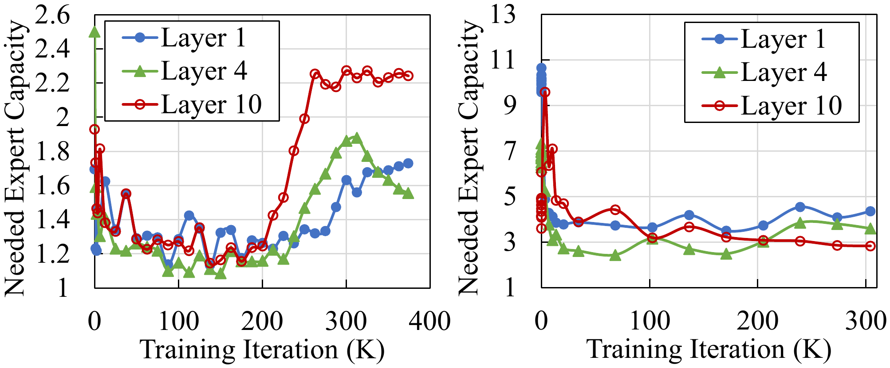

**图 1.** 在端到端训练 MoE 版本的 Swin Transformer V2 [Liu21e, Liu22b] thin-tiny (左) 和 base (右) 模型过程中, MoE 层的动态工作负载变化. y 轴表示运行时所需的专家容量, 这表明工作负载的数量 (详情见 [第 2.1 节](#section-2-1)). 为了更清晰的展示, 仅显示模型中 10 个 MoE 层中的第 1、第 4 和第 10 层.

本文提出 Tutel 系统, 通过针对动态 MoE 工作负载的自适应方法, 在任意规模下全面优化 MoE. 其核心机制是*自适应并行切换*: 每次迭代都可动态切换并行策略, 且无需额外切换开销. 现有系统针对不同并行策略采用不同的张量布局; Tutel 则只使用一种分布式布局, 覆盖所有可能的最优策略. 因而在切换并行策略时, 无需重新格式化输入数据或权重, 实现零成本切换. 基于对各类并行方式通信成本的分析, 我们保证自适应并行不会错过最优并行策略.

Tutel 是一套完整框架, 可在大规模环境中实现多种 MoE 算法. 除自适应并行切换外, 它还提供自适应流水线、二维分层 (2DH) All-to-All 算法, 以及利用 GPU 稀疏计算的快速编码与解码等优化技术, 从而高效、自适应地处理 MoE. Tutel 已在 GitHub [+1] 开源, 并集成至 Fairseq [Ott19a] 和 DeepSpeed [Dee23]. 我们在 Azure A100 集群上的大量实验 [Ndm23] 表明, 与原版 Fairseq 相比, Tutel 在 128 块 GPU 上可将 MoE 层加速至多 $3.11\times$, 并将实际模型 SwinV2-MoE 的端到端训练与推理分别加速 $1.55\times$ 和 $2.11\times$. 当规模扩展到 2,048 块 GPU 时, MoE 层加速比进一步提高至 $5.75\times$.

我们的主要贡献如下:

- 详细分析 MoE 的动态特性及其给现有框架带来的挑战.

- 提出自适应并行切换, 高效处理 MoE 的动态工作负载, 使单个 MoE 层获得 $1.35\times\sim 14.57\times$ 加速.

- 综合所有加速技术后, Tutel 可在任意规模下加速 MoE: 在 16 块和 2,048 块 A100 GPU 上, 单个 MoE 层的加速比分别为 $4.96\times$ 和 $5.75\times$.

- Tutel 已用于实现并运行先进视觉模型 SwinV2-MoE 的稀疏 MoE 版本, 处理实际计算机视觉问题. 与 Fairseq 等既有框架相比, 它将训练和推理分别加速至多 $1.55\times$ 和 $2.11\times$. 我们还证明稀疏模型的准确率高于对应稠密模型, 表明 Tutel 已可用于训练实际 AI 模型.

## 2 背景与动机

本节介绍了专家混合模型的动态特性及其在大规模训练中的低效率.

### 2.1 背景与相关工作

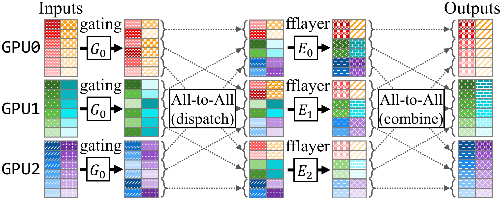

**图 2.** MoE 层在三块 GPU 上的示例, GPU $i$ 上的专家 $E_i$. $G_0$ 表示在所有 GPU 上共享的门控函数. 不同的颜色或图案表示不同的样本 (输入的列), 不同的颜色渐变表示样本内的不同令牌 (输入的行). 这个示例显示了两个样本/批次, 每个样本六个令牌, 以及均匀分配的 top-1 路由, 容量因子为 1.0——详情见 [第 2.2 节](#section-2-2).

**稀疏门控专家混合模型 (MoE).** MoE 使用多个 *专家* 模型, 每个模型分别处理它们自己的专门子任务, 以共同解决整个任务. 它通过在大规模分布式 DNN 模型中放置一个跨 GPU 层来部分交换来自不同 GPU 的隐藏特征, 从而被利用 [Fed22, Lin21a, Riq21]. [图 2](#figure-02) 给出了一个示例. 首先, 它运行一个 *门控函数* [Lew21, Rol21, Yan21c], 用于确定随后全对全集体通信 (All-to-All) 中每个输入令牌的目标 GPU [+2]. 在全对全通信 (称为 *dispatch*) 之后, 每个 GPU 运行它们自己的专家, 该专家是一个前馈网络层 (fflayer), 然后进行第二次全对全通信 (称为 *combine*), 将每个令牌的相应输出发送到该令牌所在的 GPU. 门控函数和前馈层的详细信息取决于模型算法.

**MoE 作为超大规模深度学习的关键.** MoE 在高成本效率方面与现有的 DNN 扩展方法 (即增加 DNN 的深度或宽度) 有所区别. 具体来说, 在 MoE 层中加入更多的模型参数 (专家) 并不会增加每个令牌的计算成本. 如今, MoE 被认为是超大规模深度学习的关键技术, 其在先前工作 [Fed22, Riq21, Lep20, Du22] 中展示了最先进的成果. 目前, 许多最先进的框架 (例如 DeepSpeed [Dee23]、Fairseq [Ott19a] 等) 已经支持 MoE.

**MoE 的动态工作负载.** MoE 动态工作负载的根本原因来自其令牌路由机制. 具体来说, MoE 层会动态地将每个令牌路由到多个专家, 而令牌在各个专家之间的分布通常是不均匀的. 这使得每个专家的工作负载在每次迭代中动态变化, 如 [图 1](#figure-01) 所示. *专家容量* 是用来表示每个专家工作负载的常用方法, 即一个专家接收处理的令牌数量. 专家容量取决于每批令牌的数量 $T$、全局专家的数量 $E$、top-$k$ 路由 ($1\leq k\leq E$) 以及容量因子 $f$ ($f\geq 1$), 具体如下:

$$
\mathrm{Expert\ Capacity}=k\cdot f\cdot\frac{T}{E}.
$$

$f=1$ 是表示令牌分布最均匀的最小值. 更大的 $f$ 值表示令牌路由更加不平衡, 这意味着一个专家必须处理更多的令牌.

大多数现有的 MoE 框架 [Ott19a, Lep20, Raj22, Zhe22] 只是将 $f$ 设置为容量因子 $f_{\mathrm{upper}}$ 的静态上限 (即 $f=f_{\mathrm{upper}}$), 以便不同的迭代总是执行固定量的计算. 然而, 基于 $f_{\mathrm{upper}}$ 的静态计算不仅会引入不必要的计算, 还可能在 $f_{\mathrm{upper}}$ 未设置为足够大值时丢弃过多的训练令牌, 这可能影响模型的准确性. 为了解决这个问题, 在本文中, 我们考虑一个系统 (如 Tutel), 它支持使用最低所需的 $f$ 进行 MoE 训练, 这不会像使用 $f=f_{\mathrm{upper}}$ 那样产生不必要的计算或丢失令牌. 基于这一机制, 我们在 $f$ 在训练步骤中变化时进一步探索优化的机会.

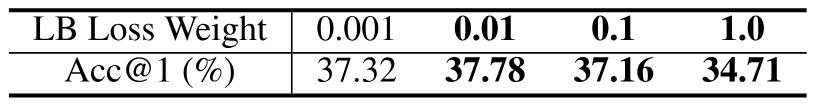

**表 1.** 严厉的负载均衡会损害 MoE 模型的准确性. 粗体数字突出显示了在较大 LB 损失权重下的准确性下降. 所有实验均在 ImageNet-22K 图像分类上进行, 并报告 SwinV2-S 模型的 top-1 准确率. 超参数: 32 个专家, top-1 路由, 容量因子 $f$=无限.

**MoE 框架.** 虽然 GShard [Lep20] 提供了一种计算逻辑, 确保了 MoE 的算法正确性, 但一些流行的 MoE 框架 [Ott19a, Raj22] 也遵循相同的逻辑, 但在大规模下表现不佳. Fast/FasterMoE [He22] 提出了不同的门控算法, 这些算法在计算上与 GShard 并不等效. 此外, 它提出了 *shadow expert* 和 *smart schedule*, 当长时间存在不平衡的令牌分布时, 仅能提供有条件的好处, 否则可能会损害吞吐量. 另一方面, Tutel 追求保持与 GShard 相同的计算逻辑, 并在任何环境下一般性地实现确定性的增益, 这使得 MoE 框架能够适应 Exa 级规模而不影响算法结果.

**负载均衡损失.** 负载均衡 (LB) 损失通过鼓励门控函数平衡专家 [Sha17, Fed22] 的工作负载来调节 MoE 层的训练. LB 损失可以促使 MoE 的工作负载低且稳定, 因为当令牌分布均匀时, 容量因子 $f$ 通常会下降 (如前一段所述). 然而, LB 损失通常不足以应对 MoE 的动态工作负载, 因为对 LB 损失赋予过大权重往往会损害模型的准确性. 具体来说, 对 LB 损失赋予适当权重可能通过引导门控函数在训练过程中调用更多不同的专家参数来帮助模型准确性, 但过大的权重可能会损害最终任务的优化目标, 并导致无法将令牌转发给其知识丰富的专家. [表 1](#table-01) 显示了我们在实验中使用大 LB 损失权重会损害模型的准确性. 此外, 根据我们的实证研究, LB 损失并不总是导致各专家之间的工作负载更加平衡. 例如, 我们在 [图 1](#figure-01) 的实验中使用了有助于实现最佳准确率的 LB 损失, 但它仍然显示出动态变化的工作负载. 在本文中, 我们仅考虑系统端的解决方案, 这些解决方案通常在不考虑 LB 损失的情况下应用.

### 2.2 静态并行

在 MoE 层的动态特性下, 如果我们想用多 GPU 加速一个专家以获得更高的吞吐量, 会变得具有挑战性. 以往的研究已经证明, 使用更多专家通常只会在很多专家情况下获得迅速递减的增量收益 ($>256$) [Raj22, Cla22, Fed22]. 因此, 在大规模训练中, MoE 层通常使用相对较少的专家数量与 GPU 数量相比, 并且一个专家会分配多个 GPU 以获得更高的吞吐量.

我们考虑了在以往工作 [Fed22] 中为 MoE 采用的三种不同的并行方法: 专家并行 (EP, 分配专家) 、数据并行 (DP, 分配输入数据) 和模型并行 (MP, 拆分并分配单个专家). EP、DP 和 MP 可以同时与彼此使用.

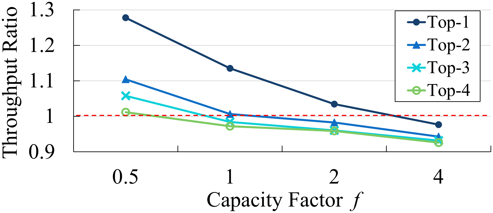

**图 3.** 两种不同并行方法的运行时偏好. Y 轴衡量 EP+MP 相对于 EP+DP 的吞吐量比率. 它比较了在不同容量因子 $f$ (即不同工作量) 和不同 top-$k$ 配置下的吞吐量, 其中 $>1.0$ 表示 EP+MP 优于 EP+DP, 反之亦然. 模型设置: fflayer 隐藏层大小 16K, fflayer 通道大小 2048, 批量大小 4.

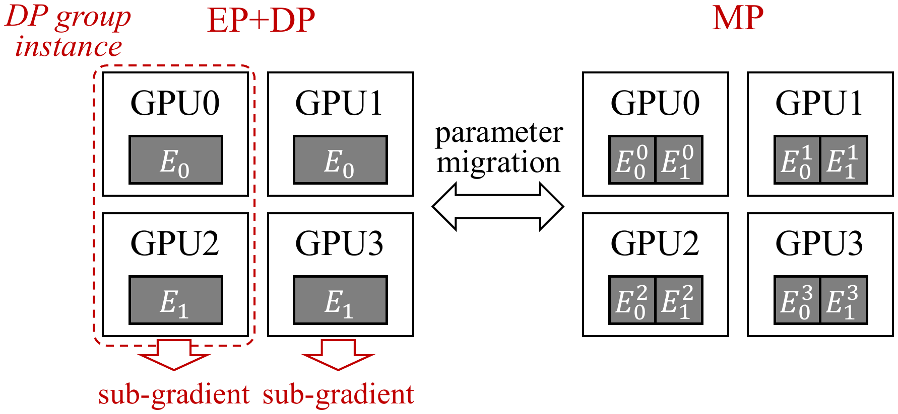

**图 4.** 由于在传统 EP+DP 和 MP 之间切换并行模式导致参数迁移. $E_i^p$ 指的是 $i$-th 专家的 $p$-th 切片 (以模型并行方式), (没有 $p$ 表示未切片). EP+DP 将每个专家复制到各自的两个 GPU 上, 而 MP 将每个专家分别切分到四个 GPU 上.

根据我们的实验, 在动态工作负载下, 静态采用某种并行方法并不总是高效. 例如, [图 3](#figure-03) 比较了两种不同的并行方法 EP+DP 和 EP+MP 的性能. 如图所示, 最佳的并行方法取决于工作负载, 这两种并行方法之间的性能差距为 7.39%-27.76%.

不幸的是, 在运行时切换不同的并行方法会产生大量开销. 具体来说, 在现有工作中, 基于某种并行方式 (例如数据并行) 的进行中的训练并未设计为与另一种并行方式 (例如模型并行) 兼容, 因为它们在数据分割、权重分割、参数梯度动量管理, 甚至用于启动训练的框架接口方面有不同的要求. 此外, 当我们更改并行方式时, 还会产生参数迁移的额外开销, 如 [图 4](#figure-04) 所示. 这些都是为什么现有系统中几乎不使用并行切换的原因.

### 2.3 静态流水线

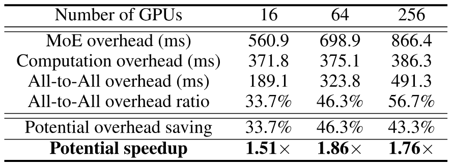

**表 2.** 在典型的 MoE 设置下, 通过将 All-to-All 与计算完全重叠, All-to-All 开销与潜在加速比. 模型设置: fflayer 隐藏层大小 4K, fflayer 通道大小 4K, 每个 GPU 2 个专家, 每次迭代 64K 令牌.

MoE 层在 [图 2](#figure-02) 中显示, 它们通常在运行 All-to-All 和 fflayer 顺序以分派和合并时未充分利用 GPU. 由于 All-to-All 大多数由非计算密集型的 GPU 间数据复制组成, 我们可以通过将其与执行数值计算的 fflayer 流水线处理来更好地利用 GPU 的计算能力. [表 2](#table-02) 显示通过重叠 All-to-All 和 fflayer 计算可以达到 $1.86\times$ 的潜在加速效果.

然而, 我们观察到用于调度和合并的静态流水线策略, 即静态全对全算法和流水线度, 对于处理动态工作负载效率低下. 如 [图 5](#figure-05) 所示, 根据不同的 MoE 设置和规模, 相应的最优流水线策略包含各种全对全算法 (*Linear* 或 *2DH [+3]*) 和流水线度. 这意味着单一的静态策略在不同的 MoE 设置和规模下并不总能实现最佳性能, 因此在运行时需要动态流水线策略以适应变化的设置.

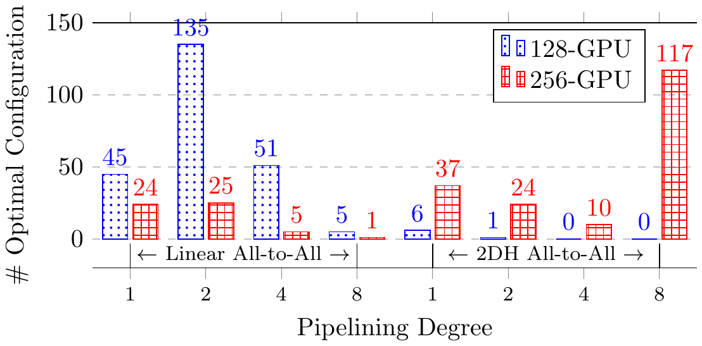

**图 5.** 各种 MoE 工作负载配置的最佳流水线策略分布. 每一列表示在 X 轴所述策略下表现最佳的配置数量. 工作负载配置的详细信息与 [第 5.1.2 节](#section-5-1-2) 中描述的相同.

更糟的是, 计算和通信之间的相互干扰使得如果我们只单独考虑每个方面, 就很难找到最佳的流水线策略. 这是因为在同一 GPU 上同时运行 NCCL 内核与计算内核时的性能下降难以估计. 根据我们的大量实验, 即使两个不同的全对全 (All-to-All) 算法具有相似的吞吐量, 当引入相同的并发计算内核时, 它们的吞吐量通常会有很大差异, 而且任意一个算法在具体情况下都可能优于另一个算法. 这意味着, 为了获得最佳的整体吞吐量, 动态调整应同时考虑计算和通信.

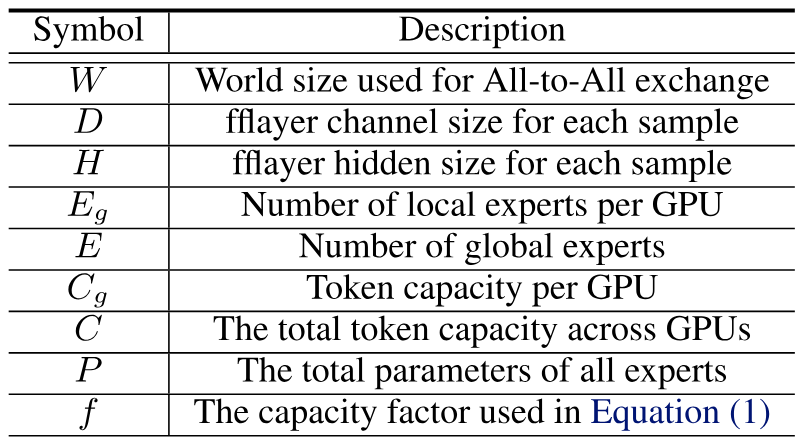

**表 3.** 符号描述.

## 3 Tutel 的自适应 MoE

Tutel 是一个全栈 MoE 系统, 支持具有自适应优化的完整 MoE 层. 由于所有优化对 DNN 模型开发者都是透明的, Tutel 不会改变 DL 框架的接口, 并且可以轻松地与其他框架集成. 在接下来的子章节中, 我们将详细描述 Tutel 如何解决上述问题.

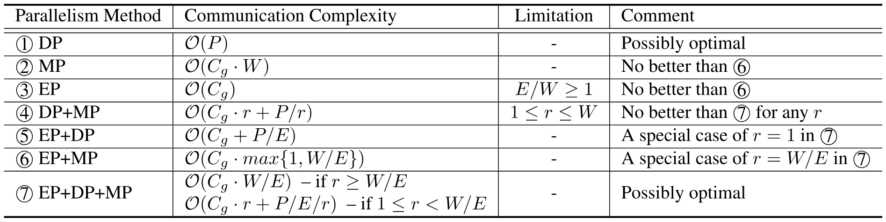

**表 4.** 关于 MoE 并行性的通信复杂性分析.

### 3.1 自适应并行切换

#### 3.1.1 值得进行并行切换的最小子集是什么?

鉴于 EP、DP 和 MP 可以得出 7 种不同的并行方法组合, 一种权宜之计是为每种方法设计一个执行流程, 并使其能够与所有其他方法切换. 然而, 没有必要设计多达 7 个执行流程, 因为这个问题可以精确地简化为一个更小但 *效率等效* 的问题, 如小节标题所强调的那样.

我们的方法是分析所有并行方法的复杂性, 以将它们缩小到我们需要为之设计执行流程的最小子集. 请注意, 这里只有通信复杂性是重要的, 因为所有 GPU 都执行相同的计算, 因此计算复杂性相同, 所以通信复杂性直接决定了一种并行方法相对于其他方法的效率. 如 [表 4](#table-04) 所示, 我们分析了所有并行方法的通信复杂性, 如果它们 (1) 在任何情况下都不是最优的, 或者 (2) 是另一种方法的特殊情况, 就将其从考虑中移除. 通过一系列比较 (如 [表 4](#table-04) 的备注列所示), 我们得出的结论是, 该子集只能包含 DP 和 EP+DP+MP. 因此, 以下几段设计了相应的并行结构, 仅关注 DP 和 EP+DP+MP, 这仍然保证覆盖最佳的并行方法, 无论模型配置如何.

#### 3.1.2 *零成本*可切换并行的执行流程

如 [第 2.2 节](#section-2-2) 所述, 可切换的并行性应保证与 MoE 训练完全相同的数据布局和执行流程. 我们分别说明 DP 和 EP+DP+MP 的设计如下. 零成本意味着切换并行性完全免费, 不会引入比 $\mathcal{O}(1)$ 在参数/令牌迁移上更大的任何开销.

**可切换 DP ([图 6](#figure-06)):** 它遵循传统的 DP 训练方式, 仅将局部令牌作为输入, 但权重参数遵循 ZeRO-DP Stage-3 分区 [Raj20b] 机制. 具体来说, 它让每个设备拥有权重的独特切片, 并在前向传播期间执行一次 all-gather 通信, 在反向传播期间执行一次 reduce-scatter 通信, 而不是传统训练中在反向传播期间执行一次 all-reduce 通信. 两种方式的复杂度是等价的, 因为一次 all-reduce 自然包含一次 reduce-scatter 和一次 all-gather. 在 [图 8](#figure-08) 中, $r=0$ 代表可切换 DP.

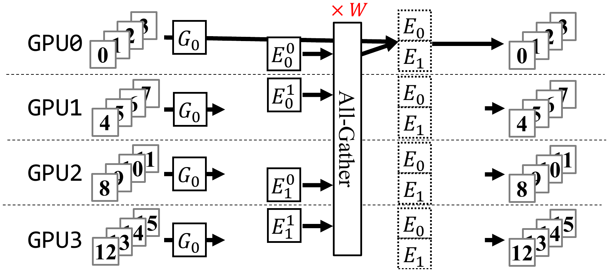

**图 6.** Tutel 中 DP 执行流程的一个示例. All-gather 在所有 ($W$) GPU 上进行.

**可切换的 EP+DP+MP ([图 7](#figure-07)):** 开箱即用时, 这种并行方法的工作方式与可切换数据并行 (Switchable DP) 相同——它们共享相同的输入读取和权重切片格式. 在内部, 这种方法不仅保证整个计算在数学上等效于数据并行 (DP), 还保证所需的计算和网络复杂度在 EP+DP+MP 的预期复杂度范围内, 如 [表 4](#table-04) 的⑦所示. 我们定义了一个控制参数 $r$, 用于指示将所有 GPU 划分为一个或多个组, 每组大小为 $\lceil(W/E)/r\rceil$, 以便 DP 在每个组内进行, 而 MP 在不同组之间进行. 具体而言, 它在执行流程开始时以 MP 的方式重复本地令牌 $r$, 最后在结束时对本地值进行对称求和. DP 仅用于在大小为 $\lceil(W/E)/r\rceil$ 的组内执行全收集操作. 请注意, 如果 $r$ 增加并达到 $W/E$, 则组大小变为 1, 因此每组内的 all-gather 通信将被优化掉. 这就是为什么 ⑦ 中的 $r\geq W/E$ 情况会额外消除一个 $\mathcal{O}(P/E/r)$. 在 [图 8](#figure-08) 中, $r$ 从 1 到 $W/E$ 的值表示可切换的 EP+DP+MP, 尽管 $r=1$ 和 $r=\lceil W/E\rceil$ 是两个特殊情况, 它们分别与 EP+DP 和 EP+MP 完全等效.

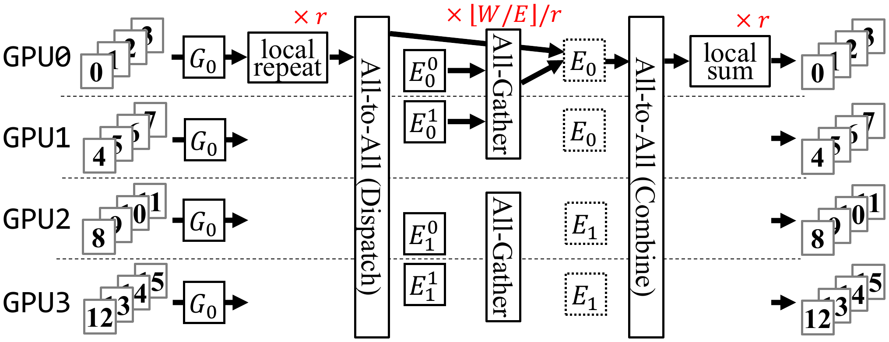

**图 7.** 在 Tutel 中 EP+DP+MP 执行流程的示例. 局部重复生成 $r$ 个门控函数结果的副本, 局部求和将 MoE 的 $r$ 个输出进行归约, 并在 $\lceil(W/E)/r\rceil$ 个 GPU 之间执行全收集操作.

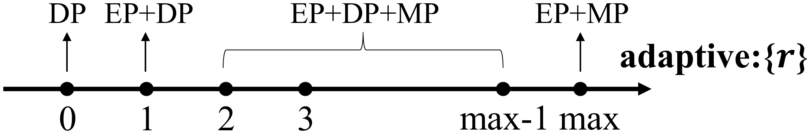

**图 8.** 使用 `adaptive:r` 指定并行方法, 其中 `max` 代表值 $\lceil W/E\rceil$, 并且所有大于该上限的 $r$ 值都被视为与 $\lceil W/E\rceil$ 相同.

### 3.2 面向 Linear 与 2DH All-to-All 的自适应流水线

本节介绍了自适应流水线的设计. 由于全对全 (All-to-All) 通信延迟对最佳流水线度有显著影响, 我们的自适应流水线同时优化流水线度和全对全算法 (线性或二维块传输). 本节仅说明如何对输入令牌进行流水线分块, 后续 [第 3.3 节](#section-3-3) 将描述我们如何联合搜索最佳流水线度和全对全通信算法.

**用于多流流水线的令牌分区.** 需要对令牌进行适当的分区, 以便在更细粒度的数据块上实现流的重叠, 这样计算和通信就可以提交到不同的 GPU 流上并行运行. 传统的分区方法如批处理拆分或流水线并行 [Hua19c] 会对层中的所有操作进行分区. 在 MoE 中, 这种方法不可行, 因为它会加剧 MoE 调度的不平衡, 并破坏 ML 功能 (如批量优先路由 [Riq21]) 的正确性. 相反, 我们建议仅对两个 All-to-All 操作以及中间的专家进行分区, 而不是整个 MoE 层, 以避免这些缺点. [图 9](#figure-09) 给出了 All-to-All-Expert 重叠中数据分区设计的 2-GPU 示例.

在前向传递中, 在每个 GPU 上, 形状为 $(E,C_{g},D)$ 的输入沿 $C$ 维度拆分成两个形状为 $(E,C_{g}/2,D)$ 的虚拟分区. 这两个虚拟分区分别记为 $C_{0}$ 和 $C_{1}$. 拆分后, 每个虚拟分区 $C_{i}$ 将被异步发送以在通信流上按照 $i$ 的顺序执行 All-to-All 操作. All-to-All 被定制为接受分隔的数据块作为输入并执行内联数据重排, 生成形状为 $(E_{g},C/2,D)$ 的输出. 接下来, 这两个 All-to-All 输出被编程以在其先前对应的 All-to-All 完成后, 在计算流上执行专家计算, 并且专家计算的输出再次被编程以在先前对应的专家计算完成后, 在通信流上执行第二个 All-to-All. 最后, 在第二次全对全之后设置了一个屏障. 在屏障之后, 各分区被合并以生成形状为 $(E,C_{g},D)$ 的最终输出.

反向传播的工作方式与前向传播类似, 不同之处在于输入变为原始输出的梯度, 计算变为专家的反向计算, 输出变为原始输入的梯度.

请注意, 所有分区和重塑操作都是由自定义操作在线完成的, 因此与无重叠情况相比, 没有额外的数据复制开销.

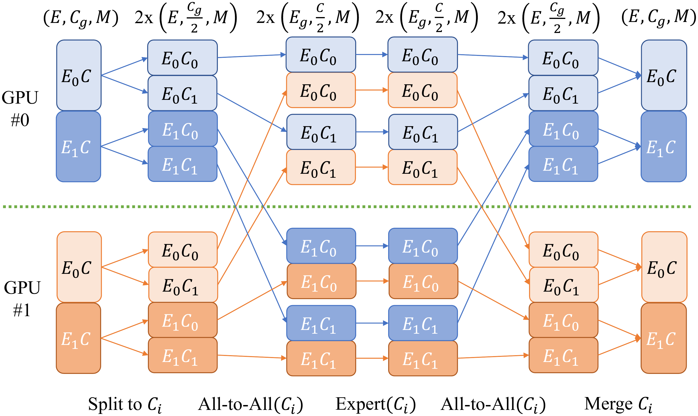

**图 9.** 2-expert-2-GPU 上的令牌分区概述, 用于 All-to-All-Expert 多流重叠. $E_i$ 表示数据被发送到第 $i$ 个 GPU 并由第 $i$ 个专家处理, 而 $C_i$ 表示数据属于容量维度的第 $i$ 个分区. 不同容量分区的 All-to-All 和专家操作可以重叠进行.

### 3.3 最优并行与流水线字典

Tutel 管理一个字典, 用于记录各种不同专家容量范围的最佳并行度和流水线配置. 具体来说, 我们将该字典定义为哈希映射: $\lfloor c/R\rfloor\to\{r^\ast,d^\ast,a^\ast\},$, 其中 $c$ 是某次迭代的容量值, $R$ 是将多个相邻 $c$ 值汇聚为同一个键的窗口大小 (默认值为 128), $\{r^\ast,d^\ast,a^\ast\}$ 是最佳配置的元组 (分别为自适应: $r$、流水线级数和全对全算法). 为了事先建立这个字典, 我们需要找到每个可能键 ($\lfloor c/R\rfloor$) 的最佳配置, 这只需少量尝试, 计算公式如下:

$$
\mathrm{trials\ per\ key}=(\log_{3/2}\lceil W/E\rceil+2)\cdot 4\cdot 2.
$$

$(\log_{3/2}\lceil W/E\rceil+2)$ 是通过三分搜索 [Wik23] 寻找 $r^\ast$ 所需的尝试次数, 因为范围 $[1,\lceil W/E\rceil-1]$ 中的 $r$ 决定了凸最优分布, 再加上针对 $r=0$ 和 $r=\lceil W/E\rceil$ 的两次额外尝试. “*4*” 是在将流水线度的搜索空间限制为 $\{1,2,4,8\}$ 时, $d^\ast$ 所需的尝试次数. 根据我们的实践, 度数大于 8 几乎不会改善计算与通信之间的重叠, 同时会显著增加全对全开销. “*2*” 指全对全算法 (线性或 2DH) 的次数.

## 4 实现

### 4.1 功能

与其他 MoE 框架相比, Tutel 在不同设备、数据类型及 MoE 相关功能的 MoE 模型训练上提供了更全面的支持, 包括 DeepSpeed MoE、Fairseq MoE 以及 FastMoE.

***动态*top-*ANY* MoE 门控.** 为了在 MoE 训练中启用多种稀疏性选项, Tutel 支持 top-ANY 路由. $k$ 值也可以在每个步骤中自定义, 以启用动态稀疏性更新, 这在一个 MoE 层的不同迭代使用其偏好的 top-$k$ 设置而不是使用相同的 $k$ 值时非常有用. 用户可以利用此功能来动态微调 MoE 层的稀疏性.

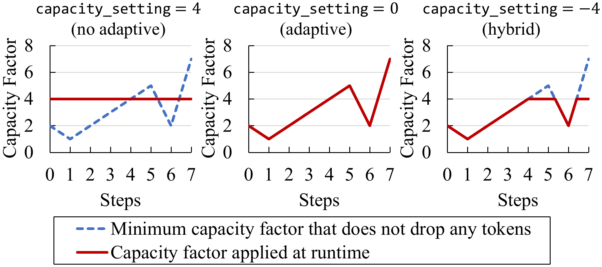

**图 10.** 当 $\texttt{capacity\_setting}$ 分别给定为 $4$、$0$ 和 $-4$ 时的动态容量因子适应示例.

***动态*容量因子.** 为了在不同的令牌不平衡情况下智能地控制容量上限, Tutel 支持在每次迭代中动态调整容量因子. 如 [图 10](#figure-10) 所示, 调整行为由传递给我们 MoE 层 API 的参数 $\texttt{capacity\_setting}=x$ 控制. 如果 $x$ 为正值, 该值会直接作为 MoE 层的容量因子应用. 如果 $x$ 为零, Tutel 会自动将容量因子调整到每次迭代不丢失任何令牌的最小值. 如果 $x$ 为负值, 其工作方式与 $x$ 为零时相同, 只是 $-x$ 被设置为容量因子的上限, 即任何超出值都会被调整为 $-x$.

### 4.2 优化

**灵活的全对全.** 我们提出了一种基于传统 MPI/NCCL 全对全接口的抽象, 以确保 MoE 专家的高计算吞吐量, 无论规模大小, 这在此上下文中称为 *灵活全对全*. 现有的全对全将张量布局从 $(E,C_{g},D)$ 转换为 $(W,E_{g},C_{g},D)$, 其中 $C_{g}$ 依赖于 $W$, 这会影响随后专家矩阵乘法的效率. 相反, 我们将输出布局转换为 $(E_{g},C,D)$, 以确保在任何规模下进行相同形状的矩阵乘法 ($W$). [图 11](#figure-11) 比较了传统全对全和灵活全对全之间的专家计算吞吐量.

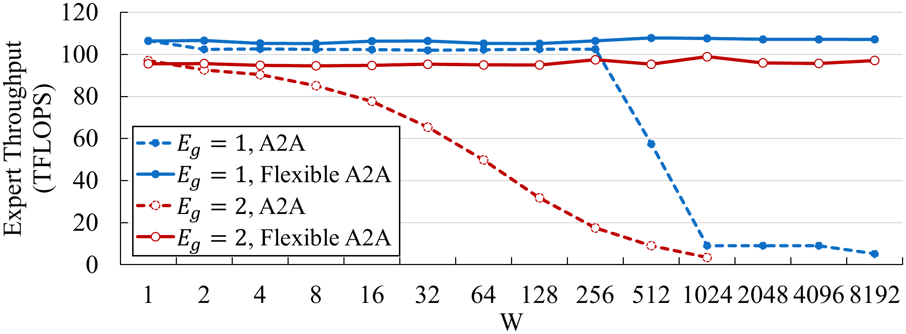

**图 11.** 基于 A2A (全对全) 布局和灵活 A2A 布局的专家计算吞吐量.

**内核优化: 快速编码和解码.** 根据 GShard [Lep20], 现有的 MoE 分发和组合实现需要多个 einsum 和矩阵乘法操作. Tutel 通过使用 SIMT 高效的稀疏操作对其进行了深度优化, 我们称之为 *快速编码和解码*. 正如 [图 15](#figure-15) 所示, 它在很大程度上减少了非专家计算的延迟. 这种优化也节省了 GPU 内存, 在大多数情况下实现了 $20\%\sim 90\%$ 内存节省. 有关快速编码和解码的更多细节, 请参见 [第 8 节](#section-8).

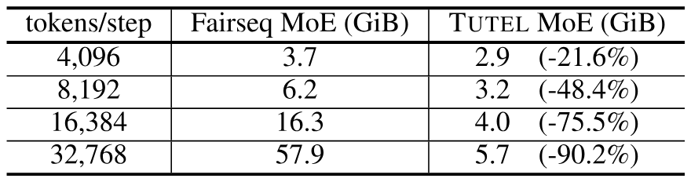

**表 5.** 单个 MoE 层的 GPU 内存成本. (静态设置: $D=H=4096$, top-$k$ = 2, $E_g$ = 2)

## 5 评估

**测试平台.** 如果未指定, 所有实验均使用 Azure Standard_ND96amsr_A100_v4 虚拟机 [Ndm23]. 每台虚拟机配备 $8\times$ NVIDIA A100 SXM 80GB GPU 和 $8\times$ 200 Gbps HDR InfiniBand, 由 $96\times$ 第二代 AMD Epyc CPU 核心和 1.9 TiB 内存支持. GPU 在单台虚拟机内通过第三代 NVLink 和 NVSwitch 互连, 而不同虚拟机之间通过 1,600 Gbps InfiniBand 无阻塞网络并使用自适应路由连接.

**设置.** 作为基线, 我们默认使用 PyTorch 1.8.0 和 Fairseq moe 分支. NCCL 2.10.3-1 [Ncc23] 和 NCCL RDMA SHARP 插件 [Rdm23] 在扩展时用于通信. 我们的实验使用最多 2,048 个 A100 GPU (256 个虚拟机).

### 5.1 Tutel 自适应 MoE 评估

本节评估使用 Tutel 的自适应计算收益. 我们比较最佳并行/流水线策略的吞吐量, 并研究 Tutel 的自适应性带来的收益. 为了与现有框架进行公平比较, 在 [第 5.2 节](#section-5-2) 中, 我们仅使用一种两者都支持的特定并行方法, 将 Tutel 与 Fairseq MoE [Ott19a] 进行比较.

#### 5.1.1 自适应并行切换

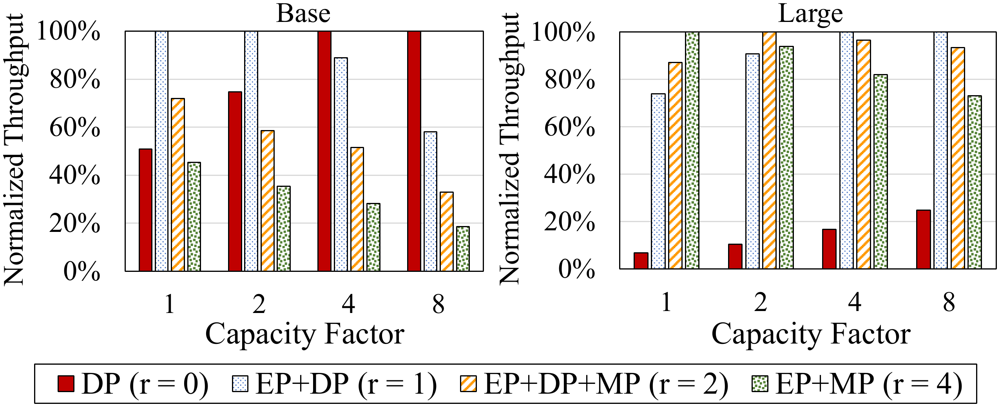

**图 12.** 在基础 (左) 和大型 (右) MoE 配置下, 不同容量因子 $f$ 的归一化吞吐量. 图中显示, 最佳并行方法取决于容量因子 $f$.

我们使用单节点评估在不同 MoE 模型设置下的自适应并行切换. [图 12](#figure-12) 比较了使用不同并行选项下的归一化吞吐量, 其中容量因子 $f$ 从 1.0 变化到 8.0. 我们测试了两种 MoE 配置: Base ($\mathrm{samples}/\mathrm{step}=4K$ 和 $H=2K$) 和 Large ($\mathrm{samples}/\mathrm{step}=1K$ 和 $H=32K$), 同时其他专家设置共享 ($E=16$、$D=2K$, 以及共 64 个 GPU). 如图所示, 最优并行方法取决于 MoE 专家配置和容量配置. 例如, 当专家容量较高时, DP ($r=0$) 往往更有利, 随着容量下降, 倾向逐渐变化为 EP+DP ($r=1$), 然后为 EP+DP+MP ($r>1$). 在相对较小规模的 MoE 配置中, 最佳并行选项通常保持在 $r=0$ 或 $r=1$, 而在更大规模的配置中, 它会在更广范围的 $r$ 值之间动态变化. 这种多样性表明通过 Tutel 存在显著的改进机会, 这会根据动态变化的 $f$ 导致不同的最佳并行方法, 如[第 3.1 节](#section-3-1) 中所解释的那样.

#### 5.1.2 自适应流水线

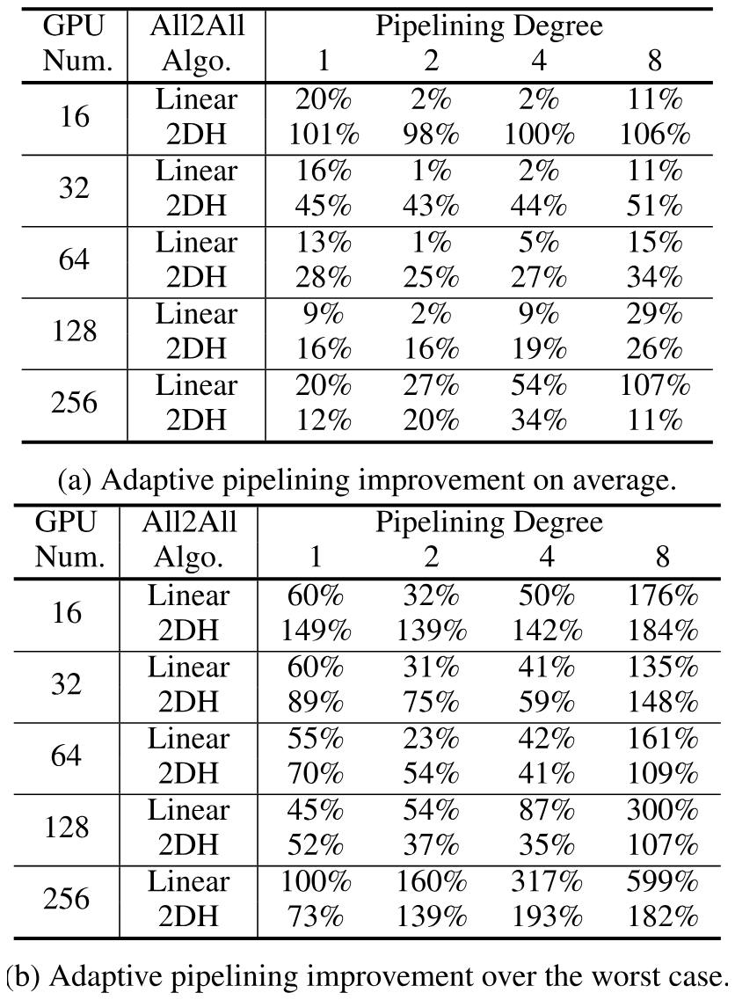

**表 6.** 自适应流水线改进. (a) 平均自适应流水线改进. (b) 针对最坏情况的自适应流水线改进.

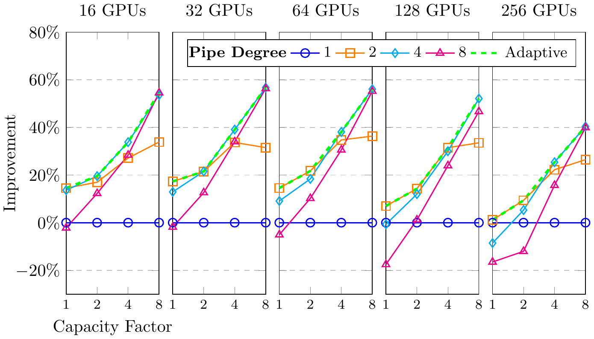

**图 13.** 根据容量因子 $f$ 的自适应流水线改进. $D=4096$、$H=4096$、$E_g=2$, 以及每步令牌数 = 4096.

我们在不同规模 ($16\sim 256$ GPU) 下, 对 243 个典型 MoE 模型设置上自适应流水线进行了评估. 我们测试了 MoE 模型配置的所有组合, 范围包括: $E_{g}\in\{0.5,1,2\}$、$D\in\{1024,2048,4096\}$、$H\in\{1024,2048,$、$4096\}$, 以及每步 $\in\{4096,16384,65536\}$ 的令牌. 为了进行比较, 我们还测量了不同静态流水线方法, 考虑不同程度 $\{1,2,4,8\}$ 以及不同的全对全算法 (线性或 2DH).

[表 6(a)](#table-06) 在这 243 个模型上显示了平均改进. 与基线方案 (流水线度 1) 和线性全对全相比, 自适应流水线在平均上实现了 $9\%\sim 101\%$ 的改进. 与不同的静态策略相比, 它也可以实现平均 $1\%\sim 107\%$ 的改进. 此外, 自适应流水线实现了显著改进, 并在最坏情况下避免了性能回退, 这显示了 $23\%\sim 599\%$ 在 [表 6(b)](#table-06) 上的改进.

我们还评估了在不同规模下不同动态工作负载下的性能提升. 我们使用不同的容量因子 $f$ 来模拟不同训练迭代中的工作负载模式. 如 [图 13](#figure-13) 所示, 自适应流水线总是选择最佳策略, 并且与基线 (流水线级别为 1) 相比, 在 $f=4$ 下可实现最高 39% 的提升, 在 $f=8$ 下可实现最高 57% 的提升.

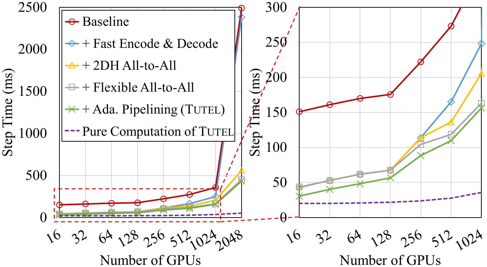

**图 14.** 单个 MoE 层改进细分. 基线是 Fairseq / DeepSpeed MoE 层.

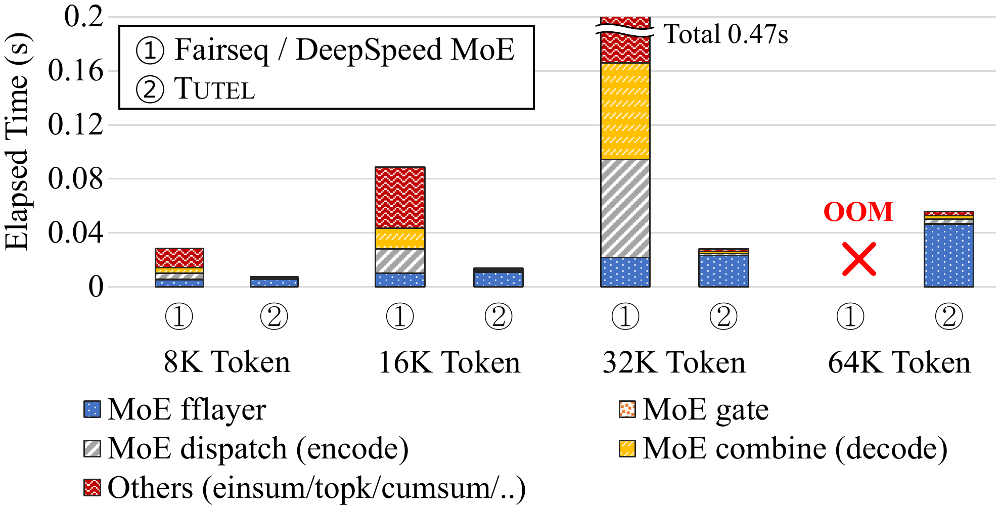

**图 15.** Tutel 与 Fairseq / DeepSpeed MoE 之间的内核计算分解比较.

### 5.2 单个 MoE 层的扩展

我们在扩展到 2,048 个 GPU 时评估单个 MoE 层的步长时间. 它使用 tokens/step = 16384, $f$ = 1, $D$ = 2048, $H$ = 2048, $E_{g}$ = 2, top-$k$ = 2, adaptive: $r$ = 1. 我们一次添加 Tutel 特性, 以研究主要收益来源, 其中 Fairseq [Ott19a] 被用作基线. 每个特性的详细实验在以下 [第 5.1 节](#section-5-1) 中提供.

以下按顺序解释 [图 14](#figure-14) 中的每条曲线. ① (红色, 圆形) Fairseq / DeepSpeed MoE 基线. Fairseq 和 DeepSpeed MoE 表现相同, 因为它们使用了等效的 MoE 层实现. ② (蓝色, 菱形) Tutel 核心 ([第 4.2 节](#section-4-2) 中的快速编码和解码) + 线性全对全. Tutel 核心优化在小规模 (16 个 GPU 上的 $3.52\times$) 带来较大收益, 而在大规模 (2,048 个 GPU 上的 $1.04\times$) 时收益较小. 使用 Tutel 内核相较于 Fairseq 的详细收益如 [图 15](#figure-15) 所示. ③ (黄色, 三角形) Tutel 核心 + 2DH 全对全. 2DH 全对全在大规模 (2,048 个 GPU 上的 $4.25\times$) 上带来显著收益. ④ (灰色, 方形) Tutel 核心 + 2DH 全对全 + 灵活全对全. 灵活的全对全在大规模上 (从 256 个 GPU 开始) 带来性能提升, 例如, 在 2,048 个 GPU 上相比不使用它的情况, $1.24\times$ 实现了提升. ⑤ (绿色, 叉号) Tutel 内核 + 2DH 全对全 + 灵活全对全 + 自适应流水线度. ⑤ 展示了通过优化流水线度与线性/2DH 全对全算法结合所带来的性能提升, 在 16 个和 2,048 个 GPU 上分别进一步实现了 $1.43\times$ 和 $1.04\times$. 随着规模增大, ⑤ 变得不那么重要, 因为切分令牌的开销对全对全效率产生了更大不利影响. 该分解不包括自适应并行切换, 因为它静态使用 adaptive: $r$ = 1, 不仅是因为这种并行性被 Fairseq MoE 官方支持, 而其他的则不支持, 还为了确保 Tutel 和 Fairseq MoE 所需的 All-to-All 通信规模完全相同, 从而公平地比较 All-to-All 的改进.

与基线相比, Tutel 最终在 16 个 GPU、128 个 GPU 和 2,048 个 GPU 上分别实现了 $\mathbf{4.96\times}$、$\mathbf{3.11\times}$ 和 $\mathbf{5.75\times}$ 的加速. 在计算-通信分解中, ⑥ (紫色, 虚线) 显示了完整 Tutel 的纯计算开销 (不包括与通信重叠的部分). 请注意, 随着规模扩大计算开销略有增加, 这不是系统开销导致的, 而是由于门控函数对总 $E_{g}\cdot W$ 专家需要更多理论计算.

### 5.3 应用于实际问题: SwinV2-MoE

我们引入 SwinV2-MoE 来验证 Tutel 在端到端训练和测试中的正确性和性能. SwinV2-MoE 是 Swin Transformer V2 [Liu21e, Liu22b] 的 MoE 版本, [Liu21e, Liu22b] 是一种最先进的计算机视觉神经网络架构, 广泛应用于各种计算机视觉问题. SwinV2-MoE 由一个密集的 Swin Transformer V2 模型构建, 每隔一个前馈层替换为 MoE 层, 但前两个网络阶段除外. SwinV2-B 模型被改编用于实验, 默认超参数为: $E=32$、top-$k=1$ 和 $f=1.0$.

#### 5.3.1 实验设置

**预训练和下游计算机视觉任务.** 我们遵循 [Liu21e] 使用 ImageNet-22K 图像分类数据集进行模型预训练, 该数据集包含 1420 万张图像和 2.2 万个类别. 除了评估预训练任务的性能 (使用每个类别随机选择 10 张图像的验证集) 外, 我们还使用 3 个下游任务评估模型的表现: 1) ImageNet-1K 微调准确率. 预训练模型在 ImageNet-1K 训练数据上进行微调, 并报告验证集上的 top-1 准确率; 2) ImageNet-1K 5-shot 线性评估 [Riq21]. 使用随机选择的 5 张训练图像训练线性分类器, 并报告验证集上的 top-1 准确率; 3) COCO 目标检测 [Lin14a]. 预训练模型在 COCO 目标检测训练集上使用级联 Mask R-CNN 框架 [Liu21e] 进行微调, 并报告验证集上的框/掩码 AP.

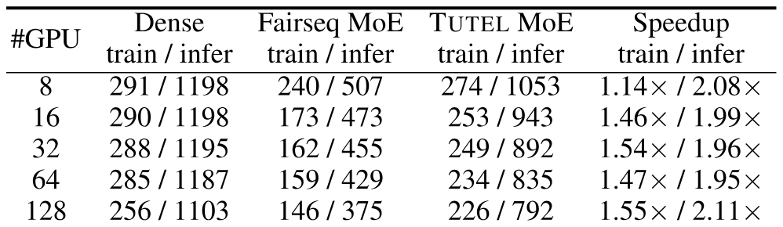

**表 7.** 比较使用 Fairseq 和 Tutel 时 SwinV2-MoE 的训练和推理速度 (每秒图像数).

#### 5.3.2 实验结果

**速度比较.** [表 7](#table-07) 使用 Fairseq 和 Tutel 比较了 SwinV2-MoE 的训练和推理速度. 对于所有 GPU 数量, 从 8 到 128 (每个 GPU 1 个专家), Tutel 在训练和推理方面都明显比 Fairseq 更快. 每次迭代的加速分别为训练中的 $1.14\times\sim\mathbf{1.55\times}$ 和推理中的 $1.95\times\sim\mathbf{2.11\times}$.

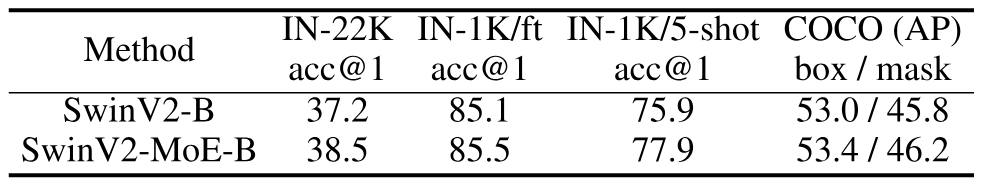

**表 8.** 比较稀疏 SwinV2-MoE-B 模型与其密集对应模型 SwinV2-B 在预训练和微调阶段的准确性.

**准确率比较.** 我们报告了 SwinV2-MoE-B 在预训练和下游任务上的结果, 并与对应的稠密模型进行了比较, 如 [表 8](#table-08) 所示. SwinV2-MoE-B 在 ImageNet-22K 预训练任务上取得了 38.5% 的 top-1 精度, 比对应的稠密模型高出 1.3%. 它在下游任务上也取得了更高的精度: 在 ImageNet-1K 图像分类上获得 85.5% top-1 精度, 在 5-shot ImageNet-1K 分类上获得 77.9% top-1 精度, 在 COCO 目标检测上获得 53.4/46.2 的 Box/Mask AP, 分别比使用稠密模型高出 0.4%、2.0% 和 0.4/0.4 的 Box/Mask AP. 特别地, 这是稀疏 MoE 模型首次被应用并证明在 COCO 目标检测这一重要的下游视觉任务中具有优势.

## 6 结论

在本文中, 我们从系统角度分析了 MoE 中关键的*动态*特性, 并设计了面向 MoE 的*自适应*系统 Tutel 来解决由此产生的问题. Tutel 主要包含两个方面: 用于优化专家执行的自适应并行, 以及用于解决 MoE 层中低效且不可扩展的分派/合并操作的自适应流水线. 我们在拥有 2,048 块 GPU 的 Azure A100 集群上评估了 Tutel, 单个 MoE 层最高可加速 $5.75\times$. Tutel 支持训练和推理实际的先进深度学习模型. 作为示例, 本文介绍了使用 Tutel 开发 SwinV2-MoE 的实践, 结果表明, 在计算机视觉任务中, MoE 比对应的稠密模型更有效.

## 致谢

我们感谢我们的导师郑连民的反馈, 以及 MLSys'23 的匿名评审的意见.

## 7 二维分层 (2DH) All-to-All

本节描述了 2DH All-to-All, 这是 Tutel 提出的一种新型 All-to-All 算法.

### 7.1 动机: 小消息传输

大多数流行的深度学习框架 [Dee23, Ott19a, Ser18, Pas19]利用 NCCL [Ncc23a]、[+4] 等最先进的 GPU 集合通信库的点对点 (P2P) API 来实现 *Linear* 全对全算法 (见 [算法 1](#algorithm-01)). 它在 $n$ 个 GPU 上运行, 每个 GPU 将其总共 $S$ 字节的数据拆分为 $n$ 个块 (每块 $S/n$ 字节), 并与所有其他 GPU 进行 P2P 通信. 在扩展规模时 (更大的 $n$), 任意两个 GPU 之间传输的 P2P 块大小 $S/n$ 会变小, 因此很难充分利用如 NVLink 和 HDR InfiniBand 等高速链路 (见[图 16](#figure-16)). $S$ 是固定的, 只由模型本身决定.

### 7.2 方法与挑战

为了实现高链路带宽, 我们的方法是将从多个本地 GPU 发送到同一远程 GPU 的多个数据块进行聚合. 这通过将小的数据块合并成一个大块, 避免了在网络上传送多个小消息, 从而显著提高了链路带宽的利用率.

不幸的是, 由于聚合小消息的开销, 在大规模上高效实现这种方法是具有挑战性的. 具体来说, 要在具有本地 GPU 的节点内聚合数据块, 节点中的所有 GPU 需要彼此交换数据块. 这相当于执行等于数据块大小的节点内全对全操作, 如图所示, 是朴素本地聚合全对全的阶段 1. 由于数据块大小不依赖于其他因素, 因此预期这种节点内全对全过程的延迟是恒定的, 但出乎意料的是, 随着节点扩展, 该延迟实际上会增加, 这是由于 GPU 上的非连续内存访问次数增加所导致的. 例如, 在本地聚合的第 1 阶段, 节点内的 GPU 彼此交换非连续的数据块两次 (01 和 05,02 和 06 等), 这会在每个 GPU 上引发 $\mathcal{O}(\frac{n}{m})$ 的非连续内存访问. 具体来说, 当 $S=128\,\mathrm{MiB}$ 和 $m=8$ 时, 我们观察到, 节点内的全对全 (All-to-All) 进程在 $n=8$ 上需要 $\sim 600\,\mu\mathrm{s}$, 并在 $n=2048$ 上增加到 $\sim 5\,\mathrm{ms}$.

### 7.3 算法

为避免非连续内存访问带来的性能下降, 2DH 全对全增加了若干阶段, 通过高效的跨步内存复制, 将非连续数据块对齐到连续地址空间. [图 17](#figure-17) 按顺序展示了 2DH 全对全的全部阶段. 朴素本地聚合会从一开始就执行节点内全对全; 我们则先通过跨步内存复制, 对齐目标为同一块本地 GPU 的数据块 (阶段 1), 再执行节点内全对全 (阶段 2). 随后再次对齐目标为同一块远程 GPU 的数据块 (阶段 3), 最后执行节点间全对全 (阶段 4). 借助跨步内存复制, 2DH 全对全实现了较高的内存带宽利用率, 且前三个阶段的延迟始终较低, 不随 $n$ 变化. 当 $S/n$ 变小 (即数据大小 $S$ 较小或 GPU 数量 $n$ 较多) 时, 2DH 全对全相较既有算法的优势会进一步扩大. 此外, 它还能避免跨 rail 通信, 因而也适用于 rail-optimized InfiniBand 网络.

**算法 1: 使用点对点 API 的线性全对全通信.**

- **程序** $\operatorname{All2All\_Linear}(\mathit{output},\mathit{input})$:
  - $n\leftarrow\mathit{ngpus}$, $S\leftarrow\operatorname{sizeof}(\mathit{input})$.
  - $\mathit{chunksize}\leftarrow S/n$.
  - **对于** $r=0;\ r<n;\ r{+}{+}$:
    - $\mathit{loc}\leftarrow r\times\mathit{chunksize}$, $\mathit{peer}\leftarrow r$.
    - $\operatorname{ncclSend}(\mathit{input}[\mathit{loc}],\mathit{chunksize},\mathit{peer})$.
    - $\operatorname{ncclRecv}(\mathit{output}[\mathit{loc}],\mathit{chunksize},\mathit{peer})$.

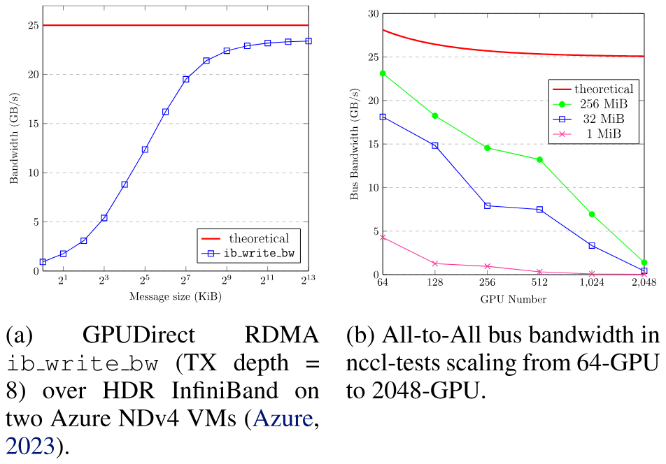

**图 16.** 用于小消息的带宽未充分利用. (a) 在两台 Azure NDv4 虚拟机 [Mic23] 上通过 HDR InfiniBand 的 GPUDirect RDMA `ib_write_bw` (TX 深度 = 8). (b) nccl-tests 中从 64-GPU 到 2048-GPU 扩展的全对全总线带宽.

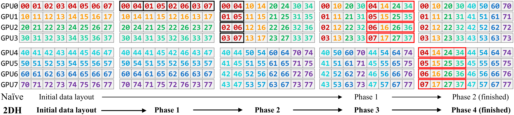

**图 17.** 在朴素本地聚合全对全和二维分层 (2DH) 全对全的每个阶段的数据布局示例. 在此示例中, 有两个节点, 分别由 GPU 0-3 和 GPU 4-7 组成.

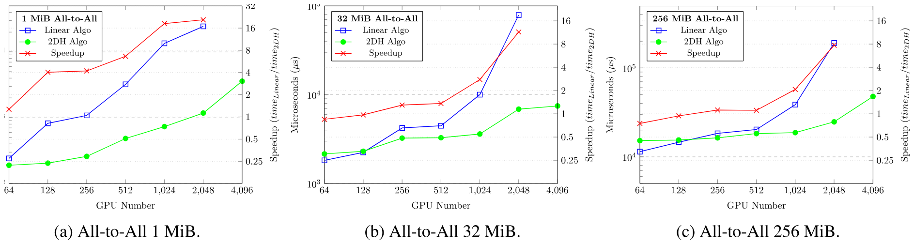

**图 18.** 在 NCCL 中不同大小下线性与二维分层 (2DH) 全对全算法的比较. (a) 全对全 1 MiB. (b) 全对全 32 MiB. (c) 全对全 256 MiB.

### 7.4 使用 MSCCL 优化

**使用 NCCL API 的实现.** 我们使用 NCCL 的 ncclSend 和 ncclRecv API 实现 2DH 全对全算法 (详情见 [算法 2](#algorithm-02)). 它包括两个步骤. 第一步对应 [图 17](#figure-17) 中的 $1\sim 3$ 阶段, 包括节点内的全对全通信和两次跨步内存拷贝, 其延迟仅依赖于 $S$. 第二步对应 [图 17](#figure-17) 中的第 4 阶段, 是节点间全对全, 其延迟依赖于 $n/m$, 而不是 $n$, 因为本地数据块已经合并.

**通过 MSCCL 优化.** 使用 NCCL API 的实现需要在 2DH 全对全的不同阶段之间增加额外的同步屏障, 并可能导致吞吐量下降. 为了实现更好的性能, 我们通过在领域专用语言 (DSL) 中描述 2DH 算法并使用编译器 [Cow23] 进行优化, 来利用 MSCCL. 该自定义编译器还利用了用于全对全的 LL128 协议 [Ll20], 在低延迟场景 (如小规模全对全) 中, 其效率可能优于基于默认 NCCL 的实现.

**扩展.** 在现有的 GPU 集群上, 本地 GPU 数量 $m$ 通常为 8 或 16, 这使得在扩展 All-to-All 到数十万 (100 K) GPU *在百亿亿次级规模下* 时, $\frac{n}{m}$ 仍然很大. 下一代 NVSwitch [Nvl14] 支持通过高速 NVLink 连接多达 256 个 GPU, 并使得使用 $m=256$ 进行 2DH All-to-All 扩展成为可能. 对于像 dragonfly [Kim08] 这样的超大规模网络拓扑, 可以根据网络层次将节点间的 All-to-All 拆分为组内和组间 All-to-All, 从而进一步将 2DH All-to-All 适配为 3D.

**算法 2: 二维分层 (2DH) 全对全.**

- **程序** $\operatorname{StrideMemcpy}(\mathit{output},\mathit{input},\mathit{chunksize},\mathit{row},\mathit{col})$:
  - **对于** $i=0;\ i<\mathit{row}\times \mathit{col};\ i{+}{+}$:
    - $j\leftarrow i\bmod \mathit{row}\times \mathit{col}+i/\mathit{col}$.
    - $\mathit{output}[j\times \mathit{chunksize}:(j+1)\times \mathit{chunksize}]\leftarrow \mathit{input}[i\times \mathit{chunksize}:(i+1)\times \mathit{chunksize}]$.
- **程序** $\operatorname{All2All\_2DH}(\mathit{output},\mathit{input})$:
  - 步骤 1: 节点内全对全.
  - $\operatorname{StrideMemcpy}(\mathit{buffer},\mathit{input},\mathit{chunksize},\mathit{ngpus\_per\_node},\mathit{nnodes})$.
  - **对于** $g=0;\ g<\mathit{ngpus\_per\_node};\ g{+}{+}$:
    - $\mathit{loc}\leftarrow g\times \mathit{nnodes}\times \mathit{chunksize}$, $\mathit{peer}\leftarrow g+\mathit{node\_rank}\times \mathit{ngpus\_per\_node}$.
    - $\operatorname{ncclSend}(\mathit{buffer}[\mathit{loc}],\mathit{nnodes}\times \mathit{chunksize},\mathit{datatype},\mathit{peer},\mathit{comm})$.
    - $\operatorname{ncclRecv}(\mathit{output}[\mathit{loc}],\mathit{nnodes}\times \mathit{chunksize},\mathit{datatype},\mathit{peer},\mathit{comm})$.
  - $\operatorname{StrideMemcpy}(\mathit{buffer},\mathit{output},\mathit{chunksize},\mathit{nnodes},\mathit{ngpus\_per\_node})$.
  - 步骤 2: 节点间全对全.
  - **对于** $n=0;\ n<\mathit{nnodes};\ n{+}{+}$:
    - $\mathit{loc}\leftarrow n\times \mathit{ngpus\_per\_node}\times \mathit{chunksize}$, $\mathit{peer}\leftarrow \mathit{local\_rank}+n\times \mathit{ngpus\_per\_node}$.
    - $\operatorname{ncclSend}(\mathit{buffer}[\mathit{loc}],\mathit{ngpus\_per\_node}\times \mathit{chunksize},\mathit{datatype},\mathit{peer},\mathit{comm})$.
    - $\operatorname{ncclRecv}(\mathit{output}[\mathit{loc}],\mathit{ngpus\_per\_node}\times \mathit{chunksize},\mathit{datatype},\mathit{peer},\mathit{comm})$.

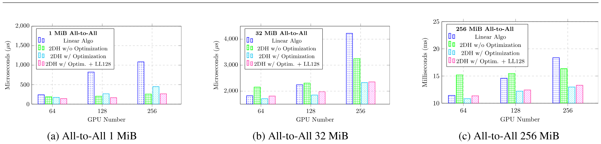

**图 19.** NCCL 与优化实现 [Cow23] 运行 2DH 全对全算法的比较. (a) 全对全 1 MiB. (b) 全对全 32 MiB. (c) 全对全 256 MiB.

### 7.5 评估

我们在 nccl-tests [Ncc23b] 中对 alltoall_perf 进行基准测试, 以测量 All-to-All 操作的性能和正确性. 实验设置如 [第 5 节](#section-5) 所述. All-to-All 的大小从 1 KiB 开始, 到 16 GiB 结束, 乘法因子为 2. 通过具有适当 NUMA 绑定的 OpenMPI 启动测试. 所有 All-to-All 操作都是非原地操作, 并且正确性也由 nccl-tests 进行检查. 我们比较了不同算法和不同实现之间我们感兴趣的特定大小的延迟.

为了说明所提出的 2DH 全对全算法的可扩展性, 我们将其与同一集群中的最先进 NCCL 全对全算法进行了比较. 在 nccl-tests [Ncc23b] 中, alltoall_perf 默认使用线性全对全算法, 而我们也在 nccl-tests 中实现了 2DH 全对全算法以替换原有算法. 我们将实验规模从 64 GPU 扩展到 4096 GPU. 如 [图 18](#figure-18) 所示, 所提出的 2DH 算法具有比原线性算法更好的可扩展性和更低的梯度开销. 对于小规模数据 (1 MiB), 2DH 算法从小规模开始就可以实现更低延迟. 对于较大规模数据 (32 MiB 和 256 MiB), 由于额外的数据拷贝, 2DH 算法的延迟较高. 然而, 随着 GPU 数量的增加, 2DH 算法能够表现更好. 因此, 需要在线性算法和 2DH 算法之间进行动态适配. 此外, 在我们的实验中, 2DH 算法可以扩展到 4096 GPU, 而我们并没有在如此大规模上成功运行 NCCL 的线性算法.

我们还研究了使用自定义编译器 [Cow23] 的性能提升. 如 [图 19](#figure-19) 所示, 优化后的实现比使用 NCCL 的 API 的实现获得了更好的结果. 例如, 在 64 GPU 上 256 MiB 大小的情况下, NCCL 实现的 2DH 算法延迟更高, 但使用优化后的实现仍然可以优于 NCCL 中的线性算法. 此外, LL128 协议在小尺寸 (1 MiB 和 32 MiB) 下延迟较低, 而默认协议在大尺寸 (256 MiB) 下表现更好. 因此, 在此优化下, 不同协议之间的动态适应是必要的.

## 8 SIMT 高效的快速编码与解码

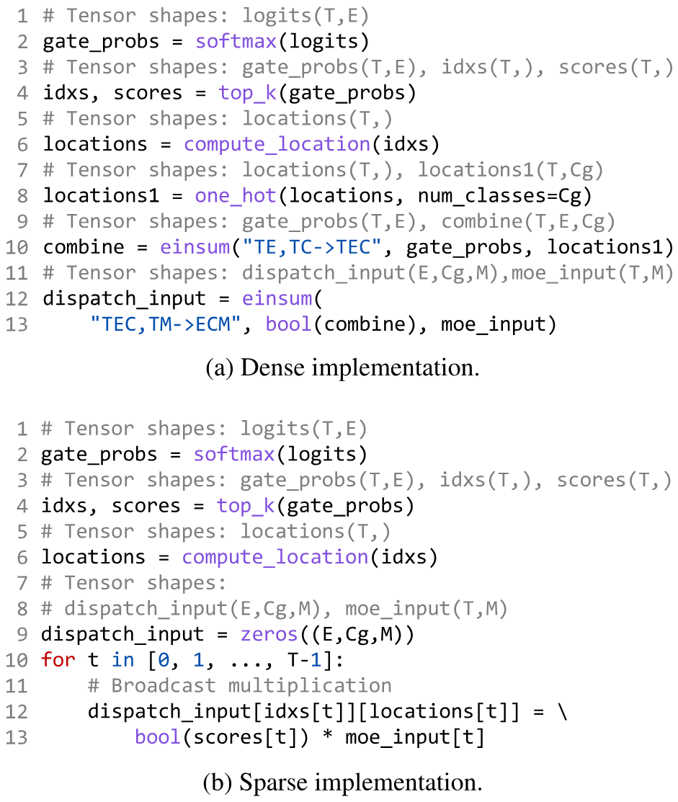

**图 20.** 在从 MoE 层输入 (`moe_input`) 和门函数输出 (`logits`) 生成 All-to-All 分发输入 (`dispatch_input`) 的稠密和稀疏实现之间的比较. (a) 密集实现. (b) 稀疏实现.

Tutel 对 *encode* (在 MoE 调度期间从 MoE 层输入生成 All-to-All 输入) 和 *decode* (在 MoE 合并期间从 All-to-All 输出生成 MoE 层输出) 阶段的 MoE 层实现了复杂的优化. 现有的 encode 和 decode 实现需要具有较高时间复杂度的 einsum 操作, 如 GShard [Lep20] 所述, 并在 Fairseq [Ott19a] 中实现. 例如, [图 20(a)](#figure-20) 显示了 encode 实现中最耗费计算的部分 (decode 类似于 encode, 因为它是 encode 的反向操作). 我们观察到, 该实现不必要地稠密, 因为它包含许多零乘法和加法. Tutel 通过 [图 20(b)](#figure-20) 所示的稀疏实现解决了这个问题. 考虑到 $T$ 是每个专家的输入令牌数量, 而稠密版本的时间复杂度为 $O(T\cdot E\cdot C_{g}\cdot D)$, 稀疏版本的时间复杂度仅为 $O(T\cdot k\cdot D)$, 其中在大多数情况下为 $T\cdot k=E\cdot C_{g}$. 这表明稀疏版本的时间复杂度仅为稠密版本的 $1/T$.

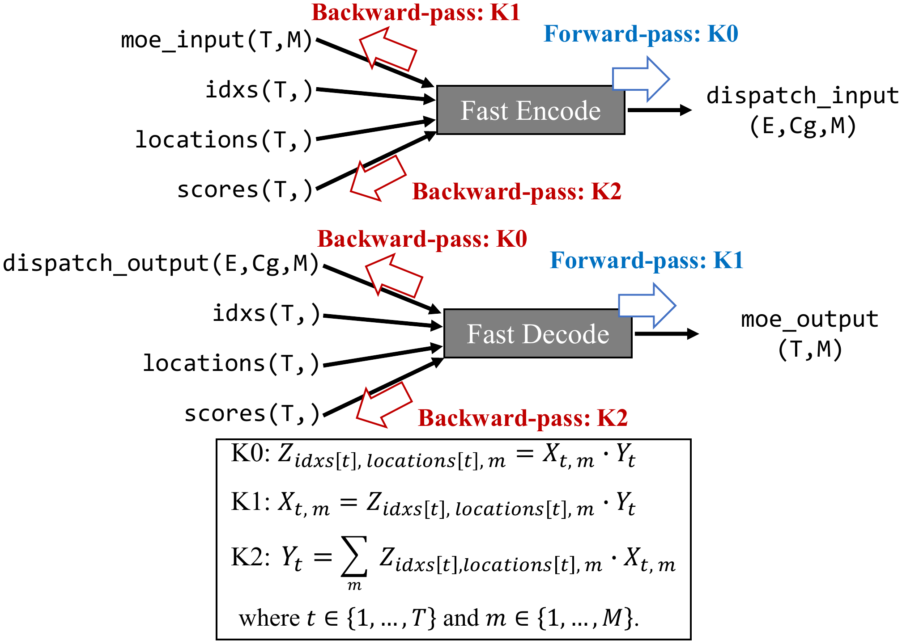

**图 21.** 快速编码和快速解码算子的前向和后向计算. 括号表示张量形状. X、Y 和 Z 的张量形状分别为 $(T,D)$、$(T,)$ 和 $(E,C_g,D)$. `idxs` 和 `locations` 没有后向计算, 因为它们不是可训练的输入.

不幸的是, 为稀疏实现实现高效的 GPU 内核具有挑战性. 虽然稠密计算可以通过矩阵乘法加速器 (例如, Tensor 核心) 显著加速, 但稀疏计算无法高效利用这些加速器. [+5]

为了解决这个问题, 我们基于三个特别设计的 GPU 内核 K0、K1 和 K2 实现了可微分的快速编码和解码操作, 如 [图 21](#figure-21) 所示. Tutel 通过始终将维度 $T$ 的不同索引分配给不同的线程数组 (或 *warps*) 来加速这些内核, 从而确保沿维度 $M$ 对单个令牌的计算是 SIMT 高效的. 通过这种方法, 我们的稀疏计算实际上可以利用仅适用于稠密计算的各种优化, 例如 warp 洗牌、Blelloch 扫描算法以及低精度计算的元素向量化 (例如使用 half2 类型进行半精度计算). 汇总所有内核优化, Tutel 极大地最小化了编码和解码的延迟, 如 [图 15](#figure-15) 所示, 同时也大大节省了 GPU 内存. 如 [表 9](#table-09) 所示, 在大多数情况下, 它可以实现 $20\%\sim 90\%$ 的内存节省. Tutel 为这些优化计算提供了两个接口: `moe.fast_encode` 被 MoE 调度使用, `moe.fast_decode` 被 MoE 合并使用.

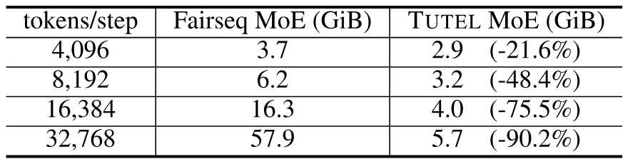

**表 9.** 单个 MoE 层的 GPU 内存成本. (静态设置: $D=H=4096$, top-$k$ = 2, $E_g$ = 2)

## 9 更多 SwinV2-MoE 结果

### 9.1 如何在 COCO 目标检测上微调?

以前的 MoE 模型在计算机视觉上仅使用图像分类任务进行实验 [Riq21]. 目前尚不清楚稀疏的 MoE 模型在下游计算机视觉任务 (例如 COCO 目标检测) 上的表现是否也很好.

如 [表 10](#table-10) 所示, 直接微调会导致性能下降, 与对应的稠密模型相比, 框/掩码 AP 分别下降了 -1.7/-1.4. 我们发现, 在微调中固定所有 MoE 层可以缓解性能下降问题, 并且通过这一策略我们获得了框/掩码 AP 分别提高 +0.4/+0.4.

还请注意, 这是稀疏 MoE 模型首次在 COCO 目标检测这一重要计算机视觉任务上适用且表现优越. 我们希望 Tutel 能赋能更多下游 AI 任务.

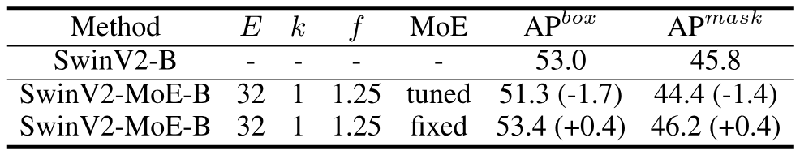

**表 10.** COCO 目标检测的结果. “固定” MoE 表示在微调中 MoE 层被固定.

**表 11.** SwinV2-MoE 模型与其密集对应物 [Liu22b] 的比较. 稀疏 MoE 模型是通过将每隔一层的 FFN 替换为 MoE 层得到的. $E$ 表示 MoE 层中的专家数量. $k$ 表示每个令牌选择的专家数量. $f$ 表示容量因子. “训练速度”和“推理速度”是通过训练和推理过程中每秒处理的图像数量来衡量的. 所有模型均在 ImageNet-22K 数据集上训练, 输入分辨率为 $192\times 192$. 我们报告了 ImageNet-22K 分类 (IN-22K) 的 top-1 准确率和最终训练损失, 在 ImageNet-1K 分类 (IN-1K/ft) 上的微调 top-1 准确率, 以及在 ImageNet-1K 分类 (IN-1K/5-shot) 上的五次线性评估 top-1 准确率. 还要注意, Tutel 支持多个 GPU 共享一个专家, 这使我们能够在专家数量为 8 和 16 的实验中使用 32 个 GPU.

### 9.2 消融研究

**专家数量消融实验.** [表 11](#table-11) 考察了专家数量的影响, 使用不同的模型规模 (SwinV2-S 和 SwinV2-B) 以及各种视觉任务. 可以看出,32 和 64 的表现最好, 这与以往工作 [Riq21, Du22] 中的结果一致.

**路由算法和容量因子的比较.** [图 22](#figure-22) 比较了有批量优先路由 (BPR) 和没有批量优先路由的路由方法 [Riq21]. 结果显示, BPR 方法对于计算机视觉 MoE 模型至关重要, 尤其是在较低容量因子值时. 这些结果与 [Riq21] 中报道的一致.

[表 12](#table-12) 在不同的 $k$ 和容量因子 $f$ 下消融了 SwinV2-MoE 模型的性能. 观察到 top-1 路由器具有更好的速度-准确性权衡. 我们使用 $k=1$ 和 $f=1.0$ 的默认超参数.

### 9.3 Tutel 支持的新型余弦路由器

通过 Tutel, 我们提供了更多的 MoE 基线, 以丰富算法选择, 并示范如何利用此框架进行算法创新. 一次尝试是一个新的余弦路由器, 希望通过增加模型规模来提高数值稳定性, 其灵感来自于 [Liu22b]:

$$
P=\operatorname{Softmax}\left(\frac{W\mathbf{x}\cdot M}{\|W\mathbf{x}\|\|M\|}/\tau\right),
$$

其中 $W\in\mathbb{R}^{D\times C}$ 是用于将输入令牌特征 $x\in\mathbb{R}^{C\times 1}$ 投影到维度 $D$ (默认 256) 的线性层; $M\in\mathbb{R}^{E\times D}$ 是一个参数矩阵, 每一列代表一个专家; $\tau$ 是一个可学习的温度, 其最低设置为 0.01, 以避免温度过小; $P$ 表示用于选择专家的路由分数.

我们在 [表 13](#table-13) 的初步实验表明, 当使用 32 个专家时, 余弦路由器在图像分类中的准确性与常见的线性路由器相当. 尽管目前在图像分类方面并不优越, 我们仍然鼓励 Tutel 的用户在他们的问题中尝试这一选项, 因为: 1) 它对输入的归一化效果可能在输入特征的幅度或维度变化时带来更稳定的路由; 2) 有一项同时进行的研究显示, 余弦路由器在跨语言语言任务 [Chi22a] 中更准确.

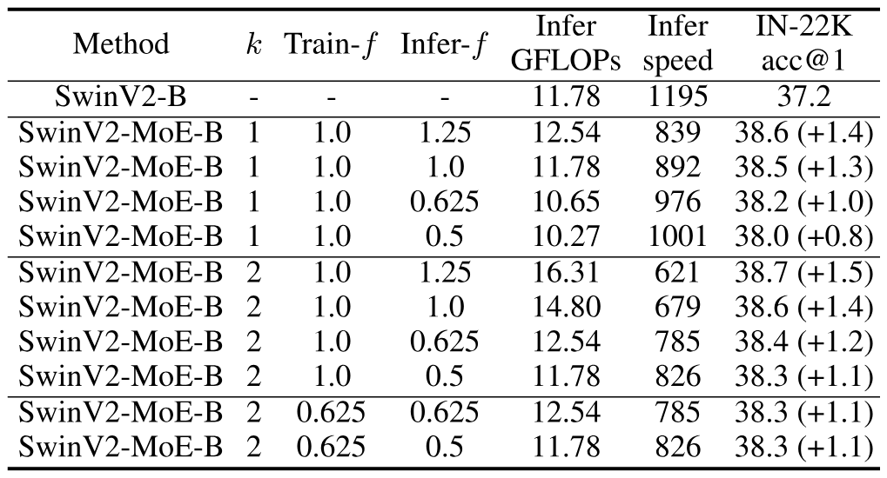

**表 12.** 对 top-$k$ 和容量因子 $f$ 的消融. “Train-$f$”和“Infer-$f$”表示训练和推理期间的容量因子. “Infer GFLOPs”和“Infer speed”表示推理期间的 GFLOPs 和实际速度 (图像/秒).

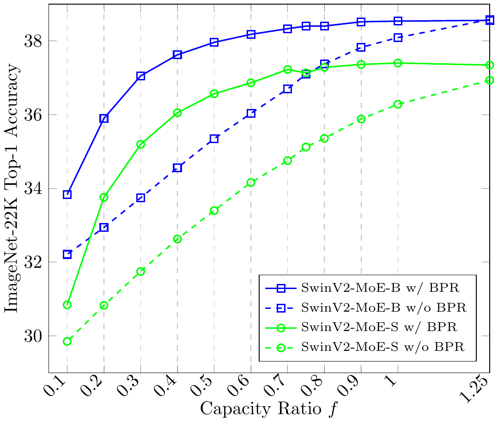

**图 22.** ImageNet-22K 在推理容量因子下的 top-1 准确率. “w/ BPR”表示使用批量优先路由训练, 而“w/o BPR”表示不使用. 所有模型均在 ImageNet-22K 数据集上使用 $E=32$、$k=1$、$f=1.25$ 训练, 并以 $192\times 192$ 的输入分辨率训练 90 个周期.

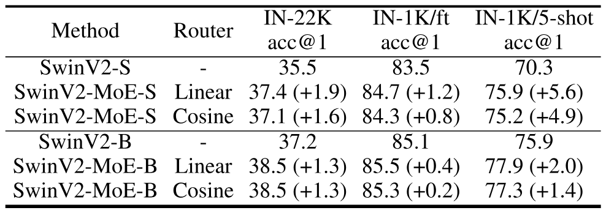

**表 13.** 线性路由器与余弦路由器的比较 ($E=32$, $k=1$, $f=1.25$).

[+1]: [https://github.com/microsoft/tutel](https://github.com/microsoft/tutel)

[+2]: 每个输入样本被划分为一个或多个令牌, 令牌的定义取决于模型的算法和任务.

[+3]: 虽然线性全对全 (Linear All-to-All) 允许所有 GPU 之间直接通信, 但二维分层 (2DH, 2-Dimensional Hierarchical) 全对全采用分层算法, 在较早阶段单独进行节点内部通信. 2DH 在更大规模下往往优于线性, 而反之亦然. 详细信息请参见 [第 7 节](#section-7).

[+4]: 消息传递接口 (MPI) [Sni98] 也开发了各种全对全 (All-to-All) 算法 [Pje07, Tha94, Bru97], 但在本工作中我们只讨论 NCCL, 因为它在大多数深度学习 (DL) 场景中优于 MPI. 注意, MPI 主要关注传统高性能计算 (HPC) 工作负载, 其中 $S$ 通常远小于 DL 工作负载.

[+5]: 即使是最新硬件 (例如第三代张量核心) 支持的稀疏性, 也无法高效工作, 因为它仅支持细粒度稀疏性, 而我们的稀疏计算属于粗粒度稀疏性 [Nvi20].
