> [Tianqi Chen](https://dblp.org/pid/94/8023-1), [Thierry Moreau](https://dblp.org/pid/87/3135), [Ziheng Jiang](https://dblp.org/pid/14/8980), [Lianmin Zheng](https://dblp.org/pid/211/7027), [Eddie Yan](https://dblp.org/pid/161/3140), [Meghan Cowan](https://dblp.org/pid/202/1675), [Haichen Shen](https://dblp.org/pid/34/8397), [Leyuan Wang](https://dblp.org/pid/165/7400), [Yuwei Hu](https://dblp.org/pid/120/1114), [Luis Ceze](https://dblp.org/pid/95/5263), [Carlos Guestrin](https://dblp.org/pid/38/769), and [Arvind Krishnamurthy](https://dblp.org/pid/k/AKrishnamurthy). 首次提交至 arXiv: February 12, 2018; 当前版本为 v3. [TVM: An Automated End-to-End Optimizing Compiler for Deep Learning](https://arxiv.org/abs/1802.04799). [原始 PDF](/paper/tvm.pdf). [TeX 源码](https://export.arxiv.org/e-print/1802.04799). 精确的印刷版式和参考文献以原始 PDF 为准.

### 摘要

对将机器学习应用到各种硬件设备的需求日益增加. 当前的框架依赖于供应商特定的算子库, 并针对狭窄范围的服务器级 GPU 进行优化. 将工作负载部署到新的平台——例如手机, 嵌入式设备和加速器 (如 FPGA, ASIC) ——需要大量手动工作. 我们提出了 TVM, 这是一种编译器, 它暴露图级和算子级优化, 从而为深度学习工作负载在各种硬件后端提供性能可移植性. TVM 解决了深度学习特有的优化挑战, 例如高级算子融合, 映射到任意硬件原语以及隐藏内存延迟. 它还通过采用一种新颖的基于学习的成本建模方法来快速探索代码优化, 从而实现低级程序对硬件特性的自动优化. 实验结果表明, TVM 在各种硬件后端上的性能与针对低功耗 CPU, 移动 GPU 和服务器级 GPU 的最先进手工调优库相当. 我们还展示了 TVM 瞄准新加速器后端的能力, 例如基于 FPGA 的通用深度学习加速器. 该系统已开源, 并在多家大型公司中投入生产使用.

## 1 引言

深度学习 (DL) 模型现在可以识别图像, 处理自然语言, 并在具有挑战性的策略游戏中击败人类. 对将智能应用部署到从云服务器到自动驾驶汽车及嵌入式设备的广泛设备的需求日益增长. 将 DL 工作负载映射到这些设备受到硬件特性多样性的复杂影响, 包括嵌入式 CPU, GPU, FPGA 和 ASIC (例如 TPU [USAa17]). 如 [图 1](#figure-01) 所示, 这些硬件目标在内存组织, 计算功能单元等方面存在差异.

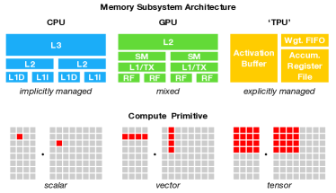

**图 1.** 类 CPU, GPU 和 TPU 的加速器需要不同的片上内存架构和计算原语. 在生成优化代码时必须解决这种差异.

当前的深度学习框架, 如 TensorFlow, MXNet, Caffe 和 PyTorch, 依赖计算图中间表示来实现优化, 例如自动微分和动态内存管理 [OSDI16, Learni15, MSRTR14]. 然而, 图级优化通常过于高层, 无法处理针对硬件后端的操作级变换. 这些框架大多专注于一类狭窄的服务器级 GPU 设备, 并将特定目标的优化委托给高度工程化且厂商特定的操作库. 这些操作级库需要大量手动调优, 因此太过专门化且不透明, 难以跨硬件设备移植. 在各种深度学习框架中支持多样化硬件后端目前需要大量的工程工作. 即便对于支持的后端, 框架也必须在以下选择之间做出艰难决定: (1) 避免生成不在预定义操作库中的新操作的图优化, (2) 使用这些新操作的未优化实现.

为了在多样化硬件后端上实现图级和操作级优化, 我们采取了一种从根本上不同的端到端方法. 我们构建了 TVM, 这是一个编译器, 它可以接收现有框架中深度学习程序的高级规范, 并为各种硬件后端生成低级优化代码. 为了吸引用户, TVM 需要提供与各种硬件后端中手工优化操作库竞争的性能. 这一目标需要解决如下所述的关键挑战.

利用特定硬件特性和抽象. 深度学习加速器引入了优化的张量计算原语 [USAa17, GPU17, USAa16], 而 GPU 和 CPU 则不断改进其处理单元. 这对生成给定操作描述的优化代码提出了重大挑战. 硬件指令的输入是多维的, 长度可以固定或可变; 它们决定了不同的数据布局; 并且对内存层次结构有特殊要求. 系统必须有效利用这些复杂的原语以获得加速优势. 另外, 加速器设计通常也倾向于更精简的控制 [USAa17], 并将大部分调度复杂性卸载到编译器栈中. 对于专用加速器, 系统现在需要生成明确控制流水线依赖关系的代码以隐藏内存访问延迟——这是一项硬件在 CPU 和 GPU 上完成的工作.

优化的巨大搜索空间 另一个挑战是生成高效代码而无需手动调整操作符. 内存访问, 线程模式和新型硬件原语的组合选择为生成代码创建了庞大的配置空间 (例如, 循环切片和顺序, 缓存, 展开), 如果我们实施黑箱自动调优, 将会产生高昂的搜索成本. 可以采用预定义的成本模型来指导搜索, 但由于现代硬件复杂性的增加, 构建准确的成本模型非常困难. 另外, 这种方法还需要我们为每种硬件类型建立单独的成本模型.

TVM 通过三个关键模块应对这些挑战. (1) 我们引入了一种张量表达语言, 用于构建算子并提供程序转换原语, 以生成具有各种优化的不同版本程序. 该层扩展了 Halide [USA13] 的计算/调度分离概念, 同时将目标硬件本征与转换原语分离, 从而支持新型加速器及其对应的新本征. 另外, 我们还引入了新的转换原语, 以解决 GPU 相关挑战并实现向专用加速器的部署. 然后, 我们可以应用不同的程序转换序列, 为给定的算子声明形成丰富的有效程序空间. (2) 我们引入了一个自动化程序优化框架, 以寻找优化的张量算子. 优化器由基于机器学习的成本模型指导, 该模型会随着从硬件后端收集到的数据增加而进行自适应改进. (3) 在自动代码生成器之上, 我们引入了一个图重写器, 可充分利用高层和算子级的优化.

通过结合这三个模块, TVM 可以从现有深度学习框架获取模型描述, 执行高低级别联合优化, 并生成硬件特定的优化代码, 用于后端, 例如 CPU, GPU 以及基于 FPGA 的专用加速器.

本文的主要贡献如下:

- $\bullet$

我们识别了在为深度学习工作负载提供跨不同硬件后端的性能可移植性时的主要优化挑战.

- $\bullet$

我们引入了利用跨线程内存复用, 新型硬件内在函数以及延迟隐藏的新调度原语.

- $\bullet$

我们提出并实现了一个基于机器学习的优化系统, 用于自动探索和搜索优化的张量操作符.

- $\bullet$

我们构建了一个端到端的编译和优化堆栈, 允许将高层框架 (包括 TensorFlow, MXNet, PyTorch, Keras, CNTK) 中指定的深度学习工作负载部署到多种硬件后端 (包括 CPU, 服务器 GPU, 移动 GPU 和基于 FPGA 的加速器). 开源的 TVM 已在几家大型公司中投入生产使用.

我们在服务器级 GPU, 嵌入式 GPU, 嵌入式 CPU 和自定义通用 FPGA 加速器上使用真实工作负载评估了 TVM. 实验结果显示 TVM 在不同后端之间提供了可移植性能, 并实现了 1.2$\times$ 到 3.8$\times$ 的加速, 相比基于手工优化库的现有框架.

## 2 概述

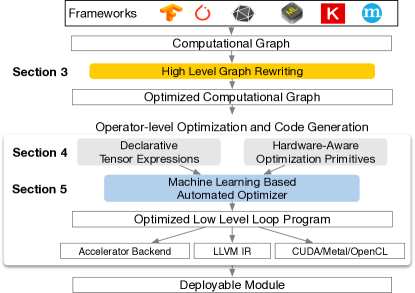

**图 2.** TVM 系统概述. 当前的技术栈支持多种深度学习框架和交换格式的描述, 如 CoreML 和 ONNX, 以针对主要 CPU, GPU 及专用加速器.

本节通过示例介绍 TVM 的组成部分. [图 2](#figure-02) (#figure-02) 总结了 TVM 中的执行步骤及其对应的论文部分. 系统首先将现有框架中的模型作为输入, 并将其转换为计算图表示. 然后执行高层数据流重写以生成优化的图. 算符级优化模块必须为图中每个融合算符生成高效的代码. 算子在声明式张量表达式语言中指定; 执行细节未具体说明. TVM 识别了一组针对特定硬件目标的代码优化. 可能的优化空间很大, 因此我们使用基于机器学习的成本模型来寻找优化的算子. 最后, 系统将生成的代码打包到可部署模块中.

#### 终端用户示例.

只需几行代码, 用户就可以从现有深度学习框架中提取模型, 调用 TVM API 来获得可部署模块:

![\[无标题图片\]](./tvm/source-x3.png)

该编译运行时模块包含三个部分: 最终优化的计算图 (图) , 生成的运算符 (lib) 和模块参数 (参数). 这些组件随后可用于将模型部署到目标后端:

![\[无标题图片\]](./tvm/source-x4.png)

TVM 支持多种部署后端语言, 如 C, Java 和 Python. 本文其余部分将介绍 TVM 的架构, 以及系统程序员如何将其扩展以支持新的后端.

## 3 优化计算图

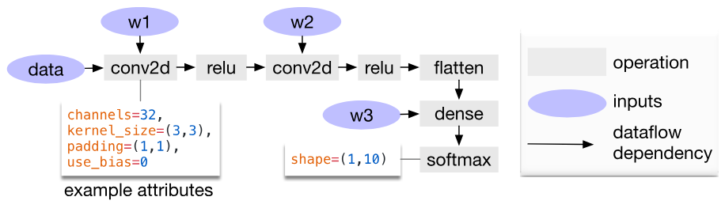

**图 3.** 两层卷积神经网络的计算图示例. 图中的每个节点代表一个消耗一个或多个张量并产生一个或多个张量的操作. 张量操作可以通过属性参数化以配置其行为 (例如填充或步幅).

计算图是表示深度学习框架中程序的一种常见方式 [OSDI16, NIPSa12, Learni15, MSRTR14]. [图 3](#figure-03) 显示了一个两层卷积神经网络的计算图表示示例. 与低级编译器中间表示 (IR), 如 LLVM, 相比, 这种高级表示的主要区别在于中间数据项是大型的, 多维的张量. 计算图提供了操作的全局视图, 但它们避免指定每个操作必须如何实现. 像 LLVM IR 一样, 计算图可以转换为功能等价的图以应用优化. 我们还利用常见深度学习工作负载中的形状特性来针对一组固定的输入形状进行优化.

TVM 利用计算图表示来应用高级别优化: 节点表示对张量或程序输入的操作, 边表示操作之间的数据依赖关系. 它实现了许多图级优化, 包括: 操作符融合, 将多个小操作融合在一起; 常量折叠, 预先计算可以静态确定的图部分, 从而节省执行成本; 静态内存规划过程, 预先分配内存以保存每个中间张量; 以及数据布局转换, 将内部数据布局转换为对后端友好的形式. 我们现在讨论操作符融合和数据布局转换.

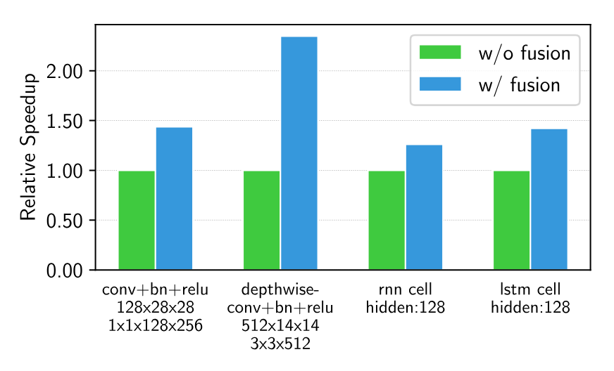

**图 4.** 融合操作与非融合操作的性能比较. TVM 同时生成这两种操作. 在 NVIDIA Titan X 上测试.

#### 操作融合.

操作融合将多个算子合并为单个内核, 而不在内存中保存中间结果. 这种优化可以大幅减少执行时间, 特别是在 GPU 和专用加速器上. 具体来说, 我们识别出四类图算子: (1) 注入型 (单对单映射, 例如 add), (2) 归约型 (例如 sum), (3) 可复杂输出融合型 (可以融合元素级映射到输出, 例如 conv2d), 以及 (4) 不透明型 (不可融合, 例如 sort). 我们提供通用规则来融合这些算子, 如下所示. 多个注入型算子可以融合为另一个注入型算子. 归约算子可以与输入的注入型算子融合 (例如, 融合 scale 和 sum). 像 conv2d 这样的算子是可复杂输出融合的, 我们可以将元素级算子融合到其输出. 我们可以应用这些规则将计算图转换为融合版本. [图 4](#figure-04) 展示了此优化对不同工作负载的影响. 我们发现, 融合算子通过减少内存访问, 可实现高达 1.2$\times$ 到 2$\times$ 的加速.

#### 数据布局转换.

在计算图中存储给定张量有多种方式. 最常见的数据布局选择是列优先和行优先. 在实际应用中, 我们可能更倾向于使用更复杂的数据布局. 例如, 一个深度学习加速器可能会利用 $4\times 4$ 矩阵操作, 要求将数据分块为 $4\times 4$ 来优化访问局部性.

数据布局优化将计算图转换为可以在目标硬件上使用更好内部数据布局执行的图. 它首先为每个算子指定首选数据布局, 同时考虑内存层次结构所规定的约束. 如果生产者和消费者的首选数据布局不匹配, 我们接着进行适当的布局转换.

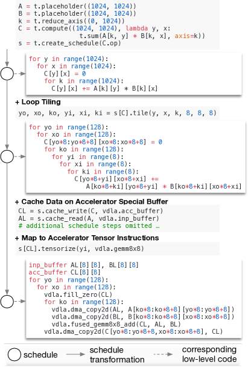

**图 5.** 在专用加速器上优化矩阵乘法的示例调度转换.

虽然高级图优化可以大幅提高深度学习工作负载的效率, 但它们的效果仅取决于操作库提供的功能. 目前, 少数支持操作融合的深度学习框架要求操作库提供融合模式的实现. 随着更多网络操作符的不断引入, 可能的融合内核数量可能急剧增加. 当针对越来越多的硬件后端时, 这种方法不再可持续, 因为所需的融合模式实现数量会随着必须支持的数据布局, 数据类型和加速器指令集的数量呈组合增长. 为程序所需的不同操作以及每个后端手工制作操作内核是不可行的. 为此, 我们接下来提出一种代码生成方法, 可以为给定模型的操作符生成各种可能的实现.

## 4 生成张量操作

TVM 通过在每个硬件后端生成许多有效实现并选择优化实现, 为每个操作符生成高效代码. 该过程建立在 Halide 将描述与计算规则 (或调度优化) 分离的思想基础上, [USA13] 并扩展以支持新的优化 (嵌套并行, 张量化和延迟隐藏) 以及广泛的硬件后端. 我们现在重点介绍 TVM 特定的特性.

### 4.1 张量表达式和调度空间

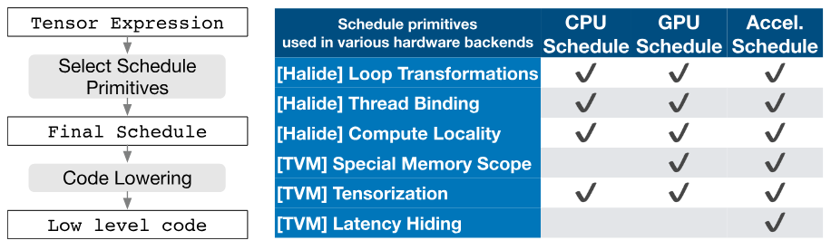

**图 6.** TVM 调度降级和代码生成过程. 表格列出了用于针对 CPU, GPU 和加速器后端优化调度的现有 Halide 和新型 TVM 调度原语. 张量化对于加速器至关重要, 但它也可用于 CPU 和 GPU. 特殊的内存作用域使得在 GPU 中可以实现内存复用, 并在加速器中显式管理片上内存. 延迟隐藏是 TPU 类加速器特有的.

我们引入了一种张量表达式语言以支持自动代码生成. 与高阶计算图表示不同, 后者张量运算的实现是不透明的, 每个操作都用索引公式表达式语言描述. 以下代码展示了计算换置矩阵乘法的示例张量表达式:

![\[无标题图片\]](./tvm/source-x9.png)

每个计算操作都指定输出张量的形状以及描述如何计算其每个元素的表达式. 我们的张量表达式语言支持常见的算术和数学运算, 并涵盖常见的 DL 运算符模式. 该语言未规定循环结构及许多其他执行细节, 且为为各种后端添加硬件感知优化提供了灵活性. 采用 Halide [USA13] 的解耦计算/调度原则, 我们使用调度表示从张量表达式到底层代码的特定映射. 许多可能的计划可以实现这一功能.

我们通过逐步应用基本变换 (调度原语) 来构建调度, 这些变换保持程序的逻辑等价. [图 5](#figure-05) 展示了在专用加速器上调度矩阵乘法的示例. 在内部, TVM 使用数据结构来跟踪循环结构及其他信息, 同时应用调度变换. 然后, 这些信息可以帮助生成给定最终调度的低级代码.

我们的张量表达式借鉴了 Halide [USA13], Darkroom [July14] 和 TACO [Oct17]. 其主要改进包括对下面讨论的新调度优化的支持. 为了在多种后端上实现高性能, 我们必须支持足够的调度原语, 以涵盖不同硬件后端上的多样化优化. [图 6](#figure-06) 总结了操作码生成过程以及 TVM 支持的调度原语. 我们重用 Halide 的有用原语和低级循环程序 AST, 同时引入新的原语以优化 GPU 和加速器性能. 这些新原语对于实现 GPU 的最佳性能是必要的, 并且对于加速器也是必不可少的. CPU, GPU, 类 TPU 加速器是深度学习的三类重要硬件. 本节描述了用于 CPU, GPU 和类 TPU 加速器的新优化原语, 而 [第 5 节](#S5) 解释了如何自动推导高效的调度.

### 4.2 嵌套并行与协作

并行性是提升 DL 工作负载中计算密集型内核效率的关键. 现代 GPU 提供了大规模的并行性, 要求我们将并行模式烘焙进调度转换中. 大多数现有解决方案采用一种称为*嵌套并行*的模型, 这是一种分支- 连接形式. 该模型需要一个并行调度原语来并行化数据并行任务; 每个任务还可以进一步递归地细分为子任务, 以利用目标架构的多层线程层级结构 (例如 GPU 中的线程组). 我们称这种模型为*共享- 无嵌套并行*, 因为一个工作线程无法在同一并行计算阶段内查看其兄弟线程的数据.

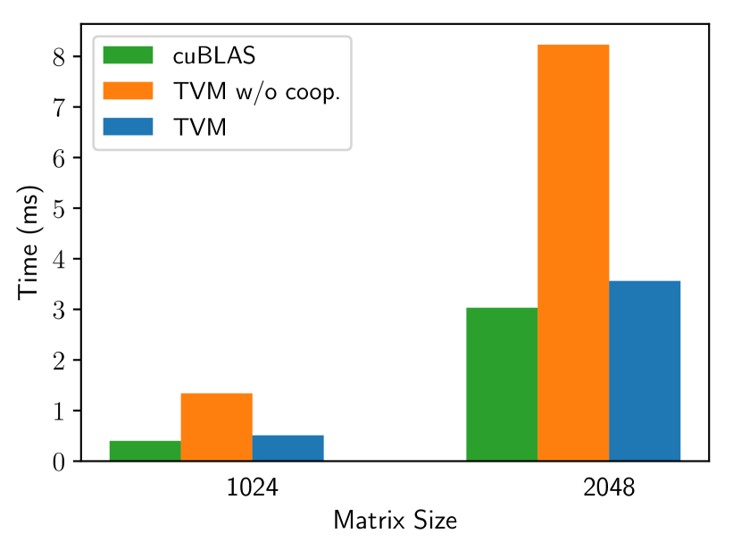

**图 7.** 矩阵乘法工作负载下, TVM 在配合共享内存获取与否的性能比较. 在 NVIDIA Titan X 上测试过.

共享无方法的替代方案是协同获取数据. 具体来说, 线程组可以协同获取所有线程所需的数据, 并将其放入共享内存空间. [+1] 这种优化可以利用 GPU 内存层级结构, 实现通过共享内存区域跨线程的数据重用. TVM 支持这一著名的 GPU 优化, 使用调度原语实现最佳性能. 以下 GPU 代码示例优化了矩阵乘法.

![\[无标题图片\]](./tvm/source-x11.png)

[图 7](#figure-07) 展示了该优化的影响. 我们在调度空间中引入了*内存作用域*的概念, 以便可以将计算阶段 (代码中的 AS 和 BS) 标记为共享. 如果没有显式的内存作用域, 自动作用域推断会将计算阶段标记为线程本地. 共享任务必须计算组内所有工作线程的依赖. 另外, 必须正确插入内存同步屏障, 以保证共享加载的数据对消费者可见. 最后, 除了对 GPU 有用之外, 内存作用域还允许我们标记特殊的内存缓冲区, 并在针对专用深度学习加速器时创建特殊的下沉规则.

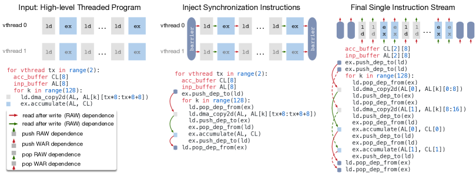

**图 8.** TVM 虚拟线程下沉将虚拟线程并行程序转换为单条指令流; 该指令流包含硬件可解释的显式低级同步, 以恢复隐藏内存访问延迟所需的流水线并行.

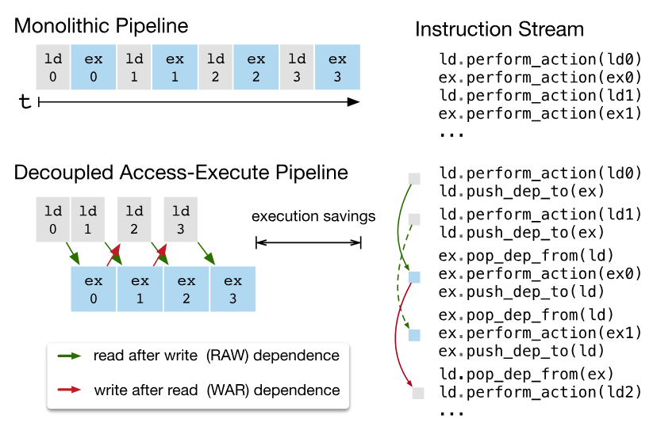

**图 9.** 硬件中的解耦访问- 执行通过允许内存与计算重叠来隐藏大部分内存访问延迟. 执行正确性由低级同步机制保证, 这种机制以依赖令牌入队/出队的形式体现, 编译器栈必须将其插入指令流中.

### 4.3 张量化

深度学习工作负载具有高算术强度, 通常可以分解为类似矩阵- 矩阵乘法或一维卷积的张量算子. 这些自然的分解方式引发了最近添加张量计算原语 [USAa17, GPU17, USAa16] 的趋势. 这些新原语为基于调度的编译带来了机遇和挑战; 虽然使用它们可以提高性能, 但编译框架必须无缝集成它们. 我们将其称为*张量化*: 它类似于 SIMD 架构的向量化, 但存在显著差异. 指令输入是多维的, 长度可以固定或可变, 并且每种输入的数据显示方式各不相同. 更重要的是, 我们不能支持固定集的原语, 因为新兴加速器会带来各自的张量指令变体. 因此, 我们需要一个*可扩展*的解决方案.

我们通过将目标硬件本征与调度分离来使张量化可扩展, 并提供张量本征声明机制. 我们使用相同的张量表达语言来声明每个新硬件本征的行为以及与之相关的降低规则. 下面的代码展示了如何声明一个 $8\times 8$ 张量硬件本征.

![\[无标题图片\]](./tvm/source-x14.png)

另外, 我们引入了一个 *tensorize* 调度原语, 用于用相应的硬件内置函数替换计算单元. 编译器将计算模式与硬件声明匹配, 并将其降级为相应的硬件内置函数.

张量化将调度与特定硬件原语解耦, 从而使扩展 TVM 以支持新硬件架构变得容易. 张量化调度生成的代码符合高性能计算的做法: 将复杂操作分解为微内核调用的序列. 我们还可以使用 *tensorize* 原语来利用手工优化的微内核, 这在某些平台上是有益的. 例如, 我们通过利用位序矩阵向量乘法微内核, 为移动 CPU 实现超低精度运算符, 操作的数据类型仅为一位或两位宽. 该微内核将结果累积到逐渐增大的数据类型中, 以最小化内存占用. 将微内核作为 TVM 的张量内置函数呈现, 相对于非张量化版本可以实现高达 1.5 倍的加速.

### 4.4 显式内存延迟隐藏

延迟隐藏是指将内存操作与计算重叠以最大化内存和计算资源利用率的过程. 根据目标硬件后端的不同, 它需要不同的策略. 在 CPU 上, 内存延迟隐藏通过同时多线程 [Sept97] 或硬件预取 [Improv90, May95] 隐式实现. GPU 则依赖于多个 warp 线程的快速上下文切换 [Berkel16]. 相比之下, 专用的深度学习加速器如 TPU [USAa17] 通常采用更精简的控制策略, 即 *解耦访问- 执行* (DAE) 架构 [USA82], 并将细粒度同步的问题交给软件处理.

[图 9](#figure-09) 展示了一个降低运行时延迟的 DAE 硬件流水线. 与单片硬件设计相比, 该流水线可以隐藏大多数内存访问开销, 并几乎完全利用计算资源. 为了实现更高的利用率, 必须在指令流中增加细粒度同步操作. 如果没有这些操作, 依赖关系将无法强制执行, 导致错误执行. 因此, DAE 硬件流水线在流水线各阶段之间需要细粒度的依赖入队/出队操作, 以保证正确执行, 如 [图 9](#figure-09) 的指令流所示.

编程 DAE 加速器需要显式的低级别同步是困难的. 为了减轻编程负担, 我们引入了一个虚拟线程调度原语, 使程序员能够像支持多线程的硬件后端一样指定高级数据并行程序. 然后, TVM 会自动将程序降低为具有低级显式同步的单条指令流, 如[图 8](#figure-08) 所示. 该算法从高级多线程程序调度开始, 然后插入必要的低级同步操作, 以保证每个线程内的正确执行. 接下来, 它将所有虚拟线程的操作交错到单条指令流中. 最后, 硬件恢复指令流中低级同步规定的可用流水线并行性.

#### 延迟隐藏的硬件评估.

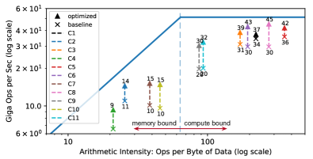

**图 10.** 基于 FPGA 的深度学习加速器运行 ResNet 推理的屋顶线. 通过 TVM 启用延迟隐藏, 基准测试的性能更接近屋顶线, 显示出更高的计算和内存带宽效率.

我们现在演示在基于自定义 FPGA 的加速器设计上隐藏延迟的有效性, 该设计在 [小节 6.4](#S6.SS4) 中有详细描述. 我们在加速器上运行了 ResNet 的每一层, 并使用 TVM 生成了两种调度: 一种带有延迟隐藏, 另一种没有. 带有延迟隐藏的调度使用虚拟线程进行程序并行化, 以暴露流水线并行性, 从而隐藏内存访问延迟. 结果如 [图 10](#figure-10) 所示, 为屋顶线图 [Apr09]; 屋顶线性能图可以洞察给定系统在不同基准测试中使用计算和内存资源的效率. 总体而言, 延迟隐藏提高了所有 ResNet 层的性能. 峰值计算利用率从未使用延迟隐藏时的 70% 提高到使用延迟隐藏时的 88%.

## 5 自动化优化

鉴于丰富的调度原语集, 我们剩下的问题是为每一层的深度学习模型找到最优的算子实现. 在这里, TVM 为与每层相关的特定输入形状和布局创建了专门的算子. 这种专门化提供了显著的性能优势 (与针对较少形状和布局的手工代码相比), 但也带来了自动化挑战. 系统需要选择调度优化——例如修改循环顺序或为内存层次结构优化——以及调度特定参数, 如平铺大小和循环展开因子. 这些组合选择为每个硬件后端创建了一个庞大的算子实现搜索空间. 为了解决这一挑战, 我们构建了一个自动调度优化器, 包含两个主要组件: 一个调度探索器, 用于*提出*有前景的新配置, 以及一个机器学习成本模型, 用于*预测*给定配置的性能. 本节将介绍这些组件以及 TVM 的自动优化流程 ([图 11](#figure-11)).

### 5.1 调度空间规范

我们构建了一个调度模板规范 API, 以便开发者在调度空间中声明可调节选项. 该模板规范允许在指定可能的调度时, 根据需要整合开发者的领域特定知识. 我们还为每个硬件后端创建了一个通用的主模板, 该模板可以根据使用张量表达语言表达的计算描述自动提取可能的可调节选项. 从整体上来看, 我们希望考虑尽可能多的配置, 并让优化器管理选择的负担. 因此, 对于我们实验中使用的实际深度学习工作负载, 优化器必须在*数十亿*种可能的配置中进行搜索.

### 5.2 基于机器学习的成本模型

从庞大的配置空间中找到最佳调度的一种方法是通过黑箱优化, 即自动调优. 这种方法用于调优高性能计算库 [Automa98, Proces98]. 然而, 自动调优需要进行大量实验来识别好的配置.

另一种方法是构建一个预定义的成本模型, 以指导针对特定硬件后端的搜索, 而不是运行所有可能性并测量其性能. 理想情况下, 一个完美的成本模型应考虑所有影响性能的因素: 内存访问模式, 数据重用, 流水线依赖以及线程模式等. 不幸的是, 由于现代硬件的复杂性增加, 这种方法负担较重. 另外, 每一个新的硬件目标都需要一个新的 (预定义的) 成本模型.

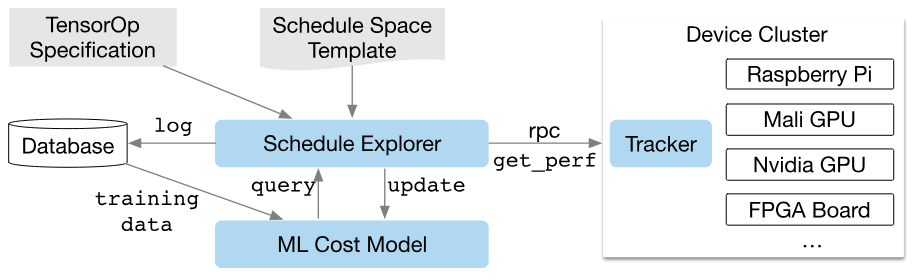

**图 11.** 自动优化框架概述. 调度探索器使用基于机器学习的成本模型检查调度空间, 并通过 RPC 在分布式设备集群上选择要运行的实验. 为了提高预测能力, 机器学习模型会定期使用存储在数据库中的收集数据进行更新.

|方法类别|数据成本|模型偏差|需要硬件信息|从历史中学习|
| --- | --- | --- | --- | --- |
|黑箱自动调优|高|无|否|否|
|预定义成本模型|无|高|是|否|
|基于机器学习的成本模型|低|低|否|是|

**表 1.** 自动化方法比较. 模型偏差是指由于建模引起的不准确性.

我们改为采用统计方法来解决成本建模问题. 在这种方法中, 调度探测器提出可能提高操作员性能的配置. 对于每个调度配置, 我们使用一个机器学习模型, 该模型以降低后的循环程序作为输入, 并预测其在特定硬件后端上的运行时间. 该模型通过在探索过程中收集的运行时测量数据训练, 不需要用户输入详细的硬件信息. 随着在优化过程中探索更多配置, 我们会定期更新模型, 这也提高了其他相关工作负载的准确性. 通过这种方式, 随着更多实验的进行, 机器学习模型的质量会不断提高. [表 1](#table-01) 总结了自动化方法之间的关键差异. 基于机器学习的成本模型在自动调优和预定义成本建模之间取得了平衡, 并且可以利用相关工作负载的历史性能数据.

#### 机器学习模型设计选择.

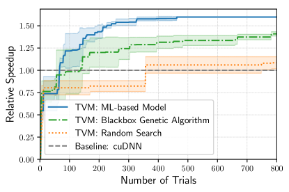

**图 12.** ResNet-18 中 conv2d 操作符在 TITAN X 上不同自动化方法的比较. 基于机器学习的模型从没有训练数据开始, 并使用收集的数据自我改进. Y 轴为相对于 cuDNN 的加速比. 我们在其他工作负载中也观察到类似的趋势.

在选择调度探索器将使用的机器学习模型时, 我们必须考虑两个关键因素: *质量* 和 *速度*. 调度探索器会频繁查询成本模型, 这会产生开销, 因为涉及到模型预测时间和模型重新拟合时间. 为了有用, 这些开销必须小于在真实硬件上测量性能所需的时间, 这个时间可能在几秒钟的量级, 具体取决于工作负载/硬件目标. 这个速度要求将我们的问题与传统的超参数调优问题区分开来, 在传统问题中, 执行测量的成本相对于模型开销非常高, 因此可以使用更昂贵的模型. 除了模型的选择之外, 我们还需要选择一个目标函数来训练模型, 例如配置预测运行时间的误差. 然而, 由于探索器仅基于预测的相对顺序来选择最佳候选 (A 运行比 B 快), 我们不需要直接预测绝对执行时间. 相反, 我们使用排序目标来预测运行时间成本的相对顺序.

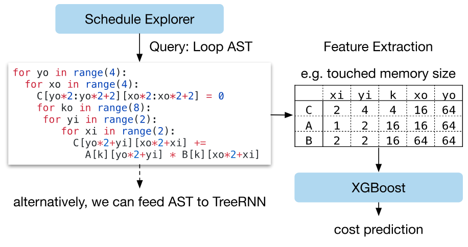

**图 13.** 机器学习成本模型的示例工作流程. XGBoost 基于循环程序特征预测成本. TreeRNN 直接总结抽象语法树 (AST).

我们在机器学习优化器中实现了几种类型的模型. 我们采用了梯度提升树模型 (基于 XGBoost [USA16]), 它根据从循环程序中提取的特征进行预测; 这些特征包括每个循环层次中每个内存缓冲区的内存访问计数和重用率, 以及循环注释 (如“向量化”“展开”“并行”) 的一位有效编码. 我们还评估了一种神经网络模型, 该模型使用 TreeRNN [Xivg15] 来总结循环程序的 AST, 而无需特征工程. [图 13](#figure-13) 总结了成本模型的工作流程. 我们发现, 树提升和 TreeRNN 的预测质量相似. 然而, 前者的预测速度快两倍, 并且训练所需时间更少. 因此, 我们在实验中选择梯度提升树作为默认的成本模型. 尽管如此, 我们认为这两种方法都是有价值的, 并期待未来在这一问题上有更多研究.

平均而言, 树提升模型的预测时间为 0.67 毫秒, 比实际测量快数千倍. [图 12](#figure-12) 将基于机器学习的优化器与黑箱自动调优方法进行了比较; 前者能够更快地找到更优的配置.

### 5.3 调度探索

一旦我们选择了一个成本模型, 就可以使用它来选择有前景的配置, 并在这些配置上迭代运行实际测量. 在每次迭代中, 探索器使用机器学习模型的预测来选择一批候选配置进行测量. 收集到的数据随后用作训练数据来更新模型. 如果没有初始训练数据, 探索器会随机选择候选配置进行测量.

最简单的探索算法是枚举并通过成本模型运行每个配置, 选择预测表现最好的前 $k$ 个配置. 然而, 当搜索空间较大时, 这种策略变得不可行. 相反, 我们运行一个并行模拟退火算法 [Scienc83]. 探索器从随机配置开始, 在每一步随机移动到附近的配置. 如果成本如成本模型预测般下降, 则该转移成功. 如果目标配置成本较高, 则可能失败 (被拒绝). 随机游走倾向于收敛到成本模型预测成本较低的配置. 探索状态在成本模型更新期间保持; 我们在这些更新后从上一个配置继续.

### 5.4 分布式设备池和 RPC

分布式设备池可扩展硬件试验的运行, 并实现多个优化任务间的细粒度资源共享. TVM 实现了一个定制的, 基于 RPC 的分布式设备池, 使客户端能够在特定类型的设备上运行程序. 我们可以使用该接口在主机编译器上编译程序, 请求远程设备, 在远程运行函数, 并在主机同一脚本中访问结果. TVM 的 RPC 支持动态上传, 并运行使用其运行时约定的交叉编译模块和函数. 因此, 相同的基础设施可以执行单个工作负载优化以及端到端图推理. 我们的方法实现了跨多个设备的编译, 运行和性能分析步骤自动化. 这一基础设施对嵌入式设备尤其重要, 因为嵌入式设备传统上需要繁琐的手动操作来进行交叉编译, 代码部署和测量.

## 6 评估

|名称|操作符|$H,W$|$\mathrm{IC},\mathrm{OC}$|$K,S$|
| --- | --- | --- | --- | --- |
|C1|conv2d|224, 224|3, 64|7, 2|
|C2|conv2d|56, 56|64, 64|3, 1|
|C3|conv2d|56, 56|64, 64|1, 1|
|C4|conv2d|56, 56|64, 128|3, 2|
|C5|conv2d|56, 56|64, 128|1, 2|
|C6|conv2d|28, 28|128, 128|3, 1|
|C7|conv2d|28, 28|128, 256|3, 2|
|C8|conv2d|28, 28|128, 256|1, 2|
|C9|conv2d|14, 14|256, 256|3, 1|
|C10|conv2d|14, 14|256, 512|3, 2|
|C11|conv2d|14, 14|256, 512|1, 2|
|C12|conv2d|7, 7|512, 512|3, 1|

**表 2.** ResNet-18 中所有 conv2d 算子以及 MobileNet 中所有 depthwise conv2d 算子在单核实验中的配置. H/W 表示高度和宽度, IC 为输入通道数, OC 为输出通道数, K 为卷积核大小, S 为步幅大小. 所有操作都使用“SAME”填充. 所有深度可分离卷积操作的通道乘数为 1.

TVM 的核心是用 C 语言实现的 ($\sim$50k 行代码). 我们提供了 Python 和 Java 语言绑定. 本文前面的章节评估了 TVM 中多个单独优化和组件的影响, 即[图 4](#figure-04) 中的算子融合, [图 10](#figure-10) 中的延迟隐藏, 以及[图 12](#figure-12) 中的基于 ML 的成本模型. 现在我们将关注端到端评估, 旨在回答以下问题:

- •

TVM 能否在多个平台上优化深度学习工作负载?

- •

TVM 在每个后端与现有深度学习框架 (依赖高度优化的库) 相比如何?

- •

TVM 能否支持新的, 正在兴起的深度学习工作负载 (例如深度可分离卷积, 低精度操作)?

- •

TVM 能否支持并优化新的专用加速器?

为了回答这些问题, 我们在四种类型的平台上评估了 TVM: (1) 服务器级 GPU, (2) 嵌入式 GPU, (3) 嵌入式 CPU, 以及 (4) 在低功耗 FPGA SoC 上实现的 DL 加速器. 基准测试基于真实世界的 DL 推理工作负载, 包括 ResNet [Xivi16], MobileNet [CoRRa17], LSTM 语言模型 [Xivc14], 深度 Q 网络 (DQN) [Nature15] 和深度卷积生成对抗网络 (DCGAN) [Xivf15]. 我们将我们的方法与现有的 DL 框架进行比较, 包括依赖高度优化, 供应商特定库的 MxNet [Learni15] 和 TensorFlow [Larges15]. TVM 执行端到端的自动优化和代码生成 *无需外部操作库*.

### 6.1 服务器级 GPU 评估

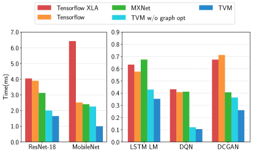

**图 14.** TVM, MXNet, TensorFlow 和 TensorFlow XLA 的 GPU 端到端评估. 在 NVIDIA Titan X 上测试.

我们首先比较了深度神经网络在 TVM, MXNet (v1.1) , TensorFlow (v1.7) 和 TensorFlow XLA 在 Nvidia Titan X 上的端到端性能. MxNet 和 TensorFlow 都使用 cuDNN v7 进行卷积操作; 由于深度卷积相对较新且尚未被最新库支持, 它们实现了自己的深度卷积版本. 它们还使用 cuBLAS v8 进行矩阵乘法. 另一方面, TensorFlow XLA 使用 JIT 编译.

[图 14](#figure-14) 显示 TVM 的性能优于基准, 因联合图优化和自动优化器的作用, 其加速比在 1.6$\times$ 到 3.8$\times$ 之间, 自动优化器可以生成高性能的融合运算符. DQN 的 3.8 倍加速来自于它使用了非常规运算符 (4$\times$4 conv2d, strides=2), cuDNN 对这些运算符优化效果不佳; 而 ResNet 工作负载更为常规. TVM 在两种情况下都能自动找到优化后的运算符.

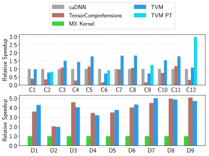

**图 15.** ResNet-18 中所有 conv2d 操作和 MobileNet 中所有深度卷积 conv2d 操作的相对加速. 测试于 TITAN X. 操作配置见 [表 2](#table-02). 我们还包括一个预先转换权重的 Winograd [Fast16], 用于 3x3 conv2d (TVM PT).

为了评估操作级优化的有效性, 我们还对 ResNet 和 MobileNet 中的每个张量操作进行了细分比较, 如 [图 15](#figure-15) 所示. 我们包括了 TensorComprehension (TC, 提交版本: ef644ba) [CoRR18], 这是一种最近引入的自动调优框架, 作为额外的基线. [+2] TC 的结果包括它在 $10$ 代 $\times$ $100$ 人口 $\times$ $2$ 随机种子中为每个操作找到的最佳内核 (即每个操作 2000 次尝试). 二维卷积是最重要的深度学习操作之一, 由 cuDNN 进行了大量优化. 然而, TVM 仍然可以为大多数层生成更好的 GPU 内核. 深度可分卷积是一个新引入的结构更简单的操作 [CoRRa17]. 在这种情况下, 与 MXNet 手工设计的内核相比, TVM 和 TC 都可以找到快速的内核. TVM 的改进主要归功于它对大规模调度空间的探索以及有效的基于机器学习的搜索算法.

### 6.2 嵌入式 CPU 评估

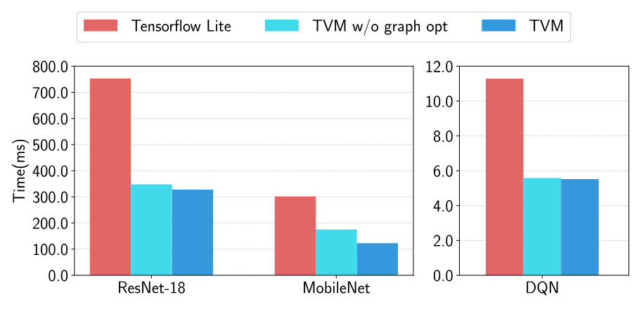

**图 16.** TVM 与 TFLite 在 ARM A53 上的端到端评估.

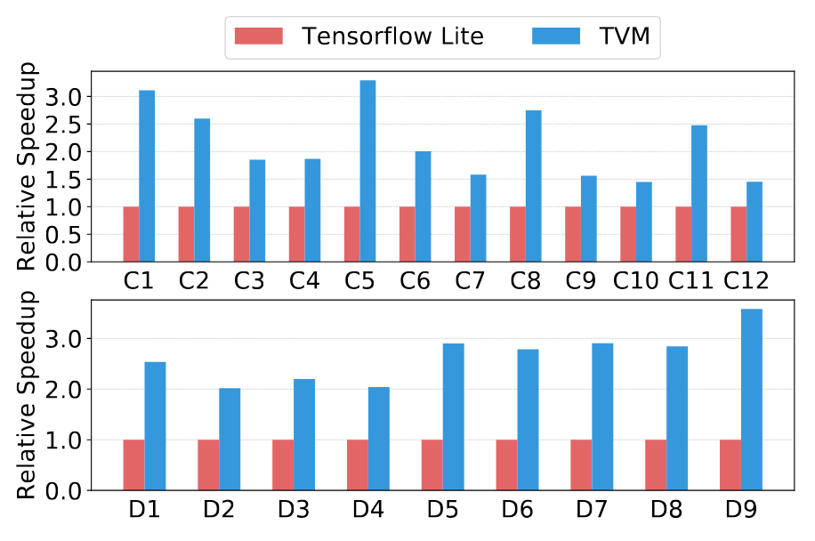

**图 17.** ResNet-18 中所有 conv2d 操作以及 MobileNet 中所有深度可分 conv2d 操作的相对加速比. 在 ARM A53 上测试. 有关这些操作的配置, 请参见 [表 2](#table-02).

我们在 ARM Cortex A53 (四核 1.2GHz) 上评估了 TVM 的性能. 我们使用 Tensorflow Lite (TFLite, 提交版本: 7558b085) 作为基线系统. [图 17](#figure-17) 对比了 TVM 运算符与 ResNet 和 MobileNet 的手工优化运算符. 我们观察到, TVM 生成的运算符在这两种神经网络工作负载上均优于手工优化的 TFLite 版本. 这一结果还展示了 TVM 快速优化新兴张量运算符 (如深度卷积运算符) 的能力. 最后, [图 16](#figure-16) 显示了三种工作负载的端到端对比, 其中 TVM 的性能优于 TFLite 基线. [+3]

#### 超低精度操作符

我们展示了 TVM 支持超低精度推理的能力 [CoRRa15, Vision16], 通过为低于 8 位的定点数据类型生成高度优化的操作符. 低精度网络用向量化的按位串行乘法替代高成本的乘法, 该乘法由按位和计数 (popcount) 归约组成 [Xivf17]. 实现高效的低精度推理需要将量化数据类型打包到更宽的标准数据类型中, 例如 int8 或 int32. 我们的系统生成的代码优于 Caffe2 (提交版本: 39e07f7) 手工优化的库 [Xivf17]. 我们实现了一个 ARM 特定的 *tensorization* 内在函数, 它利用 ARM 指令构建高效的低精度矩阵- 向量微内核. 然后我们使用 TVM 的自动优化器探索调度空间.

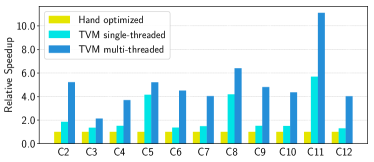

**图 18.** ResNet 中单线程和多线程低精度 conv2d 操作的相对加速. 基线是来自 Caffe2 (提交: 39e07f7) 的单线程手工优化实现. C5, C3 是计算强度较小的 1x1 卷积, 因此多线程带来的加速较少.

[图 18](#figure-18) 比较了 TVM 与 Caffe2 超低精度库在 ResNet 上的 2 位激活, 1 位权重推理性能. 由于基线是单线程, 我们还将其与单线程 TVM 版本进行比较. 单线程 TVM 优于基线, 尤其是在 C5, C8 和 C11 层, 这些是卷积核大小为 $1\times 1$, 步幅为 2 的卷积层, 而超低精度基线库对此没有优化. 另外, 我们利用 TVM 的额外功能生成了并行库实现, 显示出比基线更好的性能. 除了 2 位 1 位配置外, TVM 还可以生成并优化基线库不支持的其他精度配置, 提供更高的灵活性.

### 6.3 嵌入式 GPU 评估

在我们的移动 GPU 实验中, 我们在一块配备 ARM Mali-T860MP4 GPU 的 Firefly-RK3399 开发板上运行了端到端流水线. 基线是供应商提供的库, 即 ARM Compute Library (v18.03). 如 [图 19](#figure-19) 所示, 对于三种可用模型, 我们在 float16 和 float32 上均优于基线 (基线尚不支持 DCGAN 和 LSTM). 加速范围从 1.2$\times$ 到 1.6$\times$.

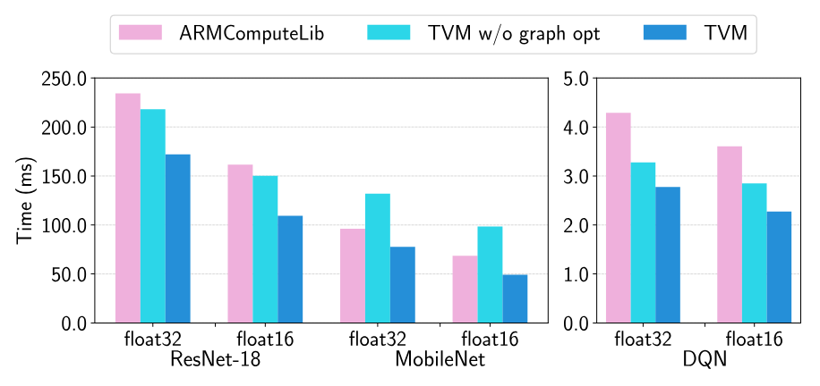

**图 19.** Mali-T860MP4 上的端到端实验结果. 评估了两种数据类型, float32 和 float16.

### 6.4 FPGA 加速器评估

#### 原生深度学习加速器

我们现在讲述 TVM 如何在我们在 FPGA 上原型化的通用推理加速器设计上处理加速器特定的代码生成. 在本次评估中, 我们使用了 Vanilla 深度学习加速器 (VDLA) ——它从之前的加速器提案 [USA15, USAa16, USAa17] 中提炼特性, 形成了简约的硬件架构——以展示 TVM 生成针对专用加速器的高效调度的能力. [图 20](#figure-20) 展示了 VDLA 架构的高层硬件组织结构. VDLA 被编程为一个张量处理器, 以高效执行高计算密集度操作 (例如, 矩阵乘法, 高维卷积). 它可以执行加载/存储操作, 将分块的三维张量从 DRAM 导入到连续的 SRAM 区域中. 它还提供了用于网络参数, 层输入 (窄数据类型) 和层输出 (宽数据类型) 的专用片上存储器. 最后, VDLA 提供了对连续加载, 计算和存储的显式同步控制, 以最大化内存和计算操作之间的重叠.

#### 方法论.

我们在一块低功耗的 PYNQ 开发板上实现了 VDLA 设计, 该开发板集成了一个时钟频率为 667MHz 的 ARM Cortex A9 双核 CPU 和基于 Artix-7 的 FPGA 结构. 在这些有限的 FPGA 资源上, 我们实现了一个时钟频率为 200MHz 的 $16\times 16$ 矩阵- 向量单元, 每个周期对 8 位数值进行乘积运算并累加到 32 位寄存器中. 该 VDLA 设计的理论峰值吞吐量约为 102.4GOPS/s. 我们为激活存储分配了 32kB 资源, 为参数存储分配了 32kB, 为微代码缓冲区分配了 32kB, 以及为寄存器文件分配了 128kB. 这些片上缓冲区远不足以为 ResNet 的单层提供足够的片上存储, 因此可以进行有效内存重用和延迟隐藏的案例研究.

我们为 VDLA 构建了一个带有 C 运行时 API 的驱动库, 该 API 构建指令并将其推送到目标加速器执行. 然后, 我们的代码生成算法将加速器程序转换为对运行时 API 系列调用. 添加专用的加速器后端用了 $\sim$2k 行 Python 代码.

#### 端到端 ResNet 评估.

我们使用 TVM 在 PYNQ 平台上生成 ResNet 推理内核, 并尽可能将更多层卸载到 VDLA 上. 我们还使用它生成仅 CPU 和 CPU FPGA 实现的调度. 由于其卷积深度较浅, ResNet 的第一层卷积无法在 FPGA 上高效卸载, 因此在 CPU 上计算. 然而, ResNet 中的其他卷积层都可以高效卸载. 诸如残差层和激活函数等操作也在 CPU 上执行, 因为 VDLA 不支持这些操作.

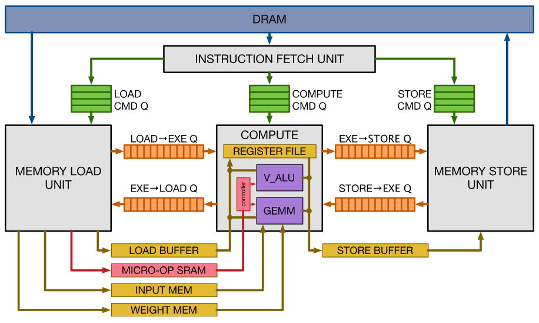

**图 20.** VDLA 硬件设计概览.

[图 21](#figure-21) 将 ResNet 推理时间分解为仅 CPU 执行和 CPU FPGA 执行. 大部分计算时间花费在可以卸载到 VDLA 的卷积层上. 对于这些卷积层, 获得的加速比为 40$\times$. 遗憾的是, 由于阿姆达尔定律, FPGA 加速系统的整体性能受限于必须在 CPU 上执行的工作负载部分. 我们设想, 通过扩展 VDLA 设计以支持这些其他算子, 将有助于进一步降低成本. 这个基于 FPGA 的实验展示了 TVM 适应新架构及其硬件内置功能的能力.

## 7 相关工作

深度学习框架 [OSDI16, NIPSa12, Learni15, MSRTR14] 为用户提供了方便的接口, 以表达深度学习工作负载并轻松部署到不同的硬件后端. 虽然现有框架目前依赖于厂商特定的张量运算符库来执行其工作负载, 但它们可以利用 TVM 的栈为更多硬件设备生成优化代码.

高级计算图 DSL 是表示和执行高级优化的典型方式. Tensorflow 的 XLA [OSDI16] 以及最近引入的 DLVM [CoRRc17] 属于这一类别. 在这些工作中的计算图表示非常相似, 本论文也使用了高级计算图 DSL. 虽然图级表示非常适合进行高级优化, 但它们对于在多样化的硬件后端下优化张量算子来说层级过高. 以往的工作依赖特定的低阶转换规则直接生成低级 LLVM, 或者依赖厂商定制的库. 这些方法在每个硬件后端和算子变体组合上都需要大量的工程工作.

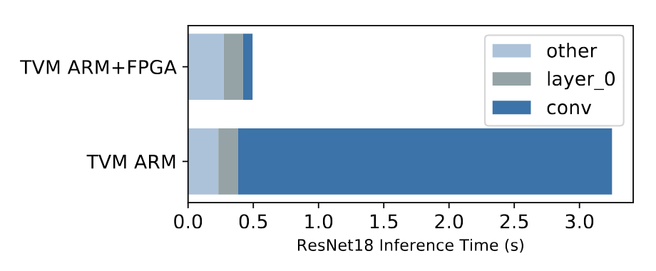

**图 21.** 我们将 ResNet 工作负载中的卷积操作卸载到基于 FPGA 的加速器上. 灰色条对应无法被 FPGA 加速的层, 因此必须在 CPU 上运行. FPGA 在被卸载的卷积层上相比 Cortex A9 提供了 40 倍的加速.

Halide [USA13] 提出了将计算和调度分离的理念. 我们采纳了 Halide 的洞见, 并在我们的编译器中重用了它现有的有用调度原语. 我们的张量操作符调度也与其他针对 GPU 的 DSL 工作 [Lift17, USA17, USA11, Scotla14] 以及基于多面体的循环变换 [Pencil15, Jan13] 有关. TACO [Oct17] 提出了在 CPU 上生成稀疏张量操作符的通用方法. Weld [CoRRb17] 是用于数据处理任务的 DSL. 我们特别关注解决 GPU 和专用加速器上深度学习工作负载的新调度挑战. 我们的新原语有可能被这些工作的优化流水线所采用.

高性能库如 ATLAS [Automa98] 和 FFTW [Proces98] 使用自动调优以获得最佳性能. Tensor comprehension [CoRR18] 将黑箱自动调优与多面体优化结合起来, 以优化 CUDA 内核. OpenTuner [August14] 和现有的超参数调优算法 [CoRRe16] 应用与领域无关的搜索. 在 Halide [July16] 中, 使用预定义的成本模型自动调度图像处理管道. TVM 的机器学习模型使用有效的领域感知成本建模, 考虑程序结构. 基于的分布式调度优化器可扩展到更大的搜索空间, 并能够在广泛支持的后端上找到最先进的内核. 更重要的是, 我们提供了一个端到端的栈, 可以直接从深度学习框架获取描述, 并与图级栈联合优化.

尽管加速器在深度学习中的流行度日益提升 [USAa17, USA14], 但如何构建一个编译栈以有效针对这些设备仍不清楚. 我们评估中使用的 VDLA 设计提供了一种通用方式来总结类似 TPU 加速器的特性, 并实现了一个关于如何为加速器编译代码的具体案例研究. 我们的方法也可能对现有将深度学习编译到 FPGA [MICRO16, CoRRf16] 的系统有所帮助. 本文提供了一种通过张量化和编译器驱动延迟隐藏有效针对加速器的通用解决方案.

## 8 结论

我们提出了一个端到端的编译栈, 以解决跨多样化硬件后端的深度学习基础优化挑战. 我们的系统包括自动化端到端优化, 这在历史上是一项劳动密集且高度专业化的任务. 我们希望这项工作能够鼓励对端到端编译方法的进一步研究, 并为 DL 系统软件- 硬件协同设计技术开辟新的机会.

## 致谢

我们想感谢 Ras Bodik, James Bornholt, Xi Wang, Tom Anderson 和 Qiao Zhang 对本文早期版本提供的详细反馈. 我们还想感谢 Allen 学院 Sampa, SAMPL 和 Systems 小组的成员们对这项工作和手稿的反馈. 我们还要感谢匿名的 OSDI 审稿人, 以及我们的指导人 Ranjita Bhagwan 提供的有用反馈. 本工作部分得到了 Google PhD Fellowship 对 Tianqi Chen 的资助, ONR 项目 #N00014-16-1-2795, NSF 的 CCF-1518703, CNS-1614717 和 CCF-1723352 资助, 以及来自 Intel (CAPA 项目下) , Oracle, 华为和匿名来源的捐赠支持.

[+1]: Halide 最近增加了共享内存支持, 但没有为加速器提供通用内存范围.

[+2]: 根据个人交流 [Vasila00], TC 尚未用于计算密集型问题. 然而, 它仍然是比较中可以参考的良好基准.

[+3]: 未展示 DCGAN 和 LSTM 的结果, 因为基线尚不支持它们.
