> [Colin Unger](https://dblp.org/pid/294/3598.html) [+equal], [Zhihao Jia](https://www.cs.cmu.edu/~zhihaoj2/) [+equal], [Wei Wu](https://dblp.org/pid/95/6985-16.html), [Sina Lin](https://dblp.org/pid/116/4935.html), [Mandeep Baines](https://dblp.org/pid/277/0899.html), [Carlos Efrain Quintero Narvaez](https://dblp.org/pid/302/0542.html), [Vinay Ramakrishnaiah](https://dblp.org/pid/231/3756.html), [Nirmal Prajapati](https://dblp.org/pid/169/1015.html), [Pat McCormick](https://dblp.org/pid/147/4103.html), [Jamaludin Mohd-Yusof](https://dblp.org/pid/69/5800.html), [Xi Luo](https://dblp.org/pid/69/7449.html), [Dheevatsa Mudigere](https://dblp.org/pid/87/8721.html), [Jongsoo Park](https://dblp.org/pid/13/9348.html), [Misha Smelyanskiy](https://dblp.org/pid/22/4090.html), 以及 [Alex Aiken](https://theory.stanford.edu/~aiken/). 论文发表于 [第 16 届 USENIX 操作系统设计与实现研讨会 (OSDI 2022)](https://www.usenix.org/conference/osdi22/presentation/unger), 2022 年 7 月 11-13 日, 第 267-284 页. [Unity: Accelerating DNN Training Through Joint Optimization of Algebraic Transformations and Parallelization](https://www.usenix.org/conference/osdi22/presentation/unger). <a href="/paper/unity.pdf" target="_blank" rel="noopener noreferrer">原始 PDF</a>. 本文没有 arXiv 记录或 TeX 源码; 原始措辞, 印刷版式和参考文献均以正式发表的 PDF 为准.

## 摘要

本文介绍 Unity, 这是第一个在分布式 DNN 训练中联合优化代数变换与并行化的系统. Unity 将并行化和代数变换都表示为统一的*并行计算图* (parallel computation graph, PCG) 上的替换; 该图同时表达分布式 DNN 训练过程中的计算, 并行化与通信.

给定一组算子规约后, 优化会以图替换的形式自动生成, 并通过自动定理证明器对其正确性进行形式化验证. 随后, Unity 使用一种新的分层搜索算法联合优化代数变换与并行化, 同时保持可扩展性. 这些技术共同形成一种通用且可扩展的分布式 DNN 训练优化方法, 只需很少的人工工作便可接入新的 DNN 算子, 并行化策略和模型架构.

我们在 7 个真实 DNN 上评估 Unity, 最多使用 32 个节点上的 192 块 GPU, 并表明 Unity 比现有 DNN 训练框架最高快 $3.6\times$, 同时将优化时间控制在 20 分钟以内. Unity 已作为开源 DNN 训练框架 FlexFlow 的一部分开放使用, 地址为 [https://github.com/flexflow/flexflow](https://github.com/flexflow/flexflow).

## 1 引言

深度神经网络 (DNN) 的规模越来越大, 训练所需的计算也越来越多; 随着模型增长, 人们愈发关注如何优化其执行, 以缩短训练时间并提高可扩展性. 已有研究表明, 两类主要优化能在多种模型架构上显著提升性能: 代数变换与并行化.

代数变换利用算子恒等式, 以更高效的方式完成底层计算, 但不考虑训练的并行化与分布. 常见的代数变换包括算子融合和算子重排: 算子融合把两个算子合并为一个语义等价但计算效率更高的算子; 算子重排则利用一组算子的结合律或交换律, 将其调整为更高效的结构, 或暴露更多优化机会. [第 2.2 节](#section-2-2) 给出了更多说明和示例.

与之不同, 并行化会把算子分布到多个设备上, 但不改变底层计算的执行方式. DNN 训练利用一类名为 *partition-n-reduce* 的并行方式 [Wan19b], 其中一个算子的每个分布式子计算都必须执行相同的计算, 彼此只能在所使用的输入数据上有所不同. DNN 训练中的张量计算尤其适合这种并行方式, 研究者已经找到许多可用于拆分分布式算子的并行维度, 包括数据 [Aba16], 模型 [Dea12], 空间 [Jia19a], 归约 [Sho19] 和流水线 [Nar19]. 这些方法的详细概述见 [第 2.1 节](#section-2-1).

如果运用得当, 这两种技术可以把训练时间缩短一个数量级以上. 但要有效运用它们并不容易. 为获得最大加速而重写计算图可能需要许多变换; 某些变换单独使用时甚至会降低性能, 只有放在更长的变换序列中才有益 [Jia19]. 一个模型的最优并行执行策略往往要同时利用多个并行维度, 并为每个算子采用不同的并行化方案 [Jia18]. 早期工作依靠程序员手动决定应采用哪些优化 [Aba16]. 手动优化虽能精细控制模型性能, 却需要专家花费许多小时调优才能取得良好效果. 随着模型设计中新进展的速度加快, 手动优化很难扩展到最常用模型以外的范围.

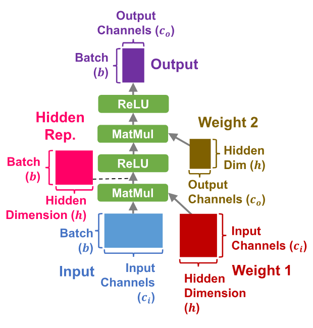

**图 1.** 两层 MLP 的计算图.

近期工作开始着力于自动化优化. MetaFlow [Jia19], TASO [Jia19b] 和 PET [Wan21] 将优化表述为搜索问题, 并提出自动生成和应用代数变换的算法. FlexFlow [Jia19a], automap [Sch21c], Tofu [Wan19b] 和 Whale [Jia21c] 把类似方法用于并行化. 这些工作的基准结果十分出色, 容易让人觉得代数优化与并行化优化的自动化已经得到解决.

然而, 若要尽可能缩短训练时间, 两类优化都应采用, 而如何最有效地组合它们并不明显. 最简单的方案是按两种顺序之一独立应用: 先做代数优化再做并行化, 或反过来. 事实证明后一种顺序存在问题: 代数变换可能引入新操作或替换现有操作, 因而在分配并行化方案后再运行代数优化, 最终方案中可能出现未分配并行化方案的操作 (新建操作时), 或并行化方案无效的操作 (操作被替换时). 可以用默认并行化策略或复制相邻算子的策略来修复无效方案, 但很容易找到这些权宜做法产生次优解的情况. 因此, 唯一可行的顺序是先做代数优化再做并行化; 但下一个例子表明, 这会错过重要的优化机会.

请看 [图 1](#figure-01) 中的计算图, 它表示一个两层多层感知机 (MLP). 如果独立优化 (也称为"顺序优化"), 我们先在不考虑并行性的情况下应用代数变换. 典型的代数优化器会融合 MatMul 和 ReLU 算子, 消除冗余的内存读写. 随后对模型进行并行化 (为简单起见, 这里只考虑 2 块 GPU), 得到 [图 2a](#figure-02): 两个算子都采用数据并行, 因此权重梯度必须通过 AllReduce 同步. 权重 1 的大小为 $c_i h$, 权重 2 的大小为 $hc_o$, 所以总通信量为 $2(c_i h+hc_o)$. 代入一个基础 MNIST 图像分类模型的参数 ($b=64$, $h=512$, $c_o=10$, $c_i=28\times 28=784$), 总通信量为 $813,056d$ 字节, 其中 $d$ 是元素大小.

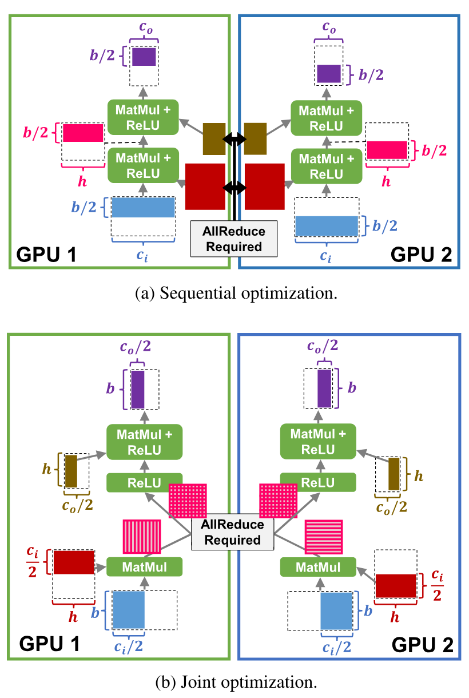

**图 2.** 联合优化与顺序优化的对比.

我们可以把代数变换与并行化合在一起, 求解单个联合优化问题, 从而找到 [图 2b](#figure-02) 中的方案, 而不是分别应用两类优化. 不融合第一个 MatMul 和 ReLU 后, 就能采用效率更高的归约并行. 这要求同步第一个 MatMul 输出的激活值和梯度, 但不必同步权重: GPU 间总通信量为 $4bh$, 在 MNIST 示例中即 $131,072d$ 字节. 联合优化将通信量减少到六分之一, 远远超过不融合第一个 ReLU 所增加的代价.

这个例子表明, 要让性能最大化, 联合优化不可或缺. 但它也带来了很大的挑战. 第一个挑战是表示: 现有框架在模型的计算图上执行优化. 如前所述, 代数变换可能使计算图中的算子没有并行化方案, 或采用无效方案. 为避免搜索过程中出现这种无效解, 我们需要一种表示, 使代数变换在应用前能考虑当前的并行化方案. [第 3.4 节](#section-3-4) 进一步讨论了表示方面的挑战.

第二个挑战是可扩展性: 现有基于搜索的方法已经很难扩展到大型模型和大量 GPU. 仅针对代数变换的可扩展性已有所改进 [Yan21d], 但这些方案十分复杂, 加入并行化会相当困难. 同时考虑两类优化只会让问题更严重, 因为搜索空间会呈指数增长. 要让联合优化能够实际使用, 搜索算法的可扩展性必须超过以往技术.

### 1.1 Unity 的方法

Unity 的核心思想是把代数变换和并行化都表示为统一并行计算图上的图替换, 再用分层搜索算法高效判断哪种替换组合能得到最佳性能. [图 3b](#figure-03) 给出了 Unity 的整体流程, 它与现有框架有以下不同:

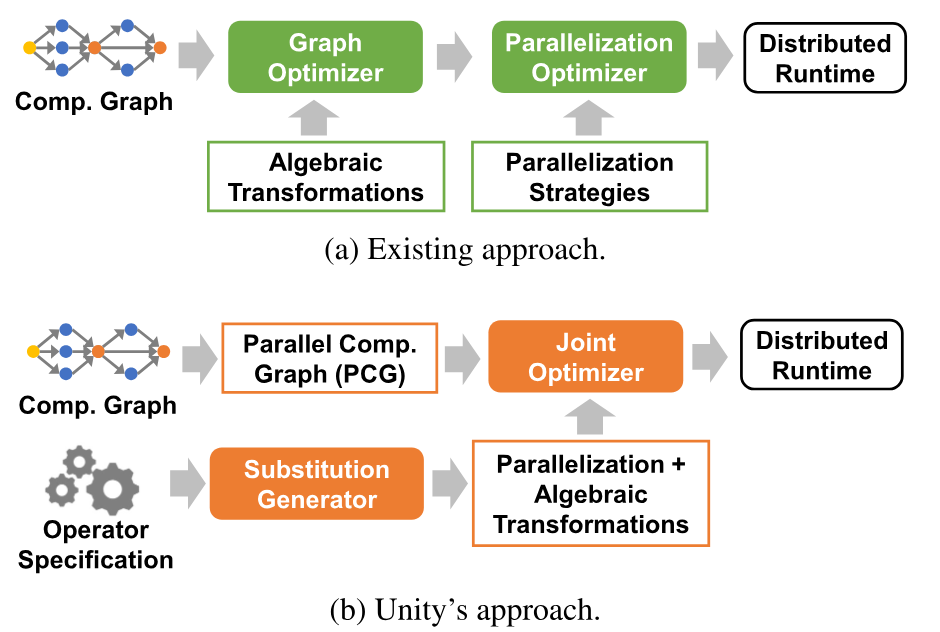

**图 3.** 现有 DNN 框架与 Unity 的对比.

**统一图表示.** 我们提出并行计算图 (PCG) [+1], 将其作为分布式 DNN 训练的统一表示, 同时表达计算, 并行性和数据移动. 现有框架使用的所有并行化策略都可以表示为特定的 PCG, 而并行化与代数变换都可以表示为图替换序列. pONNX [Wan19j] 先前已经提出把计算与并行性合并到一张图中, 但其若干设计决策妨碍了 Unity 式联合优化. 详细比较见 [第 3.4 节](#section-3-4).

**变换生成与验证.** Unity 不要求用户显式定义 DNN 训练可能采用的并行化策略. 与自动生成并行化策略 [Wan19b] 或代数变换 [Jia19b] 的既有工作不同, Unity 借助 PCG 用同一种方法生成这两类变换, 还可以生成先前自动化方法所没有的代数-并行化混合优化. 自动生成并验证变换, 可以大幅减少支持不同并行维度所需的工程工作, 也使系统更容易扩展到新算子.

**联合优化.** Unity 使用分层搜索算法寻找高度优化的 PCG 替换与设备放置, 同时能扩展到分布在数百块 GPU 上, 包含数百个算子的模型. Unity 的代价模型同时计入计算时间和通信时间, 搜索算法也能处理自定义网络拓扑与异构计算设备. 尽管所考虑的搜索空间呈指数增长, Unity 仍优于现有基于搜索的方法 (见 [第 6 节](#section-6)). 本文余下部分先介绍更多背景 ([第 2 节](#section-2)), 再讨论 Unity 的设计与实现 ([第 3 节](#section-3), [第 4 节](#section-4) 和 [第 5 节](#section-5)), 最后在 7 个真实 DNN 上评估其性能 ([第 6 节](#section-6)). 对 BERT [Dev19] 这类已被现有框架充分优化的常用 DNN, Unity 能在完全自动化的情况下达到现有专家设计策略的性能. 对 DLRM [Nau19] 和 CANDLE-Uno [Can18] 这类混合了计算密集型与通信密集型算子的复杂 DNN 架构, Unity 比现有框架最高快 $3.6\times$.

## 2 背景

我们先简要介绍 Unity 利用的两类优化: 并行化 ([第 2.1 节](#section-2-1)) 和代数变换 ([第 2.2 节](#section-2-2)); 随后讨论现有系统如何表示它们 ([第 2.3 节](#section-2-3)). Unity 与其他类型优化的关系见 [第 8 节](#section-8).

### 2.1 并行化

张量代数具有大规模并行的特性, 为 DNN 训练的并行化带来许多机会. 我们归纳出 DNN 系统采用的六种主要并行形式:

1. *数据并行*是现有框架最常用的方法 [Aba16, Che15b, Pyt17]. 数据并行在每个设备上保留整个 DNN 模型的副本, 并为各设备分配训练数据的一个子集.
2. *模型并行*将 DNN 模型拆分为彼此不相交的子模型, 并在专用设备上训练每个子模型.
3. *空间并行* [+2] 把张量的空间维度 (如图像的高度和宽度) 划分为多个分区, 并把每个分区分配给特定设备 [Jia19a]. 空间并行通常需要在设备间同步共享元素 (如不同子图像边界上的共享像素).
4. *归约并行*利用张量代数算子的线性性质. 对矩阵乘法 $C=A\times B$, 归约并行按列拆分 $A$, 按行拆分 $B$: $A=[A_1,\ldots,A_n]$, $B=[B_1^\top,\ldots,B_n^\top]^\top$. 矩阵乘法分布到 $n$ 个设备上, 第 $i$ 个设备计算 $C_i=A_i\times B_i$. 随后再做一次归约即可恢复原始结果: $C=\sum_i C_i$.
5. *流水线并行*利用不同训练迭代之间可以并行的机会 [Nar19].
6. *算子特定并行*. 新 DNN 算子的出现会带来针对特定算子的并行机会. 例如, 下式给出 Transformer [Vas17] 使用的批量矩阵乘法: $\mathit{output}(s,h,o)=\sum_i \mathit{input}(s,h,i)\times \mathit{weight}(h,o,i)$. 它与典型矩阵乘法不同, 会对每个输入样本应用不同的权重. 因此, 跨注意力头的这些批量矩阵乘法可以并行运行 (即沿 $h$ 维), 而不必复制或同步任何张量.

大多数并行化并非单纯的性能优化, 而是在不同成本指标之间进行权衡. 例如, 数据并行能减少每个设备的计算时间, 代价是存储和同步模型参数需要更多内存与数据移动. 因此, DNN 算子通常要组合多种并行形式才能达到最优性能.

### 2.2 代数变换

代数变换种类繁多, 不像并行形式那样容易分类, 因此这里改用示例说明. 更全面的介绍见 [Jia19b].

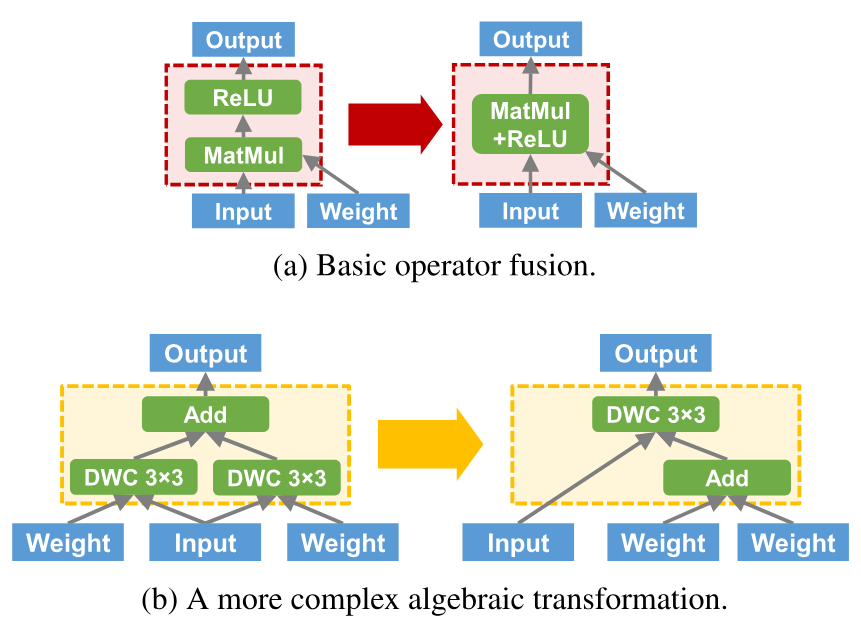

**图 4.** 代数变换示例. DWC 是 DepthwiseConv 的缩写 (即深度可分离卷积).

最基本的代数变换是算子融合, 如 [图 4a](#figure-04) 所示. 未融合时, 设备需要在每个算子之前和之后分别从内存加载激活值并写回, 总共各两次. 两个算子融合后, 组合内核可以在把 MatMul 的输出写回内存时计算 ReLU. 更复杂的例子见 [图 4b](#figure-04). 利用 DepthwiseConv 的线性性质后, 原本需要两次 DepthwiseConv 的计算现在只需一次 DepthwiseConv 和一次额外的 Add, 所需计算量实际上减半.

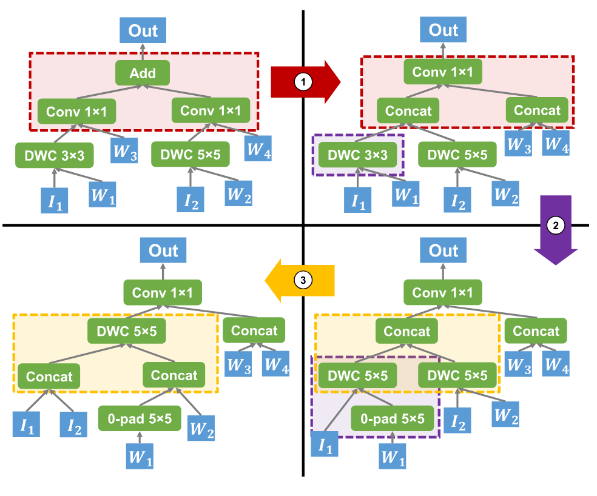

**图 5.** 小型代数变换的组合可以带来显著变化.

小型代数变换可以组合起来产生很大的变化. 考察 [图 5](#figure-05) 中的变换序列: 虽然每次变换都比较小, 最终输出却与原始计算图截然不同. 还要注意, 并非所有性能收益都能在单次变换中取得: 例如, 从 2 号计算图变到 4 号计算图时, DepthwiseConv 操作数减少, 从而降低了计算量; 但必须先经过 3 号计算图, 而 3 号计算图的性能比 2 号和 4 号计算图都差.

### 2.3 中间表示

大多数现有优化框架把 DNN 架构表示为计算图 [+3]: 节点是数学张量算子 (如矩阵乘法等), 边是算子之间传递的张量 (即 $n$ 维数组). [图 6a](#figure-06) 给出了一个计算图示例. 代数变换通过迭代应用图替换来完成, 模型则通过给每个节点分配一组并行注解来并行化.

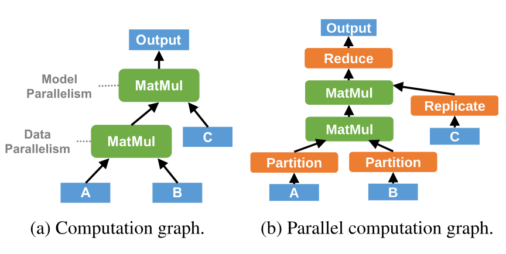

**图 6.** 计算图与 PCG 的对比. 两张图描述的是连续两个矩阵乘法 $(A\times B)\times C$ 的同一种并行化 (注意力的一种简化形式). 绿色和橙色框分别表示常规 DNN 算子和 Unity 新增的并行化算子 (见 [第 3.3 节](#section-3-3)).

这种表示有两点局限. 第一, 代数变换 (即图替换) 与并行化 (即节点注解) 使用不同的表示虽很方便, 却不利于联合优化. 问题在于, 代数变换可能增加或替换图中的节点, 而并行化把计算图视为静态对象, 因而无法处理这些新建且没有注解的节点. 这使两个搜索算法无法交错执行, 因为替换随时可能把有效的并行化方案变成无效方案.

第二, 计算图没有显式表示与并行性相关的通信成本. 由于缺少这部分信息, 代数变换难以判断其对最终模型性能的影响.

## 3 并行计算图

为解决 [第 2.3 节](#section-2-3) 所述现有模型表示的缺陷, 我们提出并行计算图 (PCG) [+1], 作为分布式 DNN 训练的统一表示, 同时表达计算, 并行性与通信. PCG 使 Unity 可以把代数变换和并行化都视为同一张图上的图替换. PCG 并非第一个把计算与并行性合并到一张图中的表示, 但它是为优化量身设计的, 因而在若干关键方面不同于以往的统一图表示; 这些区别将在 [第 3.4 节](#section-3-4) 讨论.

PCG 扩展了现有计算图表示: 节点除了表示数学张量操作, 还可表示并行化方式的变化; 边除了表示数据依赖, 还可表示张量数据的分布式移动. 系统新增一组并行化算子, 使 PCG 能表达所有现有并行化策略, 并显式表示训练期间的数据移动及其成本. PCG 中每个算子还关联一个机器映射, 表示如何把该算子的执行映射到并行机器中的各个处理器. [图 6b](#figure-06) 给出了 PCG 示例. [第 3.1 节](#section-3-1), [第 3.2 节](#section-3-2) 和 [第 3.3 节](#section-3-3) 分别简要介绍张量表示, 机器映射和并行化算子. 最后, [第 3.4 节](#section-3-4) 讨论 PCG 的哪些设计决策使其特别适合联合优化, 以及它与其他统一图表示有何不同.

### 3.1 张量表示

Unity 把张量建模为一组数据维度, 每个维度包含两个字段: 大小和度数. 度数字段表示张量沿该维度被划分成多少个分区. 每个张量还包含一个特殊的副本维度, 表示该张量数据的副本数.

### 3.2 机器映射

PCG 中每个算子都关联一个机器映射, 即由设备或处理器构成的 $n$ 维数组, 用来指定算子计算的每一部分在哪个设备上运行. 更严格地说, 给定一个算子和一组适用的 $n$ 个并行维度, 其度数为 $d_1,\ldots,d_n$, Unity 将该算子拆分为 $d_1\times d_2\times\cdots\times d_n$ 个并行任务; 我们用形如 $(i_1,\ldots,i_n)$ 的元组索引引用这些任务, 其中 $0\le i_k<d_k$. 机器映射把任务索引 $(i_1,\ldots,i_n)$ 映射到用于运行该并行任务的具体 GPU. 为方便起见, 我们还把整个 PCG 的机器映射定义为其所有组成算子的机器映射集合. [图 7](#figure-07) 展示了评估中 Summit 计算节点 [Vaz18] 的若干机器映射示例. [图 7a](#figure-07) 描绘硬件架构. [图 7b](#figure-07) 给出用于数据并行的基础一维机器映射, [图 7c](#figure-07) 则给出组合数据并行与模型并行的混合策略所用的二维机器映射, 其中模型并行应用于同一计算节点内的 GPU, 数据并行应用于不同计算节点. [图 7d](#figure-07) 给出三维机器映射, 其中模型并行应用于连接同一 CPU 的 GPU, 归约并行应用于连接不同 CPU 但位于同一计算节点的 GPU, 数据并行则应用于不同计算节点.

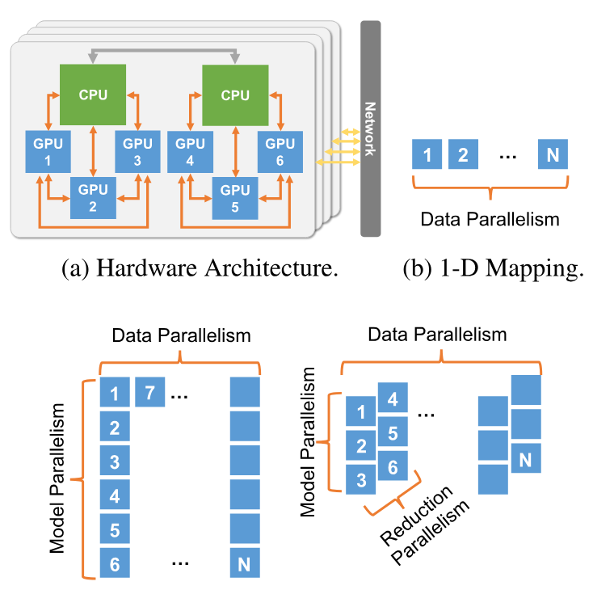

**图 7.** 评估所用计算节点的机器映射示例. (a) 给出节点硬件架构, 其中橙色和灰色箭头分别表示 NVLink 和 X-Bus. 映射示例中的数字表示 GPU ID.

Unity 提供一套全面的机器映射, 覆盖并行机器的有效使用方式. 开发者还可以注册针对特定硬件架构定制的机器映射. 例如, 当集群中的不同节点对具有不同的网络带宽与延迟时, 可以在现有机器映射中增加一个维度, 用于表示节点级局部性.

机器映射带来两个重要性质: 表达能力和可扩展性. PCG 中并行任务的所有有效分布只需少量机器映射就能涵盖, 机器硬件架构中的复杂特征也可通过添加额外机器映射方便地利用. 机器映射还能让 Unity 在设备数量上线性扩展的同时覆盖所有有效的设备分配, 并从候选范围中排除低效分配, 从而帮助 Unity 的搜索算法.

### 3.3 并行化算子

Unity 使用六种并行化算子, 表示不同并行化策略带来的计算与通信成本. 这六种算子又分为三对, 每一对中的一个算子都是另一个算子的"反向传播" (例如, 对 Partition 做反向传播后, 它在语义上等价于 Combine, 反之亦然). 三对算子如下:

1. *Partition 与 Combine:* Partition 和 Combine 改变张量的并行度. 更具体地说, Partition 把某个张量维度拆分为多个大小相同的分区, 从而提高该维度的并行度, 如 [图 8a](#figure-08) 所示. Combine 执行相反操作: 将多个分区拼接为一个, 降低张量的并行度.

2. *Replicate 与 Reduce:* Replicate 和 Reduce 分别通过复制与求和张量, 控制副本维度的并行度, 如 [图 8b](#figure-08) 所示. 对权重张量应用 Replicate 操作时, 其反向传播自然地表示参数同步.

3. *Pipeline 与 Batch:* Pipeline 把张量维度拆分为大小相同的分区, 并一次处理一个分区; Batch 聚合不同迭代中的张量 (见 [图 8c](#figure-08)). 注意, Pipeline 不会改变张量维度的并行度, 而会减小该维度的大小.

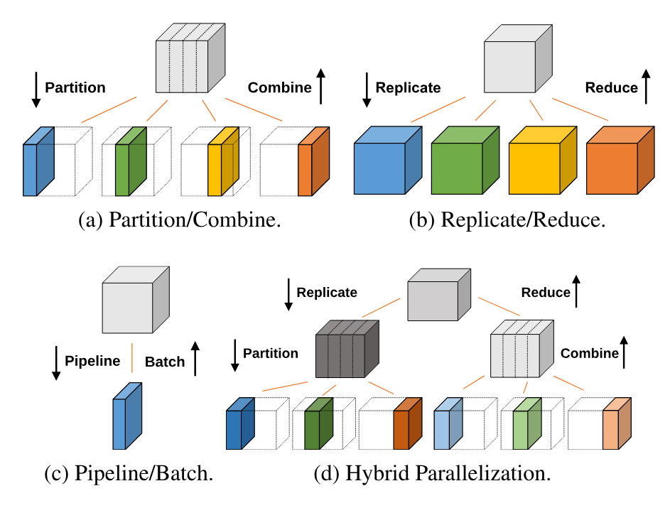

**图 8.** Unity 中的并行化算子.

作为 PCG 表达能力的基础示例, [图 9](#figure-09) 展示 Unity 的六种并行化算子如何表示 [第 2.1 节](#section-2-1) 中的若干并行化策略. 这些并行化算子还可以组合为混合并行. [图 8d](#figure-08) 给出了在同一张量维度上应用 Replicate 和 Partition 的例子: 先复制张量, 再对每个副本分区. 为提高效率, Unity 在运行时会把特定的并行化算子序列换成融合版本 (例如, Reduce 后接 Replicate 可以实现为 AllReduce).

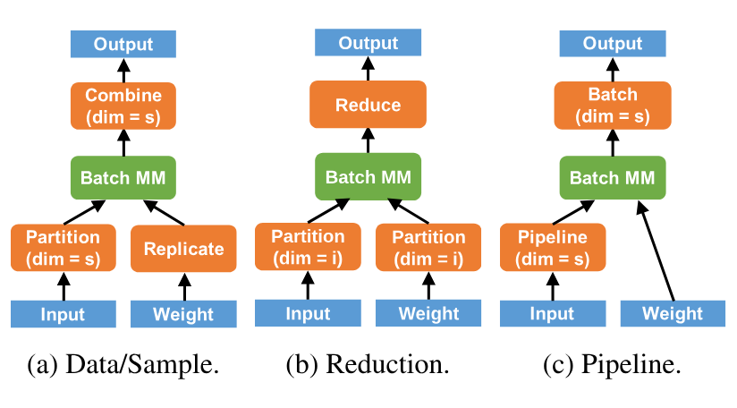

**图 9.** 用 PCG 表示批量矩阵乘法的不同并行化策略. $s$, $i$, $o$ 和 $h$ 分别表示样本, 输入通道, 输出通道和注意力头维度.

### 3.4 讨论与比较

Unity 选择 PCG 而非带注解的计算图, 是因为前一种表示更便于联合搜索, 并不是带注解计算图本身存在根本限制. 理论上存在与 PCG 同构的注解语言, 但尝试设计这种语言很快就会遇到许多困难.

第一, 每个算子都可采用不同的并行形式, 包括算子特定的并行形式, 因而注解数量很快就会大到难以处理. 哪些算子支持哪些注解, 以及这些注解的语义和组合方式, 都必须固化到表示本身. 相比之下, Unity 的 PCG 把这些知识转移到自动生成的 PCG 替换中. 这种关注点分离让 Unity 的核心更简单, 也更易维护.

第二, 如果不显式表示通信, 就必须根据数据流边两端节点的注解重建通信模式; Unity 考虑的并行形式表达能力很强, 使这种重建十分困难. 具体而言, 支持 $n$ 个并行维度需要考虑这些维度最多 $2^n$ 个不同子集, 因而算子之间可能存在 $2^n\times 2^n=4^n$ 种通信模式. Unity 在整个搜索过程中显式表示通信模式, 不再需要通过复杂分析重建它们. 用一小组并行化算子表示这些模式, 还能让 Unity 方便地识别并优化常见通信模式, 例如把一对 Reduce-Replicate 算子作为 AllReduce 执行. 在带注解的计算图中, 这些优化会与重建通信模式的代码纠缠在一起, 显著增加复杂度和实现工作量.

最后, 联合优化带注解的计算图很有挑战, 因为代数变换可能引入尚未并行化, 因而没有注解的新算子. 这样一来, 内部表示的信息不完整, 代价也没有定义. 可以增加一个机制来"补齐"缺失注解, 例如插入随机注解, 固定值, 相邻节点的值 (相邻节点采用不同并行化方式时会很棘手), 或评估所有有效并行化方案后选择最优者. 不过, Unity 的 PCG 将新算子的每种并行化策略表示为一个或多个 PCG 替换, 以高效统一的方式完成联合优化, 避免了上述额外复杂度.

**pONNX.** Unity 并非第一个把计算与并行性合并到一张图中的系统: pONNX [Wan19j] 曾提出使用 Split, Concat 以及自定义的 Send 和 Recv 算子实现这一点. 不过, Unity 着眼于优化, pONNX 则被设计成序列化格式, 这带来了几项重要差异.

第一, 在 pONNX 中, 并行度为 $n$ 的算子会被复制 $n$ 次, 优化器必须从多个节点中重建这个算子. Unity 只添加一个并行化算子, 因而该算子在 PCG 中仍是单个节点.

第二, pONNX 为每次通信分别分配 Send/Recv 节点, 使图的规模大幅增加. DNN 训练中的通信模式高度规律, 所以 Unity 不会将每次通信都实例化, 而是优化通信模式 (如 Reduce, Replicate 等); 这样既能表示通信成本, 又不必分析每次单独通信.

最后, pONNX 把设备放置作为算子的一部分, Unity 则以机器映射单独表示. 因此, Unity 的搜索可以单独优化设备分配, 并忽略大量能力相同的计算设备产生的对称性.

研究者还提出了其他统一表示 [San21, Sch21c], [第 7 节](#section-7) 将对此展开讨论.

## 4 图替换

Unity 把代数变换和并行化都表示为图替换, 因而联合优化能否奏效取决于是否有一组合适的图替换. 潜在替换数量会随大小呈指数增长, 所以 Unity 把大型复杂的代数变换与并行化策略表示为小型 PCG 替换的组合. 例如, [图 10](#figure-10) 给出了 Megatron-LM [Sho19] 中手工调优并行化策略对应的替换序列.

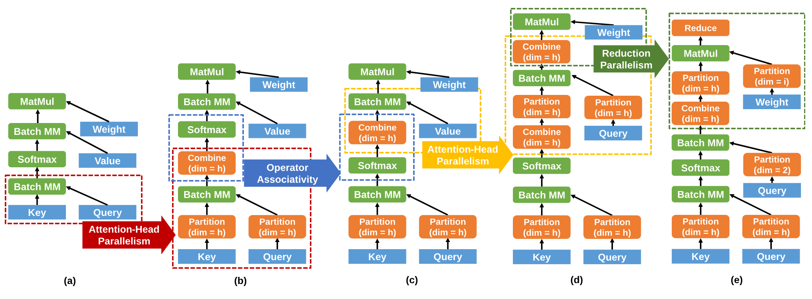

**图 10.** 将 Megatron-LM [Sho19] 中手工调优的并行化策略表示为 Unity 中一系列基础图替换. `BatchMM` 和 `MatMul` 分别表示批量矩阵乘法和普通矩阵乘法. 每个箭头表示一次图替换, 同色虚线子图分别是替换的源图与目标图. 对 `Partition` 和 `Combine`, 括号表示操作所针对的数据维度.

**替换生成.** 为减少支持新并行化策略所需的工程工作, Unity 会自动生成大小不超过固定上限的所有有效 PCG 替换, 对其正确性进行形式化验证, 并以它们作为搜索算法构造复杂优化的"基集". 这样, Unity 不仅能自动发现代数变换与并行化策略, 还能找到以往自动化方法遗漏的新型混合优化. 为此, Unity 采用 TASO 的超优化方法 [Jia19b].

与 TASO 一样, Unity 分两步发现替换: 先用快速启发式方法找出候选替换, 再通过成本更高的形式化验证确保正确性. 为找到候选替换, Unity 会枚举大小不超过固定上限的所有可能 PCG. 这个固定上限不会限制 Unity 可应用的变换大小, 因为许多较大的替换都由较小替换组合而成.

对于每个生成的 PCG, Unity 都会计算一个指纹: 用若干固定输入张量执行该 PCG, 再对输出张量取哈希. 为让 Unity 能计入并行化, 我们扩展了 TASO [Jia19b] 的指纹函数, 加入每个张量维度的并行度. 如果两个 PCG 的指纹相同, 则把它们视为一组候选替换. 加入并行性后, 除 TASO 先前找出的 743 个候选替换外, Unity 又发现了 651 个新候选替换.

**替换验证.** 与 TASO 类似, Unity 使用自动定理证明器对新替换进行形式化验证 (我们的实现使用 Z3 [Dem08]). 算子规约以一阶逻辑给出, 其中算子表示为输入与配置参数的函数. 例如, `Reduce(d,x)` 定义输入为 $x$, 并行度为 $d$ 的 `Reduce` 算子. `Reduce` 与矩阵乘法可交换这一事实由下面的算子性质刻画 (其中 `Replicate(d,y)` 表示输入为 $y$, 并行度为 $d$ 的 `Replicate`):

$$
\forall d,x,y.\;\mathrm{Matmul}(\mathrm{Reduce}(d,x),y)=\mathrm{Reduce}(d,\mathrm{Matmul}(x,\mathrm{Replicate}(d,y)))
$$

我们沿用 TASO 开发算子并行化性质的方法: 尝试用 Z3 对所有候选替换进行形式化验证; 如果某个替换正确但无法验证, 就补充缺失的算子性质. 重复这一过程, 直到 Unity 新发现的 651 个替换全部通过验证. 总体而言, 除 TASO [Jia19b] 的 43 条性质外, 我们还加入了 33 条算子性质 ([表&nbsp;2](./taso.md#table-02)), 用来验证所有 PCG 替换.

替换生成与验证合计需要 30 分钟. 可用替换只会在加入新算子或新并行形式时发生变化, 因此这一过程可以完全离线运行, 不会影响 Unity 联合搜索算法的执行时间.

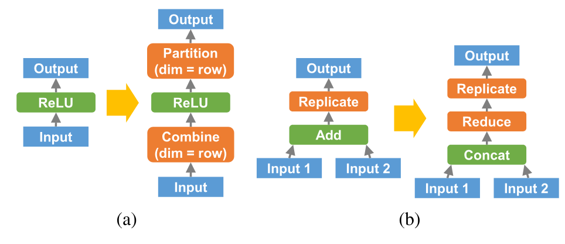

**图 11.** 替换 (a) 表明空间并行对 `ReLU` 有效. 替换 (b) 展示一个代数-并行混合变换: 把 `Add` 变为 `Concat` 后接 `Reduce`, 使 Unity 可以采用效率更高的 AllReduce 通信模式.

**替换示例.** Unity 生成的大多数新替换只是说明某个算子可采用哪些并行形式. 例如, [图 11a](#figure-11) 中的替换表明 ReLU 支持沿行维度的空间并行. 不过, 组合代数变换与并行化也会产生新的混合形式, 如 [图 11b](#figure-11) 所示: Unity 发现 Add 算子等价于 Concat 后接 Reduce. 在左侧 PCG 中, 如果 Input 1 和 Input 2 位于不同设备上, 而 Output 必须复制到这些设备上, 那么 Input 1 和 Input 2 就必须发送到同一设备完成加法, 再从该设备发回. 应用这一变换后, Unity 可以通过 Concat (不移动数据) 把输入张量合并为一个分布式张量, 并把通信替换为 Reduce 后接 Replicate (实现为 AllReduce).

## 5 联合优化

本节介绍 Unity 用于联合优化代数变换与并行化的搜索算法. 核心问题如下: 给定一张 PCG ([第 3 节](#section-3)), 一组算子级机器映射 ([第 3.2 节](#section-3-2))和一组 PCG 替换 ([第 4 节](#section-4)), 找出 (1) 一个 PCG 替换序列和 (2) 结果 PCG 的机器映射, 使每次迭代的训练时间最短. 主要挑战在于, 统一代数变换与并行化会产生大得多的指数级搜索空间. 搜索还必须同时扩展到复杂 DNN (即输入 PCG 很大) 和大量计算设备 (即算子级机器映射集合很大).

Unity 使用 [图 12](#figure-12) 所示的三级分层搜索算法. 简单来说, Unity 把输入 PCG 拆分为子图, 为每个子图确定优化后的替换序列 (这要求为每个候选项确定优化后的机器映射), 再把这些子解组合成最终输出. 因此, Unity 可以扩展到包含 300 多个算子的 DNN 和拥有 192 块 GPU 的机器, 同时把搜索时间控制在 20 分钟以内; 相比训练现代 DNN 所需的数小时甚至数天, 这点时间可以忽略.

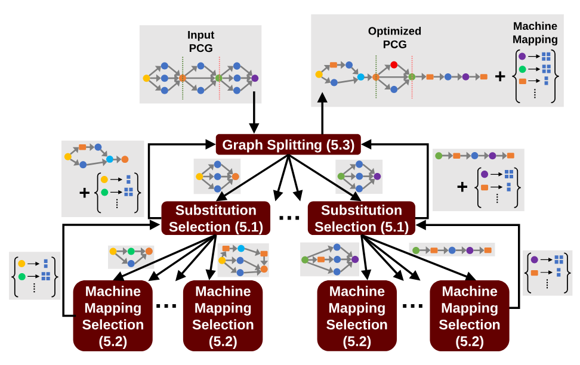

**图 12.** Unity 分层搜索的高层示意图.

下一节将更详细地说明 Unity 的搜索算法. [第 5.1 节](#section-5-1), [第 5.2 节](#section-5-2) 和 [第 5.3 节](#section-5-3) 介绍该算法的三个层级: 从中间层 (替换选择) 开始, 接着是最底层 (机器映射选择), 最后引入最高层 (图拆分), 将其作为帮助 Unity 扩展到大型 DNN 的优化. 此后, 我们简要说明 Unity 如何估算成本, 以及如何调整搜索算法以接入流水线并行.

### 5.1 替换选择

Unity 使用 TASO [Jia19b] 的基于成本的回溯搜索算法, 寻找使输入 PCG 执行时间最短的替换序列. Unity 维护一个按执行时间排序的候选 PCG 队列; 在队列清空或超过固定预算前, Unity 反复从队列中取出最佳候选项, 并在适用时把每个可用替换应用于 PCG 中的每个位置, 以生成新候选项. 如果某个候选 PCG 的执行时间比当前所见最佳候选 PCG 差到超过某个阈值倍数, 则将其剪枝; 其余候选项插入队列. 用户可以借助阈值因子在搜索时间与探索量之间权衡. 实验中使用的阈值因子为 1.05 [+4]. 该算法允许 Unity 探索任意替换序列, 但需要精确的成本估算器来评估每个候选 PCG 的执行时间. PCG 只包含每个算子的并行化方式, 不包含为其分配的设备 (即机器映射), 因此成本估算器必须先确定优化后的机器映射. 每个候选 PCG 都会调用成本估算器, 所以必须用高效算法找出这一映射. [第 5.2 节](#section-5-2) 介绍了寻找优化机器映射的算法.

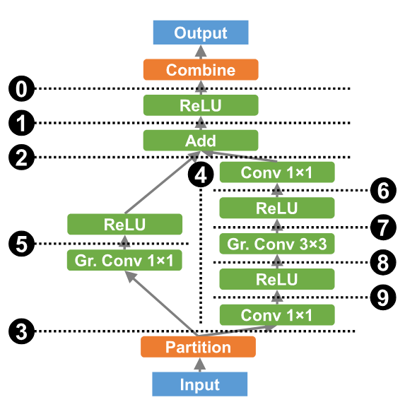

**图 13.** 对数据并行 ResNeXt 模块应用顺序图拆分与并行图拆分. 水平和垂直虚线分别表示顺序拆分与并行拆分, 数字表示应用顺序.

### 5.2 寻找优化后的机器映射

Unity 搜索算法的最底层为候选 PCG 找出优化后的机器映射. 这一层所依据的主要观察是, 大多数现代 DNN 架构由相互独立的并行计算分支所形成的线性链组成. 例如, ResNeXt [He16] 围绕两条并行卷积分支构建 (见 [图 13](#figure-13)), 再重复这些结构形成最终模型. Unity 利用这一结构, 分别通过顺序图拆分与并行图拆分, 递归地把这些线性链和并行分支分解为独立子图. [图 13](#figure-13) 展示如何迭代应用顺序图拆分与并行图拆分, 把一个 ResNeXt 模块分解成可用动态规划求解的递归子问题.

顺序图拆分通过寻找一个后支配节点 $n$ 来划分输入 PCG $G$, 使从 $G$ 的输入到输出的所有路径都经过 $n$. 该后支配节点把 $G$ 拆分为两个不相交的子图 $G_1$ 和 $G_2$. $G_2$ 全部依赖于 $n$, 而 $n$ 又依赖于整个 $G_1$, 因此 $G_1$ 中所有算子都必须在 $G_2$ 中任何算子开始前完成. 这样, 为 $G$ 寻找优化机器映射的问题便化为分别优化 $G_1$, $G_2$ 和 $n$ 的机器映射. 例如, 对 [图 13](#figure-13) 中的拆分 ❶, 假设此前没有应用其他拆分 (如 ⓿), 则 $n$ 是 Add 节点, $G_1$ 包含从 Input 开始直到 Add 之前的所有节点, $G_2$ 包含 Add 之后直到 Output 的所有节点.

并行图拆分将 PCG $G$ 划分为计算可并行执行的独立子图. 在这种情况下, Unity 会考虑两种运行 $G_1$ 和 $G_2$ 的方式: 顺序运行 (可以使用全部机器资源), 或并行运行 (两侧分别获得可用资源中彼此不相交的一部分), 再选择更快者. Unity 不允许混合串行与并行执行, 即各分支一部分并行, 一部分串行. 这虽然排除了某些策略, 但考虑这些策略会显著降低 Unity 的可扩展性, 因为这要求分析数量呈指数增长的算子交错执行方式; [第 6 节](#section-6) 的结果表明, 要获得良好性能并不需要这些策略.

为确定并行运行时如何划分可用资源, Unity 会遍历可分配给两侧的所有可能资源数量. Unity 只考虑资源数量, 因而忽略那些仅分配到的 GPU 不同, 而 GPU 数量和位置相同的重复划分, 将对所有设备子集的指数级搜索替换为对资源数量的二次搜索.

作为另一项优化, Unity 会缓存所有子图选定的机器映射. 替换选择会为每次替换生成一个新候选项, 而每次替换只修改 PCG 的一小部分, 所以许多候选 PCG 的大部分子图与其他候选项相同. 这样, 除当前替换所修改的 PCG 部分外, Unity 可以跳过其他部分的成本与机器映射计算.

### 5.3 扩展到大型图

即使采用动态规划算法和跨调用缓存, 目前介绍的搜索算法仍无法扩展到大型模型. 为理解原因, 我们考察替换选择中的候选 PCG 数量如何随输入 PCG 的大小增长.

如 [第 5.1 节](#section-5-1) 所述, Unity 在每次迭代中, 都会为每个替换的每种可能应用方式生成一个候选 PCG. 在最坏情况下, 这需要考察 $O(2^{gs})$ 个候选项, 其中 $g$ 是 PCG 的节点数, $s$ 是 Unity 考虑的替换数. 实际上, $s$ 对搜索时间的影响有限, 因为 Unity 考虑的替换中只有很小一部分能用于某个给定模型; 但对大型模型而言, $g$ 带来的指数增长会成为问题.

为解决这个问题, 我们借鉴 [第 5.1 节](#section-5-1) 的方法, 把 PCG 分解为彼此独立的顺序子图. 但这样会阻止替换跨越拆分位置应用, 而 Unity 用替换表示并行化, 因此这会产生问题. 所以, 朴素的图拆分会把所有拆分位置上的并行度降为 1, 排除许多常见且重要的并行化策略, 例如对整个模型采用数据并行.

Unity 通过显式搜索每个拆分位置上的最优并行化方案解决这个问题. 更具体地说, 对跨越拆分位置所传递张量的每一种可能分区方式, Unity 都会在以下条件下优化所得的两个子图: 第一个子图的输出和第二个子图的输入必须都与当前所考虑的分区方式匹配. 如果任一子图不满足该条件, 就插入并行化算子, 确保分区方式变化产生的所有通信成本都被计入.

这种方法适用于 Partition 和 Combine, 但在 Replicate 与 Reduce 上会遇到问题. 例如, 假设跨越拆分位置的张量副本度被搜索算法固定为 2. 为强制第一个子图以这种格式输出张量, 搜索算法可以把 Replicate 插为其最后一个操作; 类似地, 算法可以把 Reduce 插为第二个子图的第一个操作. 但这样会错误地把张量放大 2 倍! 根本原因在于, Replicate 和 Reduce 不像 Partition 与 Combine 那样互为逆操作. 好在实践中, 跨越计算图许多节点的归约并行很少有用, 所以我们把拆分位置上的分区方式限定为副本度只能是 1.

为减少这些拆分所阻止的代数变换数量, Unity 沿用 MetaFlow [Jia19] 的做法, 在保证子图最小大小为 $k$ [+5] 的同时, 选择破坏替换数最少的拆分位置. 因此, 图拆分把最坏情况下的候选 PCG 数量从关于 $g$ 的指数级降为线性级, 具体来说, 从 $O(2^{gs})$ 降为 $O\left(\frac{gp}{k}\times 2^{ks}\right)$, 其中 $p$ 是有效张量分区方式的数量.

**成本估算.** 为估算算子运行时间与通信成本, 我们采用与既有工作相似的方法 [Jia18, Jia19a]. 也可以使用更准确的成本模型 [San21], 但我们尚未发现模型不准确造成的问题.

**流水线并行.** 在考虑流水线并行时, Unity 采用 1F1B 调度 (即在每个设备上交错执行前向和后向微批次), 并采用 PipeDream-2BW [Nar21b] 的权重更新语义, 从而同时取得高训练吞吐量与低内存占用. 为缩小搜索空间, Unity 只考虑对 PCG 中所有算子应用流水线并行的策略, 因为 PCG 中存在非流水线并行算子会使流水线并行失去优势. 与既有工作 [Hua19, Nar19, Zhe22] 类似, Unity 只考虑顺序流水线并行, 其中每个阶段只与流水线中的下一个阶段通信 (最后一个阶段除外, 它会在前向处理后直接执行反向传播). Unity 还沿用既有工作 [Fan21a, Hua19, Tar21] 的假设: 一个小批次中的微批次数远大于流水线阶段数, 因此可以忽略流水线初始化引入的额外延迟. 这些约束使 Unity 能在维持合理搜索时间的同时, 探索包含现有流水线并行策略的广泛搜索空间. 搜索算法也略有调整: 不再以每次迭代的运行时间近似吞吐量, 而是直接将吞吐量最大化.

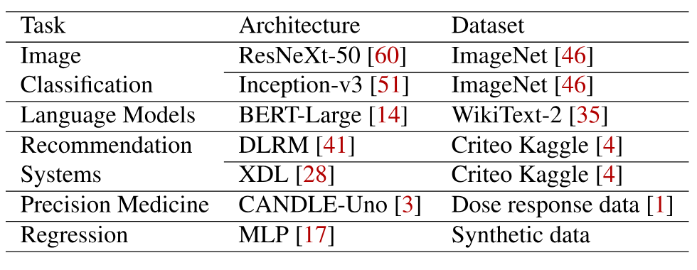

**表 1.** 所评估 7 个 DNN 的概况.

## 6 评估

### 6.1 实现与实验设置

Unity 构建在分布式多 GPU DNN 训练运行时 FlexFlow [Jia19a] 之上. 我们修改 FlexFlow, 用 PCG 表示模型, 加入对 Unity 新增并行形式的支持, 并用 [第 5 节](#section-5) 介绍的算法替换 FlexFlow 的随机搜索. 替换生成器 ([第 4 节](#section-4))构建在 TASO [Jia19b] 之上, 并扩展其指纹函数以考虑并行化. 我们还加入了 33 条并行化特有的性质, 替换验证器把它们作为刻画并行化算子语义的公理.

所有实验均在 Summit 超级计算机 [Sum18, Vaz18] 上完成. 每个计算节点配备两颗 IBM POWER9 CPU, 512 GB 主存和 6 块 NVIDIA Volta V100 GPU. 同一节点内有 3 块 GPU 连接到同一颗 CPU, 并通过 NVLink 互连. 节点之间使用 Mellanox EDR 100Gb InfiniBand 连接.

**DNN.** [表 1](#table-01) 总结了评估所用的 7 个 DNN 模型. ResNeXt-50 [Xie16] 和 Inception-v3 是常用的图像分类 DNN. BERT [Dev19] 是一种语言模型, 在一系列语言任务上达到当时最先进的准确率. DLRM [Nau19] 和 XDL [Jia19d] 是用于个性化与广告推荐的深度学习推荐模型. CANDLE-Uno [Uno18] 是用于精准医疗的 DNN 架构. 多层感知机 [Gar98] (MLP) 是广泛用于多种回归任务的架构, 也是许多 DNN 的核心组件.

训练超参数 (如批大小, 学习率) 遵循既有工作 [Uno18, Dev19, Mud21, Nau19, Xie16]. 我们报告每块 GPU 的小批次大小 $B$: 使用 $n$ 块 GPU 运行时, 全局小批次大小为 $n\times B$. 全局小批次大小与文献报告一致. ResNeXt-50 和 Inception-v3 的每 GPU 小批次大小为 64, BERT-Large 为 4, DLRM 和 XDL 为 1024, CANDLE-Uno 和 MLP 为 256. MLP 模型包含 16 个全连接层, 每层的隐藏维度均为 8192. BERT-Large 使用 Adam [Kin15], 学习率为 0.0001; 其他 DNN 使用 SGD [Goy17a], 学习率为 0.01.

除非另有说明, 与不支持流水线并行的框架比较时会禁用流水线并行.

我们在 [图 15a](#figure-15) 中评估流水线并行的影响.

**搜索时间.** 除 Inception-v3 外, 所有 DNN 的 Unity 搜索时间都不超过 10 分钟, 即使用最大的 GPU 数量 (即 192 块) 也是如此. Inception-v3 是评估中最复杂的架构, 包含 323 个算子, 但其搜索也能在 20 分钟内结束. 与训练这些 DNN 所需的数小时或数天相比, 这些时间可以忽略.

### 6.2 端到端评估

我们比较 Unity 与 Megatron [Sho19], Deep-Speed [Raj19] 等现有框架的端到端训练性能. 我们还比较用 TASO [Jia19b] 与 FlexFlow [Jia19a] 执行顺序优化的结果 (即先运行 TASO, 再运行 FlexFlow). Megatron [Sho19] 和 Deep-Speed [Raj19] 要求用户手动优化每个模型, 因此这些基线只覆盖部分模型; FlexFlow 和 Unity 的自动化方法则可用于全部 7 个模型. 结果见 [图 14](#figure-14).

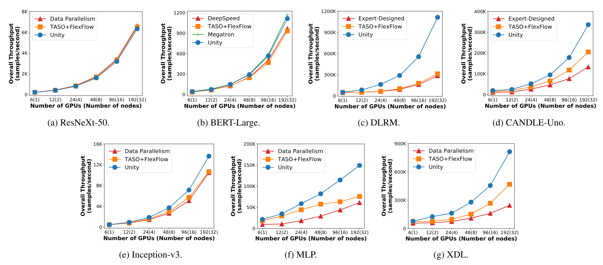

**图 14.** 现有框架与 Unity 的训练吞吐量比较. 实验在 Summit 超级计算机 [Sum18] 上完成, 每个节点使用 6 块 GPU. 所有数值均由 1000 次训练迭代取平均得到.

BERT-Large 已被 Megatron 和 DeepSpeed 等现有框架高度优化, 这些框架采用专家设计的策略组合多种并行形式. 因此, Unity 并不以超过这些策略为目标. 这项评估的主要目的, 是判断 Unity 能否在几分钟的自动搜索中重新发现这些手工调优策略. 需要说明的是, Megatron 和 DeepSpeed 要求用户手动指定数据并行, 张量模型并行与流水线并行的全部并行度, 因此我们探索其支持的不同并行度组合, 并报告最佳性能.

Unity 的性能与 Megatron 相当, 并超过 DeepSpeed 和 FlexFlow. 我们发现, Unity 找到的最佳策略几乎与 Megatron 中专家设计的策略相同: 唯一区别是, 对某些矩阵乘法, Megatron 使用归约并行, Unity 使用数据并行; 这对整体训练性能的影响可以忽略. 这说明即使面对高度优化的模型, Unity 也能自动生成与领域专家手工设计方案相当的并行化优化. Megatron 为基于 Transformer 的语言模型定制, 不支持评估中的其他 DNN. 在我们看来, Unity 找到的并行化策略能与 Megatron 的专家设计策略相匹配, 是一个积极结果.

DLRM 与 CANDLE-Uno 都超过单块 GPU 的内存容量, 因而无法进行数据并行训练. 对这两个模型, 我们使用 [Mud21] 提出的专家设计策略作为基线; 该策略对通信密集型算子 (如嵌入表) 使用模型并行, 对计算密集型算子 (如矩阵乘法) 使用数据并行. 在 DLRM 上, Unity 比两种专家设计策略和 TASO+FlexFlow 最高快 $3.6\times$; 在 CANDLE-Uno 上最高快 $1.6\times$. 对其他所有模型, 我们将 Unity 与数据并行和 TASO+FlexFlow 比较.

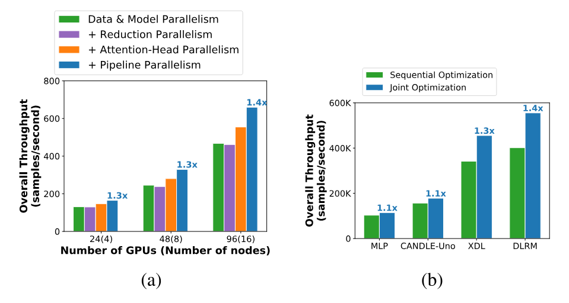

**图 15.** (a) BERT-Large 接入不同并行维度后的端到端性能. 加速比以数据并行 + 模型并行为基准. (b) 在 96 块 V100 GPU (16 个节点) 上完全由联合优化相对于顺序优化带来的加速. 搜索空间和算法保持不变, 以排除 Unity 更大搜索空间和更强搜索可扩展性的影响.

Unity 在 ResNeXt-50, Inception-v3, MLP 和 XDL 上分别比现有最佳方法快 $1.0\times$, $1.3\times$, $2.0\times$ 和 $1.9\times$. ResNeXt-50 没有获得提升, 这是预料中的结果, 因为该模型的最优策略 (数据并行) 已是大多数框架的默认选择.

我们观察到, 性能提升来自两点: (1) 支持算子特定并行; (2) 联合优化代数变换与并行化. 下面的实验将进一步分析这些细节.

### 6.3 并行维度

为评估不同并行维度如何提升训练性能, 我们在 BERT-Large 上对 Unity 做消融实验: 逐步向 Unity 加入新维度, 并测量训练吞吐量. 结果见 [图 15a](#figure-15). 与数据并行和模型并行相比, 单独加入归约并行并不能提升训练性能; 但归约并行与注意力头并行组合后, 性能最高提升 $1.2\times$, 因为如 [图 10](#figure-10) 所示, 优化 BERT-Large 中的注意力算子同时需要归约并行与注意力头并行. 启用流水线并行后, 总体加速达到 $1.4\times$. 这一结果表明, 混合策略与算子特定维度对 DNN 训练性能很重要.

### 6.4 联合优化

为评估 Unity 的联合优化, 我们将其与代数变换和并行化的顺序优化进行比较. 结果见 [图 15b](#figure-15). 与 [图 14](#figure-14) 中的 TASO+FlexFlow 基线不同, [图 15b](#figure-15) 纳入了 Unity 额外的并行维度和更强的可扩展性, 从而隔离联合优化的影响. 因此, 性能提升 (最高加速 $1.4\times$) 完全来自联合优化而不是顺序优化. 下面详细研究三个例子.

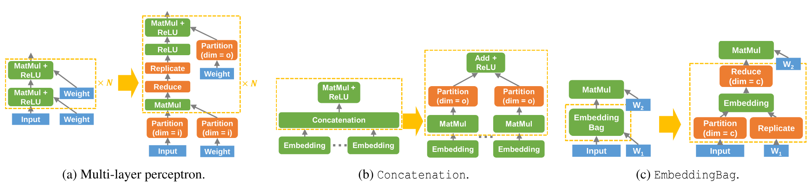

**图 16.** Unity 找到的计算图与并行化联合优化示例. 对 `Partition`, $i$ 和 $o$ 分别表示矩阵乘法的输入通道维度与输出通道维度.

第一个例子 ([图 16a](#figure-16)) 是 [图 2](#figure-02) 所示示例的轻微推广. 顺序优化中的代数优化器会忽略并行性, 因而会融合第一个 MatMul 和 ReLU; Unity 不执行这项融合, 便可利用归约并行和效率更高的 AllReduce (由 Reduce 后接 Replicate 表示) 大幅减少通信量.

第二个例子见 [图 16b](#figure-16). `Concatenation` 是 DLRM 和 XDL 的主要性能瓶颈, 因为它无法沿 `Embedding` 算子所用的同一维度并行化, 而且需要 all-to-all 同步. 这项优化把后续的 `MatMul` 替换为相互独立的多个 `MatMul`, 并采用与 `Embedding` 算子相同的模型并行策略来执行, 从而消除 `Concatenation`; `Embedding` 算子的输出只在本地使用, 因此通信成本随之降低.

第三项优化见 [图 16c](#figure-16). EmbeddingBag [Pyt21] 算子会为每个训练样本计算一组嵌入的总和. Unity 找到一项联合优化, 把 EmbeddingBag 变为普通 Embedding, 从而带来更多并行化机会.

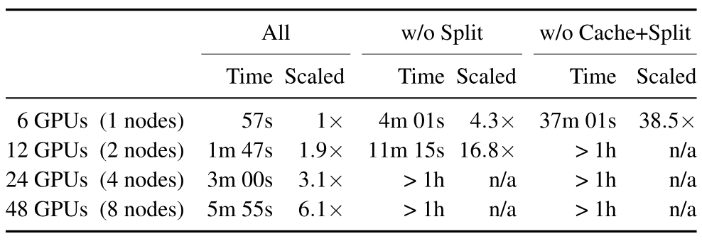

**表 2.** 搜索算法消融实验. "Scaled" 数值相对于启用全部优化时使用 2 块 GPU 的时间.

### 6.5 搜索算法

为评估 [第 5 节](#section-5) 介绍的三种搜索优化 (图拆分, 跨调用缓存和动态规划) 的影响, 我们对 ResNeXt-50 的搜索时间做消融实验. 同时启用三种技术时 ("All" 列), 从 6 块 GPU 增加到 48 块 GPU 的过程中, 搜索时间大致呈线性增长. 结合 [图 14](#figure-14) 的结果可知, Unity 的搜索算法可以扩展到数量可观的节点.

禁用图拆分会让搜索时间增加 $4.3$-$8.8\times$, 且增长变为非线性; 再禁用跨调用缓存, 搜索时间还会增加 $8.9\times$. 禁用动态规划算法后, 即使最小的测试也会超时. 这些结果表明, 要取得足够好的性能, 提出的三种技术缺一不可.

## 7 相关工作

**手工设计的并行化策略.** 大多数现有 DNN 框架都使用手工设计的并行化策略来优化分布式 DNN 训练 [Onn21, Aba16, Pyt17, Raj19, Sha18a]. 例如, Neo [Mud21] 对计算密集型算子采用数据并行, 对通信密集型算子采用模型并行, 以此优化 DLRM. Megatron-LM [Sho19] 提出一种针对特定模型定制的策略, 组合数据并行, 归约并行与注意力头并行来训练大语言模型. 这些策略只适用于特定 DNN 模型, 无法泛化. 我们在评估中以这些专家设计策略为基线, 并表明 Unity 可以自动找到性能更好的策略.

**自动 DNN 并行化.** 近期工作提出多种自动优化分布式 DNN 训练的方法. 例如, ColocRL [Mir18, Mir17] 和 Placeto [Add19] 使用强化学习, 为模型并行寻找高效的设备放置方案. Baechi [Jeo20a] 使用两种受内存约束的算法, 为模型并行快速完成设备放置. FlexFlow [Jia19a] 通过随机搜索优化数据并行, 模型并行与空间并行. GSPMD [Xu21] 是 GShard [Lep20] 的推广, 它根据用户给出的提示寻找并行化策略. PipeDream [Nar19] 用动态规划寻找结合流水线并行与数据并行的优化策略. Tofu [Wan19b] 用递归搜索最小化通信时间, 并通过区间分析自动发现并行化维度. Tarnawski 等人 [Tar20, Tar21] 提出一种两级动态规划算法, 通过组合数据并行, 流水线并行与张量模型并行, 将 DNN 计算图划分到各设备上. Alpa [Zhe22] 用动态规划自动完成算子间并行 (即流水线并行), 用整数线性规划自动完成算子内并行 (即数据并行与张量模型并行). Whale [Jia21c] 通过计算均衡分区来适配异构计算设备, 并允许用小型并行化原语指定并行化策略. TensorOpt [Cai21] 引入成本前沿, 在自动并行化中同时考虑多个目标 (如执行时间和云资源成本). 最后, AutoSync [Zha20a] 从数千个样本中学习如何优化数据并行训练的同步策略. 不过, 现有方法 (Tofu 除外) 只支持有限的并行维度, 且没有一种方法联合优化代数变换与并行化. Unity 支持所有现有并行维度, 可以扩展到新算子与新并行形式, 并联合优化代数变换和并行化.

**自动代数变换.** TASO [Jia19b] 能自动发现 DNN 的代数变换, 但不支持并行化. Unity 借鉴 TASO 的超优化思想, 生成并验证 PCG 替换. 不过, 与 TASO 所处理的代数变换任务不同, Unity 面对的搜索空间大得多, 还要考虑设备分配等额外任务. 我们观察到, 仅靠 TASO 的搜索算法无法探索这个更大的搜索空间. 为解决这一问题, Unity 为搜索技术引入三个新要素: 用于寻找优化机器映射的动态规划算法, 利用图替换局部性的子图缓存, 以及与更多并行形式兼容, 帮助系统扩展到复杂模型的分治方法.

**自动 DNN 代码生成.** 近期工作提出了为 DNN 算子生成硬件特定代码的方法. TVM [Che18, Che18a] 使用基于学习的算法, 为多种硬件后端生成优化代码. Ansor [Zhe20] 扩展 TVM, 利用分层搜索算法探索规模大得多的候选程序空间. Unity 优化 DNN 计算的层级高于这些方法. 因此, Unity 的优化与它们相互独立, 可以和现有代码生成技术结合使用. 我们把在 Unity 中接入代码生成留作未来工作.

**DNN 并行化的中间表示.** TensorFlow [Aba16], MLIR [Lat21, Lat20], Relay [Roe19] 和 ONNX [Le20] 使用基于图的中间表示 (IR) 表达 DNN 计算. 模型的分布式训练通过给每个算子添加并行化策略注解来表示, 该策略描述算子如何跨设备并行化. 这些方法分别表示代数变换与并行化, 再依次优化, 因而会错过联合优化. pONNX [Wan19j], automap [Sch21c] 和 DistIR [San21] 提出了同时表达计算与通信的 IR, 但其层级太低, 无法用于 Unity 式联合优化 (详见 [第 3.4 节](#section-3-4)). Unity 使用更适合优化的高层表示 PCG, 并把并行化与代数变换都表示为 PCG 上的图替换.

## 8 局限与未来工作

为了扩展到大型 DNN 与大型机器, Unity 的搜索算法会利用现代 DNN 的顺序结构与并行结构 (见 [第 5.2 节](#section-5-2)). 但有些 DNN 架构 (如 NASNet [Zop18]) 不具备这种结构. 扩展 Unity 以纳入这些 DNN 会提高通用性, 但可能牺牲可扩展性.

Unity 成功优化了两类最主要的优化 (即代数变换与并行化), 但目前没有考虑其他多种优化, 如张量卸载和重物化 [Jai20, Kir20, Ren21]. PCG 可以扩展来表示这些优化, 但 [第 5 节](#section-5) 介绍的搜索算法没有考虑内存使用, 因而可能生成违反内存限制的并行化策略. 虽然可以在事后应用必要的张量卸载与重物化, 使这些无效策略变为有效策略, 但 Unity 的联合搜索不包含这些优化, 可能会产生次优性能. 因此, 将内存优化纳入 Unity 搜索算法是值得探索的未来研究方向.

Unity 的另一个局限在于对流水线并行的支持. PCG 虽能表示在同一张图中交错使用流水线并行算子与非流水线并行算子的并行化策略, 但我们的搜索算法为缩小搜索空间排除了这些情况. Unity 的搜索算法也不考虑非顺序流水线并行策略, 即一个阶段可以有多个前驱或后继阶段的情况.

## 9 结论

本文介绍 Unity, 这是第一个在分布式 DNN 训练中联合优化代数变换与并行化的系统. Unity 把并行化和代数变换都表示为统一图表示上的替换, 使用新的分层搜索算法找出优化后的替换序列, 并能扩展到大量 GPU 与复杂 DNN.

我们在 7 个真实 DNN 基准上使用最多 192 块 GPU 进行评估, 结果表明 Unity 比当前最先进的并行化方法最高快 $3.6\times$, 同时将优化时间控制在 20 分钟以内. 其中近一半加速仅来自联合优化相对于顺序优化的优势; Unity 由此表明联合优化可以实际使用, 未来系统必须纳入这类优化, 否则会错过显著的性能收益.

## 致谢

我们感谢匿名评审者提出的意见, 也感谢论文指导人 Byung-Gon Chun 的反馈. 本研究得到美国国家科学基金会研究生研究奖学金项目 (资助编号 DGE-1656518) 和 NSF 项目 CNS-2147909 的支持. 文中表达的任何观点, 发现, 结论或建议均属于作者, 不一定代表美国国家科学基金会的立场.

[+equal]: 贡献相同.

[+1]: 为避免歧义, 我们严格用*计算图*指代既有工作采用的传统计算图, 用*并行计算图*或 PCG 指代 Unity 新提出的统一表示.

[+2]: 空间并行在 [Jia19a] 中称为*属性并行*.

[+3]: [第 3.4 节](#section-3-4) 和 [第 7 节](#section-7) 讨论了其他表示.

[+4]: 选择这个具体数值是为了与 [Jia19b] 保持一致.

[+5]: 实验采用 $k=10$, 因为它能在子图足够小以取得良好可扩展性与被阻止的替换相对较少之间取得平衡.
