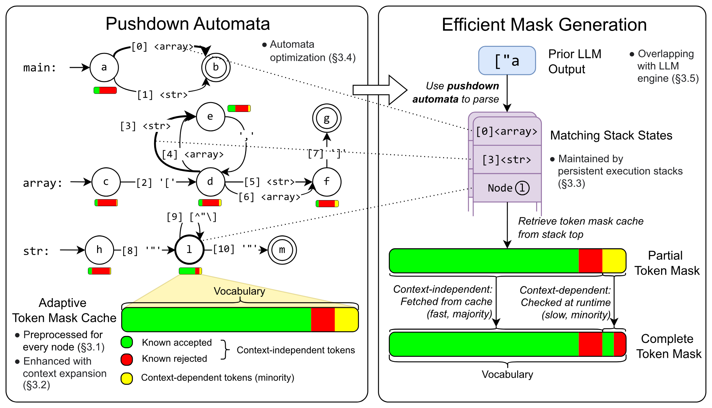
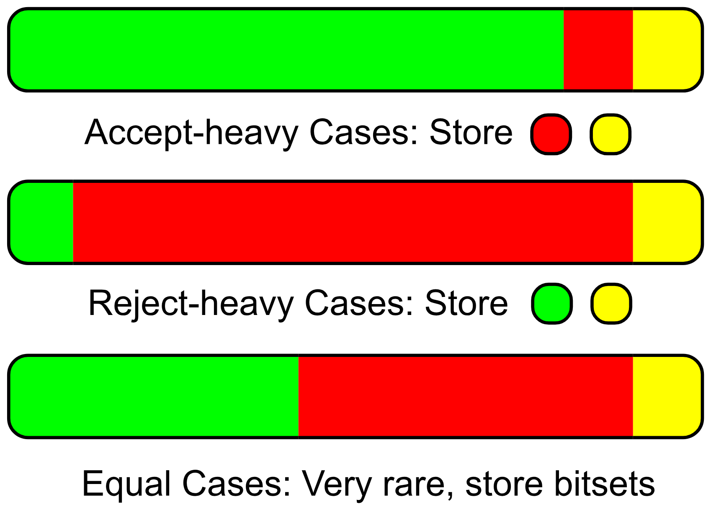
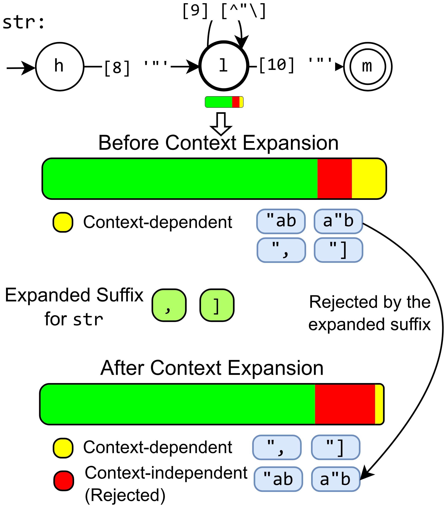

> [Yixin Dong](https://github.com/Ubospica), [Charlie F. Ruan](https://www.charlieruan.com/), [Yaxing Cai](https://dblp.org/pid/290/7679.html), [Ruihang Lai](https://ruihanglai.com/), [Ziyi Xu](https://acm.sjtu.edu.cn/~xzy2022/), [Yilong Zhao](https://ylzhao.me/) 和 [Tianqi Chen](https://tqch.github.io/). 论文于 2024 年 11 月 22 日首次提交至 arXiv, 当前版本为 v3, 并发表于 [MLSys 2025](https://proceedings.mlsys.org/paper_files/paper/2025/hash/5c20ca4b0b20b0bd2f1d839dc605e70f-Abstract-Conference.html). [XGrammar: Flexible and Efficient Structured Generation Engine for Large Language Models](https://arxiv.org/abs/2411.15100v3). <a href="/paper/xgrammar.pdf" target="_blank" rel="noopener noreferrer">原始 PDF</a>. [DOI](https://doi.org/10.48550/arXiv.2411.15100). [TeX 源文件](https://export.arxiv.org/e-print/2411.15100v3). 如需核对精确的印刷排版和参考文献, 请以原始 PDF 为准.

## 摘要

LLM 智能体的应用日益复杂且多样, 因而迫切需要能够解析为代码、结构化函数调用和具身智能体指令的结构化输出. 这些进展让 LLM 推理中的结构化生成需求显著增加. 上下文无关文法是一种灵活的方案, 可以通过受约束解码实现结构化生成. 不过, 执行上下文无关文法时, 运行期必须针对词表中的所有词元遍历若干栈状态, 给结构化生成带来不可忽略的开销. 本文提出 XGrammar, 一个面向大语言模型的灵活、高效结构化生成引擎. XGrammar 将词表划分为可预先检查的上下文无关词元, 以及需要在运行期解释的上下文相关词元, 以此加速上下文无关文法的执行. 我们还构造变换来扩展文法上下文, 减少上下文相关词元的数量. 同时, 我们设计了高效的持久化栈, 加速上下文相关词元的检查. 最后, 我们协同设计文法引擎与 LLM 推理引擎, 让文法计算和 GPU 执行重叠. 评测结果表明, XGrammar 相比现有方案最多可获得 100 倍加速. 与 LLM 推理引擎结合后, 它能在端到端、低延迟 LLM 服务中以接近零开销实现结构化生成.

## 1 引言

**图 1.** 方法概览. XGrammar 首先使用下推自动机解析此前的 LLM 输出, 灵活支持多种文法并得到匹配栈状态. 随后, 它用栈顶索引自适应词元掩码缓存这一关键优化, 取得部分掩码. 部分掩码中的大多数词元与上下文无关, 可在预处理阶段确定; 少部分词元与上下文相关, 需要在运行期判定. 两者共同构成完整的词元掩码, 从而实现高效的受约束解码.

大语言模型 (LLM) 近来的进展为代码生成 [Che21, Wan21h]、调试 [Pea22, Moz24]、通过函数调用来使用外部工具 [Ope24j, Lan24] 和机器人控制 [Liu23q] 等复杂应用创造了新的可能. 这些应用对*结构化生成*提出了很高的需求: LLM 的输出必须符合 JSON、SQL 或其他为任务定制的特定格式或文法. 下游应用随后便能自然地消费这些结构化输出, 继续与系统交互.

受约束解码 [Deu19, Kuc23] 是结构化生成中常用的方法. 它在每个解码步骤只允许生成符合结构的词元, 从而保证 LLM 输出遵守指定结构. 每一步中, 受约束解码先扫描整个词表, 找出无效词元并将其概率置零, 防止模型生成这些词元. 面对不同应用产生的丰富结构格式, 我们需要一种灵活的约束描述和检查机制. 上下文无关文法 (CFG) [Cho56, Poe22, Sch21d] 通过一组规则提供了通用的结构定义方式. 每条规则包含一串字符或其他规则, 可以递归组合成复杂结构. 相比正则表达式等替代格式, CFG 允许递归结构, 因而更为灵活, 适合描述 JSON、SQL 和领域特定语言 (DSL) 等常见语言.

但也正因为 CFG 很灵活, 直接将它用于受约束解码并不高效. 首先, 每个解码步骤都要对词表中的每个候选词元解释 CFG, 而 Llama 3.1 [Dub24] 的词表规模可达 128k. 其次, CFG 解释需要用栈状态追踪目前匹配过的递归规则, 不可能事先计算并缓存栈模式的全部组合. 最后, LLM 生成的每个词元包含多个字符, 词元可能跨越文法元素的边界, 在运行期引发进一步递归或栈弹出. 这种边界错位要求文法执行过程做细致处理.

为解决这些问题, 本文提出 XGrammar, 一个面向大语言模型的灵活、高效结构化生成引擎. XGrammar 构造字节级下推自动机来表示上下文无关文法 (CFG). 我们的核心见解如 [图 1](#figure-01) 所示: 将词元分为只需自动机局部上下文便能判定的**上下文无关词元**, 以及必须依赖完整栈状态的**上下文相关词元**. 我们预先计算所有上下文无关词元是否正确, 并把结果存入自适应词元掩码缓存; 缓存会针对自动机的不同位置选用专门的存储格式. 我们还设计了扩展每条局部规则上下文的算法, 以减少上下文相关词元的数量. 同时, 持久化栈系统能够快速分支和回滚状态, 加快上下文相关词元检查与缓存预处理. 最后, 我们协同设计文法引擎和 LLM 推理引擎, 使文法计算与 GPU 计算重叠, 把结构化生成的开销降到最低.

评测表明, 对上下文无关文法而言, XGrammar 的逐词元延迟相比当前最先进方法最多可降低 100 倍. 同时, 集成 XGrammar 的 Llama-3.1 LLM 服务引擎在 H100 GPU 上进行结构化输出的端到端服务时, 最多可获得 80 倍加速. 我们将开源 XGrammar, 并把它集成进主流开源 LLM 框架.

本文的主要贡献如下:

- 我们提出自适应词元掩码缓存, 利用上下文无关词元显著降低掩码生成开销.

- 我们设计持久化执行栈, 支持快速回滚、迅速分支和状态恢复, 加快上下文相关词元的处理.

- 我们构建了与 LLM 服务框架协同设计的高效文法引擎, 将结构化生成开销降至最低.

## 2 背景

### 2.1 LLM 受约束生成

**图 2.** 使用逐词元掩码的受约束解码. 逐词元掩码会阻止 LLM 生成在当前步骤中不符合结构的词元.

GPT-4 [Ope23]、Llama [Dub24] 和 Mistral [Jia23] 等大语言模型 (LLM) 以自回归方式生成文本: 根据此前的词元序列, 每次预测一个词元. 生成过程从初始提示开始, 模型不断追加词元, 直到响应完成. 在 LLM 中, 词元是基本输入和输出单位. 每个词元代表一段固定字符串, 但它未必对应完整的语义单元, 也可能截断一个 Unicode 字符 [Wan20e], 给结构化文本生成带来困难. 每一步中, 模型会输出覆盖整个词表的 logits 向量, 再通过 softmax 函数 [Bri89] 转换为概率分布. 采样器随后从该分布中选出下一个词元.

受约束解码会限制每一步可用的词元, 以引导 LLM 生成文本的结构, 如 [图 2](#figure-02) 所示. 每一步中, 任何会违反所需结构的词元都会被判为无效. 它们的 logit 被设为 $-\infty$, 因而经过 softmax 后概率为零, 其他有效词元之间的相对概率则保持不变. 这样便能保证只采样有效词元. 高效识别并屏蔽无效词元至关重要, 因为它直接影响生成速度.

**图 3.** 上: 一个可递归组合的数组和字符串上下文无关文法. 该 CFG 被转换为 [图 1](#figure-01) 中的下推自动机. <code>[^"\\]</code> 表示除 <code>"</code> 和 <code>\\</code> 之外的所有字符. 下: 用 CFG 匹配字符串 <code>["a</code> 时的两个可能匹配栈. 每个栈代表 CFG 规则的一种可能展开. 栈中的边和节点对应 [图 1](#figure-01) 中 PDA 的转移与状态.

### 2.2 上下文无关文法与下推自动机

上下文无关文法 (CFG) [Cho56] 广泛用于定义结构化生成中的结构. [图 3](#figure-03) 给出了一个例子: CFG 包含多条规则, 每条规则由字符或对其他规则的引用组成, 可以递归组合来定义复杂结构. 因此, CFG 适合描述 JSON、SQL 和各种领域特定语言. CFG 具有递归能力, 表达能力强于正则表达式等较简单的模式; 后者也常用于 LLM 结构化生成.

下推自动机 (PDA) [Sch63, Eve63] 使用栈管理嵌套结构, 通常用来识别 CFG 生成的语言. 本文采用一种与原始定义等价、但更便于说明算法的 PDA 定义. [图 1](#figure-01) 给出了 PDA 示例, [图 3](#figure-03) 则详细展示其栈. 一个 PDA 由多个有限状态自动机 (FSA) 组成, 每个 FSA 代表一条文法规则, 栈负责处理递归规则展开. FSA 中有两类转移: 接受特定字符的字符边, 以及允许递归进入其他规则的规则引用边. PDA 的形式化定义见 [第 7 节](#section-7). 匹配字符串时, PDA 从主规则开始, 把规则引用边压入栈中以递归展开子规则; 一条规则完全匹配后, 它弹出栈并回到上一条规则. 栈顶保存当前到达的节点. 如果文法是非确定性的, 即 PDA 对同一输入字符可能存在多种转移, PDA 可以为每条路径维护并行栈, 从而保持灵活性. 但栈长不受限, 可能状态数因而是无限的; 预先计算所有情形的词元掩码并不现实, 这给高效受约束解码带来了困难.

## 3 XGrammar

如 [图 1](#figure-01) 所示, XGrammar 使用字节级下推自动机解释上下文无关文法. 这种字节级设计允许每条字符边包含一个或多个字节, 能处理不规则的词元边界, 也支持包含不完整 UTF-8 字符的词元. 自动机的结构经过优化以加快匹配, 详见 [第 3.4 节](#section-3-4). 预处理阶段会生成 [第 3.1 节](#section-3-1) 所述的自适应词元掩码缓存, 通过预先计算上下文无关词元来加速运行期掩码生成. [第 3.2 节](#section-3-2) 的上下文扩展进一步增强了该缓存的效果. 运行期由词元掩码缓存快速生成大部分掩码, [第 3.3 节](#section-3-3) 的持久化执行栈则高效处理剩余的上下文相关词元. 同时, [第 3.5 节](#section-3-5) 让掩码生成与 LLM 推理重叠, 尽量降低受约束解码开销. LLM 在掩码约束下生成新词元后, 该词元会更新下推自动机的栈状态, 供下一次掩码生成使用.

### 3.1 自适应词元掩码缓存

**图 4.** 词元掩码缓存示例. 词元分为三类: 上下文无关且接受、上下文无关且拒绝, 以及上下文相关. 前两类可在运行期生成掩码时直接确定.

为了加快词元掩码缓存的生成, 自适应词元缓存将词元分成两类 ([图 4](#figure-04)): 占绝大多数且可以预先计算的上下文无关词元, 以及数量较少、但需要在运行期较慢地即时处理的上下文相关词元. 这种分类取决于下推自动机如何验证词元. 考虑栈状态的转移后, 我们发现词元与自动机的匹配过程可以分成三类:

1. 匹配过程展开到子规则, 将新元素压入栈中.

2. 匹配过程在当前规则内前进, 把栈顶节点更新到新位置.

3. 匹配过程到达当前规则末尾并返回父规则, 从栈中弹出元素.

验证前两种情形的词元只依赖栈顶节点, 它代表当前规则内的位置, 因此我们把这些词元定义为*上下文无关词元*. 第三种情形的词元则需要在验证时检查完整的运行栈, 因此称为*上下文相关词元*. 对下推自动机的每个节点, 都存在一组在运行期以该节点为栈顶的上下文无关词元, 它们是否有效可以提前确定. 因而, 我们预先计算这些词元的有效性, 并以栈顶节点为键存入缓存, 称其为自适应词元掩码缓存. 如下一段所述, 它还会根据缓存内容, 自适应地选择最高效的存储格式.

运行时, 我们根据栈顶直接取得上下文无关词元的有效性, 生成词元掩码. 剩下的少量上下文相关词元则用完整栈执行下推自动机来验证. 如果文法的歧义产生了并行栈, 就对各栈掩码中的接受词元取并集, 合并成最终词元掩码. 本方法不必在运行期检查上下文无关词元, 因此大幅减少了词元掩码计算量. 实验表明, 使用 JSON 文法的 Llama-3.1 模型中, 上下文相关词元只占很小一部分, 不到 1% (128k 中的 1134 个).

**图 5.** 自适应存储格式. 在接受占优的情形中, 缓存保存拒绝词元和上下文相关词元. 在拒绝占优的情形中, 缓存保存接受词元和上下文相关词元. 极少数两类词元数量相当的情形中, 缓存将接受和拒绝词元压缩成一个与词表等长的位集.

**自适应存储.** 如 [图 5](#figure-05) 所示, 词元掩码缓存采用自适应存储格式来减少内存占用. 对每个自动机节点, 缓存将词表分为三部分: 接受的上下文无关词元、拒绝的上下文无关词元和上下文相关词元. 三者共同覆盖所有词元, 因而只保存其中较小的两个子集即可. 我们观察到, 一组上下文无关词元往往几乎全被接受, 即*接受占优*, 或几乎全被拒绝, 即*拒绝占优*. 原因在于, 如果当前节点可以匹配通配符, 例如字符串规则中的 `[^"\\]*`, 几乎所有词元都有效; 如果节点只接受少数特定字符, 则几乎所有词元都无效. 据此, 我们设计了如下自适应存储格式:

1. 对接受占优的情形, 用两个数组保存被拒绝的上下文无关词元和上下文相关词元.

2. 对拒绝占优的情形, 用两个数组保存被接受的上下文无关词元和上下文相关词元.

3. 对接受和拒绝词元数量大致相等的少见情形, 保存接受和拒绝的上下文无关词元, 并将其压缩成一个与词表等长的位集.

因此, 无论接受占优还是拒绝占优, 自适应存储格式都只需保存很小的词元子集, 能显著减少内存占用. 实际实现会枚举三种存储类型, 分别计算成本, 再选择占用最小的一种. 对 Llama-3.1 模型和 JSON 文法, 该方法能将总内存占用降至原来的 0.2% (从 160 MB 降到 0.46 MB).

存在多个并行栈时, 还需要合并词元掩码. 如 [算法 1](#algorithm-01) 所示, 掩码合并算法会针对存储类型优化. 对接受占优的掩码 (接受词元很多, 只保存拒绝词元), 它将拒绝词元与 $\mathit{PartialRej}$ 取交集. 对拒绝占优的掩码 (拒绝词元很多, 只保存接受词元), 它将接受词元并入 $\mathit{PartialAcc}$. 最终掩码中的拒绝词元是差集 $\mathit{PartialRej} \setminus \mathit{PartialAcc}$. 该算法把集合运算限制在较小的词元子集上, 因而更高效.

**算法 1: 高效合并词元掩码.**

- **输入:** $k$ 个并行栈的词元掩码 $\{M_i=(\mathit{Acc}_i,\mathit{Rej}_i)\}_{i=1}^{k}$, 词表 $\mathcal{V}$.
- **输出:** 最终词元掩码 $M=(\mathit{Acc},\mathit{Rej})$.
- **初始化:** $\mathit{PartialAcc}\gets\emptyset$, $\mathit{PartialRej}\gets\mathcal{V}$.
- **对** $i=1$ **到** $k$:
  - **如果** $M_i$ 接受占优:
    - $M_i$ 只保存拒绝词元列表 $\mathit{Rej}_i$.
    - $\mathit{PartialRej}\gets\mathit{PartialRej}\cap\mathit{Rej}_i$.
  - **否则:**
    - $M_i$ 只保存接受词元列表 $\mathit{Acc}_i$.
    - $\mathit{PartialAcc}\gets\mathit{PartialAcc}\cup\mathit{Acc}_i$.
- $M\gets\bigl(\mathcal{V}\setminus(\mathit{PartialRej}\setminus\mathit{PartialAcc}),\ \mathit{PartialRej}\setminus\mathit{PartialAcc}\bigr)$.

### 3.2 上下文扩展

**图 6.** 上下文扩展. 每条规则都会得到一组扩展后缀, 表示完成该规则后必须匹配的字符串集合. 上下文相关词元中尚未匹配的部分必须是扩展后缀的前缀, 或以扩展后缀开头, 否则该词元会被拒绝.

**算法 2: 提取扩展后缀自动机.**

- **输入:** 下推自动机 $\mathcal{P}$, 规则 $R$.
- **输出:** $R$ 的扩展上下文 FSA $\mathcal{A}_R^{\mathrm{ctx}}$.
- **初始化:** 将 $\mathcal{A}_R^{\mathrm{ctx}}$ 设为空 FSA.
- **对** $\mathcal{P}$ 中引用 $R$ 的边 $s\xrightarrow{R}t$:
  - 将 $\mathcal{A}_{\delta}$ 初始化为空 FSA, 并令 $\mathit{visited}\gets\{\}$.
  - 将节点 $t$ 加入 $\mathcal{A}_{\delta}$.
  - $\mathrm{ExtractOne}(t,\mathcal{A}_{\delta},\mathit{visited})$.
  - $\mathcal{A}_R^{\mathrm{ctx}}\gets\mathrm{FSAUnion}(\mathcal{A}_R^{\mathrm{ctx}},\mathcal{A}_{\delta})$.
- **函数** $\mathrm{ExtractOne}(\mathit{start},\mathcal{A}_{\delta},\mathit{visited})$:
  - **如果** $\mathit{start}$ 在 $\mathit{visited}$ 中:
    - **返回.**
  - 将 $\mathit{start}$ 加入 $\mathit{visited}$.
  - **如果** $\mathit{start}$ 是 $\mathcal{P}$ 中的终态节点, **或**存在引用其他规则的边:
    - 在 $\mathcal{A}_{\delta}$ 中将 $\mathit{start}$ 标为终态.
    - **返回.**
  - **对**从 $\mathit{start}$ 出发的边 $\mathit{start}\xrightarrow{c}\mathit{end}$:
    - 将 $\mathit{end}$ 和 $\mathit{start}\xrightarrow{c}\mathit{end}$ 加入 $\mathcal{A}_{\delta}$.
    - $\mathrm{ExtractOne}(\mathit{end},\mathcal{A}_{\delta},\mathit{visited})$.

自适应词元掩码缓存虽然能有效减少运行期需要检查的词元数, 但检查所有上下文相关词元仍是运行期的效率瓶颈. 为进一步减少这些词元, XGrammar 引入了 [图 6](#figure-06) 所示的上下文扩展. 它利用文法的上下文信息, 在预处理阶段拒绝更多上下文相关词元.

上一节提到, 匹配到当前规则末尾、但词元仍有剩余部分时, 需要返回父规则继续检查, 此时词元便是上下文相关的. 不过, 分析文法可知, 很多情况下词元剩余部分本身就是无效的. 这是因为许多规则到达末尾后, 在父规则中只能返回有限的几个位置, 从这些位置继续匹配的字符串集合也很有限.

据此, 上下文扩展会为每条规则预先计算返回父规则后可接受的字符串集合, 称为*扩展后缀*. 上下文相关词元中尚未匹配的部分必须是扩展后缀的前缀, 或以扩展后缀开头, 否则就会被拒绝. 这一过滤过程排除了在更高层规则上下文中必然失败的词元, 有效减少了上下文相关词元. 对 Llama-3.1 模型和 JSON 文法, 该技术将上下文相关词元减少了 90% (从 1,134 个降到 120 个).

[算法 2](#algorithm-02) 描述了为每条规则寻找扩展后缀的上下文扩展过程. 对规则 $R$, 我们用有限状态自动机 (FSA) $\mathcal{A}_R^{\mathrm{ctx}}$ 表示扩展后缀, 其中 ctx 是 context 的缩写; 该自动机从下推自动机中提取. 首先, 找出下推自动机中所有引用 $R$ 且属于规则 $R'$ 的边 $e=(s,t)$. $R'$ 不一定与 $R$ 不同. 然后从 $t$ 开始, 对规则 $R'$ 的自动机进行深度优先搜索 (DFS), 找出一个子图来表示 $R$ 后面可能出现的字符串. 为避免规则之间的递归引用, 子图不考虑引用其他规则的边, 因此提取出的子图中只有以字符为标签的边. 如果一个节点既有字符边又有引用其他规则的边, 搜索会在该节点停止. 提取出的子图随后合并到 $\mathcal{A}_R^{\mathrm{ctx}}$ 中. 对所有规则重复这一过程; 完成规则 $R$ 的匹配后, 提取出的 $\mathcal{A}_R^{\mathrm{ctx}}$ 用来拒绝无法匹配其中任何字符串的上下文相关词元.

提取扩展上下文自动机时, 我们虽然不考虑规则引用边, 该算法仍能取得许多有用的上下文信息. 这是因为 [第 3.4 节](#section-3-4) 的内联优化会把片段规则内联到父规则中, 不必深入子规则也能拒绝上下文相关词元.

### 3.3 持久化执行栈

**图 7.** 持久化栈把当前步骤中的多个匹配栈和此前步骤的栈组织成一棵树. 它能减少内存占用, 并支持将状态回滚到之前的步骤.

文法引擎仍需处理上下文相关词元, 因此必须为这些词元高效执行下推自动机. 预处理下推自动机中所有位置的上下文无关词元集合时, 同样需要执行下推自动机. 两种情形都要维护多个并行栈, 并在匹配每个词元中的字符时产生分支. 为高效支持状态分支, 我们用持久化执行栈 [Dri89] 管理多个栈并执行下推自动机. 它还能管理先前时间点的栈并支持状态回滚, 有效加快下推自动机对一组词元的执行.

如 [图 7](#figure-07) 所示, 持久化执行栈将一组栈组织成一棵树. 这些栈既包括当前时间点的并行栈, 也包括先前时间点的栈; 每个栈对应从根节点出发的一条路径. 栈顶保存为指向树中节点的指针. 相邻时间点的栈通常共享大部分深层元素, 只有少数节点被压入或弹出, 这种合并可避免存储多个栈时的内存冗余. 匹配词元中的新字符时, 文法歧义可能要求将一个栈分裂为多个栈, 每个栈对应一种不同的文法规则展开. 此时只需分裂该栈对应的树枝, 不必复制整个栈, 从而降低状态分支开销.

持久化执行栈还通过保留先前时间点的栈实现快速状态回滚. 运行时会维护一个历史滑动窗口. 回滚到先前状态时, 只需更改当前栈指针, 时间复杂度为常数. 检查大量词元时, 回滚特别有用, 因为不少词元共享公共前缀, 例如 `read`、`ready` 和 `reader` 都以 `read` 开头. 我们先按字典序排列待检查词元, 尽量延长公共前缀. 随后逐个检查; 检查每个词元前, 将状态回滚到刚处理完它与前一词元公共前缀的位置. 这样就能避免重复检查公共前缀, 减少待检查字符数. 对 Llama-3.1 模型和 JSON 文法, 该方法将遍历完整词表时需要检查的字符数降至 30%, 显著加快预处理阶段.

**回滚操作让更多应用可以高效地进行结构化生成.** 许多 LLM 应用都要把输出回滚到先前的词元. 例如, 跳跃前向解码 [Yin24a] 需要重新分词, 即回滚上下文中的若干词元, 再插入新词元. 为了让结构化生成在回滚词元后继续进行, 可以在回滚输出词元的同时回滚自动机状态. 还有许多 LLM 应用要求模型以树形结构生成, 如 Tree-of-thought [Yao23a]、SGLang [She24], 以及推测解码算法 SpecInfer [Mia24a] 中的推测模型. 我们可以为输出树的每个分支保留自动机状态. 输出发生分支时, 自动机状态可迅速拆分, 每个输出分支分别维持匹配状态. 这种分支很快, 因为每个分支只需保存指向树中栈顶的指针. 因此, 持久化执行栈能让所有这些应用都高效地进行结构化生成.

### 3.4 下推自动机结构优化

我们进一步优化下推自动机的结构, 提高最终执行效率. 这些优化借鉴传统编译器优化思想, 而我们发现它们对高效受约束解码格外有用.

**规则内联.** 指定的上下文无关文法中可能有许多片段规则, 即只含少数元素的规则; 它们在下推自动机中会被转换成小型 FSA. 一方面, 执行下推自动机时必须深入这些片段规则进行检查, 增加了文法的歧义. 另一方面, 上下文扩展不考虑对片段规则的引用, 提取出的上下文自动机因此更小. 我们也会错过利用这些片段规则的结构来拒绝上下文相关词元的机会.

为解决这一问题, 我们为片段规则引入自动内联策略 [Sch77]. 算法反复选择不引用其他规则的规则, 将其内联到父规则. 为避免自动机规模爆炸, 我们用常数限制被内联规则和内联结果的大小. 这一过程几乎消除了片段规则, 既提高词元检查效率, 也增强上下文扩展的效果.

**下推自动机节点合并.** 下推自动机的歧义很多时候来自一个节点上标签相同的多条出边. 匹配词元时, 如果到达该节点且下一个字符恰好匹配这个标签, 匹配栈就会按各条出边分裂为多个栈. 栈数增加后, 系统需要为每个栈检查上下文相关词元并合并词元掩码, 计算量也随之增加. 为减少这类歧义, 节点合并算法会合并满足以下条件的后继节点: a) 它们被来自同一节点且标签相同的边指向; b) 没有其他边指向它们.

epsilon 边同样会增加匹配过程的歧义. 自动机中的 epsilon 边 $s \xrightarrow{\epsilon} t$ 表示匹配过程不消耗字符便可直接从 $s$ 移到 $t$. 匹配到达 $s$ 时, 执行栈会分裂为两个栈, 一个以 $s$ 为栈顶, 另一个以 $t$ 为栈顶, 两者都可继续匹配. 为减少这类歧义, 只要 $s$ 没有其他出边, 或 $t$ 没有非 epsilon 入边, 节点合并算法就把 $s$ 和 $t$ 合并成一个节点.

这两项优化保持自动机等价, 同时减少节点和边的数量. 运行时的栈数和词元检查所需计算量随之下降, 掩码生成过程也更快.

### 3.5 掩码生成与 LLM 推理重叠

**图 8.** 将掩码缓存构建与 LLM 预填充重叠, 并将掩码生成与 LLM 解码重叠, 从而尽量减少开销.

上述优化显著加快了词元掩码生成, 但它仍需占用 CPU 计算. 为进一步消除受约束解码的开销, 我们让掩码生成计算与 LLM 推理过程重叠, 如 [图 8](#figure-08) 所示. 之所以能够重叠, 是因为掩码生成只使用 CPU, 且仅依赖此前生成的词元. 除采样阶段外, LLM 推理只使用 GPU, 同样仅依赖此前生成的词元. 因而, 可以在 CPU 上生成掩码的同时, 在 GPU 上执行 LLM 推理. 采样前双方进行同步, GPU 从 CPU 取得掩码, 再执行带掩码的采样以生成新词元. 预处理阶段也能与 LLM 处理提示的预填充阶段重叠. 这种 CPU 与 GPU 之间的编排让词元约束无缝生效, 对 LLM 推理几乎没有额外开销. 实际上, 掩码生成用时短于 LLM 推理, 因而不会成为生成过程的瓶颈.

## 4 评测

我们用 12,000 行核心 C++ 代码实现 XGrammar, 并提供 Python 绑定, 便于与 LLM 推理框架无缝集成. 本节通过实验回答以下问题:

- XGrammar 能否高效支持受约束解码的每个步骤? ([第 4.1 节](#section-4-1))

- 在端到端 LLM 服务的结构化生成中, XGrammar 能否实现极低开销? ([第 4.2 节](#section-4-2))

- XGrammar 中的各项优化技术分别有多大效果? ([第 4.3 节](#section-4-3))

- XGrammar 对下游结构化生成任务有何影响? ([第 4.4 节](#section-4-4))

### 4.1 掩码生成效率

本节评估掩码生成效率, 衡量约束解码引入的开销. 我们先用可转换为正则表达式的 JSON schema 评测基于正则表达式的方法. 为测试超出正则表达式能力的复杂情形, 我们评测若干上下文无关文法, 包括无约束 JSON (来自 ECMA-404 [Ecm13])、XML (基于 XML 1.0 标准 [Bra08]) 和 Python DSL (改编自 Python 文法规范 [Pyt24a]). 无约束 JSON 支持任意嵌套的列表和对象, 正则表达式方法无法处理. Python DSL 覆盖基本控制流 (if、for、while) 和数据类型 (str、int、float、bool), 但忽略缩进. JSON schema 和无约束 JSON 使用 JSON-mode-eval 数据集 [Nou24], XML 和 Python 使用合成数据集. 基线选取三个流行的受约束生成库: Outlines [Wil23] (v1.0)、llama.cpp [Ger23a] 中的文法引擎 (b3998), 以及 lm-format-enforcer [Gat25] (v0.10.9, 不支持 CFG 的正则表达式方法). 所有方法都在 Llama-3.1-8B-Instruct 上评测, 硬件为 AMD Ryzen 9 7950X CPU 和 NVIDIA RTX 4090 GPU.

结果见 [图 9](#figure-09). XGrammar 在所有任务中都取得最低延迟: JSON Schema 和 CFG (JSON) 的逐词元延迟不到 40 µs, XML 和 Python DSL 则不到 200 µs. 与各任务中表现最好的基线相比, 它在 JSON Schema 上最多加速 3 倍, 在 CFG 上超过 100 倍.

**图 9.** 逐词元掩码生成延迟. XGrammar 在各项任务中均优于现有受约束解码库.

### 4.2 端到端 LLM 引擎评测

**图 10.** 在带结构约束的 Llama 3.1 推理上进行端到端评测. 部分批大小为 32 的结果未报告, 因为 API 调用时间超过了 600 秒的超时限制.

**表 1.** 不同模型上的端到端结构化生成效率. 表中报告 JSON Schema 任务的逐输出词元时间 (ms), 使用 Llama-3.1 8B 模型. XGrammar 在不同模型上均表现更好.

本节在 LLM 服务场景中评测 XGrammar. 我们采用 [第 3.5 节](#section-3-5) 的重叠技术, 协同设计 XGrammar 和服务引擎. XGrammar 被集成到广泛使用的端到端 LLM 服务引擎中, 包括基于 C++ 的 MLC-LLM [Mlc23] 和基于 Python 的 SGLang [She24], 以此展示它在不同部署环境中的适应性和效率.

我们先比较支持结构化生成的几种 LLM 引擎, 包括使用 Outlines 的 vLLM [Kwo23] (v0.6.3), 以及使用内置文法引擎的 llama.cpp. 效率以平均逐输出词元时间 (TPOT) 衡量, 它反映词元生成时应用约束的开销. 评测在 JSON schema 和 CFG (无约束 JSON) 两种设置下使用 Llama-3.1-8B-Instruct. 所有测试均在固定批大小的在线服务环境中运行, 硬件为 AMD EPYC 7R13 CPU 和 NVIDIA H100 GPU. 为公平比较, 我们设置固定的最大输出长度. 输入平均包含 139 个词元, 生成输出平均包含 53 个词元.

实验结果见 [图 10](#figure-10). 无论 JSON Schema 还是 CFG, XGrammar 的 TPOT 都优于所有基线. vLLM 和 llama.cpp 的计算受制于其文法引擎较长的预处理与逐词元处理时间. 批大小增大时, vLLM 的 TPOT 劣化尤其明显. 这是因为更大的批次带来更高吞吐, 也让 CPU 端的文法处理承受更大压力. 总体而言, 基于 XGrammar 的结构化生成方案相比现有方案可将输出词元速率提高最多 80 倍. 这证明了 XGrammar 系统优化及其与服务引擎协同设计的有效性.

我们还研究 XGrammar 在不同模型的端到端服务场景中是否依然有效. [表 1](#table-01) 的结果表明, 对各类模型, 集成 XGrammar 的 SGLang 始终优于集成 Outlines 的版本, 说明 XGrammar 的效果可以稳健地跨越不同模型架构. 该实验也直接证明, 在同一服务引擎上运行时, XGrammar 优于其他受约束解码库.

我们还在启用与不启用 XGrammar 的 MLC-LLM 引擎上测量性能, 考察 XGrammar 受约束解码在端到端场景中的开销. 如 [表 2](#table-02) 所示, 启用 XGrammar 在几乎不增加 TPOT 的情况下提高了输出质量. 原因在于高效的掩码生成, 以及文法处理与 GPU 执行的重叠.

**表 2.** 在 MLC-LLM 引擎和 Llama-3.1 8B 模型上测试启用与禁用 XGrammar 对性能的影响. 报告 TPOT (ms). XGrammar 以极小的引擎开销改善了生成质量.

### 4.3 优化技术的消融研究

**表 3.** XGrammar 各项优化技术的消融研究.

本节考察 XGrammar 各项优化对掩码生成性能的影响, 进一步说明我们的设计选择. 首先实现一个不含任何优化、使用下推自动机解析器的基线; 每个词元掩码都通过检查完整词表、判断解析能否继续来生成. 在此基础上逐步加入本文介绍的节点合并、自适应词元掩码缓存、规则内联和上下文扩展. 对每种配置, 我们在 CFG (无约束 JSON) 任务上测量平均掩码生成时间, 使用 Llama-3.1 8B 模型和 json-mode-eval 数据集. [表 3](#table-03) 的结果表明, 自适应词元掩码缓存带来的加速最大; 节点合并、规则内联和上下文扩展等其他技术也带来明显改善.

### 4.4 XGrammar 对结构化生成任务的影响

XGrammar 保证输出严格遵守给定格式, 因而能提高 LLM 的生成质量. 我们在两个结构化生成任务上评测 XGrammar 的影响: 函数调用 (即在 JSON schema 引导下生成 JSON) 和 XML 代码生成. 函数调用使用 json-mode-eval 数据集, XML 代码生成则使用合成数据集. 我们使用 LLaMA-3.1 8B, 测量生成的函数调用输出和 XML 代码在语法上是否正确. 如 [表 4](#table-04) 所示, XGrammar 显著提高了生成准确率. 我们观察到, 不使用 XGrammar 时, 模型经常在预期代码输出旁加入额外解释, 或生成含有意外类型的 JSON. 这使输出无法直接供下游应用使用. XGrammar 通过强制执行文法约束避免了这一问题.

**表 4.** XGrammar 对结构化生成任务的影响. XGrammar 保证生成输出在语法上 100% 正确.

## 5 相关工作

一些工作从算法层面改进结构化生成. [Koo24] 提出将字符级下推自动机转换为词元级下推自动机的算法. [Wan23n] 通过提示指定 LLM 输出结构. [Roz23, Cha23d, Li23o] 探索微调 LLM, 以提高结构化生成的质量. XGrammar 的方案与这些方法正交, 可以结合使用.

此前也有工作关注受约束解码. lm-format-enforcer [Gat24] 等方法用正则表达式表示语法, 但无法处理更复杂的 CFG. Synchromesh [Poe22] 和 llama.cpp [Ger23a] 分别使用 LR 解析器和 PDA 处理 CFG 并生成掩码, 但运行期必须检查整个词表, 开销很大. Outlines [Wil23] 用词法分析器和解析器处理文法, 并通过缓存加快掩码生成; 但它只考虑最近的一个词法词元, 当 LLM 词元跨越多个词法词元时, 可能作出错误判断 (见 [Koo24] 的附录 A). Syncode [Uga24] 使用词法分析器和解析器, 缓存跨越多个词法词元, 但要求离线处理所有词元, 预处理开销很大. XGrammar 使用 PDA 支持 CFG, 并通过自适应词元掩码缓存分别在预处理和运行期灵活处理词元, 再结合其他系统优化, 使两个阶段的开销都降到最低.

Guidance [Gui22]、LMQL [Beu23a] 和 SGLang [She24] 提供了灵活的结构声明方式. XGrammar 与这些改进互补, 可作为后端引擎加速其执行.

LLM 服务引擎 [Mlc23, She24, Kwo23, Lig23c] 采用多种技术支持面向多个并发用户的高效 LLM 生成, 包括用于动态请求调度的连续批处理 [Yu22a] 等引擎级技术, 以及用于高效内存管理的底层 KV 缓存技术 PagedKVCache [Kwo23]. AICI [Mos24] 还提出 CPU-GPU 并行计算范式来加速结构化生成. 这些 LLM 服务引擎可以在已有 LLM 推理技术之上使用 XGrammar, 高效实现结构化生成.

## 6 结论

本文提出 XGrammar, 一个面向 LLM 的灵活、高效结构化生成引擎. XGrammar 将词表分成上下文无关词元和上下文相关词元. 它预先检查上下文无关词元, 并将结果存入自适应词元掩码缓存. 我们还引入持久化栈, 加快上下文相关检查的执行. 最后, 我们协同设计文法引擎与 LLM 推理, 让文法执行和 GPU 计算重叠. 该系统显著加快了词元掩码生成, 并在端到端 LLM 推理流程中实现零开销的结构化生成. 我们希望该系统能在不同平台上支持范围更广的结构化生成.

## 致谢

本工作得到 NSF 项目 CNS-2211882、OctoAI 和 Qualcomm 的资助, 以及 CMU 开源软件奖学金的支持. 感谢 Sasa Misailovic 作为本文的 shepherd 提供指导. 我们也感谢 DeepSeek、SGLang、TensorRT-LLM、vLLM 和 WebLLM 团队 (按字母顺序排列) 提供的宝贵反馈与讨论. 同时感谢 Weihua Du、Haoran Peng、Xinyu Yang、Zihao Ye、Jieyu Zhang、Zhihao Zhang 和 Ligeng Zhu 提出的深刻见解与细致讨论.

## 7 PDA 变体的形式化定义

本文定义了一种下推自动机 (PDA) 变体. 它与原始定义等价, 但更便于描述解析算法和构造词元掩码缓存, 因为缓存的键正是该 PDA 中的状态. 它定义为如下元组:

$$
P = \bigl( R, \Sigma, \{A_r\}_{r \in R}, q_{\mathrm{main}}, \delta \bigr),
$$

其中:

- $R$ 是有限的文法规则集合.

- $\Sigma$ 是有限输入字母表.

- 对每条规则 $r \in R$, 对应的有限状态自动机为

  $$
  A_r = \bigl( Q_r, \Sigma \cup R, q^{\mathrm{start}}_r, F_r, \delta_r \bigr),

  $$

  其中, $Q_r$ 是有限状态集合, $q^{\mathrm{start}}_r \in Q_r$ 是起始状态, $F_r \subseteq Q_r$ 是接受状态集合, $\delta_r$ 是定义在 $Q_r$ 上的转移函数. $A_r$ 中的转移标签取自字母表 $\Sigma \cup R$, 既包括输入字符, 也包括规则引用.

- $q_{\mathrm{main}}$ 是主规则对应的起始状态.

- $\delta$ 是控制 PDA 运行的全局转移函数, 负责两类转移:

  - *字符转移*: 处于状态 $q \in Q_r$ 时, 读入符号 $a \in \Sigma$ 可能在同一自动机内部产生转移, 即 $q \xrightarrow{a} q'$.

  - *规则引用转移*: 处于状态 $q \in Q_r$ 时, 标记为规则引用 $s \in R$ 的转移会把当前返回信息压入栈, 并跳转到 $A_s$ 的起始状态 $q^{\mathrm{start}}_s$.

解析状态表示为一组二元组 $\{(s_i,q_i)\}$, 其中 $s_i$ 表示栈内容 (编码返回信息), $q_i$ 是当前状态 (对某个 $r \in R$ 有 $q_i \in Q_r$). 下推自动机可能包含非确定性转移, 因而可能同时存在多组解析栈和状态. 为简化正文中的表述, 我们把当前状态 $q_i$ 放在栈顶. 于是, 解析状态便表示为一组解析栈.

下面给出一种形式化变换, 将上述 PDA 变体转换为标准 PDA. 我们构造新的下推自动机

$$
P' = \bigl( Q, \Sigma, \Gamma, \delta', q_0, F \bigr)
$$

具体如下. 状态集合 $Q$ 定义为各 FSA 状态的并集:

$$
Q = \bigcup_{r \in R} Q_r,
$$

初始状态设为 $q_0=q_{\mathrm{main}}$. 栈字母表 $\Gamma$ 用来记录返回信息, 定义为

$$
\Gamma = \{\, (r, q) \mid r \in R,\; q \in Q_r \,\},
$$

因此, 每个符号 $(r,q)$ 都编码一次规则调用的上下文, 即调用发生的规则和返回状态.

标准 PDA 的转移函数 $\delta'$ 用来模拟 PDA 变体的行为. 对某个 $\delta_r$ 中的每条字符转移, 如果

$$
q \xrightarrow{a} q' \quad \mathrm{with}\ a \in \Sigma\ \mathrm{and}\ q, q' \in Q_r,
$$

就在 $\delta'$ 中加入转移

$$
\delta'(q, a, \gamma) \ni (q', \gamma) \quad \mathrm{for\ all}\ \gamma \in \Gamma.
$$

对 $\delta_r$ 中的每条规则引用转移, 如果

$$
q \xrightarrow{s} q' \quad \mathrm{with}\ s \in R,
$$

就用一个压入返回信息并把控制权转给被调用规则的 $\epsilon$ 转移来模拟递归调用. 形式化地, 令

$$
\delta'(q, \epsilon, \gamma) \ni \Bigl( q^{\mathrm{start}}_s, \, (r,q') \cdot \gamma \Bigr) \quad \mathrm{for\ all}\ \gamma \in \Gamma,
$$

其中 $q$ 属于自动机 $A_r$, $(r,q')\cdot\gamma$ 表示把 $(r,q')$ 压到 $\gamma$ 上得到的栈. 最后, 当自动机 $A_r$ 到达接受状态 $q \in F_r$ 时, 标准 PDA 弹出栈顶, 以此模拟递归调用的返回. 也就是说, 如果当前栈形如 $(r',q')\cdot\gamma$, 则定义

$$
\delta'(q, \epsilon, (r',q')) \ni (q', \gamma).
$$

接受状态集合 $F$ 定义为 $\bigcup_{r \in R}F_r$ 中那些在空栈时到达的状态.

该构造表明, PDA 变体中的字符转移直接对应 $P'$ 中不带栈操作的状态转移, 规则引用转移则对应压栈与跳转. 同理, 完成一个 FSA 的匹配并返回父规则, 由弹栈并转移到保存的返回状态实现. 标准 PDA $P'$ 就以这种方式精确模拟了 PDA 变体的递归行为.

## 8 XGrammar 与跳跃前向解码的协同

跳跃前向解码是一种加速结构化生成的技术. 如果根据当前输入和文法可以确定地推断后续输出, 它就跳过 LLM 解码与采样, 直接将输出分词并追加到上下文. 这样可以提高 LLM 生成的端到端效率. 该技术与 XGrammar 采用的受约束解码相互正交. XGrammar 进一步支持跳跃前向解码, 并证明两者可以有效结合以进一步提升效率.

我们使用由 SGLang 引擎提供服务的 Llama-3.1-8B-Instruct 模型评测性能, 运行机器配备 AMD Ryzen 9 7950X CPU 和 NVIDIA RTX 4090 GPU. 所有实验的批大小均为 1. 我们将 XGrammar 与现有解码后端 Outlines 比较, 分别测试启用和禁用跳跃前向解码的情形. 评测指标为逐输出词元时间.

如 [图 11](#figure-11) 所示, XGrammar 始终优于 Outlines; 与跳跃前向解码结合时效率最高, 说明它能更充分地利用结构约束来加快生成.

**图 11.** 在 JSON schema 任务和 SGLang 引擎上, 使用和不使用跳跃前向解码的性能比较. XGrammar 与跳跃前向解码结合后可取得最优 TPOT.

## 9 XGrammar 的跨平台部署

**图 12.** 在浏览器 JavaScript 环境中, 使用 XGrammar 的结构化生成与无结构生成之间的端到端性能比较.

我们研究如何将 XGrammar 带到各类平台. 我们使用 Emscripten [Zak11] 将 XGrammar 编译为 WebAssembly [Haa17], 并构建 JavaScript 绑定. 这样一来, XGrammar 就能在笔记本电脑和手机等便携设备的客户端浏览器中运行. 我们还将 Web 绑定集成到浏览器内 LLM 推理框架 WebLLM [Web23b], 以支持结构化生成.

我们用 JSON-mode-eval 数据集评测端到端性能. 测试模型包括在配备 M3 Max 的 MacBook Pro (MacOS 14.5) 上通过 Google Chrome 运行的 4 位量化 Llama-3.1-8B-Instruct [Dub24], 以及在 iPhone 14 Pro Max (iOS 18) 上通过 Safari 运行的 Qwen-2.5-0.5B-Instruct [Yang24b].

结果见 [图 12](#figure-12). 在保证生成词元数相同的情况下, 我们比较了使用 XGrammar 的结构化生成与非结构化生成的首词元时间 (TTFT) 和逐输出词元时间 (TPOT). 结果表明, XGrammar 在两种设置中都带来接近零的开销, 因而很有希望为未来的端侧智能体提供高性能支持.
